604 Final Project
================
2023-10-12

``` r
library(tidyverse)
```

    ## ── Attaching core tidyverse packages ──────────────────────── tidyverse 2.0.0 ──
    ## ✔ dplyr     1.1.3     ✔ readr     2.1.4
    ## ✔ forcats   1.0.0     ✔ stringr   1.5.0
    ## ✔ ggplot2   3.4.4     ✔ tibble    3.2.1
    ## ✔ lubridate 1.9.3     ✔ tidyr     1.3.0
    ## ✔ purrr     1.0.2     
    ## ── Conflicts ────────────────────────────────────────── tidyverse_conflicts() ──
    ## ✖ dplyr::filter() masks stats::filter()
    ## ✖ dplyr::lag()    masks stats::lag()
    ## ℹ Use the conflicted package (<http://conflicted.r-lib.org/>) to force all conflicts to become errors

``` r
library(dplyr)
library(ggplot2)
```

In the following step, I tidy the data.

Exploratory Data Plots:

``` r
library(dplyr)

# Assuming 'climate' is your original data frame

# Create a new data frame with total precipitation for each year
total_precip_year <- climate %>%
  filter(year != 2022, state %in% c(1, 2, 3)) %>%
  group_by(year) %>%
  summarize(Total_Precipitation = sum(January, February, March, April, May, June, July, August, September, October, November, December))

# Print or view the new data frame
print(total_precip_year)
```

    ## # A tibble: 127 × 2
    ##     year Total_Precipitation
    ##    <dbl>               <dbl>
    ##  1  1895               6914.
    ##  2  1896               6146.
    ##  3  1897               6770.
    ##  4  1898               7611.
    ##  5  1899               6488.
    ##  6  1900               8049.
    ##  7  1901               6641.
    ##  8  1902               7463.
    ##  9  1903               6934.
    ## 10  1904               6073.
    ## # ℹ 117 more rows

``` r
library(ggplot2)

# Assuming 'total_precip_year' is your new data frame

# Create a plot
ggplot(total_precip_year, aes(x = year, y = Total_Precipitation)) +
  geom_bar(stat = "identity", fill = "skyblue") +
  labs(title = "Total Precipitation in the United States (Yearly)",
       x = "Year",
       y = "Total Precipitation") +
  theme_minimal() +
  coord_cartesian(ylim = c(900, NA))
```

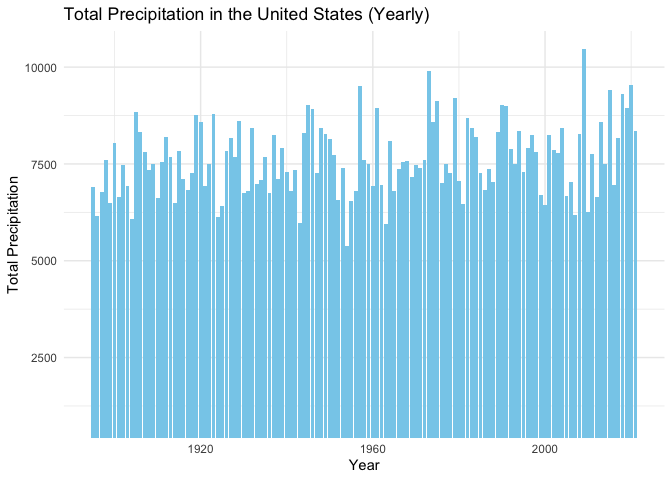<!-- -->

\#1: Plot the data in spaces of 20 years since 1895 to now for entire
country. Note: The dust bowl and another drought occurred in the 50s in
Texas and California, which aligns with the data.

``` r
plot1 <- ggplot(total_precip_year, aes(x = year, y = Total_Precipitation)) +
  geom_bar(stat = "identity", fill = "light green") +
  geom_smooth(method = "lm", se = FALSE, color = "gray", size = 1) +  # Add this line
  labs(title = "Total Annual Precipitation Across the United States",
       x = "Year",
       y = "Precipitation (in inches)") +
  theme_minimal() +
  theme(
  plot.title = element_text(size = 20, vjust = 1.5, hjust = 0.5),
  axis.text.y = element_text(size = rel(1.1)),
  axis.text.x = element_text(size = rel(1.1))
) +
  coord_cartesian(ylim = c(5000, NA)) +
  theme(axis.title.y = element_text(size = 15, vjust = 2, margin = margin(t = 14))) +
theme(axis.title.x = element_text(size = 14, vjust = 2, margin = margin(t = 10)))
```

    ## Warning: Using `size` aesthetic for lines was deprecated in ggplot2 3.4.0.
    ## ℹ Please use `linewidth` instead.
    ## This warning is displayed once every 8 hours.
    ## Call `lifecycle::last_lifecycle_warnings()` to see where this warning was
    ## generated.

``` r
# Save the plot using png
png("plot1.png", width = 10, height = 6, units = "in", res = 300)
print(plot1)
```

    ## `geom_smooth()` using formula = 'y ~ x'

``` r
dev.off()
```

    ## quartz_off_screen 
    ##                 2

Plot 2: plot the data in spaces of 20 years since 1895 to now in one
particular state or in a few rainy states

``` r
#BY YEAR
cumulative_prec_mo <- climate %>% group_by(state, year) %>% summarize(January_sum = sum(January), February_sum = sum(February), March_sum = sum(March), April_sum = sum(April), May_sum = sum(May), June_sum = sum(June), July_sum = sum(July), August_sum = sum(August), September_sum = sum(September), October_sum = sum(October), November_sum = sum(November), December_sum = sum(December))
```

    ## `summarise()` has grouped output by 'state'. You can override using the
    ## `.groups` argument.

``` r
cumulative_prec_mo2 <- cumulative_prec_mo %>%
  rowwise() %>%
  mutate(Annual_sum = sum(January_sum:December_sum))

cumulative_prec_year = cumulative_prec_mo2 %>%
  select(state, year, Annual_sum) %>%
  filter(state %in% c(1, 2), year != 2022)
cumulative_prec_year
```

    ## # A tibble: 254 × 3
    ## # Rowwise:  state
    ##    state  year Annual_sum
    ##    <dbl> <dbl>      <dbl>
    ##  1     1  1895     88118.
    ##  2     1  1896     35662.
    ##  3     1  1897     36470.
    ##  4     1  1898      3399.
    ##  5     1  1899     20622.
    ##  6     1  1900     33858.
    ##  7     1  1901     71097.
    ##  8     1  1902     37263.
    ##  9     1  1903      6796.
    ## 10     1  1904      6454.
    ## # ℹ 244 more rows

``` r
# Assuming 'total_precip_year' is your data frame

# Filter data for Alabama (State 1) from 2005 to 2021
state_1_data <- cumulative_prec_year %>%
  filter(state == 1, year >= 1990 & year <= 2021)

# Create a line plot
plot2 <- ggplot(state_1_data, aes(x = year, y = Annual_sum, group = 1)) +
  geom_line(color = "blue", size = 1.4) +
  labs(title = "Annual Precipitation in Alabama (1990-2021) ",
       x = "Year",
       y = "Precipitation (in inches)") +
  theme_classic() +
  theme(
    plot.title = element_text(size = 20, vjust = 1.5, hjust = 0.5),  # Center the title horizontally
    axis.title.y = element_text(size = 15, vjust = 2.2, margin = margin(t = 32)),
    axis.title.x = element_text(size = 14, vjust = 1.9),  # Adjust the y-axis text size 
    axis.text.y = element_text(size = rel(1.1)),
    axis.text.x = element_text(size = rel(1.1))
  ) +  # Adjust the y-axis text size 
  scale_y_continuous(labels = scales::comma) 


# Save the plot using png
png("plot2.png", width = 10, height = 6, units = "in", res = 300)
print(plot2)
dev.off()
```

    ## quartz_off_screen 
    ##                 2

Plot 3: Line plots for comparing two states (Plot between states 1 and
34 provide an example of a dramatic difference)

``` r
cumulative_prec_mo2
```

    ## # A tibble: 6,242 × 15
    ## # Rowwise:  state
    ##    state  year January_sum February_sum March_sum April_sum May_sum June_sum
    ##    <dbl> <dbl>       <dbl>        <dbl>     <dbl>     <dbl>   <dbl>    <dbl>
    ##  1     1  1895        506.         176.      514.      238.   254.     365. 
    ##  2     1  1896        289.         414.      362.      236.   217.     349. 
    ##  3     1  1897        244.         424.      729.      277.   108.     131. 
    ##  4     1  1898        267.         133.      214.      304.    64.9    246. 
    ##  5     1  1899        415.         435.      435.      173.   136.     184. 
    ##  6     1  1900        220.         582.      398.      578.   172.     672. 
    ##  7     1  1901        337.         297.      432.      342.   365.     220. 
    ##  8     1  1902        248.         467.      639.      157.   164.      95.6
    ##  9     1  1903        241.         712.      377.      190.   425.     318. 
    ## 10     1  1904        283.         274.      255.      157.   201.     215. 
    ## # ℹ 6,232 more rows
    ## # ℹ 7 more variables: July_sum <dbl>, August_sum <dbl>, September_sum <dbl>,
    ## #   October_sum <dbl>, November_sum <dbl>, December_sum <dbl>, Annual_sum <dbl>

``` r
cumulative_prec_year2 = cumulative_prec_mo2 %>%
  select(state, year, Annual_sum) %>%
  filter(state %in% c(9, 14), year != 2022)
cumulative_prec_year2
```

    ## # A tibble: 254 × 3
    ## # Rowwise:  state
    ##    state  year Annual_sum
    ##    <dbl> <dbl>      <dbl>
    ##  1     9  1895    730198.
    ##  2     9  1896     74383.
    ##  3     9  1897     68730.
    ##  4     9  1898    103215.
    ##  5     9  1899    312469.
    ##  6     9  1900    287863.
    ##  7     9  1901    133290.
    ##  8     9  1902    213595.
    ##  9     9  1903     69166.
    ## 10     9  1904     27233.
    ## # ℹ 244 more rows

``` r
# Filter data for Georgia (State 9) and Indiana (State 12) from 1990 to 2021
state_data <- cumulative_prec_year2 %>%
  filter(state %in% c(9, 14), year >= 1990 & year <= 2021)

# Create a line plot
plot3 <- ggplot(state_data, aes(x = year, y = Annual_sum, group = state, color = factor(state))) +
  geom_line(size = 1.3) +
  labs(title = "Annual Precipitation in Georgia and Kansas (1990-2021)",
       x = "Year",
       y = "Total Precipitation (in inches)",
       color = "State") +
  theme_minimal() +  
  theme(
    plot.title = element_text(size = 20, vjust = 1.5, hjust = 0.5),  # Center the title horizontally
    axis.title.y = element_text(size = 14, vjust = 2, margin = margin(t = 102)),
    axis.title.x = element_text(size = 14, vjust = 1.9),  # Adjust the y-axis text size 
    axis.text.y = element_text(size = rel(1.1)),
    axis.text.x = element_text(size = rel(1.1))
  ) +
  scale_color_manual(values = c("9" = "#40E0D0", "14" = "orange"),
                     labels = c("9" = "Georgia", "14" = "Kansas")) +  # Adjust the y-axis text size 
  scale_y_continuous(labels = scales::comma) 

#plot3 <- plot3 + theme(text = element_text(family = "Times New Roman"))


png("plot3.png", width = 10, height = 6, units = "in", res = 300)
print(plot3)
dev.off()
```

    ## quartz_off_screen 
    ##                 2

Plot 4 and Plot 5:

``` r
cumulative_prec_year3 = cumulative_prec_mo2 %>%
  select(state, year, Annual_sum) %>%
  filter(state %in% c(1, 12), year != 2022)

# Filter data for Alabama (State 1) and Indiana (State 2) from 1990 to 2021
state_data <- cumulative_prec_year3 %>%
  filter(state %in% c(1, 12), year >= 2017 & year <= 2021)

# Create a bar plot
plot4 <- ggplot(state_data, aes(x = as.factor(year), y = Annual_sum, fill = factor(state))) +
  geom_bar(stat = "identity", position = "dodge") +
  labs(title = "Annual Precipitation in Alabama and Indiana (2017-2021)",
       x = "Year",
       y = "Total Precipitation (in inches)",
       fill = "State") +
  scale_fill_manual(values = c("lavender", "pink")) +  # Specify your custom colors here
  theme_minimal() +
  theme(
    plot.title = element_text(size = 20, vjust = 1.5, hjust = 0.5),  # Center the title horizontally
    axis.title.y = element_text(size = 13, vjust = 2, margin = margin(t = 102)),
    axis.title.x = element_text(size = 13, vjust = 2.2, margin = margin(t = 6)),  # Adjust the y-axis text size 
    axis.text.y = element_text(size = rel(1.1)),
    axis.text.x = element_text(size = rel(1.1))
  ) +
  scale_fill_manual(values = c("lavender", "pink"), labels = c("1" = "Alabama", "12" = "Indiana"))
```

    ## Scale for fill is already present.
    ## Adding another scale for fill, which will replace the existing scale.

``` r
png("plot4.png", width = 9.5, height = 5.7, units = "in", res = 300)
print(plot4)
dev.off()
```

    ## quartz_off_screen 
    ##                 2

``` r
plot5 <- ggplot(state_data, aes(x = year, y = Annual_sum, fill = factor(state))) +
  geom_area(position = "stack") +
  labs(title = "Annual Precipitation in Alabama and Indiana (2017-2021)",
       x = "Year",
       y = "Total Precipitation (in inches)",
       fill = "State") +
  scale_fill_manual(values = c("lavender", "pink")) +  # Customize colors here
  theme_minimal() +
  theme(
    plot.title = element_text(size = 18, vjust = 1.5, hjust = 0.5),  # Center the title horizontally
    axis.title.y = element_text(size = 13, vjust = 2, margin = margin(t = 102)),
    axis.title.x = element_text(size = 13, vjust = 2.2, margin = margin(t = 6)),  # Adjust the y-axis text size 
    axis.text.y = element_text(size = rel(1.1)),
    axis.text.x = element_text(size = rel(1.1))
  ) +
  scale_fill_manual(values = c("lavender", "pink"), labels = c("1" = "Alabama", "12" = "Indiana"))
```

    ## Scale for fill is already present.
    ## Adding another scale for fill, which will replace the existing scale.

``` r
png("plot5.png", width = 9.4, height = 5.64, units = "in", res = 300)
print(plot5)
dev.off()
```

    ## quartz_off_screen 
    ##                 2

Table 1: From 2017 to 2021, a table of the highest precipitation monnths
with a column stating the precipitation amount and the associated state.

``` r
#Subset the dataset to include only the data from 2017-2021
climate_recent <- climate %>%
                  filter(year == '2017' | year == '2018' | year == '2019' | year == '2020' | year == '2021')
cumulative_prec_mo2 <- climate_recent %>% group_by(state, year) %>% summarize(January = sum(January), February = sum(February), March = sum(March), April = sum(April), May = sum(May), June = sum(June), July = sum(July), August = sum(August), September = sum(September), October = sum(October), November = sum(November), December = sum(December))
```

    ## `summarise()` has grouped output by 'state'. You can override using the
    ## `.groups` argument.

``` r
# Create a table with the top N states for each month
top_states_table <- cumulative_prec_mo2 %>%
  pivot_longer(cols = -c(state, year), names_to = "month", values_to = "precipitation") %>%
  group_by(month) %>%
  top_n(5, wt = precipitation) %>%
  arrange(month, desc(precipitation)) %>%
  ungroup()

colnames(top_states_table) <- c("State", "Year", "Month", "Precipitation")

library(dplyr)
library(gt)

# Mapping between state codes and names
state_mapping <- c("9" = "Georgia", "23" = "Missouri", "41" = "Texas", "44" = "Virginia")

# Replace numeric state codes with names
top_states_table <- top_states_table %>%
  mutate(State = state_mapping[as.character(State)])

# Remove grouping
top_states_table <- top_states_table %>% ungroup()

# Create a summary table
table1 <- top_states_table %>%
  gt() %>%
  cols_label(State = "State", Year = "Year", Month = "Month", Precipitation = "Precipitation") %>%
  cols_move_to_end(Year) %>%
  cols_move_to_end(Precipitation) %>%
  tab_header(
    title = "Highest Precipitation Months Across all States from 2017 to 2021",
    subtitle = "Total Precipitation, in inches"
  ) %>%
  fmt_number(
    columns = vars(Precipitation),  # Replace with actual column names
    decimals = 2
  )
```

    ## Warning: Since gt v0.3.0, `columns = vars(...)` has been deprecated.
    ## • Please use `columns = c(...)` instead.
    ## Since gt v0.3.0, `columns = vars(...)` has been deprecated.
    ## • Please use `columns = c(...)` instead.

``` r
# Display the table
table1
```

<div id="zvvrnavzfv" style="padding-left:0px;padding-right:0px;padding-top:10px;padding-bottom:10px;overflow-x:auto;overflow-y:auto;width:auto;height:auto;">
<style>#zvvrnavzfv table {
  font-family: system-ui, 'Segoe UI', Roboto, Helvetica, Arial, sans-serif, 'Apple Color Emoji', 'Segoe UI Emoji', 'Segoe UI Symbol', 'Noto Color Emoji';
  -webkit-font-smoothing: antialiased;
  -moz-osx-font-smoothing: grayscale;
}
&#10;#zvvrnavzfv thead, #zvvrnavzfv tbody, #zvvrnavzfv tfoot, #zvvrnavzfv tr, #zvvrnavzfv td, #zvvrnavzfv th {
  border-style: none;
}
&#10;#zvvrnavzfv p {
  margin: 0;
  padding: 0;
}
&#10;#zvvrnavzfv .gt_table {
  display: table;
  border-collapse: collapse;
  line-height: normal;
  margin-left: auto;
  margin-right: auto;
  color: #333333;
  font-size: 16px;
  font-weight: normal;
  font-style: normal;
  background-color: #FFFFFF;
  width: auto;
  border-top-style: solid;
  border-top-width: 2px;
  border-top-color: #A8A8A8;
  border-right-style: none;
  border-right-width: 2px;
  border-right-color: #D3D3D3;
  border-bottom-style: solid;
  border-bottom-width: 2px;
  border-bottom-color: #A8A8A8;
  border-left-style: none;
  border-left-width: 2px;
  border-left-color: #D3D3D3;
}
&#10;#zvvrnavzfv .gt_caption {
  padding-top: 4px;
  padding-bottom: 4px;
}
&#10;#zvvrnavzfv .gt_title {
  color: #333333;
  font-size: 125%;
  font-weight: initial;
  padding-top: 4px;
  padding-bottom: 4px;
  padding-left: 5px;
  padding-right: 5px;
  border-bottom-color: #FFFFFF;
  border-bottom-width: 0;
}
&#10;#zvvrnavzfv .gt_subtitle {
  color: #333333;
  font-size: 85%;
  font-weight: initial;
  padding-top: 3px;
  padding-bottom: 5px;
  padding-left: 5px;
  padding-right: 5px;
  border-top-color: #FFFFFF;
  border-top-width: 0;
}
&#10;#zvvrnavzfv .gt_heading {
  background-color: #FFFFFF;
  text-align: center;
  border-bottom-color: #FFFFFF;
  border-left-style: none;
  border-left-width: 1px;
  border-left-color: #D3D3D3;
  border-right-style: none;
  border-right-width: 1px;
  border-right-color: #D3D3D3;
}
&#10;#zvvrnavzfv .gt_bottom_border {
  border-bottom-style: solid;
  border-bottom-width: 2px;
  border-bottom-color: #D3D3D3;
}
&#10;#zvvrnavzfv .gt_col_headings {
  border-top-style: solid;
  border-top-width: 2px;
  border-top-color: #D3D3D3;
  border-bottom-style: solid;
  border-bottom-width: 2px;
  border-bottom-color: #D3D3D3;
  border-left-style: none;
  border-left-width: 1px;
  border-left-color: #D3D3D3;
  border-right-style: none;
  border-right-width: 1px;
  border-right-color: #D3D3D3;
}
&#10;#zvvrnavzfv .gt_col_heading {
  color: #333333;
  background-color: #FFFFFF;
  font-size: 100%;
  font-weight: normal;
  text-transform: inherit;
  border-left-style: none;
  border-left-width: 1px;
  border-left-color: #D3D3D3;
  border-right-style: none;
  border-right-width: 1px;
  border-right-color: #D3D3D3;
  vertical-align: bottom;
  padding-top: 5px;
  padding-bottom: 6px;
  padding-left: 5px;
  padding-right: 5px;
  overflow-x: hidden;
}
&#10;#zvvrnavzfv .gt_column_spanner_outer {
  color: #333333;
  background-color: #FFFFFF;
  font-size: 100%;
  font-weight: normal;
  text-transform: inherit;
  padding-top: 0;
  padding-bottom: 0;
  padding-left: 4px;
  padding-right: 4px;
}
&#10;#zvvrnavzfv .gt_column_spanner_outer:first-child {
  padding-left: 0;
}
&#10;#zvvrnavzfv .gt_column_spanner_outer:last-child {
  padding-right: 0;
}
&#10;#zvvrnavzfv .gt_column_spanner {
  border-bottom-style: solid;
  border-bottom-width: 2px;
  border-bottom-color: #D3D3D3;
  vertical-align: bottom;
  padding-top: 5px;
  padding-bottom: 5px;
  overflow-x: hidden;
  display: inline-block;
  width: 100%;
}
&#10;#zvvrnavzfv .gt_spanner_row {
  border-bottom-style: hidden;
}
&#10;#zvvrnavzfv .gt_group_heading {
  padding-top: 8px;
  padding-bottom: 8px;
  padding-left: 5px;
  padding-right: 5px;
  color: #333333;
  background-color: #FFFFFF;
  font-size: 100%;
  font-weight: initial;
  text-transform: inherit;
  border-top-style: solid;
  border-top-width: 2px;
  border-top-color: #D3D3D3;
  border-bottom-style: solid;
  border-bottom-width: 2px;
  border-bottom-color: #D3D3D3;
  border-left-style: none;
  border-left-width: 1px;
  border-left-color: #D3D3D3;
  border-right-style: none;
  border-right-width: 1px;
  border-right-color: #D3D3D3;
  vertical-align: middle;
  text-align: left;
}
&#10;#zvvrnavzfv .gt_empty_group_heading {
  padding: 0.5px;
  color: #333333;
  background-color: #FFFFFF;
  font-size: 100%;
  font-weight: initial;
  border-top-style: solid;
  border-top-width: 2px;
  border-top-color: #D3D3D3;
  border-bottom-style: solid;
  border-bottom-width: 2px;
  border-bottom-color: #D3D3D3;
  vertical-align: middle;
}
&#10;#zvvrnavzfv .gt_from_md > :first-child {
  margin-top: 0;
}
&#10;#zvvrnavzfv .gt_from_md > :last-child {
  margin-bottom: 0;
}
&#10;#zvvrnavzfv .gt_row {
  padding-top: 8px;
  padding-bottom: 8px;
  padding-left: 5px;
  padding-right: 5px;
  margin: 10px;
  border-top-style: solid;
  border-top-width: 1px;
  border-top-color: #D3D3D3;
  border-left-style: none;
  border-left-width: 1px;
  border-left-color: #D3D3D3;
  border-right-style: none;
  border-right-width: 1px;
  border-right-color: #D3D3D3;
  vertical-align: middle;
  overflow-x: hidden;
}
&#10;#zvvrnavzfv .gt_stub {
  color: #333333;
  background-color: #FFFFFF;
  font-size: 100%;
  font-weight: initial;
  text-transform: inherit;
  border-right-style: solid;
  border-right-width: 2px;
  border-right-color: #D3D3D3;
  padding-left: 5px;
  padding-right: 5px;
}
&#10;#zvvrnavzfv .gt_stub_row_group {
  color: #333333;
  background-color: #FFFFFF;
  font-size: 100%;
  font-weight: initial;
  text-transform: inherit;
  border-right-style: solid;
  border-right-width: 2px;
  border-right-color: #D3D3D3;
  padding-left: 5px;
  padding-right: 5px;
  vertical-align: top;
}
&#10;#zvvrnavzfv .gt_row_group_first td {
  border-top-width: 2px;
}
&#10;#zvvrnavzfv .gt_row_group_first th {
  border-top-width: 2px;
}
&#10;#zvvrnavzfv .gt_summary_row {
  color: #333333;
  background-color: #FFFFFF;
  text-transform: inherit;
  padding-top: 8px;
  padding-bottom: 8px;
  padding-left: 5px;
  padding-right: 5px;
}
&#10;#zvvrnavzfv .gt_first_summary_row {
  border-top-style: solid;
  border-top-color: #D3D3D3;
}
&#10;#zvvrnavzfv .gt_first_summary_row.thick {
  border-top-width: 2px;
}
&#10;#zvvrnavzfv .gt_last_summary_row {
  padding-top: 8px;
  padding-bottom: 8px;
  padding-left: 5px;
  padding-right: 5px;
  border-bottom-style: solid;
  border-bottom-width: 2px;
  border-bottom-color: #D3D3D3;
}
&#10;#zvvrnavzfv .gt_grand_summary_row {
  color: #333333;
  background-color: #FFFFFF;
  text-transform: inherit;
  padding-top: 8px;
  padding-bottom: 8px;
  padding-left: 5px;
  padding-right: 5px;
}
&#10;#zvvrnavzfv .gt_first_grand_summary_row {
  padding-top: 8px;
  padding-bottom: 8px;
  padding-left: 5px;
  padding-right: 5px;
  border-top-style: double;
  border-top-width: 6px;
  border-top-color: #D3D3D3;
}
&#10;#zvvrnavzfv .gt_last_grand_summary_row_top {
  padding-top: 8px;
  padding-bottom: 8px;
  padding-left: 5px;
  padding-right: 5px;
  border-bottom-style: double;
  border-bottom-width: 6px;
  border-bottom-color: #D3D3D3;
}
&#10;#zvvrnavzfv .gt_striped {
  background-color: rgba(128, 128, 128, 0.05);
}
&#10;#zvvrnavzfv .gt_table_body {
  border-top-style: solid;
  border-top-width: 2px;
  border-top-color: #D3D3D3;
  border-bottom-style: solid;
  border-bottom-width: 2px;
  border-bottom-color: #D3D3D3;
}
&#10;#zvvrnavzfv .gt_footnotes {
  color: #333333;
  background-color: #FFFFFF;
  border-bottom-style: none;
  border-bottom-width: 2px;
  border-bottom-color: #D3D3D3;
  border-left-style: none;
  border-left-width: 2px;
  border-left-color: #D3D3D3;
  border-right-style: none;
  border-right-width: 2px;
  border-right-color: #D3D3D3;
}
&#10;#zvvrnavzfv .gt_footnote {
  margin: 0px;
  font-size: 90%;
  padding-top: 4px;
  padding-bottom: 4px;
  padding-left: 5px;
  padding-right: 5px;
}
&#10;#zvvrnavzfv .gt_sourcenotes {
  color: #333333;
  background-color: #FFFFFF;
  border-bottom-style: none;
  border-bottom-width: 2px;
  border-bottom-color: #D3D3D3;
  border-left-style: none;
  border-left-width: 2px;
  border-left-color: #D3D3D3;
  border-right-style: none;
  border-right-width: 2px;
  border-right-color: #D3D3D3;
}
&#10;#zvvrnavzfv .gt_sourcenote {
  font-size: 90%;
  padding-top: 4px;
  padding-bottom: 4px;
  padding-left: 5px;
  padding-right: 5px;
}
&#10;#zvvrnavzfv .gt_left {
  text-align: left;
}
&#10;#zvvrnavzfv .gt_center {
  text-align: center;
}
&#10;#zvvrnavzfv .gt_right {
  text-align: right;
  font-variant-numeric: tabular-nums;
}
&#10;#zvvrnavzfv .gt_font_normal {
  font-weight: normal;
}
&#10;#zvvrnavzfv .gt_font_bold {
  font-weight: bold;
}
&#10;#zvvrnavzfv .gt_font_italic {
  font-style: italic;
}
&#10;#zvvrnavzfv .gt_super {
  font-size: 65%;
}
&#10;#zvvrnavzfv .gt_footnote_marks {
  font-size: 75%;
  vertical-align: 0.4em;
  position: initial;
}
&#10;#zvvrnavzfv .gt_asterisk {
  font-size: 100%;
  vertical-align: 0;
}
&#10;#zvvrnavzfv .gt_indent_1 {
  text-indent: 5px;
}
&#10;#zvvrnavzfv .gt_indent_2 {
  text-indent: 10px;
}
&#10;#zvvrnavzfv .gt_indent_3 {
  text-indent: 15px;
}
&#10;#zvvrnavzfv .gt_indent_4 {
  text-indent: 20px;
}
&#10;#zvvrnavzfv .gt_indent_5 {
  text-indent: 25px;
}
</style>
<table class="gt_table" data-quarto-disable-processing="false" data-quarto-bootstrap="false">
  <thead>
    <tr class="gt_heading">
      <td colspan="4" class="gt_heading gt_title gt_font_normal" style>Highest Precipitation Months Across all States from 2017 to 2021</td>
    </tr>
    <tr class="gt_heading">
      <td colspan="4" class="gt_heading gt_subtitle gt_font_normal gt_bottom_border" style>Total Precipitation, in inches</td>
    </tr>
    <tr class="gt_col_headings">
      <th class="gt_col_heading gt_columns_bottom_border gt_left" rowspan="1" colspan="1" scope="col" id="State">State</th>
      <th class="gt_col_heading gt_columns_bottom_border gt_left" rowspan="1" colspan="1" scope="col" id="Month">Month</th>
      <th class="gt_col_heading gt_columns_bottom_border gt_right" rowspan="1" colspan="1" scope="col" id="Year">Year</th>
      <th class="gt_col_heading gt_columns_bottom_border gt_right" rowspan="1" colspan="1" scope="col" id="Precipitation">Precipitation</th>
    </tr>
  </thead>
  <tbody class="gt_table_body">
    <tr><td headers="State" class="gt_row gt_left">Georgia</td>
<td headers="Month" class="gt_row gt_left">April</td>
<td headers="Year" class="gt_row gt_right">2020</td>
<td headers="Precipitation" class="gt_row gt_right">1,203.38</td></tr>
    <tr><td headers="State" class="gt_row gt_left">Missouri</td>
<td headers="Month" class="gt_row gt_left">April</td>
<td headers="Year" class="gt_row gt_right">2017</td>
<td headers="Precipitation" class="gt_row gt_right">1,064.48</td></tr>
    <tr><td headers="State" class="gt_row gt_left">Texas</td>
<td headers="Month" class="gt_row gt_left">April</td>
<td headers="Year" class="gt_row gt_right">2019</td>
<td headers="Precipitation" class="gt_row gt_right">1,041.52</td></tr>
    <tr><td headers="State" class="gt_row gt_left">Texas</td>
<td headers="Month" class="gt_row gt_left">April</td>
<td headers="Year" class="gt_row gt_right">2017</td>
<td headers="Precipitation" class="gt_row gt_right">781.66</td></tr>
    <tr><td headers="State" class="gt_row gt_left">Virginia</td>
<td headers="Month" class="gt_row gt_left">April</td>
<td headers="Year" class="gt_row gt_right">2020</td>
<td headers="Precipitation" class="gt_row gt_right">765.87</td></tr>
    <tr><td headers="State" class="gt_row gt_left">Texas</td>
<td headers="Month" class="gt_row gt_left">August</td>
<td headers="Year" class="gt_row gt_right">2017</td>
<td headers="Precipitation" class="gt_row gt_right">2,021.36</td></tr>
    <tr><td headers="State" class="gt_row gt_left">Virginia</td>
<td headers="Month" class="gt_row gt_left">August</td>
<td headers="Year" class="gt_row gt_right">2020</td>
<td headers="Precipitation" class="gt_row gt_right">1,131.17</td></tr>
    <tr><td headers="State" class="gt_row gt_left">Georgia</td>
<td headers="Month" class="gt_row gt_left">August</td>
<td headers="Year" class="gt_row gt_right">2020</td>
<td headers="Precipitation" class="gt_row gt_right">1,093.32</td></tr>
    <tr><td headers="State" class="gt_row gt_left">Georgia</td>
<td headers="Month" class="gt_row gt_left">August</td>
<td headers="Year" class="gt_row gt_right">2021</td>
<td headers="Precipitation" class="gt_row gt_right">1,073.99</td></tr>
    <tr><td headers="State" class="gt_row gt_left">Georgia</td>
<td headers="Month" class="gt_row gt_left">August</td>
<td headers="Year" class="gt_row gt_right">2018</td>
<td headers="Precipitation" class="gt_row gt_right">888.37</td></tr>
    <tr><td headers="State" class="gt_row gt_left">Georgia</td>
<td headers="Month" class="gt_row gt_left">December</td>
<td headers="Year" class="gt_row gt_right">2018</td>
<td headers="Precipitation" class="gt_row gt_right">1,560.62</td></tr>
    <tr><td headers="State" class="gt_row gt_left">Georgia</td>
<td headers="Month" class="gt_row gt_left">December</td>
<td headers="Year" class="gt_row gt_right">2019</td>
<td headers="Precipitation" class="gt_row gt_right">1,053.34</td></tr>
    <tr><td headers="State" class="gt_row gt_left">Texas</td>
<td headers="Month" class="gt_row gt_left">December</td>
<td headers="Year" class="gt_row gt_right">2018</td>
<td headers="Precipitation" class="gt_row gt_right">991.77</td></tr>
    <tr><td headers="State" class="gt_row gt_left">NA</td>
<td headers="Month" class="gt_row gt_left">December</td>
<td headers="Year" class="gt_row gt_right">2019</td>
<td headers="Precipitation" class="gt_row gt_right">725.63</td></tr>
    <tr><td headers="State" class="gt_row gt_left">NA</td>
<td headers="Month" class="gt_row gt_left">December</td>
<td headers="Year" class="gt_row gt_right">2018</td>
<td headers="Precipitation" class="gt_row gt_right">710.90</td></tr>
    <tr><td headers="State" class="gt_row gt_left">Georgia</td>
<td headers="Month" class="gt_row gt_left">February</td>
<td headers="Year" class="gt_row gt_right">2020</td>
<td headers="Precipitation" class="gt_row gt_right">1,464.27</td></tr>
    <tr><td headers="State" class="gt_row gt_left">NA</td>
<td headers="Month" class="gt_row gt_left">February</td>
<td headers="Year" class="gt_row gt_right">2019</td>
<td headers="Precipitation" class="gt_row gt_right">1,147.77</td></tr>
    <tr><td headers="State" class="gt_row gt_left">NA</td>
<td headers="Month" class="gt_row gt_left">February</td>
<td headers="Year" class="gt_row gt_right">2019</td>
<td headers="Precipitation" class="gt_row gt_right">1,096.22</td></tr>
    <tr><td headers="State" class="gt_row gt_left">NA</td>
<td headers="Month" class="gt_row gt_left">February</td>
<td headers="Year" class="gt_row gt_right">2018</td>
<td headers="Precipitation" class="gt_row gt_right">1,073.79</td></tr>
    <tr><td headers="State" class="gt_row gt_left">NA</td>
<td headers="Month" class="gt_row gt_left">February</td>
<td headers="Year" class="gt_row gt_right">2018</td>
<td headers="Precipitation" class="gt_row gt_right">997.11</td></tr>
    <tr><td headers="State" class="gt_row gt_left">Georgia</td>
<td headers="Month" class="gt_row gt_left">January</td>
<td headers="Year" class="gt_row gt_right">2017</td>
<td headers="Precipitation" class="gt_row gt_right">1,236.57</td></tr>
    <tr><td headers="State" class="gt_row gt_left">Georgia</td>
<td headers="Month" class="gt_row gt_left">January</td>
<td headers="Year" class="gt_row gt_right">2020</td>
<td headers="Precipitation" class="gt_row gt_right">849.73</td></tr>
    <tr><td headers="State" class="gt_row gt_left">Georgia</td>
<td headers="Month" class="gt_row gt_left">January</td>
<td headers="Year" class="gt_row gt_right">2019</td>
<td headers="Precipitation" class="gt_row gt_right">817.89</td></tr>
    <tr><td headers="State" class="gt_row gt_left">NA</td>
<td headers="Month" class="gt_row gt_left">January</td>
<td headers="Year" class="gt_row gt_right">2017</td>
<td headers="Precipitation" class="gt_row gt_right">756.68</td></tr>
    <tr><td headers="State" class="gt_row gt_left">Georgia</td>
<td headers="Month" class="gt_row gt_left">January</td>
<td headers="Year" class="gt_row gt_right">2021</td>
<td headers="Precipitation" class="gt_row gt_right">726.27</td></tr>
    <tr><td headers="State" class="gt_row gt_left">Georgia</td>
<td headers="Month" class="gt_row gt_left">July</td>
<td headers="Year" class="gt_row gt_right">2021</td>
<td headers="Precipitation" class="gt_row gt_right">1,128.18</td></tr>
    <tr><td headers="State" class="gt_row gt_left">Texas</td>
<td headers="Month" class="gt_row gt_left">July</td>
<td headers="Year" class="gt_row gt_right">2021</td>
<td headers="Precipitation" class="gt_row gt_right">1,092.45</td></tr>
    <tr><td headers="State" class="gt_row gt_left">Georgia</td>
<td headers="Month" class="gt_row gt_left">July</td>
<td headers="Year" class="gt_row gt_right">2018</td>
<td headers="Precipitation" class="gt_row gt_right">966.79</td></tr>
    <tr><td headers="State" class="gt_row gt_left">Virginia</td>
<td headers="Month" class="gt_row gt_left">July</td>
<td headers="Year" class="gt_row gt_right">2018</td>
<td headers="Precipitation" class="gt_row gt_right">770.55</td></tr>
    <tr><td headers="State" class="gt_row gt_left">NA</td>
<td headers="Month" class="gt_row gt_left">July</td>
<td headers="Year" class="gt_row gt_right">2021</td>
<td headers="Precipitation" class="gt_row gt_right">758.83</td></tr>
    <tr><td headers="State" class="gt_row gt_left">Texas</td>
<td headers="Month" class="gt_row gt_left">June</td>
<td headers="Year" class="gt_row gt_right">2019</td>
<td headers="Precipitation" class="gt_row gt_right">1,178.77</td></tr>
    <tr><td headers="State" class="gt_row gt_left">Texas</td>
<td headers="Month" class="gt_row gt_left">June</td>
<td headers="Year" class="gt_row gt_right">2021</td>
<td headers="Precipitation" class="gt_row gt_right">1,095.78</td></tr>
    <tr><td headers="State" class="gt_row gt_left">Georgia</td>
<td headers="Month" class="gt_row gt_left">June</td>
<td headers="Year" class="gt_row gt_right">2017</td>
<td headers="Precipitation" class="gt_row gt_right">1,002.98</td></tr>
    <tr><td headers="State" class="gt_row gt_left">Georgia</td>
<td headers="Month" class="gt_row gt_left">June</td>
<td headers="Year" class="gt_row gt_right">2021</td>
<td headers="Precipitation" class="gt_row gt_right">969.33</td></tr>
    <tr><td headers="State" class="gt_row gt_left">NA</td>
<td headers="Month" class="gt_row gt_left">June</td>
<td headers="Year" class="gt_row gt_right">2019</td>
<td headers="Precipitation" class="gt_row gt_right">966.30</td></tr>
    <tr><td headers="State" class="gt_row gt_left">NA</td>
<td headers="Month" class="gt_row gt_left">March</td>
<td headers="Year" class="gt_row gt_right">2021</td>
<td headers="Precipitation" class="gt_row gt_right">955.73</td></tr>
    <tr><td headers="State" class="gt_row gt_left">Texas</td>
<td headers="Month" class="gt_row gt_left">March</td>
<td headers="Year" class="gt_row gt_right">2020</td>
<td headers="Precipitation" class="gt_row gt_right">907.27</td></tr>
    <tr><td headers="State" class="gt_row gt_left">Georgia</td>
<td headers="Month" class="gt_row gt_left">March</td>
<td headers="Year" class="gt_row gt_right">2020</td>
<td headers="Precipitation" class="gt_row gt_right">881.28</td></tr>
    <tr><td headers="State" class="gt_row gt_left">Georgia</td>
<td headers="Month" class="gt_row gt_left">March</td>
<td headers="Year" class="gt_row gt_right">2021</td>
<td headers="Precipitation" class="gt_row gt_right">795.34</td></tr>
    <tr><td headers="State" class="gt_row gt_left">NA</td>
<td headers="Month" class="gt_row gt_left">March</td>
<td headers="Year" class="gt_row gt_right">2020</td>
<td headers="Precipitation" class="gt_row gt_right">794.79</td></tr>
    <tr><td headers="State" class="gt_row gt_left">Texas</td>
<td headers="Month" class="gt_row gt_left">May</td>
<td headers="Year" class="gt_row gt_right">2021</td>
<td headers="Precipitation" class="gt_row gt_right">1,813.44</td></tr>
    <tr><td headers="State" class="gt_row gt_left">Texas</td>
<td headers="Month" class="gt_row gt_left">May</td>
<td headers="Year" class="gt_row gt_right">2019</td>
<td headers="Precipitation" class="gt_row gt_right">1,523.56</td></tr>
    <tr><td headers="State" class="gt_row gt_left">Missouri</td>
<td headers="Month" class="gt_row gt_left">May</td>
<td headers="Year" class="gt_row gt_right">2019</td>
<td headers="Precipitation" class="gt_row gt_right">1,189.25</td></tr>
    <tr><td headers="State" class="gt_row gt_left">NA</td>
<td headers="Month" class="gt_row gt_left">May</td>
<td headers="Year" class="gt_row gt_right">2019</td>
<td headers="Precipitation" class="gt_row gt_right">1,126.41</td></tr>
    <tr><td headers="State" class="gt_row gt_left">Georgia</td>
<td headers="Month" class="gt_row gt_left">May</td>
<td headers="Year" class="gt_row gt_right">2018</td>
<td headers="Precipitation" class="gt_row gt_right">1,062.55</td></tr>
    <tr><td headers="State" class="gt_row gt_left">Georgia</td>
<td headers="Month" class="gt_row gt_left">November</td>
<td headers="Year" class="gt_row gt_right">2018</td>
<td headers="Precipitation" class="gt_row gt_right">1,025.34</td></tr>
    <tr><td headers="State" class="gt_row gt_left">Virginia</td>
<td headers="Month" class="gt_row gt_left">November</td>
<td headers="Year" class="gt_row gt_right">2018</td>
<td headers="Precipitation" class="gt_row gt_right">791.80</td></tr>
    <tr><td headers="State" class="gt_row gt_left">NA</td>
<td headers="Month" class="gt_row gt_left">November</td>
<td headers="Year" class="gt_row gt_right">2018</td>
<td headers="Precipitation" class="gt_row gt_right">692.08</td></tr>
    <tr><td headers="State" class="gt_row gt_left">Virginia</td>
<td headers="Month" class="gt_row gt_left">November</td>
<td headers="Year" class="gt_row gt_right">2020</td>
<td headers="Precipitation" class="gt_row gt_right">676.34</td></tr>
    <tr><td headers="State" class="gt_row gt_left">NA</td>
<td headers="Month" class="gt_row gt_left">November</td>
<td headers="Year" class="gt_row gt_right">2018</td>
<td headers="Precipitation" class="gt_row gt_right">640.54</td></tr>
    <tr><td headers="State" class="gt_row gt_left">Texas</td>
<td headers="Month" class="gt_row gt_left">October</td>
<td headers="Year" class="gt_row gt_right">2018</td>
<td headers="Precipitation" class="gt_row gt_right">1,880.99</td></tr>
    <tr><td headers="State" class="gt_row gt_left">Georgia</td>
<td headers="Month" class="gt_row gt_left">October</td>
<td headers="Year" class="gt_row gt_right">2019</td>
<td headers="Precipitation" class="gt_row gt_right">873.26</td></tr>
    <tr><td headers="State" class="gt_row gt_left">NA</td>
<td headers="Month" class="gt_row gt_left">October</td>
<td headers="Year" class="gt_row gt_right">2019</td>
<td headers="Precipitation" class="gt_row gt_right">828.21</td></tr>
    <tr><td headers="State" class="gt_row gt_left">Texas</td>
<td headers="Month" class="gt_row gt_left">October</td>
<td headers="Year" class="gt_row gt_right">2019</td>
<td headers="Precipitation" class="gt_row gt_right">786.16</td></tr>
    <tr><td headers="State" class="gt_row gt_left">NA</td>
<td headers="Month" class="gt_row gt_left">October</td>
<td headers="Year" class="gt_row gt_right">2019</td>
<td headers="Precipitation" class="gt_row gt_right">755.84</td></tr>
    <tr><td headers="State" class="gt_row gt_left">Texas</td>
<td headers="Month" class="gt_row gt_left">September</td>
<td headers="Year" class="gt_row gt_right">2018</td>
<td headers="Precipitation" class="gt_row gt_right">1,830.13</td></tr>
    <tr><td headers="State" class="gt_row gt_left">Texas</td>
<td headers="Month" class="gt_row gt_left">September</td>
<td headers="Year" class="gt_row gt_right">2020</td>
<td headers="Precipitation" class="gt_row gt_right">1,171.90</td></tr>
    <tr><td headers="State" class="gt_row gt_left">Georgia</td>
<td headers="Month" class="gt_row gt_left">September</td>
<td headers="Year" class="gt_row gt_right">2020</td>
<td headers="Precipitation" class="gt_row gt_right">1,048.34</td></tr>
    <tr><td headers="State" class="gt_row gt_left">NA</td>
<td headers="Month" class="gt_row gt_left">September</td>
<td headers="Year" class="gt_row gt_right">2018</td>
<td headers="Precipitation" class="gt_row gt_right">1,005.99</td></tr>
    <tr><td headers="State" class="gt_row gt_left">Virginia</td>
<td headers="Month" class="gt_row gt_left">September</td>
<td headers="Year" class="gt_row gt_right">2018</td>
<td headers="Precipitation" class="gt_row gt_right">1,005.22</td></tr>
  </tbody>
  &#10;  
</table>
</div>

``` r
table1_subset <- head(top_states_table, n = 8)
  
  # Get the first 8 rows
table1_subset <- head(top_states_table, n = 8)

# Create a summary table
table1 <- table1_subset %>%
  gt() %>%
  cols_label(State = "State", Year = "Year", Month = "Month", Precipitation = "Precipitation") %>%
  cols_move_to_end(Year) %>%
  cols_move_to_end(Precipitation) %>%
  tab_header(
    title = "Highest Precipitation Months Across all States from 2017 to 2021",
    subtitle = "Total Precipitation, in inches"
  ) %>%
  fmt_number(
    columns = vars(Precipitation),  # Replace with actual column names
    decimals = 2
  )
```

    ## Warning: Since gt v0.3.0, `columns = vars(...)` has been deprecated.
    ## • Please use `columns = c(...)` instead.
    ## Since gt v0.3.0, `columns = vars(...)` has been deprecated.
    ## • Please use `columns = c(...)` instead.

``` r
#doesntn work
#gtsave(table1_gtsummary %>% slice_head(n = 8), file = "summary_table.png", path = getwd())
```

Plot 6: Line plot of five states in the same region from 2017 to 2021
with a line graph (a particularly rainy subset)

``` r
cumulative_prec_mo2 <- cumulative_prec_mo %>%
  rowwise() %>%
  mutate(Annual_sum = sum(January_sum:December_sum))

cumulative_prec_year2 = cumulative_prec_mo2 %>%
  select(state, year, Annual_sum) %>%
  filter(state %in% c(8, 1, 16, 38, 9, 40, 26, 42, 2, 5), year != 2022)
cumulative_prec_year2
```

    ## # A tibble: 1,270 × 3
    ## # Rowwise:  state
    ##    state  year Annual_sum
    ##    <dbl> <dbl>      <dbl>
    ##  1     1  1895     88118.
    ##  2     1  1896     35662.
    ##  3     1  1897     36470.
    ##  4     1  1898      3399.
    ##  5     1  1899     20622.
    ##  6     1  1900     33858.
    ##  7     1  1901     71097.
    ##  8     1  1902     37263.
    ##  9     1  1903      6796.
    ## 10     1  1904      6454.
    ## # ℹ 1,260 more rows

``` r
# Filter data for Georgia (State 9) and Indiana (State 12) from 1990 to 2021
state_data <- cumulative_prec_year2 %>%
  filter(state %in% c(8, 1, 16, 38, 9, 40, 26, 42, 2, 5), year >= 1990 & year <= 2021)

# Create a line plot
plot6 <- ggplot(state_data, aes(x = year, y = Annual_sum, group = state, color = factor(state))) +
  geom_line() +
  labs(title = "Precipitation in Southeastern (Blue) and Southwestern (Red) States (1990-2021)",
       x = "Year",
       y = "Total Precipitation (in inches)",
       color = "State") +
  theme_minimal() +  
  theme(
    plot.title = element_text(size = 14, vjust = -3, hjust = 0.5),  # Center the title horizontally
    axis.title.y = element_text(size = 13, vjust = 1.1, margin = margin(r = 10)),
    axis.title.x = element_text(size = 12, vjust = 2.2, margin = margin(t = 3)),  # Adjust the y-axis text size 
    axis.text.y = element_text(size = rel(1.1)),
    axis.text.x = element_text(size = rel(1.1))
  ) +
  scale_color_manual(values = c("9" = "blue", "8" = "blue", "1" = "blue", "16" = "blue", "38" = "blue", "40" = "blue", "26" = "red", "42" = "red", "2" = "red", "5" = "red"),
                     labels = c("9" = "Georgia", "8" = "Florida", "1" = "Alabama", "16" = "Louisiana", "38" = "South Carolina", "40" = "Tennessee", "26" = "Nevada", "42" = "Utah", "2" = "Arizona", "5" = "Colorado")) +   
  scale_y_continuous(labels = scales::comma) 

png("plot6.png", width = 9.3, height = 5.58, units = "in", res = 300)
print(plot6)
dev.off()
```

    ## quartz_off_screen 
    ##                 2

``` r
#8 florida, 1 alabama, 16 louisiana, 38 south carolina , 9 georgia, 40 tennessee 
#driest Nevada 26, Utah 42, arizona 2, colorado 5
```

Plot 7: Boxplot comparison of Southeast and Southwest regions of the US
from 2017 to 2021

``` r
library(ggridges)
library(dplyr)

# Assuming you have a data frame named `precipitation_data` with columns like "State" and "Precipitation"
# Assuming you have a mapping of states to regions in a data frame named `state_region_mapping`

cumulative_prec_mo2
```

    ## # A tibble: 6,242 × 15
    ## # Rowwise:  state
    ##    state  year January_sum February_sum March_sum April_sum May_sum June_sum
    ##    <dbl> <dbl>       <dbl>        <dbl>     <dbl>     <dbl>   <dbl>    <dbl>
    ##  1     1  1895        506.         176.      514.      238.   254.     365. 
    ##  2     1  1896        289.         414.      362.      236.   217.     349. 
    ##  3     1  1897        244.         424.      729.      277.   108.     131. 
    ##  4     1  1898        267.         133.      214.      304.    64.9    246. 
    ##  5     1  1899        415.         435.      435.      173.   136.     184. 
    ##  6     1  1900        220.         582.      398.      578.   172.     672. 
    ##  7     1  1901        337.         297.      432.      342.   365.     220. 
    ##  8     1  1902        248.         467.      639.      157.   164.      95.6
    ##  9     1  1903        241.         712.      377.      190.   425.     318. 
    ## 10     1  1904        283.         274.      255.      157.   201.     215. 
    ## # ℹ 6,232 more rows
    ## # ℹ 7 more variables: July_sum <dbl>, August_sum <dbl>, September_sum <dbl>,
    ## #   October_sum <dbl>, November_sum <dbl>, December_sum <dbl>, Annual_sum <dbl>

``` r
cumulative_prec_mo22 <- cumulative_prec_mo2 %>%
                  filter(year == '2017' | year == '2018' | year == '2019' | year == '2020' | year == '2021')


# Example state to region mapping
state_region_mapping <- data.frame(
  state = c(8, 1, 16, 38, 9, 40, 26, 42, 2, 5),
  Region = c("Southeast", "Southeast", "Southeast", "Southeast", "Southeast", "Southeast", "Southwest", "Southwest", "Southwest", "Southwest")
)

#8 florida, 1 alabama, 16 louisiana, 38 south carolina , 9 georgia, 40 tennessee 
#driest Nevada 26, Utah 42, arizona 2, colorado 5

# Merge precipitation_data with state_region_mapping
precipitation_data <- cumulative_prec_mo22 %>%
  left_join(state_region_mapping, by = "state")

subset_data <- precipitation_data %>%
  filter(Region %in% c("Southwest", "Southeast"), year != 2022)


subset_data_west <- subset_data[subset_data$Region == "Southwest", ]
subset_data_east <- subset_data[subset_data$Region == "Southeast", ]

# Create a box plot
plot7 <- boxplot(Annual_sum ~ Region, data = subset_data, 
        ylim = c(0, 150000),
        col = c("lightcoral", "blue"),  # Set colors for West and East, respectively
        main = "Total Annual Precipitation Across US Southwest and Southeast Regions, 2017-2021",
        xlab = "Region",
        ylab = "Precipitation (inches)")
```

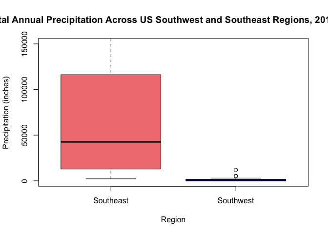<!-- -->

``` r
png("plot7.png", width = 9.3, height = 5.58, units = "in", res = 300)
print(plot7)
```

    ## $stats
    ##           [,1]     [,2]
    ## [1,]   2173.45    9.670
    ## [2,]  12863.78   60.450
    ## [3,]  42603.54  350.015
    ## [4,] 116240.60 1722.230
    ## [5,] 235328.04 2951.640
    ## 
    ## $n
    ## [1] 30 20
    ## 
    ## $conf
    ##          [,1]      [,2]
    ## [1,] 12782.72 -237.0898
    ## [2,] 72424.36  937.1198
    ## 
    ## $out
    ## [1]  635085.39 1113685.30   11884.80    4977.36    5337.16
    ## 
    ## $group
    ## [1] 1 1 2 2 2
    ## 
    ## $names
    ## [1] "Southeast" "Southwest"

``` r
dev.off()
```

    ## quartz_off_screen 
    ##                 2

``` r
plot7 <- ggplot(subset_data, aes(x = Region, y = Annual_sum, fill = Region)) +
  geom_boxplot() +
  ylim(0, 150000) +
  labs(
    title = "Total Annual Precipitation Across US Southwest and Southeast Regions, 2017-2021",
    x = "Region",
    y = "Precipitation (inches)"
  ) +
  coord_cartesian(ylim = c(0, 120000)) +  # Limit the y-axis range
  theme_minimal()

# Save the ggplot as a PNG file
png("plot7.png", width = 9.3, height = 5.58, units = "in", res = 300)
print(plot7)
```

    ## Warning: Removed 7 rows containing non-finite values (`stat_boxplot()`).

``` r
dev.off()
```

    ## quartz_off_screen 
    ##                 2

Plot 8:

``` r
library(leaflet)
library(rnaturalearth)
```

    ## The legacy packages maptools, rgdal, and rgeos, underpinning the sp package,
    ## which was just loaded, were retired in October 2023.
    ## Please refer to R-spatial evolution reports for details, especially
    ## https://r-spatial.org/r/2023/05/15/evolution4.html.
    ## It may be desirable to make the sf package available;
    ## package maintainers should consider adding sf to Suggests:.

    ## Support for Spatial objects (`sp`) will be deprecated in {rnaturalearth} and will be removed in a future release of the package. Please use `sf` objects with {rnaturalearth}. For example: `ne_download(returnclass = 'sf')`

``` r
library(sf)
```

    ## Linking to GEOS 3.11.0, GDAL 3.5.3, PROJ 9.1.0; sf_use_s2() is TRUE

``` r
cumulative_prec_mo <- climate_recent %>% group_by(year, state)  %>% summarize(January_sum = sum(January), February_sum = sum(February), March_sum = sum(March), April_sum = sum(April), May_sum = sum(May), June_sum = sum(June), July_sum = sum(July), August_sum = sum(August), September_sum = sum(September), October_sum = sum(October), November_sum = sum(November), December_sum = sum(December))
```

    ## `summarise()` has grouped output by 'year'. You can override using the
    ## `.groups` argument.

``` r
cumulative_prec_mo2 <- cumulative_prec_mo %>%
  rowwise() %>%
  mutate(Annual_sum = sum(January_sum:December_sum))

cumulative_prec_mo2 = cumulative_prec_mo2 %>% filter(year == 2017)

#Figure out values for breaks
quantiles <- quantile(cumulative_prec_mo2$Annual_sum, probs = seq(0, 1, 1/3))

# Print the quantile values
print(quantiles)
```

    ##        0% 33.33333% 66.66667%      100% 
    ##     36.54   3785.50  17825.72 635085.39

``` r
# Load U.S. states data
us_states <- ne_states(country = "united states of america", returnclass = "sf")

# Assuming your precipitation data is in a column named "precipitation"
# You can adjust the breaks and labels based on your data distribution
breaks <- c(0, 3785.50, 17825.72, Inf)
labels <- c("Low", "Moderate", "High")

# Create a new column "Category" based on precipitation levels
cumulative_prec_mo2$Category <- cut(cumulative_prec_mo2$Annual_sum, breaks = breaks, labels = labels, include.lowest = TRUE)

#Add name column
cumulative_prec_mo2$name <- c("Alabama", "Arizona", "Arkansas", "California", "Colorado", "Connecticut", "Delaware", "Florida", "Georgia", "Idaho", "Illinois", "Indiana", "Iowa", "Kansas", "Kentucky", "Louisiana", "Maine", "Maryland", "Massachusetts", "Michigan", "Minnesota", "Mississippi", "Missouri", "Montana", "Nebraska", "Nevada", "New Hampshire", "New Jersey", "New Mexico", "New York", "North Carolina", "North Dakota", "Ohio", "Oklahoma", "Oregon", "Pennsylvania", "Rhode Island", "South Carolina", "South Dakota", "Tennessee", "Texas", "Utah", "Vermont", "Virginia", "Washington", "West Virginia", "Wisconsin", "Wyoming", "Alaska")

# Merge the cumulative_prec_mo2 data with U.S. states data
#us_states <- merge(us_states, my_data, by.x = "name", by.y = "State", all.x = TRUE)

#us_states %>% select(name, Category)
cumulative_prec_mo2 %>% select(name, Category)
```

    ## Adding missing grouping variables: `year`

    ## # A tibble: 49 × 3
    ## # Rowwise:  year
    ##     year name        Category
    ##    <dbl> <chr>       <fct>   
    ##  1  2017 Alabama     High    
    ##  2  2017 Arizona     Low     
    ##  3  2017 Arkansas    High    
    ##  4  2017 California  High    
    ##  5  2017 Colorado    Moderate
    ##  6  2017 Connecticut Low     
    ##  7  2017 Delaware    Low     
    ##  8  2017 Florida     High    
    ##  9  2017 Georgia     High    
    ## 10  2017 Idaho       Moderate
    ## # ℹ 39 more rows

``` r
us_states <- merge(us_states, cumulative_prec_mo2, by.x = "name", by.y = "name", all.x = TRUE)


# Define colors for each category
categories <- labels
colors <- c("yellow", "orange", "red")

map <- leaflet(data = us_states) %>%
  setView(lng = -98.583333, lat = 39.833333, zoom = 3) %>%
  addTiles() %>%
  addPolygons(
    fillColor = ~ifelse(is.na(cumulative_prec_mo2$Category), "gray", colors[match(us_states$Category, categories)]),
    fillOpacity = 0.7,
    color = "black",
    stroke = TRUE,
    weight = 1,
    popup = ~name
  )

# Add a legend to the map
map <- addLegend(
  map,
  position = "bottomright",
  colors = colors,
  labels = categories,
  title = "Legend Title"
)

# View the map with the legend
map
```

<!-- -->

``` r
library(htmlwidgets)


# Save the leaflet map as an HTML file
saveWidget(map, file = "my_leaflet_map.html")


library(webshot)
# Save the leaflet map as an HTML file
saveWidget(map, file = "my_leaflet_map.html")

# Capture a screenshot of the HTML file and save it as a PNG
webshot("my_leaflet_map.html", file = "my_leaflet_map.png")
```

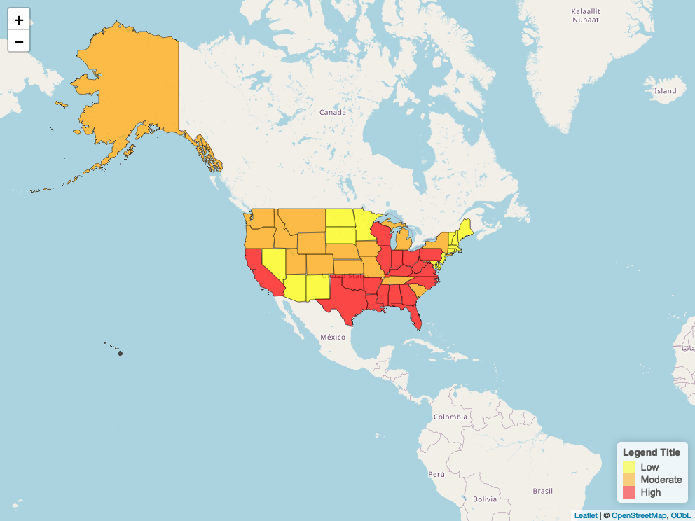<!-- -->

MODEL:

``` r
#Marine Thunderstorm Wind only by region so not good (no states)

#Predictors 
#I get data from here https://www.ncei.noaa.gov/pub/data/swdi/stormevents/csvfiles/

#This function helps automate the process of isolating data regarding event type for each state in each year 
create_df <- function(og_csv, event_type_list){
  new_df <- og_csv %>%
  filter(EVENT_TYPE %in% event_type_list) %>%
  count(STATE)
  return(new_df)
}

################
#All for 2018

storm_details_2018 <- read.csv("storm_details_2018.csv")

#Rain
rainy_2018 <- create_df(storm_details_2018, "Heavy Rain")

#Winter Weather
#note: includes DC
winter_2018 <- create_df(storm_details_2018, c("Winter Storm", "Winter Weather", "Ice Storm", "Heavy Snow"))

#Hail
hail_2018 <- create_df(storm_details_2018, "Hail")

#Tornadoes
tornado_2018 <- create_df(storm_details_2018, "Tornado")

#Windy weather
windy_2018 <- create_df(storm_details_2018, c("Strong Wind", "High Wind", "Thunderstorm Wind"))

#Floods
flood_2018 <- create_df(storm_details_2018, c("Flood", "Flash Flood", "Coastal Flood"))

#Wildfires Likely (droughts and smo)
wildfire_2018 <- create_df(storm_details_2018, c("Drought", "Dense Smoke"))

#Dust storms
duststorm_2018 <- create_df(storm_details_2018, "Dust Storm")

################
#All for 2019

storm_details_2019 <- read.csv("storm_details_2019.csv")

#Rain
rainy_2019 <- create_df(storm_details_2019, "Heavy Rain")

#Winter Weather
#note: includes DC
winter_2019 <- create_df(storm_details_2019, c("Winter Storm", "Winter Weather", "Ice Storm", "Heavy Snow"))

#Hail
hail_2019 <- create_df(storm_details_2019, "Hail")

#Tornadoes
tornado_2019 <- create_df(storm_details_2019, "Tornado")

#Windy weather
windy_2019 <- create_df(storm_details_2019, c("Strong Wind", "High Wind", "Thunderstorm Wind"))

#Floods
flood_2019 <- create_df(storm_details_2019, c("Flood", "Flash Flood", "Coastal Flood"))

#Wildfires Likely (droughts and smo)
wildfire_2019 <- create_df(storm_details_2019, c("Drought", "Dense Smoke"))

#Dust storms
duststorm_2019 <- create_df(storm_details_2019, "Dust Storm")


################
#All for 2020

storm_details_2020 <- read.csv("storm_details_2020.csv")

#Rain
rainy_2020 <- create_df(storm_details_2020, "Heavy Rain")

#Winter Weather
#note: includes DC
winter_2020 <- create_df(storm_details_2020,c("Winter Storm", "Winter Weather", "Ice Storm", "Heavy Snow"))

#Hail
hail_2020 <- create_df(storm_details_2020, "Hail")

#Tornadoes
tornado_2020 <- create_df(storm_details_2020, "Tornado")

#Windy weather
windy_2020 <- create_df(storm_details_2020, c("Strong Wind", "High Wind", "Thunderstorm Wind"))

#Floods
flood_2020 <- create_df(storm_details_2020, c("Flood", "Flash Flood", "Coastal Flood"))

#Wildfires Likely (droughts and smo)
wildfire_2020 <- create_df(storm_details_2020, c("Drought", "Dense Smoke"))

#Dust storms
duststorm_2020 <- create_df(storm_details_2020, "Dust Storm")


##################
#All for 2021
storm_details_2021 <- read.csv("storm_details_2021.csv")
#Example
YA <- storm_details_2021 %>% group_by(STATE, EVENT_TYPE) %>% summarize(Count_ColdWindChill = sum(EVENT_TYPE == "Cold/Wind Chill"))
```

    ## `summarise()` has grouped output by 'STATE'. You can override using the
    ## `.groups` argument.

``` r
#Rain
rainy_2021 <- create_df(storm_details_2021, "Heavy Rain")

#Winter Weather
#note: includes DC
winter_2021 <- create_df(storm_details_2021, c("Winter Storm", "Winter Weather", "Ice Storm", "Heavy Snow"))

#Hail
hail_2021 <- create_df(storm_details_2021, "Hail")

#Tornadoes
tornado_2021 <- create_df(storm_details_2021, "Tornado")

#Windy weather
windy_2021 <- create_df(storm_details_2021, c("Strong Wind", "High Wind", "Thunderstorm Wind"))

#Floods
flood_2021 <- create_df(storm_details_2021, c("Flood", "Flash Flood", "Coastal Flood"))

#Wildfires Likely (droughts and smo)
wildfire_2021 <- create_df(storm_details_2021, c("Drought", "Dense Smoke"))

#Dust storms
duststorm_2021 <- create_df(storm_details_2021, "Dust Storm")


#Now edit the dataframes so that there are 50 states in each and such that for the states in which there were no incidences of a particular event, the count is 0
#The function edit_lists performs this desired function

edit_lists <- function (og_list){
      # Create a vector of states I want to retain (all 50 states)
      state_list = c("ALABAMA", "ALASKA", "ARIZONA", "ARKANSAS", "CALIFORNIA", "COLORADO", "CONNECTICUT", "DELAWARE", "FLORIDA", "GEORGIA", "HAWAII", "IDAHO", "ILLINOIS", "INDIANA", "IOWA", "KANSAS", "KENTUCKY", "LOUISIANA", "MAINE", "MARYLAND", "MASSACHUSETTS", "MICHIGAN", "MINNESOTA", "MISSISSIPPI", "MISSOURI", "MONTANA", "NEBRASKA", "NEVADA", "NEW HAMPSHIRE", "NEW JERSEY", "NEW MEXICO", "NEW YORK", "NORTH CAROLINA", "NORTH DAKOTA", "OHIO", "OKLAHOMA", "OREGON", "PENNSYLVANIA", "RHODE ISLAND", "SOUTH CAROLINA", "SOUTH DAKOTA", "TENNESSEE", "TEXAS", "UTAH", "VERMONT", "VIRGINIA", "WASHINGTON", "WEST VIRGINIA", "WISCONSIN", "WYOMING")
      
      # Create a new data frame with all states I want to include
      all_states <- data.frame(STATE = state_list)
      
      # Left join to add missing states
      new_list <- merge(all_states, og_list, all.x = TRUE, by = "STATE")
      
      # Replace missing values (NAs) with 0
      new_list[is.na(new_list)] <- 0
      
      return(new_list)
}

#Apply the function such that each of the dataframes now contains all 50 states 

#2018
winter_2018_50 = edit_lists(winter_2018)
hail_2018_50 = edit_lists(hail_2018)
tornado_2018_50 = edit_lists(tornado_2018)
windy_2018_50 = edit_lists(windy_2018)
flood_2018_50 = edit_lists(flood_2018)
wildfire_2018_50 = edit_lists(wildfire_2018)
duststorm_2018_50 = edit_lists(duststorm_2018)

#2019
winter_2019_50 = edit_lists(winter_2019)
hail_2019_50 = edit_lists(hail_2019)
tornado_2019_50 = edit_lists(tornado_2019)
windy_2019_50 = edit_lists(windy_2019)
flood_2019_50 = edit_lists(flood_2019)
wildfire_2019_50 = edit_lists(wildfire_2019)
duststorm_2019_50 = edit_lists(duststorm_2019)

#Double check that there are 50 states in each and 0's in all the states with no events:
nrow(duststorm_2019_50)
```

    ## [1] 50

``` r
#duststorm_2019_50

#2020
winter_2020_50 = edit_lists(winter_2020)
hail_2020_50 = edit_lists(hail_2020)
tornado_2020_50 = edit_lists(tornado_2020)
windy_2020_50 = edit_lists(windy_2020)
flood_2020_50 = edit_lists(flood_2020)
wildfire_2020_50 = edit_lists(wildfire_2020)
duststorm_2020_50 = edit_lists(duststorm_2020)

#2021
winter_2021_50 = edit_lists(winter_2021)
hail_2021_50 = edit_lists(hail_2021)
tornado_2021_50 = edit_lists(tornado_2021)
windy_2021_50 = edit_lists(windy_2021)
flood_2021_50 = edit_lists(flood_2021)
wildfire_2021_50 = edit_lists(wildfire_2021)
duststorm_2021_50 = edit_lists(duststorm_2021)


#Now we want the average of the event count for each event type for each state for each year. So if there was 1 dust storm in Alabama in 2018, 2 in 2019, and 3 in 2020, we want the final count to be 2.

#This function performs the task of creating a new dataframe containing all the data from 2018, 2019, and 2020 for each state as well as a column for the average for each state. This function will be used for each event type.
merge_function <- function(df_2018, df_2019, df_2020){
  new_df <- merge(df_2018, df_2019, by = "STATE")
  new_df <- merge(new_df, df_2020, by = "STATE")
  colnames(new_df) <- c("STATE", "2018", "2019", "2020")
  new_df <- new_df %>%
  mutate(Average = rowMeans(select(., "2018", "2019", "2020")))
}

#Create a new dataframe for each event type containing the data from 2019, 2020, and 2021 as well as the average for each state by using the merge_function
winter_df <- merge_function(winter_2018_50, winter_2019_50, winter_2020_50)
hail_df <- merge_function(hail_2018_50, hail_2019_50, hail_2020_50)
tornado_df <- merge_function(tornado_2018_50, tornado_2019_50, tornado_2020_50)
windy_df <- merge_function(windy_2018_50, windy_2019_50, windy_2020_50)
flood_df <- merge_function(flood_2018_50, flood_2019_50, flood_2020_50)
wildfire_df <- merge_function(wildfire_2018_50, wildfire_2019_50, wildfire_2020_50)
duststorm_df <- merge_function(duststorm_2018_50, duststorm_2019_50, duststorm_2020_50)

weather_df = data.frame(State = winter_df$STATE, Winter = winter_df$Average, Hail = hail_df$Average, Tornado = tornado_df$Average, Wind = windy_df$Average, Flood = flood_df$Average, Wildfire = wildfire_df$Average, DustStorm = duststorm_df$Average)
weather_df
```

    ##             State      Winter         Hail     Tornado       Wind     Flood
    ## 1         ALABAMA  27.3333333   80.6666667  77.3333333  680.33333 123.66667
    ## 2          ALASKA  61.0000000    0.6666667   0.0000000   56.66667  14.33333
    ## 3         ARIZONA  46.6666667   36.0000000   6.3333333  146.33333 166.33333
    ## 4        ARKANSAS 138.6666667  161.3333333  41.0000000  397.66667 298.66667
    ## 5      CALIFORNIA 352.0000000   56.3333333   9.6666667  533.00000 347.00000
    ## 6        COLORADO 485.0000000  501.0000000  45.3333333  377.33333  56.00000
    ## 7     CONNECTICUT  58.0000000   13.0000000   5.6666667  123.66667  41.66667
    ## 8        DELAWARE   8.6666667    7.3333333   2.6666667   79.66667  23.66667
    ## 9         FLORIDA  11.6666667   86.0000000  46.3333333  485.00000 147.66667
    ## 10        GEORGIA  78.6666667   95.6666667  52.6666667  736.00000 159.00000
    ## 11         HAWAII   0.3333333    0.0000000   0.0000000   32.00000  22.00000
    ## 12          IDAHO 271.6666667   18.3333333   3.0000000   95.66667  18.66667
    ## 13       ILLINOIS 212.0000000  218.0000000  61.6666667  734.66667 294.66667
    ## 14        INDIANA 194.6666667  119.6666667  21.6666667  517.66667 175.66667
    ## 15           IOWA 317.6666667  298.3333333  55.3333333  462.33333 380.33333
    ## 16         KANSAS 173.3333333  749.0000000  55.6666667  870.00000 230.33333
    ## 17       KENTUCKY 222.6666667   87.6666667  31.6666667  600.00000 377.33333
    ## 18      LOUISIANA  27.0000000   88.6666667  84.6666667  277.66667 105.33333
    ## 19          MAINE 172.6666667   22.0000000   1.0000000  104.00000  33.00000
    ## 20       MARYLAND 140.3333333   37.0000000  10.0000000  417.33333 319.33333
    ## 21  MASSACHUSETTS  90.6666667   28.3333333   4.3333333  505.66667 121.33333
    ## 22       MICHIGAN 319.3333333   68.0000000   9.0000000  319.66667  49.33333
    ## 23      MINNESOTA 474.0000000  354.3333333  59.0000000  397.33333 144.00000
    ## 24    MISSISSIPPI  33.3333333   85.0000000 108.6666667  555.66667 191.33333
    ## 25       MISSOURI 155.3333333  313.0000000  50.6666667  621.66667 383.33333
    ## 26        MONTANA 276.0000000  248.0000000   5.6666667  517.00000  57.33333
    ## 27       NEBRASKA 323.0000000  521.0000000  30.6666667  607.00000 127.66667
    ## 28         NEVADA  92.0000000    4.3333333   1.6666667  133.66667  18.66667
    ## 29  NEW HAMPSHIRE  72.6666667   13.6666667   2.3333333   78.00000  26.66667
    ## 30     NEW JERSEY 126.6666667   41.0000000   4.6666667  450.66667 170.00000
    ## 31     NEW MEXICO 114.6666667  126.3333333  12.0000000  284.33333  31.00000
    ## 32       NEW YORK 415.6666667   76.3333333   9.6666667 1088.00000 221.66667
    ## 33 NORTH CAROLINA 231.6666667  114.6666667  46.3333333  747.00000 295.00000
    ## 34   NORTH DAKOTA 150.3333333  304.6666667  22.3333333  298.00000  13.00000
    ## 35           OHIO 321.3333333  178.3333333  33.6666667  841.33333 358.33333
    ## 36       OKLAHOMA  52.6666667  462.0000000  89.0000000  592.00000 208.66667
    ## 37         OREGON  60.0000000   17.0000000   3.0000000   90.00000  24.00000
    ## 38   PENNSYLVANIA 239.3333333  161.3333333  26.6666667 1110.00000 364.33333
    ## 39   RHODE ISLAND  16.6666667    2.0000000   0.6666667   52.33333   9.00000
    ## 40 SOUTH CAROLINA  29.6666667   91.6666667  39.6666667  558.66667  84.66667
    ## 41   SOUTH DAKOTA 479.0000000  496.6666667  22.6666667  562.66667 405.00000
    ## 42      TENNESSEE 162.3333333   90.0000000  32.3333333  634.66667 164.66667
    ## 43          TEXAS 180.0000000 1107.6666667 111.3333333 1130.66667 363.00000
    ## 44           UTAH  98.6666667   10.3333333   0.6666667  110.33333  27.33333
    ## 45        VERMONT 134.6666667    2.6666667   0.3333333  104.00000  17.66667
    ## 46       VIRGINIA 323.0000000   90.6666667  24.6666667  888.00000 652.00000
    ## 47     WASHINGTON 284.3333333    5.0000000   1.6666667   69.00000  21.66667
    ## 48  WEST VIRGINIA 247.6666667   78.3333333   1.0000000  313.33333 191.33333
    ## 49      WISCONSIN 464.0000000  151.0000000  29.3333333  332.66667 181.33333
    ## 50        WYOMING 262.6666667  252.6666667  16.6666667  522.00000  28.66667
    ##       Wildfire  DustStorm
    ## 1   29.3333333  0.0000000
    ## 2    0.0000000  0.0000000
    ## 3   44.0000000 33.6666667
    ## 4   14.3333333  0.0000000
    ## 5   16.6666667  3.6666667
    ## 6  120.0000000  4.6666667
    ## 7    2.0000000  0.0000000
    ## 8    0.0000000  0.0000000
    ## 9   29.0000000  0.0000000
    ## 10  85.0000000  0.0000000
    ## 11  48.6666667  0.0000000
    ## 12   2.3333333  2.3333333
    ## 13   1.3333333  0.0000000
    ## 14   0.0000000  0.0000000
    ## 15  74.0000000  0.0000000
    ## 16  63.3333333 13.6666667
    ## 17  13.0000000  0.0000000
    ## 18  24.6666667  0.0000000
    ## 19  30.0000000  0.0000000
    ## 20   0.0000000  0.0000000
    ## 21   0.0000000  0.0000000
    ## 22   0.0000000  0.0000000
    ## 23   4.0000000  0.0000000
    ## 24   0.0000000  0.0000000
    ## 25  65.3333333  0.0000000
    ## 26  16.6666667  0.3333333
    ## 27  47.3333333  1.6666667
    ## 28   0.0000000  4.3333333
    ## 29  13.6666667  0.0000000
    ## 30   0.0000000  0.0000000
    ## 31 338.3333333  1.3333333
    ## 32   2.3333333  0.0000000
    ## 33   1.3333333  0.0000000
    ## 34   0.0000000  0.0000000
    ## 35   0.0000000  0.0000000
    ## 36 162.0000000  0.0000000
    ## 37   0.0000000  1.0000000
    ## 38  12.0000000  0.0000000
    ## 39   0.0000000  0.0000000
    ## 40   0.6666667  0.0000000
    ## 41  26.3333333  2.0000000
    ## 42  11.6666667  0.0000000
    ## 43 554.0000000  2.0000000
    ## 44  34.0000000  0.0000000
    ## 45   0.0000000  0.0000000
    ## 46   4.0000000  0.0000000
    ## 47   6.0000000  8.6666667
    ## 48   1.3333333  0.0000000
    ## 49   0.3333333  0.3333333
    ## 50   0.0000000  0.0000000

``` r
#dataframe with one column of STATES (alphabetized, 1 in each row), and then for 9 predictors, there is 1 column for the count and one for the categorized variable (low, medium, or high). Later I will add the response variable (the total loss/premium, aka loss ratio, for 2022 for each state). Then it will be ready for GLM
```

Now I need to get the response variable, which is the 2021 loss ratios.
That requires getting the 2021 total premiums, the total claims, and
then calculating the loss ratio as the total claims over the total
premiums for each state. I take this from
<https://www.iii.org/publications/a-firm-foundation-how-insurance-supports-the-economy/a-50-state-commitment/incurred-losses-by-state>
, which represents data from a large body of insurance companies in the
United States. Specifically, I import the table containing Incurred
Losses By State and Property/Casualty Insurance, 2021 (1).

First I will import premiums data from 2021.

``` r
premiums_2021_df <- read.csv("premiums_2021.csv")
premiums_2021_df$State <- toupper(premiums_2021_df$State) 
```

Now, I will import the Incurred Losses by State for 2021 (from the
archive on the website).

``` r
losses_2021_df <- read.csv("losses_2021.csv")
losses_2021_df$State <- toupper(losses_2021_df$State)
```

Now I will merge the two. The last variable, loss ratios, will be the
response variable.

``` r
#First remove D.C. from both
premiums_2021_df <- subset(premiums_2021_df, State != 'D.C.')
#premiums_losses_2021_df <- subset(premiums_losses_2021_df, State != 'D.C.')

premiums_losses_2021_df <- merge(premiums_2021_df, losses_2021_df, by = "State")
premiums_losses_2021_df
```

    ##             State  Value.x  Value.y
    ## 1         ALABAMA 10841361  6476321
    ## 2          ALASKA  1711194   798066
    ## 3         ARIZONA 14088672  8328669
    ## 4        ARKANSAS  6419527  4020610
    ## 5      CALIFORNIA 96311492 51888135
    ## 6        COLORADO 16368169  9875928
    ## 7     CONNECTICUT 10016170  5907927
    ## 8        DELAWARE  3261830  1641477
    ## 9         FLORIDA 66410689 37929284
    ## 10        GEORGIA 26514329 16129828
    ## 11         HAWAII  2891484  1310210
    ## 12          IDAHO  3849228  2281504
    ## 13       ILLINOIS 30484708 16743499
    ## 14        INDIANA 13579419  7361432
    ## 15           IOWA  8054991  4814712
    ## 16         KANSAS  7896343  4235115
    ## 17       KENTUCKY  8620388  5756880
    ## 18      LOUISIANA 13331567 21823158
    ## 19          MAINE  2771319  1284909
    ## 20       MARYLAND 13781070  7216979
    ## 21  MASSACHUSETTS 18330652  8559552
    ## 22       MICHIGAN 21294398 13343510
    ## 23      MINNESOTA 14037235  8028411
    ## 24    MISSISSIPPI  6342974  3668721
    ## 25       MISSOURI 14262648  8026747
    ## 26        MONTANA  3072567  1886860
    ## 27       NEBRASKA  6073036  3262966
    ## 28         NEVADA  7049820  3955395
    ## 29  NEW HAMPSHIRE  2834333  1245146
    ## 30     NEW JERSEY 24784880 15770620
    ## 31     NEW MEXICO  4040716  2328307
    ## 32       NEW YORK 55034274 32545318
    ## 33 NORTH CAROLINA 19676819 11080165
    ## 34   NORTH DAKOTA  2990943  2688317
    ## 35           OHIO 19735292 10211117
    ## 36       OKLAHOMA  9354444  5645003
    ## 37         OREGON  8531568  4948936
    ## 38   PENNSYLVANIA 28340342 15997227
    ## 39   RHODE ISLAND  2868112  1541067
    ## 40 SOUTH CAROLINA 12103012  6517620
    ## 41   SOUTH DAKOTA  3049310  1931153
    ## 42      TENNESSEE 14199791  8133208
    ## 43          TEXAS 70749457 53345307
    ## 44           UTAH  6344458  3373781
    ## 45        VERMONT  1417381   625199
    ## 46       VIRGINIA 16597204  8651199
    ## 47     WASHINGTON 15262847  9121073
    ## 48  WEST VIRGINIA  3140938  1668944
    ## 49      WISCONSIN 12160368  6426197
    ## 50        WYOMING  1456738   643351

``` r
colnames(premiums_losses_2021_df) <- c("State", "TotalPremiumAmounts", "TotalLossAmounts")
premiums_losses_2021_df
```

    ##             State TotalPremiumAmounts TotalLossAmounts
    ## 1         ALABAMA            10841361          6476321
    ## 2          ALASKA             1711194           798066
    ## 3         ARIZONA            14088672          8328669
    ## 4        ARKANSAS             6419527          4020610
    ## 5      CALIFORNIA            96311492         51888135
    ## 6        COLORADO            16368169          9875928
    ## 7     CONNECTICUT            10016170          5907927
    ## 8        DELAWARE             3261830          1641477
    ## 9         FLORIDA            66410689         37929284
    ## 10        GEORGIA            26514329         16129828
    ## 11         HAWAII             2891484          1310210
    ## 12          IDAHO             3849228          2281504
    ## 13       ILLINOIS            30484708         16743499
    ## 14        INDIANA            13579419          7361432
    ## 15           IOWA             8054991          4814712
    ## 16         KANSAS             7896343          4235115
    ## 17       KENTUCKY             8620388          5756880
    ## 18      LOUISIANA            13331567         21823158
    ## 19          MAINE             2771319          1284909
    ## 20       MARYLAND            13781070          7216979
    ## 21  MASSACHUSETTS            18330652          8559552
    ## 22       MICHIGAN            21294398         13343510
    ## 23      MINNESOTA            14037235          8028411
    ## 24    MISSISSIPPI             6342974          3668721
    ## 25       MISSOURI            14262648          8026747
    ## 26        MONTANA             3072567          1886860
    ## 27       NEBRASKA             6073036          3262966
    ## 28         NEVADA             7049820          3955395
    ## 29  NEW HAMPSHIRE             2834333          1245146
    ## 30     NEW JERSEY            24784880         15770620
    ## 31     NEW MEXICO             4040716          2328307
    ## 32       NEW YORK            55034274         32545318
    ## 33 NORTH CAROLINA            19676819         11080165
    ## 34   NORTH DAKOTA             2990943          2688317
    ## 35           OHIO            19735292         10211117
    ## 36       OKLAHOMA             9354444          5645003
    ## 37         OREGON             8531568          4948936
    ## 38   PENNSYLVANIA            28340342         15997227
    ## 39   RHODE ISLAND             2868112          1541067
    ## 40 SOUTH CAROLINA            12103012          6517620
    ## 41   SOUTH DAKOTA             3049310          1931153
    ## 42      TENNESSEE            14199791          8133208
    ## 43          TEXAS            70749457         53345307
    ## 44           UTAH             6344458          3373781
    ## 45        VERMONT             1417381           625199
    ## 46       VIRGINIA            16597204          8651199
    ## 47     WASHINGTON            15262847          9121073
    ## 48  WEST VIRGINIA             3140938          1668944
    ## 49      WISCONSIN            12160368          6426197
    ## 50        WYOMING             1456738           643351

``` r
loss_ratio_2021 <- premiums_losses_2021_df$"TotalLossAmounts"/premiums_losses_2021_df$"TotalPremiumAmounts"
premiums_losses_2021_df$"LossRatios" <- loss_ratio_2021
```

Check for linearity between dependent and independent variables.

``` r
Y = premiums_losses_2021_df$"TotalLossAmounts"
winter_X1 = weather_df$Winter
hail_X2 = weather_df$Hail
tornado_X3 = weather_df$Tornado
wind_X4 = weather_df$Wind
flood_X5 = weather_df$Flood
wildfire_X6 = weather_df$Wildfire
duststorm_X7 = weather_df$DustStorm

#Winter
plot(winter_X1, Y, main = "Scatter Plot of Winter Weather Events vs. Loss Ratio", xlab = "Number of Winter Weather Events", ylab = "Loss Ratio")
```

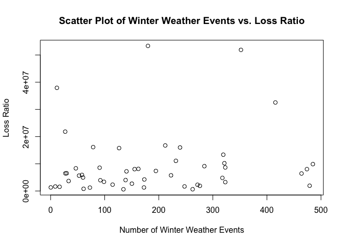<!-- -->

``` r
#Try again without outlier 
#Louisiana has an EXTREMELY high loss ratio, at 1.64. I will take it out for now.
max(Y)
```

    ## [1] 53345307

``` r
#premiums_losses_2021_df

Y2 <- Y[-c(18, 34)]
winter_X1_2 <- winter_X1[-c(18, 34)]
max(Y2)
```

    ## [1] 53345307

``` r
#Plot x versus y 
#some evidence of linear relationship, but not huge
#roughly, as winter storms increase, loss ratio increases 
#No particular curvature
plot(winter_X1_2, Y2, main = "Scatter Plot of Winter vs. Loss", xlab = "Winter", ylab = "Loss Ratio")
abline(lm(Y2 ~ winter_X1_2), col = "red")
```

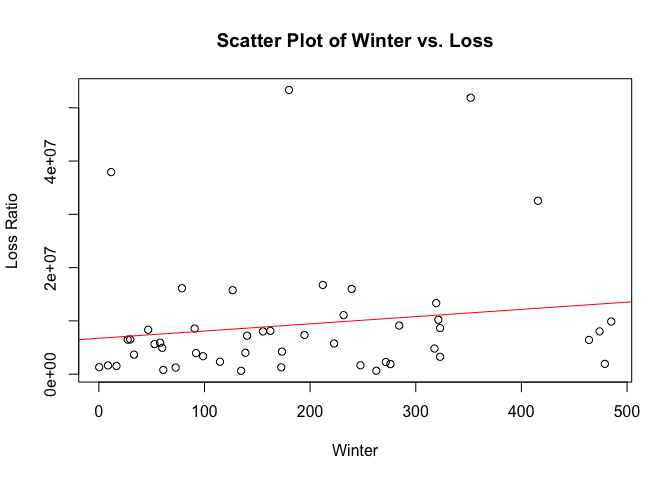<!-- -->

``` r
#Plot Residuals for winter (with outliers taken out)
#roughly around the horizontal line
lm_model_winter <- lm(Y2 ~ winter_X1_2)
plot(lm_model_winter$fitted.values, lm_model_winter$residuals, main = "Residuals vs. Fitted Values", xlab = "Fitted Values", ylab = "Residuals")
abline(h = 0, col = "red", lty = 2)
```

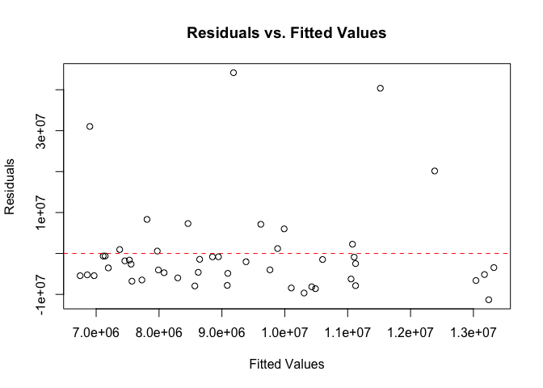<!-- -->

``` r
#Hail
hail_X2_2 <- hail_X2[-c(18, 34, 43)]
Y3 <- Y2[-43]

#Plot x versus y (with 3 outliers taken out)
#some evidence of linear relationship
#roughly, as hail storms increase, loss ratio increases 
#No particular curvature
plot(hail_X2_2, Y3, main = "Scatter Plot of Hail vs. Loss Ratio", xlab = "Hail", ylab = "Loss Ratio")
abline(lm(Y3 ~ hail_X2_2), col = "blue")
```

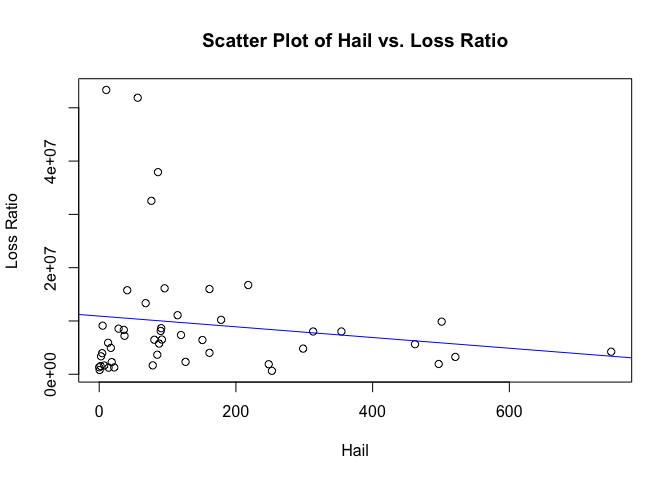<!-- -->

``` r
#Plot Residuals for winter 
#roughly random around the horizontal line
lm_model_winter <- lm(Y3 ~ hail_X2_2)
plot(lm_model_winter$fitted.values, lm_model_winter$residuals, main = "Residuals vs. Fitted Values", xlab = "Fitted Values", ylab = "Residuals")
abline(h = 0, col = "red", lty = 2)
```

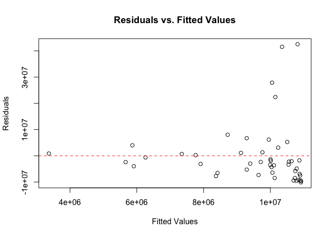<!-- -->

``` r
Y2
```

    ##  [1]  6476321   798066  8328669  4020610 51888135  9875928  5907927  1641477
    ##  [9] 37929284 16129828  1310210  2281504 16743499  7361432  4814712  4235115
    ## [17]  5756880  1284909  7216979  8559552 13343510  8028411  3668721  8026747
    ## [25]  1886860  3262966  3955395  1245146 15770620  2328307 32545318 11080165
    ## [33] 10211117  5645003  4948936 15997227  1541067  6517620  1931153  8133208
    ## [41] 53345307  3373781   625199  8651199  9121073  1668944  6426197   643351

``` r
#to print the plot above:
# Create the plot using ggplot
lm_model_winter_loss <- lm(Y2 ~ winter_X1_2)
plot <- ggplot(data.frame(Winter = winter_X1_2, Loss = Y2), aes(x = Winter, y = Loss)) +
  geom_point() +
  geom_abline(slope = coef(lm_model_winter_loss)[2], intercept = coef(lm_model_winter_loss)[1], col = "red", linetype = "dashed") +
  labs(title = "Number of Winter Weather Events vs. Incurred Property/Casualty Loss, By State, in 2021", x = "Number of Winter Weather Events", y = "Incurred Property and Casualty Loss, in Dollars")

# Save the plot as a PNG file
ggsave("winter_loss_scatter_plot.png", plot, width = 8, height = 6)

# Display the plot
print(plot)
```

<!-- -->

``` r
#Tornado
tornado_X3_2 <- tornado_X3[-c(18, 34, 43)]
Y4 <- Y2[-43]
#Plot x versus y (with 3 outliers taken out)
#some evidence of linear relationship
#roughly, as tornadoes increase, loss ratio increases 
#No particular curvature
plot(tornado_X3_2, Y4, main = "Scatter Plot of Tornado vs. Loss Ratio", xlab = "Tornado", ylab = "Loss Ratio")
abline(lm(Y4 ~ tornado_X3_2), col = "green")
```

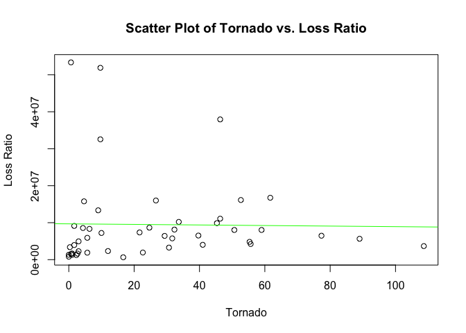<!-- -->

``` r
#Plot Residuals for tornadoes 
#hard to tell
lm_model_tornadoes <- lm(Y4 ~ tornado_X3_2)
plot(lm_model_tornadoes$fitted.values, lm_model_tornadoes$residuals, main = "Residuals vs. Fitted Values", xlab = "Fitted Values", ylab = "Residuals")
abline(h = 0, col = "red", lty = 2)
```

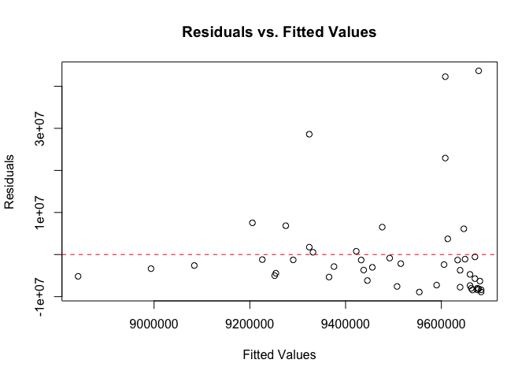<!-- -->

``` r
#Wind

wind_X4_2 = wind_X4[-c(18, 34)]

#Plot x versus y 
#some evidence of linear relationship; pretty evenly distributed around line
#roughly, as wind increase, loss ratio increases 
#No particular curvature
plot(wind_X4_2, Y2, main = "Scatter Plot of Tornado vs. Loss Ratio", xlab = "Tornado", ylab = "Loss Ratio")
abline(lm(Y2 ~ wind_X4_2), col = "purple")
```

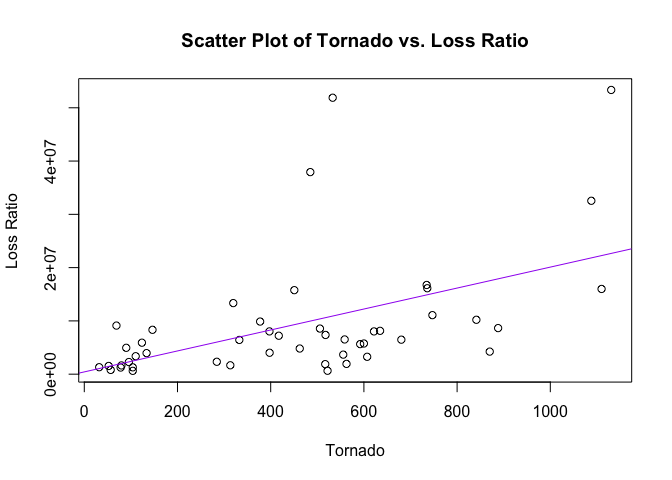<!-- -->

``` r
#Plot Residuals for wind 
#pretty evenly distributed
lm_model_wind <- lm(Y2 ~ wind_X4_2)
plot(lm_model_wind$fitted.values, lm_model_wind$residuals, main = "Residuals vs. Fitted Values", xlab = "Fitted Values", ylab = "Residuals")
abline(h = 0, col = "red", lty = 2)
```

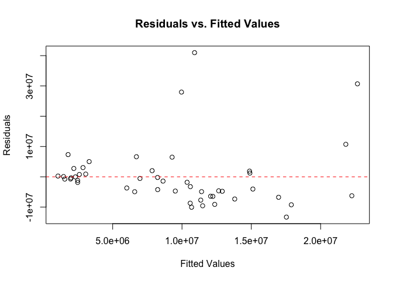<!-- -->

``` r
#Flood
flood_X5_2 = flood_X5[-c(18, 34, 46)]
Y6 <- Y2[-46]
#Plot x versus y 
#some evidence of linear relationship; pretty evenly distributed around line
#roughly, as floods increase, loss ratio increases 
#No particular curvature
plot(flood_X5_2, Y6, main = "Scatter Plot of Flood vs. Loss Ratio", xlab = "Flood", ylab = "Loss Ratio")
abline(lm(Y6 ~ flood_X5_2), col = "pink")
```

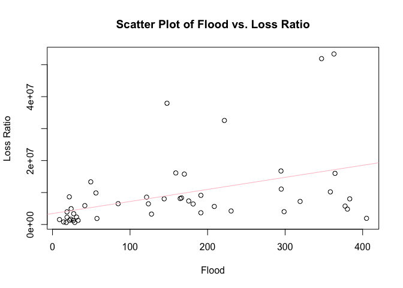<!-- -->

``` r
#Plot Residuals for flood 
#pretty evenly distributed
lm_model_flood <- lm(Y6 ~ flood_X5_2)
plot(lm_model_flood$fitted.values, lm_model_flood$residuals, main = "Residuals vs. Fitted Values", xlab = "Fitted Values", ylab = "Residuals")
abline(h = 0, col = "red", lty = 2)
```

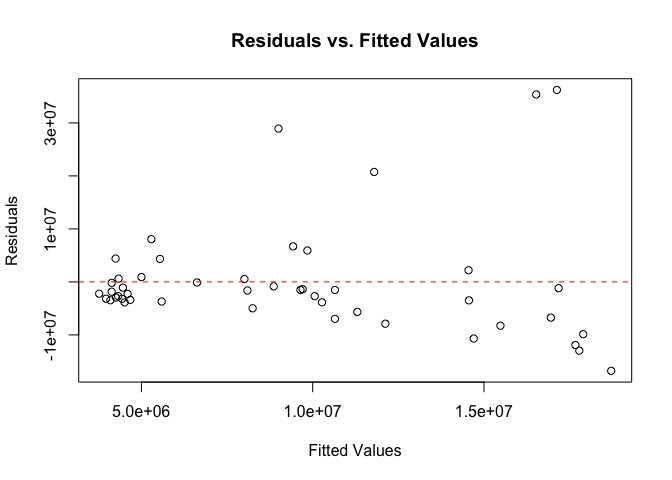<!-- -->

``` r
#Wildfire
wildfire_X6_2 = wildfire_X6[-c(18, 34, 43, 31)]
Y7 <- Y2[-c(43, 31)]

#Plot x versus y 
#difficult to see because most states had a low number of wildfires
#roughly, as wildfires increase, it does seem clear that loss ratio increases 
#omits 4 outliers including 2 huge outlier
plot(wildfire_X6_2, Y7, main = "Scatter Plot of Wildfire vs. Loss Ratio", xlab = "Wildfire", ylab = "Loss Ratio")
abline(lm(Y7 ~ wildfire_X6_2), col = "yellow")
```

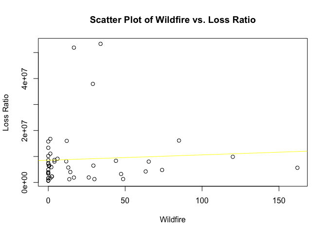<!-- -->

``` r
#Plot Residuals for wildfires 
lm_model_wildfire <- lm(Y7 ~ wildfire_X6_2)
plot(lm_model_wildfire$fitted.values, lm_model_wildfire$residuals, main = "Residuals vs. Fitted Values", xlab = "Fitted Values", ylab = "Residuals")
abline(h = 0, col = "red", lty = 2)
```

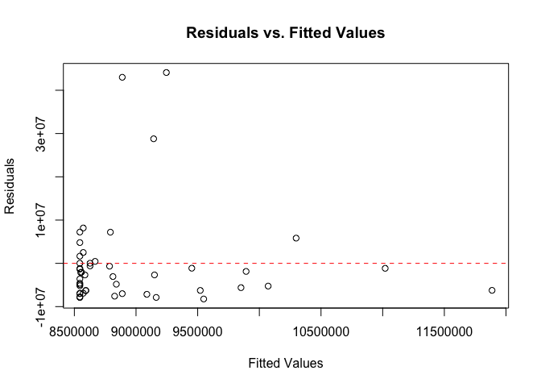<!-- -->

``` r
#Duststorm
duststorm_X7_2 = duststorm_X7[-c(18, 34)]
max(duststorm_X7_2)
```

    ## [1] 33.66667

``` r
#Plot x versus y 
#not very many states with any dust storms at all so it's hard to tell 
plot(duststorm_X7_2, Y2, main = "Scatter Plot of Dust storm vs. Loss Ratio", xlab = "DustStorm", ylab = "Loss Ratio")
abline(lm(Y2 ~ duststorm_X7_2), col = "orange")
```

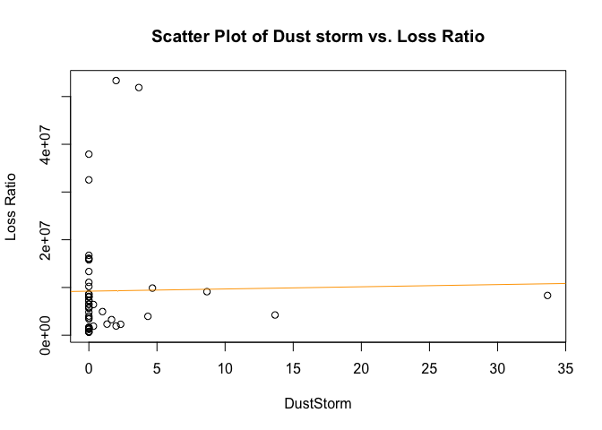<!-- -->

Now merge the table with the loss ratios to the other table.

``` r
model_2021_df_og <- merge(weather_df, premiums_losses_2021_df)

#remove premium and loss columns
model_2021_df <- model_2021_df_og[, -which(names(model_2021_df_og) == "TotalPremiumAmounts")]
model_2021_df <- model_2021_df[, -which(names(model_2021_df) == "TotalLossAmounts")]
```

Build model. Split into training and test and then validate on the
testing set.

``` r
# Split the data into training and testing sets
set.seed(123)  # for reproducibility
train_indices <- sample(1:nrow(model_2021_df), 0.7 * nrow(model_2021_df))
train_data <- model_2021_df[train_indices, ]
test_data <- model_2021_df[-train_indices, ]

# Build a linear regression model
model_2021 <- lm(LossRatios ~ Winter + Hail + Tornado + Wind + Flood + Wildfire + DustStorm, data = train_data)
summary(model_2021)
```

    ## 
    ## Call:
    ## lm(formula = LossRatios ~ Winter + Hail + Tornado + Wind + Flood + 
    ##     Wildfire + DustStorm, data = train_data)
    ## 
    ## Residuals:
    ##       Min        1Q    Median        3Q       Max 
    ## -0.080635 -0.033954 -0.004331  0.027515  0.087155 
    ## 
    ## Coefficients:
    ##               Estimate Std. Error t value Pr(>|t|)    
    ## (Intercept)  4.995e-01  2.166e-02  23.061   <2e-16 ***
    ## Winter      -2.229e-05  1.111e-04  -0.201   0.8425    
    ## Hail         1.379e-06  8.961e-05   0.015   0.9878    
    ## Tornado      1.026e-04  5.716e-04   0.179   0.8589    
    ## Wind         3.972e-05  5.461e-05   0.727   0.4732    
    ## Flood        2.039e-04  1.161e-04   1.756   0.0904 .  
    ## Wildfire     1.951e-04  1.423e-04   1.371   0.1815    
    ## DustStorm    1.601e-03  1.765e-03   0.907   0.3726    
    ## ---
    ## Signif. codes:  0 '***' 0.001 '**' 0.01 '*' 0.05 '.' 0.1 ' ' 1
    ## 
    ## Residual standard error: 0.05487 on 27 degrees of freedom
    ## Multiple R-squared:  0.4841, Adjusted R-squared:  0.3503 
    ## F-statistic: 3.619 on 7 and 27 DF,  p-value: 0.00705

``` r
model_2021_claims <- lm(TotalLossAmounts ~ Winter + Hail + Tornado + Wind + Flood + Wildfire + DustStorm, data = model_2021_df_og)

model_2021_premiums <- lm(TotalPremiumAmounts ~ Winter + Hail + Tornado + Wind + Flood + Wildfire + DustStorm, data = model_2021_df_og)

# Evaluate the model
predictions <- predict(model_2021, newdata = test_data)
mse <- mean((test_data$LossRatios - predictions)^2)
mse #0.0938!
```

    ## [1] 0.09384227

It seems that according to the model, hail, tornado, wind, flood,
wildfire, and dust storms (all but winter, which has a small positive
effect for reasons which can be explored later) are associated with
increases in the loss ratio (fewer claim dollars spent per premium
dollar).

Now build a model without training/test sets.

``` r
model_2021 <- lm(LossRatios ~ Winter + Hail + Tornado + Wind + Flood + Wildfire + DustStorm, data = model_2021_df)
```

``` r
weather_df #Louisiana #18 and North Dakota #34, which have very high loss ratios
```

    ##             State      Winter         Hail     Tornado       Wind     Flood
    ## 1         ALABAMA  27.3333333   80.6666667  77.3333333  680.33333 123.66667
    ## 2          ALASKA  61.0000000    0.6666667   0.0000000   56.66667  14.33333
    ## 3         ARIZONA  46.6666667   36.0000000   6.3333333  146.33333 166.33333
    ## 4        ARKANSAS 138.6666667  161.3333333  41.0000000  397.66667 298.66667
    ## 5      CALIFORNIA 352.0000000   56.3333333   9.6666667  533.00000 347.00000
    ## 6        COLORADO 485.0000000  501.0000000  45.3333333  377.33333  56.00000
    ## 7     CONNECTICUT  58.0000000   13.0000000   5.6666667  123.66667  41.66667
    ## 8        DELAWARE   8.6666667    7.3333333   2.6666667   79.66667  23.66667
    ## 9         FLORIDA  11.6666667   86.0000000  46.3333333  485.00000 147.66667
    ## 10        GEORGIA  78.6666667   95.6666667  52.6666667  736.00000 159.00000
    ## 11         HAWAII   0.3333333    0.0000000   0.0000000   32.00000  22.00000
    ## 12          IDAHO 271.6666667   18.3333333   3.0000000   95.66667  18.66667
    ## 13       ILLINOIS 212.0000000  218.0000000  61.6666667  734.66667 294.66667
    ## 14        INDIANA 194.6666667  119.6666667  21.6666667  517.66667 175.66667
    ## 15           IOWA 317.6666667  298.3333333  55.3333333  462.33333 380.33333
    ## 16         KANSAS 173.3333333  749.0000000  55.6666667  870.00000 230.33333
    ## 17       KENTUCKY 222.6666667   87.6666667  31.6666667  600.00000 377.33333
    ## 18      LOUISIANA  27.0000000   88.6666667  84.6666667  277.66667 105.33333
    ## 19          MAINE 172.6666667   22.0000000   1.0000000  104.00000  33.00000
    ## 20       MARYLAND 140.3333333   37.0000000  10.0000000  417.33333 319.33333
    ## 21  MASSACHUSETTS  90.6666667   28.3333333   4.3333333  505.66667 121.33333
    ## 22       MICHIGAN 319.3333333   68.0000000   9.0000000  319.66667  49.33333
    ## 23      MINNESOTA 474.0000000  354.3333333  59.0000000  397.33333 144.00000
    ## 24    MISSISSIPPI  33.3333333   85.0000000 108.6666667  555.66667 191.33333
    ## 25       MISSOURI 155.3333333  313.0000000  50.6666667  621.66667 383.33333
    ## 26        MONTANA 276.0000000  248.0000000   5.6666667  517.00000  57.33333
    ## 27       NEBRASKA 323.0000000  521.0000000  30.6666667  607.00000 127.66667
    ## 28         NEVADA  92.0000000    4.3333333   1.6666667  133.66667  18.66667
    ## 29  NEW HAMPSHIRE  72.6666667   13.6666667   2.3333333   78.00000  26.66667
    ## 30     NEW JERSEY 126.6666667   41.0000000   4.6666667  450.66667 170.00000
    ## 31     NEW MEXICO 114.6666667  126.3333333  12.0000000  284.33333  31.00000
    ## 32       NEW YORK 415.6666667   76.3333333   9.6666667 1088.00000 221.66667
    ## 33 NORTH CAROLINA 231.6666667  114.6666667  46.3333333  747.00000 295.00000
    ## 34   NORTH DAKOTA 150.3333333  304.6666667  22.3333333  298.00000  13.00000
    ## 35           OHIO 321.3333333  178.3333333  33.6666667  841.33333 358.33333
    ## 36       OKLAHOMA  52.6666667  462.0000000  89.0000000  592.00000 208.66667
    ## 37         OREGON  60.0000000   17.0000000   3.0000000   90.00000  24.00000
    ## 38   PENNSYLVANIA 239.3333333  161.3333333  26.6666667 1110.00000 364.33333
    ## 39   RHODE ISLAND  16.6666667    2.0000000   0.6666667   52.33333   9.00000
    ## 40 SOUTH CAROLINA  29.6666667   91.6666667  39.6666667  558.66667  84.66667
    ## 41   SOUTH DAKOTA 479.0000000  496.6666667  22.6666667  562.66667 405.00000
    ## 42      TENNESSEE 162.3333333   90.0000000  32.3333333  634.66667 164.66667
    ## 43          TEXAS 180.0000000 1107.6666667 111.3333333 1130.66667 363.00000
    ## 44           UTAH  98.6666667   10.3333333   0.6666667  110.33333  27.33333
    ## 45        VERMONT 134.6666667    2.6666667   0.3333333  104.00000  17.66667
    ## 46       VIRGINIA 323.0000000   90.6666667  24.6666667  888.00000 652.00000
    ## 47     WASHINGTON 284.3333333    5.0000000   1.6666667   69.00000  21.66667
    ## 48  WEST VIRGINIA 247.6666667   78.3333333   1.0000000  313.33333 191.33333
    ## 49      WISCONSIN 464.0000000  151.0000000  29.3333333  332.66667 181.33333
    ## 50        WYOMING 262.6666667  252.6666667  16.6666667  522.00000  28.66667
    ##       Wildfire  DustStorm
    ## 1   29.3333333  0.0000000
    ## 2    0.0000000  0.0000000
    ## 3   44.0000000 33.6666667
    ## 4   14.3333333  0.0000000
    ## 5   16.6666667  3.6666667
    ## 6  120.0000000  4.6666667
    ## 7    2.0000000  0.0000000
    ## 8    0.0000000  0.0000000
    ## 9   29.0000000  0.0000000
    ## 10  85.0000000  0.0000000
    ## 11  48.6666667  0.0000000
    ## 12   2.3333333  2.3333333
    ## 13   1.3333333  0.0000000
    ## 14   0.0000000  0.0000000
    ## 15  74.0000000  0.0000000
    ## 16  63.3333333 13.6666667
    ## 17  13.0000000  0.0000000
    ## 18  24.6666667  0.0000000
    ## 19  30.0000000  0.0000000
    ## 20   0.0000000  0.0000000
    ## 21   0.0000000  0.0000000
    ## 22   0.0000000  0.0000000
    ## 23   4.0000000  0.0000000
    ## 24   0.0000000  0.0000000
    ## 25  65.3333333  0.0000000
    ## 26  16.6666667  0.3333333
    ## 27  47.3333333  1.6666667
    ## 28   0.0000000  4.3333333
    ## 29  13.6666667  0.0000000
    ## 30   0.0000000  0.0000000
    ## 31 338.3333333  1.3333333
    ## 32   2.3333333  0.0000000
    ## 33   1.3333333  0.0000000
    ## 34   0.0000000  0.0000000
    ## 35   0.0000000  0.0000000
    ## 36 162.0000000  0.0000000
    ## 37   0.0000000  1.0000000
    ## 38  12.0000000  0.0000000
    ## 39   0.0000000  0.0000000
    ## 40   0.6666667  0.0000000
    ## 41  26.3333333  2.0000000
    ## 42  11.6666667  0.0000000
    ## 43 554.0000000  2.0000000
    ## 44  34.0000000  0.0000000
    ## 45   0.0000000  0.0000000
    ## 46   4.0000000  0.0000000
    ## 47   6.0000000  8.6666667
    ## 48   1.3333333  0.0000000
    ## 49   0.3333333  0.3333333
    ## 50   0.0000000  0.0000000

``` r
model_2021_df_ou <- subset(model_2021_df_og, State != 'LOUISIANA')
model_2021_df_ou <- subset(model_2021_df_ou, State != 'NORTH DAKOTA')
model_2021_df_ou
```

    ##             State      Winter         Hail     Tornado       Wind     Flood
    ## 1         ALABAMA  27.3333333   80.6666667  77.3333333  680.33333 123.66667
    ## 2          ALASKA  61.0000000    0.6666667   0.0000000   56.66667  14.33333
    ## 3         ARIZONA  46.6666667   36.0000000   6.3333333  146.33333 166.33333
    ## 4        ARKANSAS 138.6666667  161.3333333  41.0000000  397.66667 298.66667
    ## 5      CALIFORNIA 352.0000000   56.3333333   9.6666667  533.00000 347.00000
    ## 6        COLORADO 485.0000000  501.0000000  45.3333333  377.33333  56.00000
    ## 7     CONNECTICUT  58.0000000   13.0000000   5.6666667  123.66667  41.66667
    ## 8        DELAWARE   8.6666667    7.3333333   2.6666667   79.66667  23.66667
    ## 9         FLORIDA  11.6666667   86.0000000  46.3333333  485.00000 147.66667
    ## 10        GEORGIA  78.6666667   95.6666667  52.6666667  736.00000 159.00000
    ## 11         HAWAII   0.3333333    0.0000000   0.0000000   32.00000  22.00000
    ## 12          IDAHO 271.6666667   18.3333333   3.0000000   95.66667  18.66667
    ## 13       ILLINOIS 212.0000000  218.0000000  61.6666667  734.66667 294.66667
    ## 14        INDIANA 194.6666667  119.6666667  21.6666667  517.66667 175.66667
    ## 15           IOWA 317.6666667  298.3333333  55.3333333  462.33333 380.33333
    ## 16         KANSAS 173.3333333  749.0000000  55.6666667  870.00000 230.33333
    ## 17       KENTUCKY 222.6666667   87.6666667  31.6666667  600.00000 377.33333
    ## 19          MAINE 172.6666667   22.0000000   1.0000000  104.00000  33.00000
    ## 20       MARYLAND 140.3333333   37.0000000  10.0000000  417.33333 319.33333
    ## 21  MASSACHUSETTS  90.6666667   28.3333333   4.3333333  505.66667 121.33333
    ## 22       MICHIGAN 319.3333333   68.0000000   9.0000000  319.66667  49.33333
    ## 23      MINNESOTA 474.0000000  354.3333333  59.0000000  397.33333 144.00000
    ## 24    MISSISSIPPI  33.3333333   85.0000000 108.6666667  555.66667 191.33333
    ## 25       MISSOURI 155.3333333  313.0000000  50.6666667  621.66667 383.33333
    ## 26        MONTANA 276.0000000  248.0000000   5.6666667  517.00000  57.33333
    ## 27       NEBRASKA 323.0000000  521.0000000  30.6666667  607.00000 127.66667
    ## 28         NEVADA  92.0000000    4.3333333   1.6666667  133.66667  18.66667
    ## 29  NEW HAMPSHIRE  72.6666667   13.6666667   2.3333333   78.00000  26.66667
    ## 30     NEW JERSEY 126.6666667   41.0000000   4.6666667  450.66667 170.00000
    ## 31     NEW MEXICO 114.6666667  126.3333333  12.0000000  284.33333  31.00000
    ## 32       NEW YORK 415.6666667   76.3333333   9.6666667 1088.00000 221.66667
    ## 33 NORTH CAROLINA 231.6666667  114.6666667  46.3333333  747.00000 295.00000
    ## 35           OHIO 321.3333333  178.3333333  33.6666667  841.33333 358.33333
    ## 36       OKLAHOMA  52.6666667  462.0000000  89.0000000  592.00000 208.66667
    ## 37         OREGON  60.0000000   17.0000000   3.0000000   90.00000  24.00000
    ## 38   PENNSYLVANIA 239.3333333  161.3333333  26.6666667 1110.00000 364.33333
    ## 39   RHODE ISLAND  16.6666667    2.0000000   0.6666667   52.33333   9.00000
    ## 40 SOUTH CAROLINA  29.6666667   91.6666667  39.6666667  558.66667  84.66667
    ## 41   SOUTH DAKOTA 479.0000000  496.6666667  22.6666667  562.66667 405.00000
    ## 42      TENNESSEE 162.3333333   90.0000000  32.3333333  634.66667 164.66667
    ## 43          TEXAS 180.0000000 1107.6666667 111.3333333 1130.66667 363.00000
    ## 44           UTAH  98.6666667   10.3333333   0.6666667  110.33333  27.33333
    ## 45        VERMONT 134.6666667    2.6666667   0.3333333  104.00000  17.66667
    ## 46       VIRGINIA 323.0000000   90.6666667  24.6666667  888.00000 652.00000
    ## 47     WASHINGTON 284.3333333    5.0000000   1.6666667   69.00000  21.66667
    ## 48  WEST VIRGINIA 247.6666667   78.3333333   1.0000000  313.33333 191.33333
    ## 49      WISCONSIN 464.0000000  151.0000000  29.3333333  332.66667 181.33333
    ## 50        WYOMING 262.6666667  252.6666667  16.6666667  522.00000  28.66667
    ##       Wildfire  DustStorm TotalPremiumAmounts TotalLossAmounts LossRatios
    ## 1   29.3333333  0.0000000            10841361          6476321  0.5973716
    ## 2    0.0000000  0.0000000             1711194           798066  0.4663796
    ## 3   44.0000000 33.6666667            14088672          8328669  0.5911607
    ## 4   14.3333333  0.0000000             6419527          4020610  0.6263094
    ## 5   16.6666667  3.6666667            96311492         51888135  0.5387533
    ## 6  120.0000000  4.6666667            16368169          9875928  0.6033618
    ## 7    2.0000000  0.0000000            10016170          5907927  0.5898389
    ## 8    0.0000000  0.0000000             3261830          1641477  0.5032381
    ## 9   29.0000000  0.0000000            66410689         37929284  0.5711322
    ## 10  85.0000000  0.0000000            26514329         16129828  0.6083438
    ## 11  48.6666667  0.0000000             2891484          1310210  0.4531272
    ## 12   2.3333333  2.3333333             3849228          2281504  0.5927173
    ## 13   1.3333333  0.0000000            30484708         16743499  0.5492426
    ## 14   0.0000000  0.0000000            13579419          7361432  0.5421021
    ## 15  74.0000000  0.0000000             8054991          4814712  0.5977303
    ## 16  63.3333333 13.6666667             7896343          4235115  0.5363388
    ## 17  13.0000000  0.0000000             8620388          5756880  0.6678214
    ## 19  30.0000000  0.0000000             2771319          1284909  0.4636453
    ## 20   0.0000000  0.0000000            13781070          7216979  0.5236879
    ## 21   0.0000000  0.0000000            18330652          8559552  0.4669529
    ## 22   0.0000000  0.0000000            21294398         13343510  0.6266207
    ## 23   4.0000000  0.0000000            14037235          8028411  0.5719368
    ## 24   0.0000000  0.0000000             6342974          3668721  0.5783913
    ## 25  65.3333333  0.0000000            14262648          8026747  0.5627810
    ## 26  16.6666667  0.3333333             3072567          1886860  0.6140989
    ## 27  47.3333333  1.6666667             6073036          3262966  0.5372874
    ## 28   0.0000000  4.3333333             7049820          3955395  0.5610633
    ## 29  13.6666667  0.0000000             2834333          1245146  0.4393083
    ## 30   0.0000000  0.0000000            24784880         15770620  0.6363000
    ## 31 338.3333333  1.3333333             4040716          2328307  0.5762115
    ## 32   2.3333333  0.0000000            55034274         32545318  0.5913645
    ## 33   1.3333333  0.0000000            19676819         11080165  0.5631075
    ## 35   0.0000000  0.0000000            19735292         10211117  0.5174039
    ## 36 162.0000000  0.0000000             9354444          5645003  0.6034568
    ## 37   0.0000000  1.0000000             8531568          4948936  0.5800734
    ## 38  12.0000000  0.0000000            28340342         15997227  0.5644684
    ## 39   0.0000000  0.0000000             2868112          1541067  0.5373106
    ## 40   0.6666667  0.0000000            12103012          6517620  0.5385122
    ## 41  26.3333333  2.0000000             3049310          1931153  0.6333082
    ## 42  11.6666667  0.0000000            14199791          8133208  0.5727696
    ## 43 554.0000000  2.0000000            70749457         53345307  0.7540031
    ## 44  34.0000000  0.0000000             6344458          3373781  0.5317682
    ## 45   0.0000000  0.0000000             1417381           625199  0.4410945
    ## 46   4.0000000  0.0000000            16597204          8651199  0.5212444
    ## 47   6.0000000  8.6666667            15262847          9121073  0.5975997
    ## 48   1.3333333  0.0000000             3140938          1668944  0.5313521
    ## 49   0.3333333  0.3333333            12160368          6426197  0.5284542
    ## 50   0.0000000  0.0000000             1456738           643351  0.4416381

``` r
model_2021_2 <- lm(TotalLossAmounts ~ Winter + Hail + Tornado + Wind + Flood + Wildfire + DustStorm, data = model_2021_df_ou)

# there is no significant evidence of heteroscedasticity because p value is 0.43, not enough to reject null
library("lmtest")
```

    ## Loading required package: zoo

    ## 
    ## Attaching package: 'zoo'

    ## The following objects are masked from 'package:base':
    ## 
    ##     as.Date, as.Date.numeric

``` r
bp_test <- bptest(model_2021_2)

#taking out outliers actually makes hail not significant, so that's probably not really a good thing
summary(model_2021_2)
```

    ## 
    ## Call:
    ## lm(formula = TotalLossAmounts ~ Winter + Hail + Tornado + Wind + 
    ##     Flood + Wildfire + DustStorm, data = model_2021_df_ou)
    ## 
    ## Residuals:
    ##       Min        1Q    Median        3Q       Max 
    ## -22552340  -4720483  -1466888   2085517  37527352 
    ## 
    ## Coefficients:
    ##               Estimate Std. Error t value Pr(>|t|)   
    ## (Intercept) -2.003e+06  3.280e+06  -0.611  0.54480   
    ## Winter       1.296e+04  1.348e+04   0.961  0.34210   
    ## Hail        -2.113e+04  1.269e+04  -1.666  0.10356   
    ## Tornado     -1.520e+03  7.727e+04  -0.020  0.98440   
    ## Wind         2.097e+04  8.120e+03   2.582  0.01358 * 
    ## Flood       -6.424e+01  1.453e+04  -0.004  0.99649   
    ## Wildfire     6.456e+04  2.219e+04   2.910  0.00588 **
    ## DustStorm    2.121e+05  2.841e+05   0.746  0.45984   
    ## ---
    ## Signif. codes:  0 '***' 0.001 '**' 0.01 '*' 0.05 '.' 0.1 ' ' 1
    ## 
    ## Residual standard error: 9892000 on 40 degrees of freedom
    ## Multiple R-squared:  0.3907, Adjusted R-squared:  0.284 
    ## F-statistic: 3.664 on 7 and 40 DF,  p-value: 0.003799

``` r
#with only significant results 
model_2021_3 <- lm(TotalLossAmounts ~ Hail + Wind + Wildfire, data = model_2021_df_ou)
summary(model_2021_3)
```

    ## 
    ## Call:
    ## lm(formula = TotalLossAmounts ~ Hail + Wind + Wildfire, data = model_2021_df_ou)
    ## 
    ## Residuals:
    ##       Min        1Q    Median        3Q       Max 
    ## -20576835  -4559478  -1766355   2849580  40530744 
    ## 
    ## Coefficients:
    ##             Estimate Std. Error t value Pr(>|t|)    
    ## (Intercept)   220000    2531112   0.087 0.931131    
    ## Hail          -15107       9900  -1.526 0.134188    
    ## Wind           20765       5594   3.712 0.000575 ***
    ## Wildfire       55240      19976   2.765 0.008281 ** 
    ## ---
    ## Signif. codes:  0 '***' 0.001 '**' 0.01 '*' 0.05 '.' 0.1 ' ' 1
    ## 
    ## Residual standard error: 9621000 on 44 degrees of freedom
    ## Multiple R-squared:  0.366,  Adjusted R-squared:  0.3228 
    ## F-statistic: 8.467 on 3 and 44 DF,  p-value: 0.0001494

``` r
model_2021_df_ou
```

    ##             State      Winter         Hail     Tornado       Wind     Flood
    ## 1         ALABAMA  27.3333333   80.6666667  77.3333333  680.33333 123.66667
    ## 2          ALASKA  61.0000000    0.6666667   0.0000000   56.66667  14.33333
    ## 3         ARIZONA  46.6666667   36.0000000   6.3333333  146.33333 166.33333
    ## 4        ARKANSAS 138.6666667  161.3333333  41.0000000  397.66667 298.66667
    ## 5      CALIFORNIA 352.0000000   56.3333333   9.6666667  533.00000 347.00000
    ## 6        COLORADO 485.0000000  501.0000000  45.3333333  377.33333  56.00000
    ## 7     CONNECTICUT  58.0000000   13.0000000   5.6666667  123.66667  41.66667
    ## 8        DELAWARE   8.6666667    7.3333333   2.6666667   79.66667  23.66667
    ## 9         FLORIDA  11.6666667   86.0000000  46.3333333  485.00000 147.66667
    ## 10        GEORGIA  78.6666667   95.6666667  52.6666667  736.00000 159.00000
    ## 11         HAWAII   0.3333333    0.0000000   0.0000000   32.00000  22.00000
    ## 12          IDAHO 271.6666667   18.3333333   3.0000000   95.66667  18.66667
    ## 13       ILLINOIS 212.0000000  218.0000000  61.6666667  734.66667 294.66667
    ## 14        INDIANA 194.6666667  119.6666667  21.6666667  517.66667 175.66667
    ## 15           IOWA 317.6666667  298.3333333  55.3333333  462.33333 380.33333
    ## 16         KANSAS 173.3333333  749.0000000  55.6666667  870.00000 230.33333
    ## 17       KENTUCKY 222.6666667   87.6666667  31.6666667  600.00000 377.33333
    ## 19          MAINE 172.6666667   22.0000000   1.0000000  104.00000  33.00000
    ## 20       MARYLAND 140.3333333   37.0000000  10.0000000  417.33333 319.33333
    ## 21  MASSACHUSETTS  90.6666667   28.3333333   4.3333333  505.66667 121.33333
    ## 22       MICHIGAN 319.3333333   68.0000000   9.0000000  319.66667  49.33333
    ## 23      MINNESOTA 474.0000000  354.3333333  59.0000000  397.33333 144.00000
    ## 24    MISSISSIPPI  33.3333333   85.0000000 108.6666667  555.66667 191.33333
    ## 25       MISSOURI 155.3333333  313.0000000  50.6666667  621.66667 383.33333
    ## 26        MONTANA 276.0000000  248.0000000   5.6666667  517.00000  57.33333
    ## 27       NEBRASKA 323.0000000  521.0000000  30.6666667  607.00000 127.66667
    ## 28         NEVADA  92.0000000    4.3333333   1.6666667  133.66667  18.66667
    ## 29  NEW HAMPSHIRE  72.6666667   13.6666667   2.3333333   78.00000  26.66667
    ## 30     NEW JERSEY 126.6666667   41.0000000   4.6666667  450.66667 170.00000
    ## 31     NEW MEXICO 114.6666667  126.3333333  12.0000000  284.33333  31.00000
    ## 32       NEW YORK 415.6666667   76.3333333   9.6666667 1088.00000 221.66667
    ## 33 NORTH CAROLINA 231.6666667  114.6666667  46.3333333  747.00000 295.00000
    ## 35           OHIO 321.3333333  178.3333333  33.6666667  841.33333 358.33333
    ## 36       OKLAHOMA  52.6666667  462.0000000  89.0000000  592.00000 208.66667
    ## 37         OREGON  60.0000000   17.0000000   3.0000000   90.00000  24.00000
    ## 38   PENNSYLVANIA 239.3333333  161.3333333  26.6666667 1110.00000 364.33333
    ## 39   RHODE ISLAND  16.6666667    2.0000000   0.6666667   52.33333   9.00000
    ## 40 SOUTH CAROLINA  29.6666667   91.6666667  39.6666667  558.66667  84.66667
    ## 41   SOUTH DAKOTA 479.0000000  496.6666667  22.6666667  562.66667 405.00000
    ## 42      TENNESSEE 162.3333333   90.0000000  32.3333333  634.66667 164.66667
    ## 43          TEXAS 180.0000000 1107.6666667 111.3333333 1130.66667 363.00000
    ## 44           UTAH  98.6666667   10.3333333   0.6666667  110.33333  27.33333
    ## 45        VERMONT 134.6666667    2.6666667   0.3333333  104.00000  17.66667
    ## 46       VIRGINIA 323.0000000   90.6666667  24.6666667  888.00000 652.00000
    ## 47     WASHINGTON 284.3333333    5.0000000   1.6666667   69.00000  21.66667
    ## 48  WEST VIRGINIA 247.6666667   78.3333333   1.0000000  313.33333 191.33333
    ## 49      WISCONSIN 464.0000000  151.0000000  29.3333333  332.66667 181.33333
    ## 50        WYOMING 262.6666667  252.6666667  16.6666667  522.00000  28.66667
    ##       Wildfire  DustStorm TotalPremiumAmounts TotalLossAmounts LossRatios
    ## 1   29.3333333  0.0000000            10841361          6476321  0.5973716
    ## 2    0.0000000  0.0000000             1711194           798066  0.4663796
    ## 3   44.0000000 33.6666667            14088672          8328669  0.5911607
    ## 4   14.3333333  0.0000000             6419527          4020610  0.6263094
    ## 5   16.6666667  3.6666667            96311492         51888135  0.5387533
    ## 6  120.0000000  4.6666667            16368169          9875928  0.6033618
    ## 7    2.0000000  0.0000000            10016170          5907927  0.5898389
    ## 8    0.0000000  0.0000000             3261830          1641477  0.5032381
    ## 9   29.0000000  0.0000000            66410689         37929284  0.5711322
    ## 10  85.0000000  0.0000000            26514329         16129828  0.6083438
    ## 11  48.6666667  0.0000000             2891484          1310210  0.4531272
    ## 12   2.3333333  2.3333333             3849228          2281504  0.5927173
    ## 13   1.3333333  0.0000000            30484708         16743499  0.5492426
    ## 14   0.0000000  0.0000000            13579419          7361432  0.5421021
    ## 15  74.0000000  0.0000000             8054991          4814712  0.5977303
    ## 16  63.3333333 13.6666667             7896343          4235115  0.5363388
    ## 17  13.0000000  0.0000000             8620388          5756880  0.6678214
    ## 19  30.0000000  0.0000000             2771319          1284909  0.4636453
    ## 20   0.0000000  0.0000000            13781070          7216979  0.5236879
    ## 21   0.0000000  0.0000000            18330652          8559552  0.4669529
    ## 22   0.0000000  0.0000000            21294398         13343510  0.6266207
    ## 23   4.0000000  0.0000000            14037235          8028411  0.5719368
    ## 24   0.0000000  0.0000000             6342974          3668721  0.5783913
    ## 25  65.3333333  0.0000000            14262648          8026747  0.5627810
    ## 26  16.6666667  0.3333333             3072567          1886860  0.6140989
    ## 27  47.3333333  1.6666667             6073036          3262966  0.5372874
    ## 28   0.0000000  4.3333333             7049820          3955395  0.5610633
    ## 29  13.6666667  0.0000000             2834333          1245146  0.4393083
    ## 30   0.0000000  0.0000000            24784880         15770620  0.6363000
    ## 31 338.3333333  1.3333333             4040716          2328307  0.5762115
    ## 32   2.3333333  0.0000000            55034274         32545318  0.5913645
    ## 33   1.3333333  0.0000000            19676819         11080165  0.5631075
    ## 35   0.0000000  0.0000000            19735292         10211117  0.5174039
    ## 36 162.0000000  0.0000000             9354444          5645003  0.6034568
    ## 37   0.0000000  1.0000000             8531568          4948936  0.5800734
    ## 38  12.0000000  0.0000000            28340342         15997227  0.5644684
    ## 39   0.0000000  0.0000000             2868112          1541067  0.5373106
    ## 40   0.6666667  0.0000000            12103012          6517620  0.5385122
    ## 41  26.3333333  2.0000000             3049310          1931153  0.6333082
    ## 42  11.6666667  0.0000000            14199791          8133208  0.5727696
    ## 43 554.0000000  2.0000000            70749457         53345307  0.7540031
    ## 44  34.0000000  0.0000000             6344458          3373781  0.5317682
    ## 45   0.0000000  0.0000000             1417381           625199  0.4410945
    ## 46   4.0000000  0.0000000            16597204          8651199  0.5212444
    ## 47   6.0000000  8.6666667            15262847          9121073  0.5975997
    ## 48   1.3333333  0.0000000             3140938          1668944  0.5313521
    ## 49   0.3333333  0.3333333            12160368          6426197  0.5284542
    ## 50   0.0000000  0.0000000             1456738           643351  0.4416381

``` r
#GLM so data cant be negative ; AIC is 1620
#significant hail, flood, wildfire
glm_model_2021_4 <- glm(TotalLossAmounts ~ Winter + Hail + Tornado + Wind + Flood + Wildfire + DustStorm, family = Gamma(link = "log"), data = model_2021_df_ou)
summary(glm_model_2021_4)
```

    ## 
    ## Call:
    ## glm(formula = TotalLossAmounts ~ Winter + Hail + Tornado + Wind + 
    ##     Flood + Wildfire + DustStorm, family = Gamma(link = "log"), 
    ##     data = model_2021_df_ou)
    ## 
    ## Coefficients:
    ##               Estimate Std. Error t value Pr(>|t|)    
    ## (Intercept)  1.445e+01  3.169e-01  45.596  < 2e-16 ***
    ## Winter       1.967e-03  1.302e-03   1.510  0.13881    
    ## Hail        -3.832e-03  1.226e-03  -3.126  0.00330 ** 
    ## Tornado      1.097e-02  7.465e-03   1.469  0.14956    
    ## Wind         2.203e-03  7.846e-04   2.808  0.00767 ** 
    ## Flood        9.446e-05  1.404e-03   0.067  0.94668    
    ## Wildfire     5.306e-03  2.144e-03   2.475  0.01765 *  
    ## DustStorm    4.286e-02  2.745e-02   1.561  0.12633    
    ## ---
    ## Signif. codes:  0 '***' 0.001 '**' 0.01 '*' 0.05 '.' 0.1 ' ' 1
    ## 
    ## (Dispersion parameter for Gamma family taken to be 0.9134507)
    ## 
    ##     Null deviance: 52.900  on 47  degrees of freedom
    ## Residual deviance: 27.931  on 40  degrees of freedom
    ## AIC: 1620.3
    ## 
    ## Number of Fisher Scoring iterations: 11

``` r
lm_model_log_5 <- lm(log(TotalLossAmounts + 1) ~ Winter + Hail + Tornado + Wind + Flood + Wildfire + DustStorm, data = model_2021_df_ou)

lm_model_6 <- lm(TotalLossAmounts ~ Winter + Hail + Tornado + Wind + Flood + Wildfire + DustStorm, data = model_2021_df_ou)

stepwise_model_log <- step(lm_model_log_5, direction = "forward", trace = 1) #forward is all 7 with aic of 11.4, backwards is all but flood with 13.36
```

    ## Start:  AIC=-11.4
    ## log(TotalLossAmounts + 1) ~ Winter + Hail + Tornado + Wind + 
    ##     Flood + Wildfire + DustStorm

``` r
#adjusted R squared is .2 better! at 0.4087. f stat p value is far below 0.05
summary(lm_model_log_5)
```

    ## 
    ## Call:
    ## lm(formula = log(TotalLossAmounts + 1) ~ Winter + Hail + Tornado + 
    ##     Wind + Flood + Wildfire + DustStorm, data = model_2021_df_ou)
    ## 
    ## Residuals:
    ##      Min       1Q   Median       3Q      Max 
    ## -1.78050 -0.43403 -0.04878  0.45549  1.91626 
    ## 
    ## Coefficients:
    ##               Estimate Std. Error t value Pr(>|t|)    
    ## (Intercept) 14.1239263  0.2730044  51.735  < 2e-16 ***
    ## Winter       0.0018213  0.0011220   1.623  0.11240    
    ## Hail        -0.0029463  0.0010561  -2.790  0.00804 ** 
    ## Tornado      0.0097607  0.0064316   1.518  0.13698    
    ## Wind         0.0021607  0.0006759   3.197  0.00272 ** 
    ## Flood        0.0002270  0.0012093   0.188  0.85208    
    ## Wildfire     0.0037758  0.0018468   2.045  0.04752 *  
    ## DustStorm    0.0469755  0.0236528   1.986  0.05391 .  
    ## ---
    ## Signif. codes:  0 '***' 0.001 '**' 0.01 '*' 0.05 '.' 0.1 ' ' 1
    ## 
    ## Residual standard error: 0.8234 on 40 degrees of freedom
    ## Multiple R-squared:  0.4968, Adjusted R-squared:  0.4087 
    ## F-statistic: 5.641 on 7 and 40 DF,  p-value: 0.0001412

``` r
summary(lm_model_6)
```

    ## 
    ## Call:
    ## lm(formula = TotalLossAmounts ~ Winter + Hail + Tornado + Wind + 
    ##     Flood + Wildfire + DustStorm, data = model_2021_df_ou)
    ## 
    ## Residuals:
    ##       Min        1Q    Median        3Q       Max 
    ## -22552340  -4720483  -1466888   2085517  37527352 
    ## 
    ## Coefficients:
    ##               Estimate Std. Error t value Pr(>|t|)   
    ## (Intercept) -2.003e+06  3.280e+06  -0.611  0.54480   
    ## Winter       1.296e+04  1.348e+04   0.961  0.34210   
    ## Hail        -2.113e+04  1.269e+04  -1.666  0.10356   
    ## Tornado     -1.520e+03  7.727e+04  -0.020  0.98440   
    ## Wind         2.097e+04  8.120e+03   2.582  0.01358 * 
    ## Flood       -6.424e+01  1.453e+04  -0.004  0.99649   
    ## Wildfire     6.456e+04  2.219e+04   2.910  0.00588 **
    ## DustStorm    2.121e+05  2.841e+05   0.746  0.45984   
    ## ---
    ## Signif. codes:  0 '***' 0.001 '**' 0.01 '*' 0.05 '.' 0.1 ' ' 1
    ## 
    ## Residual standard error: 9892000 on 40 degrees of freedom
    ## Multiple R-squared:  0.3907, Adjusted R-squared:  0.284 
    ## F-statistic: 3.664 on 7 and 40 DF,  p-value: 0.003799

``` r
#AIC is a measure that balances goodness of fit with model complexity. It penalizes models with more parameters to avoid overfitting. 
#Including only significant variables might lead to a more interpretable and parsimonious model. It can be easier to explain and understand the relationship between predictors and the response variable.
#weigh the benefits of a simpler, more interpretable model against the potential improvement in fit provided by additional variables. If the difference in AIC is small and the additional variables are not practically significant or theoretically justified, you might prefer the more parsimonious model with only significant variables

# Perform forward stepwise regression
stepwise_model <- step(lm_model_log_5, direction = "backward", trace = 1) #backward is hail + wind + wildfire (AIC 1612); forward is all of the variables (1618). so forward is a bit better, with all variables
```

    ## Start:  AIC=-11.4
    ## log(TotalLossAmounts + 1) ~ Winter + Hail + Tornado + Wind + 
    ##     Flood + Wildfire + DustStorm
    ## 
    ##             Df Sum of Sq    RSS      AIC
    ## - Flood      1    0.0239 27.144 -13.3625
    ## <none>                   27.120 -11.4047
    ## - Tornado    1    1.5615 28.681 -10.7176
    ## - Winter     1    1.7865 28.906 -10.3426
    ## - DustStorm  1    2.6743 29.794  -8.8906
    ## - Wildfire   1    2.8341 29.954  -8.6337
    ## - Hail       1    5.2772 32.397  -4.8703
    ## - Wind       1    6.9277 34.048  -2.4852
    ## 
    ## Step:  AIC=-13.36
    ## log(TotalLossAmounts + 1) ~ Winter + Hail + Tornado + Wind + 
    ##     Wildfire + DustStorm
    ## 
    ##             Df Sum of Sq    RSS      AIC
    ## <none>                   27.144 -13.3625
    ## - Tornado    1    1.6460 28.790 -12.5366
    ## - Winter     1    2.0080 29.152 -11.9368
    ## - DustStorm  1    2.7823 29.926 -10.6785
    ## - Wildfire   1    2.8283 29.972 -10.6048
    ## - Hail       1    5.4675 32.611  -6.5540
    ## - Wind       1   11.1758 38.320   1.1885

``` r
stepwise_model <- step(model_2021_2, direction = "backward") #forward is all (1553.54), backward is hail + wind + wildfire with 1547
```

    ## Start:  AIC=1553.54
    ## TotalLossAmounts ~ Winter + Hail + Tornado + Wind + Flood + Wildfire + 
    ##     DustStorm
    ## 
    ##             Df  Sum of Sq        RSS    AIC
    ## - Flood      1 1.9132e+09 3.9139e+15 1551.5
    ## - Tornado    1 3.7863e+10 3.9140e+15 1551.5
    ## - DustStorm  1 5.4501e+13 3.9684e+15 1552.2
    ## - Winter     1 9.0449e+13 4.0044e+15 1552.6
    ## <none>                    3.9139e+15 1553.5
    ## - Hail       1 2.7153e+14 4.1855e+15 1554.8
    ## - Wind       1 6.5244e+14 4.5664e+15 1558.9
    ## - Wildfire   1 8.2861e+14 4.7426e+15 1560.8
    ## 
    ## Step:  AIC=1551.54
    ## TotalLossAmounts ~ Winter + Hail + Tornado + Wind + Wildfire + 
    ##     DustStorm
    ## 
    ##             Df  Sum of Sq        RSS    AIC
    ## - Tornado    1 4.1009e+10 3.9140e+15 1549.5
    ## - DustStorm  1 5.5296e+13 3.9692e+15 1550.2
    ## - Winter     1 9.5952e+13 4.0099e+15 1550.7
    ## <none>                    3.9139e+15 1551.5
    ## - Hail       1 2.7618e+14 4.1901e+15 1552.8
    ## - Wildfire   1 8.2876e+14 4.7427e+15 1558.8
    ## - Wind       1 9.8231e+14 4.8963e+15 1560.3
    ## 
    ## Step:  AIC=1549.54
    ## TotalLossAmounts ~ Winter + Hail + Wind + Wildfire + DustStorm
    ## 
    ##             Df  Sum of Sq        RSS    AIC
    ## - DustStorm  1 5.6965e+13 3.9710e+15 1548.2
    ## - Winter     1 1.1229e+14 4.0263e+15 1548.9
    ## <none>                    3.9140e+15 1549.5
    ## - Hail       1 3.4528e+14 4.2593e+15 1551.6
    ## - Wildfire   1 8.2948e+14 4.7435e+15 1556.8
    ## - Wind       1 1.2188e+15 5.1328e+15 1560.5
    ## 
    ## Step:  AIC=1548.24
    ## TotalLossAmounts ~ Winter + Hail + Wind + Wildfire
    ## 
    ##            Df  Sum of Sq        RSS    AIC
    ## - Winter    1 1.0146e+14 4.0724e+15 1547.5
    ## <none>                   3.9710e+15 1548.2
    ## - Hail      1 3.0578e+14 4.2767e+15 1549.8
    ## - Wildfire  1 8.0882e+14 4.7798e+15 1555.1
    ## - Wind      1 1.1622e+15 5.1332e+15 1558.6
    ## 
    ## Step:  AIC=1547.45
    ## TotalLossAmounts ~ Hail + Wind + Wildfire
    ## 
    ##            Df  Sum of Sq        RSS    AIC
    ## <none>                   4.0724e+15 1547.5
    ## - Hail      1 2.1551e+14 4.2879e+15 1547.9
    ## - Wildfire  1 7.0772e+14 4.7801e+15 1553.1
    ## - Wind      1 1.2753e+15 5.3477e+15 1558.5

Now I will use the previous model to predict on 2022, this time by using
the data from 2019, 2020, and 2021.

``` r
#Create a new dataframe for each event type containing the data from 2019, 2020, and 2021 as well as the average for each state by using the merge_function
winter_df_2 <- merge_function(winter_2019_50, winter_2020_50, winter_2021_50)
hail_df_2 <- merge_function(hail_2019_50, hail_2020_50, hail_2021_50)
tornado_df_2 <- merge_function(tornado_2019_50, tornado_2020_50, tornado_2021_50)
windy_df_2 <- merge_function(windy_2019_50, windy_2020_50, windy_2021_50)
flood_df_2 <- merge_function(flood_2019_50, flood_2020_50, flood_2021_50)
wildfire_df_2 <- merge_function(wildfire_2019_50, wildfire_2020_50, wildfire_2021_50)
duststorm_df_2 <- merge_function(duststorm_2019_50, duststorm_2020_50, duststorm_2021_50)

weather_df_2 = data.frame(State = winter_df_2$STATE, Winter = winter_df_2$Average, Hail = hail_df_2$Average, Tornado = tornado_df_2$Average, Wind = windy_df_2$Average, Flood = flood_df_2$Average, Wildfire = wildfire_df_2$Average, DustStorm = duststorm_df_2$Average)
#Now the weather_df_2 dataframe contains data from all 50 states, giving the average number of incidents of each event type over the years from 2019 to 2021


#2022 data - this will serve later for validation 
#Import premiums from 2022
premiums_2022_df <- read.csv("premiums_2022.csv")

#Import losses from 2022
losses_2022_df <- read.csv("losses_2022.csv")
colnames(losses_2022_df) <- c("State", "Losses")

#Merge tables and make loss ratio column for 2022
premiums_losses_2022_df <- merge(premiums_2022_df, losses_2022_df, by = "State")
colnames(premiums_losses_2022_df) <- c("State", "Total Premium Amounts", "Total Loss Amounts")
loss_ratio_2022 <- premiums_losses_2022_df$"Total Loss Amounts"/premiums_losses_2022_df$"Total Premium Amounts"
premiums_losses_2022_df$"LossRatios" <- loss_ratio_2022
```

Make the prediction using the existing model but this time with the new
data.

``` r
predictions_2022 <- predict(model_2021, newdata = weather_df_2)
predictions_2022_model2 <- predict(model_2021_2, newdata = model_2021_df_ou)
predictions_model3 <- predict(model_2021_3, newdata=weather_df_2)
predictions_glm_model4 <- predict(glm_model_2021_4, newdata = model_2021_df_ou)
predictions_log_model5_og <- predict(lm_model_log_5, newdata = model_2021_df_ou)
#undo log transform
predictions_log_model5 <- exp(predictions_log_model5_og) - 1
```

Test results.

``` r
mse <- mean((loss_ratio_2022*100 - predictions_2022*100)^2)
sqrt(mse)
```

    ## [1] 14.77819

``` r
loss_ratio_2022*100
```

    ##  [1] 57.73181 47.47411 64.69407 84.82908 60.21355 56.33338 59.74295 65.05012
    ##  [9] 88.38801 70.66989 44.11602 57.19079 58.93838 57.55322 56.94899 69.24300
    ## [17] 64.01192 56.55166 50.16660 63.83109 53.00551 68.58812 84.69085 58.59164
    ## [25] 61.28240 72.18027 94.31401 67.22182 51.05832 59.68333 66.00327 62.03670
    ## [33] 57.85210 71.89154 63.37045 62.18518 59.28294 60.82466 52.50407 62.75287
    ## [41] 97.35881 61.42271 64.51518 56.47484 53.32442 57.40889 66.10144 55.92223
    ## [49] 64.94968 42.75882

``` r
predictions_2022*100
```

    ##        1        2        3        4        5        6        7        8 
    ## 80.56786 55.22863 59.12063 64.44000 51.95535 64.18049 55.18011 55.16053 
    ##        9       10       11       12       13       14       15       16 
    ## 66.63223 66.45431 55.22008 56.32306 62.84199 55.53175 65.46421 63.47495 
    ##       17       18       19       20       21       22       23       24 
    ## 56.82984 75.51583 55.24738 52.80307 49.73495 54.49567 69.87623 98.18084 
    ##       25       26       27       28       29       30       31       32 
    ## 59.69582 47.74324 53.78310 53.78227 54.94982 51.45632 55.40721 45.03747 
    ##       33       34       35       36       37       38       39       40 
    ## 58.35411 55.39763 56.06259 76.88569 55.69044 46.73289 54.84888 61.59514 
    ##       41       42       43       44       45       46       47       48 
    ## 51.54640 55.88364 80.97258 53.86590 55.05771 49.09616 57.79635 51.21450 
    ##       49       50 
    ## 61.32581 52.61877

``` r
rmse <- sqrt(mse)
rmse
```

    ## [1] 14.77819

``` r
total_losses_2022 <- premiums_losses_2022_df$"Total Loss Amounts"

#test model with all variables and losses as response variable. model 2
#if predictions are <0, set to 0
summary(model_2021_2)
```

    ## 
    ## Call:
    ## lm(formula = TotalLossAmounts ~ Winter + Hail + Tornado + Wind + 
    ##     Flood + Wildfire + DustStorm, data = model_2021_df_ou)
    ## 
    ## Residuals:
    ##       Min        1Q    Median        3Q       Max 
    ## -22552340  -4720483  -1466888   2085517  37527352 
    ## 
    ## Coefficients:
    ##               Estimate Std. Error t value Pr(>|t|)   
    ## (Intercept) -2.003e+06  3.280e+06  -0.611  0.54480   
    ## Winter       1.296e+04  1.348e+04   0.961  0.34210   
    ## Hail        -2.113e+04  1.269e+04  -1.666  0.10356   
    ## Tornado     -1.520e+03  7.727e+04  -0.020  0.98440   
    ## Wind         2.097e+04  8.120e+03   2.582  0.01358 * 
    ## Flood       -6.424e+01  1.453e+04  -0.004  0.99649   
    ## Wildfire     6.456e+04  2.219e+04   2.910  0.00588 **
    ## DustStorm    2.121e+05  2.841e+05   0.746  0.45984   
    ## ---
    ## Signif. codes:  0 '***' 0.001 '**' 0.01 '*' 0.05 '.' 0.1 ' ' 1
    ## 
    ## Residual standard error: 9892000 on 40 degrees of freedom
    ## Multiple R-squared:  0.3907, Adjusted R-squared:  0.284 
    ## F-statistic: 3.664 on 7 and 40 DF,  p-value: 0.003799

``` r
predictions_2022_model2_2 <- pmax(predictions_2022_model2, 0)
mse <- mean((total_losses_2022 - predictions_2022_model2_2)^2)
```

    ## Warning in total_losses_2022 - predictions_2022_model2_2: longer object length
    ## is not a multiple of shorter object length

``` r
total_losses_2022
```

    ##  [1]  6763983   879607 10111295  5950598 63163766 10284422  6363838  2286930
    ##  [9] 66957499 20501918  1404129  2514527 19630854  8589569  5210475  6155852
    ## [17]  5934585  8376674  1506216  9485501 10414993 15481190 13154942  4012016
    ## [25]  9531422  2500243  6512129  5157930  1554827 15927262  2910372 36600351
    ## [33] 12564571  2608834 13431956  6408628  5551997 18332710  1604713  8335029
    ## [41]  3574405  9559403 51918862  4055619   795979 10383638 10959865  1868737
    ## [49]  8681442   681473

``` r
predictions_2022_model2_2
```

    ##          1          2          3          4          5          6          7 
    ## 12679928.8        0.0 10869097.4  5566521.4 14360783.0 10270672.7  1184643.8 
    ##          8          9         10         11         12         13         14 
    ##        0.0  8292440.9 17824547.4  1812686.1  3775765.9 11515149.3  8800946.8 
    ##         15         16         17         19         20         21         22 
    ## 10172029.8  9543873.7 12377633.6  3883481.9  7748568.6  9161585.5  7384184.6 
    ##         23         24         25         26         27         28         29 
    ##  5141960.2  8106303.2 10546564.7  8307462.1  7254245.2  2815510.9  1162327.2 
    ##         30         31         32         33         35         36         37 
    ##  8203555.4 24880647.3 24705662.7 14235763.9 15959395.5 11638880.9   508229.9 
    ##         38         39         40         41         42         43         44 
    ## 21674420.2        0.0  8135560.7  7569886.9 12199879.3 36626725.6  3562935.8 
    ##         45         46         47         48         49         50 
    ##  1864762.3 19065318.2  5244205.9  6193335.4  7830322.2  6979294.0

``` r
rmse = sqrt(mse) #15,536,049
range(total_losses_2022) #681,473 66,957,499
```

    ## [1]   681473 66957499

``` r
range(predictions_2022_model2_2) #0 36,626,726
```

    ## [1]        0 36626726

``` r
#test other model with just hail wildfire wind and with losses as response variable

mse <- mean((total_losses_2022*100 - predictions_model3*100)^2)
sqrt(mse)
```

    ## [1] 1192623739

``` r
loss_ratio_2022*100
```

    ##  [1] 57.73181 47.47411 64.69407 84.82908 60.21355 56.33338 59.74295 65.05012
    ##  [9] 88.38801 70.66989 44.11602 57.19079 58.93838 57.55322 56.94899 69.24300
    ## [17] 64.01192 56.55166 50.16660 63.83109 53.00551 68.58812 84.69085 58.59164
    ## [25] 61.28240 72.18027 94.31401 67.22182 51.05832 59.68333 66.00327 62.03670
    ## [33] 57.85210 71.89154 63.37045 62.18518 59.28294 60.82466 52.50407 62.75287
    ## [41] 97.35881 61.42271 64.51518 56.47484 53.32442 57.40889 66.10144 55.92223
    ## [49] 64.94968 42.75882

``` r
predictions_2022*100
```

    ##        1        2        3        4        5        6        7        8 
    ## 80.56786 55.22863 59.12063 64.44000 51.95535 64.18049 55.18011 55.16053 
    ##        9       10       11       12       13       14       15       16 
    ## 66.63223 66.45431 55.22008 56.32306 62.84199 55.53175 65.46421 63.47495 
    ##       17       18       19       20       21       22       23       24 
    ## 56.82984 75.51583 55.24738 52.80307 49.73495 54.49567 69.87623 98.18084 
    ##       25       26       27       28       29       30       31       32 
    ## 59.69582 47.74324 53.78310 53.78227 54.94982 51.45632 55.40721 45.03747 
    ##       33       34       35       36       37       38       39       40 
    ## 58.35411 55.39763 56.06259 76.88569 55.69044 46.73289 54.84888 61.59514 
    ##       41       42       43       44       45       46       47       48 
    ## 51.54640 55.88364 80.97258 53.86590 55.05771 49.09616 57.79635 51.21450 
    ##       49       50 
    ## 61.32581 52.61877

``` r
rmse <- sqrt(mse)
rmse
```

    ## [1] 1192623739

``` r
#predictions for glm model 4
mse <- mean((total_losses_2022 - predictions_glm_model4)^2)
```

    ## Warning in total_losses_2022 - predictions_glm_model4: longer object length is
    ## not a multiple of shorter object length

``` r
rmse <- sqrt(mse)
rmse #180,008,784
```

    ## [1] 18008784

``` r
total_losses_2022
```

    ##  [1]  6763983   879607 10111295  5950598 63163766 10284422  6363838  2286930
    ##  [9] 66957499 20501918  1404129  2514527 19630854  8589569  5210475  6155852
    ## [17]  5934585  8376674  1506216  9485501 10414993 15481190 13154942  4012016
    ## [25]  9531422  2500243  6512129  5157930  1554827 15927262  2910372 36600351
    ## [33] 12564571  2608834 13431956  6408628  5551997 18332710  1604713  8335029
    ## [41]  3574405  9559403 51918862  4055619   795979 10383638 10959865  1868737
    ## [49]  8681442   681473

``` r
predictions_glm_model4
```

    ##        1        2        3        4        5        6        7        8 
    ## 16.70757 14.69217 16.48651 15.53318 16.48369 15.65348 14.86197 14.64449 
    ##        9       10       11       12       13       14       15       16 
    ## 15.88646 16.90183 14.78000 15.27051 16.36004 15.76760 15.98434 15.39040 
    ##       17       19       20       21       22       23       24       25 
    ## 16.32439 15.10627 15.64204 15.69128 15.62374 15.58058 16.62259 15.86293 
    ##       26       27       28       29       30       31       32       33 
    ## 15.35043 15.09585 15.11317 14.81158 15.60065 16.80330 17.50987 16.65367 
    ##       35       36       37       38       39       40       41       42 
    ## 16.65388 15.94161 14.77774 17.13702 14.59712 15.83303 15.23960 16.25328 
    ##       43       44       45       46       47       48       49       50 
    ## 17.32998 15.03640 14.93766 17.04611 15.56436 15.36196 15.87049 15.33257

``` r
#predictions for log model
mse <- mean((total_losses_2022 - predictions_log_model5)^2)
```

    ## Warning in total_losses_2022 - predictions_log_model5: longer object length is
    ## not a multiple of shorter object length

``` r
rsme = sqrt(mse) #15,594,978
summary(lm_model_log_5)
```

    ## 
    ## Call:
    ## lm(formula = log(TotalLossAmounts + 1) ~ Winter + Hail + Tornado + 
    ##     Wind + Flood + Wildfire + DustStorm, data = model_2021_df_ou)
    ## 
    ## Residuals:
    ##      Min       1Q   Median       3Q      Max 
    ## -1.78050 -0.43403 -0.04878  0.45549  1.91626 
    ## 
    ## Coefficients:
    ##               Estimate Std. Error t value Pr(>|t|)    
    ## (Intercept) 14.1239263  0.2730044  51.735  < 2e-16 ***
    ## Winter       0.0018213  0.0011220   1.623  0.11240    
    ## Hail        -0.0029463  0.0010561  -2.790  0.00804 ** 
    ## Tornado      0.0097607  0.0064316   1.518  0.13698    
    ## Wind         0.0021607  0.0006759   3.197  0.00272 ** 
    ## Flood        0.0002270  0.0012093   0.188  0.85208    
    ## Wildfire     0.0037758  0.0018468   2.045  0.04752 *  
    ## DustStorm    0.0469755  0.0236528   1.986  0.05391 .  
    ## ---
    ## Signif. codes:  0 '***' 0.001 '**' 0.01 '*' 0.05 '.' 0.1 ' ' 1
    ## 
    ## Residual standard error: 0.8234 on 40 degrees of freedom
    ## Multiple R-squared:  0.4968, Adjusted R-squared:  0.4087 
    ## F-statistic: 5.641 on 7 and 40 DF,  p-value: 0.0001412

``` r
#hail, wind, wilddfire, duststorm . so it added another significant relationship. and lowered the others. only flood isn't associated oddly . hard to interpret tho when we made log response variable
#convert coefficients to normal form 
coeff_unlog_hail = exp(coef(lm_model_log_5)['Hail']) - 1 
coeff_unlog_hail
```

    ##         Hail 
    ## -0.002941942

``` r
coeff_unlog_wind = exp(coef(lm_model_log_5)['Wind']) - 1   
coeff_unlog_wind
```

    ##        Wind 
    ## 0.002162992

``` r
coeff_unlog_wildfire = exp(coef(lm_model_log_5)['Wildfire']) - 1   
coeff_unlog_wildfire
```

    ##    Wildfire 
    ## 0.003782914

``` r
mse <- mean((total_losses_2022 - predictions_glm_model4)^2)
```

    ## Warning in total_losses_2022 - predictions_glm_model4: longer object length is
    ## not a multiple of shorter object length

Trends in Precipitation / Highest and Lowest Metric 1: Finding highest
and lowest cumulative precipitation from 2017 - 2021.

There are different metrics for calculating highest precipitation.

Highest:

The first metric I will use is a calculation of the total cumulative
precipitation from 2017 to 2021 for each state. The order of states with
the highest precipitation measurements for the first metric are 9, 41,
15, 44, 40, 31, 22.

``` r
library(tidyverse)

#Subset the dataset to include only the data from 2017-2021
climate_recent <- climate %>%
                  filter(year == '2017' | year == '2018' | year == '2019' | year == '2020' | year == '2021')

#Create new columns in the dataset such that January_sum, February_sum, etc. all contain the total precipitation which occurred over all regions in the state. For instance, January_sum represents the sum of the precipitation which fell in January 2017, January 2018, and so on.
cumulative_prec_mo <- climate_recent %>% group_by(state) %>% summarize(January_sum = sum(January), February_sum = sum(February), March_sum = sum(March), April_sum = sum(April), May_sum = sum(May), June_sum = sum(June), July_sum = sum(July), August_sum = sum(August), September_sum = sum(September), October_sum = sum(October), November_sum = sum(November), December_sum = sum(December))

#Now we add all the months together for each state and put the calculation into the Total Precipitation column. Each value of the total precipitation column represents the total cumulative precipitation which occurred for a particular state in the period from 2017 to 2021. 
cumulative_prec_1 <- cumulative_prec_mo %>%
  mutate(Total_Precip = rowSums(select(cumulative_prec_mo, -state), na.rm = TRUE))

cumulative_prec <- cumulative_prec_1
head(cumulative_prec, 15)
```

    ## # A tibble: 15 × 14
    ##    state January_sum February_sum March_sum April_sum May_sum June_sum July_sum
    ##    <dbl>       <dbl>        <dbl>     <dbl>     <dbl>   <dbl>    <dbl>    <dbl>
    ##  1     1      1930.        2166.     1774.     1925.   1637.    2198.    1732. 
    ##  2     2        88           98.8      72.3      13.2    18.6     12.5    181. 
    ##  3     3      1537.        2355.     2070.     2533.   2474.    1708.    1587. 
    ##  4     4      1821.        1419.     1223.      619.    340.      46.9     23.2
    ##  5     5       399.         404.      572.      462.    749.     374.     714. 
    ##  6     6       141.         134.      130.      207.    168.     122.     210. 
    ##  7     7        43.6         55.5      60.9      47.8    67.8     52.6     86.2
    ##  8     8       984.         979.      543.     1254.   1500.    2810.    2705. 
    ##  9     9      4086.        3977.     3108.     3759.   3337.    4307.    4072. 
    ## 10    10       617.         684.      466.      447.    445.     307.      82.4
    ## 11    11      1434.        1355.     2055.     2212.   2720.    2395.    2253. 
    ## 12    12      1511.        1568.     1919.     1859.   2317.    2450.    2137. 
    ## 13    13       654.         604.     1269.     1153.   2607.    2310.    1655. 
    ## 14    14       627.         368.     1302.     1206.   3108.    1839.    1934. 
    ## 15    15      2381.        3690.     3206.     2625.   2976.    3521.    3108. 
    ## # ℹ 6 more variables: August_sum <dbl>, September_sum <dbl>, October_sum <dbl>,
    ## #   November_sum <dbl>, December_sum <dbl>, Total_Precip <dbl>

``` r
cumulative_prec %>% arrange(desc(Total_Precip))
```

    ## # A tibble: 49 × 14
    ##    state January_sum February_sum March_sum April_sum May_sum June_sum July_sum
    ##    <dbl>       <dbl>        <dbl>     <dbl>     <dbl>   <dbl>    <dbl>    <dbl>
    ##  1     9       4086.        3977.     3108.     3759.   3337.    4307.    4072.
    ##  2    41       2409.        2419.     2795.     3328.   5613.    4451.    3275.
    ##  3    15       2381.        3690.     3206.     2625.   2976.    3521.    3108.
    ##  4    44       2203.        2599.     2125.     2806.   3320.    3218.    3105.
    ##  5    40       2134.        3737.     3202.     2638.   2235.    2379.    2335.
    ##  6    31       2090.        2345.     1889.     2460.   2568.    2575.    2541.
    ##  7    22       2358.        2928.     2236.     2885.   2054.    2847.    2427.
    ##  8    23       1605.        1422.     2553.     2637.   3596.    2655.    2426.
    ##  9    11       1434.        1355.     2055.     2212.   2720.    2395.    2253.
    ## 10     3       1537.        2355.     2070.     2533.   2474.    1708.    1587.
    ## # ℹ 39 more rows
    ## # ℹ 6 more variables: August_sum <dbl>, September_sum <dbl>, October_sum <dbl>,
    ## #   November_sum <dbl>, December_sum <dbl>, Total_Precip <dbl>

``` r
#Highest states: 9, 41, 15, 44, 40, 31, 22
```

Lowest: As stated before, I calculated the total cumulative
precipitation from 2017 to 2021 for each state. The order of states with
the lowest precipitation measurements for this metric were 7, 2, 26, 37,
48, 6, 29.

I also calculated the average precipitation for per year over the period
from 2017 to 2021 for each state. \_\_\_\_

``` r
cumulative_prec %>% arrange(Total_Precip)
```

    ## # A tibble: 49 × 14
    ##    state January_sum February_sum March_sum April_sum May_sum June_sum July_sum
    ##    <dbl>       <dbl>        <dbl>     <dbl>     <dbl>   <dbl>    <dbl>    <dbl>
    ##  1     7        43.6         55.5      60.9      47.8    67.8     52.6     86.2
    ##  2     2        88           98.8      72.3      13.2    18.6     12.5    181. 
    ##  3    26       141.         114.      126.       71.7    92.6     25.7     38.4
    ##  4    37       104.          93.9     101.      139.    104.      80.3     93.7
    ##  5    48       108.         153.      156.      202.    285.     178.     143. 
    ##  6     6       141.         134.      130.      207.    168.     122.     210. 
    ##  7    29       113.         100.      119.       89.9   129.     165.     407. 
    ##  8    42       258.         244.      291.      198.    186.      74.5    143. 
    ##  9    27       167.         157.      124.      238.    179.     184.     282. 
    ## 10    43       222.         194.      181.      307.    260.     296.     318. 
    ## # ℹ 39 more rows
    ## # ℹ 6 more variables: August_sum <dbl>, September_sum <dbl>, October_sum <dbl>,
    ## #   November_sum <dbl>, December_sum <dbl>, Total_Precip <dbl>

``` r
#Lowest states: 7, 2, 26, 37, 48, 6, 29

#cumulative_prec %>% arrange(Average_Yrly_Precip)
#Lowest states: also 7, 2, 26, 37, 48, 6, 29
```

Metric 2: Find the states with the highest average for max precipitation
months in a year and the states with the lowest average for low
precipitation months.

``` r
library(tidyverse)
climate_recent <- climate %>%
                  filter(year == '2017' | year == '2018' | year == '2019' | year == '2020' | year == '2021')
climate_recent
```

    ##      January February March April   May  June  July August September October
    ## 1      10.64     3.96  4.45  3.48  9.58 10.76  4.44   5.03      2.78    5.36
    ## 2       3.94     6.18  4.47  4.79 11.07  3.01  4.27   6.37      6.48    1.45
    ## 3       6.78     3.75  3.88  5.17  3.65  4.57  2.69   3.38      0.07    4.44
    ## 4       7.54    10.85  6.55  8.32  3.06  4.94  5.36   4.53      5.12    5.67
    ## 5       3.19     3.04  9.03  4.49  3.87  7.26  6.51   5.33      4.63    5.03
    ## 6      12.29     3.04  3.07  3.56  9.62 15.80  5.25  12.90      1.57   12.72
    ## 7       2.88     7.34  2.76  4.11  3.95  5.66  6.20   7.24     14.46    2.46
    ## 8       3.60     2.84  2.53  6.45  3.75  7.17  6.75   7.14      0.68    7.57
    ## 9       5.09     5.04  0.89  3.64  2.57  7.28  9.73   6.95     11.71    4.29
    ## 10      2.86     4.43  4.99  9.82  5.20  9.94  8.81  10.02      7.87    5.28
    ## 11     11.84     5.40  1.72  4.05  7.25  9.62  3.94   5.17      3.36    4.47
    ## 12      1.45     5.29  2.54  4.75  6.59  5.25  6.19   7.39      3.82    5.35
    ## 13      5.86     1.71  3.48  4.71  2.17  3.71  3.18   3.80      1.16    3.52
    ## 14      8.93     7.44  5.09  6.45  4.53  4.46  3.96   5.94     13.99    2.81
    ## 15      5.34     5.03  7.31  6.71  2.45  4.67  6.53   7.71      2.30    4.82
    ## 16      6.46     3.63  5.25  4.34  5.77 11.39  3.73   4.78      2.75    5.06
    ## 17      2.08     8.13  4.31  7.85  8.11  2.87  3.66   3.81      4.79    1.45
    ## 18      6.49     8.03  2.79  5.83  2.43  4.68  2.06   4.70      0.08    5.63
    ## 19      7.33    12.66  7.91  8.49  2.53  3.56  4.71   4.48      2.46    6.59
    ## 20      4.20     3.76  6.34  4.80  6.67  8.31  8.16   5.78      3.77    4.74
    ## 21      5.81     3.31  5.75  4.50  6.76  9.46  5.67   4.14      4.33    6.05
    ## 22      1.41     8.32  6.17  6.83  2.75  5.54  2.35   2.96      5.52    2.25
    ## 23      7.26    10.42  4.42  6.01  4.20  4.17  1.94   6.40      0.34    8.41
    ## 24      7.30    11.62  9.56  8.75  3.81  3.88  3.89   5.08      3.32    6.64
    ## 25      3.94     5.45 12.57  3.50  5.60  9.59  7.79   5.97      4.44    5.16
    ## 26     12.07     5.54  2.18  3.38  7.92 10.50  4.46   5.35      4.40    5.27
    ## 27      1.89     4.47  3.00  4.01  6.60  4.65  4.69   6.01      4.44    5.38
    ## 28      5.07     1.70  3.54  5.46  3.13  4.64  3.13   4.13      0.76    3.40
    ## 29      7.89     8.10  4.89  5.78  3.49  4.79  4.01   4.50     11.88    3.60
    ## 30      3.92     4.14  7.38  5.44  2.50  5.13  7.14   7.04      4.14    4.95
    ## 31     12.19     4.62  4.29  3.01  7.99 11.19  5.70   6.84      2.18    8.69
    ## 32      2.18     4.48  3.87  3.82  5.89  5.49  5.61   8.20      7.82    3.55
    ## 33      6.06     2.44  1.80  6.94  3.21  2.97  3.76   4.66      0.64    5.55
    ## 34      7.83     7.92  3.98  5.34  4.05  5.24  6.03   4.36      8.78    4.57
    ## 35      3.83     3.14  8.01  6.24  4.00  7.14  7.71   6.75      2.99    8.36
    ## 36      7.60     3.44  4.42  5.27  7.27  7.09  3.70   6.15      4.75    5.23
    ## 37      1.73     6.80  4.80  4.31  2.93  4.90  3.13   5.16      3.74    1.74
    ## 38      6.72     8.97  3.67  4.72  2.65  6.34  3.82   4.08      0.44    6.71
    ## 39      8.08    11.82  9.30  6.80  4.93  3.30  3.59   6.26      3.95    5.45
    ## 40      3.19     3.90  6.98  3.29  6.44 10.79  6.03   5.45      2.44    2.66
    ## 41     10.70     3.57  3.40  2.56  7.08  8.41  4.14   5.19      4.10    6.58
    ## 42      4.17     5.29  3.14  4.18  5.47  5.02  4.04   5.09      4.10    4.61
    ## 43      5.89     2.83  3.28  6.99  3.24  6.65  3.49   4.19      0.88    4.78
    ## 44      8.86    11.23  6.56  8.48  2.91  4.29  4.61   5.32      5.51    6.54
    ## 45      3.04     3.82  5.68  4.45  4.68  7.13  6.48   6.31      4.88    6.74
    ## 46      7.41     3.34  5.52  5.97  7.82  6.76  4.20   3.81      5.07    5.68
    ## 47      1.39     7.24  5.46  5.75  4.21  6.10  4.04   5.72      4.87    2.75
    ## 48      6.97    10.82  4.40  5.26  3.41  4.46  3.97   4.06      0.74    7.83
    ## 49      6.87    12.21  7.42  8.79  4.69  3.91  3.03   6.26      4.24    5.98
    ## 50      4.15     4.99 10.61  3.10  5.56 10.06  5.36   7.90      4.86    3.71
    ## 51     10.30     3.93  5.39  3.44  6.93 11.03  3.80   4.63      3.33    5.49
    ## 52      3.20     7.31  4.41  5.88 11.06  3.12  4.34   5.89      5.19    1.11
    ## 53      6.61     5.48  3.48  5.31  2.67  4.15  2.33   3.56      0.18    4.03
    ## 54      7.34    10.88  8.09 10.49  2.96  3.73  5.09   4.60      3.86    7.39
    ## 55      3.74     2.86  7.38  4.47  5.14  7.47  7.46   5.16      4.16    5.49
    ## 56      6.25     2.52  4.14  4.07  6.47 13.63  4.23   5.33      2.02    3.92
    ## 57      2.50     7.10  4.91  6.50  2.70  3.79  3.88   4.58      7.49    2.01
    ## 58      5.76     5.45  3.72  7.25  4.46  3.32  5.11   4.66      0.21    9.67
    ## 59      7.06     9.04  4.73  6.11  4.27  7.54  6.09   6.09      1.73    6.44
    ## 60      3.48     4.98  7.89  7.91  3.74  8.26  9.75   8.21      5.46    2.46
    ## 61     11.17     3.47  3.49  2.90  6.94 14.82  6.96   8.82      2.06    8.87
    ## 62      2.63     5.46  4.01  7.40  3.50  5.60  3.51   6.46     10.93    2.56
    ## 63      5.87     3.57  3.76  6.19  2.98  2.85  4.29   4.86      0.30    7.63
    ## 64      4.78     7.02  2.50  4.07  2.59  9.84  4.80   6.92      3.93    3.56
    ## 65      3.90     2.84  6.64  9.23  3.81  8.62 10.56   8.24      5.54    2.61
    ## 66     10.06     3.75  4.98  4.52  7.15 11.13  5.21   5.54      4.96    6.42
    ## 67      2.72     8.03  4.36  4.72  5.42  4.60  4.44   5.20      4.41    2.21
    ## 68      7.22     7.59  3.24  5.63  2.89  6.44  2.83   4.36      0.41    5.96
    ## 69      9.45    13.60  8.97  7.65  4.90  4.43  3.98   6.23      3.83    6.69
    ## 70      3.70     3.72  6.15  4.20  6.47  9.53  7.66   4.94      3.36    3.48
    ## 71      8.51     3.16  3.81  5.56  8.17  7.69  3.66   6.90      5.09    6.11
    ## 72      2.53     6.97  5.13  4.06  3.64  6.94  3.52   6.44      3.41    2.81
    ## 73      7.02     7.68  3.11  5.18  2.09  6.19  2.90   3.70      0.54    6.08
    ## 74      8.26    11.16  9.38  7.44  4.21  3.61  4.04   6.25      5.35    5.11
    ## 75      3.98     3.80  5.44  3.61  6.84  9.58  5.91   7.33      3.24    3.00
    ## 76     12.61     5.13  2.17  2.38  6.91 12.84  5.79   7.03      4.07    7.05
    ## 77      1.09     7.41  3.68  3.87  7.97  3.89  7.62   6.39      5.93    6.92
    ## 78      4.66     1.72  2.94  4.29  2.41  3.79  4.47   3.16      0.34    5.89
    ## 79      6.13     6.63  3.40  5.28  3.38  4.74  5.96   6.35     13.80    2.08
    ## 80      4.89     4.01  6.18  7.25  4.49  6.55  6.87   8.75      2.88    4.73
    ## 81      5.28     2.64  5.49  4.56  4.51  4.65  6.10   7.53      3.37    4.98
    ## 82      2.23    11.87  5.36  8.10  6.01  3.64  3.29   2.20      4.24    2.72
    ## 83      6.12    14.24  3.46  6.62  4.92  3.94  6.86   5.57      0.26    8.09
    ## 84     10.00    12.70  9.50  6.27  3.73  5.98  6.18   7.49      4.18    4.93
    ## 85      3.20     4.46 11.80  3.21  3.48  7.83  5.67  10.94      4.57    5.34
    ## 86     11.86     3.80  3.49  2.94  8.39 13.14  5.97   7.84      1.99    7.42
    ## 87      2.14     4.80  3.61  3.91  5.60  6.14  4.92   8.65      9.70    1.72
    ## 88      5.00     2.68  2.51  8.34  4.81  3.12  4.53   5.47      0.78    6.19
    ## 89      8.54     7.15  2.61  5.57  4.09  4.57  7.43   5.38      8.29    4.98
    ## 90      4.39     3.16  7.36  7.55  5.61  8.66 10.54   7.37      4.18    7.13
    ## 91     10.79     3.99  5.13  2.67  8.15 12.30  4.28   4.83      4.35    5.85
    ## 92      3.59     6.71  4.49  4.38  8.48  3.23  4.98   4.71      4.63    2.40
    ## 93      7.33     5.58  3.31  5.78  2.59  4.96  2.60   3.86      0.25    5.28
    ## 94      8.58    10.74  7.79 10.99  3.66  5.07  5.13   6.14      4.91    7.50
    ## 95      4.02     2.98  6.09  4.46  5.85  8.53  7.70   4.64      5.81    3.54
    ## 96     11.46     4.15  2.89  2.63  7.38 14.71  4.47   7.21      2.62    8.76
    ## 97      1.23     6.36  3.54  3.89  7.05  4.64  6.49   8.54      7.55    3.87
    ## 98      4.94     1.99  2.36  6.32  3.53  3.99  4.14   4.75      0.46    6.90
    ## 99      6.48     7.49  2.22  5.43  3.98  5.09  7.75   5.91     12.80    3.26
    ## 100     4.52     3.99  6.50  8.22  5.02  7.54  8.83   7.60      4.41    6.58
    ## 101    12.42     5.32  3.29  2.74  8.34 12.41  5.57   7.39      2.81    8.19
    ## 102     1.78     4.68  3.37  3.68  7.30  4.41  6.09   7.05      6.85    5.15
    ## 103     5.63     1.96  2.52  6.02  2.78  4.07  3.37   4.50      0.51    5.25
    ## 104     7.77     7.34  4.65  4.17  3.69  4.55  4.14   4.64     13.19    3.48
    ## 105     3.99     3.37  7.82  5.88  3.78  6.85  6.90   7.77      3.29    6.27
    ## 106     6.59     3.02  5.76  4.47  6.06  8.30  5.14   4.84      4.11    6.49
    ## 107     1.54     8.47  6.17  6.64  3.12  5.58  2.97   2.29      5.61    2.20
    ## 108     7.34    11.22  4.21  6.79  3.88  4.19  2.65   6.49      0.23    8.79
    ## 109     7.50    12.65  8.89  8.02  3.88  3.60  4.08   4.66      4.41    5.72
    ## 110     3.58     5.57 13.74  3.49  4.05  9.33  8.04   5.29      6.11    4.49
    ## 111    12.61     5.41  1.97  2.89  6.50 12.69  5.20   6.00      4.42    5.78
    ## 112     1.42     7.29  3.46  4.16  7.16  4.33  7.48   6.60      5.05    6.57
    ## 113     5.14     1.86  3.15  3.91  2.16  3.55  4.32   3.13      0.55    5.23
    ## 114     6.76     6.83  3.72  6.14  3.71  4.66  5.65   6.72     13.86    1.92
    ## 115     5.07     4.63  6.42  8.37  3.56  6.05  6.76   8.28      2.75    4.55
    ## 116    10.63     3.42  4.77  3.09  7.11 10.66  4.27   4.66      1.65    4.87
    ## 117     3.19     6.66  4.10  6.06  8.28  2.98  3.80   5.44      7.35    1.55
    ## 118     6.25     3.80  3.03  5.56  3.48  4.98  1.75   3.93      0.01    4.73
    ## 119     5.22    10.32  5.86  5.62  3.29  5.51  3.85   4.60      3.19    6.14
    ## 120     3.03     3.15  8.92  5.89  3.24  7.09  5.64   6.08      3.68    3.13
    ## 121     7.20     3.41  6.25  5.67  7.93  8.60  5.06   3.08      5.26    7.32
    ## 122     1.51     7.09  5.40  7.34  4.50  6.61  3.94   4.43      5.33    2.93
    ## 123     7.33    11.28  4.37  5.67  4.51  4.42  2.88   4.04      0.60    8.21
    ## 124     7.08    11.97  7.58 10.41  5.35  4.59  3.35   6.16      3.60    6.37
    ## 125     3.81     5.42 12.43  3.05  4.76 11.12  5.40   8.92      5.19    4.68
    ## 126    11.72     4.23  3.90  3.16 10.74 11.53  6.11   4.39      3.97    5.59
    ## 127     3.85     5.02  4.52  3.91  8.32  3.28  4.27   4.88      5.10    2.51
    ## 128     5.61     2.98  3.15  5.12  3.39  5.41  3.42   3.48      0.21    5.04
    ## 129     7.80     9.92  5.77  9.03  2.83  5.04  5.63   5.17      7.00    5.57
    ## 130     2.76     3.22  6.28  4.59  4.74  7.64  6.91   5.47      7.26    4.34
    ## 131    11.81     3.15  2.90  2.93  9.60 15.57  6.63   8.98      1.98    8.59
    ## 132     2.08     5.62  3.18  4.26  5.43  5.72  5.17   8.25     11.31    1.81
    ## 133     4.57     2.93  3.10  8.04  4.37  3.32  4.23   6.69      0.46    6.23
    ## 134     8.40     6.18  1.81  5.40  3.26  4.83  7.75   8.41     10.23    4.80
    ## 135     4.33     3.78  6.50  8.01  5.46 10.05 10.89   8.54      6.04    5.37
    ## 136     6.04     3.33  6.33  5.62  6.94  7.91  4.17   3.74      4.96    4.99
    ## 137     1.20     7.55  6.25  5.96  2.18  4.53  3.51   4.25      5.03    2.49
    ## 138     7.01    11.40  4.10  5.67  3.92  4.53  3.18   5.85      0.56    8.27
    ## 139     7.18    13.10  9.48  8.32  4.34  3.43  3.20   6.82      3.40    5.61
    ## 140     3.88     5.50 10.48  3.01  5.88 10.33  6.78   5.72      4.15    4.17
    ## 141     6.67     3.79  4.18  5.11  6.64  7.97  3.91   4.39      3.49    3.80
    ## 142     2.00     8.96  3.20  8.71  5.11  6.23  7.21   2.20      5.42    2.64
    ## 143     7.57    10.37  4.80 10.38  5.36  4.64  4.65   7.41      0.15   11.06
    ## 144     9.18    13.18  9.06  9.59  2.92  4.41  5.90   3.50      3.44    5.04
    ## 145     4.74     5.48  8.93  4.44  6.15 11.71  7.18   7.20      3.98    3.62
    ## 146     5.77     3.10  5.81  4.87  4.33  6.48  6.38   7.84      3.12    5.34
    ## 147     2.24    10.68  5.14  8.33  6.60  3.48  3.16   1.88      4.82    2.44
    ## 148     6.72    13.45  3.83  7.13  5.06  4.65  6.95   6.37      0.19    8.91
    ## 149    10.23    14.18  8.75  6.54  3.38  6.20  6.90   7.75      4.47    5.20
    ## 150     2.89     4.03 11.31  3.40  3.80  9.65  7.25  10.41      4.96    5.14
    ## 151    11.44     4.65  2.16  2.23  5.09 11.33  5.56   5.34      5.29    5.70
    ## 152     1.66     9.56  4.58  4.07  6.94  3.45  8.18   7.61      5.46    6.16
    ## 153     4.19     1.91  3.61  4.33  2.72  2.66  5.90   3.87      0.37    6.15
    ## 154     4.23     8.14  1.97  7.69  3.48  4.93  8.88   7.43     15.09    2.25
    ## 155     5.40     5.60  5.30  8.41  4.43  7.02  7.48   9.01      5.18    5.21
    ## 156     7.61     4.05  4.18  5.65  5.20 10.78  5.01   5.28      2.06    3.11
    ## 157     2.27     8.82  4.52  7.43  5.68  2.65  4.31   3.17      6.01    1.08
    ## 158     5.08     6.77  3.20  6.78  4.15  3.78  4.39   7.05      0.16   10.61
    ## 159     7.74    13.08  7.85  8.02  3.75  5.76  4.77   6.05      1.96    4.71
    ## 160     3.71     3.23  6.79  4.74  5.25 12.12  5.68   8.27      4.97    2.58
    ## 161     7.14     3.91  3.76  4.41  5.04 11.06  4.43   4.29      2.24    2.55
    ## 162     2.05     8.46  3.73  7.09  7.40  1.98  4.24   2.69      4.86    1.12
    ## 163     4.86     5.89  2.48  6.08  3.12  4.15  4.10   8.20      0.07    8.18
    ## 164     7.58    12.51  7.37  7.43  3.64  4.24  3.96   6.67      1.78    4.99
    ## 165     3.48     3.03  6.50  4.42  4.15 12.36  4.52   7.58      4.93    2.03
    ## 166    12.30     5.22  1.77  3.80  6.32  9.85  3.99   4.94      3.39    3.10
    ## 167     2.23     6.60  3.05  4.75  6.12  4.68  7.00   7.05      3.88    4.08
    ## 168     6.21     2.02  3.03  3.67  2.02  3.53  3.88   3.59      0.99    4.32
    ## 169     8.04     7.11  3.91  6.68  4.64  4.34  4.77   7.26     15.13    1.77
    ## 170     5.44     5.38  6.59  9.20  2.63  5.59  6.92   8.36      2.64    4.58
    ## 171     9.79     4.72  1.96  2.36  5.11 11.55  5.39   5.30      4.50    2.79
    ## 172     3.17     9.35  4.37  3.29  5.68  4.61  7.08   7.53      4.85    3.32
    ## 173     4.55     2.07  3.27  3.71  2.15  3.45  5.58   3.84      0.19    5.38
    ## 174     4.22     6.70  2.62  6.29  3.32  3.25  6.15   9.05     17.09    2.24
    ## 175     4.51     5.84  4.83  9.06  3.25  7.20  7.54   9.28      5.60    4.82
    ## 176     4.68     2.60  7.33  5.79  6.99  8.00  8.36   4.17      4.26    6.01
    ## 177     1.76     8.06  5.38  7.54  4.16  5.98  3.44   5.08      6.35    2.99
    ## 178     7.38    11.48  5.71  5.66  4.02  3.83  3.00   3.84      0.27    8.31
    ## 179     8.59    13.00  8.59  9.07  5.57  4.80  3.66   6.58      5.30    7.37
    ## 180     3.65     5.44 12.52  3.02  3.65  7.49  5.59   7.84      5.90    5.74
    ## 181     6.33     3.36  4.56  4.98  5.64 11.62  7.01   6.14      2.84    4.91
    ## 182     1.57     8.57  4.15  7.54  6.07  4.89  2.86   2.18      5.33    1.04
    ## 183     6.53     6.93  2.97  5.70  3.17  4.86  2.18   4.81      0.40    6.73
    ## 184     7.78    13.98  8.00  8.54  3.54  4.40  4.60   4.98      1.84    6.05
    ## 185     3.63     4.55  8.64  4.47  6.11  9.38  9.12   6.34      3.10    7.15
    ## 186     5.97     3.76  3.85  4.95  7.17  6.14  3.26   4.66      2.74    3.94
    ## 187     2.03     9.59  3.94  8.19  4.79  4.15  5.21   2.03      4.84    2.58
    ## 188     7.27    10.16  4.47 10.20  5.32  4.37  5.65   6.58      0.07   11.05
    ## 189     8.98    14.20  8.49  9.93  3.12  4.68  6.50   3.65      3.99    4.87
    ## 190     4.58     5.86  9.01  4.68  5.55 11.98  6.97   7.85      4.17    3.51
    ## 191     5.16     2.68  5.51  4.59  5.26  3.54  5.55   6.42      3.78    5.18
    ## 192     2.14    13.24  5.59  7.72  5.35  4.16  2.96   2.59      4.08    3.10
    ## 193     5.92    13.97  3.80  6.54  4.25  4.12  6.81   4.88      0.34    8.47
    ## 194     9.49    11.37  9.95  6.44  4.06  5.20  5.94   6.73      4.17    4.71
    ## 195     3.37     5.09 12.17  3.35  4.04  6.83  5.51   9.80      4.90    5.50
    ## 196     5.34     2.46  5.70  4.24  5.14  6.30  4.81   6.38      3.96    5.40
    ## 197     1.80     9.33  4.70  9.49  5.88  4.42  3.18   2.39      4.99    2.43
    ## 198     6.58    12.72  3.93  7.67  4.03  3.22  6.27   4.18      0.50    8.86
    ## 199     8.42    12.16  8.93  7.48  3.59  4.90  5.23   7.41      5.27    5.25
    ## 200     2.88     4.72 11.22  3.82  4.61  6.85  7.85   7.99      5.78    4.76
    ## 201    10.76     3.68  2.38  3.39  6.35  7.79  5.77   5.28      4.14    6.43
    ## 202     3.48     4.23  3.36  3.85  7.08  5.29  3.77   6.16      3.95    4.62
    ## 203     6.07     2.09  2.66  5.81  3.80  4.86  3.99   4.28      1.40    4.02
    ## 204     8.47    10.78  5.70  9.88  2.78  4.64  4.52   4.68      7.37    4.81
    ## 205     3.69     4.12  6.44  4.27  4.25  6.17  5.83   7.08      5.35    7.39
    ## 206     5.91     2.56  4.77  4.29  6.84  6.14  5.91   5.85      3.83    5.33
    ## 207     1.87    10.88  3.93  9.05  4.40  4.88  2.95   3.32      5.09    2.71
    ## 208     7.06    13.34  3.78  6.67  4.11  3.27  6.91   3.14      0.29    7.49
    ## 209     8.07    11.49 10.15  7.52  3.91  3.60  4.01   5.54      4.29    5.63
    ## 210     2.81     5.12  9.67  3.79  5.03  5.91  9.38   7.17      7.05    4.30
    ## 211    11.66     4.02  4.19  3.28  9.72 11.41  4.58   6.20      2.50    6.55
    ## 212     3.64     4.72  3.76  4.24  7.70  3.45  4.77   6.21      6.06    2.86
    ## 213     6.10     2.50  3.12  5.21  4.09  4.39  2.99   4.17      0.08    5.17
    ## 214     6.73     9.34  5.25  6.25  3.61  6.42  5.83   4.78      5.96    4.54
    ## 215     2.94     3.36  8.66  4.95  3.04  7.64  5.94   6.28      3.91    5.86
    ## 216    11.42     4.68  2.51  3.30  7.49  9.41  5.41   4.73      4.45    5.24
    ## 217     3.43     4.22  3.56  3.65  6.39  4.53  3.56   5.35      4.06    4.28
    ## 218     5.36     2.18  3.11  5.34  3.90  4.72  3.71   4.10      0.71    3.49
    ## 219     7.51     9.97  4.95  7.79  2.80  4.63  4.59   4.33      8.79    4.11
    ## 220     3.07     3.88  6.99  4.71  3.02  5.74  6.91   6.87      5.39    5.50
    ## 221     6.08     2.82  5.43  4.66  6.55  7.41  7.36   5.11      4.09    5.40
    ## 222     1.77    10.08  4.26  8.59  3.74  6.05  2.95   3.17      5.65    2.62
    ## 223     7.43    13.38  4.61  6.42  3.96  3.87  5.24   3.50      0.31    6.96
    ## 224     8.48    11.98 10.13  7.50  4.83  4.39  3.70   6.35      4.33    5.86
    ## 225     3.01     5.83 11.03  3.57  4.38  6.37  8.92   7.44      6.36    4.55
    ## 226     8.24     3.68  4.04  3.60  6.10 11.46  3.23   3.65      1.67    3.80
    ## 227     2.67     6.75  3.83  6.65  3.69  2.79  2.60   3.59      5.86    1.38
    ## 228     3.82     3.80  2.34  4.68  2.81  4.29  3.10   5.43      0.12    7.39
    ## 229     5.31    10.19  5.74  5.94  3.54  5.32  4.04   5.49      1.87    5.10
    ## 230     3.24     2.70  5.17  5.64  3.81 10.18  5.51   7.64      5.03    2.02
    ## 231     6.13     3.66  5.24  5.00  5.99  7.16  3.93   5.36      3.88    5.16
    ## 232     2.04    11.06  4.36  8.25  5.97  3.52  4.12   2.15      5.11    2.73
    ## 233     7.16    12.38  4.86  9.06  4.57  4.89  6.50   6.28      0.03    9.77
    ## 234     9.85    15.37  8.70  8.21  3.14  5.48  7.25   5.71      4.29    5.25
    ## 235     3.62     4.91 10.75  4.12  5.19 12.13  7.83   8.12      4.69    4.95
    ## 236     6.25     2.87  6.21  4.63  5.86  8.44  5.18   3.33      5.37    6.06
    ## 237     1.46     7.35  6.05  6.20  2.61  6.67  2.65   3.12      5.24    2.90
    ## 238     7.19    11.06  4.18  5.67  4.56  4.16  2.54   4.26      0.17    8.85
    ## 239     7.87    11.46  8.49  8.65  4.48  4.39  3.42   6.20      4.59    5.85
    ## 240     3.55     5.79 12.37  4.02  4.52  9.30  7.03   6.27      4.27    5.09
    ## 241    12.30     2.35  2.94  5.17 10.03 14.90  5.12  11.11      2.06   11.53
    ## 242     3.35     6.49  3.32  4.45  4.67  5.67  6.71   7.57     10.08    2.58
    ## 243     4.42     3.69  2.24  6.29  4.43  6.80  7.77   8.19      1.27    9.84
    ## 244     4.83     5.23  0.98  3.87  3.03  7.64 10.10   5.65      6.27    4.36
    ## 245     2.23     4.72  6.17 10.95  5.94 11.75  8.39  10.79      7.81    4.54
    ## 246    12.60     3.74  3.72  3.15  8.61 13.64  6.57   8.16      1.94    8.05
    ## 247     2.37     5.26  3.56  5.03  4.52  5.85  4.17   7.08     10.35    1.83
    ## 248     4.86     3.13  2.92  6.63  3.84  2.83  3.18   5.15      0.39    6.19
    ## 249     7.51     6.74  2.53  4.98  3.27  6.13  6.07   6.32      6.78    4.57
    ## 250     4.20     3.09  6.88  7.52  4.90  8.78  9.91   7.28      4.93    5.48
    ## 251    12.30     4.91  3.36  3.81 10.22 11.78  4.53   5.36      4.18    6.16
    ## 252     3.11     4.17  3.74  3.73  7.72  3.64  5.01   5.93      5.39    4.12
    ## 253     5.13     1.96  3.49  5.63  4.28  4.79  3.19   3.87      0.29    4.94
    ## 254     7.57     9.11  5.08  5.93  3.46  5.86  5.09   4.24      9.04    4.27
    ## 255     2.97     3.60  7.67  4.67  2.92  6.98  6.74   7.14      5.24    5.04
    ## 256     6.36     2.57  5.16  4.21  5.89  7.12  5.52   4.65      3.93    5.59
    ## 257     1.61     8.89  4.92  8.25  4.01  5.50  2.80   2.55      5.05    2.33
    ## 258     7.24    12.40  3.95  6.99  3.88  3.30  4.47   4.26      0.26    7.69
    ## 259     7.65    11.22  9.34  7.76  4.05  4.03  3.87   6.03      4.78    5.53
    ## 260     2.86     5.24 11.89  3.81  4.61  7.34  8.84   6.58      6.00    4.13
    ## 261     7.49     3.32  4.40  3.46  6.16 11.61  4.00   3.83      1.69    3.77
    ## 262     2.42     6.92  3.89  6.79  8.05  2.62  3.07   3.70      5.91    1.52
    ## 263     5.81     5.27  2.43  5.65  2.86  5.13  2.16   5.34      0.03    5.48
    ## 264     5.82    10.92  6.71  5.96  2.90  3.86  3.58   5.43      2.46    5.99
    ## 265     3.18     2.84  7.34  5.43  3.67  9.44  4.80   6.84      4.62    2.75
    ## 266     6.33     4.67  3.96  5.96  6.02  8.27  3.12   6.19      1.39    3.30
    ## 267     2.16     8.33  4.56  7.53  4.31  3.81  5.11   2.49      4.91    1.52
    ## 268     6.53     7.70  3.49  9.28  5.86  3.87  4.25   6.92      0.19   14.06
    ## 269     7.65    13.83  8.00 11.54  4.08  5.58  5.96   3.90      2.52    5.68
    ## 270     4.44     4.56  8.56  5.07  5.35 13.71  6.82   7.83      5.03    3.19
    ## 271    12.96     6.19  2.51  2.73  7.85 13.68  5.81   8.51      3.80    7.31
    ## 272     1.29     4.96  2.70  3.68  8.14  3.83  6.26   5.77      6.05    6.52
    ## 273     5.04     1.62  3.41  5.96  2.30  5.09  3.05   4.42      0.72    4.86
    ## 274     7.84     6.57  5.01  3.80  3.79  3.99  3.22   5.11     14.63    3.34
    ## 275     4.17     3.52  8.01  5.80  3.65  6.09  6.60   8.02      3.23    4.17
    ## 276    11.14     3.54  3.57  3.40  6.16 10.57  3.93   6.99      4.68    6.44
    ## 277     3.99     6.61  4.27  4.59  3.85  5.78  4.08   4.86      4.17    2.85
    ## 278     6.57     4.89  3.37  6.72  2.49  7.50  2.56   3.90      0.76    5.95
    ## 279     8.32    11.09  7.65  7.41  3.27  4.20  4.53   7.44      4.78    6.12
    ## 280     3.29     3.76  4.87  4.00  5.69  8.30  7.40   6.82      4.36    4.57
    ## 281    11.31     3.42  1.42  3.47  5.84  5.97  5.04   5.08      3.64    4.56
    ## 282     2.20     4.00  2.84  4.44  6.67  5.75  4.06   6.55      3.09    3.93
    ## 283     5.55     1.69  2.65  4.30  3.40  5.04  3.81   4.09      1.27    3.26
    ## 284     8.50     9.58  4.92  8.71  2.09  4.95  3.98   5.20      9.43    3.90
    ## 285     4.71     4.32  5.92  4.40  3.14  4.87  5.98   7.23      4.75    7.23
    ## 286     6.82     3.69  5.59  5.37  6.52 10.04  5.82   4.75      4.48    5.65
    ## 287     1.59     8.05  5.08  6.84  3.95  4.74  2.60   3.71      5.11    1.84
    ## 288     6.81     9.13  3.86  5.90  3.43  4.89  2.19   5.19      0.29    6.70
    ## 289     7.82    12.81  9.60  7.03  4.05  3.96  3.96   5.67      3.12    7.65
    ## 290     3.92     5.36  8.46  4.25  6.27  9.97  7.71   6.17      4.02    5.12
    ## 291     7.67     3.80  5.32  4.40  6.14 11.96  5.24   5.55      3.55    5.62
    ## 292     2.16     8.04  4.04  7.11  7.24  3.98  4.28   3.95      4.64    1.40
    ## 293     6.84     7.20  3.03  6.26  2.43  5.14  1.68   4.27      0.24    5.69
    ## 294     7.98    12.76  8.38  8.02  3.43  3.95  5.51   5.27      2.80    7.42
    ## 295     4.12     3.82  7.02  4.66  7.39  9.72  9.82   5.36      3.95    6.97
    ## 296     7.50     3.57  4.51  5.48  5.16 10.28  4.38   4.84      1.66    2.66
    ## 297     2.63     8.10  4.40  7.25  4.25  2.48  3.42   2.72      6.50    1.17
    ## 298     4.75     6.39  3.10  6.75  4.05  3.64  3.43   4.97      0.15   10.58
    ## 299     7.52    11.26  6.72  6.61  3.62  6.06  4.63   5.30      1.83    5.58
    ## 300     3.23     3.65  6.46  4.56  4.59  9.37  6.57   7.97      4.82    2.31
    ## 301     9.47     3.98  5.10  4.66  6.46 11.46  5.20   4.73      4.86    6.02
    ## 302     1.98     8.42  3.94  5.35  5.76  4.04  4.14   4.71      4.72    1.66
    ## 303     6.94     8.04  3.31  5.10  2.93  5.73  2.30   5.00      0.28    5.67
    ## 304     8.79    13.62  8.79  6.56  5.19  4.39  4.25   6.23      3.48    6.67
    ## 305     3.87     3.97  6.37  3.98  6.84  9.60  7.91   4.61      3.36    3.39
    ## 306    10.30     3.41  4.09  2.58  7.77 10.23  4.54   4.06      3.75    4.77
    ## 307     4.18     5.19  3.66  3.66  6.08  4.04  4.09   5.64      3.55    2.90
    ## 308     6.27     4.22  3.33  5.86  2.97  6.18  3.37   3.42      0.40    4.80
    ## 309     8.24    11.95  6.30  9.55  3.97  3.96  4.59   5.54      5.68    6.61
    ## 310     3.16     3.43  5.99  4.73  4.27  7.08  7.29   5.17      5.66    4.10
    ## 311     7.02     4.00  3.93  5.96  4.68 11.59  3.48   5.66      2.22    3.85
    ## 312     1.78     9.39  4.25  7.61  5.83  2.90  5.87   3.74      4.48    1.17
    ## 313     6.69     7.38  2.93  6.44  3.73  4.62  3.31   6.81      0.23   10.37
    ## 314     7.40    14.39  7.31 10.15  2.99  4.86  4.90   4.41      1.83    4.59
    ## 315     4.20     4.86  7.83  4.37  4.91 13.13  7.86   6.65      3.55    3.00
    ## 316     5.71     3.69  4.56  4.35  5.27  9.08  3.97   4.87      3.54    4.51
    ## 317     1.48     8.10  3.12  7.75  3.80  6.87  4.29   1.98      4.70    1.78
    ## 318     6.82     9.19  3.93  7.22  3.83  4.24  3.53   5.53      0.44    8.64
    ## 319     8.11    13.72  8.51  8.96  3.21  4.46  4.70   4.34      3.52    4.91
    ## 320     3.91     5.12 10.32  4.33  5.31  9.98  7.78   6.46      4.03    4.63
    ## 321    12.90     2.99  3.56  4.12  8.33 18.86  6.37   8.80      2.33    7.40
    ## 322     3.03     5.59  4.32  7.22  3.16  5.05  4.79   7.94      9.66    2.57
    ## 323     7.67     4.18  5.01  7.94  4.14  4.10  8.52   5.72      0.36    9.87
    ## 324     5.22     7.18  2.38  4.87  3.14  9.90  7.22   7.37      3.13    5.40
    ## 325     3.89     4.26  7.91  9.45  4.71  9.78 10.73   9.10      6.80    2.75
    ## 326    11.72     4.10  4.85  3.61  7.34 11.24  5.01   7.04      2.08    7.34
    ## 327     2.56     6.80  3.79  6.10  3.82  3.61  3.44   5.87      7.09    1.80
    ## 328     4.16     3.84  2.01  5.00  2.34  3.51  2.44   4.69      0.08    5.72
    ## 329     5.49     8.99  4.86  4.93  3.43  5.89  4.37   4.82      3.80    5.49
    ## 330     3.37     2.91  7.88  6.50  3.75  7.60  6.80   6.56      3.94    4.26
    ## 331     5.98     3.25  6.39  5.26  5.01  7.18  3.88   6.04      4.32    5.79
    ## 332     1.74     8.92  4.57  8.58  4.75  5.45  3.68   2.11      5.40    2.42
    ## 333     7.15    12.43  4.49  8.77  4.19  4.15  4.24   6.24      0.14   10.38
    ## 334     9.73    14.26  8.52  7.82  3.61  4.78  5.19   6.37      5.04    4.99
    ## 335     3.19     5.07 13.27  4.04  5.11  9.17  7.78   7.24      5.67    5.33
    ## 336     1.60     1.00  0.79  0.57  0.51  0.10  2.51   1.08      0.89    0.03
    ## 337     0.51     0.78  0.68  0.09  0.16  0.33  2.60   1.36      0.86    2.42
    ## 338     1.08     1.70  1.58  0.31  1.22  0.26  0.88   1.07      1.41    0.06
    ## 339     1.05     1.30  1.33  0.39  0.14  0.08  1.03   0.61      0.30    0.55
    ## 340     0.93     0.58  0.82  0.22  0.08  0.33  3.36   1.51      1.89    1.18
    ## 341     1.55     0.51  0.10  0.03  0.15  0.26  4.67   2.29      0.20    0.18
    ## 342     0.18     2.30  0.05  0.00  0.00  1.02  2.64   2.75      2.08    3.24
    ## 343     1.10     1.32  1.31  0.25  0.31  0.05  2.08   2.26      3.37    0.06
    ## 344     0.67     1.08  2.55  0.01  0.06  0.32  2.09   1.41      0.44    0.06
    ## 345     1.11     0.07  0.47  0.19  0.03  0.16  5.16   3.84      2.05    0.41
    ## 346     2.74     1.52  0.79  0.32  0.72  0.04  2.74   1.68      0.77    0.01
    ## 347     0.69     0.95  0.80  0.09  0.35  0.18  2.70   2.45      0.49    2.71
    ## 348     1.67     3.45  1.39  0.41  1.88  0.07  0.72   0.45      0.53    0.03
    ## 349     0.28     0.57  2.14  0.59  0.25  0.00  0.72   0.38      0.06    0.07
    ## 350     1.35     0.32  1.19  0.34  0.10  0.24  3.66   1.28      1.02    1.22
    ## 351     4.49     2.11  0.41  0.08  0.35  0.16  5.09   1.35      0.46    0.01
    ## 352     0.93     1.91  0.52  0.01  0.17  0.55  3.45   3.26      0.73    4.62
    ## 353     1.91     5.61  1.92  0.33  0.84  0.01  1.15   1.24      2.98    0.01
    ## 354     0.60     2.35  3.24  0.24  0.15  0.06  1.07   0.98      0.26    0.41
    ## 355     2.67     0.46  1.19  0.36  0.09  0.31  6.62   3.69      2.58    0.97
    ## 356     1.79     0.43  0.16  0.09  0.15  0.21  4.33   1.60      0.30    0.13
    ## 357     0.35     2.44  0.12  0.01  0.07  0.73  2.51   2.14      3.33    2.97
    ## 358     1.34     2.34  1.45  0.48  0.23  0.03  1.71   1.69      2.89    0.05
    ## 359     1.04     1.48  1.79  0.12  0.06  0.06  1.42   1.07      0.13    0.21
    ## 360     1.23     0.32  0.65  0.17  0.03  0.36  5.14   3.02      3.01    0.51
    ## 361     2.12     1.08  0.41  0.21  0.20  0.40  3.67   1.81      0.65    0.23
    ## 362     0.36     2.12  0.38  0.07  0.05  0.40  3.29   2.62      2.92    2.60
    ## 363     1.33     2.17  1.88  0.38  0.56  0.10  1.80   2.28      2.32    0.14
    ## 364     1.03     1.75  1.83  0.12  0.16  0.15  1.76   1.03      0.31    0.45
    ## 365     1.15     0.66  0.53  0.26  0.10  0.29  4.89   2.98      2.81    0.63
    ## 366     1.40     1.41  0.07  0.00  0.32  0.00  0.56   0.62      0.76    0.00
    ## 367     0.46     0.13  0.08  0.00  0.00  0.01  1.90   0.76      0.03    1.12
    ## 368     1.86     1.08  0.61  0.20  0.10  0.00  0.04   0.05      1.19    0.00
    ## 369     0.02     0.65  2.49  0.21  0.00  0.00  0.00   0.22      0.00    0.00
    ## 370     1.21     0.01  0.02  0.01  0.00  0.19  1.61   1.38      0.10    0.19
    ## 371     1.44     1.64  0.15  0.01  0.12  0.00  1.77   1.04      0.15    0.00
    ## 372     0.44     0.59  0.12  0.00  0.03  0.14  2.13   1.77      0.29    3.04
    ## 373     1.11     2.55  0.79  0.10  0.29  0.00  0.45   0.41      2.33    0.00
    ## 374     0.18     1.43  2.59  0.05  0.02  0.00  0.04   0.39      0.01    0.00
    ## 375     1.11     0.04  0.25  0.03  0.00  0.11  2.98   2.67      0.79    0.40
    ## 376     2.26     1.16  0.39  0.19  0.62  0.00  2.64   1.02      1.08    0.00
    ## 377     1.11     0.51  0.86  0.10  0.30  0.02  2.16   1.40      0.19    1.58
    ## 378     2.21     3.45  1.28  0.63  1.43  0.05  0.20   0.18      0.42    0.00
    ## 379     0.06     0.80  3.72  0.78  0.10  0.00  0.17   0.19      0.00    0.00
    ## 380     0.85     0.05  1.06  0.16  0.01  0.16  2.27   1.18      0.41    0.90
    ## 381     2.07     1.08  0.45  0.34  0.61  0.05  2.67   1.23      0.62    0.02
    ## 382     0.38     0.72  0.49  0.06  0.14  0.29  2.31   1.61      0.63    3.03
    ## 383     0.90     2.16  1.39  0.25  0.96  0.08  0.54   0.71      1.11    0.03
    ## 384     0.68     1.23  1.51  0.55  0.20  0.06  0.83   0.44      0.13    0.35
    ## 385     0.88     0.61  0.79  0.22  0.05  0.22  3.41   1.46      1.39    1.16
    ## 386     1.27     0.58  0.07  0.05  0.13  0.03  3.46   1.54      0.30    0.01
    ## 387     0.15     1.74  0.01  0.00  0.01  0.64  3.03   2.54      1.22    2.96
    ## 388     1.16     2.58  0.90  0.07  0.30  0.01  1.19   2.06      2.79    0.01
    ## 389     0.62     0.94  1.47  0.12  0.05  0.05  0.74   1.05      0.10    0.01
    ## 390     1.51     0.02  0.38  0.14  0.00  0.29  6.40   3.87      1.14    0.12
    ## 391     1.68     0.66  0.20  0.01  0.18  0.04  3.12   1.67      0.21    0.00
    ## 392     0.47     1.40  0.05  0.00  0.04  0.53  2.41   1.88      1.58    2.82
    ## 393     1.22     3.51  0.72  0.15  0.17  0.00  1.03   0.58      1.94    0.01
    ## 394     0.50     1.08  1.65  0.03  0.04  0.01  0.35   0.55      0.02    0.02
    ## 395     1.38     0.03  0.40  0.07  0.00  0.08  5.26   2.49      1.71    0.26
    ## 396     1.75     0.44  0.14  0.19  0.34  0.12  6.78   1.70      0.33    0.17
    ## 397     0.08     3.33  0.04  0.00  0.00  0.91  3.83   4.08      1.51    4.26
    ## 398     1.29     2.76  1.34  0.05  0.41  0.06  2.26   4.52      4.21    0.00
    ## 399     0.86     1.38  2.26  0.14  0.20  0.15  2.70   2.66      0.33    0.00
    ## 400     1.88     0.01  0.31  0.06  0.00  0.16  8.93   4.67      2.05    0.10
    ## 401     3.00     2.67  0.66  0.13  0.47  0.01  3.72   2.01      0.90    0.00
    ## 402     0.83     1.02  0.62  0.01  0.25  0.34  4.02   2.90      0.34    3.42
    ## 403     2.69     4.10  1.32  0.32  1.26  0.01  0.64   0.76      2.30    0.00
    ## 404     0.21     1.28  4.42  0.55  0.08  0.00  0.62   0.80      0.06    0.01
    ## 405     2.25     0.16  1.05  0.21  0.04  0.31  3.81   2.21      1.48    0.84
    ## 406     0.97     1.37  0.12  0.00  0.11  0.00  0.23   0.63      0.40    0.00
    ## 407     0.31     0.14  0.01  0.00  0.00  0.02  1.29   0.39      0.07    1.63
    ## 408     0.86     0.56  0.41  0.09  0.03  0.00  0.08   0.14      1.58    0.00
    ## 409     0.05     1.07  2.13  0.16  0.00  0.00  0.00   0.05      0.00    0.00
    ## 410     1.53     0.01  0.03  0.00  0.00  0.09  0.74   2.26      0.22    0.10
    ## 411     2.92     2.94  3.49  4.89  6.39  5.21  2.20   4.24      2.54    1.70
    ## 412     2.16    11.51  6.00  6.22  1.88  1.72  2.11   4.63      4.46    4.67
    ## 413     3.54     7.46  3.98  7.25  5.25  4.79  4.80   2.64      0.82    6.17
    ## 414     7.06     6.38  7.07  5.64  3.13  6.12  3.24   4.72      5.68    4.23
    ## 415     3.34     3.14  9.32  3.49  2.88 10.53  4.34   2.47      1.24    3.25
    ## 416     5.94     4.28  3.11  6.46  4.05  6.49  3.74   9.56      1.16    1.32
    ## 417     3.62    12.71  7.00  4.51  2.20  5.40  1.85   5.64      3.29    5.85
    ## 418     6.52    10.66  4.17 10.41  7.07  6.93  4.89   1.41      1.01   10.10
    ## 419     7.76     9.21  8.35  6.51  3.54  5.79  4.45   5.30      5.52    5.77
    ## 420     4.47     5.39  5.66  5.66  4.70  7.17  4.90   5.97      2.15    3.16
    ## 421     1.79     1.99  5.02 12.25  8.26  2.56  5.35   5.40      0.34    1.94
    ## 422     2.55     7.34  4.44  4.31  5.25  3.04  2.27   4.82      2.64    5.46
    ## 423     4.64     6.76  3.11  5.62  8.45  8.04  2.72   7.05      1.50    6.22
    ## 424     5.18     4.55  6.03  5.63  9.55  4.55  2.17   3.51      3.42    6.83
    ## 425     3.30     2.15  5.71  7.79  7.38  2.93  2.49   3.06      1.60    4.52
    ## 426     3.29     1.11  4.61 13.54  7.06  4.23  3.31   6.22      1.52    4.14
    ## 427     1.71     7.45  5.37  2.55  4.37  1.87  3.74   5.40      2.04    3.55
    ## 428     4.36     2.63  4.03  4.23 11.42  9.76  3.05   8.55      4.64   10.35
    ## 429     5.53     2.72  8.84  5.09  8.34  1.25  4.73   1.75      2.16    7.77
    ## 430     3.58     0.82  5.23  7.20  5.43  4.32  4.84   2.64      3.23    8.22
    ## 431     2.03     1.73  5.65 12.50  7.03  2.73  3.51   3.00      0.63    2.43
    ## 432     2.54     6.58  5.45  3.57  4.21  2.30  3.62   5.92      3.15    4.96
    ## 433     4.98     4.76  2.88  5.81  7.73  5.04  1.93   7.02      2.84    9.22
    ## 434     5.43     4.11  6.91  5.12  8.86  3.59  2.72   3.22      3.09    7.84
    ## 435     2.95     1.54  6.42  6.31  7.62  3.87  2.16   3.29      2.39    5.28
    ## 436     4.20     4.78  2.41  8.37  5.90  5.25  3.33   7.91      1.05    0.75
    ## 437     3.82    13.91  6.45  5.59  2.26  5.27  2.49   5.44      4.25    5.63
    ## 438     5.70     8.21  5.15 11.33  6.75  7.00  5.64   0.88      0.95   10.69
    ## 439     7.36     8.60  8.16  6.97  4.77  5.83  3.64   7.30      6.42    5.70
    ## 440     4.76     5.62  6.84  6.20  5.47  6.19  5.63   5.58      1.66    3.84
    ## 441     4.48     5.35  2.59  9.16  6.79  4.66  3.56   6.81      1.28    0.68
    ## 442     3.94    13.48  6.66  6.42  2.27  4.45  3.43   5.51      5.59    4.93
    ## 443     5.82     6.35  5.08 11.06  7.32  6.79  5.45   0.67      0.53   10.97
    ## 444     7.43     7.97  7.62  7.03  5.88  6.11  2.96   8.43      7.23    4.50
    ## 445     5.23     5.45  7.36  6.15  6.92  5.17  6.00   5.12      1.14    4.54
    ## 446     2.39     1.45  5.34 12.31  7.31  2.99  3.26   4.23      0.64    2.77
    ## 447     2.37     7.18  5.38  2.89  4.45  2.02  3.74   6.92      2.64    4.40
    ## 448     4.97     4.22  3.12  4.79  9.04  6.52  1.79   6.52      2.73    9.61
    ## 449     5.97     3.64  7.60  5.21  9.09  2.77  2.87   3.07      2.47    7.81
    ## 450     3.12     1.38  6.51  6.02  7.69  3.72  3.03   2.77      2.26    5.57
    ## 451     6.40     3.45  3.46  5.90  4.59  5.39  3.57  10.78      1.70    2.46
    ## 452     3.19    13.02  7.50  4.91  2.30  4.86  2.70   7.00      3.51    4.37
    ## 453     7.05    10.21  4.10 10.62  7.60  5.84  4.74   1.82      1.44   10.31
    ## 454     7.19     9.82  7.90  7.51  2.16  5.34  5.18   4.21      5.65    3.55
    ## 455     4.47     6.15  7.29  4.37  3.57  9.12  5.13   4.86      2.66    3.36
    ## 456     2.59     2.70  3.64  8.87  6.90  3.33  4.40   5.55      0.69    0.99
    ## 457     2.51    13.93  6.11  5.62  2.59  2.09  4.02   5.54      6.77    6.74
    ## 458     4.50     7.03  4.47 10.37 10.29  5.40  8.53   2.00      0.59    7.64
    ## 459     6.14     7.30  7.58  6.42  7.64 10.18  3.33   8.12      7.61    1.38
    ## 460     7.29     4.47  5.20  4.76  8.21  4.33  3.76   2.31      1.03    3.27
    ## 461     2.14     1.90  6.12  8.94  7.07  4.17  4.46   3.67      1.29    1.70
    ## 462     2.59     9.51  3.67  5.04  3.98  4.63  1.05   7.16      4.61    2.48
    ## 463     4.75     9.99  3.75  6.42  8.97  5.34  5.18   5.85      1.71    6.52
    ## 464     5.76     4.87  7.30  4.49  6.99  2.94  3.63   4.27      4.63    5.82
    ## 465     3.42     2.28  6.34  5.85  4.61  4.57  4.62   4.22      2.96    6.84
    ## 466     2.46     2.77  5.95 10.27  9.87  4.95  4.57   5.62      0.44    2.07
    ## 467     2.36    11.58  4.62  3.48  4.51  1.93  3.18   8.14      5.07    5.54
    ## 468     4.19     8.09  3.94  7.77 11.52  2.91  4.72   5.33      2.24    4.54
    ## 469     5.88     4.59  6.89  4.14  8.00  4.85  2.40   6.34      5.72    3.78
    ## 470     3.74     1.58  5.92  5.44  8.36  3.85  5.32   1.73      2.82    3.19
    ## 471     3.51     4.58  2.80  9.24  7.60  5.89  4.07   5.76      1.31    0.90
    ## 472     3.16    15.08  7.05  7.66  1.58  2.66  3.18   6.80      6.49    5.03
    ## 473     5.61     6.68  5.24 10.61  7.94  6.24  7.10   2.14      1.24    8.48
    ## 474     7.29     7.68  7.10  7.72  5.37  6.18  3.90   8.79      8.25    5.41
    ## 475     4.38     6.34  7.24  5.57  5.64  7.93  4.64   3.15      1.30    3.89
    ## 476     4.17     3.57  2.14  7.32  5.99  2.22  4.18   8.15      0.53    0.71
    ## 477     4.15    12.53  6.38  3.85  1.71  2.96  2.62   2.75      5.91    5.91
    ## 478     5.17     4.60  3.94 11.04 10.01  5.50  3.98   2.18      0.28    8.34
    ## 479     7.62     6.59  6.47  7.31  5.56  3.34  5.72   7.20      8.72    2.78
    ## 480     6.21     3.95  6.36  4.45  9.93  3.60  4.41   4.30      1.00    3.42
    ## 481     2.31     2.00  5.19  8.83  7.37  4.20  5.13   9.14      0.29    1.94
    ## 482     2.24    12.52  4.95  3.75  3.68  2.06  3.22   9.04      5.36    5.31
    ## 483     4.23     9.76  3.30  7.49 10.67  4.67  3.94   6.67      3.33    4.87
    ## 484     5.06     4.56  8.08  6.29  7.76  3.32  3.83   5.01      6.21    2.46
    ## 485     3.91     2.43  4.89  5.06  9.63  4.19  3.56   1.90      2.34    3.91
    ## 486     3.82     1.84  6.67  8.94  6.94  4.07  3.54   5.53      1.34    1.42
    ## 487     2.68    13.07  4.42  5.69  5.14  3.62  2.91   8.62      7.44    3.15
    ## 488     4.46    12.10  4.28  7.40  7.93  4.28  5.19   6.08      2.32    7.10
    ## 489     6.41     5.08  6.52  5.28  5.50  3.47  2.80   6.37      4.95    5.95
    ## 490     3.75     3.72  7.34  5.06  5.22  3.79  3.28   3.32      2.42    3.90
    ## 491     2.27     2.19  4.98  8.35  6.72  6.15  5.89   8.86      0.17    3.55
    ## 492     2.81     7.84  5.40  3.44  3.68  3.74  3.29   8.57      3.92    4.88
    ## 493     3.85     5.22  2.87  5.66  9.14  8.93  4.48  10.78      5.47    8.71
    ## 494     6.47     3.44  7.75  5.80  7.10  1.54  5.71   6.56      5.47    6.47
    ## 495     3.35     1.29  4.24  7.17  7.28  4.08  6.72   1.41      1.40    7.06
    ## 496     3.74     2.32  4.48  5.92  6.38  4.88  4.47   5.21      4.75    2.35
    ## 497     3.63    12.60  5.50  6.81  2.60  2.22  3.50   3.35      6.18    4.44
    ## 498     4.60     9.30  4.63  9.52  5.40  7.61  6.79   4.08      1.01   11.75
    ## 499     6.66     6.15  9.48  5.79  3.83  3.55  2.79   6.10      3.12    5.39
    ## 500     3.63     3.59 10.46  3.96  3.75  3.82  6.38   3.67      1.92    4.48
    ## 501     4.08     2.44  5.00  9.19  6.48  5.90  5.33   5.64      4.07    1.37
    ## 502     2.84    13.37  5.26  4.78  3.01  3.48  3.95   6.00      7.63    6.39
    ## 503     4.79    12.92  4.72  8.70  5.51  6.28  5.88   5.52      1.94    9.20
    ## 504     5.97     5.47  7.26  5.70  5.44  3.38  3.02   9.69      3.51    5.66
    ## 505     2.99     3.15  8.66  5.37  4.28  3.47  5.02   4.03      2.22    3.76
    ## 506     3.04     3.80  3.42 10.12  7.35  5.24  3.61   5.42      1.19    1.12
    ## 507     3.16    14.41  7.74  6.64  2.09  2.42  3.35   6.39      6.40    5.32
    ## 508     4.97     5.88  4.65 10.31  8.70  4.82  4.84   1.30      0.82    7.87
    ## 509     7.24     7.19  7.66  6.91  6.39  8.03  3.17   9.09      8.63    2.88
    ## 510     5.71     5.38  6.32  4.97  7.45  5.36  4.93   2.57      0.64    3.98
    ## 511     3.74     2.89  2.70  6.79  6.52  4.77  2.51   8.40      3.35    1.91
    ## 512     2.86    14.34  6.97  7.40  2.10  3.17  2.29   7.56      3.47    4.43
    ## 513     5.52    10.84  5.26 10.14  6.49  5.65  5.24   2.26      2.49    8.24
    ## 514     5.94     7.54  7.80  6.79  1.91  5.73  4.60   4.29      5.92    3.35
    ## 515     3.90     5.20  8.09  4.39  3.56  9.75  5.96   3.69      2.42    3.38
    ## 516     4.26     3.77  2.67  7.17  5.99  5.92  2.59  10.03      1.90    1.70
    ## 517     2.75    14.74  7.09  6.00  1.95  4.62  2.40   5.58      3.82    5.44
    ## 518     5.71     9.94  5.01 11.08  6.80  6.23  5.77   1.29      2.01    8.59
    ## 519     6.51     8.70  8.75  7.73  2.85  5.45  5.36   5.15      6.23    4.97
    ## 520     4.49     5.89  7.16  5.10  4.09  9.68  4.54   4.42      2.45    3.39
    ## 521     2.37     2.66  4.86 10.11  7.41  4.88  4.89   7.18      0.23    1.94
    ## 522     2.64    13.74  4.73  4.52  2.89  1.94  2.95   8.73      6.76    6.03
    ## 523     4.02    10.06  3.70  8.85 12.44  4.05  3.84   5.50      2.83    5.39
    ## 524     5.52     4.98  8.31  6.13  8.57  4.61  3.09   5.45      5.17    3.08
    ## 525     3.58     3.29  5.05  5.01  8.71  3.66  4.16   1.69      2.38    4.93
    ## 526     2.40     2.35  5.00  7.52  6.96  4.12  6.00   9.65      0.11    3.36
    ## 527     3.00     8.38  4.92  4.30  3.87  3.45  3.48  10.11      3.31    4.62
    ## 528     3.97     5.90  3.17  5.75 10.99  8.29  3.21   9.25      4.13    7.85
    ## 529     7.07     3.74  7.64  5.80  8.44  1.91  5.85   6.68      5.56    5.47
    ## 530     4.08     1.65  4.36  7.59  6.41  4.63  7.57   2.86      1.60    6.34
    ## 531     1.87     2.68  5.44 10.24  8.16  3.57  6.12   4.26      0.39    1.62
    ## 532     2.69     7.52  3.64  4.31  4.40  3.11  2.93   4.67      3.72    4.32
    ## 533     4.42     7.44  3.06  5.87 10.95  6.18  3.69   5.51      1.04    4.91
    ## 534     5.19     4.50  7.37  5.40  9.03  4.64  2.43   5.67      3.35    5.41
    ## 535     2.75     2.36  5.23  7.72  6.45  3.02  2.67   3.40      1.94    6.22
    ## 536     2.35     2.75  4.99  8.89  5.52  3.60  4.87   5.32      0.14    1.64
    ## 537     2.52    13.72  5.01  6.33  3.46  2.59  3.98   7.38      6.97    5.39
    ## 538     3.79     7.42  4.01  8.24 10.91  6.16  4.05   4.25      1.10    6.33
    ## 539     4.72     6.55  5.96  6.83  8.22  7.56  4.48   6.91      7.47    1.21
    ## 540     4.97     3.71  5.50  5.42  9.50  4.05  5.13   2.09      1.18    3.35
    ## 541     2.70     3.61  3.79  8.35  7.48  4.79  3.49   4.90      1.17    1.10
    ## 542     2.61    14.40  7.76  7.39  2.95  1.47  2.76   6.12      7.26    6.95
    ## 543     4.55     6.57  4.98  9.94 10.24  5.35  5.86   4.08      1.07    8.17
    ## 544     6.81     8.24  5.70  6.43  7.24  9.65  3.73   7.50      7.00    3.25
    ## 545     3.56     5.21  6.74  5.09  5.81  6.84  4.19   2.99      1.21    3.21
    ## 546     3.29     1.84  6.62  9.08  7.23  4.95  4.21   4.37      1.38    1.44
    ## 547     2.47    11.34  4.12  5.48  4.99  4.23  2.01   8.31      5.87    2.47
    ## 548     4.50    11.25  3.97  7.08  8.65  4.53  4.51   6.65      2.37    6.56
    ## 549     6.27     4.93  7.18  4.54  6.13  3.11  3.86   4.84      5.05    5.67
    ## 550     3.68     3.17  7.30  5.43  5.13  4.56  3.83   3.44      2.70    4.94
    ## 551     3.03     2.93  3.53  9.83  5.34  2.78  5.95   7.22      0.32    1.18
    ## 552     2.67    13.20  5.91  4.63  2.53  2.68  3.78   4.45      6.62    5.85
    ## 553     4.64     6.36  4.16  9.15 11.68  6.13  7.52   1.26      1.32    6.78
    ## 554     5.96     7.23  7.85  6.62  8.10  6.98  3.70   9.17      7.54    1.35
    ## 555     6.33     5.44  5.96  4.64  8.33  4.87  4.91   3.46      1.42    2.71
    ## 556     2.24     2.82  3.95  8.17  6.28  3.30  4.41   4.45      0.33    1.10
    ## 557     2.25    14.26  5.58  6.46  3.16  1.64  4.09   6.46      7.22    7.22
    ## 558     4.68     7.20  4.39  9.84 10.89  5.92  4.66   3.33      0.74    7.52
    ## 559     5.19     7.86  6.08  7.12  7.38  8.77  3.69   6.99      8.05    1.41
    ## 560     5.44     4.84  5.00  4.46  7.94  3.43  4.95   2.28      1.24    3.02
    ## 561     3.41     2.78  4.28  9.95  4.66  2.97  6.56   7.32      0.14    1.63
    ## 562     2.71    12.91  6.18  4.95  2.26  3.43  5.02   5.72      6.24    6.06
    ## 563     4.25     7.57  4.47  8.33 11.08  7.59  9.04   2.21      3.06    7.81
    ## 564     6.35     6.10  8.43  7.57 10.24  5.66  2.95  11.47      7.47    2.44
    ## 565     6.44     4.14  5.13  6.17  9.45  5.48  5.43   3.45      1.61    2.54
    ## 566     2.24     2.12  6.55 10.36  8.53  4.95  4.08   4.97      0.97    1.89
    ## 567     2.09    12.41  4.43  5.02  3.75  1.98  3.40   5.41      4.47    4.06
    ## 568     4.40    11.19  3.47  7.50 10.47  2.93  4.99   5.87      2.48    5.13
    ## 569     6.84     4.59  6.30  4.58  6.93  4.39  2.38   7.11      5.11    5.41
    ## 570     3.73     2.14  5.62  5.97  6.14  3.62  4.91   2.48      2.66    3.54
    ## 571     1.53     2.37  6.54  9.65  7.86  3.42  5.12   5.29      0.44    1.76
    ## 572     2.31     8.63  3.36  4.42  4.75  2.40  3.21   4.95      3.45    4.76
    ## 573     3.87     9.11  2.88  6.57 11.36  5.77  4.70   5.63      1.16    4.81
    ## 574     5.33     4.32  5.90  4.94  8.55  4.85  2.50   5.99      4.25    4.30
    ## 575     3.02     1.55  4.84  6.91  6.59  3.63  3.78   2.79      2.35    4.22
    ## 576     3.17     1.50  5.97  9.93  6.49  3.69  4.65   4.60      2.35    1.44
    ## 577     2.27    12.62  4.54  4.12  3.63  2.46  2.14   6.36      7.31    4.29
    ## 578     4.37    11.37  3.85  7.33  9.11  4.03  5.01   5.63      2.05    5.81
    ## 579     6.10     4.84  5.89  5.13  6.29  3.53  2.26   7.86      4.92    5.58
    ## 580     3.45     3.15  6.96  6.02  4.54  3.57  4.25   3.32      1.83    3.94
    ## 581     3.16     3.34  3.07  7.62  7.35  6.08  3.39   5.74      1.40    0.95
    ## 582     2.82    13.75  7.25  7.72  2.10  2.01  2.67   6.59      7.01    5.88
    ## 583     4.18     7.01  5.01  9.62  7.82  4.98  8.36   4.24      1.39    6.56
    ## 584     6.90     7.54  5.64  6.58  5.52  6.59  3.74   6.16      5.84    5.68
    ## 585     3.54     5.28  7.03  4.80  4.40  8.77  3.13   2.39      1.46    3.60
    ## 586     2.47     2.28  5.20  7.73  6.88  4.49  7.09   9.41      0.20    2.64
    ## 587     2.85     8.96  4.62  4.45  4.78  2.75  3.86  10.72      3.33    5.25
    ## 588     4.17     6.97  3.21  6.26 12.34  6.90  3.41   6.33      4.77    6.25
    ## 589     6.94     4.86  7.23  6.30  8.06  2.28  6.16   6.08      5.49    4.56
    ## 590     3.77     1.60  4.60  8.86  7.14  5.03  4.77   3.67      2.10    5.56
    ## 591     4.32     3.15  2.88  7.13  5.33  2.46  4.74   6.80      0.27    0.97
    ## 592     2.78    12.88  5.65  4.34  1.02  2.79  2.80   2.62      5.74    5.64
    ## 593     4.48     4.29  3.22  9.36 12.10  6.62  2.82   1.33      0.48    7.22
    ## 594     6.65     7.76  7.06  7.14  6.76  3.20  5.50   8.34      9.64    1.57
    ## 595     6.69     4.70  7.35  4.90 10.56  3.76  4.36   3.00      1.18    2.67
    ## 596     2.31     1.70  6.15  9.75  7.54  4.09  3.91   5.04      1.02    1.60
    ## 597     2.37    10.99  3.96  4.56  5.05  4.59  2.17   7.18      4.88    3.25
    ## 598     4.63    10.36  4.00  6.62  8.68  4.95  3.97   6.70      2.63    5.27
    ## 599     6.32     4.54  6.85  4.86  7.02  3.37  2.75   7.54      5.12    5.20
    ## 600     3.42     1.93  6.40  5.47  5.50  4.62  3.56   2.86      1.87    4.06
    ## 601     3.95     2.65  3.26  5.54  8.04  6.00  4.30   5.08      6.04    1.79
    ## 602     3.01    12.26  6.29  7.54  2.27  2.89  2.68   3.38      6.95    4.21
    ## 603     5.47     9.54  5.84 10.04  5.12  7.78  7.89   4.00      0.85   10.94
    ## 604     6.47     5.54 10.49  5.29  3.90  4.64  2.91   5.57      3.45    4.72
    ## 605     3.45     5.46 11.06  3.14  4.41  5.67  5.70   3.19      1.91    5.64
    ## 606     3.52     3.30  2.54  7.89  6.52  6.85  3.58   7.18      1.97    1.23
    ## 607     2.27    15.11  6.53  8.19  2.20  2.52  2.55   6.86      5.07    5.22
    ## 608     4.86     7.89  5.20 10.32  6.99  5.22  7.39   2.36      1.93    7.37
    ## 609     6.79     7.57  7.03  7.55  3.61  5.87  4.43   5.47      6.39    5.73
    ## 610     4.11     5.43  7.88  5.89  4.30  9.80  4.73   3.56      2.08    3.63
    ## 611     3.77     2.64  3.52  8.06  3.51  2.70 10.37  10.18      0.13    0.90
    ## 612     2.54    13.31  5.43  3.54  1.93  3.38  2.92   3.45      6.01    5.69
    ## 613     4.11     6.35  3.35  8.04 13.09  5.67  2.95   1.92      1.88    6.21
    ## 614     5.92     7.21  8.37  5.99  8.67  3.13  3.17  11.91      7.36    1.91
    ## 615     6.04     3.68  4.91  5.85 11.29  3.75  3.84   3.48      1.62    3.19
    ## 616     1.84     2.38  4.68  5.96  5.99  3.30  6.35   8.14      0.10    2.63
    ## 617     2.25    10.70  4.52  4.37  3.61  3.18  3.43  10.21      4.30    5.25
    ## 618     3.72     6.79  2.84  7.00 10.48  7.18  2.81   7.01      1.94    5.98
    ## 619     5.70     4.01  7.47  6.26  9.34  2.28  5.38   9.15      6.89    3.98
    ## 620     3.30     2.18  4.71  6.14  7.02  3.83  6.96   1.86      1.57    4.38
    ## 621     2.82     3.21  3.50  9.51  5.90  4.18  5.13   4.63      1.42    1.33
    ## 622     2.83    13.32  6.22  6.01  2.93  2.12  3.13   6.60      7.45    6.57
    ## 623     3.74     7.89  3.95  9.51  9.02  4.66  5.00   5.85      1.48    6.74
    ## 624     6.89     6.17  7.73  6.48  6.22  5.27  2.64   7.68      4.52    4.99
    ## 625     3.32     3.96  6.02  4.92  5.12  6.81  3.36   1.75      1.47    5.45
    ## 626     2.39     1.87  5.58  9.84  6.94  5.41  4.36   6.93      0.53    3.67
    ## 627     2.53     7.42  6.11  3.46  4.86  2.69  5.19   7.59      3.14    4.02
    ## 628     4.00     5.39  4.14  4.63  9.48  7.93  2.46   7.58      4.31   10.30
    ## 629     6.23     3.97  7.78  4.81  7.49  2.58  4.57   3.83      4.14    6.59
    ## 630     3.21     1.38  4.44  7.63  7.05  4.14  4.61   3.43      2.17    6.26
    ## 631     1.82     1.96  5.24 12.58  7.91  2.57  4.11   4.27      0.60    2.27
    ## 632     2.45     6.66  4.52  4.07  4.88  2.44  2.69   4.84      2.38    5.21
    ## 633     4.38     5.12  2.90  5.79  8.02  7.16  1.93   7.31      2.35    6.91
    ## 634     5.08     4.57  6.12  5.45  9.43  3.72  2.72   3.16      3.46    7.36
    ## 635     3.41     1.92  6.09  7.35  7.35  3.45  2.71   3.43      2.15    5.20
    ## 636     4.33     3.19  2.91  6.59  4.39  2.58  6.25   7.93      0.39    1.26
    ## 637     2.61    13.94  4.88  3.63  1.16  2.79  3.24   1.99      5.87    6.22
    ## 638     3.99     4.90  2.85  8.79 12.43  7.47  2.90   1.07      0.96    6.13
    ## 639     5.70     8.60  6.93  5.98  7.89  3.26  5.88  10.20      7.60    1.27
    ## 640     6.46     5.28  6.29  4.16 10.75  3.34  4.45   3.09      1.51    2.42
    ## 641     3.40     2.00  6.68  6.25  5.97  3.94  4.08   5.34      2.59    2.27
    ## 642     4.43    11.94  4.81  6.59  5.66  4.90  1.49   5.30      5.87    4.65
    ## 643     4.69    12.41  3.98  8.17  6.12  4.07  8.03   2.59      1.47    8.79
    ## 644     5.16     5.86  6.86  5.68  3.45  4.75  2.09   5.01      2.54    5.17
    ## 645     3.35     3.62  7.85  5.06  5.14  3.39  5.78   2.34      1.35    3.71
    ## 646     3.15     2.79  3.61  6.05  6.92  4.54  3.45   3.44      3.74    1.67
    ## 647     2.25    11.00  5.97  5.70  1.84  1.75  2.50   3.16      5.35    4.63
    ## 648     4.39     7.80  4.16  7.32  5.10  5.47  5.04   3.03      0.94    8.24
    ## 649     6.67     5.29  9.34  4.94  4.13  4.98  2.50   5.01      4.16    4.69
    ## 650     2.96     3.16  9.65  3.18  3.62  7.49  4.75   2.79      1.56    3.99
    ## 651     2.42     3.69  4.76  9.85  4.52  3.31  5.18   7.62      0.23    1.73
    ## 652     2.25    14.97  5.33  5.19  2.62  2.64  5.16   7.51      5.82    6.82
    ## 653     3.63     7.99  4.16  8.05 10.78  7.57  6.01   5.09      1.64    7.36
    ## 654     5.32     6.87  8.65  8.18 11.64  5.63  5.60  11.68      7.96    2.30
    ## 655     6.11     3.58  3.95  5.92 10.00  4.35  5.84   2.75      1.28    3.22
    ## 656     3.19     3.11  3.11  9.31  6.75  3.36  4.67   6.84      0.48    0.93
    ## 657     3.21    12.91  5.73  4.98  2.30  2.27  3.43   4.10      6.84    5.65
    ## 658     4.66     5.28  4.04 10.36 11.32  4.98  8.36   1.17      0.63    6.87
    ## 659     6.27     7.10  7.92  6.62  6.57  7.11  4.34   8.56      7.21    1.56
    ## 660     6.33     5.29  6.56  4.22  7.62  4.50  4.44   3.16      1.30    3.52
    ## 661     2.15     2.71  5.72  9.41  8.29  3.25  4.83   4.61      0.35    2.86
    ## 662     2.64     7.91  5.14  4.40  4.13  3.63  4.08   7.51      3.07    5.42
    ## 663     4.36     6.67  3.59  7.55  8.94  5.28  2.43   8.69      4.00   12.00
    ## 664     5.49     4.66  5.78  5.51  7.31  4.03  2.88   5.46      4.61    6.54
    ## 665     3.09     2.08  4.43  7.98  7.14  3.79  3.19   4.89      3.14    5.75
    ## 666     4.55     4.84  2.78  9.59  6.50  4.70  3.49   6.42      1.07    1.02
    ## 667     3.49    13.87  6.87  5.64  1.88  3.22  3.41   3.88      6.26    4.57
    ## 668     4.94     4.89  4.18  9.71  8.37  4.60  5.39   0.84      0.39    8.42
    ## 669     6.95     6.72  7.22  7.17  5.71  5.83  3.46   6.97      6.44    2.96
    ## 670     5.75     4.32  7.02  5.11  8.01  5.23  4.83   4.22      0.81    5.04
    ## 671     2.94     2.60  5.26  9.05  5.99  3.20  5.51   5.97      0.26    1.77
    ## 672     2.10    13.42  4.84  4.97  3.21  2.50  4.33   8.06      7.19    5.37
    ## 673     4.02     8.73  3.60  7.71  9.85  5.65  3.03   5.98      1.57    4.55
    ## 674     4.86     4.88  6.60  6.49  7.58  5.57  4.75   5.57      5.95    2.12
    ## 675     4.26     2.76  4.65  4.67  8.16  4.04  4.86   1.96      1.50    3.92
    ## 676     3.92     3.12  2.78  5.89  7.08  5.78  3.14   4.42      4.99    1.76
    ## 677     2.10    12.68  5.71  7.94  2.16  2.22  2.89   3.34      6.50    3.66
    ## 678     5.07     9.03  4.80  8.27  4.55  6.85  5.61   2.97      0.78    8.30
    ## 679     6.25     5.75  9.42  6.29  3.12  4.97  3.58   4.81      3.78    4.02
    ## 680     3.11     4.22 11.07  3.10  3.51  8.50  4.53   2.64      1.48    4.68
    ## 681     2.78     2.99  4.42 10.47  5.81  3.31  5.73   6.87      0.32    1.48
    ## 682     3.08    13.07  6.39  4.61  1.75  2.91  4.63   5.54      6.37    6.78
    ## 683     4.50     8.38  5.14  8.66 11.25  6.85 12.31   2.53      2.40    7.73
    ## 684     6.51     7.06  9.12  7.31 10.49  7.04  3.66   9.93      8.45    1.93
    ## 685     7.04     4.88  5.30  6.59  9.33  5.98  5.09   3.21      1.28    2.55
    ## 686     3.90     2.04  6.46  8.91  6.60  3.87  4.18   6.18      2.32    1.46
    ## 687     2.96    13.31  4.65  5.51  4.35  3.27  3.05   7.78      8.15    4.37
    ## 688     4.53    12.42  4.43  7.91  7.39  4.55  5.93   5.58      1.85    7.92
    ## 689     6.03     5.25  6.40  5.65  5.36  3.78  2.39   7.74      4.23    5.75
    ## 690     3.55     3.77  7.45  5.30  4.71  3.37  3.63   3.60      2.31    3.79
    ## 691     3.00     3.40  5.46  7.32  4.96  2.65  5.68   7.43      0.24    2.00
    ## 692     2.52    12.72  5.33  5.60  2.80  3.21  5.94   7.19      4.42    5.63
    ## 693     3.60     5.85  3.60  7.80 11.02  9.45  4.74   2.98      3.64    8.23
    ## 694     6.52     5.04  8.30  8.10 11.21  4.11  4.16  12.77      7.50    3.76
    ## 695     6.12     2.88  5.45  5.90 10.63  4.55  5.08   3.75      1.90    4.02
    ## 696     2.45     2.03  5.17  7.76  6.70  5.07  5.80   8.48      0.19    2.00
    ## 697     2.30    10.98  4.27  3.80  3.77  2.39  3.88   9.26      4.35    6.46
    ## 698     4.39     7.18  2.86  7.05 10.95  5.93  3.94   4.85      3.03    5.29
    ## 699     5.59     4.58  7.23  5.98  7.30  3.22  4.75   6.40      7.00    3.46
    ## 700     3.98     1.99  4.68  6.46  9.56  4.10  4.54   2.46      2.64    4.05
    ## 701     3.19     2.31  4.02  9.01  6.55  4.01  5.30   3.96      2.81    1.65
    ## 702     2.40    11.45  5.69  4.93  2.45  1.38  2.40   5.01      5.84    6.29
    ## 703     3.73     7.11  3.74  8.44  6.59  4.00  4.56   3.77      1.69    6.97
    ## 704     6.43     5.65  7.67  5.47  5.71  5.09  2.44   6.16      4.73    6.20
    ## 705     2.95     2.41  7.27  4.54  4.53  6.70  4.44   1.94      1.76    3.95
    ## 706     2.50     3.61  3.96  9.83  7.08  4.09  5.19   5.41      0.52    1.28
    ## 707     2.71    14.53  5.02  6.09  2.90  2.28  3.42   7.63      7.53    7.68
    ## 708     4.19     8.27  4.03 10.74 12.27  5.17  3.84   5.64      1.63    6.61
    ## 709     6.40     5.98  6.61  6.62  7.86  5.84  2.89   6.57      4.44    3.45
    ## 710     3.46     4.61  5.25  4.34  6.43  5.66  3.76   1.74      1.44    5.30
    ## 711     1.91     1.97  6.01  9.53  7.76  4.51  3.97   4.80      1.05    1.68
    ## 712     2.51     8.98  3.64  4.50  4.88  5.06  1.56   7.13      4.21    3.24
    ## 713     5.01     8.59  3.87  6.63 10.02  5.59  4.40   6.24      1.80    5.07
    ## 714     5.85     4.27  7.94  5.14  7.60  3.23  3.11   5.66      4.36    5.19
    ## 715     3.58     1.59  5.59  5.98  5.41  4.17  2.81   3.59      2.36    5.33
    ## 716     3.86     2.54  3.88  7.18  7.32  5.72  4.69   5.28      5.00    1.61
    ## 717     3.08    12.68  5.90  6.13  2.45  3.10  3.46   4.17      6.81    5.49
    ## 718     5.13    10.94  5.19  9.45  5.14  7.18  6.71   4.58      1.49   10.78
    ## 719     6.30     5.52  9.20  5.42  4.66  3.73  2.87   7.41      3.38    5.30
    ## 720     3.11     4.11  9.96  4.08  4.43  4.29  5.79   3.75      2.14    4.64
    ## 721     2.43     3.44  4.98  9.08  6.45  3.57  5.23   5.73      0.35    1.34
    ## 722     2.72    15.02  5.72  6.45  3.68  1.86  2.97   6.84      7.16    6.58
    ## 723     4.49     7.66  4.21  9.86 12.19  5.61  3.71   5.00      1.27    6.96
    ## 724     5.70     6.66  6.03  6.83  8.09  7.09  3.43   6.22      5.95    2.25
    ## 725     4.78     4.60  5.48  5.08  7.96  4.65  5.05   2.12      0.98    3.50
    ## 726     1.86     3.20  5.10  6.70  4.82  3.11  6.54   6.76      0.20    2.71
    ## 727     2.13    12.40  4.18  4.97  3.66  2.66  5.53  10.16      4.99    5.93
    ## 728     3.61     6.46  3.38  8.49  9.49  8.96  3.20   4.84      2.08    7.91
    ## 729     6.08     4.18  7.51  7.95 12.46  3.24  3.69  12.60      9.01    3.50
    ## 730     4.77     2.07  4.86  5.20  8.85  3.77  6.78   2.15      1.23    4.75
    ## 731     1.43     1.80  7.02  9.47  7.18  2.38  5.33   5.03      0.26    2.42
    ## 732     2.25     7.77  4.49  4.66  4.72  3.07  2.92   8.69      3.01    5.04
    ## 733     4.46     7.41  3.42  7.94 11.17  8.10  3.05   6.80      1.87    6.05
    ## 734     4.47     4.78  5.24  4.98  8.00  3.07  2.56   4.39      4.40    5.54
    ## 735     2.94     1.60  5.09  8.32  7.42  3.23  4.70   4.39      2.25    5.18
    ## 736     2.28     2.29  4.88  7.05  6.10  5.24  5.89   7.60      0.06    3.59
    ## 737     2.43     9.84  3.82  4.13  3.59  3.98  3.92  11.49      7.32    6.22
    ## 738     3.75     6.26  3.43  7.68 10.12  9.73  3.36   8.73      2.80    8.27
    ## 739     6.07     2.90  6.98  7.04 10.60  2.04  3.90  11.12      8.09    5.42
    ## 740     3.46     1.62  4.76  6.65  8.01  3.84  8.29   1.70      1.19    7.22
    ## 741     3.19     2.78  4.20 10.35  4.44  2.74  8.24   9.11      0.07    1.36
    ## 742     2.45    13.14  6.76  5.05  2.26  3.93  3.92   4.97      5.50    6.29
    ## 743     3.76     7.26  3.78  7.51 11.38  7.39  5.24   2.23      3.64    6.86
    ## 744     6.02     5.39  9.06  7.45  9.96  4.76  2.67  12.35      6.92    3.15
    ## 745     6.85     3.53  5.32  5.76 10.59  4.71  5.59   3.41      1.36    3.29
    ## 746     1.96     2.49  7.30 10.40  8.63  3.50  5.64   5.53      0.58    1.78
    ## 747     2.77     9.66  3.76  4.10  4.89  3.68  2.98   5.22      3.40    3.89
    ## 748     4.70     8.48  3.32  6.86 11.01  4.96  3.73   6.81      1.89    4.90
    ## 749     5.82     4.45  7.31  5.26  8.13  4.60  3.01   7.19      4.34    5.07
    ## 750     2.90     1.94  5.29  6.89  6.37  4.12  3.97   3.47      2.48    5.33
    ## 751     1.87     2.02  7.45  9.65  7.94  3.87  5.73   5.32      0.61    2.27
    ## 752     2.15     9.46  4.11  3.86  4.81  2.26  3.32   7.78      4.45    5.66
    ## 753     4.07     8.43  3.37  6.87 11.64  5.66  4.81   5.50      1.45    4.71
    ## 754     5.31     4.55  6.03  4.62  7.87  4.31  2.68   5.56      5.83    4.11
    ## 755     3.36     1.65  4.97  6.98  7.50  3.97  4.95   2.43      2.29    3.67
    ## 756     4.49     4.76  2.23  8.30  6.20  4.30  3.04   7.52      1.27    0.67
    ## 757     3.97    12.23  6.40  5.17  2.16  4.85  2.11   3.82      4.93    5.66
    ## 758     5.83     6.90  5.23 12.21  6.98  6.66  5.46   0.78      0.49   11.22
    ## 759     7.74     8.33  7.05  6.13  5.73  6.45  3.49   6.30      6.70    4.84
    ## 760     4.77     5.16  6.13  6.06  6.85  3.91  6.14   6.11      1.78    3.54
    ## 761     2.09     1.70  6.38  9.10  7.66  3.87  5.85   7.20      0.22    2.39
    ## 762     2.31    10.70  4.20  3.24  4.76  2.83  2.90  11.55      4.63    5.59
    ## 763     3.96     8.02  3.64  7.18 12.16  5.75  3.52   6.47      2.77    4.61
    ## 764     4.77     4.65  7.50  5.09  8.75  3.45  2.53   5.27      6.79    3.45
    ## 765     3.75     1.87  5.26  6.54  9.96  3.75  4.68   2.42      2.65    3.75
    ## 766     2.51     1.38  5.02 11.20  6.73  5.63  3.65   7.40      1.03    3.89
    ## 767     2.09     7.12  5.99  2.43  5.01  2.29  4.31   6.62      2.53    3.44
    ## 768     3.71     3.74  3.90  4.31  8.75  9.04  3.27   7.73      6.13   10.11
    ## 769     5.77     3.38  8.32  4.66  7.46  1.79  4.75   2.41      3.02    7.29
    ## 770     2.90     0.94  4.11  7.13  6.70  4.02  5.25   1.78      1.85    7.17
    ## 771     2.76     2.36  4.83 10.94  7.76  5.08  5.77   4.16      1.51    1.44
    ## 772     2.42    13.01  5.20  4.32  4.05  1.58  3.06   6.69      8.53    5.27
    ## 773     4.13     8.54  3.57  8.62  9.15  3.74  5.24   5.04      2.15    5.24
    ## 774     6.16     5.17  7.40  5.74  6.46  5.41  2.30   6.19      4.40    4.11
    ## 775     3.49     3.02  6.36  5.37  5.75  4.15  4.79   1.84      2.45    4.34
    ## 776     3.42     1.96  4.74 10.19  6.77  4.08  6.39   4.67      3.52    1.45
    ## 777     2.40    12.16  5.20  3.99  2.90  1.95  2.45   5.16      7.56    5.18
    ## 778     4.29     9.17  3.79  8.06  6.94  4.62  4.52   4.98      1.94    7.03
    ## 779     5.55     5.16  6.42  5.52  5.87  3.62  2.36   6.58      3.86    5.96
    ## 780     2.87     2.44  6.82  5.37  4.29  3.66  4.82   2.40      2.20    3.56
    ## 781     2.15     2.61  5.23  6.89  4.73  3.76  6.18   6.28      0.09    2.12
    ## 782     1.88    12.64  4.66  4.29  3.62  2.37  4.18   8.81      6.01    5.95
    ## 783     3.65     7.01  2.75  7.59  8.93  6.77  2.81   5.11      1.20    5.68
    ## 784     4.54     4.58  6.99  6.25  7.83  3.58  5.60   8.35      7.13    2.85
    ## 785     4.27     2.25  4.42  5.12  8.69  2.96  4.99   2.35      1.64    3.02
    ## 786     9.38     7.41  2.65  2.50  0.03  0.04  0.00   0.01      0.06    0.21
    ## 787     4.28     0.57  4.39  2.44  0.02  0.00  0.00   0.00      0.00    0.14
    ## 788     3.73     6.83  4.11  0.47  2.25  0.00  0.00   0.00      0.19    0.00
    ## 789     1.55     0.00  2.61  1.54  0.62  0.00  0.00   0.07      0.00    0.00
    ## 790     3.15     0.98  1.36  0.10  0.01  0.00  0.00   0.00      0.02    5.09
    ## 791    22.13    15.58  4.79  6.95  1.44  0.70  0.04   1.34      2.39    0.57
    ## 792     3.65     1.56 12.57  3.18  1.68  0.02  0.70   0.11      0.10    0.76
    ## 793     8.17    15.25  6.43  1.74  3.12  0.55  0.55   0.03      0.87    0.08
    ## 794     1.86     0.25  5.28  3.12  1.43  0.66  0.57   0.60      0.22    0.04
    ## 795     6.12     2.20  2.98  0.90  0.99  0.65  1.02   0.25      0.21    8.33
    ## 796    18.68    16.23  4.71  5.82  0.74  0.69  0.00   0.14      0.41    0.53
    ## 797     5.62     1.00 12.02  4.16  0.87  0.01  0.04   0.02      0.01    0.60
    ## 798     8.17    14.48  7.18  2.14  5.69  0.08  0.03   0.00      1.13    0.03
    ## 799     2.40     0.06  7.10  3.43  2.24  0.15  0.03   0.04      0.05    0.01
    ## 800     6.55     2.67  3.28  0.35  0.23  0.15  0.06   0.01      0.26    8.77
    ## 801    16.25    15.79  5.65  6.40  0.38  0.92  0.00   0.01      0.41    0.70
    ## 802     6.19     0.62 10.05  5.39  0.52  0.02  0.01   0.00      0.00    0.99
    ## 803    12.01    19.53  9.06  2.64  5.13  0.12  0.00   0.01      1.54    0.06
    ## 804     4.06     0.04  3.53  1.92  3.64  0.22  0.01   0.04      0.00    0.00
    ## 805     5.03     3.38  4.22  0.51  0.05  0.06  0.00   0.00      0.38    8.93
    ## 806    17.72    15.63  4.18  5.63  0.54  0.39  0.00   0.04      0.18    0.54
    ## 807     5.28     0.83 11.27  4.16  0.54  0.00  0.02   0.00      0.01    0.66
    ## 808     7.70    14.16  7.91  1.83  5.40  0.04  0.01   0.00      0.77    0.01
    ## 809     2.11     0.03  6.77  2.97  1.94  0.07  0.01   0.02      0.08    0.01
    ## 810     7.38     2.42  3.25  0.24  0.16  0.08  0.03   0.01      0.20    7.59
    ## 811    10.07     8.79  2.32  2.48  0.07  0.63  0.00   0.00      0.03    0.24
    ## 812     3.94     0.19  3.72  2.82  0.16  0.00  0.00   0.00      0.02    0.68
    ## 813     6.09    11.10  4.62  0.43  2.57  0.00  0.00   0.03      0.18    0.01
    ## 814     1.60     0.00  0.88  0.77  1.16  0.02  0.00   0.05      0.00    0.00
    ## 815     2.93     0.95  1.52  0.15  0.00  0.01  0.00   0.00      0.06    5.59
    ## 816    10.68     7.61  2.73  2.57  0.03  0.08  0.00   0.01      0.03    0.25
    ## 817     4.02     0.60  4.97  2.39  0.03  0.00  0.00   0.00      0.00    0.22
    ## 818     4.66     7.21  3.98  0.39  1.93  0.00  0.00   0.00      0.15    0.00
    ## 819     1.54     0.00  1.91  1.18  0.53  0.00  0.00   0.09      0.00    0.00
    ## 820     2.53     0.94  1.12  0.06  0.01  0.00  0.00   0.00      0.03    5.05
    ## 821    19.87    22.11 13.67 11.46  2.31  1.64  0.00   0.10      1.42    2.75
    ## 822    13.33     2.90 13.42  7.41  0.72  1.34  0.01   0.00      0.24    1.85
    ## 823    13.57    21.02  4.78 10.27  4.92  0.01  0.02   0.93      4.10    2.81
    ## 824    18.37     1.86  3.96  2.90  7.30  1.00  0.01   0.03      0.75    1.37
    ## 825    19.30     9.94  7.02  1.25  0.68  2.71  0.24   0.07      4.01    9.53
    ## 826    24.56    20.83  5.60  7.45  1.08  0.56  0.01   0.20      0.95    0.78
    ## 827     6.61     1.31 15.07  4.76  1.68  0.02  0.11   0.02      0.02    0.91
    ## 828    10.66    19.50  8.34  2.81  5.76  0.18  0.03   0.01      1.61    0.10
    ## 829     3.50     0.11  7.53  3.90  2.58  0.27  0.05   0.06      0.03    0.02
    ## 830     6.35     3.39  3.56  0.66  0.43  0.08  0.10   0.02      0.40   11.09
    ## 831    12.17     7.34  1.67  3.01  0.51  0.09  0.01   0.23      0.45    0.15
    ## 832     2.10     0.49  7.01  1.71  0.26  0.00  0.25   0.00      0.02    0.49
    ## 833     4.01     7.15  3.95  0.63  3.52  0.08  0.07   0.00      0.01    0.00
    ## 834     0.70     0.23  3.39  2.76  0.53  0.04  0.00   0.02      0.00    0.00
    ## 835     3.98     0.53  2.01  0.18  0.04  0.01  0.06   0.05      0.03    2.48
    ## 836    10.50     9.55  2.52  2.67  0.09  0.17  0.00   0.00      0.07    0.34
    ## 837     3.64     0.08  3.40  3.33  0.27  0.01  0.00   0.00      0.03    1.06
    ## 838     7.86    14.32  6.48  0.49  2.79  0.00  0.00   0.07      0.38    0.02
    ## 839     1.72     0.00  1.07  0.62  1.57  0.12  0.00   0.14      0.00    0.01
    ## 840     3.40     0.82  1.91  0.26  0.02  0.07  0.00   0.00      0.18    6.14
    ## 841    18.42    20.69 10.95  8.43  1.40  0.79  0.05   0.36      0.97    1.87
    ## 842    11.12     3.08 11.26  6.23  1.19  0.42  0.02   0.02      0.56    1.29
    ## 843    12.30    22.52  7.79  4.03  4.57  0.01  0.02   0.35      2.42    1.88
    ## 844    11.70     1.10  3.81  2.59  6.03  0.52  0.03   0.06      0.69    0.51
    ## 845    11.39     7.51  5.85  0.91  0.35  1.12  0.13   0.04      1.61    7.12
    ## 846     1.11     0.94  0.04  0.00  0.12  0.00  0.23   0.18      0.20    0.00
    ## 847     0.17     0.03  0.05  0.03  0.00  0.00  0.12   0.11      0.21    0.40
    ## 848     0.65     0.59  0.21  0.07  0.05  0.00  0.04   0.00      0.58    0.00
    ## 849     0.02     0.46  1.78  0.38  0.00  0.00  0.00   0.00      0.00    0.00
    ## 850     1.23     0.01  0.06  0.01  0.00  0.01  0.29   0.31      0.19    0.05
    ## 851     3.87     1.89  0.06  0.56  0.39  0.01  0.12   0.31      0.31    0.00
    ## 852     0.91     0.13  1.16  0.25  0.24  0.00  0.67   0.02      0.03    0.33
    ## 853     1.64     2.20  2.37  0.17  1.12  0.04  0.07   0.15      0.03    0.00
    ## 854     0.05     0.25  1.24  0.96  0.05  0.07  0.00   0.01      0.00    0.00
    ## 855     0.66     0.13  0.28  0.04  0.01  0.01  1.02   0.02      0.08    0.42
    ## 856     5.12     3.05  0.45  0.25  0.18  0.01  0.01   0.05      0.32    0.01
    ## 857     1.53     0.35  2.67  0.31  0.11  0.00  0.08   0.00      0.00    0.06
    ## 858     2.80     2.95  2.12  0.24  1.26  0.10  0.01   0.00      0.01    0.00
    ## 859     0.31     0.14  2.39  2.25  0.13  0.05  0.00   0.02      0.00    0.00
    ## 860     1.27     0.10  0.76  0.20  0.00  0.05  0.12   0.00      0.01    0.92
    ## 861     3.74     2.57  0.61  0.70  0.34  0.01  0.00   0.00      0.07    0.03
    ## 862     1.08     0.17  2.26  0.34  0.00  0.00  0.00   0.00      0.00    0.08
    ## 863     1.66     2.21  1.37  0.29  1.36  0.09  0.00   0.00      0.00    0.00
    ## 864     0.55     0.01  2.07  1.29  0.06  0.00  0.00   0.00      0.00    0.00
    ## 865     2.35     0.03  0.78  0.13  0.00  0.00  0.00   0.00      0.00    0.82
    ## 866    22.13    17.09  4.67  5.61  0.03  0.28  0.00   0.00      0.04    0.42
    ## 867     8.10     0.56  7.41  5.53  0.24  0.01  0.00   0.00      0.16    1.41
    ## 868    11.76    20.47  8.86  1.90  5.15  0.01  0.00   0.26      0.35    0.07
    ## 869     5.04     0.02  2.22  1.41  2.58  0.02  0.00   0.36      0.02    0.03
    ## 870     6.07     3.09  3.29  0.41  0.01  0.05  0.00   0.00      0.30   10.09
    ## 871     7.83     7.03  2.41  3.78  0.53  0.66  0.16   0.79      0.50    0.58
    ## 872     2.65     0.48  3.44  3.69  2.79  0.32  0.07   0.01      0.00    1.08
    ## 873     4.32     6.40  2.90  2.15  3.10  0.46  0.04   0.22      1.76    0.17
    ## 874     2.27     0.07  2.06  0.91  1.48  0.39  0.10   0.10      0.00    0.04
    ## 875     2.64     1.74  1.50  0.53  0.33  0.34  0.16   0.02      0.77    4.13
    ## 876     7.83     4.64  0.28  0.11  0.36  0.03  0.01   0.09      0.24    0.02
    ## 877     2.12     0.37  3.80  0.06  0.17  0.00  0.01   0.00      0.00    0.40
    ## 878     5.64     6.38  2.65  0.14  1.19  0.03  0.01   0.00      0.04    0.00
    ## 879     0.24     0.14  4.90  3.81  0.16  0.01  0.00   0.02      0.00    0.01
    ## 880     2.00     0.04  1.07  0.04  0.02  0.00  0.08   0.02      0.01    0.79
    ## 881    11.94     8.14  2.34  3.25  0.33  0.14  0.00   0.44      0.78    0.21
    ## 882     2.56     0.59  8.71  2.18  0.37  0.00  0.11   0.01      0.05    0.50
    ## 883     4.90     6.90  4.19  0.86  3.63  0.12  0.09   0.00      0.04    0.01
    ## 884     0.92     0.10  3.37  3.09  0.67  0.11  0.02   0.07      0.02    0.00
    ## 885     4.19     0.65  1.73  0.29  0.13  0.08  0.20   0.29      0.04    3.05
    ## 886    17.01    13.84  4.45  4.65  0.07  0.30  0.00   0.00      0.10    0.24
    ## 887     6.77     0.37  8.32  5.04  0.13  0.00  0.00   0.02      0.02    1.29
    ## 888     7.95    15.07  7.21  1.13  3.56  0.01  0.00   0.00      0.10    0.02
    ## 889     3.56     0.00  2.16  1.47  1.24  0.00  0.01   0.25      0.00    0.01
    ## 890     4.10     1.44  2.18  0.09  0.00  0.01  0.00   0.01      0.17    8.78
    ## 891    14.89    11.57  4.14  4.76  0.45  0.29  0.00   0.50      0.91    0.40
    ## 892     3.75     0.91 11.99  3.40  0.55  0.00  0.06   0.01      0.08    0.87
    ## 893     6.52    11.35  6.03  1.18  4.72  0.17  0.05   0.00      0.23    0.02
    ## 894     1.36     0.10  4.52  3.45  1.83  0.10  0.02   0.04      0.04    0.00
    ## 895     5.03     1.43  2.29  0.55  0.18  0.19  0.20   0.24      0.02    4.88
    ## 896    20.27    17.66  6.24  5.88  0.27  0.26  0.01   0.01      0.21    0.86
    ## 897     9.85     0.89  8.64  7.38  0.42  0.10  0.01   0.01      0.22    1.59
    ## 898    11.31    20.92  9.87  2.22  5.34  0.02  0.01   0.35      0.71    0.37
    ## 899     7.39     0.08  2.81  1.57  2.64  0.07  0.01   0.30      0.13    0.10
    ## 900     7.80     4.15  3.76  0.72  0.05  0.24  0.01   0.03      0.61   10.66
    ## 901     5.81     3.73  1.39  1.02  0.12  0.02  0.00   0.00      0.03    0.12
    ## 902     2.20     0.37  3.10  1.06  0.07  0.00  0.00   0.00      0.00    0.05
    ## 903     2.30     3.59  2.17  0.12  1.37  0.00  0.00   0.00      0.03    0.00
    ## 904     0.67     0.00  2.09  1.14  0.22  0.00  0.00   0.00      0.00    0.00
    ## 905     3.52     0.32  0.88  0.02  0.00  0.00  0.00   0.00      0.01    1.48
    ## 906     4.59     4.44  2.19  2.51  0.62  0.96  0.42   0.49      0.52    0.73
    ## 907     2.01     0.95  2.71  3.10  2.65  0.44  0.14   0.02      0.06    1.25
    ## 908     3.18     4.27  2.53  2.64  2.79  0.18  0.02   0.36      1.81    0.46
    ## 909     3.53     0.30  2.22  0.67  1.70  0.78  0.06   0.14      0.02    0.23
    ## 910     1.59     1.98  1.02  0.74  0.39  0.21  0.08   0.06      1.61    2.89
    ## 911    10.09     5.85  1.64  2.88  0.94  0.12  0.19   0.91      0.91    0.17
    ## 912     1.06     0.48  4.66  1.45  1.24  0.01  1.61   0.15      0.09    0.51
    ## 913     3.19     6.02  2.98  0.36  2.24  0.23  0.57   0.03      0.21    0.01
    ## 914     0.48     0.13  1.81  1.86  0.35  0.31  0.21   0.50      0.10    0.02
    ## 915     2.42     0.67  0.92  0.19  0.46  0.51  1.36   0.34      0.06    3.15
    ## 916    12.07     7.60  2.01  1.74  0.11  0.05  0.03   0.02      0.07    0.15
    ## 917     3.93     0.35  6.84  1.24  0.06  0.00  0.01   0.00      0.00    0.27
    ## 918     5.09     8.85  3.48  0.38  1.99  0.03  0.00   0.00      0.03    0.00
    ## 919     1.25     0.02  4.06  2.49  0.38  0.01  0.01   0.04      0.00    0.00
    ## 920     7.67     0.34  1.71  0.05  0.01  0.00  0.03   0.00      0.01    2.35
    ## 921    17.81    13.00  3.64  3.68  0.03  0.38  0.00   0.00      0.04    0.21
    ## 922     5.50     0.31  7.12  3.10  0.15  0.00  0.01   0.00      0.04    0.78
    ## 923     8.69    14.41  6.18  0.96  3.48  0.00  0.01   0.00      0.07    0.00
    ## 924     2.71     0.01  1.50  1.16  1.39  0.00  0.00   0.10      0.00    0.00
    ## 925     4.30     1.93  2.19  0.15  0.01  0.00  0.00   0.00      0.07    7.99
    ## 926    26.44    23.27  6.55  9.37  0.80  0.65  0.01   0.20      0.89    0.95
    ## 927     8.09     1.35 15.52  5.49  2.13  0.14  0.07   0.00      0.02    0.89
    ## 928    12.94    21.56  7.97  3.29  5.76  0.46  0.04   0.02      2.33    0.14
    ## 929     4.42     0.16  6.71  3.85  3.13  0.26  0.10   0.06      0.01    0.01
    ## 930     6.71     3.77  3.71  0.59  0.43  0.07  0.13   0.03      0.83   13.58
    ## 931     8.31     3.92  0.13  0.07  0.39  0.00  0.01   0.18      0.10    0.00
    ## 932     1.70     0.32  1.81  0.03  0.13  0.00  0.01   0.00      0.00    0.85
    ## 933     5.07     6.30  1.97  0.13  0.85  0.02  0.02   0.00      0.02    0.00
    ## 934     0.23     0.34  3.84  3.39  0.09  0.05  0.00   0.00      0.00    0.01
    ## 935     1.87     0.05  1.52  0.02  0.07  0.00  0.07   0.03      0.05    0.54
    ## 936    25.03    21.21  6.08  7.91  1.08  0.56  0.01   0.27      0.91    0.85
    ## 937     7.27     1.36 15.13  5.05  2.13  0.06  0.09   0.01      0.02    0.90
    ## 938    11.64    20.49  7.68  2.71  5.48  0.23  0.03   0.01      1.72    0.13
    ## 939     3.79     0.13  6.63  3.52  2.50  0.27  0.06   0.07      0.01    0.02
    ## 940     5.65     3.60  3.45  0.59  0.51  0.05  0.09   0.03      0.57   12.64
    ## 941    20.55    19.04  5.73  8.73  0.62  0.61  0.03   0.36      1.04    0.76
    ## 942     5.80     0.89 11.55  4.47  2.36  0.33  0.07   0.00      0.00    0.87
    ## 943    11.38    17.35  7.02  2.79  4.94  0.50  0.03   0.11      2.35    0.16
    ## 944     3.55     0.05  4.55  2.37  3.23  0.35  0.28   0.09      0.00    0.01
    ## 945     4.82     3.11  3.30  0.76  0.27  0.16  0.20   0.01      0.61   10.51
    ## 946     4.09     2.23  0.06  0.01  0.22  0.00  0.10   0.57      0.64    0.00
    ## 947     1.29     0.18  0.84  0.00  0.07  0.00  0.27   0.22      0.01    1.21
    ## 948     2.03     4.40  0.97  0.11  0.47  0.00  0.25   0.00      0.46    0.00
    ## 949     0.10     0.25  3.67  1.90  0.01  0.02  0.00   0.02      0.00    0.00
    ## 950     1.33     0.04  0.61  0.05  0.00  0.04  0.69   0.25      0.20    0.34
    ## 951    10.18     8.19  2.66  3.40  0.12  0.19  0.00   0.00      0.01    0.20
    ## 952     4.47     0.54  5.24  2.67  0.40  0.00  0.00   0.00      0.00    0.21
    ## 953     4.53     8.31  3.77  0.76  3.33  0.01  0.00   0.00      0.24    0.00
    ## 954     1.28     0.00  2.03  1.90  0.59  0.01  0.00   0.02      0.00    0.00
    ## 955     2.85     1.17  1.31  0.03  0.01  0.00  0.00   0.00      0.03    5.04
    ## 956     9.17     5.06  1.68  1.22  0.11  0.03  0.02   0.01      0.02    0.09
    ## 957     3.34     0.29  5.20  1.04  0.02  0.00  0.01   0.00      0.00    0.17
    ## 958     3.51     6.75  2.40  0.37  1.44  0.03  0.01   0.00      0.03    0.00
    ## 959     1.16     0.02  3.65  1.97  0.30  0.00  0.01   0.01      0.00    0.00
    ## 960     5.66     0.26  1.42  0.04  0.00  0.00  0.02   0.00      0.01    2.00
    ## 961     2.91     1.30  0.04  0.02  0.19  0.00  0.35   0.36      0.39    0.00
    ## 962     1.12     0.12  0.92  0.00  0.25  0.00  0.51   0.15      0.01    0.81
    ## 963     1.87     2.90  1.17  0.18  0.52  0.01  0.24   0.06      0.24    0.00
    ## 964     0.03     0.23  2.39  1.33  0.01  0.00  0.00   0.07      0.00    0.00
    ## 965     0.85     0.04  0.30  0.01  0.01  0.05  0.68   0.27      0.18    0.35
    ## 966     5.78     4.78  0.19  0.01  1.15  0.01  0.10   0.49      0.19    0.02
    ## 967     2.55     0.64  1.74  0.03  0.16  0.00  0.18   0.02      0.00    0.51
    ## 968     2.92     7.34  1.45  0.29  1.27  0.06  0.15   0.00      0.31    0.00
    ## 969     0.37     0.71  4.75  3.37  0.08  0.11  0.00   0.01      0.00    0.06
    ## 970     2.36     0.17  2.33  0.18  0.05  0.01  0.43   0.54      0.15    0.97
    ## 971    10.63     9.26  4.12  2.90  0.01  0.19  0.00   0.01      0.27    0.28
    ## 972     5.61     0.40  5.38  4.12  0.05  0.00  0.00   0.01      0.03    0.31
    ## 973     5.57     9.46  5.21  0.47  2.51  0.00  0.00   0.00      0.12    0.00
    ## 974     2.45     0.00  2.28  1.18  0.62  0.00  0.03   0.06      0.00    0.01
    ## 975     3.16     1.76  1.86  0.11  0.01  0.01  0.01   0.02      0.05    6.53
    ## 976     7.40     5.52  2.01  2.15  0.08  0.06  0.00   0.02      0.01    0.14
    ## 977     3.12     0.62  3.01  2.13  0.15  0.00  0.00   0.00      0.00    0.59
    ## 978     2.73     5.05  2.90  0.59  2.15  0.00  0.00   0.00      0.22    0.00
    ## 979     1.05     0.00  2.00  1.17  0.47  0.00  0.00   0.01      0.00    0.00
    ## 980     3.06     0.92  0.98  0.07  0.00  0.00  0.00   0.00      0.01    3.95
    ## 981    10.07     6.91  1.44  1.45  0.36  0.00  0.00   0.01      0.26    0.07
    ## 982     2.47     0.24  6.82  0.33  0.02  0.00  0.00   0.00      0.00    0.39
    ## 983     5.58     6.38  3.55  0.17  1.47  0.01  0.00   0.00      0.00    0.00
    ## 984     0.61     0.01  4.20  2.58  0.18  0.01  0.00   0.05      0.00    0.00
    ## 985     6.15     0.08  1.17  0.08  0.01  0.01  0.01   0.00      0.00    1.92
    ## 986    13.98    10.91  4.00  3.28  0.01  0.09  0.00   0.01      0.15    0.37
    ## 987     6.24     0.47  6.01  3.13  0.11  0.01  0.01   0.00      0.01    0.12
    ## 988     6.54    10.48  6.03  0.87  2.96  0.03  0.01   0.01      0.11    0.01
    ## 989     2.40     0.00  2.68  1.94  0.70  0.02  0.01   0.09      0.00    0.00
    ## 990     3.87     1.89  1.95  0.08  0.01  0.03  0.01   0.01      0.06    5.92
    ## 991     8.75     9.26  0.95  0.58  0.39  0.00  0.01   0.01      0.44    0.03
    ## 992     2.75     0.18  5.45  0.19  0.14  0.01  0.00   0.00      0.00    0.54
    ## 993     7.52     6.68  3.50  0.18  1.59  0.01  0.00   0.01      0.00    0.00
    ## 994     0.63     0.03  4.93  3.58  0.08  0.02  0.00   0.01      0.00    0.00
    ## 995     5.62     0.10  1.23  0.10  0.01  0.00  0.02   0.00      0.00    1.58
    ## 996    12.68     9.68  3.23  2.79  0.06  0.08  0.00   0.00      0.10    0.22
    ## 997     4.74     0.51  6.01  2.68  0.06  0.00  0.01   0.00      0.00    0.10
    ## 998     5.45     9.47  5.81  0.74  2.77  0.02  0.02   0.01      0.09    0.01
    ## 999     2.19     0.00  4.32  2.32  0.88  0.01  0.00   0.03      0.00    0.00
    ## 1000    4.75     1.13  2.07  0.15  0.00  0.00  0.01   0.01      0.02    4.74
    ## 1001   19.27    14.61  5.03  4.06  0.05  0.09  0.00   0.01      0.09    0.21
    ## 1002    6.08     0.36  8.63  3.17  0.08  0.02  0.02   0.00      0.00    0.08
    ## 1003    8.87    12.83  7.73  0.87  3.52  0.05  0.05   0.02      0.11    0.00
    ## 1004    2.78     0.02  3.49  3.02  0.99  0.02  0.02   0.05      0.00    0.00
    ## 1005    7.42     1.46  2.85  0.09  0.01  0.02  0.02   0.01      0.02    6.06
    ## 1006   14.71    13.88  6.09  6.67  0.48  0.77  0.00   0.11      0.44    0.81
    ## 1007    5.62     0.41  7.90  5.39  1.57  0.12  0.05   0.00      0.05    1.19
    ## 1008    9.06    14.17 10.09  4.10  5.23  0.16  0.00   0.72      1.27    0.28
    ## 1009    5.45     0.03  5.73  1.48  4.16  0.31  0.07   0.26      0.00    0.04
    ## 1010    5.55     3.39  3.40  0.79  0.16  0.05  0.03   0.00      0.90    7.99
    ## 1011   25.17    22.80  6.05  9.47  1.02  0.64  0.04   0.34      1.27    0.87
    ## 1012    6.15     1.77 13.82  4.53  2.84  0.31  0.28   0.00      0.02    0.74
    ## 1013   12.00    19.94  7.11  3.19  5.11  0.54  0.11   0.04      2.29    0.16
    ## 1014    3.66     0.23  5.82  3.00  3.07  0.33  0.20   0.12      0.02    0.02
    ## 1015    5.47     3.02  3.18  0.70  0.55  0.12  0.21   0.06      0.82   12.44
    ## 1016   10.61    11.90  5.29  4.81  0.76  0.89  0.06   0.46      0.45    1.07
    ## 1017    4.34     1.22  5.58  3.66  1.97  0.34  0.29   0.00      0.21    0.97
    ## 1018    6.39    11.59  4.18  3.50  3.27  0.13  0.00   0.78      1.95    0.94
    ## 1019    6.37     0.43  2.09  0.93  3.38  0.71  0.36   0.62      0.08    0.23
    ## 1020    5.55     3.83  2.61  0.59  0.25  0.47  0.19   0.03      1.52    5.49
    ## 1021   12.48     9.13  3.05  2.86  0.05  0.26  0.00   0.01      0.02    0.17
    ## 1022    3.98     0.29  4.93  2.30  0.06  0.00  0.01   0.00      0.00    0.20
    ## 1023    5.94     8.80  4.52  0.34  2.39  0.00  0.00   0.00      0.09    0.00
    ## 1024    1.41     0.00  1.42  0.93  0.57  0.00  0.00   0.05      0.00    0.00
    ## 1025    2.96     1.08  1.24  0.06  0.00  0.00  0.00   0.00      0.03    5.28
    ## 1026   19.58    15.74  4.38  5.30  0.06  0.42  0.00   0.01      0.13    0.44
    ## 1027    7.92     0.59  7.90  6.49  0.30  0.00  0.00   0.01      0.12    1.54
    ## 1028    9.67    19.45  8.79  2.40  4.67  0.00  0.00   0.02      0.20    0.05
    ## 1029    3.92     0.01  1.81  1.31  2.04  0.00  0.01   0.20      0.01    0.02
    ## 1030    5.44     2.36  3.07  0.23  0.02  0.01  0.02   0.03      0.31   10.17
    ## 1031    6.98     4.92  1.80  1.55  0.12  0.02  0.00   0.00      0.03    0.12
    ## 1032    2.89     0.49  3.27  1.77  0.12  0.00  0.00   0.00      0.00    0.16
    ## 1033    2.89     4.82  3.01  0.35  1.89  0.00  0.00   0.00      0.09    0.00
    ## 1034    0.93     0.00  2.48  1.22  0.31  0.01  0.00   0.01      0.00    0.00
    ## 1035    3.81     0.80  1.10  0.06  0.00  0.00  0.00   0.00      0.02    2.72
    ## 1036    9.03     7.47  2.63  2.62  0.14  0.47  0.00   0.00      0.01    0.29
    ## 1037    4.38     0.43  4.96  2.37  0.13  0.00  0.00   0.00      0.00    0.24
    ## 1038    5.22     9.07  3.94  0.57  3.07  0.02  0.00   0.00      0.34    0.00
    ## 1039    1.45     0.01  1.27  0.85  0.78  0.02  0.00   0.05      0.00    0.00
    ## 1040    2.19     1.13  1.49  0.07  0.00  0.00  0.00   0.00      0.06    4.85
    ## 1041   11.81    11.25  4.12  5.04  0.47  0.47  0.00   0.05      0.33    0.78
    ## 1042    5.24     0.32  6.71  5.36  0.93  0.17  0.01   0.00      0.01    0.90
    ## 1043    9.32    14.32  8.43  1.99  4.37  0.05  0.00   0.24      0.92    0.16
    ## 1044    3.47     0.02  3.96  1.12  3.06  0.29  0.02   0.11      0.00    0.01
    ## 1045    4.46     2.67  3.41  0.63  0.15  0.11  0.01   0.00      0.51    7.73
    ## 1046   18.30    18.77  7.92  8.72  0.57  1.04  0.01   0.25      0.85    1.28
    ## 1047    7.62     1.34  8.57  6.18  2.08  0.14  0.15   0.00      0.24    0.81
    ## 1048   11.37    20.41  8.91  5.20  4.29  0.13  0.01   0.61      1.24    0.65
    ## 1049    7.66     0.28  3.92  2.71  4.42  0.49  0.35   0.10      0.14    0.17
    ## 1050    9.13     5.99  4.22  0.92  0.15  0.28  0.05   0.01      0.99    8.27
    ## 1051   12.91     7.37  1.63  2.35  0.56  0.14  0.02   0.33      0.58    0.05
    ## 1052    1.92     0.77  7.32  1.62  0.37  0.00  0.28   0.00      0.00    0.71
    ## 1053    4.55     8.13  6.08  0.84  3.31  0.14  0.06   0.00      0.02    0.00
    ## 1054    0.80     0.35  3.89  3.74  0.75  0.04  0.00   0.00      0.00    0.00
    ## 1055    3.07     0.65  1.81  0.29  0.08  0.00  0.14   0.00      0.04    2.82
    ## 1056   22.84    17.66  5.39  7.64  0.89  0.42  0.01   0.56      1.26    0.61
    ## 1057    4.59     1.07 15.31  4.33  0.91  0.00  0.23   0.06      0.09    0.79
    ## 1058    8.22    16.31  8.20  1.64  5.66  0.28  0.23   0.00      0.57    0.02
    ## 1059    1.91     0.12  5.88  4.14  2.32  0.27  0.12   0.13      0.17    0.03
    ## 1060    7.48     2.26  3.25  0.85  0.49  0.68  0.54   0.18      0.08    7.54
    ## 1061   10.18     9.24  0.64  0.24  0.22  0.01  0.00   0.10      0.12    0.02
    ## 1062    2.87     0.21  6.34  0.10  0.15  0.01  0.00   0.00      0.00    0.22
    ## 1063    8.17     7.38  4.12  0.11  1.86  0.04  0.00   0.00      0.01    0.00
    ## 1064    0.51     0.12  5.25  4.22  0.14  0.03  0.00   0.00      0.00    0.01
    ## 1065    2.40     0.04  1.12  0.05  0.01  0.00  0.01   0.01      0.00    1.29
    ## 1066   12.72     9.34  2.77  2.90  0.10  0.29  0.00   0.00      0.01    0.19
    ## 1067    4.36     0.35  4.91  2.08  0.18  0.00  0.01   0.00      0.01    0.22
    ## 1068    6.44    10.76  4.84  0.45  3.10  0.00  0.00   0.00      0.26    0.00
    ## 1069    1.45     0.00  1.24  0.89  0.62  0.00  0.00   0.04      0.00    0.00
    ## 1070    3.12     0.99  1.29  0.07  0.00  0.00  0.00   0.00      0.05    5.24
    ## 1071   17.58    16.43  4.78  6.06  0.30  0.56  0.00   0.01      0.19    0.60
    ## 1072    6.85     1.10 10.51  4.58  0.34  0.02  0.00   0.00      0.00    0.65
    ## 1073    9.52    17.61  7.07  2.26  4.51  0.21  0.00   0.00      1.22    0.05
    ## 1074    3.51     0.12  3.93  2.37  2.45  0.10  0.00   0.05      0.00    0.00
    ## 1075    4.48     2.87  3.31  0.31  0.08  0.02  0.01   0.00      0.42    8.68
    ## 1076    0.55     0.20  1.33  1.41  3.93  0.80  1.22   1.79      1.34    0.85
    ## 1077    0.46     0.33  1.05  1.08  2.40  1.40  2.03   1.14      0.82    1.17
    ## 1078    0.88     0.69  1.95  1.01  2.93  1.83  2.70   1.06      1.00    1.01
    ## 1079    0.13     0.81  1.46  0.79  1.75  1.30  1.12   0.80      0.91    0.34
    ## 1080    0.29     0.77  2.93  2.13  4.09  1.32  1.07   0.43      0.67    0.28
    ## 1081    1.19     0.42  0.80  1.15  1.77  0.27  3.63   1.21      2.08    0.50
    ## 1082    0.21     0.45  0.27  0.31  0.21  0.79  1.63   0.92      1.05    1.38
    ## 1083    0.77     0.63  1.70  1.12  1.45  0.76  1.14   1.19      0.70    0.28
    ## 1084    0.26     0.28  0.37  0.11  0.40  0.48  2.36   0.79      1.37    0.97
    ## 1085    0.50     0.42  0.70  0.30  1.79  1.17  1.78   0.81      0.51    0.53
    ## 1086    0.49     0.16  1.54  1.36  3.67  0.85  1.89   1.76      1.44    0.73
    ## 1087    0.41     0.27  1.17  1.09  2.41  1.35  2.35   1.27      0.90    1.21
    ## 1088    0.96     0.63  2.03  1.01  3.02  1.72  3.09   1.24      1.03    0.99
    ## 1089    0.13     0.87  1.54  0.70  1.84  1.26  1.00   0.80      0.90    0.36
    ## 1090    0.32     0.75  3.16  2.02  4.23  1.57  1.28   0.52      0.81    0.34
    ## 1091    5.20     2.27  1.20  1.56  1.31  0.12  3.23   1.77      3.41    0.71
    ## 1092    0.90     2.11  0.92  0.74  0.64  0.65  1.85   1.02      0.79    3.28
    ## 1093    2.68     4.33  4.80  1.38  2.81  0.53  1.12   1.86      1.00    0.48
    ## 1094    0.93     0.78  1.86  0.16  0.33  0.56  2.59   0.51      1.39    1.01
    ## 1095    1.70     1.30  1.72  0.65  1.44  1.09  3.23   1.50      1.72    1.81
    ## 1096    0.85     0.16  1.01  4.64  4.30  1.31  5.20   3.03      3.36    0.42
    ## 1097    0.14     0.06  0.14  0.59  1.58  2.19  4.57   3.56      1.51    3.19
    ## 1098    0.70     0.62  1.69  0.28  3.53  3.36  1.58   2.03      0.58    0.53
    ## 1099    0.23     0.56  0.24  0.51  0.60  1.01  3.08   2.31      0.78    0.25
    ## 1100    0.47     0.28  1.40  0.19  5.58  0.85  2.97   1.65      0.45    0.32
    ## 1101    1.31     0.08  0.52  3.14  4.53  0.84  5.63   2.35      2.63    0.25
    ## 1102    0.20     0.12  0.42  1.06  1.02  0.61  3.64   1.64      0.66    3.34
    ## 1103    0.85     0.53  1.14  0.26  1.34  2.25  2.04   2.06      0.43    0.54
    ## 1104    0.14     0.55  0.22  0.20  1.10  1.38  3.60   1.10      0.66    0.25
    ## 1105    0.47     0.20  1.82  0.21  4.82  1.12  1.20   1.40      1.36    0.55
    ## 1106    1.94     1.03  1.15  2.82  5.04  0.47  1.68   2.27      1.80    1.98
    ## 1107    0.82     1.31  1.67  1.85  3.10  1.22  1.98   1.09      0.78    1.84
    ## 1108    1.41     0.87  2.86  2.21  3.07  2.62  1.62   1.06      0.80    1.93
    ## 1109    0.39     2.06  2.18  2.52  1.85  1.83  0.96   0.66      1.11    0.77
    ## 1110    0.53     1.56  3.28  2.61  4.20  1.93  2.02   1.39      0.73    0.60
    ## 1111    0.87     0.30  0.61  2.23  4.94  0.57  0.97   1.58      1.45    1.50
    ## 1112    0.55     0.60  1.33  1.16  2.53  1.10  1.65   0.71      1.00    1.27
    ## 1113    1.02     0.56  1.71  1.13  2.61  1.72  1.59   0.57      0.56    1.42
    ## 1114    0.06     1.16  1.70  1.44  1.47  1.55  1.03   0.44      0.95    0.47
    ## 1115    0.35     0.93  2.35  1.98  4.12  1.73  1.53   0.94      0.55    0.21
    ## 1116    3.23     1.10  0.66  1.55  1.78  0.23  2.98   1.74      1.79    1.15
    ## 1117    0.71     0.82  0.58  1.84  0.42  0.32  1.31   1.10      0.82    1.93
    ## 1118    1.70     1.58  3.66  1.80  2.69  0.74  0.91   0.86      0.64    1.56
    ## 1119    0.59     1.23  1.63  0.93  0.62  1.08  1.98   0.51      1.16    0.70
    ## 1120    0.63     1.12  2.47  1.05  1.68  1.74  3.00   1.59      0.74    1.04
    ## 1121    0.40     0.18  0.82  1.79  4.45  1.79  6.66   1.98      1.80    0.40
    ## 1122    0.36     0.21  0.16  1.04  2.14  1.92  3.49   1.27      1.14    2.46
    ## 1123    0.29     0.54  0.93  0.22  2.54  3.22  4.13   3.10      0.57    0.21
    ## 1124    0.11     0.40  0.65  0.08  1.09  1.14  2.90   0.82      0.64    0.29
    ## 1125    0.25     0.13  2.49  0.52  4.81  1.51  1.96   0.61      1.23    0.22
    ## 1126    3.64     1.52  2.04  3.36  4.58  0.50  3.01   2.40      2.20    2.38
    ## 1127    1.52     2.00  2.20  2.95  2.34  0.92  1.77   1.07      1.07    2.23
    ## 1128    2.54     1.76  4.58  3.03  3.70  1.88  1.57   1.43      0.93    2.41
    ## 1129    1.00     3.58  2.44  2.59  1.57  1.99  1.63   0.72      1.02    0.87
    ## 1130    0.74     2.20  4.18  2.69  3.84  1.86  3.25   1.84      0.83    1.11
    ## 1131    3.29     1.38  1.12  1.69  1.44  0.33  4.15   2.02      3.15    0.65
    ## 1132    0.55     1.53  0.82  0.54  0.31  0.71  2.24   1.22      1.11    2.48
    ## 1133    1.69     2.41  3.68  1.39  2.76  0.51  1.19   1.64      0.79    0.40
    ## 1134    0.53     0.49  1.19  0.13  0.25  0.49  2.44   0.80      1.79    1.26
    ## 1135    1.24     1.01  1.55  0.63  1.90  1.47  2.31   1.20      0.91    1.20
    ## 1136    2.74     0.60  2.11  2.02  2.50  0.53  3.95   2.11      2.59    0.93
    ## 1137    0.68     0.96  0.47  0.78  0.40  0.67  2.23   0.75      1.19    2.44
    ## 1138    1.21     1.42  2.61  1.80  2.18  1.05  1.73   1.89      0.60    0.52
    ## 1139    0.73     1.00  1.06  0.23  0.54  0.48  2.51   0.83      1.23    1.69
    ## 1140    1.04     1.03  1.99  0.42  2.75  1.03  3.31   1.06      0.57    0.93
    ## 1141    0.91     0.14  0.96  2.72  4.35  0.92  4.22   2.09      2.32    0.34
    ## 1142    0.19     0.27  0.22  0.49  0.72  0.41  3.91   1.20      0.69    2.04
    ## 1143    0.46     0.28  1.12  0.13  1.99  1.84  2.66   1.23      0.09    0.57
    ## 1144    0.03     0.50  0.19  0.15  1.61  0.96  3.27   0.78      0.96    0.42
    ## 1145    0.59     0.27  0.82  0.38  4.95  0.90  1.21   1.39      1.78    0.29
    ## 1146    1.88     1.00  1.96  3.51  2.80  0.82  4.24   2.13      2.30    0.64
    ## 1147    0.37     1.39  0.66  0.88  0.52  0.70  2.83   1.13      1.05    2.39
    ## 1148    1.46     1.61  2.80  1.80  3.08  1.02  1.89   1.64      0.39    1.60
    ## 1149    0.32     1.73  0.96  0.35  0.95  1.20  2.71   1.18      1.54    1.36
    ## 1150    1.06     0.98  2.44  1.27  3.25  2.48  3.36   1.35      0.50    0.46
    ## 1151    3.15     1.44  0.73  0.79  1.26  0.16  1.97   1.17      1.49    0.56
    ## 1152    1.18     1.52  0.96  1.22  0.33  0.25  0.42   1.31      0.40    3.17
    ## 1153    1.91     2.62  3.51  1.88  2.51  0.78  1.36   0.27      0.43    0.69
    ## 1154    1.27     0.58  1.77  0.51  0.44  0.66  0.92   0.43      0.86    0.46
    ## 1155    0.88     1.55  1.62  0.40  0.86  0.82  2.48   1.86      1.73    1.79
    ## 1156    0.60     0.18  0.75  1.67  4.58  0.68  1.01   1.51      1.38    1.22
    ## 1157    0.44     0.47  1.40  1.13  2.34  0.89  1.77   0.91      0.79    0.97
    ## 1158    1.06     0.65  1.52  0.94  2.97  1.47  2.01   0.72      0.58    1.19
    ## 1159    0.08     1.06  1.49  0.88  1.71  1.38  0.93   0.31      0.83    0.30
    ## 1160    0.24     0.83  2.68  1.99  4.06  1.51  1.18   0.67      0.44    0.16
    ## 1161    4.88     1.99  1.44  0.93  1.56  0.07  3.18   1.04      1.87    0.50
    ## 1162    1.23     1.66  0.96  0.73  0.70  0.52  1.59   0.85      0.59    2.99
    ## 1163    2.37     4.01  4.98  1.59  3.54  0.38  0.91   0.91      0.42    0.29
    ## 1164    1.02     0.55  2.60  0.42  0.26  0.70  1.83   0.55      1.28    0.27
    ## 1165    1.55     1.71  2.11  0.42  1.09  0.75  3.60   1.72      1.57    2.31
    ## 1166    0.58     0.33  1.29  2.14  4.16  0.53  3.55   1.58      1.77    0.76
    ## 1167    0.56     0.50  1.26  1.00  2.17  0.80  3.94   1.61      0.69    1.50
    ## 1168    1.68     0.72  2.05  1.04  2.75  1.92  2.28   1.34      0.94    1.60
    ## 1169    0.24     1.56  1.67  0.89  1.43  1.45  1.35   0.76      0.83    0.45
    ## 1170    0.33     1.10  3.01  1.93  4.04  1.73  2.00   1.16      0.93    0.38
    ## 1171    4.22     1.81  1.18  2.45  2.52  0.19  1.74   1.20      1.87    2.14
    ## 1172    1.73     2.17  1.56  3.30  0.96  0.58  0.65   1.51      0.55    2.51
    ## 1173    2.24     2.16  4.30  2.77  3.41  2.00  0.69   1.00      0.84    2.14
    ## 1174    1.88     3.16  1.90  2.11  1.27  1.19  1.19   0.61      0.85    0.99
    ## 1175    0.89     2.49  2.29  1.13  1.62  1.32  2.07   1.95      1.64    1.91
    ## 1176    0.49     0.19  1.47  1.97  3.43  0.82  4.15   2.15      1.66    0.66
    ## 1177    0.47     0.31  0.78  1.01  2.35  1.38  3.86   1.55      0.59    1.66
    ## 1178    1.00     0.50  2.31  0.66  3.47  1.99  2.45   2.05      0.73    0.94
    ## 1179    0.19     0.96  1.33  0.64  1.93  1.36  1.99   1.22      0.76    0.37
    ## 1180    0.46     0.73  2.64  1.46  4.42  1.98  1.96   0.77      1.13    0.31
    ## 1181    0.64     0.26  0.90  2.62  3.14  0.80  4.99   2.43      2.30    0.45
    ## 1182    0.33     0.41  0.51  1.12  1.31  1.00  4.38   2.22      0.64    1.73
    ## 1183    0.86     0.42  1.50  0.75  2.62  1.84  2.81   1.37      0.51    1.11
    ## 1184    0.20     0.92  0.86  0.68  1.53  1.28  2.00   1.40      0.70    0.41
    ## 1185    0.55     0.73  1.58  1.01  4.26  1.88  3.30   1.27      1.31    0.30
    ## 1186    0.98     0.34  0.61  2.11  1.78  0.72  4.27   1.83      2.00    0.44
    ## 1187    0.27     0.65  0.36  1.03  0.58  0.32  3.26   1.00      1.01    1.53
    ## 1188    0.91     0.75  1.29  0.86  2.68  0.88  1.59   1.06      0.52    1.33
    ## 1189    0.15     1.18  0.68  0.51  0.90  1.17  2.37   0.78      1.07    0.75
    ## 1190    0.48     0.58  1.29  0.88  2.65  2.17  3.44   1.22      0.77    0.29
    ## 1191    3.61     1.89  0.93  1.69  1.42  0.20  1.70   1.02      1.93    1.25
    ## 1192    1.62     2.61  2.11  2.66  0.61  0.24  0.26   1.75      0.13    4.06
    ## 1193    2.35     2.96  4.30  2.81  3.06  2.38  0.65   0.64      0.76    0.83
    ## 1194    1.69     1.59  2.60  1.07  0.66  0.94  0.65   0.29      1.28    0.91
    ## 1195    0.95     2.06  2.03  0.63  1.28  0.57  1.66   1.84      2.24    2.64
    ## 1196    2.33     1.08  1.55  3.11  4.44  0.46  2.48   2.27      2.08    2.02
    ## 1197    0.97     1.49  2.01  2.55  2.53  0.99  1.84   1.19      1.17    1.84
    ## 1198    1.87     1.22  3.75  2.65  3.19  2.25  1.57   1.23      0.92    2.22
    ## 1199    0.59     2.73  2.33  2.60  1.61  2.01  1.26   0.58      1.07    0.79
    ## 1200    0.63     1.90  3.62  2.84  3.92  2.09  2.51   1.77      0.76    0.86
    ## 1201    3.95     1.84  1.10  2.63  3.14  0.37  1.74   1.56      1.36    2.45
    ## 1202    1.54     2.15  1.70  2.46  1.50  0.70  1.00   1.39      0.46    2.32
    ## 1203    2.12     1.75  3.51  2.68  2.55  2.56  0.86   0.80      0.90    2.25
    ## 1204    1.49     3.38  1.54  2.50  1.30  1.26  0.83   0.50      0.82    1.07
    ## 1205    0.94     2.57  2.32  1.80  2.24  1.10  1.57   1.45      1.49    1.33
    ## 1206    5.66     2.46  1.13  1.53  1.81  0.12  2.52   1.96      1.52    1.26
    ## 1207    1.27     2.21  0.96  2.00  0.48  0.37  1.03   1.28      0.90    2.49
    ## 1208    2.09     3.14  5.37  2.54  2.86  0.92  1.15   0.92      0.47    1.45
    ## 1209    1.58     1.68  2.33  1.03  0.86  0.82  1.70   0.77      1.42    0.63
    ## 1210    0.98     2.17  2.50  0.83  1.58  1.07  2.70   1.52      1.29    1.65
    ## 1211    6.21     2.44  2.30  1.79  2.37  0.10  3.96   1.78      2.37    0.88
    ## 1212    1.60     3.45  1.19  1.87  0.79  0.54  1.76   1.24      1.10    3.64
    ## 1213    2.99     5.97  7.55  2.65  3.88  0.60  1.51   1.61      0.91    0.90
    ## 1214    1.12     1.41  2.96  0.90  0.68  1.49  2.99   0.97      1.42    0.73
    ## 1215    1.88     1.71  2.61  1.03  2.58  1.26  4.14   2.01      1.43    2.57
    ## 1216    1.60     0.49  2.33  3.40  4.24  1.00  4.55   2.03      2.39    0.90
    ## 1217    0.42     0.77  0.56  0.67  0.62  0.65  3.42   1.15      0.96    2.40
    ## 1218    1.39     0.84  1.60  1.70  2.66  1.57  2.59   1.83      0.35    1.30
    ## 1219    0.41     1.09  0.64  0.44  0.55  0.68  2.35   1.19      1.33    1.32
    ## 1220    0.80     0.83  1.95  0.58  4.84  1.53  3.03   1.89      0.70    0.45
    ## 1221    4.64     2.13  1.03  2.96  2.83  0.23  1.77   1.36      2.07    2.41
    ## 1222    1.70     2.16  1.99  2.27  1.32  0.77  1.10   1.55      0.43    2.47
    ## 1223    2.45     2.09  3.92  2.97  2.87  3.56  1.07   0.70      1.03    2.20
    ## 1224    1.97     3.16  1.79  2.23  1.74  1.14  0.63   0.53      0.89    1.21
    ## 1225    1.31     3.02  2.15  1.52  1.66  0.75  1.30   1.62      1.74    2.07
    ## 1226    0.89     0.43  1.19  2.47  4.11  0.53  2.39   2.05      1.83    1.43
    ## 1227    0.56     0.73  1.63  1.38  2.32  1.02  2.44   0.95      1.10    1.47
    ## 1228    1.45     0.82  2.55  1.39  2.99  1.80  1.91   1.09      0.78    1.72
    ## 1229    0.22     1.70  1.90  1.43  1.48  1.73  1.16   0.56      0.93    0.52
    ## 1230    0.31     1.09  3.12  2.09  3.93  1.91  2.10   1.37      0.75    0.40
    ## 1231    0.56     0.13  0.70  2.31  4.36  1.53  6.61   2.29      2.08    0.27
    ## 1232    0.20     0.15  0.26  1.14  1.34  1.31  3.82   1.48      0.75    3.00
    ## 1233    0.45     0.59  0.96  0.19  2.06  2.78  3.00   2.72      0.52    0.39
    ## 1234    0.12     0.51  0.42  0.13  1.07  1.15  3.36   0.92      0.54    0.28
    ## 1235    0.38     0.17  2.02  0.37  5.20  1.27  2.24   1.14      1.56    0.41
    ## 1236    0.60     0.06  1.91  2.24  4.69  2.52  4.10   3.36      1.87    0.43
    ## 1237    0.77     0.48  0.42  1.70  3.29  2.34  2.56   1.83      0.77    2.44
    ## 1238    0.42     0.48  1.25  0.35  3.39  2.14  2.22   4.05      0.38    0.27
    ## 1239    0.26     0.23  0.75  0.20  1.61  1.63  3.76   1.08      0.72    0.24
    ## 1240    0.34     0.20  3.64  1.15  4.22  1.73  1.70   0.52      1.26    0.27
    ## 1241    5.00     1.95  1.31  2.49  3.18  0.15  3.06   1.85      2.14    2.15
    ## 1242    1.80     1.91  1.32  3.75  0.78  0.70  1.34   1.30      0.95    2.44
    ## 1243    2.36     2.07  4.83  3.32  3.45  1.16  0.85   1.30      0.85    2.36
    ## 1244    1.62     3.33  2.31  2.14  1.89  1.45  1.91   0.77      1.06    0.92
    ## 1245    0.94     2.50  2.51  1.42  1.91  1.54  3.49   2.04      1.07    1.55
    ## 1246    4.56     1.97  1.10  1.07  1.32  0.06  3.23   1.43      2.08    0.36
    ## 1247    0.98     1.62  0.66  0.55  0.75  0.92  1.65   1.08      0.73    3.10
    ## 1248    2.71     4.46  4.63  1.27  2.72  0.48  0.70   1.00      0.86    0.33
    ## 1249    0.99     0.67  2.23  0.17  0.39  0.70  2.44   0.55      1.08    0.26
    ## 1250    1.61     1.58  1.60  0.43  1.62  1.05  2.83   1.49      2.02    1.71
    ## 1251    2.29     1.36  1.18  3.01  4.39  0.38  1.86   2.28      1.89    2.04
    ## 1252    0.97     1.55  1.76  1.63  2.82  1.18  2.62   1.07      0.45    1.75
    ## 1253    1.26     0.94  3.09  2.52  2.87  2.91  1.59   0.65      1.00    1.72
    ## 1254    0.71     2.02  1.85  2.21  2.03  1.77  0.74   0.61      1.00    1.12
    ## 1255    0.69     1.76  3.45  2.54  3.69  1.09  1.78   1.39      0.81    0.80
    ## 1256    1.81     0.24  1.71  3.38  3.72  1.08  5.01   2.62      3.54    0.51
    ## 1257    0.35     0.30  0.43  0.56  1.74  0.69  3.18   2.31      0.91    2.68
    ## 1258    1.04     0.53  1.58  1.05  2.10  1.53  1.83   1.94      0.42    0.93
    ## 1259    0.21     0.60  0.28  0.43  0.76  1.50  2.50   1.37      0.95    0.61
    ## 1260    0.66     0.53  1.72  0.20  5.36  1.09  2.79   1.72      0.73    0.51
    ## 1261    0.46     0.05  1.53  1.75  3.19  0.95  4.36   2.75      1.92    0.53
    ## 1262    0.30     0.23  0.33  0.70  1.77  1.33  3.48   1.38      0.50    1.86
    ## 1263    0.32     0.31  1.73  0.20  3.40  2.36  1.68   2.35      0.39    0.39
    ## 1264    0.07     0.34  0.74  0.24  1.59  0.94  2.51   1.37      0.85    0.34
    ## 1265    0.42     0.33  1.58  0.80  4.45  1.89  1.57   0.91      1.32    0.16
    ## 1266    0.42     0.29  1.14  2.65  3.26  1.72  1.39   1.93      1.31    0.76
    ## 1267    0.43     0.48  0.34  1.68  4.49  2.35  2.91   1.95      0.64    1.16
    ## 1268    0.08     0.34  1.75  0.81  4.40  2.05  2.62   2.98      1.09    0.36
    ## 1269    0.10     0.18  1.06  0.66  2.03  1.85  2.17   0.90      0.85    0.24
    ## 1270    0.10     0.33  2.18  2.51  3.69  1.31  1.16   1.50      0.80    0.55
    ## 1271    2.51     1.13  0.58  0.72  1.14  0.15  1.76   1.13      1.30    0.69
    ## 1272    1.14     1.96  1.22  1.13  0.33  0.12  0.54   1.38      0.15    3.88
    ## 1273    1.56     2.46  3.78  1.95  2.44  0.84  0.87   0.36      0.51    0.39
    ## 1274    1.02     0.53  2.00  0.51  0.32  0.96  0.38   0.17      1.20    0.84
    ## 1275    0.87     1.13  1.59  0.48  0.80  0.52  1.82   1.76      2.16    2.33
    ## 1276    6.21     2.33  1.72  1.78  1.95  0.11  3.03   2.03      3.06    0.67
    ## 1277    1.30     3.95  1.37  1.37  0.91  0.48  1.54   1.04      0.79    3.91
    ## 1278    2.96     6.14  7.19  2.37  3.79  0.80  1.33   2.40      0.85    0.85
    ## 1279    0.85     1.05  2.89  0.26  0.60  0.73  2.41   0.78      1.43    1.06
    ## 1280    2.24     1.50  2.40  0.85  2.87  1.33  3.45   1.68      1.25    2.80
    ## 1281    2.47     2.13  1.10  1.46  1.42  0.24  1.09   0.57      1.30    1.20
    ## 1282    1.09     1.07  1.41  1.51  0.75  0.16  0.43   1.27      0.17    2.64
    ## 1283    1.77     1.90  2.20  1.93  2.27  1.51  0.28   0.49      1.09    1.16
    ## 1284    1.11     1.26  1.53  0.85  0.98  1.07  0.36   0.21      0.51    0.47
    ## 1285    0.66     1.04  1.38  0.49  0.72  0.54  0.92   1.20      1.48    2.08
    ## 1286    3.68     1.50  0.95  0.90  1.50  0.02  2.37   0.80      1.82    0.15
    ## 1287    0.94     0.77  0.48  0.53  0.62  0.73  1.52   0.73      0.61    2.25
    ## 1288    1.87     3.19  3.65  1.25  2.60  0.31  0.56   0.56      0.32    0.09
    ## 1289    0.74     0.31  1.84  0.11  0.16  0.43  1.76   0.30      1.02    0.08
    ## 1290    1.17     1.42  1.64  0.14  0.57  0.74  2.25   1.49      1.54    1.64
    ## 1291    2.67     1.15  0.86  0.39  1.21  0.10  1.75   1.21      1.50    0.27
    ## 1292    0.75     1.23  0.56  0.62  0.36  0.25  0.92   0.60      0.29    2.99
    ## 1293    1.43     2.29  2.96  1.33  2.59  0.50  1.11   0.23      0.41    0.36
    ## 1294    0.98     0.29  1.55  0.38  0.23  0.45  0.69   0.19      0.80    0.46
    ## 1295    0.79     1.21  1.15  0.30  0.64  0.91  1.88   2.15      1.40    1.65
    ## 1296    0.36     0.35  1.09  2.18  3.54  0.74  1.38   2.19      1.06    0.59
    ## 1297    0.42     0.42  0.55  0.88  3.89  2.34  2.59   1.50      0.35    0.93
    ## 1298    0.34     0.59  2.62  0.84  2.28  2.32  1.57   2.11      1.04    1.09
    ## 1299    0.13     0.31  1.09  0.99  1.41  1.54  1.73   1.57      0.74    0.33
    ## 1300    0.13     0.56  1.82  2.24  3.52  1.14  1.30   0.23      0.68    0.34
    ## 1301    1.58     0.15  0.67  3.76  4.59  0.80  5.09   2.11      2.97    0.34
    ## 1302    0.25     0.27  0.44  0.68  1.00  0.35  3.25   1.39      0.84    2.51
    ## 1303    1.19     0.55  1.27  0.30  1.35  1.67  2.41   1.24      0.10    0.80
    ## 1304    0.06     0.75  0.19  0.19  1.24  1.04  3.62   0.95      1.06    0.39
    ## 1305    0.70     0.32  1.18  0.25  5.10  0.73  0.90   1.30      1.68    0.60
    ## 1306    3.95     1.66  2.39  1.50  1.42  0.14  3.33   1.58      1.94    0.75
    ## 1307    1.33     2.20  0.60  1.92  0.36  0.56  1.06   0.94      0.60    2.53
    ## 1308    1.99     2.87  4.35  1.52  3.02  0.89  1.48   1.06      0.35    0.75
    ## 1309    1.38     0.83  1.90  0.80  0.41  0.97  2.24   0.38      0.99    0.63
    ## 1310    0.82     1.56  1.85  0.72  1.36  1.48  3.05   1.73      1.20    1.71
    ## 1311    1.76     0.72  0.99  1.61  2.50  0.43  3.72   1.99      1.96    1.08
    ## 1312    0.80     0.79  0.94  1.69  1.10  0.58  2.23   1.09      0.99    1.64
    ## 1313    1.46     1.30  2.48  1.60  2.60  1.13  1.61   1.25      0.90    1.52
    ## 1314    0.42     1.76  1.41  1.16  1.00  1.36  1.91   0.75      0.85    0.61
    ## 1315    0.53     1.09  2.15  1.30  2.40  1.83  3.44   1.73      0.96    0.72
    ## 1316    0.62     0.28  1.33  3.56  3.32  1.97  2.25   2.33      1.73    0.93
    ## 1317    0.66     0.55  0.30  1.54  4.66  2.37  2.57   1.61      0.48    1.46
    ## 1318    0.05     0.40  1.63  1.01  4.95  2.73  2.26   3.04      1.39    0.48
    ## 1319    0.23     0.23  1.19  0.67  2.20  1.34  3.18   0.68      1.06    0.24
    ## 1320    0.34     0.36  2.82  2.41  3.74  1.43  1.48   3.53      0.54    0.82
    ## 1321    5.98     2.84  1.76  2.52  2.53  0.20  2.25   1.76      2.12    2.28
    ## 1322    2.06     3.19  1.82  4.00  0.86  0.63  0.82   1.73      0.66    3.20
    ## 1323    3.09     3.20  6.84  3.45  4.15  1.50  0.87   1.25      0.69    2.26
    ## 1324    2.38     3.23  2.83  2.25  1.58  1.39  1.20   1.06      1.24    0.97
    ## 1325    1.23     3.50  3.24  1.16  1.98  1.38  2.68   2.55      1.99    2.19
    ## 1326    0.84     0.07  0.91  3.19  4.20  0.98  6.10   3.41      2.59    0.28
    ## 1327    0.11     0.05  0.29  1.28  1.30  2.25  3.43   2.13      1.41    3.60
    ## 1328    0.60     0.59  1.26  0.25  2.57  3.16  1.14   2.31      1.01    0.29
    ## 1329    0.24     0.45  0.35  0.25  1.07  1.49  3.80   1.24      0.49    0.19
    ## 1330    0.31     0.17  2.24  0.30  5.33  1.41  2.37   1.89      1.63    0.42
    ## 1331    1.03     0.24  1.26  3.58  3.67  1.22  3.43   1.66      2.05    0.43
    ## 1332    0.28     0.61  0.30  0.49  0.59  0.34  2.77   1.30      0.65    2.14
    ## 1333    0.75     0.31  1.16  0.47  2.49  1.98  2.79   0.99      0.34    1.36
    ## 1334    0.12     0.91  0.32  0.39  0.83  0.90  1.85   0.67      1.10    0.84
    ## 1335    0.70     0.58  1.10  0.48  4.99  1.23  3.30   1.15      1.21    0.23
    ## 1336    2.75     1.64  0.98  1.76  1.49  0.40  2.00   0.92      1.47    1.76
    ## 1337    1.53     1.71  2.33  2.22  1.13  0.15  0.21   1.47      0.11    3.36
    ## 1338    2.27     2.30  3.06  2.31  2.78  2.22  0.49   0.53      0.88    1.16
    ## 1339    1.58     1.63  1.92  1.12  0.55  1.22  0.43   0.26      1.14    0.70
    ## 1340    0.81     1.57  1.94  0.51  1.21  0.72  1.16   1.76      1.75    2.64
    ## 1341    2.39     0.99  0.67  1.70  1.14  0.13  2.74   1.68      2.25    0.72
    ## 1342    0.26     1.24  0.79  0.32  0.37  0.60  1.86   1.24      1.11    1.71
    ## 1343    1.43     1.40  3.14  1.54  2.07  0.56  1.37   1.66      0.63    0.44
    ## 1344    0.25     0.38  0.83  0.17  0.29  0.50  2.49   0.73      1.70    1.10
    ## 1345    1.14     0.67  1.15  0.50  1.56  1.05  2.18   1.06      0.65    0.99
    ## 1346    4.28     2.19  1.11  3.12  2.57  0.24  1.41   0.86      1.78    2.35
    ## 1347    2.04     2.55  2.24  3.12  1.20  0.46  0.40   1.37      0.34    2.58
    ## 1348    2.97     2.49  3.72  2.71  3.22  3.76  0.61   0.58      1.13    2.48
    ## 1349    3.08     3.52  1.98  2.38  1.53  0.86  0.74   0.47      0.64    1.10
    ## 1350    1.60     3.18  1.93  1.08  1.38  0.81  1.09   1.53      2.09    2.67
    ## 1351    3.00     1.18  1.01  1.58  1.48  0.16  2.92   1.79      1.87    0.77
    ## 1352    0.57     1.23  0.47  1.02  0.34  0.72  1.50   1.18      1.04    1.70
    ## 1353    1.44     1.86  3.21  1.54  2.13  0.75  1.38   1.31      0.46    1.02
    ## 1354    0.52     0.80  0.95  0.50  0.60  1.00  2.03   0.80      1.31    0.80
    ## 1355    0.83     0.91  1.84  0.84  2.00  1.16  2.38   1.79      0.58    0.94
    ## 1356    9.90     3.89  3.56  2.12  2.52  0.16  3.46   2.00      3.07    1.00
    ## 1357    2.83     4.57  2.06  2.14  1.18  0.65  2.50   1.38      0.71    4.91
    ## 1358    4.87     8.02 10.54  3.11  5.74  0.78  1.25   1.59      0.88    0.97
    ## 1359    2.22     2.23  5.00  1.19  0.77  1.82  2.87   0.55      1.33    0.63
    ## 1360    3.01     2.84  4.12  1.36  3.15  1.98  5.04   1.93      2.12    3.80
    ## 1361    3.24     1.37  1.24  0.82  1.31  0.10  2.22   1.11      1.66    0.51
    ## 1362    0.97     1.40  0.81  0.80  0.44  0.34  1.42   0.88      0.62    2.38
    ## 1363    1.72     2.62  3.74  1.32  3.14  0.49  0.88   0.72      0.32    0.37
    ## 1364    0.93     0.48  1.94  0.47  0.29  0.61  1.54   0.43      0.90    0.36
    ## 1365    0.98     1.13  1.71  0.37  0.94  0.75  3.14   1.64      1.26    1.93
    ## 1366    0.68     0.24  1.50  2.74  3.16  1.03  2.37   2.46      2.08    1.13
    ## 1367    0.67     0.58  0.33  2.11  5.43  3.56  4.30   1.47      0.93    1.53
    ## 1368    0.03     0.38  1.82  1.16  5.54  3.02  3.43   3.61      1.49    0.52
    ## 1369    0.16     0.23  1.51  0.75  2.38  1.36  1.73   0.61      0.78    0.31
    ## 1370    0.22     0.38  2.84  1.84  3.84  1.94  1.29   2.63      1.04    0.71
    ## 1371    5.09     2.01  1.64  2.80  3.62  0.27  2.38   1.81      1.80    2.37
    ## 1372    1.96     2.35  1.72  3.76  1.38  0.70  1.02   1.16      0.76    2.43
    ## 1373    2.45     2.07  5.12  3.24  3.69  1.64  0.81   1.27      0.86    2.60
    ## 1374    1.79     4.07  1.97  2.51  1.29  1.46  1.73   0.75      0.83    1.07
    ## 1375    0.95     2.51  2.98  1.80  2.29  1.56  3.07   1.69      1.15    1.79
    ## 1376    1.13     0.57  0.65  2.37  2.74  0.94  5.45   2.36      2.07    0.49
    ## 1377    0.53     0.71  0.70  1.76  1.13  0.65  4.57   1.84      1.16    1.54
    ## 1378    1.49     1.12  1.51  1.00  2.55  1.35  2.92   1.77      1.03    1.37
    ## 1379    0.41     1.89  1.19  1.19  1.46  1.36  2.25   1.26      0.79    0.69
    ## 1380    0.56     1.09  2.18  1.34  4.02  2.00  4.11   1.71      1.81    0.34
    ## 1381    0.41     0.13  1.54  2.10  3.28  1.73  2.30   2.62      1.44    0.58
    ## 1382    0.45     0.49  0.61  1.53  4.45  2.95  2.52   2.19      0.44    1.37
    ## 1383    0.35     0.40  1.54  0.65  3.32  2.25  2.47   2.48      0.55    0.50
    ## 1384    0.15     0.17  0.96  0.46  2.22  1.27  1.43   1.25      1.08    0.26
    ## 1385    0.28     0.37  2.52  2.80  4.80  1.17  0.85   0.35      1.05    0.48
    ## 1386    0.49     0.29  0.72  1.98  3.93  0.75  1.12   2.34      1.46    1.30
    ## 1387    0.36     0.47  0.60  0.86  3.77  1.41  2.11   1.03      0.26    0.83
    ## 1388    0.29     0.35  2.06  1.05  3.19  2.46  1.65   1.83      1.47    0.75
    ## 1389    0.04     0.40  1.27  1.01  1.47  1.56  1.52   0.85      0.68    0.54
    ## 1390    0.17     0.64  1.98  1.60  3.53  1.11  2.16   0.52      0.50    0.27
    ## 1391    0.71     0.09  1.84  2.64  3.44  2.80  2.59   2.69      1.95    0.61
    ## 1392    0.83     0.72  0.43  1.63  4.32  3.67  2.61   2.01      0.46    2.09
    ## 1393    0.22     0.35  1.06  0.45  3.25  2.34  2.58   3.48      0.69    0.37
    ## 1394    0.33     0.13  0.78  0.39  2.05  1.73  3.06   1.18      0.93    0.19
    ## 1395    0.24     0.36  3.42  2.43  4.82  1.24  0.92   1.33      0.72    0.35
    ## 1396    3.39     2.25  3.71  4.59  5.42  2.96  3.98   2.65      2.13    7.21
    ## 1397    2.88     5.64  3.74  5.34  3.22  4.42  5.37   5.97      7.78    5.06
    ## 1398    4.85     2.84  2.87  6.36  5.83  3.68  5.94   2.39      0.91    7.85
    ## 1399    2.16     3.08  3.39  5.03  2.12  2.15  5.55   3.13      3.29    4.60
    ## 1400    1.71     3.39  2.54  2.70  4.44  2.00  7.58   4.18      9.38    6.41
    ## 1401    3.50     2.21  3.52  4.29  4.88  3.50  4.79   2.78      2.45    8.81
    ## 1402    3.95     5.35  2.79  5.74  2.37  3.88  6.04   6.57      7.90    4.99
    ## 1403    6.13     3.17  2.70  7.94  4.56  2.85  3.53   3.81      2.01    6.99
    ## 1404    2.11     3.44  4.11  5.45  2.27  1.93  2.47   2.35      1.96    6.12
    ## 1405    2.32     2.90  2.64  3.10  5.46  1.98 10.33   6.67      7.76    5.84
    ## 1406    3.29     2.49  3.27  4.05  5.35  3.79  4.54   2.86      2.87    7.73
    ## 1407    4.23     5.01  3.31  4.71  3.08  4.58  6.39   6.80      8.29    4.57
    ## 1408    5.69     2.93  2.18  7.06  4.95  2.79  3.26   3.35      2.08    6.89
    ## 1409    2.03     3.12  3.35  4.60  2.39  1.97  3.36   3.20      2.97    5.14
    ## 1410    1.93     3.05  2.27  2.84  6.18  1.84 10.47   6.24      8.89    6.00
    ## 1411    3.65     1.66  3.17  4.69  5.20  3.45  3.66   2.41      1.99    8.28
    ## 1412    3.78     5.53  3.03  5.84  2.28  3.49  4.72   5.00      7.91    5.00
    ## 1413    6.63     3.23  2.82  7.45  4.62  3.76  4.03   3.82      2.06    7.43
    ## 1414    2.26     3.57  4.25  5.71  2.85  2.63  2.50   2.19      1.76    5.61
    ## 1415    2.30     3.12  3.02  3.18  4.98  1.62  8.54   4.65      7.58    6.16
    ## 1416    3.42     2.10  3.28  4.88  5.29  2.98  4.13   2.61      1.69    8.48
    ## 1417    3.24     5.86  2.91  5.85  2.88  3.74  4.91   5.05      9.12    4.85
    ## 1418    6.04     3.25  2.77  7.51  5.47  3.65  4.79   2.86      2.20    7.47
    ## 1419    2.30     3.53  4.31  5.89  2.39  2.74  3.68   2.50      2.52    5.15
    ## 1420    1.74     3.41  2.98  3.11  5.34  1.44  9.19   4.16      8.22    6.36
    ## 1421    4.15     1.80  3.26  5.60  5.94  3.97  2.95   1.94      2.25    8.40
    ## 1422    4.20     4.81  4.11  5.05  2.29  2.97  3.97   4.08      8.35    5.73
    ## 1423    6.34     2.93  3.08  7.02  4.15  4.57  4.56   4.81      1.59    8.01
    ## 1424    1.75     3.09  4.02  4.78  3.53  2.81  1.97   1.47      1.03    5.17
    ## 1425    2.43     2.72  3.08  3.15  4.93  1.97  6.50   3.31      7.14    5.69
    ## 1426    3.46     2.00  3.11  4.88  5.14  3.73  5.91   3.46      2.28    8.73
    ## 1427    4.02     5.14  3.38  5.66  2.43  3.31  5.67   6.02      9.34    4.79
    ## 1428    5.85     2.86  3.09  7.79  4.51  3.13  3.92   6.01      2.09    6.37
    ## 1429    1.93     3.14  4.10  5.17  3.15  2.98  2.46   2.19      1.66    5.55
    ## 1430    2.39     2.66  2.47  3.05  6.47  2.61 11.37   5.72      8.02    5.51
    ## 1431    3.71     2.20  3.14  5.18  5.58  3.88  5.37   2.30      2.27    8.81
    ## 1432    4.54     5.12  4.59  5.45  2.43  3.17  4.61   5.04     10.40    5.07
    ## 1433    6.04     2.92  3.00  7.69  4.23  3.30  3.94   5.83      1.99    6.39
    ## 1434    1.89     3.03  3.96  5.40  3.39  3.32  1.86   1.87      1.36    5.19
    ## 1435    2.40     3.03  2.43  3.29  6.30  2.70 10.81   4.88      7.97    5.87
    ## 1436    2.42     1.09  4.44  2.82  6.09  2.60  6.89   8.12      3.31    3.09
    ## 1437    2.56     5.93  4.45  3.57  6.09  4.53  5.81   4.68      7.23    4.95
    ## 1438    2.84     3.09  3.11  3.66  3.94  5.53  3.12   2.36      1.42    3.58
    ## 1439    2.89     3.06  3.61  3.96  2.89  2.54  6.79   8.53      5.09    5.07
    ## 1440    2.17     5.52  4.58  2.28  2.96  3.19  5.61   5.41      4.15    3.34
    ## 1441    2.62     1.31  4.37  2.99  5.78  3.37  6.72   5.73      1.97    3.67
    ## 1442    2.44     6.18  4.64  3.16  5.84  3.17  6.86   6.53      7.39    3.40
    ## 1443    3.65     3.33  3.96  3.14  4.77  6.46  5.03   2.52      0.87    4.96
    ## 1444    3.52     2.75  3.46  4.31  2.62  3.40  5.50   9.17      3.31    4.17
    ## 1445    1.82     4.24  4.31  2.34  3.18  2.66  4.64   3.99      5.81    4.04
    ## 1446    3.55     1.28  4.52  2.34  5.38  1.64  9.39   8.85      2.41    3.86
    ## 1447    3.50     3.80  3.60  3.42  8.11  4.02  5.21   3.47      5.85    5.89
    ## 1448    3.72     3.77  3.71  3.72  4.68  3.98  2.80   3.92      1.49    4.05
    ## 1449    3.22     3.71  3.70  3.80  2.48  2.05  6.54   8.88      4.39    5.95
    ## 1450    2.70     6.41  4.48  2.26  3.02  3.49  5.30   6.22      2.70    3.27
    ## 1451    2.24     0.87  0.78  3.11  4.53 14.23 14.33   7.44      7.86    2.40
    ## 1452    4.71     1.63  2.94  6.48  9.49  6.48  8.50   8.54      4.27    1.13
    ## 1453    5.04     1.28  1.83  2.83  2.88  9.31  6.34  10.11      1.12    4.18
    ## 1454    0.80     2.81  0.57  5.81  5.86  7.65  7.39   7.72      8.70    1.94
    ## 1455    0.82     6.39  3.19  4.19  1.09 10.71 13.26   9.90      8.98    2.47
    ## 1456    4.09     1.06  1.08  4.26  4.34 10.59  8.85   6.14      7.55    2.91
    ## 1457    3.76     1.56  2.27  3.48  7.28  6.12  6.07   6.64      3.14    1.68
    ## 1458    4.32     1.79  2.69  2.16  2.33  3.82  6.67   4.67      0.77    3.61
    ## 1459    0.59     4.12  1.48  6.39  3.35  9.30  5.85   9.38      6.20    3.01
    ## 1460    1.74     7.87  2.98  4.58  0.95  9.71 11.13   9.34      4.92    2.78
    ## 1461    7.87     3.46  1.93  2.10  5.65 11.61  5.88   7.84      3.01    3.32
    ## 1462    2.75     7.37  3.17  3.74  6.57  4.46  5.83  10.33      6.59    2.66
    ## 1463    3.09     1.43  2.85  5.35  1.75  5.98  5.79   7.92      0.26    5.33
    ## 1464    3.08     5.19  1.40  4.31  2.31  4.25  9.57   9.67     16.21    3.63
    ## 1465    5.24     5.21  2.29  6.66  2.42  8.13  6.52  14.52      7.20    8.47
    ## 1466    2.66     1.07  0.81  3.82  4.82 14.32 12.68   6.65      7.86    3.46
    ## 1467    4.52     1.51  2.25  5.33  8.73  6.10  6.37   8.25      5.10    1.66
    ## 1468    4.87     1.46  2.27  2.51  2.68  6.24  5.91   7.37      1.17    4.32
    ## 1469    0.75     2.97  0.98  6.11  5.15  8.77  6.20   8.53      8.37    2.58
    ## 1470    0.96     6.82  3.14  4.19  1.17 10.65 13.08   9.42      8.82    2.28
    ## 1471    1.99     2.33  0.61  1.01  2.55  9.38  6.63   5.53     17.21    8.44
    ## 1472    3.13     0.41  0.85  3.55  8.51 10.09  7.68   4.11      2.23    1.62
    ## 1473    4.19     3.35  2.51  1.76  4.61  8.24  6.48   8.34      2.93    6.36
    ## 1474    1.18     2.07  0.06  3.57  5.14  7.12 10.15   5.64      8.59    4.40
    ## 1475    0.31     3.88  0.68  4.63  1.21  6.85  6.31   7.45      5.82    2.23
    ## 1476    2.09     1.22  2.09  3.58  3.01 13.37  7.86  10.90      9.03    9.06
    ## 1477    1.93     0.65  0.65  3.85 13.64  7.01  6.62   7.65      5.77    1.75
    ## 1478    3.42     2.85  2.39  2.15  4.61 10.70  6.48  11.86      2.45    5.18
    ## 1479    1.65     3.54  0.35  2.77 14.38  7.18  8.96   6.99      8.60   13.10
    ## 1480    0.42     3.04  1.40  2.07  2.28  9.49  7.18   6.39      7.56    4.28
    ## 1481    7.66     3.74  1.74  2.47  6.05 12.41  6.49   6.92      3.94    2.43
    ## 1482    3.00     7.36  3.91  2.95  7.02  4.94  7.01   9.20      6.44    2.07
    ## 1483    3.65     1.46  2.76  5.22  2.20  6.34  5.82   6.29      0.19    4.76
    ## 1484    2.88     5.09  1.32  4.83  3.08  3.47  8.04   9.92     17.56    3.26
    ## 1485    5.05     5.27  2.22  7.00  2.33  8.68  6.65  11.67      7.82    5.90
    ## 1486    1.10     1.01  0.94  1.58  2.97 13.46  8.70  13.61      8.61    3.69
    ## 1487    1.83     0.87  0.61  1.52 12.58  6.78  8.69   9.81      6.14    2.07
    ## 1488    4.34     2.56  1.26  2.21  5.29  8.75 10.37   9.38      1.43    4.82
    ## 1489    1.16     1.98  0.06  4.08  5.63  7.81  7.00   8.00      9.64    3.36
    ## 1490    0.37     1.49  0.69  3.48  0.97  8.98 10.70   8.28      6.20    2.50
    ## 1491    2.87     2.61  0.83  1.88  2.90  8.42  7.11   8.73      8.64    1.70
    ## 1492    4.93     1.50  2.20  5.17  9.95  5.62 12.66   5.90      4.96    0.80
    ## 1493    4.16     1.46  0.26  3.20  2.45  7.73 11.29  11.10      1.76    5.85
    ## 1494    0.52     2.74  0.03  3.79  2.11  4.96 12.85   9.30      6.09    1.22
    ## 1495    1.04     3.44  1.36  5.42  0.40 10.75 15.39  12.22     10.44    2.74
    ## 1496    2.33     1.28  1.07  3.31  4.85 14.15  8.85   6.97      9.94    7.77
    ## 1497    4.41     1.40  1.81  5.06  8.25  6.88  6.51   7.96      4.02    3.18
    ## 1498    4.22     1.84  2.21  3.15  2.59  5.85  5.56   6.50      2.18    5.09
    ## 1499    0.60     3.41  1.37  5.79  4.41  9.29  5.64   9.46      7.29    3.44
    ## 1500    1.30     7.49  2.79  3.81  1.15  9.52 11.85   9.87      7.14    2.44
    ## 1501    1.94     1.36  1.10  1.72  3.82 16.87 11.20  13.24     11.83    6.25
    ## 1502    1.09     0.68  0.92  2.10 10.08  8.10  7.14  10.34      7.73    1.99
    ## 1503    4.95     2.81  2.01  2.16  6.70 10.21 11.26  11.52      1.92    4.92
    ## 1504    1.18     2.25  0.29  2.33  9.49  9.20  6.59   6.42      6.65    5.56
    ## 1505    0.50     1.71  1.04  2.37  1.25  9.39  9.51   7.65      8.99    4.67
    ## 1506    5.01     1.00  1.02  4.54  4.06 10.37  8.60   6.93      6.56    2.42
    ## 1507    4.12     1.88  2.77  4.02  7.84  6.03  7.31   6.89      3.40    1.92
    ## 1508    4.12     1.64  2.85  2.21  2.48  6.03  8.19   6.09      0.48    3.11
    ## 1509    0.90     4.47  0.63  6.64  3.64  8.24  6.50   7.74      6.76    2.52
    ## 1510    1.50     7.63  2.71  4.67  1.00  9.93 11.53  10.74      4.51    3.55
    ## 1511    1.07     1.00  1.21  0.78  2.88 13.87  8.28  13.30     11.96    3.46
    ## 1512    2.18     0.78  0.92  2.44 12.29  7.25  9.60   9.00      4.37    2.27
    ## 1513    4.05     2.15  1.81  2.23  4.28  7.99  8.69   9.79      1.74    4.34
    ## 1514    1.07     2.50  0.03  4.87  5.29  6.99  6.95   7.42      9.98    2.99
    ## 1515    0.38     1.67  0.74  3.39  1.05  8.61 10.28   7.90      6.95    2.56
    ## 1516    2.28     1.37  0.99  2.67  4.72 12.61 10.25  12.09      6.76    2.15
    ## 1517    5.69     3.00  4.68  5.78  9.18  8.00 15.49   7.27      5.15    2.03
    ## 1518    5.16     1.59  2.15  3.06  1.82 14.85  8.44  11.14      1.33    3.91
    ## 1519    1.12     4.41  0.42  4.88  5.08  5.46 10.78   8.67      6.52    2.03
    ## 1520    1.69     7.60  3.66  3.71  1.09  9.84 12.03  14.98      5.14    3.93
    ## 1521    2.70     1.67  1.06  2.59  6.50 11.16  7.85   6.31     10.39    4.30
    ## 1522    3.40     1.40  2.15  3.96  6.38  7.33  5.81   6.19      2.76    1.81
    ## 1523    3.89     2.02  2.16  2.59  1.96  4.64  4.86   6.66      2.44    5.21
    ## 1524    0.47     3.83  1.79  5.87  3.40  9.32  5.35  10.05      6.37    4.04
    ## 1525    1.67     7.78  2.83  4.11  0.98  8.11 10.13   9.84      5.93    3.17
    ## 1526   11.80     3.08  2.62  3.19  8.49 17.50  4.83  14.21      1.95   10.72
    ## 1527    2.52     7.62  2.38  3.71  4.03  6.21  5.74   7.32     15.24    2.56
    ## 1528    3.49     2.52  2.39  6.25  3.35  6.03  4.94   7.79      0.29    6.00
    ## 1529    6.50     4.52  0.82  4.01  2.35  6.76  8.95   9.88     14.43    4.54
    ## 1530    3.33     4.23  4.96  9.28  6.12 10.55  9.32  10.11      8.49    7.23
    ## 1531    2.25     2.12  1.39  2.41  2.04 11.68  6.81   8.29      9.98   10.44
    ## 1532    5.66     1.18  1.61  5.07  9.78  6.30  6.60   8.53      3.26    5.08
    ## 1533    4.08     1.40  1.47  3.83  2.63  8.64  7.72   5.46      3.04    6.84
    ## 1534    0.46     2.93  0.27  3.75  3.84  6.22  8.94   7.41      9.42    2.83
    ## 1535    0.67     4.59  1.18  4.56  1.36  6.00  7.70   9.53      5.23    3.24
    ## 1536    6.24     3.93  1.20  2.76  4.08 16.12  5.62   7.14      3.00    2.29
    ## 1537    2.00     5.10  3.69  2.38  6.24  4.40  6.31   8.36      6.37    3.27
    ## 1538    3.47     1.64  2.19  4.61  1.38  8.41  7.57   6.65      0.16    4.44
    ## 1539    1.89     2.98  0.42  4.08  2.29  4.20  6.66  12.51     17.57    2.29
    ## 1540    7.74     5.07  2.09  5.40  2.75  8.87  6.03  13.08      9.19    5.78
    ## 1541    7.31     2.62  1.32  2.89  4.89 11.16  5.22   5.58      4.29    3.13
    ## 1542    2.42     6.84  5.18  3.27  6.16  5.54  9.01   9.23      3.85    2.98
    ## 1543    3.56     1.09  2.54  4.55  2.21  5.06  5.43   5.39      0.35    3.93
    ## 1544    2.45     5.53  1.90  4.88  3.38  5.05  6.51   7.72     12.31    2.69
    ## 1545    7.44     5.26  2.28  5.70  1.78  7.49  7.79   7.84      8.00    5.28
    ## 1546    2.42     1.22  0.92  2.96  4.74 12.16 10.91  10.35      6.87    2.07
    ## 1547    5.38     2.41  4.24  5.54  9.26  7.95 13.05   6.96      4.53    1.62
    ## 1548    4.85     1.51  2.09  2.93  2.03 12.90  8.35  10.39      1.02    4.11
    ## 1549    0.98     3.87  0.42  5.19  5.43  5.90  9.48   7.99      6.79    1.96
    ## 1550    1.47     7.25  3.42  3.84  1.00  9.76 11.70  12.95      5.45    3.47
    ## 1551    1.08     0.89  0.84  1.50  3.39 10.97  7.36   8.75      8.26    7.75
    ## 1552    1.25     0.90  0.56  1.87 10.25  8.56  6.91   5.93      3.72    1.36
    ## 1553    4.76     2.51  1.43  2.68  5.11  8.76  8.34   8.19      1.43    4.00
    ## 1554    1.34     3.19  0.25  3.14  8.12  6.95  5.45   7.55      6.27    5.16
    ## 1555    0.32     1.77  0.81  3.54  0.55  7.53  8.48   7.19      7.74    3.47
    ## 1556    6.30     4.01  1.40  2.64  5.19 15.34  6.53   7.44      2.80    2.17
    ## 1557    2.37     5.64  3.01  2.49  7.13  4.48  5.80   8.30      7.61    2.83
    ## 1558    3.49     1.58  2.21  5.49  1.69  8.78  6.79   7.02      0.25    4.75
    ## 1559    2.17     3.63  0.48  4.34  2.50  3.82  8.19  11.46     17.44    3.01
    ## 1560    6.68     5.05  1.96  6.28  2.47  9.09  5.97  14.06      8.68    6.39
    ## 1561    6.00     0.92  0.88  3.12  3.39  9.16  5.65   6.56      7.60    2.60
    ## 1562    3.29     2.21  3.14  4.11  6.51  7.02  9.66   6.89      3.65    2.82
    ## 1563    3.68     1.78  2.69  2.65  2.80  6.44  5.66   5.08      0.51    2.52
    ## 1564    1.14     5.72  0.28  7.69  1.91  8.49  5.18   6.44      6.27    2.96
    ## 1565    1.87     7.04  1.81  5.25  0.93  9.44 10.44  10.11      2.57    4.44
    ## 1566    1.52     1.01  1.07  0.44  2.74 15.33  7.64  10.84     13.53    3.91
    ## 1567    2.40     0.91  1.71  2.79 12.08  6.32  9.91   7.27      3.73    1.53
    ## 1568    3.69     1.97  2.15  1.99  3.40  8.61  8.40  10.24      1.85    4.70
    ## 1569    0.99     2.14  0.03  4.69  5.40  6.77  6.97   8.25      8.08    3.04
    ## 1570    0.44     2.40  0.77  3.97  0.94  7.78  9.50   7.01      7.66    2.77
    ## 1571    1.66     1.01  0.98  1.79  4.33 13.56  8.19   8.18      5.38    7.17
    ## 1572    0.91     0.85  0.42  1.45  8.94  7.51  6.22   7.21      3.55    1.52
    ## 1573    5.23     3.27  1.60  1.98  6.59  8.00  8.00  10.49      0.89    4.86
    ## 1574    1.75     2.09  0.37  2.28  6.96  6.37  5.05   6.41      5.39    6.02
    ## 1575    0.48     1.35  0.91  2.72  0.59  7.75  8.17   6.94      8.89    3.41
    ## 1576    2.08     2.07  0.52  0.95  3.37 10.25  7.33   9.03      9.86    1.83
    ## 1577    4.71     1.11  1.62  5.15  9.81  5.39 11.66   7.31      4.16    0.92
    ## 1578    3.94     1.48  0.44  3.35  2.90 10.17 11.39   9.70      1.99    5.68
    ## 1579    0.78     2.36  0.02  4.91  1.86  6.60 10.19   9.40      6.32    1.09
    ## 1580    0.79     2.80  1.55  4.89  0.37 10.40 13.23  10.06      8.43    2.35
    ## 1581    1.06     0.71  0.92  0.81  2.72 10.91  7.36   9.82     13.80    5.72
    ## 1582    1.95     1.10  1.05  2.30 12.51  8.98 10.45   6.16      2.96    1.48
    ## 1583    3.64     1.89  2.27  2.66  3.68  8.56  7.90   8.47      1.79    4.22
    ## 1584    0.89     3.05  0.07  3.93  7.39  7.65  7.81   7.24      7.18    3.80
    ## 1585    0.29     2.10  0.74  3.70  1.03  7.00  8.48   7.33      7.10    3.50
    ## 1586    1.45     1.57  0.74  0.65  2.36 11.81 10.08  10.11      8.90    3.05
    ## 1587    3.84     1.54  0.90  2.84 10.93  6.55  9.93   9.65      5.31    1.22
    ## 1588    4.11     2.33  1.70  2.37  3.65 10.00 11.13  12.43      1.75    7.03
    ## 1589    0.92     2.02  0.02  5.72  2.05  7.07  7.06   9.46      8.59    1.96
    ## 1590    0.68     3.46  1.12  3.82  0.41  9.38  9.54   6.87      7.36    2.29
    ## 1591   10.92     4.54  2.22  2.39  4.95 11.13  5.65   5.65      5.22    5.19
    ## 1592    2.09     9.29  4.51  4.11  6.75  3.34  7.96   8.74      5.76    4.76
    ## 1593    4.04     1.92  4.11  4.84  2.56  2.97  6.49   5.21      0.39    6.16
    ## 1594    3.82     8.21  1.68  7.78  3.38  4.59  9.47   8.68     16.31    2.51
    ## 1595    5.31     6.53  4.46  8.04  4.12  7.65  7.91   9.11      6.56    5.31
    ## 1596    1.06     1.29  1.37  2.34  3.75  7.28  5.60   6.22     15.65    8.63
    ## 1597    2.33     0.63  0.69  4.38  9.12  6.35  6.62   4.62      3.75    1.35
    ## 1598    4.04     2.21  1.98  2.30  4.25  5.00  5.76  10.22      3.19    4.99
    ## 1599    1.31     1.95  0.04  3.77  7.29  9.51 12.44   5.95      6.03    9.48
    ## 1600    0.17     4.52  0.47  4.08  1.41  6.87  5.82   7.63      5.36    1.94
    ## 1601    8.64     3.92  1.94  2.28  5.03 11.78  5.56   5.86      4.45    2.18
    ## 1602    3.39     9.03  4.60  3.01  5.51  4.99  7.44   9.11      4.93    1.94
    ## 1603    4.03     1.81  3.36  4.21  2.18  4.02  5.64   4.95      0.08    5.23
    ## 1604    3.61     5.98  2.08  5.27  3.17  2.65  6.11  10.24     19.08    2.89
    ## 1605    4.22     5.97  3.15  7.90  2.88  8.52  7.71  10.17      6.95    4.90
    ## 1606    7.45     1.68  1.19  3.24  3.91  9.98  5.13   5.86      5.05    3.09
    ## 1607    2.66     4.61  5.47  4.46  7.73  5.53  8.22   8.92      4.06    3.53
    ## 1608    4.15     1.57  2.66  3.35  1.52  5.56  6.06   5.46      1.05    3.59
    ## 1609    1.99     6.22  1.39  5.87  2.36  6.49  7.52   6.16      8.31    2.94
    ## 1610    6.16     5.83  2.19  5.06  1.38  8.71  9.39   7.05      6.56    5.35
    ## 1611    4.77     1.18  1.05  3.20  3.81 12.10  6.79  10.10      6.69    2.45
    ## 1612    5.11     2.99  4.59  6.01  8.13  7.30 11.49   7.62      4.10    2.49
    ## 1613    4.62     1.56  2.32  2.89  1.72 11.52  7.08   8.76      1.21    2.97
    ## 1614    1.22     5.27  0.29  6.33  3.36  7.41  8.15   7.46      6.94    2.53
    ## 1615    1.75     7.41  2.65  4.58  1.13 10.47 11.86  12.40      4.01    4.44
    ## 1616    2.82     1.97  0.68  1.41  3.78 12.55  9.00   7.71     12.05    2.85
    ## 1617    3.77     0.65  2.32  4.11  9.54  6.35 10.33   6.56      3.14    1.40
    ## 1618    3.63     1.38  0.49  2.86  3.28  8.37  8.44   8.21      2.72    5.69
    ## 1619    0.57     2.45  0.09  2.98  3.72  7.42  7.89   7.83      8.62    1.80
    ## 1620    0.78     3.30  0.98  4.78  1.12  7.41  8.44   7.84      7.14    2.94
    ## 1621    1.38     1.08  0.51  2.60  2.56 14.56 10.22  13.88     10.14    4.98
    ## 1622    1.13     0.78  0.58  1.17 11.44  7.56  8.30   8.72      6.37    1.79
    ## 1623    5.40     2.56  1.29  2.15  6.48  8.19 10.54  10.42      1.63    4.71
    ## 1624    1.25     1.69  0.07  2.38  6.70  8.29  6.50   8.23      9.28    4.03
    ## 1625    0.44     1.88  0.72  3.59  0.67  8.64  9.60   8.17      6.65    3.46
    ## 1626    7.29     2.36  1.18  3.17  4.69 10.61  5.12   6.02      4.10    3.67
    ## 1627    2.10     4.99  5.56  3.77  6.46  5.97  8.25   9.54      4.18    3.64
    ## 1628    3.86     1.20  2.77  3.86  1.60  4.73  6.63   4.55      0.44    4.40
    ## 1629    1.89     5.39  1.86  5.00  3.37  6.40  7.22   7.15      9.91    2.48
    ## 1630    7.62     4.87  2.03  4.72  1.44  6.67  7.43   6.52      8.07    5.40
    ## 1631    2.04     1.34  0.78  2.32  3.41  8.70 11.65   9.57      8.46    2.11
    ## 1632    4.94     1.47  4.25  4.40  8.61  8.85 14.37   6.32      4.18    1.06
    ## 1633    4.05     1.38  1.14  3.13  1.98 10.69  9.85  11.56      0.91    5.45
    ## 1634    0.74     3.02  0.27  4.51  4.86  4.92 10.61   7.48      6.83    1.81
    ## 1635    1.44     5.89  2.69  3.70  0.52  8.95 11.44  11.53      5.42    3.34
    ## 1636    6.88     3.64  1.40  2.85  5.73 13.80  6.52   6.74      3.61    2.65
    ## 1637    2.50     6.11  4.04  2.74  7.30  5.11  7.41   8.59      6.46    2.87
    ## 1638    3.60     1.36  2.32  5.24  2.05  7.72  6.53   6.18      0.20    4.44
    ## 1639    2.23     4.32  0.97  4.69  3.23  4.47  7.69   9.82     15.78    2.92
    ## 1640    6.43     4.76  1.97  6.17  2.25  8.59  6.38  10.79      8.71    5.75
    ## 1641    7.26     1.15  1.06  3.16  3.18 10.03  4.89   6.60      6.52    2.50
    ## 1642    3.66     3.54  4.68  5.24  7.92  6.23  9.11   7.54      3.68    3.12
    ## 1643    4.11     1.75  2.42  3.12  1.95  7.52  5.34   6.33      1.15    2.52
    ## 1644    1.77     6.49  0.63  6.99  1.79  7.39  6.68   5.70      6.82    3.15
    ## 1645    3.50     6.56  2.08  5.28  1.26 10.37 10.40   8.47      4.19    5.03
    ## 1646    1.54     1.47  0.93  0.56  3.63 13.90  9.24  14.96      9.79    3.21
    ## 1647    2.59     0.72  1.48  3.20 11.39  5.48  8.42   9.16      5.79    1.33
    ## 1648    3.56     1.91  1.43  2.01  3.57  6.70 10.72  11.57      1.72    5.61
    ## 1649    1.02     2.19  0.13  6.06  3.94  8.20  5.89   7.73      8.48    2.96
    ## 1650    0.62     2.37  1.47  3.72  0.67  8.13  8.78   8.20      7.22    2.38
    ## 1651    3.69     1.89  1.05  2.40  3.23 11.50  9.88   7.93     10.35    3.48
    ## 1652    4.51     1.16  2.97  5.20 10.20  6.31 10.12   7.10      3.44    1.36
    ## 1653    4.30     1.43  0.63  3.39  3.80  7.91  7.89   8.74      2.10    4.51
    ## 1654    0.52     2.69  0.18  3.86  3.78  7.48  9.11   7.94      8.03    1.74
    ## 1655    0.97     4.41  1.69  5.08  1.15  9.22 11.66   9.64      8.47    2.68
    ## 1656    1.06     2.00  1.42  2.69  3.51 10.84  5.56   4.78     14.87   11.39
    ## 1657    2.55     0.41  0.54  4.08 14.91  5.92  4.70   5.35      3.56    1.16
    ## 1658    4.45     2.09  2.42  2.32  4.95  7.31  5.42  12.79      3.39    4.85
    ## 1659    1.80     2.13  0.10  5.10 10.40 10.94  8.95   6.93      6.14   12.59
    ## 1660    0.20     2.95  0.56  2.74  0.58  8.24  6.10   9.96      5.61    3.47
    ## 1661    1.86     1.46  2.52  3.18  2.52 11.93  6.76   8.06      8.83    8.25
    ## 1662    1.09     0.83  0.47  2.68 11.19  6.77  7.02   7.19      7.71    1.73
    ## 1663    2.63     1.69  1.61  3.14  3.87  9.86  7.02  10.02      3.65    4.46
    ## 1664    1.08     3.02  0.28  1.96 13.06  6.80  8.43   5.21      9.14   10.98
    ## 1665    0.34     2.57  0.65  2.48  2.13  8.92  6.62   6.13      8.59    5.24
    ## 1666    1.69     1.58  1.48  2.21  3.03 11.03  7.17   7.73      8.79    6.01
    ## 1667    0.78     0.66  0.72  2.46 10.57  5.38  7.34   5.75      7.55    1.69
    ## 1668    2.41     1.59  1.50  2.91  3.59  7.94  7.48   9.35      3.39    4.13
    ## 1669    1.23     2.54  0.35  1.50 10.07  6.29  8.21   4.36     10.32    7.96
    ## 1670    0.42     1.87  0.33  2.01  1.39  7.54  6.46   6.28      7.97    4.92
    ## 1671    3.75     1.58  1.05  2.13  5.67  9.55  7.42   6.76      9.80    3.47
    ## 1672    3.55     1.49  2.23  4.32  6.57  7.36  7.17   6.10      2.67    1.69
    ## 1673    3.92     1.85  2.28  2.73  2.43  4.88  4.96   7.05      1.89    4.74
    ## 1674    0.49     4.12  2.04  6.26  2.76  9.09  5.24  10.20      6.45    3.55
    ## 1675    1.98     7.67  3.07  4.53  0.89  7.88  9.53   9.30      4.83    3.41
    ## 1676   11.28     3.96  2.51  3.53  6.10 16.71  3.33   9.85      2.97   10.35
    ## 1677    1.90     8.04  2.44  3.83  6.88  3.77  6.76   8.34      7.98    3.57
    ## 1678    4.00     1.60  2.19  6.48  2.77  6.88  4.23   8.51      0.07    8.67
    ## 1679    5.67     6.55  1.03  3.67  3.79  7.13  9.39   8.68     15.03    3.19
    ## 1680    4.34     4.38  5.38  9.51  5.52  9.11  9.39   8.19      8.13    7.95
    ## 1681    0.99     0.95  1.22  1.70  3.38  9.15  6.36   6.91     14.90    7.49
    ## 1682    1.96     0.75  0.90  3.23 11.25  7.60  7.26   5.46      3.42    1.26
    ## 1683    3.98     1.74  2.06  2.65  4.26  7.01  6.80   9.19      2.71    4.32
    ## 1684    1.17     2.51  0.07  3.87  8.23  9.64  9.51   6.78      6.05    7.46
    ## 1685    0.19     3.08  0.64  3.76  0.96  7.28  7.03   7.65      6.50    3.03
    ## 1686    2.30     1.72  0.28  0.45  3.13 10.92  8.92   6.24     13.37    3.70
    ## 1687    2.68     0.40  1.50  3.38  8.82  8.77  9.27   6.75      2.80    1.78
    ## 1688    3.64     2.03  1.11  2.06  3.84  9.57  7.07   8.66      2.74    6.20
    ## 1689    0.76     2.00  0.15  2.57  4.22  8.25  8.01   7.58      9.69    2.21
    ## 1690    0.46     3.06  0.88  4.98  0.83  7.05  6.92   7.51      7.14    3.01
    ## 1691    1.80     2.05  0.51  0.63  2.27 11.36  7.45   5.88     14.99    5.27
    ## 1692    2.37     0.62  0.82  3.03  9.02  9.61 11.37   5.41      2.95    1.70
    ## 1693    3.58     2.74  1.81  1.88  3.72  7.77  7.86   9.42      2.73    5.68
    ## 1694    0.84     1.88  0.09  3.46  4.35  8.38  9.41   7.35      7.98    3.13
    ## 1695    0.18     3.50  0.58  4.60  0.97  7.46  6.66   5.86      4.98    2.52
    ## 1696    1.61     1.67  1.81  2.85  3.49 12.96  6.69   7.48      7.73   10.74
    ## 1697    2.64     0.48  0.51  5.33 13.10  7.01  6.15   6.07      3.83    1.73
    ## 1698    4.38     3.93  2.32  1.56  6.48  8.40  5.25  11.22      1.92    6.38
    ## 1699    2.16     3.46  0.40  2.60 11.23  7.73  8.82   6.61      7.44   12.62
    ## 1700    0.34     2.54  1.12  2.24  1.13  7.88  6.51   8.17      7.09    4.47
    ## 1701    1.69     1.66  0.62  0.46  3.27 10.34  8.48  10.58      9.13    2.46
    ## 1702    4.20     1.27  1.15  4.04 10.01  5.71 10.78   9.20      4.37    1.22
    ## 1703    3.89     1.85  1.08  3.04  3.01 11.32 10.49  10.51      2.12    6.35
    ## 1704    0.92     2.33  0.01  5.83  1.93  7.58  8.13   9.38      7.65    1.31
    ## 1705    0.65     3.21  1.43  4.26  0.29 10.08 11.07   8.34      7.48    2.24
    ## 1706    1.16     1.29  0.89  0.95  2.84 11.60  8.47  12.11      7.65    2.94
    ## 1707    4.18     1.41  0.78  2.40  9.63  5.23  8.41  10.76      5.82    1.75
    ## 1708    4.18     2.65  1.28  2.49  3.68  7.66 13.69  11.31      2.10    7.26
    ## 1709    0.99     2.34  0.02  5.82  1.78  7.33  6.11   8.51      7.42    1.62
    ## 1710    1.00     3.46  1.42  3.26  0.14  8.32  8.20   9.29      7.64    1.58
    ## 1711    1.77     1.47  0.73  0.70  1.99 12.88  7.39   6.97     12.95    2.91
    ## 1712    2.43     1.30  1.15  2.83 10.55  7.25 12.76   6.96      4.40    1.06
    ## 1713    3.42     2.23  1.94  2.06  3.02 10.11 10.57  10.94      2.77    5.73
    ## 1714    0.70     1.81  0.06  3.85  3.75  7.89  8.41  10.12      9.20    2.49
    ## 1715    0.31     3.78  0.46  3.55  0.66  7.12  9.09   5.13      6.13    2.53
    ## 1716    2.34     1.72  1.31  3.03  3.20 14.99  8.86   9.01      9.70    9.85
    ## 1717    5.44     1.43  1.67  6.10  9.36  6.37  7.63   9.82      3.63    4.63
    ## 1718    4.33     1.50  1.79  4.22  3.29  8.06  6.76   6.29      2.39    5.35
    ## 1719    0.59     2.91  0.69  5.08  4.90  8.35  6.62   8.55      9.16    2.66
    ## 1720    0.83     5.96  2.33  4.31  1.32  9.00 11.49   9.33      8.55    2.52
    ## 1721    1.94     1.71  1.25  2.95  4.00 13.09  6.86   7.64     11.86   11.45
    ## 1722    5.14     1.50  1.63  4.79  8.79  6.11  6.03   8.03      2.53    4.79
    ## 1723    3.96     1.88  2.20  3.63  2.59  6.42  6.12   5.19      2.92    5.47
    ## 1724    0.57     3.62  1.35  5.43  4.47  9.42  5.63   9.31      6.89    4.02
    ## 1725    1.36     7.70  2.40  3.78  1.18  7.84 10.46  10.44      6.88    3.08
    ## 1726    1.03     1.39  1.74  2.41  3.91  8.85  5.47   4.88     17.92    9.64
    ## 1727    2.36     0.52  0.83  3.99 11.82  5.73  5.30   5.56      3.90    1.13
    ## 1728    4.44     1.46  2.19  2.59  4.67  6.02  6.18  11.07      3.75    4.86
    ## 1729    1.50     1.77  0.03  4.48  9.09 11.68 10.44   6.91      5.69   12.61
    ## 1730    0.15     3.83  0.57  3.51  0.83  7.61  6.08   8.59      6.35    2.87
    ## 1731   10.85     2.99  2.12  3.16  6.84 17.32  3.68  12.28      2.36    8.54
    ## 1732    1.85     6.96  2.05  3.44  5.04  5.26  4.99   7.55     11.99    2.85
    ## 1733    3.70     2.06  2.19  5.94  3.14  4.95  4.11   8.11      0.11    6.63
    ## 1734    7.03     5.12  0.70  4.15  2.98  6.22  8.43  10.11     14.99    3.99
    ## 1735    3.88     4.11  5.35  9.41  6.45 10.30  9.58   9.56      7.79    7.45
    ## 1736    1.44     1.35  1.34  0.82  3.89 13.27  8.80  17.03      9.69    2.94
    ## 1737    2.57     0.89  1.02  2.14 12.23  4.80  7.74  10.88      7.43    1.67
    ## 1738    3.58     1.83  1.21  1.95  2.94  6.55  9.53  10.74      1.54    5.10
    ## 1739    0.98     1.96  0.24  5.41  4.22  8.51  6.40   6.93      8.74    3.26
    ## 1740    0.46     1.71  1.14  3.23  0.87  8.12  9.33   8.69      5.84    1.90
    ## 1741    2.46     1.73  0.38  0.75  3.02  9.66  8.14   6.23     13.02    3.83
    ## 1742    2.72     0.40  1.84  4.20  9.15  7.66  7.87   6.11      2.75    1.79
    ## 1743    3.41     2.08  1.07  2.51  3.42  9.84  7.55   8.09      3.33    6.72
    ## 1744    0.66     2.34  0.17  2.67  4.55  7.36  7.34   7.74     10.21    2.51
    ## 1745    0.68     3.30  0.82  4.82  1.14  6.74  7.38   8.71      8.42    3.18
    ## 1746    2.95     2.02  0.75  1.48  3.69 10.79  7.89   7.78     10.64    1.94
    ## 1747    4.56     1.00  2.06  4.64  9.58  5.41 10.93   6.39      3.63    0.92
    ## 1748    3.99     1.33  0.28  3.19  3.47  8.83  9.98   9.99      1.90    5.29
    ## 1749    0.55     2.35  0.04  3.81  2.46  6.36 10.63   7.71      6.83    1.30
    ## 1750    0.89     3.13  1.21  5.17  0.73  9.69 11.98   9.33      8.96    2.80
    ## 1751    5.76     1.00  0.99  3.70  3.41 10.74  6.06   8.41      7.02    2.50
    ## 1752    4.38     2.37  3.77  5.17  6.97  7.11  9.40   7.12      3.55    2.47
    ## 1753    4.02     1.61  2.62  2.59  2.07  8.41  6.95   6.82      0.73    2.79
    ## 1754    1.11     5.32  0.23  7.01  2.77  8.17  6.49   7.00      6.77    2.68
    ## 1755    1.64     7.40  2.23  4.89  1.01 10.01 11.28  11.34      3.30    4.35
    ## 1756    5.79     1.24  1.14  3.30  3.62 11.23  6.29   8.11      6.43    2.41
    ## 1757    4.08     3.97  5.42  5.61  9.34  6.06 10.42   8.84      4.38    3.18
    ## 1758    4.51     1.61  1.91  3.30  1.65  9.56  6.37   8.46      1.67    2.59
    ## 1759    1.60     6.17  0.44  6.13  2.43  7.22  8.55   6.22      7.66    2.71
    ## 1760    2.61     6.47  2.23  4.78  1.40 11.11 11.45   9.40      5.04    5.27
    ## 1761    3.66     1.01  0.93  4.55  4.70 12.48 11.86   6.77      6.80    2.19
    ## 1762    4.42     1.66  2.48  4.58  8.69  5.75  6.13   7.60      4.08    1.47
    ## 1763    4.62     1.47  2.59  2.20  2.54  5.75  7.42   6.83      0.70    3.71
    ## 1764    0.82     3.32  0.83  6.18  5.05  8.30  6.71   8.21      7.76    2.35
    ## 1765    1.09     7.06  3.17  4.31  1.12 10.48 12.74  10.01      7.46    2.63
    ## 1766    2.43     2.14  1.00  1.40  2.51 10.54  7.15   7.18     11.22    5.68
    ## 1767    4.59     0.62  2.03  4.66  9.84  7.03  7.80   6.72      2.86    3.32
    ## 1768    3.83     1.63  1.03  3.33  2.79  9.32  8.53   7.11      3.81    8.83
    ## 1769    0.49     2.70  0.14  3.28  4.13  6.56  8.20   7.75     10.02    2.80
    ## 1770    0.70     3.91  0.93  4.76  1.32  6.11  7.63   8.89      6.47    3.24
    ## 1771    7.13     2.69  1.16  3.27  4.70 11.69  5.58   6.78      4.01    3.59
    ## 1772    2.10     4.58  5.44  3.71  6.82  5.69  8.07   9.80      4.99    3.82
    ## 1773    3.65     1.24  2.41  4.18  1.53  5.93  7.49   5.22      0.30    4.39
    ## 1774    1.70     4.70  1.38  4.96  3.15  6.42  7.27   8.37     11.88    2.48
    ## 1775    6.61     4.43  1.79  4.67  1.73  7.08  6.89   7.47      8.60    5.83
    ## 1776   10.66     4.26  2.55  3.06  5.94 14.90  4.47   8.17      3.56    8.09
    ## 1777    2.12     9.01  3.18  4.02  7.25  3.57  7.66   8.76      6.41    4.31
    ## 1778    3.81     1.60  2.84  5.96  2.51  6.47  5.40   8.13      0.20    7.51
    ## 1779    4.53     7.12  1.36  4.69  3.49  6.76 10.01   8.82     15.19    2.75
    ## 1780    4.99     5.08  4.69  8.50  4.82  8.77  8.67   9.78      7.68    7.91
    ## 1781    9.54     3.97  2.06  2.33  5.31 10.43  5.51   6.94      4.05    3.92
    ## 1782    2.76     8.22  4.06  4.04  6.36  4.02  6.63  10.04      6.03    2.72
    ## 1783    3.65     1.69  3.88  4.97  2.10  3.88  6.49   6.44      0.23    5.81
    ## 1784    3.41     6.45  1.61  5.85  2.65  3.83  9.39   9.75     16.83    2.87
    ## 1785    4.95     6.57  2.86  7.04  3.10  8.04  7.44  10.57      6.86    6.32
    ## 1786    7.08     1.78  0.83  2.29  5.34  4.82  5.83   5.18      7.58    1.70
    ## 1787    2.24     2.18  2.46  2.21  5.31  6.37  7.80   3.64      2.36    1.68
    ## 1788    3.23     1.28  1.64  2.74  1.64  5.28  5.33   3.75      0.68    6.42
    ## 1789    2.76     4.56  4.95  8.05  3.47  3.22  3.66   8.77      3.35    2.24
    ## 1790    4.42     6.53  5.94  3.94  1.81  6.65  9.65   6.51      5.12    3.80
    ## 1791    8.06     1.57  1.08  2.60  3.84  6.19  5.34   4.28      7.34    3.05
    ## 1792    3.43     2.43  1.98  2.55  7.03  4.97  6.28   5.41      2.48    2.01
    ## 1793    3.20     1.69  2.32  2.50  1.48  5.54  5.91   5.62      0.53    4.13
    ## 1794    2.48     5.05  3.99  5.25  2.36  3.61  3.16   8.95      3.17    3.06
    ## 1795    6.16     7.11  5.47  5.51  0.95  7.12  6.90   8.14      4.64    4.12
    ## 1796    7.12     1.23  0.72  2.33  3.97  4.46  5.81   4.43      8.33    1.87
    ## 1797    2.23     2.06  2.19  2.15  5.93  4.91  7.03   3.69      2.50    1.47
    ## 1798    3.17     1.58  1.61  2.76  1.41  4.56  6.65   4.59      0.45    4.30
    ## 1799    2.43     4.11  4.28  5.50  2.97  2.77  3.62   9.80      2.76    2.18
    ## 1800    5.00     6.28  6.00  4.31  1.20  6.17  7.34   7.36      4.22    3.44
    ## 1801    8.00     2.54  0.99  2.38  4.04  9.22  4.18   2.42      3.73    1.99
    ## 1802    3.20     6.32  3.33  3.55  4.74  4.26  7.47   6.58      2.30    4.06
    ## 1803    4.56     2.35  3.64  3.65  2.33  8.76  3.99   3.40      1.93    3.33
    ## 1804    3.32     6.86  3.43  7.37  2.59  3.30  5.14   4.82      8.12    2.81
    ## 1805    6.78     6.93  3.66  5.94  1.84  5.85  7.45   6.97      5.13    3.08
    ## 1806   10.14     2.24  1.26  2.99  5.11  3.91  4.83   5.27      4.09    3.35
    ## 1807    2.58     3.49  3.48  4.56  6.51  4.19  4.76   3.68      1.71    5.87
    ## 1808    5.37     1.90  2.49  3.84  1.74  3.67  2.96   4.83      0.27    4.89
    ## 1809    4.89    10.69  5.65  8.03  1.84  2.56  3.11   6.57      8.59    1.29
    ## 1810    3.58     4.79  4.14  2.02  2.21  5.83  5.69   5.16      5.68    4.87
    ## 1811    5.66     1.60  3.88  5.64  7.26  5.23  3.49   5.20      4.24    5.62
    ## 1812    3.26     5.48  5.16  5.72  9.74  4.66  4.15   7.15      2.88    4.29
    ## 1813    6.06     7.65  2.85  6.09  2.63  7.68  3.62   3.70      0.29    4.61
    ## 1814    6.99    12.14  7.15  5.57  5.64  3.06  3.07   6.69      6.57    5.96
    ## 1815    3.74     4.15  4.15  3.48  4.78  5.21  6.48   6.66      5.81    7.73
    ## 1816    6.41     1.60  4.05  6.12  7.97  7.08  3.31   5.15      3.74    4.96
    ## 1817    3.60     6.13  3.99  5.60  9.40  5.59  4.10   6.45      2.07    4.46
    ## 1818    5.78     5.98  2.69  4.94  2.77  7.45  3.10   5.63      0.82    3.94
    ## 1819    7.53    11.54  6.41  5.38  5.17  3.89  2.89   7.96      6.82    5.69
    ## 1820    4.21     3.78  4.67  3.05  5.43  4.21  5.88   6.91      3.88    6.80
    ## 1821    7.00     2.63  4.20  4.94  8.22  4.76  4.40   3.47      5.68    4.05
    ## 1822    1.69     7.34  5.15  4.12  3.07  5.12  3.63   5.40      4.09    4.61
    ## 1823    5.37     8.49  4.43  4.58  2.07  3.92  3.02   3.93      0.40    7.09
    ## 1824    6.26    12.06  6.35  6.61  2.71  3.16  2.20   5.02      5.78    4.33
    ## 1825    3.36     4.42  7.17  2.96  5.19  6.36  5.56   7.62      5.76    2.56
    ## 1826    7.96     1.37  1.24  3.18  3.93  7.21  5.34   3.79      6.23    1.95
    ## 1827    3.63     3.48  2.50  2.48  6.94  5.41  6.62   5.60      2.61    3.16
    ## 1828    3.84     1.30  2.76  2.66  1.62  6.08  4.17   5.87      0.69    5.68
    ## 1829    3.66     7.78  5.21  8.25  2.44  3.43  3.31   7.25      4.38    2.80
    ## 1830    6.30     7.68  4.23  4.66  1.56  6.62  6.44   6.88      6.30    4.35
    ## 1831    7.64     1.46  1.05  3.12  4.05  7.56  5.98   3.62      5.50    3.40
    ## 1832    3.08     3.32  2.02  2.85  7.54  4.95  6.91   5.81      2.66    2.91
    ## 1833    3.32     1.98  3.60  2.00  1.72  5.99  4.61   6.76      0.73    4.05
    ## 1834    2.96     6.46  3.61  6.38  1.84  4.76  2.69   7.32      3.95    4.63
    ## 1835    7.69     8.01  4.41  6.64  0.91  8.13  7.16   8.86      5.73    5.02
    ## 1836   10.49     1.96  1.49  3.13  5.22  5.08  3.71   4.47      3.89    2.88
    ## 1837    2.23     3.68  2.85  5.07  6.73  3.44  6.02   2.93      1.51    4.80
    ## 1838    5.89     1.56  2.24  3.05  1.83  4.09  3.55   5.76      0.11    5.69
    ## 1839    4.53     9.87  6.16  8.65  1.49  2.68  2.98   5.40      8.21    1.65
    ## 1840    4.08     4.13  5.78  2.03  2.02  4.88  6.93   5.29      4.16    6.15
    ## 1841   10.10     1.66  1.50  3.47  4.55  5.61  3.35   4.56      4.77    1.85
    ## 1842    2.48     3.31  3.08  3.92  5.83  4.39  7.25   5.67      2.06    5.14
    ## 1843    5.77     1.01  2.42  2.77  1.89  4.08  4.25   4.84      0.85    7.67
    ## 1844    4.29    10.29  6.32 10.89  2.30  2.76  4.90   6.39      7.00    1.69
    ## 1845    5.11     6.55  4.31  2.55  2.67  5.06  7.65   5.40      6.92    4.27
    ## 1846    5.93     1.19  0.98  1.37  4.70  7.16  6.88   5.40      6.88    3.18
    ## 1847    2.75     1.10  2.68  3.38  8.59  5.61 10.18   6.25      2.86    1.98
    ## 1848    3.05     1.36  1.69  4.22  2.57  6.36  4.53   5.99      1.54    4.23
    ## 1849    1.81     3.72  3.62  6.31  3.11  5.75  3.69   9.29      5.41    2.30
    ## 1850    3.28     5.95  4.47  4.17  1.04  6.46  9.34   8.16      4.06    3.26
    ## 1851    7.37     1.30  1.08  2.70  3.63  8.82  5.49   4.21      5.15    2.87
    ## 1852    2.82     3.89  2.84  3.94  7.45  4.11  7.53   6.11      3.54    3.08
    ## 1853    3.74     2.41  4.69  2.75  1.67  4.86  5.54   5.56      0.77    3.43
    ## 1854    2.79     6.15  2.35  7.47  2.13  5.27  5.58   6.56      5.41    5.00
    ## 1855    8.30     7.34  3.96  5.57  1.09  7.99  9.23   9.71      6.23    4.29
    ## 1856    7.02     2.61  0.71  2.74  7.54  5.41  7.22   5.74      5.66    2.14
    ## 1857    2.12     2.08  1.58  3.27  6.29  5.65  6.24   4.22      3.02    2.93
    ## 1858    2.91     1.02  1.62  2.32  1.89  9.68  3.93   4.07      1.34    7.90
    ## 1859    2.11     5.52  5.05  8.53  3.72  3.80  4.39   5.37      6.11    1.60
    ## 1860    2.93     5.75  5.28  3.34  1.33  7.70 10.42   5.36      7.15    2.94
    ## 1861    5.83     1.67  0.70  2.59  6.59  5.75  5.63   5.05      6.29    2.23
    ## 1862    2.43     1.96  1.96  3.29  8.33  5.40  8.84   4.78      2.88    2.44
    ## 1863    2.93     0.97  1.36  2.11  1.75  8.86  3.63   4.40      1.37    8.13
    ## 1864    3.00     8.10  4.19  9.14  3.68  3.91  4.36   5.23      5.31    0.91
    ## 1865    4.81     7.50  5.11  2.73  1.89  8.04  9.14   5.02      5.46    3.33
    ## 1866    8.86     1.64  1.27  2.19  4.22  4.69  4.34   3.88      4.35    1.51
    ## 1867    2.21     1.75  3.32  3.34  9.99  4.05  5.52   3.59      3.61    4.47
    ## 1868    4.74     0.98  1.98  3.61  2.91  6.40  2.02   5.29      0.55    5.05
    ## 1869    4.45     9.31  4.51  6.46  3.45  2.31  5.11   6.24      6.39    0.92
    ## 1870    4.96     6.85  3.57  1.72  3.52  6.04  6.32   3.61      4.31    2.33
    ## 1871    7.81     2.51  2.12  4.68  3.25  5.35  3.11   4.44      4.81    5.05
    ## 1872    3.67     4.67  3.99  5.59  4.19  4.10  4.31   5.54      1.91    5.46
    ## 1873    5.20     3.16  2.76  4.80  1.26  4.74  3.41   2.72      0.27    4.11
    ## 1874    7.92    10.05  5.81  6.29  1.99  2.50  2.91   5.98      7.74    2.76
    ## 1875    3.10     3.27  3.10  3.00  2.50  6.53  5.25   5.55      4.21    6.55
    ## 1876   10.95     3.22  1.37  3.17  4.75  7.52  5.36   2.66      3.12    2.09
    ## 1877    3.07     5.96  2.99  4.84  5.05  3.99  6.98   6.33      2.21    2.70
    ## 1878    5.66     2.21  3.04  3.58  2.18  8.72  5.45   3.74      1.85    4.85
    ## 1879    3.94     7.85  4.46  7.94  3.32  3.15  4.81   5.04      8.68    2.69
    ## 1880    5.61     6.70  4.30  5.91  1.69  5.60  7.52   7.02      5.38    3.71
    ## 1881    4.76     1.22  0.96  1.50  4.92  6.91  5.68   7.04      7.81    3.32
    ## 1882    3.62     1.28  2.14  4.28  7.01  6.86  8.06   4.77      2.97    2.28
    ## 1883    3.05     1.43  2.11  2.94  3.12  6.31  4.29   7.74      1.92    5.03
    ## 1884    1.05     3.72  2.56  6.64  2.94  8.08  4.10   9.81      7.24    3.04
    ## 1885    2.30     6.75  3.31  4.26  0.97  6.39  9.29   9.12      4.62    3.55
    ## 1886    5.16     1.34  0.65  2.57  5.90  6.61  3.74   4.43      6.44    2.51
    ## 1887    2.22     2.13  2.56  3.22  7.57  5.68  9.36   4.52      2.65    2.35
    ## 1888    3.41     0.49  1.47  2.26  2.11  7.38  3.04   4.19      1.24    8.02
    ## 1889    3.36     7.90  4.49  9.96  3.62  3.59  4.11   6.11      4.95    1.10
    ## 1890    5.16     7.42  5.21  2.90  2.50  7.68  9.83   4.91      5.39    3.70
    ## 1891    9.28     3.12  4.35  5.54  7.51  8.90  5.15   6.25      6.13    5.37
    ## 1892    3.07     6.96  5.91  4.52  4.71  6.69  5.54   7.31      3.98    5.49
    ## 1893    6.80     6.51  3.14  5.94  2.48  6.28  2.17   2.77      1.83    5.52
    ## 1894    8.53    11.19  8.23  7.01  3.60  4.34  4.46   5.76      6.34    4.83
    ## 1895    4.59     4.34  3.97  3.81  6.47  6.76  7.86  10.02      6.85    3.47
    ## 1896    4.96     3.00  4.22  8.56  6.30  6.00  5.11   3.31      3.19    7.03
    ## 1897    1.22     8.16  3.74  6.58  4.53  4.96  4.25   5.99      6.62    2.69
    ## 1898    6.79    10.24  5.15  3.88  3.92  4.00  3.79   2.80      0.75    7.25
    ## 1899    6.19    11.73  7.65  6.58  5.49  3.20  2.05   6.51      5.47    6.79
    ## 1900    3.29     5.43 10.85  2.09  2.78  5.22  4.39  10.68      6.54    4.81
    ## 1901    4.52     1.29  1.01  2.09  3.67  8.73  7.20   5.33      7.65    3.56
    ## 1902    3.27     1.44  2.29  3.89  6.90  5.89  8.55   6.29      2.61    1.66
    ## 1903    3.69     1.62  2.16  3.02  2.79  4.77  5.33   5.05      1.34    4.02
    ## 1904    0.83     4.31  2.43  6.24  2.60  8.07  5.01  10.16      5.32    2.88
    ## 1905    2.69     7.45  3.64  4.72  0.84  8.01  9.27   8.52      3.80    3.21
    ## 1906    6.81     2.46  0.61  2.81  9.26  5.69  6.87   6.04      5.89    1.90
    ## 1907    1.63     1.95  1.49  3.74  6.17  3.73  6.06   3.85      2.70    3.13
    ## 1908    2.74     1.03  1.65  2.38  2.44 10.16  3.90   4.30      1.48    7.11
    ## 1909    1.81     5.17  5.19  8.00  2.85  4.08  4.47   5.64      7.01    1.68
    ## 1910    2.41     4.79  5.12  2.85  1.04  6.80  8.79   4.86      8.97    2.72
    ## 1911   11.14     2.45  1.45  3.85  5.73  4.22  5.97   4.83      3.78    4.27
    ## 1912    1.93     3.69  3.00  4.39  7.26  5.71  5.27   6.89      3.63    2.92
    ## 1913    5.79     1.55  2.85  4.25  2.81  5.75  4.67   3.86      1.55    4.77
    ## 1914    7.49     9.37  5.48  9.73  1.87  4.60  3.69   5.55      7.97    3.75
    ## 1915    4.61     4.59  4.62  3.89  3.57  4.47  6.62   6.49      4.99    7.08
    ## 1916    7.51     3.50  4.78  5.97  6.77  5.89  3.48   2.98      5.23    5.94
    ## 1917    1.28     7.21  4.86  5.04  5.11  6.43  4.51   5.17      6.88    2.90
    ## 1918    7.34    10.01  4.68  4.06  4.06  3.40  4.70   4.29      1.20    8.10
    ## 1919    6.02    11.21  6.87  8.33  4.46  4.10  3.20   6.02      4.84    5.97
    ## 1920    3.95     4.95 11.33  2.71  4.87  8.26  4.92   9.83      6.93    4.24
    ## 1921    6.38     2.35  4.91  4.85  8.89  5.88  4.14   3.93      5.52    5.04
    ## 1922    2.53     8.40  5.35  4.99  4.40  5.62  4.98   5.42      2.77    5.10
    ## 1923    5.98     9.02  4.31  5.48  2.61  4.80  3.91   3.68      0.45    5.99
    ## 1924    6.68    12.14  7.49  6.52  3.25  3.77  2.55   6.25      6.47    4.85
    ## 1925    3.36     4.50  6.06  3.41  5.37  6.23  5.61   6.85      6.00    4.13
    ## 1926    6.45     1.31  4.03  6.87  6.24  8.25  3.50   5.17      4.04    4.93
    ## 1927    4.76     5.40  3.59  5.49  9.79  6.67  4.83   5.15      1.97    4.08
    ## 1928    5.75     4.24  2.49  3.69  2.08  7.71  2.78   8.19      1.25    3.76
    ## 1929    7.56    11.61  5.39  4.97  4.92  3.05  2.15   9.95      6.13    3.49
    ## 1930    4.89     3.33  3.94  3.01  4.42  3.70  6.41   6.22      2.55    6.54
    ## 1931   12.77     4.28  1.63  3.96  5.55  7.15  4.27   4.02      2.83    2.20
    ## 1932    2.60     5.81  2.81  5.38  5.38  4.28  6.65   7.13      2.85    2.28
    ## 1933    6.46     2.07  2.80  3.73  1.94  4.93  4.42   3.84      1.37    4.18
    ## 1934    7.54     7.67  4.31  7.17  4.52  4.08  4.48   6.23     12.60    2.12
    ## 1935    5.57     5.79  6.12  8.11  2.04  5.42  7.04   7.73      3.11    4.48
    ## 1936    8.20     2.73  2.75  5.03  4.85  7.79  4.05   4.52      4.94    4.21
    ## 1937    3.71     5.52  4.75  5.67  5.01  4.60  6.91   6.50      1.86    5.34
    ## 1938    6.71     4.01  2.65  7.02  2.04  7.70  1.81   1.90      1.13    3.74
    ## 1939    9.00    11.59  6.77  5.91  3.59  3.58  3.20   7.48      6.80    6.62
    ## 1940    3.70     3.55  3.48  3.38  4.62  5.68  6.11   6.86      3.50    3.91
    ## 1941    6.91     1.43  1.05  2.50  3.53  7.49  5.28   4.74      5.57    4.10
    ## 1942    3.28     1.84  2.14  3.16  6.72  4.91  7.07   6.68      2.61    2.45
    ## 1943    3.48     1.76  2.42  2.67  2.57  4.80  5.53   3.81      0.52    2.97
    ## 1944    1.87     4.70  3.22  5.62  2.47  4.93  4.24   9.36      3.77    2.74
    ## 1945    4.65     7.02  4.89  5.00  0.91  7.59  7.76   8.54      4.07    3.62
    ## 1946    7.08     2.20  3.59  5.21  8.13  6.58  4.57   4.02      5.06    4.40
    ## 1947    2.53     6.41  5.25  4.42  4.92  5.87  5.37   4.77      2.66    5.99
    ## 1948    6.04     6.48  3.06  5.61  2.42  4.78  3.28   3.26      1.08    5.46
    ## 1949    8.05    11.36  6.66  6.03  2.61  3.88  2.97   6.73      6.47    6.18
    ## 1950    4.25     4.16  4.87  3.04  6.68  4.82  6.65   6.40      4.37    2.36
    ## 1951    7.29     1.26  1.05  2.51  3.45  6.30  5.86   3.92      7.95    1.82
    ## 1952    3.72     2.75  2.18  2.08  6.72  5.58  6.76   4.65      2.84    1.94
    ## 1953    3.14     1.53  2.10  2.70  1.37  5.77  5.56   5.78      0.52    4.61
    ## 1954    2.61     5.20  4.32  5.86  2.47  3.16  3.17   9.21      3.11    2.60
    ## 1955    5.91     7.02  5.60  5.01  1.21  6.69  6.81   7.42      4.92    3.98
    ## 1956    7.17     1.41  1.05  2.72  3.84  8.77  5.40   3.18      4.36    2.76
    ## 1957    2.78     4.30  2.56  3.62  7.12  3.63  6.97   5.62      3.08    3.36
    ## 1958    3.70     2.54  5.21  2.69  1.63  5.56  5.15   5.25      0.98    3.48
    ## 1959    3.19     6.24  3.14  7.82  2.25  4.58  4.50   6.24      5.06    5.06
    ## 1960    8.64     7.49  4.54  5.71  1.14  6.94  7.68   9.21      6.09    3.83
    ## 1961    9.32     2.08  1.94  3.08  5.48  3.90  3.97   3.52      4.33    1.46
    ## 1962    3.01     2.54  3.53  2.97  8.14  3.94  3.60   3.76      3.94    4.50
    ## 1963    4.35     1.59  2.19  3.66  2.08  6.64  2.41   6.48      0.24    3.20
    ## 1964    4.48     8.18  5.69  4.79  3.15  4.30  5.06   6.15      6.31    1.95
    ## 1965    3.82     6.51  3.14  1.71  3.35  5.27  5.88   3.67      5.39    2.52
    ## 1966    7.28     1.31  1.02  3.08  3.97  8.28  6.04   3.45      4.71    3.29
    ## 1967    2.69     3.62  2.08  3.35  7.70  4.19  7.01   5.63      2.99    3.04
    ## 1968    3.41     2.31  4.51  2.15  1.62  5.33  5.02   6.45      0.71    3.65
    ## 1969    3.12     6.29  3.21  7.36  1.97  5.04  3.44   6.94      4.16    5.32
    ## 1970    8.51     7.84  4.46  6.23  0.92  7.81  7.59   9.58      6.25    4.54
    ## 1971    9.15     3.18  4.05  4.93  6.42  7.37  5.06   5.44      5.40    4.47
    ## 1972    3.89     5.36  4.84  4.80  5.92  5.72  5.19   6.04      2.13    5.18
    ## 1973    6.77     4.20  2.88  6.72  2.67  7.94  1.90   2.46      1.18    4.15
    ## 1974    8.56    11.51  6.98  6.24  3.64  3.53  4.13   6.88      6.29    4.90
    ## 1975    3.45     3.76  3.81  3.30  4.66  6.71  6.47   6.70      4.63    3.74
    ## 1976    9.41     2.04  1.58  2.76  5.06  4.83  3.86   4.38      4.12    3.14
    ## 1977    2.11     3.69  3.07  4.30  6.77  3.94  5.91   4.16      1.66    4.73
    ## 1978    5.76     1.77  2.60  3.32  2.16  4.67  3.89   5.14      0.24    5.87
    ## 1979    4.89     9.94  6.03  9.27  1.70  3.11  4.00   5.30      7.86    2.10
    ## 1980    4.39     4.19  5.37  2.36  2.14  4.94  6.89   5.90      4.31    5.48
    ## 1981   10.38     2.01  1.44  4.29  6.63  7.10  5.28   5.17      3.79    2.82
    ## 1982    2.19     4.74  3.55  4.66  6.38  3.01  7.03   5.23      2.00    5.05
    ## 1983    5.34     1.20  3.22  3.07  2.47  5.76  4.23   5.32      0.71    6.82
    ## 1984    4.20     9.46  6.53  9.70  3.59  2.40  4.28   5.59      6.77    2.83
    ## 1985    5.10     6.47  3.45  2.80  1.27  4.66  5.51   7.34      4.19    4.21
    ## 1986    5.66     2.78  5.05  8.00  6.90  8.16  5.36   2.82      2.86    8.33
    ## 1987    1.47     7.09  4.67  7.52  5.42  6.18  3.66   5.69      6.45    2.54
    ## 1988    7.13    10.00  5.14  4.53  4.62  3.65  3.80   3.81      0.62    7.28
    ## 1989    7.07    11.92  6.99  7.84  5.12  3.61  2.51   5.46      4.83    7.43
    ## 1990    3.90     5.40 10.87  2.66  3.32  7.21  4.89   9.79      7.79    5.84
    ## 1991    5.75     2.31  5.28  6.42  9.37  7.28  4.43   4.76      5.14    6.09
    ## 1992    3.15     8.81  5.89  6.35  6.22  6.77  4.50   6.26      1.85    4.99
    ## 1993    7.04    10.91  4.97  7.31  2.78  6.49  4.87   3.09      0.38    6.46
    ## 1994    7.35    12.88  8.48  6.86  4.62  5.03  3.54   7.69      6.67    7.88
    ## 1995    3.86     4.97  6.51  3.93  5.49  6.25  6.56   7.29      5.84    5.76
    ## 1996    6.65     2.33  1.26  2.46  4.12 10.13  4.56   4.16      4.48    2.34
    ## 1997    2.72     7.48  4.73  3.10  5.44  4.96  8.66   8.13      3.19    2.86
    ## 1998    3.77     1.48  2.88  3.74  2.44  5.21  4.14   4.76      0.84    3.48
    ## 1999    3.00     6.15  2.16  5.40  2.62  3.52  6.41   6.52     10.90    2.78
    ## 2000    7.86     6.49  2.88  6.68  1.88  7.90  8.96   7.99      6.52    4.16
    ## 2001    7.31     2.16  3.06  5.79  4.79  8.44  3.80   5.01      4.49    4.21
    ## 2002    3.18     5.44  5.17  5.05  5.46  5.60  7.18   5.95      1.59    5.20
    ## 2003    6.38     4.86  2.84  6.93  2.23  6.07  2.64   2.92      1.17    4.34
    ## 2004    8.84    10.91  6.75  5.63  3.31  3.96  3.93   7.44      6.91    7.80
    ## 2005    4.10     3.77  4.37  2.99  5.81  5.00  6.35   6.70      3.33    3.50
    ## 2006    9.17     1.74  1.45  3.72  4.46  5.47  3.40   4.28      5.93    1.35
    ## 2007    2.63     3.12  2.78  2.78  5.81  4.76  6.64   6.97      1.86    4.25
    ## 2008    5.02     0.75  2.33  2.95  1.40  4.62  4.51   4.11      0.80    8.42
    ## 2009    3.83     9.28  6.09 11.29  2.75  2.71  4.81   7.21      4.88    1.49
    ## 2010    5.69     7.78  4.20  2.86  2.60  5.68  7.62   5.07      8.71    3.43
    ## 2011   10.22     1.95  1.59  3.74  6.42  6.18  4.99   4.42      4.22    2.76
    ## 2012    2.10     4.20  3.28  4.73  6.07  3.07  6.73   5.12      2.14    5.10
    ## 2013    5.51     1.28  2.76  3.04  2.27  5.20  4.29   4.86      0.67    6.74
    ## 2014    4.29    10.09  6.68  9.96  2.99  2.50  5.36   5.80      7.22    2.42
    ## 2015    5.13     6.17  3.46  2.67  1.76  4.98  6.82   6.85      4.99    4.29
    ## 2016    8.91     2.59  1.17  2.89  4.81  8.15  5.22   2.91      3.17    2.10
    ## 2017    3.14     5.59  3.03  4.03  5.41  3.79  7.39   5.46      1.79    4.19
    ## 2018    4.94     2.08  3.86  3.41  2.23  8.87  4.85   3.98      1.96    4.92
    ## 2019    3.74     7.72  4.68  7.91  3.48  2.98  4.50   4.96      8.07    2.75
    ## 2020    5.82     6.70  4.01  4.85  1.39  4.93  7.40   7.21      5.29    3.24
    ## 2021    8.49     2.65  3.98  5.78  7.47  7.57  4.57   4.77      5.48    4.62
    ## 2022    3.10     6.34  5.34  4.72  5.38  6.11  5.48   6.19      2.79    6.20
    ## 2023    6.67     5.99  2.94  5.98  2.45  6.13  2.44   2.51      1.38    5.02
    ## 2024    8.79    11.33  7.20  6.28  3.22  3.90  3.54   6.69      6.43    6.22
    ## 2025    4.35     4.12  4.30  3.38  6.32  5.40  7.05   7.65      5.25    2.85
    ## 2026   10.50     4.11  1.60  2.92  4.82  9.35  4.72   3.93      3.54    1.85
    ## 2027    3.31     7.57  3.64  4.03  4.97  4.48  7.11   7.09      3.19    2.24
    ## 2028    5.31     2.11  2.90  3.48  2.18  5.93  4.48   3.81      0.94    4.11
    ## 2029    4.56     6.64  3.17  6.53  3.30  3.08  4.76   7.29     13.81    2.16
    ## 2030    5.28     6.09  5.02  8.65  2.44  6.41  7.49   8.59      5.23    4.10
    ## 2031    6.39     1.14  0.93  2.68  3.54  8.14  5.33   5.54      6.86    3.34
    ## 2032    3.11     2.05  2.58  3.58  6.61  6.10  8.84   6.81      3.24    2.99
    ## 2033    3.58     1.86  2.68  2.72  3.11  5.65  5.11   4.25      0.46    2.46
    ## 2034    1.42     5.62  1.16  7.45  1.97  7.50  4.70   7.04      5.39    3.32
    ## 2035    3.17     7.15  2.59  5.33  0.90  8.69  8.87   9.81      3.17    4.33
    ## 2036    6.40     1.97  0.67  2.75  8.16  5.48  6.75   5.59      6.35    1.83
    ## 2037    2.18     1.89  1.69  3.63  7.62  4.19  8.22   4.46      2.71    2.91
    ## 2038    2.80     1.11  1.43  2.28  2.02 10.50  4.09   4.48      1.45    7.33
    ## 2039    2.37     6.92  4.55  8.63  3.15  4.31  4.54   5.68      6.01    1.18
    ## 2040    3.76     6.23  4.98  2.47  1.49  7.45  8.78   4.58      7.26    2.91
    ## 2041    5.38     1.69  2.85  6.65  5.73  5.86  2.52   3.00      3.90    4.95
    ## 2042    4.53     3.85  4.04  4.40  7.78  3.46  5.16   5.75      2.01    3.41
    ## 2043    4.66     4.01  2.87  2.44  2.51  6.14  2.58   4.75      0.66    3.55
    ## 2044    6.30    10.54  5.42  5.37  4.81  3.62  4.39   6.07      7.05    3.07
    ## 2045    4.04     4.35  2.99  2.51  3.84  4.71  6.83   4.10      3.75    8.48
    ## 2046    6.61     1.40  0.89  2.43  5.56  6.39  3.69   4.03      5.84    2.28
    ## 2047    2.23     2.25  3.32  3.41  8.35  4.43  8.01   3.97      2.52    3.87
    ## 2048    4.30     0.62  1.87  3.07  2.78  6.01  2.47   5.30      0.82    6.95
    ## 2049    3.60     9.09  4.63  9.47  2.90  2.80  3.73   7.35      5.90    0.98
    ## 2050    5.46     7.19  4.46  2.62  3.39  7.29  8.43   4.08      5.46    3.65
    ## 2051    6.41     2.14  0.75  2.54  6.63  5.62  5.58   5.57      6.30    2.08
    ## 2052    2.33     2.09  1.98  2.60  5.92  7.38  7.84   4.01      2.50    2.27
    ## 2053    3.14     0.80  1.49  2.17  1.50  8.89  3.80   3.13      1.08    9.01
    ## 2054    2.97     6.06  5.03 10.22  4.25  3.95  4.10   5.55      4.47    1.75
    ## 2055    3.79     7.14  5.63  3.33  1.99  7.27 10.94   5.40      5.43    3.47
    ## 2056    5.84     2.38  6.26  7.14  8.10  6.66  5.47   5.07      4.43    7.21
    ## 2057    2.93     8.79  6.20  6.16  7.27  8.06  6.27   8.48      4.20    4.72
    ## 2058    6.94    11.90  6.06  6.84  3.50  6.81  4.31   3.43      0.73    8.16
    ## 2059    7.94    12.33  8.33  7.87  5.77  5.70  3.41   8.34      5.91    8.42
    ## 2060    4.06     6.11 11.09  3.68  4.78  5.68  6.36  11.53      5.12    5.04
    ## 2061    8.38     2.85  2.90  4.48  5.54  7.04  4.61   4.95      5.13    4.30
    ## 2062    3.92     5.25  4.62  5.41  5.29  5.02  6.40   6.08      1.77    5.16
    ## 2063    6.76     3.57  2.66  7.04  2.34  8.24  1.82   1.92      1.19    3.62
    ## 2064    8.82    11.61  6.80  5.55  3.48  3.41  3.36   7.67      6.65    5.65
    ## 2065    3.46     3.49  3.51  3.14  4.35  6.56  5.62   6.07      3.61    3.93
    ## 2066    7.64     3.26  4.53  6.47  7.23  4.87  3.81   3.20      5.14    4.43
    ## 2067    1.37     7.53  5.03  4.39  4.06  5.65  4.02   6.82      5.70    3.64
    ## 2068    6.50     9.77  4.80  4.54  2.35  3.48  4.12   4.38      0.69    7.63
    ## 2069    6.39    11.75  6.35  7.21  3.10  3.59  2.47   5.31      5.26    5.86
    ## 2070    3.86     4.65  9.33  2.74  5.08  6.55  5.04   8.68      5.99    3.25
    ## 2071    5.43     2.04  4.41  5.81  8.70  6.02  2.97   4.10      4.50    4.77
    ## 2072    2.99     8.03  4.79  5.70  5.80  5.82  4.67   6.46      1.61    4.50
    ## 2073    6.41     9.30  4.19  6.01  3.03  6.59  4.92   3.54      0.34    4.57
    ## 2074    6.99    11.48  7.61  7.03  3.91  4.59  2.65   7.32      7.00    7.49
    ## 2075    3.46     4.91  4.82  3.74  5.21  4.35  5.18   5.88      6.68    5.50
    ## 2076    3.96     1.98  3.46  5.42  6.47  5.35  2.57   3.99      4.56    4.42
    ## 2077    3.55     3.64  4.59  4.89  7.83  4.01  4.41   5.47      2.68    3.22
    ## 2078    5.25     7.06  2.34  5.21  1.68  6.94  2.73   3.97      0.34    4.67
    ## 2079    6.32    10.60  6.15  4.96  5.70  2.50  3.54   7.08      5.96    3.42
    ## 2080    3.93     3.82  3.55  2.52  4.29  5.21  6.08   4.42      3.77    7.23
    ## 2081    7.59     2.24  3.53  5.66  6.25  7.61  3.96   4.69      4.71    4.29
    ## 2082    3.18     6.08  5.07  5.13  5.55  5.74  6.63   6.06      1.77    5.40
    ## 2083    6.50     5.70  2.98  6.55  2.47  6.32  2.79   2.76      1.15    4.41
    ## 2084    8.57    11.07  7.04  5.86  3.39  3.81  3.56   7.44      6.60    7.33
    ## 2085    4.05     4.02  4.48  3.10  5.86  5.07  6.30   6.47      4.20    3.21
    ## 2086    6.21     2.33  6.72  7.01  9.44  8.03  4.62   5.61      5.71    7.38
    ## 2087    2.63     9.94  6.55  6.67  6.38  7.75  6.27   8.21      4.38    5.10
    ## 2088    7.49    11.58  5.95  5.98  3.51  6.81  4.18   2.82      1.04    7.59
    ## 2089    7.75    12.60  9.01  7.15  4.59  5.00  3.77   8.14      6.16    7.38
    ## 2090    3.58     5.32 11.42  3.55  5.29  7.06  6.41  10.28      5.30    5.20
    ## 2091    9.36     1.97  1.38  2.38  5.54  4.55  4.26   4.15      4.32    2.35
    ## 2092    2.50     2.42  3.63  3.12  8.71  4.10  3.98   3.28      2.47    5.53
    ## 2093    5.63     1.22  2.28  4.16  2.69  5.57  2.41   5.92      0.22    4.80
    ## 2094    4.10    10.65  5.42  7.44  2.67  2.94  3.53   6.75      7.29    1.41
    ## 2095    4.43     7.01  3.43  2.10  3.57  5.87  5.92   3.95      5.57    2.79
    ## 2096    5.60     1.13  0.87  1.60  5.06  6.40  6.10   6.88      6.81    3.30
    ## 2097    3.25     1.01  2.03  3.78  5.39  6.31  7.43   3.74      3.23    3.12
    ## 2098    2.48     1.31  1.80  3.09  2.45  6.26  3.53   7.54      2.05    4.64
    ## 2099    1.62     3.39  3.35  6.72  3.15  6.40  3.09   8.54      7.97    2.42
    ## 2100    2.36     5.28  3.54  3.93  1.02  5.67  9.63   8.45      4.38    3.36
    ## 2101    6.57     2.63  4.96  5.78  7.50  5.34  3.75   4.00      5.90    5.08
    ## 2102    1.61     7.95  5.43  4.71  4.03  5.37  4.08   6.96      5.66    4.10
    ## 2103    6.29     9.71  5.35  4.11  2.66  4.65  3.01   3.96      0.79    7.78
    ## 2104    6.20    11.27  7.10  6.68  3.44  3.52  2.57   6.03      5.67    5.78
    ## 2105    3.14     4.81 10.32  3.01  4.49  6.77  5.24   9.08      6.53    3.13
    ## 2106    6.19     1.87  1.13  2.57  3.85  9.40  4.47   3.99      4.53    2.66
    ## 2107    2.51     6.17  4.19  3.43  5.75  5.13  7.89   7.82      3.39    3.31
    ## 2108    4.34     1.98  3.78  3.17  2.06  4.95  4.30   4.03      1.31    4.03
    ## 2109    2.74     6.41  2.13  5.67  2.41  3.98  7.51   5.65      7.99    2.90
    ## 2110    9.23     7.19  2.91  6.21  1.52  8.02 10.09   7.52      6.18    3.92
    ## 2111    6.94     1.56  3.29  5.38  5.27  6.60  3.51   4.84      3.73    4.69
    ## 2112    4.44     4.04  3.55  5.10  7.10  5.01  4.22   4.37      1.53    3.76
    ## 2113    5.02     2.98  2.35  3.18  2.07  5.91  2.62   6.47      0.68    3.32
    ## 2114    7.32    10.37  5.50  5.80  3.19  2.60  2.45   8.10      6.91    2.99
    ## 2115    4.11     3.60  3.89  2.67  3.39  4.03  6.06   5.79      3.18    5.94
    ## 2116    5.95     1.85  3.84  5.67  6.89  7.38  3.49   5.00      4.10    4.44
    ## 2117    2.85     6.41  5.00  5.08  6.46  5.90  5.62   5.98      1.67    4.52
    ## 2118    5.96     6.97  3.36  6.38  2.87  6.02  3.85   3.62      0.76    4.56
    ## 2119    7.69    10.83  6.95  5.86  3.78  4.52  3.75   7.14      7.03    7.72
    ## 2120    3.80     4.27  5.01  3.02  5.90  4.47  5.88   6.39      4.65    4.83
    ## 2121    5.74     1.44  4.74  5.95  7.38  5.12  4.90   6.19      4.16    7.14
    ## 2122    4.00     7.56  6.78  7.03 13.43  5.95  5.09   7.95      3.12    4.96
    ## 2123    7.07    10.64  4.61  8.07  2.80  6.85  4.79   3.71      0.40    7.85
    ## 2124    8.21    13.41  6.76  7.15  6.69  4.47  3.77   8.64      6.50    9.38
    ## 2125    4.27     5.08  7.58  4.54  4.01  5.50  7.79   7.52      7.03    7.94
    ## 2126    5.83     1.89  4.24  6.00  8.65  6.09  3.81   5.13      3.99    5.36
    ## 2127    2.87     7.02  5.01  5.94  9.04  5.65  3.51   6.98      2.08    4.76
    ## 2128    6.11     8.80  3.69  6.35  3.16  6.89  3.61   3.10      0.33    5.11
    ## 2129    7.39    12.08  7.26  6.16  5.16  5.12  3.24   6.84      7.18    8.66
    ## 2130    3.88     4.61  5.44  3.73  5.31  4.92  6.27   7.26      5.83    7.04
    ## 2131    9.22     2.15  1.45  2.87  5.53  3.68  4.79   5.03      4.04    3.34
    ## 2132    2.85     2.93  3.71  3.77  7.20  4.44  4.15   3.81      1.71    5.55
    ## 2133    5.42     1.65  2.40  4.07  2.02  4.73  2.39   4.82      0.30    4.19
    ## 2134    5.02    11.15  5.50  7.71  2.28  2.67  3.23   7.01      7.93    1.69
    ## 2135    3.68     5.56  3.52  2.12  2.78  5.54  5.68   4.97      5.98    3.79
    ## 2136    8.13     3.03  4.15  6.10  7.65  7.19  4.54   5.02      5.32    5.10
    ## 2137    2.24     7.55  5.65  4.36  3.88  6.84  5.02   8.03      3.91    4.63
    ## 2138    6.48     8.03  3.42  5.63  2.05  4.82  3.85   2.93      1.23    6.39
    ## 2139    8.15    11.84  7.39  7.20  3.13  4.12  3.39   5.34      6.27    5.20
    ## 2140    4.76     4.52  5.64  3.43  6.79  6.65  6.63   9.31      5.99    3.28
    ## 2141   10.23     2.80  2.18  3.17  5.19  5.34  5.01   5.73      4.42    5.93
    ## 2142    2.55     4.02  3.30  4.41  7.62  5.38  5.08   6.64      3.64    3.94
    ## 2143    5.89     1.91  2.93  6.08  3.11  5.80  3.91   4.30      1.88    4.55
    ## 2144    8.50    10.67  5.91  9.86  2.32  4.88  3.79   4.99      7.04    3.85
    ## 2145    4.06     4.29  5.11  4.07  4.20  5.20  5.90   5.90      4.66    7.37
    ## 2146    4.76     2.16  3.38  6.40  6.05  7.13  2.47   3.31      4.09    5.21
    ## 2147    4.16     4.06  4.71  4.43  8.45  2.90  5.69   4.73      2.07    3.59
    ## 2148    5.30     5.93  2.92  3.19  1.89  5.79  3.01   4.91      0.40    4.53
    ## 2149    6.78    10.71  5.93  5.12  7.17  2.96  5.02   6.41      6.35    3.41
    ## 2150    4.19     4.05  3.14  2.62  3.58  4.89  5.63   4.00      3.65    8.44
    ## 2151   11.12     3.50  4.02  3.83  5.49 10.35  4.45   6.90      5.10    5.57
    ## 2152    3.98     6.32  4.62  4.74  4.34  5.63  4.42   5.27      4.07    3.65
    ## 2153    6.35     4.51  3.46  6.76  2.43  7.36  2.21   3.05      1.39    5.43
    ## 2154    7.94    10.90  6.89  7.10  2.94  4.42  4.42   7.34      5.22    5.34
    ## 2155    3.39     3.91  4.42  3.94  5.24  6.88  7.88   7.70      5.65    4.24
    ## 2156    7.97     2.91  2.45  5.14  3.91  7.01  3.44   4.56      5.00    4.55
    ## 2157    3.89     4.84  4.50  5.34  4.83  4.63  5.29   6.10      1.95    5.48
    ## 2158    6.41     3.34  2.76  6.36  1.56  6.84  2.12   1.97      0.71    3.97
    ## 2159    8.73    11.28  6.26  6.27  2.84  3.16  3.04   6.90      7.19    4.84
    ## 2160    3.50     3.26  3.05  3.48  3.56  5.91  5.35   6.64      3.73    5.27
    ## 2161   10.22     1.71  1.58  3.19  4.95  5.72  3.80   3.99      4.08    2.16
    ## 2162    2.36     3.54  3.14  4.53  5.98  3.73  7.24   4.70      2.17    5.12
    ## 2163    5.79     1.36  2.57  2.59  2.24  4.07  4.22   5.01      0.61    6.78
    ## 2164    4.63    10.22  6.53 10.10  2.05  3.09  5.04   5.57      8.22    2.14
    ## 2165    5.02     5.60  4.48  2.31  2.26  5.07  7.18   5.82      5.29    4.52
    ## 2166    7.60     1.36  1.12  3.27  4.00  7.71  5.93   3.54      5.84    2.61
    ## 2167    3.37     3.68  2.34  2.55  7.20  5.44  6.90   5.55      2.67    3.04
    ## 2168    3.58     1.59  3.07  2.25  1.74  6.31  4.06   6.43      0.75    4.85
    ## 2169    3.48     7.17  4.49  6.77  2.08  4.08  2.53   7.05      4.27    3.61
    ## 2170    6.86     7.82  4.21  5.96  1.11  7.43  6.37   7.70      5.53    4.91
    ## 2171    6.15     1.53  3.72  6.13  7.42  6.69  3.70   5.00      3.81    4.96
    ## 2172    3.41     5.54  4.20  5.47  9.37  5.34  3.97   6.76      2.47    4.38
    ## 2173    5.88     6.14  2.54  5.07  2.72  8.18  3.45   5.34      0.69    3.80
    ## 2174    7.18    11.95  6.52  5.61  5.72  3.51  2.89   7.45      6.70    5.39
    ## 2175    4.21     3.84  3.93  3.13  5.48  4.62  6.01   6.54      4.27    7.00
    ## 2176    8.29     2.05  1.88  4.14  3.90  4.23  3.41   4.34      4.52    5.46
    ## 2177    3.43     5.06  3.53  6.37  3.79  3.38  4.38   5.14      1.89    5.27
    ## 2178    4.20     3.46  2.69  3.42  1.28  2.96  4.53   3.77      0.07    4.15
    ## 2179    7.38     8.87  5.66  6.10  1.68  2.12  2.84   5.46      8.44    1.61
    ## 2180    2.92     3.55  3.52  2.38  2.08  7.06  5.77   4.57      4.68    7.24
    ## 2181    6.72     1.41  1.02  2.39  4.68  5.48  5.17   4.31      7.96    1.22
    ## 2182    3.20     2.73  2.74  2.23  6.20  5.53  8.09   4.14      2.71    1.80
    ## 2183    3.11     1.25  1.74  2.55  1.64  5.33  4.86   4.83      0.54    5.77
    ## 2184    2.81     5.58  4.80  8.17  2.94  2.74  3.53  10.57      3.25    1.91
    ## 2185    5.58     6.90  5.73  3.88  2.18  6.92  8.55   6.13      6.12    4.11
    ## 2186    9.64     1.74  1.32  2.32  4.93  5.92  4.08   3.84      4.36    2.07
    ## 2187    2.30     2.15  3.43  3.21  9.46  3.78  4.40   3.08      2.80    5.35
    ## 2188    5.58     1.06  2.17  4.10  3.21  5.83  2.55   6.58      0.23    5.49
    ## 2189    3.91    10.27  5.12  7.58  2.85  2.62  3.71   6.75      7.17    1.12
    ## 2190    4.86     7.34  3.56  2.12  3.87  6.26  6.15   3.45      4.71    2.73
    ## 2191    6.89     1.33  0.88  2.25  4.82  5.56  4.98   3.89      5.22    2.24
    ## 2192    2.16     1.84  2.88  3.43  9.38  4.09  7.48   4.33      2.87    3.41
    ## 2193    3.96     0.82  1.77  2.93  2.63  6.38  2.05   5.08      1.17    6.14
    ## 2194    3.96     9.62  3.81  7.13  2.99  2.49  4.40   4.87      6.16    0.60
    ## 2195    5.23     6.99  3.98  2.05  2.98  6.73  7.53   3.94      4.13    2.96
    ## 2196    9.57     1.70  1.13  2.19  5.41  5.82  4.40   4.50      4.94    2.21
    ## 2197    2.30     2.42  3.65  3.24  8.14  4.66  5.81   3.53      1.96    5.85
    ## 2198    5.73     0.89  2.27  4.12  2.57  5.19  2.36   5.62      0.41    6.06
    ## 2199    3.62    10.52  5.12  9.40  2.35  2.72  3.50   8.31      7.09    1.07
    ## 2200    4.87     6.66  3.85  2.41  3.29  6.57  6.87   4.53      6.20    3.30
    ## 2201    9.79     2.07  1.42  3.40  5.04  4.29  4.05   4.67      3.99    3.83
    ## 2202    2.70     4.20  3.11  5.66  5.52  3.35  5.23   3.74      1.73    5.07
    ## 2203    5.07     2.33  2.43  3.11  1.61  3.34  3.96   5.06      0.09    5.05
    ## 2204    5.60     9.35  6.04  7.68  1.52  2.44  2.80   5.43      8.53    1.50
    ## 2205    3.55     3.98  4.87  2.07  1.99  5.87  6.22   4.90      4.56    6.46
    ## 2206    7.82     2.56  2.00  3.26  3.81  5.07  3.57   4.98      4.91    4.37
    ## 2207    3.46     4.32  3.99  4.25  6.01  4.38  5.28   5.82      1.83    5.07
    ## 2208    5.98     2.71  2.85  5.80  1.92  6.14  3.09   3.47      0.50    4.57
    ## 2209    8.00    10.85  5.92  7.37  2.52  2.92  3.44   6.04      7.11    3.17
    ## 2210    3.40     3.40  3.86  3.06  2.65  6.28  5.35   5.84      3.99    5.88
    ## 2211    8.19     1.64  1.11  2.69  4.16  6.80  4.90   4.64      5.96    3.71
    ## 2212    3.33     2.39  2.03  3.15  7.52  4.84  6.64   6.26      2.47    2.92
    ## 2213    3.36     1.96  3.19  2.39  2.27  5.62  4.97   5.54      0.56    3.41
    ## 2214    2.63     5.90  3.42  6.44  2.08  4.87  3.35   8.09      3.74    4.56
    ## 2215    7.21     7.67  4.68  6.04  0.92  8.10  7.51   9.56      5.47    4.68
    ## 2216    8.83     1.81  1.32  3.14  5.47  5.17  3.60   4.53      5.77    1.49
    ## 2217    2.49     2.95  3.43  3.14  6.32  4.82  7.44   6.10      1.74    5.02
    ## 2218    5.31     0.79  2.31  3.11  1.86  4.61  3.36   4.23      0.68    7.91
    ## 2219    3.71     9.43  5.71 11.12  2.43  2.81  4.36   8.57      5.66    1.38
    ## 2220    5.49     7.07  4.40  2.72  2.98  6.43  8.01   4.91      8.17    3.90
    ## 2221    9.68     2.63  1.28  3.85  6.54  7.69  6.03   4.41      3.25    2.53
    ## 2222    2.52     5.23  3.26  4.66  6.27  3.58  7.11   4.94      1.91    4.26
    ## 2223    5.34     1.71  3.83  3.37  2.27  6.68  5.40   4.48      1.39    6.69
    ## 2224    4.06     9.15  6.25  9.26  3.75  2.50  4.52   5.05      7.88    2.81
    ## 2225    4.78     6.13  3.70  3.59  1.24  5.18  7.24   7.59      4.96    3.68
    ## 2226    7.09     2.77  0.80  2.76  5.85  5.37  7.99   5.63      5.04    2.54
    ## 2227    2.39     2.05  1.76  3.15  5.17  6.72  5.50   4.20      3.33    3.24
    ## 2228    2.96     1.02  1.76  2.53  1.69  8.49  3.76   4.52      1.54    7.62
    ## 2229    1.94     4.78  5.03  7.94  3.87  3.47  4.09   5.29      6.34    1.86
    ## 2230    2.51     5.34  5.06  3.92  1.26  7.73 11.65   6.08      6.47    2.95
    ## 2231    7.10     1.91  2.09  4.37  5.70  3.51  3.98   3.13      3.74    2.75
    ## 2232    3.37     2.47  3.46  3.18  7.13  3.54  4.11   4.84      2.20    3.47
    ## 2233    4.30     1.90  2.01  2.87  2.15  6.28  2.62   6.43      0.14    2.41
    ## 2234    5.37     9.42  5.24  5.93  2.92  4.01  4.11   5.05      6.80    2.92
    ## 2235    3.83     5.82  3.29  2.16  3.08  4.52  5.54   3.54      4.53    4.23
    ## 2236    7.38     2.68  0.89  2.53  5.40  5.31  7.88   5.71      5.43    2.54
    ## 2237    2.47     2.00  1.99  2.79  4.92  7.55  6.21   4.35      2.96    2.90
    ## 2238    3.19     1.01  1.82  2.93  1.55  7.88  3.70   4.06      1.30    7.77
    ## 2239    2.23     4.51  5.18  8.51  4.02  3.55  3.99   5.40      5.33    2.10
    ## 2240    2.68     5.74  5.39  4.11  1.43  7.49 12.23   6.14      5.51    3.17
    ## 2241    7.40     1.37  0.98  2.73  3.80  7.90  5.14   5.01      6.24    3.08
    ## 2242    3.06     2.70  2.55  3.80  7.27  5.31  8.13   6.22      3.11    3.07
    ## 2243    3.56     2.11  3.52  2.72  2.43  5.59  4.97   5.35      0.54    2.92
    ## 2244    2.45     6.17  2.20  7.63  1.95  5.91  4.56   6.89      4.65    4.89
    ## 2245    6.75     7.45  3.70  5.77  0.98  8.40  8.73   9.96      5.25    4.56
    ## 2246    5.95     2.07  5.25  6.86  8.77  6.93  6.02   5.76      4.46    6.83
    ## 2247    3.53     8.56  6.95  6.74  9.11  7.89  4.26   6.51      2.36    5.31
    ## 2248    7.62    12.02  5.52  8.65  2.72  7.07  4.76   3.80      0.48    8.62
    ## 2249    8.00    13.76  8.25  7.39  6.16  5.50  4.29   8.36      6.29   10.01
    ## 2250    4.79     5.39  7.62  4.45  4.96  6.31  7.61   8.60      5.54    6.03
    ## 2251    8.41     2.05  1.75  3.14  5.65  3.60  3.78   3.76      4.27    2.23
    ## 2252    3.05     2.57  3.60  3.04  7.56  3.72  3.40   3.95      2.99    4.39
    ## 2253    4.67     1.51  2.13  3.40  2.17  6.40  2.66   5.81      0.15    3.21
    ## 2254    4.99     8.84  5.72  5.72  2.85  3.75  4.07   5.65      6.56    2.33
    ## 2255    4.02     6.80  3.18  1.96  3.53  5.23  5.97   3.56      5.55    3.02
    ## 2256    5.64     1.94  0.80  2.35  4.76  6.44  7.17   5.87      4.92    2.91
    ## 2257    2.86     1.38  2.18  3.63  4.60  6.86  6.13   3.35      3.50    3.54
    ## 2258    2.36     1.34  1.69  2.94  1.90  6.16  3.95   6.49      2.30    5.73
    ## 2259    1.68     3.90  4.15  6.33  3.18  4.31  3.03   7.03      7.64    2.23
    ## 2260    1.96     4.76  3.77  4.23  0.90  6.68 10.70   8.01      4.75    3.01
    ## 2261    9.57     2.18  1.66  3.14  6.81  5.33  5.10   3.39      4.17    2.90
    ## 2262    1.90     3.92  2.88  4.67  6.09  2.99  5.68   4.97      2.06    4.70
    ## 2263    5.32     1.71  2.70  2.99  2.15  4.84  4.43   4.25      0.48    6.23
    ## 2264    4.51    10.09  6.68  9.40  2.31  2.96  5.99   5.56      7.97    2.53
    ## 2265    5.10     5.06  3.65  2.75  1.71  5.50  7.34   6.93      4.85    4.22
    ## 2266    5.61     1.53  3.47  6.43  5.80  7.56  3.88   4.23      3.99    4.24
    ## 2267    4.41     4.57  3.89  5.03  8.71  5.46  5.01   5.57      2.35    3.81
    ## 2268    5.67     5.07  2.74  3.87  2.21  8.56  3.89   6.40      0.92    3.69
    ## 2269    6.91    11.63  5.38  5.32  5.83  3.60  2.87   8.34      6.16    3.34
    ## 2270    4.67     3.85  3.18  2.94  4.55  4.35  6.80   4.92      3.26    7.14
    ## 2271   10.62     2.60  1.44  3.77  6.84  4.57  6.58   4.24      3.97    3.81
    ## 2272    1.96     4.14  3.09  4.70  7.05  5.18  5.47   5.46      2.70    3.47
    ## 2273    5.75     1.83  3.48  3.97  2.30  5.68  5.50   3.86      1.04    6.07
    ## 2274    5.90     9.52  5.97 10.18  2.18  3.69  4.28   5.39      7.62    3.36
    ## 2275    4.46     5.00  4.24  3.86  2.66  5.26  7.12   6.74      5.28    5.89
    ## 2276    9.02     3.56  2.36  2.90  4.86  6.12  4.16   5.41      5.15    5.08
    ## 2277    3.59     4.28  3.98  4.64  8.16  4.14  5.96   6.60      2.16    4.70
    ## 2278    6.47     2.70  3.06  7.54  2.93  6.98  3.09   4.28      1.64    4.87
    ## 2279    9.05    11.71  6.12  8.26  3.56  3.38  4.43   5.61      6.76    4.01
    ## 2280    3.47     3.59  4.60  3.32  3.65  6.39  5.43   5.62      4.21    5.27
    ## 2281    7.97     3.16  1.31  2.32  4.21 10.36  4.39   3.54      4.15    1.78
    ## 2282    3.27     7.95  4.23  3.19  4.82  4.69  7.90   7.53      3.08    2.96
    ## 2283    4.27     2.01  3.13  3.62  2.36  6.31  4.08   4.01      1.03    3.51
    ## 2284    3.47     6.34  2.74  6.31  2.54  2.94  5.29   6.68     12.02    2.61
    ## 2285    6.37     6.51  3.84  7.60  2.28  7.06  8.01   8.34      5.69    3.64
    ## 2286    6.98     2.11  0.90  2.28  3.82  9.56  4.13   2.64      4.04    2.11
    ## 2287    3.06     5.82  3.27  3.34  5.04  4.24  7.47   6.67      2.56    4.22
    ## 2288    4.11     2.43  4.22  3.48  2.18  7.91  4.11   3.57      1.74    3.25
    ## 2289    3.13     6.45  3.08  7.41  2.28  3.59  5.30   5.01      7.33    3.27
    ## 2290    7.35     6.92  3.60  5.90  1.75  6.29  7.48   7.36      5.10    3.11
    ## 2291    8.58     2.14  1.74  3.37  4.28  4.62  3.49   4.56      4.38    4.11
    ## 2292    2.83     4.26  3.41  4.95  5.54  3.71  5.17   4.33      1.70    5.00
    ## 2293    5.25     2.45  2.58  3.94  1.63  4.22  3.76   4.44      0.18    4.93
    ## 2294    6.17     9.77  5.99  7.67  1.71  2.54  2.95   5.47      7.77    2.01
    ## 2295    3.46     3.68  4.71  2.46  2.17  5.78  6.09   5.26      4.23    6.51
    ## 2296    6.04     1.78  1.16  2.63  7.40  5.37  3.51   4.63      7.08    1.12
    ## 2297    2.74     3.01  4.11  3.22  6.28  5.37 11.16   4.99      2.11    2.54
    ## 2298    3.62     0.64  1.88  2.24  2.44  5.41  2.69   3.55      0.68    8.04
    ## 2299    3.29     7.07  5.35 12.18  3.23  3.20  3.84  11.72      3.90    1.53
    ## 2300    6.26     7.17  5.39  3.33  3.68  8.43 10.89   4.52      8.06    5.11
    ## 2301    7.57     1.63  3.60  5.35  5.52  6.01  3.20   4.84      4.14    5.48
    ## 2302    4.18     5.29  3.55  6.16  6.40  4.76  4.48   5.03      1.81    4.29
    ## 2303    4.67     3.76  2.56  3.36  1.62  4.47  3.52   6.09      0.57    3.92
    ## 2304    7.63     9.77  5.58  5.42  2.86  2.35  2.43   7.76      7.61    2.27
    ## 2305    3.59     3.36  3.86  2.54  3.00  5.70  5.92   5.43      3.71    7.08
    ## 2306    5.49     2.06  6.36  7.61  9.08  6.44  4.71   5.71      5.22    6.75
    ## 2307    1.55     8.86  6.38  6.55  6.04  7.31  6.34   9.70      6.48    4.28
    ## 2308    6.97    11.18  6.32  3.83  3.77  7.58  3.48   2.73      1.57    7.81
    ## 2309    7.15    11.52  8.51  7.80  4.80  4.23  3.46   8.79      5.85    7.57
    ## 2310    3.28     5.73 13.87  3.09  4.39  5.02  6.18  12.03      4.81    4.14
    ## 2311   10.87     2.38  1.66  3.78  4.88  4.35  5.56   5.43      3.96    5.02
    ## 2312    1.97     3.55  3.12  4.13  7.40  5.82  5.12   7.19      4.03    3.00
    ## 2313    5.74     1.53  2.66  4.77  3.04  5.72  4.22   3.82      1.84    4.51
    ## 2314    7.95     9.79  5.62  9.72  1.91  4.90  3.43   5.42      7.88    3.80
    ## 2315    4.48     4.61  4.88  3.94  4.07  4.24  6.40   6.19      4.81    7.52
    ## 2316    7.84     2.51  2.34  5.09  3.42  5.79  2.93   4.55      4.83    5.25
    ## 2317    3.77     4.76  4.06  5.66  4.57  4.44  4.16   5.61      1.97    5.54
    ## 2318    5.36     3.38  2.77  4.85  1.30  4.85  3.27   2.88      0.28    4.30
    ## 2319    8.13    10.21  5.75  6.27  2.15  2.63  2.88   6.19      7.94    3.07
    ## 2320    3.29     3.30  3.13  3.08  2.80  6.46  5.21   5.80      4.26    6.75
    ## 2321    6.81     1.29  4.28  6.90  6.28  8.44  3.24   5.38      4.10    5.16
    ## 2322    4.94     5.54  3.62  5.67  9.61  6.58  4.84   4.96      1.77    4.14
    ## 2323    5.80     4.05  2.38  3.73  2.00  7.25  2.22   8.62      1.32    3.75
    ## 2324    7.86    11.39  5.55  4.80  4.54  2.77  1.99  10.41      6.22    3.63
    ## 2325    4.83     3.14  4.26  2.92  4.37  3.73  6.24   6.63      2.29    6.40
    ## 2326    6.06     1.34  3.66  6.36  5.21  7.82  3.11   4.43      3.80    4.87
    ## 2327    4.77     4.23  3.59  5.03  8.04  5.40  4.38   4.49      1.62    3.71
    ## 2328    5.13     3.50  2.58  2.95  2.34  6.89  2.68   6.53      0.97    3.35
    ## 2329    7.09    11.06  5.12  5.39  4.03  3.13  2.73   8.43      6.32    3.09
    ## 2330    4.51     3.74  3.54  2.89  3.76  3.32  6.49   5.28      2.87    6.85
    ## 2331    6.92     2.57  3.93  5.24  8.93  5.74  4.73   3.83      5.34    4.40
    ## 2332    2.09     6.87  5.17  4.08  3.66  5.55  3.78   5.03      3.59    5.72
    ## 2333    5.65     7.14  3.34  5.06  2.28  4.43  3.72   3.22      0.86    5.96
    ## 2334    7.39    11.78  6.29  6.55  2.33  3.64  2.68   5.51      6.02    4.78
    ## 2335    3.92     4.28  5.18  3.11  6.68  5.10  6.63   7.29      5.26    2.42
    ## 2336   10.17     1.85  1.61  3.01  5.31  5.41  3.90   3.80      3.91    2.47
    ## 2337    2.19     3.54  2.96  4.66  6.34  3.47  6.61   4.06      1.89    4.91
    ## 2338    5.77     1.53  2.47  2.73  2.17  4.17  4.08   5.08      0.33    6.31
    ## 2339    4.61    10.02  6.48  9.47  1.78  3.12  4.66   5.32      8.35    2.15
    ## 2340    4.79     4.82  4.94  2.22  2.05  5.09  7.14   5.87      4.63    4.97
    ## 2341    5.90     2.45  6.20  5.80  8.77  7.63  3.76   4.44      6.03    6.51
    ## 2342    2.85     9.83  5.75  5.96  5.41  6.25  5.48   5.95      2.74    5.15
    ## 2343    6.58    10.42  5.04  6.45  2.88  4.95  4.14   2.68      0.57    6.42
    ## 2344    6.80    12.31  8.58  6.08  3.68  4.32  3.37   6.55      6.50    5.62
    ## 2345    3.12     4.36  8.11  3.43  5.49  8.03  5.82   7.53      6.04    5.15
    ## 2346    6.79     1.26  0.84  1.80  4.42  5.83  6.73   4.63      7.53    2.73
    ## 2347    2.21     1.46  2.51  2.62  7.67  4.90  8.84   5.42      2.62    1.63
    ## 2348    3.23     1.50  1.55  3.82  1.80  5.30  5.74   4.85      0.96    4.15
    ## 2349    2.26     3.84  4.09  5.40  3.08  3.44  3.74   9.55      3.30    2.26
    ## 2350    4.48     6.03  5.60  4.25  1.07  6.38  7.87   7.80      4.17    3.38
    ## 2351    8.12     3.08  2.10  2.83  4.30  5.56  3.99   5.26      5.16    4.52
    ## 2352    3.73     4.33  4.16  4.25  7.19  4.32  6.07   6.55      1.86    4.87
    ## 2353    6.55     2.71  2.94  7.21  2.58  7.47  2.80   3.59      1.09    4.51
    ## 2354    8.99    11.73  6.10  7.32  3.39  3.13  4.04   6.27      6.88    4.01
    ## 2355    3.41     3.38  3.98  3.04  3.13  6.75  5.00   5.69      3.75    4.88
    ## 2356    7.13     2.97  4.38  6.51  7.41  5.04  4.09   3.03      4.51    3.96
    ## 2357    1.58     7.60  5.12  4.09  3.39  6.01  3.90   7.50      3.67    3.93
    ## 2358    5.83     8.79  3.93  5.22  1.75  3.66  4.86   3.04      0.52    6.70
    ## 2359    7.29    12.47  5.79  6.94  2.45  3.56  2.14   4.95      5.83    5.32
    ## 2360    4.22     4.58  7.32  2.89  6.11  5.45  5.28   7.61      5.19    2.96
    ## 2361   10.27     1.67  1.54  3.61  5.24  5.87  3.69   4.88      4.98    2.21
    ## 2362    2.48     3.61  3.31  3.96  5.88  4.17  7.62   5.90      2.12    5.24
    ## 2363    5.75     0.91  2.43  2.81  1.90  4.73  4.21   4.82      0.97    7.46
    ## 2364    4.11    10.57  6.49 10.66  2.72  2.32  5.29   6.61      6.18    1.66
    ## 2365    5.20     6.87  3.81  2.68  2.67  4.88  7.98   5.60      6.75    4.36
    ## 2366    8.92     2.08  1.67  3.69  5.19  3.93  4.13   4.82      4.07    5.15
    ## 2367    3.37     4.81  3.42  6.11  4.50  3.50  4.39   4.88      1.83    4.86
    ## 2368    4.05     3.31  2.60  3.09  1.45  2.78  4.34   4.50      0.13    4.03
    ## 2369    6.85     8.89  5.61  6.11  1.86  2.12  2.83   5.89      8.53    1.34
    ## 2370    2.99     3.84  3.65  2.10  2.14  6.88  5.81   4.46      4.96    6.75
    ## 2371   12.31     4.17  1.59  4.13  5.92  6.63  4.45   4.40      2.94    2.52
    ## 2372    2.25     5.41  2.69  5.38  5.64  4.41  6.28   7.38      2.89    2.65
    ## 2373    6.21     1.94  2.95  4.12  2.02  4.08  4.34   3.94      1.15    3.90
    ## 2374    8.24     8.03  5.12  7.61  4.18  4.25  4.29   6.04     12.28    3.10
    ## 2375    5.39     5.37  6.17  6.38  2.15  4.89  6.83   7.63      2.99    5.13
    ## 2376    5.22     1.66  4.90  6.83  6.70  5.43  4.71   5.51      4.68    9.39
    ## 2377    4.27     8.61  6.04  6.96 14.09  5.05  7.17   8.73      3.39    5.93
    ## 2378    7.21    11.51  5.68  8.40  3.51  8.52  5.75   3.95      0.81   10.57
    ## 2379    9.28    13.80  6.30  8.80  7.10  5.39  5.14  12.86      6.51    7.98
    ## 2380    4.39     5.93 11.23  4.26  4.51  5.30  6.17   8.00      5.91    6.88
    ## 2381   12.33     3.47  1.56  3.87  5.40  6.48  6.29   3.47      3.01    2.28
    ## 2382    2.72     5.61  2.86  5.62  5.51  3.95  6.60   6.38      2.39    1.83
    ## 2383    6.21     2.09  2.94  3.68  1.86  6.18  6.78   4.20      1.13    6.03
    ## 2384    5.27     8.73  5.58  9.16  3.46  3.34  4.66   5.61      8.95    3.28
    ## 2385    4.84     5.96  4.66  5.66  1.75  6.16  7.43   7.21      5.10    4.97
    ## 2386   10.04     1.97  1.82  2.56  4.49  3.65  4.28   4.26      4.32    1.11
    ## 2387    2.57     1.93  3.39  3.22  9.00  4.36  3.93   3.76      5.45    4.91
    ## 2388    4.48     1.27  2.13  3.88  2.87  6.39  1.92   6.60      0.41    4.05
    ## 2389    4.56     7.95  5.45  5.26  4.03  3.21  6.66   6.73      6.45    1.43
    ## 2390    4.63     6.56  3.59  1.53  3.25  6.01  6.14   4.22      5.44    1.96
    ## 2391    7.62     2.75  2.62  5.57  3.90  7.45  3.17   4.82      4.86    4.60
    ## 2392    3.68     4.83  4.69  5.07  5.08  5.13  5.19   5.99      1.90    5.43
    ## 2393    6.36     3.75  2.81  6.37  1.62  6.33  2.32   2.32      0.69    4.29
    ## 2394    8.67    11.11  6.23  6.19  2.80  3.38  3.29   6.86      7.29    5.46
    ## 2395    3.70     3.37  3.36  3.39  4.07  5.63  5.42   6.82      3.72    5.12
    ## 2396    9.93     2.60  1.53  3.68  7.33  5.51  6.69   3.64      4.04    3.36
    ## 2397    1.85     4.36  2.94  5.11  6.59  3.87  5.34   4.48      2.36    4.16
    ## 2398    5.49     1.93  3.41  3.65  2.06  5.32  5.50   4.08      0.81    6.73
    ## 2399    4.52     9.88  6.70 10.23  2.60  2.92  5.52   5.28      7.83    3.06
    ## 2400    4.60     5.47  3.63  3.56  1.78  5.97  7.48   7.31      5.63    4.82
    ## 2401    6.23     1.32  0.82  2.39  5.34  5.29  6.30   4.55      5.87    2.26
    ## 2402    2.32     1.82  2.46  3.45  8.58  4.53  8.85   5.08      3.08    2.84
    ## 2403    3.33     0.96  1.60  2.46  2.22  7.43  2.34   5.00      1.62    6.53
    ## 2404    3.55     9.01  3.58  7.19  3.08  3.09  4.63   4.60      6.03    0.57
    ## 2405    5.25     6.90  4.25  2.11  2.31  7.56  8.55   4.71      4.74    3.17
    ## 2406    7.66     3.43  1.77  2.20  4.64 11.92  5.22   4.95      4.43    1.66
    ## 2407    3.28     9.12  5.00  2.76  5.17  5.05  8.51   8.47      3.64    2.11
    ## 2408    3.70     1.54  2.77  3.84  2.38  4.81  4.45   5.08      0.24    3.87
    ## 2409    3.74     5.94  2.42  5.00  3.10  2.61  5.01   9.05     17.11    2.91
    ## 2410    5.17     5.72  3.50  8.13  2.54  8.36  8.28  10.14      6.83    4.63
    ## 2411    8.05     2.94  2.38  4.12  4.30  6.40  3.93   4.77      5.08    4.47
    ## 2412    3.96     4.67  4.37  4.96  5.32  4.66  5.59   6.04      1.88    5.14
    ## 2413    6.52     3.01  2.76  6.76  1.90  7.52  2.17   2.26      0.89    3.89
    ## 2414    8.77    11.45  6.31  6.23  2.98  3.18  3.30   6.99      6.97    4.47
    ## 2415    3.35     3.24  3.16  3.29  3.34  6.56  5.12   6.06      3.60    4.92
    ## 2416    4.67     1.78  4.15  5.94  7.38  4.39  3.34   4.63      4.66    5.95
    ## 2417    3.91     5.40  5.43  6.02 10.50  4.19  3.85   6.33      2.85    3.92
    ## 2418    5.81     8.59  3.32  6.67  2.09  5.79  3.34   2.94      0.31    6.00
    ## 2419    7.06    11.27  5.96  5.76  5.71  3.18  2.92   8.23      6.57    6.35
    ## 2420    3.97     4.46  5.44  3.57  3.84  5.27  7.05   5.75      5.38    8.31
    ## 2421   11.61     3.06  1.45  4.03  6.05  5.38  6.23   4.16      3.50    3.12
    ## 2422    2.15     4.60  2.84  5.33  6.41  4.72  5.84   6.16      2.83    2.62
    ## 2423    5.87     1.79  3.14  3.87  2.29  5.50  5.77   4.07      1.08    5.31
    ## 2424    6.57     9.17  5.79  9.80  2.43  4.02  4.27   5.61      8.54    3.89
    ## 2425    4.67     5.11  4.63  4.53  2.51  5.45  7.00   7.03      5.17    6.31
    ## 2426    9.96     2.59  1.47  4.05  7.00  6.79  6.84   4.20      3.75    3.05
    ## 2427    1.97     4.77  3.07  5.24  6.53  3.64  6.05   4.20      2.35    4.20
    ## 2428    5.55     1.79  3.60  3.67  2.10  5.46  5.72   4.44      0.99    6.99
    ## 2429    4.15     9.76  6.85 10.37  3.23  2.49  5.19   5.10      7.74    3.00
    ## 2430    4.46     6.02  3.45  3.50  1.47  5.96  7.44   7.63      5.61    4.42
    ## 2431    9.23     2.72  1.54  2.75  4.81  4.56  4.71   5.95      4.43    4.60
    ## 2432    2.15     4.00  3.67  3.70  7.98  6.05  4.99   6.57      2.05    3.97
    ## 2433    6.00     2.27  3.43  5.21  2.81  6.30  4.21   4.43      0.98    5.24
    ## 2434    8.24    10.14  4.78 10.00  2.18  4.06  3.52   5.17      7.41    2.88
    ## 2435    4.13     4.02  5.24  3.47  3.16  4.63  6.14   6.29      4.50    6.21
    ## 2436    6.96     1.85  2.19  4.09  5.33  3.56  4.09   4.29      3.65    3.98
    ## 2437    3.75     2.63  3.41  3.82  6.05  3.83  3.53   4.44      1.72    3.80
    ## 2438    4.95     1.76  2.07  2.93  2.30  6.44  2.58   5.04      0.18    2.85
    ## 2439    6.93     9.78  5.78  6.83  2.53  2.84  2.90   5.92      7.49    3.50
    ## 2440    4.17     5.50  3.44  2.45  3.32  4.23  6.03   4.42      4.72    4.58
    ## 2441    6.68     2.25  0.84  2.43  6.63  5.55  5.47   5.80      6.57    1.86
    ## 2442    2.26     2.23  2.40  2.32  4.65  8.00  8.18   3.57      2.24    2.00
    ## 2443    3.33     0.72  1.63  2.31  1.72  7.64  3.59   2.69      0.95    9.03
    ## 2444    3.12     5.27  5.42 10.66  4.16  3.89  3.87   6.64      4.03    2.15
    ## 2445    3.78     6.91  5.85  3.51  2.29  6.96 11.70   5.60      5.59    3.84
    ## 2446    9.18     2.39  1.53  2.83  6.04  4.49  5.01   4.53      4.22    3.70
    ## 2447    1.86     3.96  3.24  3.97  6.84  4.98  4.82   5.56      1.73    4.35
    ## 2448    5.58     2.10  3.09  3.70  2.36  5.58  4.39   4.22      0.41    5.91
    ## 2449    5.53     9.75  5.51  9.68  1.87  3.59  4.68   5.39      7.61    2.63
    ## 2450    4.58     4.28  4.54  3.01  2.28  5.18  6.78   6.66      4.61    5.11
    ## 2451    7.48     1.52  1.29  2.93  4.44  6.09  4.49   4.00      7.10    1.07
    ## 2452    3.55     3.06  2.83  2.31  6.46  5.42  7.50   6.03      2.48    2.89
    ## 2453    3.80     1.00  2.19  2.78  1.53  5.49  4.23   4.77      0.66    6.91
    ## 2454    3.40     7.80  5.57 10.38  2.71  2.84  4.16   9.19      4.01    1.69
    ## 2455    6.05     7.70  4.87  3.39  2.59  6.79  8.21   5.37      8.19    3.88
    ## 2456   10.64     2.98  1.40  3.79  5.92  7.20  6.71   3.55      3.37    2.52
    ## 2457    2.54     5.41  3.01  5.31  6.21  4.02  6.83   4.94      2.07    3.26
    ## 2458    5.71     1.96  3.65  3.52  2.00  7.04  6.75   4.31      1.33    6.95
    ## 2459    3.99     9.14  6.13  9.53  3.44  2.75  4.75   5.19      7.76    3.16
    ## 2460    4.67     6.29  3.86  4.29  1.46  6.07  7.60   7.23      5.71    4.37
    ## 2461    6.72     1.58  1.13  2.54  3.72  9.22  4.91   3.96      4.71    2.73
    ## 2462    2.59     5.35  3.58  3.59  6.44  4.46  7.56   7.20      3.57    3.30
    ## 2463    4.12     2.38  4.78  2.88  1.69  4.82  4.93   4.61      1.18    3.91
    ## 2464    2.80     6.30  2.33  6.51  2.31  4.46  6.86   6.11      6.97    4.00
    ## 2465    9.02     7.31  3.55  5.79  1.34  7.87  9.62   8.64      6.44    4.01
    ## 2466    7.53     1.45  1.01  3.56  4.42  8.26  6.04   3.32      4.56    3.32
    ## 2467    2.56     4.13  2.31  3.07  7.33  4.78  7.14   5.78      2.59    3.36
    ## 2468    3.69     2.00  3.84  1.86  1.90  6.16  4.00   6.47      0.89    4.21
    ## 2469    3.51     7.07  4.03  6.81  2.03  4.52  2.55   6.50      4.54    4.32
    ## 2470    7.64     7.94  4.19  6.48  0.97  7.66  6.61   8.24      5.59    4.83
    ## 2471    6.07     1.86  0.97  2.43  6.98  5.60  4.05   5.06      6.97    1.53
    ## 2472    2.47     2.66  3.39  2.79  5.51  6.54 10.17   3.61      2.15    1.89
    ## 2473    3.39     0.62  1.63  2.22  2.29  5.96  3.09   3.16      0.78    8.36
    ## 2474    3.26     6.12  5.39 11.47  3.77  3.65  3.63   9.70      3.86    1.84
    ## 2475    5.19     7.06  5.67  3.41  3.10  7.73 11.26   5.06      6.84    4.61
    ## 2476    5.66     1.88  5.71  6.74  6.94  5.59  5.48   5.12      3.59    7.80
    ## 2477    4.09     9.04  6.18  6.14 12.11  7.89  6.56   7.88      3.19    5.14
    ## 2478    7.38    12.25  5.86  9.10  3.31  6.84  4.67   4.29      0.76    8.81
    ## 2479    8.47    12.54  7.00  8.43  6.72  5.47  3.87   8.63      5.58    8.96
    ## 2480    4.30     6.03 10.64  4.18  4.43  5.37  6.44   9.10      5.32    5.98
    ## 2481    6.30     1.66  1.10  2.69  6.93  5.65  3.22   4.35      6.67    1.53
    ## 2482    2.54     2.90  4.09  3.39  6.85  4.97 10.28   5.20      2.00    4.06
    ## 2483    4.29     0.56  2.06  2.63  2.52  5.37  2.52   3.99      0.68    7.95
    ## 2484    3.43     8.07  5.30 12.00  2.81  3.00  3.90  10.64      4.66    1.33
    ## 2485    6.14     7.18  4.97  3.09  3.71  8.07  9.96   4.33      7.89    4.70
    ## 2486   10.41     3.32  3.36  2.83  5.77  7.76  4.10   6.32      4.77    6.41
    ## 2487    3.83     4.97  3.60  4.87  6.18  4.68  4.57   5.36      3.65    4.25
    ## 2488    5.89     2.86  3.36  7.17  2.79  6.78  2.99   4.23      1.50    4.83
    ## 2489    8.46    11.12  6.60  8.19  2.56  4.60  4.06   6.12      5.56    5.15
    ## 2490    3.01     3.50  5.08  4.07  4.47  6.81  6.04   5.87      4.70    5.96
    ## 2491    9.22     1.83  1.21  3.98  5.78  7.79  5.31   4.53      4.03    2.96
    ## 2492    2.51     4.54  3.09  3.71  6.84  3.94  7.08   5.63      2.10    4.45
    ## 2493    4.66     1.46  3.47  2.44  2.27  6.16  3.96   5.73      0.87    6.02
    ## 2494    4.09     8.40  5.54  8.21  3.08  3.24  3.29   5.97      5.67    3.41
    ## 2495    6.12     7.02  3.79  4.34  1.13  5.80  5.76   7.50      4.66    4.42
    ## 2496   10.45     1.78  1.47  3.21  4.60  5.36  3.67   4.43      4.01    2.13
    ## 2497    2.42     3.37  3.03  4.61  6.25  4.01  6.69   4.18      1.98    5.13
    ## 2498    5.91     1.36  2.45  2.81  2.07  3.79  3.88   5.39      0.50    6.73
    ## 2499    4.60    10.10  6.27 10.07  1.78  3.04  4.02   5.66      8.42    1.90
    ## 2500    4.67     5.36  5.01  2.20  2.31  5.01  6.74   5.52      5.46    4.92
    ## 2501    6.09     2.09  6.02  6.75  7.44  5.98  6.02   5.23      3.94    7.63
    ## 2502    4.05     8.72  6.53  6.10 10.08  8.65  6.13   7.42      2.83    5.19
    ## 2503    7.25    12.35  6.01  8.74  3.11  6.16  4.45   4.29      0.52    8.71
    ## 2504    8.35    12.39  7.78  8.07  6.67  6.09  3.65   7.92      5.70    9.99
    ## 2505    4.58     6.04 10.17  4.46  4.46  5.54  6.68  10.30      5.46    5.84
    ## 2506    7.83     2.60  1.63  2.21  4.04  4.42  3.79   5.76      4.81    4.16
    ## 2507    2.70     4.04  3.78  3.44  8.01  4.99  5.53   6.41      1.73    4.61
    ## 2508    6.15     2.47  3.22  5.84  2.70  6.39  3.75   4.91      0.58    5.28
    ## 2509    8.26    10.77  5.12  9.29  2.67  3.42  3.97   5.29      6.93    2.76
    ## 2510    3.85     3.62  5.18  3.04  2.62  5.31  5.77   6.23      4.28    5.71
    ## 2511    5.91     3.23  4.13  6.48  5.90  6.63  3.88   2.45      3.31    6.89
    ## 2512    1.14     6.60  4.35  5.40  4.23  5.12  3.65   4.65      5.56    2.44
    ## 2513    7.06     8.64  4.21  3.42  4.31  3.05  4.16   3.76      0.96    7.15
    ## 2514    6.10    10.85  6.86  6.99  4.64  3.65  2.38   6.00      4.93    5.80
    ## 2515    3.52     5.38 10.35  2.41  3.31  6.41  4.68  10.03      7.15    4.97
    ## 2516    7.07     1.80  3.77  6.03  6.00  6.99  3.32   5.21      4.35    5.20
    ## 2517    4.15     5.59  4.15  5.57  7.81  5.71  4.64   5.51      1.95    4.69
    ## 2518    5.76     4.50  2.70  4.67  1.95  6.10  2.75   5.72      0.84    4.23
    ## 2519    8.01    10.94  6.02  5.47  3.71  3.06  2.69   8.31      7.01    4.29
    ## 2520    4.09     3.43  4.24  3.01  4.21  4.99  5.87   6.47      3.48    6.43
    ## 2521    6.20     1.31  0.94  2.20  3.43  7.02  6.08   4.45      6.59    3.70
    ## 2522    2.89     1.66  2.18  2.93  6.59  4.70  7.53   5.91      2.49    1.60
    ## 2523    3.39     1.60  1.88  3.10  2.06  4.51  6.04   4.07      0.79    3.66
    ## 2524    1.71     4.12  3.41  5.18  2.60  4.66  4.26  10.18      3.49    2.38
    ## 2525    4.27     6.64  5.15  4.62  0.89  7.00  7.62   8.02      3.84    3.27
    ## 2526    8.15     2.07  1.58  2.89  5.77  3.30  4.05   4.11      4.16    2.87
    ## 2527    3.00     2.50  3.61  3.18  7.33  3.78  3.52   3.96      2.37    4.67
    ## 2528    5.10     1.41  2.16  3.52  2.29  6.08  2.59   5.41      0.15    3.57
    ## 2529    5.24     9.75  5.73  6.69  2.59  3.23  3.48   5.94      7.11    2.40
    ## 2530    4.21     6.82  3.27  2.11  3.55  5.30  5.99   3.85      5.79    3.16
    ## 2531   10.51     1.90  1.19  2.13  5.27  4.88  4.96   4.82      4.28    2.51
    ## 2532    2.30     2.44  3.70  3.20  8.27  4.82  4.52   3.21      1.82    6.25
    ## 2533    6.02     1.12  2.39  4.60  2.30  4.80  2.04   5.33      0.36    5.12
    ## 2534    3.75    11.61  5.19  8.55  2.27  2.74  3.44   7.73      7.91    1.08
    ## 2535    4.11     6.11  3.55  2.12  2.91  5.81  5.77   4.94      6.11    2.96
    ## 2536    7.03     1.89  0.91  1.95  5.26  5.94  7.32   5.48      6.37    2.63
    ## 2537    2.42     1.54  2.41  2.84  6.58  6.55  8.15   5.01      2.74    2.35
    ## 2538    3.17     1.25  1.69  3.76  1.84  6.60  4.33   4.80      1.28    5.93
    ## 2539    2.28     4.13  4.81  7.63  3.62  4.00  3.71   7.02      4.86    2.25
    ## 2540    3.14     5.85  5.30  4.14  1.32  6.94 10.91   6.91      4.76    3.31
    ## 2541   10.94     2.95  1.44  4.21  6.64  5.91  7.07   3.58      3.85    2.90
    ## 2542    2.09     4.90  2.96  5.68  6.80  4.38  6.36   4.64      2.39    2.97
    ## 2543    5.79     1.87  3.83  3.56  1.86  5.58  7.12   4.28      0.83    6.86
    ## 2544    4.54     9.48  6.54 10.55  2.67  3.03  4.64   5.43      7.23    3.73
    ## 2545    4.25     5.63  3.88  4.27  1.88  6.49  7.20   6.99      5.94    5.47
    ## 2546    6.77     1.77  1.28  2.97  6.43  5.33  3.71   4.39      7.11    0.92
    ## 2547    2.96     3.07  3.70  2.88  6.27  5.13  9.73   6.35      2.13    3.00
    ## 2548    3.87     0.77  2.05  2.45  2.01  5.19  3.34   3.89      0.67    7.89
    ## 2549    3.34     7.61  5.49 11.74  2.87  2.88  4.22  10.98      3.96    1.47
    ## 2550    6.29     7.48  5.13  3.21  3.38  7.79  9.86   4.68      8.66    4.56
    ## 2551    5.75     1.54  5.21  6.54  7.40  5.62  5.91   6.62      3.68    7.27
    ## 2552    3.97     8.63  7.19  7.01 13.47  7.89  4.88   7.16      3.25    5.44
    ## 2553    7.75    12.00  5.15  8.89  2.92  6.92  4.71   4.42      0.64    8.90
    ## 2554    8.14    13.81  7.30  7.72  6.76  5.03  4.26   8.46      6.17   10.74
    ## 2555    4.76     5.31  8.25  4.64  4.13  6.14  7.81   8.25      6.70    7.33
    ## 2556    5.26     2.53  5.25  7.39  7.58  5.60  4.43   4.43      4.33    6.40
    ## 2557    1.26     8.15  5.21  5.85  4.78  5.56  5.02   7.58      6.29    3.37
    ## 2558    6.74    10.23  5.54  3.44  3.75  5.38  3.55   2.82      1.27    7.30
    ## 2559    6.47    11.02  7.86  7.07  4.93  3.60  2.75   7.63      5.46    6.67
    ## 2560    3.13     5.57 12.44  2.54  3.63  4.70  5.17  11.23      5.40    4.18
    ## 2561    9.92     1.69  1.47  3.88  5.17  6.41  4.35   4.70      5.04    2.26
    ## 2562    2.60     3.84  3.13  3.63  6.24  4.09  6.76   5.92      2.08    4.69
    ## 2563    5.14     0.97  2.71  2.90  1.91  5.42  4.17   5.12      0.75    7.16
    ## 2564    4.05     9.47  6.27 10.09  3.05  2.58  4.41   6.44      5.50    2.21
    ## 2565    5.57     7.28  3.74  3.09  1.97  5.12  6.43   6.24      6.27    4.12
    ## 2566    6.41     1.66  2.37  5.06  5.14  3.62  3.79   3.76      3.53    3.95
    ## 2567    3.77     2.54  3.40  3.75  6.12  3.60  3.84   4.98      1.81    3.53
    ## 2568    4.60     2.01  2.07  2.71  2.35  6.25  2.57   5.21      0.19    2.75
    ## 2569    6.66     9.76  5.50  6.57  2.86  3.04  3.36   5.38      7.42    3.55
    ## 2570    4.11     5.31  3.33  2.42  3.28  4.19  6.00   3.89      4.36    5.39
    ## 2571   10.51     1.97  1.29  2.83  4.82  4.67  4.39   4.95      4.18    2.34
    ## 2572    2.35     3.03  3.29  4.04  6.83  4.47  5.53   3.81      1.80    5.67
    ## 2573    5.91     1.29  2.43  3.65  1.92  4.03  2.91   5.18      0.44    6.01
    ## 2574    4.21    10.78  5.77  9.43  1.89  2.89  3.58   6.68      8.35    1.52
    ## 2575    4.25     5.41  4.46  2.14  2.32  5.26  6.08   5.52      6.02    4.22
    ## 2576    8.58     2.02  1.11  3.46  5.39  8.25  5.28   3.94      3.57    2.59
    ## 2577    2.75     4.78  3.01  3.76  6.55  3.68  7.30   5.54      2.10    4.12
    ## 2578    4.52     1.88  4.18  2.70  2.15  6.74  4.50   5.00      1.27    5.08
    ## 2579    3.79     7.74  4.89  8.10  3.16  3.37  3.76   5.58      6.39    3.56
    ## 2580    6.41     6.71  4.04  4.64  1.11  5.60  6.56   7.87      4.87    3.68
    ## 2581    3.10     1.47  2.70  1.92  0.71  1.25  0.02   0.31      0.53    0.67
    ## 2582    1.49     0.74  1.52  0.89  1.70  0.34  0.03   0.04      0.01    1.04
    ## 2583    1.16     3.61  1.05  2.01  2.93  0.29  0.06   0.09      0.93    0.43
    ## 2584    2.50     1.03  1.24  0.83  1.91  2.66  0.04   0.03      0.09    0.43
    ## 2585    1.37     1.60  0.95  0.82  0.87  0.85  0.76   0.21      0.41    1.77
    ## 2586    4.20     6.71  7.13  4.04  1.96  1.87  0.08   0.14      1.37    2.19
    ## 2587    4.31     2.88  3.76  3.26  2.52  1.14  0.02   0.24      0.09    2.06
    ## 2588    3.95     8.71  2.52  5.30  3.09  0.96  0.18   0.49      1.92    1.79
    ## 2589    6.60     2.56  3.00  1.73  2.83  4.19  0.23   0.24      0.62    1.43
    ## 2590    4.75     4.54  1.27  0.93  1.43  0.99  0.13   0.72      1.06    3.24
    ## 2591    4.91     3.85  1.53  3.52  1.02  0.92  0.35   0.52      3.22    0.72
    ## 2592    1.36     1.08  3.24  1.84  1.88  0.60  0.11   0.36      0.01    1.69
    ## 2593    2.02     4.35  1.78  2.91  2.77  0.75  0.36   0.25      3.25    0.74
    ## 2594    2.21     1.05  1.86  1.52  1.88  2.63  0.46   0.14      0.56    0.26
    ## 2595    1.00     2.36  1.14  1.26  0.64  0.11  0.79   1.88      0.54    3.15
    ## 2596    6.03     5.81  2.75  3.33  1.22  0.91  0.44   0.56      2.85    0.55
    ## 2597    1.51     1.65  2.41  2.31  2.09  1.29  0.28   0.96      0.03    2.05
    ## 2598    1.98     3.25  2.16  3.20  4.33  1.01  0.23   0.31      4.07    1.57
    ## 2599    2.75     1.90  2.48  1.48  1.59  3.69  0.59   0.12      0.55    0.68
    ## 2600    1.43     2.77  0.71  1.18  2.48  0.23  1.16   2.56      0.78    3.92
    ## 2601    2.59     6.23  7.27  2.88  2.52  1.74  0.01   0.25      2.06    3.55
    ## 2602    5.21     4.46  2.14  3.80  2.14  1.56  0.04   0.94      0.20    1.89
    ## 2603    2.78     4.48  1.37  3.32  3.57  1.46  0.22   1.36      2.03    3.02
    ## 2604    7.29     2.65  1.49  1.53  3.77  2.04  0.54   0.15      0.66    3.17
    ## 2605    3.17     3.07  1.49  0.93  0.98  0.64  0.04   0.81      1.22    2.61
    ## 2606    2.98     2.81  0.82  2.49  0.72  1.22  0.39   0.29      2.78    0.55
    ## 2607    0.91     0.58  2.34  1.78  2.29  1.10  0.17   0.61      0.02    1.24
    ## 2608    1.24     2.86  0.88  2.10  2.48  0.60  0.52   0.25      2.06    0.46
    ## 2609    1.70     0.62  1.77  1.40  1.37  2.55  0.33   0.18      0.44    0.35
    ## 2610    0.58     1.44  0.96  0.86  1.07  0.13  0.55   2.02      0.30    2.40
    ## 2611    4.46     6.81  2.31  2.03  1.50  0.98  0.42   0.42      1.82    0.88
    ## 2612    1.61     1.25  3.28  1.24  2.59  1.04  0.11   0.20      0.08    1.41
    ## 2613    2.32     5.95  0.99  1.85  3.14  0.76  0.58   0.32      1.39    0.79
    ## 2614    2.04     0.57  1.90  0.97  1.09  1.58  0.31   0.29      0.31    0.42
    ## 2615    2.27     1.28  0.68  0.72  0.99  0.18  0.93   0.86      0.26    2.99
    ## 2616    6.90     8.59  7.83  3.89  1.53  1.79  0.20   0.24      2.56    2.01
    ## 2617    4.47     2.39  3.83  2.66  2.25  0.98  0.01   0.22      0.04    1.81
    ## 2618    3.55    10.50  2.35  4.27  3.04  0.49  0.27   0.30      1.68    1.44
    ## 2619    6.09     2.44  3.12  1.45  2.31  3.80  0.36   0.12      0.53    1.43
    ## 2620    4.42     4.09  1.45  1.01  1.24  0.67  1.04   0.45      0.66    3.84
    ## 2621    2.21     7.35  7.42  3.88  2.02  1.89  0.11   0.11      1.66    3.31
    ## 2622    6.35     3.77  3.34  4.36  1.45  1.80  0.30   0.52      0.63    2.47
    ## 2623    3.25     3.75  1.03  3.15  1.37  1.48  0.84   1.02      2.21    2.67
    ## 2624    9.03     1.81  2.21  1.42  4.95  2.58  1.02   0.20      1.37    3.80
    ## 2625    5.24     2.84  1.15  0.99  1.54  0.83  0.08   1.64      3.07    3.42
    ## 2626    3.14     3.99  1.69  3.49  0.72  1.65  0.78   0.39      2.99    0.94
    ## 2627    1.97     1.55  3.21  3.16  2.92  1.95  0.50   0.90      0.05    1.28
    ## 2628    1.94     4.76  1.10  2.71  3.34  1.30  0.88   0.67      2.85    1.13
    ## 2629    3.85     1.72  2.50  2.12  1.63  3.17  0.58   0.23      0.91    0.80
    ## 2630    1.58     3.33  0.95  1.15  2.33  0.21  1.19   2.34      0.74    3.06
    ## 2631    2.31    11.20  8.69  3.71  2.05  1.88  0.09   0.08      1.40    4.31
    ## 2632    6.64     3.60  3.77  5.39  1.70  2.48  0.32   0.61      1.31    2.48
    ## 2633    3.41     4.40  1.32  3.52  1.11  2.13  1.36   0.91      2.71    3.02
    ## 2634    8.69     2.16  2.36  1.45  4.30  2.54  1.78   0.39      1.39    3.91
    ## 2635    5.30     2.47  0.88  1.13  1.78  1.13  0.06   3.13      2.91    4.29
    ## 2636    2.33     3.42  0.75  1.49  1.24  1.18  0.59   0.51      2.56    0.61
    ## 2637    0.59     0.47  2.62  1.02  3.50  1.32  0.15   0.44      0.07    1.35
    ## 2638    1.32     3.42  0.62  1.34  2.48  0.69  0.37   0.30      1.85    0.48
    ## 2639    0.87     0.53  1.67  0.57  0.97  1.03  0.26   0.34      0.33    0.17
    ## 2640    1.32     0.60  0.68  0.59  0.85  0.26  0.69   1.11      0.15    2.90
    ## 2641    5.06     8.58  4.27  1.95  1.64  0.69  0.34   0.64      1.34    1.24
    ## 2642    2.31     1.53  3.53  1.67  2.23  0.97  0.12   0.12      0.11    1.41
    ## 2643    3.10     7.66  1.28  2.12  2.90  0.31  0.86   0.25      1.37    1.19
    ## 2644    3.33     0.65  1.83  1.16  1.42  1.85  0.61   0.23      0.34    0.83
    ## 2645    3.15     2.01  0.75  0.67  1.04  0.18  1.75   1.14      0.52    3.46
    ## 2646    2.49     1.05  2.05  1.54  0.70  0.90  0.01   0.13      0.74    0.47
    ## 2647    1.26     0.37  1.01  0.69  1.07  0.56  0.02   0.02      0.01    1.00
    ## 2648    0.92     3.04  0.84  1.53  2.69  0.23  0.02   0.15      1.04    0.48
    ## 2649    1.78     0.59  0.91  0.51  2.02  2.62  0.03   0.05      0.04    0.37
    ## 2650    1.09     1.29  0.52  0.35  0.98  0.72  0.28   0.42      0.38    1.22
    ## 2651    5.56     5.07  2.23  3.93  0.96  1.14  0.54   0.69      3.31    0.65
    ## 2652    1.94     1.62  3.58  2.49  2.12  1.06  0.19   0.87      0.04    1.74
    ## 2653    2.14     4.52  1.80  3.06  3.74  1.34  0.69   0.48      3.73    1.45
    ## 2654    3.01     2.03  2.63  2.07  1.87  3.43  0.75   0.12      0.60    0.58
    ## 2655    1.47     3.10  0.93  1.39  1.85  0.25  1.25   2.11      1.09    4.11
    ## 2656    3.73     2.57  1.70  3.11  1.35  0.89  0.38   0.62      2.10    0.56
    ## 2657    1.41     1.17  2.23  1.12  2.15  0.51  0.07   0.28      0.01    2.05
    ## 2658    1.39     3.13  1.50  1.99  4.28  0.45  0.46   0.42      2.07    0.60
    ## 2659    2.15     0.97  1.58  0.86  1.51  2.20  0.29   0.39      0.36    0.51
    ## 2660    0.98     1.97  1.05  0.78  0.85  0.07  0.96   0.60      0.37    2.85
    ## 2661    1.47     2.16  1.03  2.17  1.27  2.05  0.65   0.81      3.12    0.64
    ## 2662    1.13     0.69  2.85  1.84  2.77  3.10  0.31   0.54      0.10    1.76
    ## 2663    1.25     3.52  0.62  1.14  2.50  1.13  1.00   0.59      2.32    0.83
    ## 2664    1.44     1.12  1.45  0.87  1.50  2.59  0.46   0.38      0.54    0.33
    ## 2665    1.56     0.66  0.89  0.55  1.68  0.20  1.24   1.57      0.53    3.25
    ## 2666    3.34     8.25  9.79  4.55  2.29  2.29  0.04   0.12      2.44    4.08
    ## 2667    6.81     7.47  3.31  5.77  2.89  2.88  0.07   1.20      0.25    3.78
    ## 2668    3.58     6.22  1.92  6.74  3.43  2.20  0.43   1.42      2.43    4.00
    ## 2669    9.28     6.00  2.62  3.03  4.59  4.17  0.38   0.37      1.62    4.97
    ## 2670    3.94     8.37  2.41  1.16  1.56  1.33  0.06   1.72      1.74    2.97
    ## 2671    3.90     6.61  3.39  2.76  1.88  1.88  0.69   0.60      2.98    1.14
    ## 2672    1.88     1.24  3.40  1.99  3.11  2.30  0.16   0.43      0.22    1.72
    ## 2673    2.00     5.21  1.64  2.57  2.82  1.14  0.73   0.58      2.11    1.40
    ## 2674    2.91     1.27  2.31  1.38  1.76  3.12  0.70   0.45      0.56    0.83
    ## 2675    2.08     1.81  0.96  0.71  1.31  0.51  1.26   1.34      0.34    3.48
    ## 2676    4.70     5.55  4.23  2.14  1.13  1.00  0.24   0.45      1.04    1.06
    ## 2677    2.48     1.54  3.11  1.58  1.95  0.59  0.02   0.09      0.03    1.10
    ## 2678    2.48     6.48  1.24  2.43  2.50  0.30  0.35   0.17      1.17    0.97
    ## 2679    3.70     1.21  1.49  1.24  1.72  1.91  0.36   0.09      0.40    0.93
    ## 2680    2.57     2.53  0.90  0.73  0.68  0.45  0.84   0.69      0.60    3.26
    ## 2681    6.21     5.63  2.41  3.60  1.05  0.90  0.63   0.45      2.51    0.48
    ## 2682    1.51     1.37  2.93  2.32  1.91  0.62  0.19   0.56      0.01    2.36
    ## 2683    2.37     4.13  2.64  3.96  3.51  1.00  0.23   0.26      4.58    1.38
    ## 2684    2.60     1.51  2.28  1.47  1.45  3.72  0.50   0.08      0.68    0.53
    ## 2685    1.34     2.83  0.97  1.29  1.23  0.11  0.97   2.29      0.69    4.72
    ## 2686    2.34     3.36  1.80  3.37  1.15  2.04  0.57   0.45      3.49    0.85
    ## 2687    2.46     1.84  2.93  2.70  2.88  3.20  0.14   0.77      0.10    1.71
    ## 2688    2.35     5.43  1.01  2.41  2.58  1.59  0.89   0.78      3.84    1.26
    ## 2689    3.09     1.55  2.18  1.31  2.10  3.10  0.76   0.36      0.66    0.73
    ## 2690    2.09     1.85  1.36  0.70  2.28  0.24  0.83   2.35      0.72    2.15
    ## 2691    4.36     3.73  4.45  2.71  1.07  1.29  0.03   0.06      1.58    1.13
    ## 2692    2.69     1.03  2.41  1.47  1.66  0.45  0.01   0.06      0.03    1.31
    ## 2693    1.98     6.87  1.78  2.91  3.22  0.27  0.06   0.12      1.32    0.88
    ## 2694    3.35     1.47  2.08  0.88  2.50  3.87  0.08   0.06      0.20    0.83
    ## 2695    3.02     2.64  0.83  0.68  1.07  1.09  0.43   0.59      0.60    2.42
    ## 2696    2.47     2.62  1.59  1.03  1.05  0.54  0.10   0.22      0.66    0.60
    ## 2697    1.10     0.52  1.40  0.66  1.67  0.35  0.05   0.02      0.01    0.97
    ## 2698    1.57     2.52  0.63  1.13  1.64  0.06  0.32   0.21      0.80    0.44
    ## 2699    1.49     0.19  0.76  0.58  0.96  0.73  0.10   0.24      0.11    0.38
    ## 2700    1.03     0.90  0.52  0.16  0.58  0.11  0.53   0.25      0.50    2.15
    ## 2701    2.60     5.74  7.52  3.89  2.26  2.85  0.20   0.26      2.07    3.33
    ## 2702    4.61     5.54  3.55  4.76  3.55  2.94  0.05   1.25      0.29    3.50
    ## 2703    2.93     5.49  1.95  6.44  2.84  1.98  0.79   1.10      2.50    3.52
    ## 2704    6.26     5.61  2.87  2.64  4.35  5.14  0.49   0.31      1.51    3.68
    ## 2705    2.89     7.15  2.21  1.41  2.35  1.25  0.15   1.49      1.24    3.03
    ## 2706    1.25     1.06  0.40  1.28  0.84  1.26  0.49   0.11      2.33    0.56
    ## 2707    0.63     0.18  1.66  1.36  2.11  2.13  0.24   0.43      0.01    0.75
    ## 2708    0.82     1.56  0.43  1.00  1.75  0.39  0.39   0.24      1.96    0.25
    ## 2709    0.93     0.28  0.82  0.75  1.07  1.56  0.16   0.30      0.61    0.09
    ## 2710    0.53     0.34  0.63  0.44  1.21  0.25  0.84   1.52      0.30    1.34
    ## 2711    2.23     1.87  1.20  1.21  1.16  0.57  0.07   0.12      0.87    0.61
    ## 2712    1.19     0.60  0.99  0.45  1.65  0.38  0.02   0.04      0.00    1.41
    ## 2713    1.17     1.93  0.72  1.21  2.14  0.12  0.19   0.31      0.80    0.28
    ## 2714    1.14     0.22  1.05  0.35  0.93  0.89  0.06   0.23      0.09    0.29
    ## 2715    0.55     0.69  0.64  0.23  0.63  0.02  0.32   0.18      0.41    2.30
    ## 2716    2.72     7.86  6.67  3.83  2.74  1.71  0.01   0.09      1.89    2.91
    ## 2717    4.93     4.09  1.73  3.64  1.37  1.52  0.08   0.66      0.36    2.31
    ## 2718    3.04     5.02  1.05  3.19  2.84  1.55  0.47   1.52      2.17    2.36
    ## 2719    7.81     1.71  1.77  1.44  4.35  2.18  0.57   0.22      0.80    3.69
    ## 2720    4.82     2.39  1.46  0.79  1.99  0.53  0.04   0.74      1.83    2.76
    ## 2721    2.78     5.56  7.79  3.02  2.25  1.52  0.01   0.12      1.52    3.46
    ## 2722    4.77     4.42  2.52  3.82  2.65  1.58  0.04   0.71      0.09    1.56
    ## 2723    3.07     4.81  1.41  4.77  2.93  1.49  0.21   0.61      1.68    3.11
    ## 2724    6.34     4.38  1.80  1.36  4.35  2.36  0.31   0.08      0.69    2.98
    ## 2725    3.65     4.79  1.57  0.71  0.75  0.78  0.09   0.79      1.15    2.23
    ## 2726    2.01     3.24  2.35  2.49  2.15  2.65  0.91   0.45      2.72    1.21
    ## 2727    2.00     2.07  2.19  2.27  2.30  3.34  0.30   0.80      0.37    1.81
    ## 2728    1.18     3.14  1.06  2.17  1.88  1.50  1.02   0.66      2.13    1.81
    ## 2729    2.29     2.46  1.82  1.15  2.34  3.81  0.67   0.50      0.69    1.31
    ## 2730    1.44     2.50  0.91  0.68  1.93  0.37  0.83   1.38      0.28    2.18
    ## 2731    1.82     3.69  6.32  3.71  1.85  2.28  0.04   0.14      1.33    2.33
    ## 2732    2.80     2.76  2.35  3.66  4.44  1.85  0.02   1.03      0.30    2.05
    ## 2733    1.61     5.32  1.80  5.23  2.94  2.11  0.38   1.09      1.90    1.69
    ## 2734    3.58     3.89  1.80  1.46  4.31  3.38  0.26   0.23      1.01    2.53
    ## 2735    1.30     4.32  1.39  0.67  0.77  0.89  0.11   1.26      1.37    1.74
    ## 2736    3.39     2.78  1.34  1.05  1.10  0.78  0.08   0.19      0.81    0.76
    ## 2737    1.14     0.65  1.29  0.45  1.93  0.53  0.04   0.04      0.00    1.22
    ## 2738    1.27     2.56  0.72  1.01  2.08  0.19  0.36   0.26      0.61    0.26
    ## 2739    1.23     0.17  1.21  0.43  0.71  0.61  0.10   0.26      0.10    0.27
    ## 2740    0.71     0.59  0.49  0.18  0.87  0.03  0.27   0.20      0.37    2.15
    ## 2741    1.54     1.45  0.94  2.61  0.84  1.80  0.47   0.15      2.11    0.68
    ## 2742    1.51     0.56  2.32  2.36  3.08  2.99  0.19   0.49      0.01    1.14
    ## 2743    1.89     2.74  0.59  1.70  2.23  0.96  0.47   0.50      3.72    0.61
    ## 2744    2.84     0.99  1.58  1.23  1.48  2.14  0.36   0.34      0.61    0.38
    ## 2745    1.52     1.28  0.83  0.88  1.83  0.23  0.71   2.11      0.58    1.60
    ## 2746    2.81     2.08  0.80  1.76  1.01  0.64  0.05   0.23      1.55    0.41
    ## 2747    1.13     0.65  1.46  0.46  1.69  0.44  0.03   0.07      0.01    1.45
    ## 2748    1.09     2.20  0.69  1.04  2.46  0.24  0.55   0.17      0.87    0.26
    ## 2749    1.19     0.30  1.30  0.41  0.90  1.49  0.10   0.17      0.14    0.25
    ## 2750    0.56     0.92  0.57  0.43  0.93  0.02  0.30   0.32      0.27    2.16
    ## 2751    1.65     3.71  5.99  3.15  2.01  1.55  0.02   0.10      1.01    2.11
    ## 2752    2.49     2.13  2.33  3.04  3.76  1.86  0.03   0.77      0.16    1.46
    ## 2753    1.52     4.71  1.49  4.24  2.24  1.58  0.39   0.55      1.63    1.73
    ## 2754    3.22     3.56  1.51  1.23  4.28  3.06  0.21   0.16      0.61    2.12
    ## 2755    1.66     3.51  1.05  0.41  0.50  0.72  0.07   0.72      1.13    1.59
    ## 2756    5.23     4.40  1.54  2.98  0.75  0.72  0.67   0.26      2.64    0.36
    ## 2757    1.18     0.90  2.16  1.28  1.98  0.28  0.09   0.42      0.00    1.87
    ## 2758    1.90     4.17  1.31  2.99  3.24  0.79  0.54   0.31      2.49    0.55
    ## 2759    2.12     1.16  1.21  0.99  1.49  2.42  0.31   0.15      0.61    0.17
    ## 2760    1.09     1.75  0.67  1.12  0.40  0.09  0.76   2.12      0.33    3.41
    ## 2761    2.40     1.54  1.64  1.89  1.29  1.34  0.20   0.41      0.67    0.64
    ## 2762    1.00     0.69  1.41  0.89  2.21  0.89  0.03   0.11      0.01    1.09
    ## 2763    1.02     2.57  0.83  1.91  3.41  0.59  0.28   0.34      1.25    0.42
    ## 2764    1.92     0.62  0.79  0.66  1.89  2.44  0.24   0.14      0.09    0.33
    ## 2765    0.80     1.47  0.88  0.56  0.78  0.51  0.33   0.36      0.64    2.11
    ## 2766    3.64     1.82  2.56  1.77  1.15  0.86  0.01   0.04      0.83    0.64
    ## 2767    1.72     0.50  1.48  0.83  0.97  0.49  0.01   0.01      0.02    1.24
    ## 2768    1.58     4.73  1.38  1.98  3.05  0.20  0.01   0.11      1.29    0.76
    ## 2769    2.15     0.63  1.17  0.56  2.28  3.05  0.05   0.03      0.09    0.54
    ## 2770    1.79     1.87  0.41  0.31  0.87  0.69  0.21   0.80      0.42    1.56
    ## 2771    4.57     3.56  1.29  3.08  1.08  0.99  0.34   0.33      2.58    0.66
    ## 2772    1.29     1.29  2.67  1.38  1.49  0.87  0.16   0.27      0.01    2.02
    ## 2773    1.83     4.42  1.87  2.34  2.50  0.48  0.42   0.27      2.20    0.55
    ## 2774    2.00     1.04  1.63  1.29  1.46  2.51  0.21   0.19      0.43    0.27
    ## 2775    0.83     1.87  1.27  0.96  0.63  0.02  0.48   1.54      0.31    2.78
    ## 2776    3.27     9.24 10.68  4.85  2.46  2.54  0.05   0.19      2.78    5.01
    ## 2777    7.32     7.55  3.32  5.41  3.02  1.70  0.15   0.73      0.29    3.58
    ## 2778    4.05     5.72  1.51  5.17  3.03  2.73  0.68   1.70      2.56    4.03
    ## 2779   10.17     4.75  2.86  2.96  4.43  3.05  0.41   0.18      1.55    5.74
    ## 2780    4.99     7.20  2.24  1.85  1.64  1.12  0.05   1.63      2.26    4.30
    ## 2781    2.82     3.59  2.17  4.83  0.82  2.11  0.86   0.53      3.29    1.46
    ## 2782    2.27     1.60  3.32  3.94  4.24  2.43  0.40   1.04      0.03    1.50
    ## 2783    2.47     5.53  1.18  3.03  2.99  1.73  1.17   0.91      3.88    1.22
    ## 2784    4.28     2.62  2.73  2.43  1.53  2.50  0.74   0.29      0.98    1.08
    ## 2785    1.93     3.69  1.29  1.05  2.71  0.18  0.89   3.28      0.93    2.76
    ## 2786    2.17     1.74  1.32  1.94  1.15  0.96  0.29   0.23      1.09    0.57
    ## 2787    1.02     0.65  1.53  0.71  1.78  0.61  0.02   0.14      0.01    1.47
    ## 2788    1.14     2.02  1.17  1.84  3.37  0.24  0.43   0.41      1.68    0.44
    ## 2789    1.62     0.59  1.03  0.67  1.10  1.49  0.19   0.23      0.12    0.35
    ## 2790    0.71     1.41  0.82  0.35  0.71  0.06  0.80   0.40      0.45    2.25
    ## 2791    5.03     9.47  8.53  4.06  2.20  2.60  0.21   0.25      3.41    2.54
    ## 2792    4.43     2.88  3.97  4.07  2.44  1.62  0.05   0.54      0.24    2.57
    ## 2793    4.07     9.04  2.47  5.25  2.48  1.01  0.29   0.49      2.40    2.14
    ## 2794    6.05     3.57  3.91  2.03  3.00  4.32  0.27   0.27      1.09    1.62
    ## 2795    4.67     4.64  1.55  0.80  1.89  0.82  0.49   0.99      0.87    3.48
    ## 2796    3.86     3.43  4.18  2.76  1.51  1.43  0.01   0.09      0.80    1.42
    ## 2797    2.90     1.38  2.93  1.83  1.95  0.92  0.00   0.04      0.04    1.26
    ## 2798    2.70     7.03  1.72  3.20  3.20  0.68  0.15   0.24      1.65    1.11
    ## 2799    4.13     1.21  1.59  0.72  2.28  4.16  0.20   0.17      0.30    0.96
    ## 2800    3.81     2.85  0.63  0.58  1.03  0.88  0.24   0.83      0.83    2.34
    ## 2801    1.24     0.62  3.72  6.72  5.60  3.83  2.35   4.44      0.65    4.85
    ## 2802    1.23     3.37  3.89  0.97  2.39  2.79  3.43   6.25      5.59    5.94
    ## 2803    2.89     1.64  4.54  3.98  9.64  5.28  2.23   5.38      4.94    4.18
    ## 2804    2.73     1.25  3.67  3.97  4.56  6.77  5.88   0.64      3.09    1.43
    ## 2805    1.96     1.00  4.74  5.08  5.16  7.03  6.23   2.38      1.57    7.98
    ## 2806    1.99     1.39  3.83  8.41  6.16  3.58  2.20   2.17      1.16    3.71
    ## 2807    2.17     8.38  5.37  5.46  4.69  6.85  1.47   3.47      5.15    3.15
    ## 2808    4.70     8.07  4.89  6.08  7.59  6.06  7.99   2.74      1.48    7.82
    ## 2809    6.04     4.94  6.61  3.12  6.22  3.66  4.20   5.13      2.22    6.68
    ## 2810    3.47     2.46  6.39  4.68  3.36  3.05  6.55   2.83      2.34    4.24
    ## 2811    2.00     0.32  3.03  7.58  6.12  3.01  5.60   2.66      1.17    3.35
    ## 2812    1.28     6.02  6.66  3.70  2.97  6.10  3.98   4.57      3.68    1.68
    ## 2813    3.58     3.21  5.41  5.18  6.72  5.18  3.43   7.16      0.93    5.23
    ## 2814    6.75     2.50  3.99  4.76  4.97  1.80  6.80   3.04      0.96    4.33
    ## 2815    3.12     1.79  5.03  2.54  3.82  4.08  7.46   3.89      2.34    4.91
    ## 2816    2.49     1.18  3.53  5.73  5.55  7.02  8.63   1.66      0.31    6.34
    ## 2817    2.13     2.94  0.91  1.69  4.71  8.42  2.70   5.01      7.01    5.63
    ## 2818    2.50     3.55  1.93  2.69  7.83  3.37  3.19   4.19      8.56    5.71
    ## 2819    2.27     0.61  4.18  3.60  4.71  4.45  3.37   2.18      5.57    2.56
    ## 2820    1.92     0.83  1.38  1.32  2.34  2.55  2.84   5.00      0.73    5.21
    ## 2821    1.07     0.67  4.15  7.33  6.98  3.48  2.61   4.17      0.95    4.23
    ## 2822    1.40     3.39  4.42  1.59  3.06  2.74  4.24   6.68      4.68    5.16
    ## 2823    2.49     1.76  4.59  4.11  9.24  5.16  1.82   5.27      4.77    4.50
    ## 2824    3.23     1.52  3.53  4.05  4.44  5.42  5.35   0.74      3.32    1.17
    ## 2825    1.88     1.05  4.75  4.36  4.24  6.24  7.26   2.54      1.59    7.35
    ## 2826    2.10     0.64  5.23  5.67  4.53  3.94  6.63   2.08      0.37    7.06
    ## 2827    1.03     3.66  2.56  1.13  5.39  5.80  4.05   4.58      3.50    3.90
    ## 2828    3.35     2.79  3.01  4.92 10.19  4.56  1.67   3.52     11.57    3.81
    ## 2829    2.79     0.84  3.26  3.82  5.77  3.18  4.09   0.70      6.00    2.50
    ## 2830    1.89     1.15  2.31  2.89  5.11  4.93  4.46   2.42      1.07    6.73
    ## 2831    0.91     0.60  3.72  8.75  6.74  3.61  3.16   2.32      0.52    3.59
    ## 2832    1.50     3.64  5.05  1.75  3.57  3.34  2.20   4.89      1.49    2.98
    ## 2833    2.53     2.42  4.85  3.71  7.88  5.26  4.57   5.75      1.96    4.49
    ## 2834    5.15     1.78  3.84  4.31  5.29  3.39  7.51   3.15      2.65    2.19
    ## 2835    2.68     1.21  4.90  4.71  4.32  7.13  6.27   3.70      2.57    4.61
    ## 2836    2.08     1.05  3.34  5.46  5.22  4.00  9.48   1.99      0.44    4.53
    ## 2837    0.89     3.24  2.19  1.30  4.39  8.62  3.57   7.06      7.75    5.97
    ## 2838    2.87     3.50  2.19  4.41  7.66  5.45  2.86   4.89     10.67    3.42
    ## 2839    1.92     0.77  4.35  2.14  6.40  3.65  3.53   1.10      7.79    2.03
    ## 2840    1.27     0.89  1.98  3.10  3.71  3.77  2.92   2.13      0.78    5.98
    ## 2841    1.23     0.57  4.10  7.68  5.14  1.85  3.89   2.58      0.83    4.35
    ## 2842    1.69     3.25  4.32  2.12  3.31  3.53  4.25   7.87      2.72    4.36
    ## 2843    2.81     2.13  4.33  4.13  7.04  5.33  1.77   4.17      4.20    4.39
    ## 2844    4.43     2.23  3.10  5.93  5.16  2.04  4.84   1.16      3.03    1.11
    ## 2845    2.96     1.26  4.86  3.17  5.48  5.89  4.99   4.08      2.62    6.19
    ## 2846    2.96     0.69  2.70  5.96  5.50  1.92  3.18   3.23      1.00    4.97
    ## 2847    0.97     5.36  2.98  2.44  3.80  7.06  4.69   4.19      4.67    3.09
    ## 2848    3.31     1.79  4.53  4.39  6.40  3.62  2.67   2.27      3.58    4.44
    ## 2849    4.21     2.30  3.32  4.73  4.93  6.08  5.53   1.10      2.23    2.15
    ## 2850    2.14     1.71  3.99  2.34  4.26  7.24  3.86   5.07      3.28    7.73
    ## 2851    1.68     0.28  3.17  7.03  5.83  1.78  4.52   1.95      0.87    4.68
    ## 2852    0.97     4.52  4.99  2.59  2.82  7.97  5.95   5.25      2.55    2.02
    ## 2853    3.74     1.76  5.18  4.37  7.92  7.57  3.05   5.91      2.82    4.61
    ## 2854    5.77     2.60  3.59  5.71  5.44  2.81  6.12   1.41      1.09    2.03
    ## 2855    2.70     1.88  5.75  2.92  5.46  6.48  5.97   4.89      3.11    4.90
    ## 2856    3.13     0.57  2.86  6.63  6.89  2.94  3.31   2.24      0.82    6.34
    ## 2857    1.40     4.44  5.38  4.18  3.52  8.41  5.25   4.94      5.55    2.82
    ## 2858    3.43     3.05  4.92  5.05  5.84  7.68  3.38   4.00      1.26    5.99
    ## 2859    5.97     2.61  4.51  3.00  4.57  4.37  9.51   1.78      1.07    4.16
    ## 2860    2.59     2.49  4.94  2.56  4.11  6.07  6.22   3.85      2.98    5.48
    ## 2861    2.64     0.52  3.11  8.20  6.03  2.30  3.78   1.69      1.03    5.08
    ## 2862    1.83     5.84  6.01  3.31  2.38  9.49  2.89   6.49      8.56    1.62
    ## 2863    4.35     3.96  4.67  5.21  7.30  6.96  3.95   4.32      1.01    6.84
    ## 2864    6.32     3.09  5.72  5.33  4.51  2.78  8.66   3.62      1.08    4.77
    ## 2865    3.38     3.60  5.49  2.77  3.53  3.08  8.83   6.89      2.96    3.59
    ## 2866    2.24     0.34  3.16  8.24  5.46  2.66  3.83   1.96      1.07    2.84
    ## 2867    1.39     6.71  6.76  3.03  2.89  7.34  3.30   5.45      6.54    1.96
    ## 2868    3.96     4.14  4.80  5.17  6.31  5.43  3.74   6.01      1.08    5.63
    ## 2869    6.70     2.48  4.20  4.49  5.25  1.96  6.85   3.58      0.81    4.77
    ## 2870    3.62     2.28  5.70  2.51  3.69  2.46  6.87   4.36      2.96    5.36
    ## 2871    2.21     0.25  2.07  7.11  7.08  3.29  3.73   1.66      0.37    6.72
    ## 2872    1.02     3.89  4.59  4.75  3.94 10.66  5.29   3.92      4.47    2.04
    ## 2873    3.08     1.95  5.14  4.01  4.69  7.13  3.19   4.49      1.30    6.15
    ## 2874    6.26     2.56  4.19  4.17  4.67  5.15  7.51   1.61      1.81    5.10
    ## 2875    2.96     2.12  3.80  2.19  5.33  8.02  6.29   3.60      3.54    6.15
    ## 2876    2.78     1.43  4.75  5.55  4.39  4.05  6.74   2.11      0.61    8.64
    ## 2877    1.13     4.48  1.48  2.03  5.68  8.25  2.44   4.69      3.58    4.86
    ## 2878    2.13     2.29  2.31  4.94  8.07  4.56  4.62   3.20      8.27    5.54
    ## 2879    2.94     0.78  3.12  4.87  7.99  3.70  3.17   1.24      4.04    3.10
    ## 2880    1.64     1.12  1.18  1.30  2.71  6.80  1.91   3.17      1.16    6.27
    ## 2881    3.60     0.67  3.12  4.70  6.41  2.64  3.30   2.33      1.11    4.66
    ## 2882    1.59     4.71  5.36  3.51  3.10  8.24  2.99   4.02      5.68    2.41
    ## 2883    3.31     4.47  4.57  6.33  7.47  6.38  5.07   4.45      0.78    6.12
    ## 2884    6.06     2.57  5.88  3.51  3.59  3.23  8.80   2.12      0.91    3.76
    ## 2885    2.34     2.78  4.56  2.67  2.69  3.72  7.61   5.53      2.50    5.10
    ## 2886    2.58     0.30  2.46  7.51  7.15  3.23  3.67   1.82      0.87    6.71
    ## 2887    1.17     4.49  5.25  4.46  3.35 10.10  5.75   4.68      5.24    2.35
    ## 2888    3.34     2.70  5.18  4.45  5.57  7.45  3.01   4.76      1.05    6.55
    ## 2889    6.51     2.71  4.27  4.04  4.72  4.45  8.78   1.92      1.40    4.70
    ## 2890    2.97     2.45  4.52  2.63  5.21  6.68  6.68   4.23      3.31    5.82
    ## 2891    2.34     1.07  4.19  5.69  5.03  4.51  7.92   1.97      0.36    8.32
    ## 2892    1.31     3.11  1.49  1.25  5.78  7.81  2.31   4.42      3.86    4.86
    ## 2893    2.65     2.87  2.44  4.12  8.36  3.37  3.31   3.57      9.36    5.32
    ## 2894    2.58     0.56  3.72  3.87  5.90  3.32  3.76   0.81      5.50    2.93
    ## 2895    1.79     0.77  1.87  1.28  2.86  4.40  2.36   3.59      0.97    6.11
    ## 2896    1.94     0.63  3.38  5.17  3.97  1.86  3.35   2.52      0.55    4.65
    ## 2897    0.72     4.97  3.35  2.70  3.66  5.74  4.09   2.40      3.27    4.58
    ## 2898    3.77     2.21  4.97  4.03  8.56  3.68  1.70   4.17      4.36    4.63
    ## 2899    4.69     2.51  3.28  6.42  5.62  2.53  4.17   1.44      2.04    1.63
    ## 2900    3.02     1.96  4.05  2.72  4.73  6.42  3.84   3.85      2.19    6.92
    ## 2901    2.83     0.34  2.03  6.52  6.22  2.26  4.36   1.27      0.55    5.09
    ## 2902    0.95     5.05  3.72  3.18  3.68  8.31  4.66   3.50      4.51    2.12
    ## 2903    3.34     1.66  4.81  4.45  5.84  5.20  2.81   3.60      2.67    4.47
    ## 2904    5.41     2.32  4.11  4.38  5.35  4.95  5.34   1.41      2.07    3.39
    ## 2905    2.28     2.18  3.81  2.26  4.22  7.72  3.79   3.64      4.63    6.61
    ## 2906    2.56     1.51  4.87  6.06  4.99  3.77  6.42   2.36      0.49    9.18
    ## 2907    1.35     4.00  1.80  1.98  6.49  7.41  1.85   4.83      3.21    4.93
    ## 2908    2.05     2.65  2.31  5.14  9.12  4.06  4.53   3.00      8.56    6.31
    ## 2909    2.84     0.74  3.32  4.70  8.09  3.68  2.98   1.01      4.30    3.23
    ## 2910    1.58     1.03  1.17  1.24  2.80  6.71  2.16   3.18      1.19    6.17
    ## 2911    2.71     0.58  2.51  7.05  6.75  3.47  3.66   1.75      0.45    5.33
    ## 2912    1.11     3.94  5.61  4.80  4.40  6.44  3.98   3.82      5.92    2.67
    ## 2913    3.72     2.42  5.10  4.73  4.35  6.65  2.58   3.75      1.98    4.66
    ## 2914    5.16     2.50  4.31  3.19  3.84  5.37  8.65   1.29      0.83    5.09
    ## 2915    2.54     2.12  4.76  1.93  4.21  7.73  4.71   2.64      3.07    6.72
    ## 2916    2.54     0.72  2.72  7.58  4.90  2.86  3.44   1.67      1.00    4.30
    ## 2917    2.10     7.07  5.61  3.00  3.23  8.76  2.86   4.79      8.80    1.93
    ## 2918    4.55     5.82  4.91  6.68  7.92  6.34  4.15   5.53      1.00    5.37
    ## 2919    6.11     3.00  6.73  5.02  4.92  3.66  8.61   3.33      1.00    4.80
    ## 2920    3.15     3.66  5.04  2.86  3.03  4.87  7.01   4.95      2.77    3.85
    ## 2921    2.35     0.37  2.75  8.39  7.30  2.55  4.70   1.32      0.63    4.98
    ## 2922    1.06     4.98  5.81  4.25  1.65  9.60  6.26   5.74      5.33    1.89
    ## 2923    3.82     3.09  5.29  5.32  7.68  6.79  2.73   6.55      1.09    6.09
    ## 2924    6.98     2.71  4.56  4.84  4.09  2.76  9.10   2.15      1.02    4.25
    ## 2925    2.98     2.76  5.34  3.12  4.21  3.33  7.38   5.03      3.38    5.55
    ## 2926    2.06     0.22  2.94  8.43  6.25  2.53  4.24   1.94      0.45    4.11
    ## 2927    1.05     5.70  5.92  3.67  2.18  7.66  5.06   6.19      4.13    1.61
    ## 2928    3.66     3.09  5.19  4.71  7.14  5.77  3.16   7.55      1.22    5.93
    ## 2929    7.03     2.61  4.17  4.96  4.05  2.54  7.86   2.93      0.95    4.56
    ## 2930    3.21     2.37  5.84  2.69  4.15  4.59  6.31   4.37      2.95    5.62
    ## 2931    3.00     1.09  3.71  4.76  5.15  4.09  3.86   4.42      1.44    4.33
    ## 2932    0.77     4.84  2.49  2.03  2.80  7.40  3.66   4.22      3.28    4.67
    ## 2933    2.86     2.16  3.80  4.23  8.06  4.28  2.69   1.71      6.32    4.80
    ## 2934    3.56     2.08  2.90  4.49  5.11  4.69  6.21   0.92      3.14    1.47
    ## 2935    1.98     1.34  3.45  2.51  4.87  7.58  3.35   6.80      2.77    8.44
    ## 2936    2.45     0.69  3.26 12.77  5.09  2.95  3.64   2.63      0.75    4.25
    ## 2937    2.09     7.75  7.48  4.12  4.94  5.86  3.60   3.76      7.22    1.47
    ## 2938    4.79     6.24  3.71  6.89  7.64  6.12  2.79   2.04      0.53    6.85
    ## 2939    6.66     3.80  6.27  3.51  4.80  4.99  4.32   3.26      1.84    5.36
    ## 2940    3.33     2.99  6.89  3.32  3.44  4.01  6.12   3.13      3.11    5.59
    ## 2941    1.41     0.70  3.59  6.32  4.48  1.18  5.84   2.75      0.63    4.48
    ## 2942    1.25     4.11  3.65  1.72  2.87  3.63  2.82   6.61      4.58    5.48
    ## 2943    2.49     2.08  4.31  3.09 10.09  4.57  1.29   3.11      6.79    4.47
    ## 2944    2.88     1.25  2.43  5.03  5.04  2.51  4.22   0.48      4.42    1.38
    ## 2945    2.22     1.12  3.39  4.48  6.24  6.14  3.59   3.44      1.97    7.79
    ## 2946    2.62     0.96  4.12  8.14  5.24  2.60  2.17   2.20      2.18    3.49
    ## 2947    3.04     6.69  3.94  4.86  5.16  8.06  2.21   1.99      6.70    2.06
    ## 2948    4.19     6.32  5.16  4.98  5.59  4.99  3.84   3.43      0.19    5.18
    ## 2949    5.89     4.10  6.57  2.79  5.25  6.80  5.74   4.19      2.14    7.04
    ## 2950    3.18     2.80  6.89  3.29  3.19  2.86  6.96   2.96      2.00    3.83
    ## 2951    1.11     0.34  3.71  8.86  5.74  3.37  3.31   2.18      0.51    3.42
    ## 2952    1.22     3.88  4.01  2.21  3.53  3.23  3.15   5.51      1.42    3.05
    ## 2953    3.77     2.20  5.48  3.58  8.36  5.18  2.97   5.60      1.99    4.96
    ## 2954    5.71     2.65  3.65  4.53  5.58  3.23  5.36   2.75      2.86    1.98
    ## 2955    2.74     1.56  4.68  4.43  5.01  6.90  6.97   3.98      2.77    4.60
    ## 2956    2.76     0.99  4.33  5.67  4.86  4.27  4.93   2.93      0.85    6.19
    ## 2957    1.14     4.69  1.56  1.63  3.94  5.13  1.86   3.40      3.18    4.23
    ## 2958    2.42     2.62  2.96  4.50  9.83  4.95  4.32   2.46      9.41    5.61
    ## 2959    3.61     1.00  2.50  5.08  6.56  2.66  4.59   0.88      4.27    1.67
    ## 2960    1.84     1.00  1.64  1.73  4.09  6.26  3.03   2.68      1.79    8.75
    ## 2961    2.42     0.62  3.39 10.10  4.28  2.73  3.08   2.14      0.92    4.05
    ## 2962    2.11     7.64  6.29  3.45  4.22  6.37  2.64   3.36      8.10    1.95
    ## 2963    4.92     6.27  4.78  6.38  7.19  5.38  3.33   4.46      0.60    5.70
    ## 2964    6.50     3.31  6.70  4.39  5.17  5.56  5.37   3.72      1.35    5.26
    ## 2965    3.15     3.24  6.37  3.05  3.28  4.33  6.84   3.50      2.62    4.53
    ## 2966    1.38     0.47  3.24  5.43  4.05  1.83  3.68   4.70      0.51    5.23
    ## 2967    0.97     4.18  3.76  1.05  2.39  4.10  2.58   6.22      6.62    6.53
    ## 2968    3.20     1.86  4.65  2.57 12.52  6.67  1.53   4.41      6.71    3.98
    ## 2969    2.48     0.98  2.91  3.32  4.17  4.25  6.23   0.56      4.32    1.26
    ## 2970    1.99     1.14  3.91  4.67  6.12  5.33  6.68   2.93      1.77    5.40
    ## 2971    3.27     1.31  4.66  6.00  6.03  3.70  1.93   2.12      2.24    3.92
    ## 2972    3.76     8.06  3.83  4.98  5.29  8.60  2.92   2.52      6.49    2.30
    ## 2973    5.19     8.45  4.96  5.87  6.28  6.36  4.15   2.99      0.23    6.21
    ## 2974    5.50     5.39  7.09  2.17  4.95  6.25  6.39   5.21      3.04    7.23
    ## 2975    3.52     3.08  6.11  3.96  3.21  3.10  7.76   3.20      2.78    3.54
    ## 2976    1.28     0.43  3.08  5.56  3.52  1.53  4.95   2.93      0.63    5.14
    ## 2977    0.72     3.68  3.08  0.86  2.95  3.97  1.83   4.71      5.36    5.63
    ## 2978    2.79     2.44  3.59  2.84 12.36  4.47  1.16   2.98      7.90    3.23
    ## 2979    2.50     0.56  2.55  2.33  4.10  4.04  4.10   0.54      4.80    1.46
    ## 2980    2.05     1.16  3.24  4.01  6.09  5.54  4.80   3.32      2.41    4.99
    ## 2981    2.07     0.69  3.66  6.08  4.17  4.30  6.27   1.77      1.04    6.25
    ## 2982    0.72     3.61  2.87  1.05  4.26  6.09  3.74   5.62      5.30    3.81
    ## 2983    2.95     3.25  2.85  5.08 11.01  5.62  1.65   2.99     10.58    2.99
    ## 2984    2.58     0.61  3.35  2.72  5.07  3.87  4.09   0.71      7.95    2.09
    ## 2985    2.22     1.07  2.58  4.37  5.90  5.76  4.76   3.29      1.43    6.11
    ## 2986    3.07     1.34  3.11  4.09  5.39  4.92  4.51   3.72      1.63    5.06
    ## 2987    0.80     5.31  2.31  2.12  1.73  4.69  3.05   3.55      3.30    3.57
    ## 2988    2.66     1.92  3.07  3.65  7.18  4.60  3.07   1.18      6.00    4.24
    ## 2989    3.79     1.88  2.87  3.74  4.37  3.82  5.12   1.33      2.85    1.62
    ## 2990    2.12     1.10  3.11  2.51  4.65  6.65  3.99   4.17      2.82    7.89
    ## 2991    1.81     0.57  3.43 12.70  4.77  3.18  2.77   2.87      0.90    3.67
    ## 2992    1.76     7.36  6.56  4.25  4.96  5.65  2.49   4.56      7.61    1.85
    ## 2993    4.65     5.84  4.32  6.65  6.83  7.10  3.61   2.68      0.75    6.57
    ## 2994    6.40     3.55  5.10  2.99  4.45  3.46  6.03   3.53      1.87    5.22
    ## 2995    2.85     2.49  6.85  3.42  3.44  3.42  5.34   3.11      5.11    5.21
    ## 2996    3.02     0.52  2.82  6.67  6.09  3.67  4.51   1.92      2.20    5.17
    ## 2997    1.12     5.60  5.91  3.37  2.20  7.91  4.47   5.76      5.93    2.67
    ## 2998    3.43     3.89  4.84  5.10  6.90  6.64  2.85   4.94      0.75    6.53
    ## 2999    5.96     3.02  5.00  4.09  4.38  2.74  9.59   2.83      1.25    4.15
    ## 3000    2.81     2.97  4.90  2.96  3.34  3.64  7.68   6.15      3.02    5.07
    ## 3001    2.49     0.48  3.12  9.23  5.01  3.66  3.89   2.13      0.73    4.06
    ## 3002    1.80     7.35  6.28  2.81  3.78  7.01  2.55   4.78      8.55    1.63
    ## 3003    4.63     4.94  4.77  5.61  7.79  5.60  3.60   4.27      1.13    7.00
    ## 3004    6.28     3.08  6.33  4.90  4.25  3.60  5.62   3.28      1.09    4.85
    ## 3005    3.25     2.50  6.68  2.79  3.53  2.48  7.91   4.70      2.62    3.86
    ## 3006    1.11     0.36  3.93  9.34  5.18  3.64  3.15   1.98      0.64    2.52
    ## 3007    1.01     4.01  5.25  2.05  4.83  4.20  1.82   4.49      1.42    2.78
    ## 3008    3.37     2.38  5.50  3.25  9.57  4.67  4.06   5.85      1.22    4.63
    ## 3009    6.38     2.18  3.25  4.66  5.21  2.60  6.40   3.78      2.28    2.33
    ## 3010    2.85     1.48  4.65  4.27  3.84  5.46  6.35   3.34      2.82    3.19
    ## 3011    1.90     1.42  3.09  4.34  5.07  4.76  9.90   2.52      0.38    4.65
    ## 3012    0.92     3.43  1.30  1.50  4.38  8.61  5.57   7.73      8.63    6.73
    ## 3013    2.70     3.36  1.81  4.08  6.18  4.38  3.50   4.17     12.49    5.34
    ## 3014    1.78     0.96  3.79  1.98  5.85  4.90  4.44   2.14      6.78    2.80
    ## 3015    1.45     0.82  2.24  2.01  3.59  2.47  4.15   3.64      0.76    5.22
    ## 3016    2.27     1.30  4.35  8.79  6.29  3.80  2.36   2.56      1.49    4.34
    ## 3017    2.52     7.76  5.49  5.66  5.29  5.78  2.36   4.09      6.63    2.61
    ## 3018    5.00     7.99  5.11  6.30  7.24  6.45  6.12   2.71      0.51    7.13
    ## 3019    5.87     4.36  6.66  2.77  4.76  4.86  4.79   5.08      2.50    6.53
    ## 3020    3.62     2.15  6.92  3.95  3.88  3.00  5.79   2.83      2.91    4.35
    ## 3021    2.40     1.23  4.36  5.60  5.41  4.57  7.05   2.25      0.63    9.11
    ## 3022    1.38     3.57  1.75  1.70  7.17  7.61  1.87   4.85      3.52    5.09
    ## 3023    2.25     2.91  2.32  4.61  8.89  3.69  3.95   3.22      8.89    5.79
    ## 3024    2.63     0.65  3.61  4.33  7.52  4.21  3.33   0.98      4.67    3.19
    ## 3025    1.49     0.79  1.25  1.18  2.60  5.69  2.42   4.00      1.16    5.63
    ## 3026    3.10     1.28  3.56  3.82  4.59  3.26  7.64   3.16      0.97    6.22
    ## 3027    1.11     5.81  1.74  1.66  1.83  4.94  3.02   3.25      3.57    4.07
    ## 3028    2.64     2.30  2.94  3.85  8.98  4.55  4.15   2.49      7.36    4.58
    ## 3029    4.05     1.67  2.44  4.52  7.13  3.22  4.25   1.45      2.78    1.97
    ## 3030    1.92     1.23  2.07  2.67  3.56  5.24  2.71   3.37      1.91    8.16
    ## 3031    2.65     1.17  4.74  5.89  5.14  3.30  6.32   2.96      0.89    8.48
    ## 3032    1.33     3.96  1.89  1.63  5.32  6.33  1.98   4.04      2.65    4.37
    ## 3033    2.13     2.39  2.53  4.69  9.77  4.01  4.85   3.05      9.24    5.72
    ## 3034    3.09     0.79  2.69  4.63  6.85  3.28  3.80   0.84      3.70    2.47
    ## 3035    1.64     0.83  1.27  1.40  3.81  6.27  2.71   3.47      1.35    6.37
    ## 3036    1.71     0.55  3.39  5.52  4.46  2.45  5.10   2.26      0.58    5.70
    ## 3037    0.82     4.04  3.20  0.99  3.21  4.83  3.45   4.89      6.34    4.35
    ## 3038    3.12     2.28  3.70  3.72 11.28  4.14  1.47   2.94     10.51    3.95
    ## 3039    2.60     0.95  2.44  3.15  5.36  3.29  4.04   0.60      5.56    1.61
    ## 3040    1.61     1.28  3.26  4.82  6.52  6.06  4.24   3.66      2.30    7.68
    ## 3041    2.62     1.44  4.03  5.09  3.57  6.12  8.86   2.77      0.36    6.86
    ## 3042    1.57     2.91  0.90  2.54  6.98  9.03  1.44   5.79      5.44    5.28
    ## 3043    2.11     3.39  1.71  3.79  6.74  4.58  4.81   3.69     10.04    6.08
    ## 3044    2.98     0.51  4.14  5.08  7.51  3.63  3.22   2.71      4.26    2.89
    ## 3045    1.89     0.85  0.92  1.03  1.40  4.70  1.51   3.58      1.40    5.41
    ## 3046    2.21     0.71  4.19  6.18  4.40  3.45  5.50   2.32      0.36    6.27
    ## 3047    1.25     4.35  1.74  1.44  4.21  5.55  2.43   3.82      2.96    4.10
    ## 3048    2.80     2.70  2.79  4.17  9.90  4.03  4.59   3.04     10.30    5.02
    ## 3049    3.37     0.91  2.38  4.57  5.45  2.99  4.66   0.71      5.22    2.04
    ## 3050    1.92     1.34  1.99  2.14  4.28  5.15  2.77   2.35      1.34    7.91
    ## 3051    3.79     0.75  3.25  5.33  6.68  2.56  4.18   1.58      1.04    4.77
    ## 3052    2.66     6.11  6.41  3.46  2.83  8.58  2.21   3.45      9.11    2.10
    ## 3053    3.84     6.42  5.33  6.88  7.27  6.05  5.08   4.49      0.92    5.52
    ## 3054    6.74     3.45  7.27  4.13  4.00  4.16  7.74   2.19      0.51    5.42
    ## 3055    3.20     3.62  4.96  3.17  2.96  5.00  6.17   4.79      3.09    5.62
    ## 3056    2.30     0.96  4.22  6.01  5.45  3.77  8.65   1.46      0.25    7.09
    ## 3057    1.15     3.58  2.65  1.10  5.72  8.02  3.20   5.34      3.99    4.59
    ## 3058    2.99     3.90  2.64  4.45  9.73  3.89  3.12   4.35      9.89    3.87
    ## 3059    2.73     0.76  4.75  3.87  6.17  3.85  3.82   0.83      6.21    2.96
    ## 3060    2.02     0.96  1.94  2.50  4.00  4.47  2.29   2.00      1.14    6.29
    ## 3061    2.49     1.10  3.63  4.86  4.62  4.82  4.70   3.40      1.33    4.44
    ## 3062    0.83     4.39  2.10  1.84  3.05  7.14  2.91   3.52      2.85    5.13
    ## 3063    2.76     2.53  3.22  4.37  9.16  4.61  2.82   2.35      8.36    5.19
    ## 3064    3.74     1.66  2.65  5.36  5.82  3.29  5.78   0.91      4.53    1.74
    ## 3065    1.72     1.17  2.46  2.48  4.66  7.09  3.51   4.66      1.93    8.82
    ## 3066    1.63     0.69  4.10  6.10  3.72  1.30  4.48   1.87      0.46    5.05
    ## 3067    0.79     4.74  4.00  2.34  3.18  5.44  4.43   3.61      3.55    4.89
    ## 3068    3.70     2.30  5.13  4.57  7.79  4.79  1.72   3.74      4.97    4.53
    ## 3069    4.42     2.63  2.91  7.02  5.15  2.31  3.70   1.32      2.22    1.31
    ## 3070    3.16     1.82  4.72  2.19  4.85  6.10  4.83   3.59      2.41    5.91
    ## 3071    1.50     0.54  3.28  5.85  4.83  1.72  4.13   4.09      0.38    4.80
    ## 3072    1.01     4.28  4.13  1.62  2.51  4.45  2.58   7.52      6.55    5.97
    ## 3073    2.90     1.81  4.80  2.91 12.54  6.22  1.66   3.90      7.88    4.75
    ## 3074    2.70     1.11  2.65  3.95  5.41  4.59  5.99   0.42      4.11    1.49
    ## 3075    2.07     1.13  4.21  4.69  7.03  5.62  4.39   2.73      1.52    7.09
    ## 3076    2.67     1.30  3.82  5.05  4.56  6.85  8.44   2.26      0.24    6.64
    ## 3077    1.79     3.04  0.82  2.07  5.56  8.28  1.87   5.42      6.88    5.88
    ## 3078    2.29     3.30  1.82  3.45  7.28  3.59  4.37   3.76      9.52    5.65
    ## 3079    2.28     0.58  4.17  4.44  6.65  4.34  3.07   2.55      4.87    2.78
    ## 3080    1.93     0.89  1.16  1.20  1.79  3.47  2.40   5.41      1.23    4.54
    ## 3081    2.09     0.86  3.60  4.86  3.60  3.30  3.38   3.79      1.08    3.74
    ## 3082    0.83     4.21  2.81  2.05  3.28  5.87  3.00   3.26      2.44    5.21
    ## 3083    3.05     2.34  4.51  4.17  8.46  3.78  2.81   3.92      4.96    5.08
    ## 3084    3.69     1.96  2.78  5.66  5.55  2.50  6.14   1.04      3.40    1.49
    ## 3085    2.19     1.46  3.79  2.85  5.31  6.62  3.95   4.70      1.72    7.31
    ## 3086    1.88     0.45  3.14  5.78  6.13  1.45  4.24   2.33      0.72    4.93
    ## 3087    0.93     4.82  3.61  2.56  2.51  6.02  5.77   3.04      3.90    2.82
    ## 3088    3.23     1.81  4.96  4.85  6.59  5.13  1.85   5.95      4.14    4.17
    ## 3089    4.82     2.54  3.78  6.00  5.95  3.97  4.73   0.95      1.68    2.02
    ## 3090    3.17     1.92  4.39  2.44  5.48  6.58  4.19   2.72      2.97    6.64
    ## 3091    1.25     0.25  3.78  8.46  5.40  3.47  4.13   2.19      1.06    3.42
    ## 3092    1.01     4.15  4.73  2.05  3.23  4.61  3.24   4.30      2.25    2.27
    ## 3093    3.90     2.04  5.39  3.48  8.44  4.20  2.74   6.23      1.53    4.64
    ## 3094    5.92     2.30  3.55  4.95  4.79  2.28  6.70   3.52      1.94    2.32
    ## 3095    2.52     1.48  4.38  3.31  3.85  5.67  7.49   3.87      2.50    3.73
    ## 3096    1.97     0.30  4.02  8.54  5.90  3.00  4.53   2.26      1.22    3.31
    ## 3097    1.22     5.60  6.07  2.74  3.95  5.36  3.82   4.04      3.34    1.84
    ## 3098    3.51     3.15  5.15  4.60  7.74  5.10  3.51   7.05      1.10    4.77
    ## 3099    6.25     2.21  4.11  4.89  5.70  2.10  7.86   3.74      1.27    3.77
    ## 3100    3.24     1.56  5.12  3.79  3.01  4.24  6.71   3.69      2.54    3.66
    ## 3101    2.09     0.39  3.16  8.69  5.13  2.54  3.80   1.39      0.66    3.25
    ## 3102    1.38     5.89  6.23  2.74  2.02  8.68  2.98   6.13      7.83    1.49
    ## 3103    4.09     4.31  4.92  4.96  6.06  6.29  3.50   8.09      0.94    6.11
    ## 3104    6.14     2.79  4.91  4.88  3.88  2.62  6.75   3.57      0.76    4.88
    ## 3105    3.38     2.62  6.10  2.69  3.69  2.09  8.81   6.19      2.88    4.00
    ## 3106    1.76     0.68  4.19  6.56  3.57  2.86  5.75   1.68      0.44    5.12
    ## 3107    1.18     4.29  2.44  1.51  4.94  6.25  2.48   3.78      3.27    3.98
    ## 3108    2.79     2.46  2.94  3.92 10.42  3.74  2.23   2.73     10.41    4.42
    ## 3109    2.81     1.14  2.52  4.56  4.84  1.87  7.35   0.84      6.22    2.00
    ## 3110    1.92     1.76  2.17  3.77  4.45  5.00  5.39   3.14      1.14    8.46
    ## 3111    1.10     0.64  3.90  6.98  4.23  1.05  5.68   2.38      0.74    4.17
    ## 3112    1.46     3.61  3.96  1.94  3.19  3.85  3.02   7.01      3.23    5.34
    ## 3113    2.58     2.27  4.11  3.57  8.55  4.80  1.41   3.42      5.41    4.70
    ## 3114    3.66     1.86  2.42  6.68  4.59  1.65  4.23   0.90      2.98    1.19
    ## 3115    2.62     1.36  4.39  3.29  5.89  5.77  4.17   4.72      2.67    6.75
    ## 3116    2.68     1.70  4.85  5.84  6.10  5.35  2.40   2.26      2.38    3.42
    ## 3117    2.95     7.77  4.18  6.21  5.25  4.38  2.13   2.87      5.81    3.23
    ## 3118    4.97     9.78  6.05  5.42  7.00  5.70  6.53   3.55      0.32    6.64
    ## 3119    5.38     5.03  7.11  2.90  5.26  4.04  4.80   5.66      3.29    7.50
    ## 3120    4.64     2.68  5.96  4.73  4.54  3.07  6.88   3.28      2.65    3.38
    ## 3121    1.01     0.58  4.22  7.08  3.77  0.96  5.09   1.70      0.34    4.75
    ## 3122    1.28     4.13  4.17  1.83  3.59  3.92  4.27   7.15      2.97    4.83
    ## 3123    3.34     2.25  4.70  4.55  7.91  5.91  1.37   4.31      5.44    4.64
    ## 3124    4.50     2.58  2.41  6.67  4.97  1.92  3.96   1.46      2.41    1.34
    ## 3125    2.70     1.66  5.20  2.73  5.99  5.33  4.53   5.32      3.75    5.57
    ## 3126    1.39     0.59  3.48  5.17  3.24  2.57  6.00   1.86      2.79    5.44
    ## 3127    0.43     3.64  3.42  1.03  3.43  5.33  1.85   6.76      5.51    4.80
    ## 3128    2.85     2.84  2.60  4.03 11.43  4.62  1.45   2.83      8.47    2.90
    ## 3129    2.29     0.49  2.78  2.41  4.59  4.74  4.89   1.01      6.61    1.77
    ## 3130    1.93     1.10  2.90  4.15  5.87  5.64  4.27   2.85      2.30    4.84
    ## 3131    2.44     0.34  3.69  9.96  5.44  2.09  2.65   2.16      0.53    2.88
    ## 3132    1.42     7.82  5.86  2.85  4.82  4.39  4.30   5.23      7.41    2.06
    ## 3133    3.81     4.34  4.44  5.32  6.55  4.94  4.53   3.78      1.25    4.54
    ## 3134    6.11     2.65  3.97  5.04  6.24  2.55  7.21   4.29      1.07    4.24
    ## 3135    3.71     0.90  4.52  4.51  2.55  2.61  4.30   3.59      2.45    4.87
    ## 3136    1.46     0.20  3.08  7.48  5.95  2.95  5.26   1.93      1.16    4.35
    ## 3137    0.99     5.18  5.54  2.80  2.80  6.09  4.61   5.46      2.58    1.50
    ## 3138    3.43     2.15  5.43  4.58  7.91  5.01  2.76   6.65      1.48    4.82
    ## 3139    5.90     2.61  3.51  5.13  3.82  2.28  6.79   2.51      1.11    3.24
    ## 3140    2.62     1.34  4.99  2.65  4.05  5.55  7.25   3.98      2.39    4.43
    ## 3141    1.56     0.42  4.06  7.79  4.84  1.94  2.89   2.12      0.43    4.23
    ## 3142    1.56     4.02  4.12  2.50  3.70  3.05  4.51   7.57      1.98    4.13
    ## 3143    3.30     2.28  4.83  4.28  7.94  5.93  1.93   4.35      3.22    4.39
    ## 3144    4.97     2.58  3.67  5.22  5.68  2.49  5.33   1.39      3.20    1.40
    ## 3145    2.69     1.53  4.66  3.34  5.34  7.65  4.93   4.03      2.63    7.82
    ## 3146    2.10     0.35  2.25  6.22  6.23  2.25  5.02   1.13      0.64    6.35
    ## 3147    0.88     4.95  3.96  3.18  2.89  6.53  5.34   3.56      3.70    1.84
    ## 3148    3.11     1.66  4.60  3.94  6.52  6.00  2.77   5.63      1.86    5.19
    ## 3149    5.47     2.49  3.88  4.65  5.94  3.96  6.24   1.25      1.49    3.03
    ## 3150    2.45     1.88  4.23  2.14  5.59  6.71  4.60   4.16      4.01    6.19
    ## 3151    2.31     1.22  3.73  6.08  5.43  4.58  9.62   1.52      0.36    6.75
    ## 3152    1.07     3.31  1.92  1.24  5.73  9.63  3.02   5.98      5.60    4.94
    ## 3153    2.67     3.86  2.15  4.19  7.92  3.99  3.24   4.60      9.76    4.15
    ## 3154    2.21     0.57  4.94  3.14  5.77  3.79  3.64   0.95      6.77    2.57
    ## 3155    1.77     0.96  1.61  2.09  2.94  2.78  2.43   2.16      0.82    5.96
    ## 3156    1.52     0.84  3.78  6.68  3.86  2.02  5.36   1.69      0.52    5.20
    ## 3157    1.36     4.42  3.29  1.51  4.11  4.46  3.50   5.82      3.77    4.98
    ## 3158    2.89     2.43  4.10  3.96  9.69  4.90  1.84   3.11      8.38    4.50
    ## 3159    2.92     1.39  2.69  4.42  5.15  1.81  6.59   0.60      5.77    1.73
    ## 3160    2.15     1.51  3.06  4.59  5.97  5.57  4.18   4.00      1.50    9.03
    ## 3161    1.95     0.51  2.99 10.89  5.44  3.58  3.66   2.39      0.52    3.47
    ## 3162    1.77     7.20  6.45  3.72  5.05  5.73  2.78   4.52      7.82    1.88
    ## 3163    4.06     4.72  4.52  6.33  6.36  6.01  2.63   2.10      1.00    6.20
    ## 3164    5.70     3.12  5.48  3.38  4.68  2.98  5.64   2.85      1.20    4.69
    ## 3165    3.08     2.42  6.88  3.80  3.09  2.46  6.23   4.10      3.51    4.66
    ## 3166    2.39     0.53  2.61  5.84  5.51  1.77  3.92   2.28      0.79    5.44
    ## 3167    0.95     5.32  3.18  2.53  3.43  6.37  5.11   3.35      4.12    2.84
    ## 3168    3.12     1.87  4.40  4.66  6.69  4.29  2.52   4.21      3.56    4.05
    ## 3169    4.54     2.31  3.34  5.22  5.67  4.99  4.96   1.23      2.17    2.11
    ## 3170    2.53     1.87  3.93  2.43  4.80  6.77  3.98   4.20      3.27    7.12
    ## 3171    0.82     0.59  3.68  7.80  7.72  4.02  3.55   2.77      0.49    4.10
    ## 3172    1.78     3.06  4.21  1.22  3.13  2.23  3.93   4.65      2.60    5.00
    ## 3173    2.83     2.00  4.76  4.39  8.22  5.50  3.33   5.49      2.69    4.02
    ## 3174    3.40     1.56  4.41  3.99  5.42  5.82  6.18   1.51      2.95    1.66
    ## 3175    2.00     1.07  4.91  4.57  4.64  7.53  6.52   3.03      1.90    7.15
    ## 3176    3.01     1.35  4.83  6.21  6.21  4.36  2.23   2.11      2.20    3.36
    ## 3177    3.48     8.29  4.13  5.42  5.14  7.48  3.24   2.94      6.17    2.59
    ## 3178    5.39     9.10  5.17  6.06  6.95  6.12  4.26   3.34      0.27    6.45
    ## 3179    5.65     5.03  7.36  2.46  5.38  5.75  5.43   5.61      3.17    7.33
    ## 3180    3.93     2.99  6.54  4.36  3.81  3.04  7.85   3.11      2.84    3.55
    ## 3181    2.01     1.69  4.11  7.21  6.62  4.07  2.07   2.26      1.19    4.50
    ## 3182    2.14     7.37  5.05  6.00  5.08  5.70  1.07   3.29      5.66    3.67
    ## 3183    4.54     8.41  5.54  5.86  7.37  6.19  8.58   2.59      0.94    7.52
    ## 3184    5.50     4.35  6.56  3.04  5.58  3.82  4.22   5.29      2.37    6.66
    ## 3185    3.71     1.87  6.60  4.50  3.60  2.47  5.69   2.86      2.17    4.04
    ## 3186    1.91     0.60  4.67  5.98  3.74  2.94  5.76   1.95      0.30    6.03
    ## 3187    1.15     4.10  2.27  1.33  5.37  5.80  2.99   3.89      3.19    3.83
    ## 3188    3.03     2.27  2.89  4.17  9.86  4.15  2.31   2.79     10.92    4.35
    ## 3189    2.72     0.97  2.49  4.18  5.14  2.33  5.90   0.69      5.95    2.13
    ## 3190    1.75     1.60  2.17  3.08  4.66  4.99  5.06   2.68      0.94    7.99
    ## 3191    2.48     0.31  3.01 11.89  5.00  2.87  3.32   2.27      0.42    2.39
    ## 3192    1.37     7.77  5.89  3.48  4.92  3.99  3.51   4.85      7.24    1.70
    ## 3193    3.71     4.98  4.82  5.00  5.83  5.14  3.30   2.49      1.15    5.24
    ## 3194    5.71     2.89  4.61  3.67  5.04  1.68  6.10   3.15      1.01    4.09
    ## 3195    3.28     1.67  5.99  4.08  2.50  2.50  5.94   3.91      3.48    4.68
    ## 3196    3.08     0.60  2.77  6.75  6.05  2.60  4.43   2.00      1.25    4.39
    ## 3197    1.89     6.12  5.91  3.12  2.33  8.55  2.92   6.15      8.71    1.88
    ## 3198    4.39     4.54  4.60  6.14  7.48  7.04  4.34   3.87      1.01    5.96
    ## 3199    6.02     3.19  6.87  5.01  4.15  2.56  9.18   2.89      0.97    4.86
    ## 3200    3.18     3.55  4.98  2.66  3.21  3.73  7.95   5.43      2.77    4.44
    ## 3201    1.58     0.80  3.26  5.44  4.03  4.17  6.96   1.42      2.53    5.32
    ## 3202    0.46     3.24  2.78  0.93  4.10  6.48  2.90   6.58      5.62    5.32
    ## 3203    2.65     3.66  2.26  5.40 10.02  4.83  1.89   3.47      8.26    2.87
    ## 3204    2.10     0.51  4.03  2.38  4.78  4.56  4.47   0.70      7.45    2.46
    ## 3205    1.85     1.19  2.29  3.99  5.45  4.51  3.71   2.46      1.45    4.80
    ## 3206    2.44     0.36  3.65  9.43  4.95  2.32  2.53   2.00      0.77    2.79
    ## 3207    1.31     7.06  6.51  2.67  4.60  4.70  3.68   5.56      6.80    1.73
    ## 3208    3.26     4.02  4.66  5.03  7.19  4.61  3.69   5.20      0.85    4.58
    ## 3209    6.02     2.37  4.22  4.77  5.35  3.39  7.33   4.39      0.99    4.51
    ## 3210    3.34     0.90  5.20  3.34  2.72  3.36  4.52   3.11      3.09    4.59
    ## 3211    2.74     0.95  4.10  9.67  5.44  2.81  2.70   2.44      1.65    4.01
    ## 3212    2.91     7.69  5.42  4.72  4.76  7.72  3.17   2.84      6.74    2.18
    ## 3213    5.10     7.07  4.43  6.57  6.95  5.97  3.38   2.95      0.34    6.21
    ## 3214    6.21     4.23  7.01  2.75  5.24  6.90  4.61   4.22      2.24    6.36
    ## 3215    2.84     2.31  8.12  3.43  3.64  3.02  6.84   3.01      2.06    4.20
    ## 3216    1.34     0.47  4.09  7.18  4.33  1.36  4.75   1.79      0.39    4.71
    ## 3217    0.94     4.20  4.62  2.12  3.15  5.32  5.92   6.42      2.98    3.51
    ## 3218    3.43     2.06  4.79  5.09  7.43  6.10  1.46   4.36      5.58    4.33
    ## 3219    4.77     2.90  2.86  6.42  5.54  2.39  4.96   1.50      2.33    1.50
    ## 3220    2.97     1.80  5.13  2.86  5.78  5.50  5.25   5.09      3.48    5.42
    ## 3221    1.30     0.64  3.76  6.78  5.88  2.57  3.13   4.53      1.01    4.50
    ## 3222    1.23     3.82  4.74  1.93  2.99  4.15  4.28   7.89      5.14    5.05
    ## 3223    2.50     1.87  4.38  3.51 10.34  5.24  1.56   4.29      6.17    5.07
    ## 3224    2.98     1.42  2.92  4.47  4.69  4.19  6.01   0.59      3.67    1.01
    ## 3225    3.00     0.95  4.27  4.68  5.60  4.91  6.49   3.03      1.79    5.46
    ## 3226    1.29     0.42  3.78  7.96  6.27  2.56  2.71   2.29      0.38    4.06
    ## 3227    1.58     3.84  4.00  2.26  3.64  2.73  4.47   6.63      1.70    4.09
    ## 3228    3.44     2.21  5.05  4.36  8.11  5.83  2.29   5.07      2.61    4.46
    ## 3229    4.80     2.50  3.95  4.57  5.59  3.69  5.30   1.51      3.12    1.58
    ## 3230    2.41     1.48  4.64  3.86  4.93  7.48  6.07   3.55      2.31    7.20
    ## 3231    1.96     0.24  2.67  7.14  6.86  2.25  4.65   1.27      0.64    5.89
    ## 3232    1.01     5.00  4.70  3.49  2.80  8.03  5.67   4.80      3.37    1.83
    ## 3233    3.61     2.22  5.41  4.06  7.71  7.06  3.27   6.42      1.45    6.18
    ## 3234    6.37     2.54  3.94  4.85  5.50  3.80  7.80   1.84      1.15    3.63
    ## 3235    2.68     2.24  4.83  2.55  5.80  6.01  6.34   4.96      3.57    5.96
    ## 3236    1.92     0.50  4.38  6.22  3.89  3.61  4.74   1.65      0.72    6.18
    ## 3237    0.92     4.08  2.92  1.11  4.37  5.57  3.69   4.15      5.11    3.34
    ## 3238    3.23     2.85  3.10  4.00 11.47  4.60  1.54   2.45     11.53    3.74
    ## 3239    2.89     0.81  2.63  3.70  4.93  2.01  4.91   0.57      7.06    1.83
    ## 3240    2.03     1.28  2.75  4.20  6.11  5.56  6.23   4.02      1.61    7.19
    ## 3241    2.25     1.41  3.13  5.06  5.23  5.31  9.82   2.34      0.29    5.04
    ## 3242    1.34     3.40  1.26  1.51  4.60  7.68  4.64   7.11      8.44    6.11
    ## 3243    2.67     3.21  1.91  3.67  6.82  4.53  3.70   4.87     11.26    4.75
    ## 3244    1.89     0.95  4.00  2.51  6.41  4.39  4.20   2.53      6.24    2.46
    ## 3245    1.66     0.85  1.82  2.25  3.30  2.72  3.11   3.30      0.74    5.28
    ## 3246    1.49     0.79  4.01  6.12  3.39  2.63  4.53   2.23      0.85    4.16
    ## 3247    1.52     4.07  3.45  1.85  3.91  4.71  3.17   5.42      2.57    5.24
    ## 3248    2.83     2.73  4.32  4.21  8.44  5.02  1.68   3.11      6.19    4.71
    ## 3249    3.20     1.86  2.79  5.98  4.60  1.22  7.10   0.98      4.99    1.39
    ## 3250    2.67     1.39  3.44  3.17  5.30  5.91  3.97   3.57      1.55    8.87
    ## 3251    1.93     0.95  3.89 11.17  5.71  3.26  2.18   2.67      1.28    4.19
    ## 3252    2.07     7.97  6.29  5.13  5.13  5.95  2.07   4.68      6.40    2.31
    ## 3253    5.10     7.07  4.61  6.50  7.35  6.88  6.04   2.54      0.98    7.61
    ## 3254    6.58     4.17  6.02  3.09  5.03  3.81  5.20   4.97      2.17    6.11
    ## 3255    3.21     2.29  6.83  3.75  3.87  3.41  5.28   2.66      3.78    4.93
    ## 3256    3.17     0.85  3.12  6.03  6.60  3.04  2.90   3.57      1.11    4.30
    ## 3257    0.96     5.11  3.66  2.85  3.39  6.54  3.35   4.24      4.65    3.15
    ## 3258    3.36     1.82  4.49  4.59  5.25  4.27  2.30   2.63      3.52    4.24
    ## 3259    4.72     2.43  3.89  4.48  4.64  4.73  5.16   1.65      1.83    2.82
    ## 3260    2.44     1.71  3.88  2.16  4.37  8.15  4.86   3.67      3.64    7.28
    ## 3261    2.75     0.87  2.86  7.00  5.53  2.98  3.93   1.41      1.12    4.18
    ## 3262    2.48     6.90  6.34  3.32  3.34 10.34  2.71   3.27      9.07    1.84
    ## 3263    4.38     6.29  5.40  6.70  7.87  7.14  5.02   4.70      0.77    5.03
    ## 3264    6.69     3.29  6.59  3.96  4.22  4.53  7.65   3.23      0.81    5.39
    ## 3265    3.13     3.83  4.68  2.97  3.11  4.36  7.06   4.92      2.75    4.09
    ## 3266    1.41     0.52  2.96  5.32  3.79  1.94  5.52   2.24      0.82    5.29
    ## 3267    0.69     3.93  3.13  0.97  2.37  4.18  2.32   5.50      5.46    4.79
    ## 3268    2.85     2.14  3.70  3.01 12.26  4.19  0.98   3.04      7.66    3.87
    ## 3269    2.27     0.74  2.36  2.53  4.77  3.78  5.10   0.84      5.11    1.56
    ## 3270    1.73     1.13  3.24  4.03  6.27  6.05  3.89   2.86      2.31    6.42
    ## 3271    2.24     0.33  2.96  9.65  5.62  3.72  3.91   2.38      0.88    3.22
    ## 3272    1.36     7.43  6.84  3.02  4.11  7.80  3.33   5.51      7.41    2.43
    ## 3273    3.73     3.74  4.77  6.00  6.74  4.98  3.64   3.51      1.10    6.17
    ## 3274    6.01     2.64  4.88  4.26  4.76  2.41  6.55   3.38      0.85    4.49
    ## 3275    3.38     2.16  6.26  3.19  3.26  2.24  6.54   4.33      3.09    4.62
    ## 3276    2.52     0.71  2.75  7.94  4.66  3.36  3.19   1.59      0.86    4.71
    ## 3277    2.06     7.10  5.74  2.84  2.85  8.94  2.93   5.11      9.05    1.88
    ## 3278    4.80     5.44  4.72  6.28  7.84  6.50  3.72   5.55      1.09    6.01
    ## 3279    6.04     2.92  6.49  5.32  4.92  3.43  7.98   3.34      0.93    4.55
    ## 3280    3.18     3.39  5.55  2.74  3.08  4.58  7.33   5.76      2.62    3.03
    ## 3281    2.16     0.63  3.34  9.02  3.81  2.40  2.85   1.90      1.06    3.30
    ## 3282    2.02     7.38  5.23  3.53  4.49  6.35  2.22   2.40      8.19    2.33
    ## 3283    4.55     6.35  5.48  5.70  5.79  4.35  3.72   4.99      0.34    4.54
    ## 3284    6.11     3.09  6.51  4.13  5.50  6.65  5.77   4.01      1.43    5.84
    ## 3285    3.24     3.98  5.14  2.97  3.08  3.84  7.10   3.31      2.83    4.59
    ## 3286    2.17     0.78  3.60  6.34  5.38  4.23  8.35   1.50      0.54    5.63
    ## 3287    0.86     3.48  2.85  1.04  5.06  6.83  3.52   5.55      7.06    4.99
    ## 3288    3.12     3.79  2.44  4.93  9.94  5.32  2.22   4.22      9.41    3.23
    ## 3289    2.21     0.61  4.55  2.58  6.33  3.73  3.91   0.88      8.06    2.32
    ## 3290    1.52     1.09  1.92  3.54  4.40  3.47  3.29   1.41      1.01    5.87
    ## 3291    2.81     1.23  4.94  4.96  4.79  2.67  7.38   3.10      0.68    7.28
    ## 3292    1.15     5.21  1.62  1.64  3.13  6.35  2.94   3.61      2.95    4.14
    ## 3293    2.58     2.25  2.75  4.46  8.95  4.86  4.29   2.93      8.92    5.43
    ## 3294    3.31     1.26  2.64  5.05  7.30  3.09  4.06   1.14      3.50    2.14
    ## 3295    2.10     1.35  1.45  2.05  3.96  6.53  2.50   2.96      1.24    7.44
    ## 3296    2.25     0.72  3.80 13.62  4.73  2.61  3.24   3.04      1.09    4.30
    ## 3297    2.14     8.19  7.56  4.75  4.89  5.68  3.74   4.32      6.91    1.65
    ## 3298    5.13     6.56  3.76  7.03  7.53  6.56  3.47   2.29      0.47    7.21
    ## 3299    6.69     3.99  6.19  2.90  4.46  5.36  4.29   3.68      1.89    5.50
    ## 3300    3.19     2.59  7.19  3.21  3.53  4.04  6.09   2.87      4.18    5.46
    ## 3301    2.18     1.37  3.26  5.92  5.69  6.51  7.95   2.33      0.34    5.96
    ## 3302    1.71     3.25  1.03  1.48  4.72  9.97  2.87   6.16      6.60    5.68
    ## 3303    2.39     3.54  1.80  3.30  8.09  3.56  3.33   5.09      9.47    4.94
    ## 3304    2.18     0.73  4.09  3.10  4.79  4.22  3.52   1.92      6.11    2.51
    ## 3305    1.99     0.88  1.51  1.71  2.43  1.79  2.19   3.83      0.64    5.11
    ## 3306    1.77     0.73  4.07  5.95  3.42  3.35  4.05   2.23      0.80    4.08
    ## 3307    1.22     3.89  2.93  1.69  3.80  5.91  2.46   4.24      2.38    4.79
    ## 3308    2.71     2.56  3.85  4.21  9.72  4.02  2.25   3.46      8.30    4.74
    ## 3309    3.12     1.59  2.74  5.90  4.85  1.57  8.20   1.26      5.24    1.75
    ## 3310    2.31     1.35  2.93  3.29  4.79  5.43  3.95   3.56      1.55    8.72
    ## 3311    5.00     1.67  3.40  4.26  8.30  4.81  5.55   2.51      1.81    2.77
    ## 3312    1.19     3.77  3.41  2.72  3.02  6.76  2.94   8.01      2.42    3.06
    ## 3313    3.31     3.02  3.87  5.58  7.75  3.91  4.46   3.49      1.59    3.10
    ## 3314    3.97     2.59  3.70  2.76  4.81  2.97  3.39   2.56      2.87    4.63
    ## 3315    1.79     1.52  2.97  3.15  4.19  4.28  4.72   3.24      3.94    7.30
    ## 3316    4.45     1.73  3.29  4.17  8.15  5.30  5.33   2.81      1.92    2.59
    ## 3317    1.16     4.13  2.77  2.59  3.67  5.84  3.00   7.64      1.75    3.19
    ## 3318    2.61     2.37  3.56  5.36  5.89  3.92  4.23   4.60      2.72    3.45
    ## 3319    3.77     1.95  3.40  2.55  4.27  2.13  3.07   3.09      2.41    4.04
    ## 3320    1.80     1.23  2.67  2.79  4.40  5.36  5.51   3.42      4.08    7.59
    ## 3321    3.32     1.37  4.38  4.56  7.29  5.81  6.08   2.01      2.01    4.29
    ## 3322    2.96     5.70  5.16  4.29  3.16  7.85  3.96   4.27      6.58    1.51
    ## 3323    4.55     6.66  4.25  5.76  5.64  8.02  2.44   4.07      0.65    5.25
    ## 3324    4.91     3.02  5.38  2.46  6.53  2.73  4.89   4.36      0.70    5.55
    ## 3325    2.79     3.07  4.50  2.70  4.04  7.82  8.28   2.58      6.56    3.66
    ## 3326    3.45     1.17  3.39  5.41  6.79  5.27  4.74   4.16      1.63    3.99
    ## 3327    0.97     5.40  2.59  2.70  3.06  6.33  2.42   4.88      3.77    4.71
    ## 3328    3.03     1.82  3.85  4.79  5.85  3.94  2.83   1.78      4.10    3.78
    ## 3329    3.84     1.89  2.99  3.67  4.15  3.93  4.10   2.54      2.04    1.96
    ## 3330    2.21     0.98  3.39  2.60  5.44  5.97  4.30   2.51      2.84    7.94
    ## 3331    4.63     1.21  4.33  5.16  7.59  5.43  4.79   2.11      1.65    3.51
    ## 3332    1.33     3.77  3.76  3.35  2.03  6.42  4.13   6.65      4.25    3.01
    ## 3333    3.36     3.15  3.85  6.71  6.49  3.93  5.54   2.59      1.66    3.32
    ## 3334    4.16     3.21  5.25  1.85  3.87  2.79  3.74   2.03      2.60    5.14
    ## 3335    1.65     1.31  2.65  2.77  4.04  3.48  4.12   2.99      4.87    6.68
    ## 3336    3.95     0.72  3.66  5.41  7.30  4.31  6.80   1.88      0.76    4.07
    ## 3337    1.32     3.95  3.76  3.70  2.28  6.31  2.66   5.80      6.12    2.61
    ## 3338    3.12     3.05  3.70  4.93  5.27  5.08  2.67   4.54      1.22    3.41
    ## 3339    4.26     3.05  4.25  2.00  4.24  3.61  5.60   2.16      0.49    5.15
    ## 3340    1.88     1.66  4.02  2.61  3.33  4.30  5.74   2.14      4.20    8.35
    ## 3341    3.81     0.90  5.10  4.38  7.42  4.34  5.98   1.26      1.74    3.96
    ## 3342    3.35     5.67  5.49  4.45  2.69  6.71  2.87   4.77      6.52    1.75
    ## 3343    4.59     6.92  4.45  5.77  4.83  8.12  3.13   4.13      0.72    5.30
    ## 3344    4.99     2.98  6.02  2.81  6.18  2.10  5.75   3.74      0.42    5.18
    ## 3345    2.47     3.07  4.65  2.75  3.28  7.63  7.67   2.34      6.06    4.52
    ## 3346    3.97     1.70  4.15  4.40  6.82  7.33  7.19   3.71      1.75    3.60
    ## 3347    1.38     4.96  2.94  2.72  2.73  8.00  3.25   7.65      3.66    4.70
    ## 3348    3.30     2.35  3.92  5.29  5.68  3.73  3.67   2.61      2.45    3.20
    ## 3349    3.91     2.14  3.15  2.44  4.27  2.94  2.96   3.10      2.12    3.16
    ## 3350    1.87     1.01  3.93  3.18  4.85  4.60  4.65   2.37      2.77    8.68
    ## 3351    3.84     1.81  4.23  4.12  6.43  5.78  7.92   3.31      1.54    3.81
    ## 3352    1.55     4.94  2.81  2.60  2.51  6.49  3.15   7.41      3.08    4.53
    ## 3353    3.24     2.31  3.53  5.23  6.27  3.15  3.37   2.71      3.55    3.02
    ## 3354    3.85     1.89  3.13  2.27  4.54  2.75  2.52   2.49      2.13    2.93
    ## 3355    1.65     1.19  4.03  3.39  4.87  5.02  4.06   2.48      2.76    8.82
    ## 3356    3.97     1.59  3.74  5.54  7.01  3.78  3.71   2.90      4.91    5.18
    ## 3357    1.82     9.47  4.95  4.24  4.89  7.52  5.47   6.80      9.73    2.17
    ## 3358    4.16     8.03  4.44  6.36  5.40  9.16  3.04   3.28      0.15    4.34
    ## 3359    3.94     3.78  5.52  4.63  4.97  4.78  6.11   5.06      2.54    5.66
    ## 3360    3.85     4.34  5.23  4.47  2.60  4.86  7.09   4.90      5.68    4.54
    ## 3361    3.81     0.85  3.89  5.75  6.01  3.79  6.17   2.23      0.70    4.74
    ## 3362    2.11     4.95  5.66  4.88  2.09  6.39  4.20   5.39      6.25    2.63
    ## 3363    3.12     4.76  4.41  5.53  5.19  7.24  5.09   4.03      1.12    5.33
    ## 3364    5.55     3.17  4.80  2.19  5.48  3.10  5.36   2.26      0.31    3.90
    ## 3365    2.13     2.17  4.78  2.73  3.72  7.31  5.85   2.43      3.51    4.60
    ## 3366    4.20     1.23  4.30  4.87  8.53  6.31  7.89   2.25      1.46    3.77
    ## 3367    1.28     4.89  3.51  3.05  2.40  6.30  3.50   6.54      5.33    3.44
    ## 3368    3.29     2.88  3.94  6.01  6.07  4.61  3.73   3.49      1.87    3.34
    ## 3369    3.96     3.26  3.67  2.57  5.09  3.75  4.35   2.66      1.76    4.69
    ## 3370    1.96     1.32  3.91  2.79  4.04  4.31  6.23   2.74      3.90    8.74
    ## 3371    3.44     1.09  4.42  5.99  6.86  2.96  7.65   1.80      3.92    4.42
    ## 3372    2.97     9.67  5.60  4.09  2.96  8.46  3.25   3.13      8.65    1.33
    ## 3373    4.60     7.73  5.53  7.35  6.62  9.80  4.47   4.34      0.25    5.11
    ## 3374    5.29     4.30  6.37  3.95  6.01  3.56  6.88   4.96      2.44    6.09
    ## 3375    3.68     4.39  5.99  4.04  2.63  4.50  7.61   4.84      5.33    3.06
    ## 3376    2.85     1.04  3.96  4.61  6.66  3.38  6.53   0.91      1.54    3.82
    ## 3377    3.47     6.65  5.64  3.42  2.69  7.83  2.35   3.44      6.27    1.89
    ## 3378    4.20     6.20  5.64  6.19  7.06  7.36  4.27   5.06      0.54    5.60
    ## 3379    6.15     3.29  6.34  3.31  5.31  3.83  7.54   2.95      0.65    6.02
    ## 3380    2.69     3.22  4.00  3.85  2.68  5.77  6.04   4.58      4.99    4.13
    ## 3381    3.43     1.98  5.37  5.27  7.39  5.39  5.98   2.63      2.94    5.02
    ## 3382    2.27     7.21  3.97  4.56  3.84  4.54  3.61   6.43      7.20    1.43
    ## 3383    4.43     6.82  4.98  5.21  5.13  8.04  3.03   3.01      0.34    3.76
    ## 3384    4.33     3.16  5.78  3.54  5.90  3.79  5.18   4.08      1.42    5.41
    ## 3385    3.13     2.63  3.88  3.13  4.60  7.56  5.71   3.35      3.61    4.56
    ## 3386    3.20     1.98  4.06  4.74  7.31  5.95  6.82   2.53      2.29    4.19
    ## 3387    2.90     5.91  4.67  4.91  2.99  7.67  4.66   4.44      6.27    1.78
    ## 3388    3.91     6.94  4.25  5.51  5.89  7.65  3.22   3.04      0.40    4.99
    ## 3389    5.50     3.00  5.97  2.54  5.42  3.27  4.50   5.51      0.63    5.64
    ## 3390    2.92     2.84  3.75  2.97  4.34  8.21  7.91   2.01      5.61    3.94
    ## 3391    3.68     1.82  3.15  4.07  7.98  3.52  4.10   2.72      2.15    2.88
    ## 3392    1.24     4.76  2.40  3.11  5.75  4.94  2.15   5.87      1.74    3.40
    ## 3393    2.53     2.15  3.21  5.19  5.49  5.17  4.74   5.02      3.94    3.93
    ## 3394    3.61     1.72  3.60  2.48  4.30  1.84  1.71   3.26      1.83    2.88
    ## 3395    1.68     1.08  2.63  2.15  3.98  5.90  5.47   4.12      4.38    7.89
    ## 3396    4.66     0.96  4.68  4.71  7.47  6.65  5.16   1.64      1.95    3.94
    ## 3397    1.83     3.83  3.91  3.63  1.51  5.83  4.37   5.88      5.59    2.01
    ## 3398    2.83     3.43  4.05  6.61  5.14  4.71  6.14   2.99      1.39    3.22
    ## 3399    4.17     2.95  5.26  1.41  4.26  2.95  4.14   2.38      1.54    5.34
    ## 3400    1.83     1.26  2.97  2.62  3.70  4.07  5.23   2.97      5.31    6.48
    ## 3401    3.10     1.11  4.98  6.45  6.60  2.95  9.13   1.35      3.43    4.21
    ## 3402    3.48     8.64  5.98  4.08  3.73  9.26  3.08   2.57      6.92    1.34
    ## 3403    4.62     6.87  5.91  6.85  7.69  9.80  4.50   5.39      0.37    5.82
    ## 3404    5.63     4.23  6.52  3.63  5.80  4.20  6.04   3.71      1.68    6.38
    ## 3405    3.24     4.21  4.80  3.92  2.70  5.74  6.03   5.93      5.28    3.31
    ## 3406    3.40     2.10  3.44  2.93  5.98  2.30  3.83   2.95      2.39    5.09
    ## 3407    1.38     7.10  2.02  3.03  6.15  4.36  3.21   4.65      2.03    5.49
    ## 3408    1.95     1.79  2.86  5.02  5.35  5.05  3.26   1.91      6.14    4.16
    ## 3409    3.97     1.33  2.35  3.65  4.14  2.52  3.28   3.39      1.88    2.53
    ## 3410    1.86     0.99  2.52  2.26  2.93  8.11  2.55   4.51      2.29    7.48
    ## 3411    3.58     1.26  5.13  4.41  8.83  5.01  8.75   2.44      2.26    4.56
    ## 3412    2.51     4.50  3.95  5.04  2.90  6.28  4.11   5.78      6.36    1.24
    ## 3413    4.21     6.30  4.20  5.43  4.79  7.15  3.42   2.15      0.78    4.42
    ## 3414    4.69     2.95  6.72  2.42  4.98  3.94  3.60   3.13      0.59    5.11
    ## 3415    2.71     2.14  3.38  3.34  4.61  9.03  6.24   1.88      4.75    4.19
    ## 3416    4.10     1.22  3.69  5.33  6.47  2.78  2.85   2.84      5.07    5.29
    ## 3417    1.75    10.03  4.90  3.90  4.34  7.42  4.93   5.58     11.00    1.96
    ## 3418    4.46     8.29  4.37  6.62  5.07  9.04  2.99   3.44      0.13    4.54
    ## 3419    3.84     3.98  5.28  4.85  4.96  4.59  6.63   5.54      2.97    6.00
    ## 3420    4.00     4.44  5.86  4.15  2.32  3.55  7.91   4.53      6.09    4.14
    ## 3421    3.57     0.92  3.45  5.45  6.60  4.38  5.75   2.51      1.14    4.31
    ## 3422    1.12     4.45  4.02  3.15  3.23  6.79  3.20   5.24      5.35    3.55
    ## 3423    3.58     2.20  4.21  4.94  5.34  4.22  2.54   3.53      2.62    4.18
    ## 3424    4.57     2.43  3.65  3.77  4.05  4.26  4.68   2.16      1.50    3.31
    ## 3425    2.35     1.72  3.91  2.38  4.25  6.84  4.46   3.27      3.99    8.22
    ## 3426    2.98     1.44  4.94  4.40  7.88  5.45  7.62   2.40      2.13    5.04
    ## 3427    2.39     5.35  3.96  4.99  2.88  5.55  3.50   5.28      6.19    1.18
    ## 3428    4.57     6.56  4.22  5.08  5.01  7.56  2.73   2.10      0.41    4.29
    ## 3429    4.61     2.77  6.30  2.56  5.40  4.17  3.77   4.17      0.68    5.67
    ## 3430    2.65     2.24  3.49  2.82  4.96  8.44  5.92   2.20      4.50    3.85
    ## 3431    3.35     1.81  4.15  3.60  6.27  4.12  7.01   2.91      2.37    4.25
    ## 3432    1.64     6.44  2.12  2.46  3.22  4.70  3.15   7.17      1.86    4.14
    ## 3433    3.22     1.96  3.09  5.15  6.10  3.84  2.08   3.19      6.02    3.27
    ## 3434    3.83     1.65  2.97  2.73  4.43  2.98  2.44   3.48      1.60    2.55
    ## 3435    1.86     1.27  3.08  2.54  5.07  7.11  3.87   3.87      3.04    8.51
    ## 3436    2.13     1.05  2.87  7.88  4.82  3.53  4.16   1.27      1.77    3.81
    ## 3437    2.73     7.69  5.99  3.39  4.45 11.00  3.00   1.88      8.70    1.79
    ## 3438    4.41     6.68  5.87  6.33  7.90  8.09  5.32   4.81      0.43    5.03
    ## 3439    6.69     3.21  5.81  3.20  4.49  5.66  6.84   4.39      1.27    5.80
    ## 3440    3.03     4.00  4.06  2.87  3.12  3.30  6.86   5.13      2.87    3.21
    ## 3441    4.33     1.56  3.80  4.51  8.43  5.10  5.17   1.92      1.93    3.14
    ## 3442    1.40     3.96  2.86  2.88  1.90  6.55  4.41   7.53      5.23    2.87
    ## 3443    3.20     2.90  4.01  5.95  7.48  3.69  4.65   2.40      2.54    3.47
    ## 3444    3.97     2.86  3.81  1.96  4.48  2.72  2.94   2.60      2.25    4.22
    ## 3445    1.85     1.33  3.54  2.91  4.01  3.86  3.84   3.18      5.55    7.17
    ## 3446    3.73     0.89  4.09  4.53  6.94  3.34  5.86   1.18      1.03    4.00
    ## 3447    2.93     5.44  5.58  4.02  2.47  7.83  2.74   4.31      6.78    2.09
    ## 3448    3.91     6.50  4.49  5.91  5.95  7.61  4.06   4.60      0.82    5.47
    ## 3449    6.36     3.36  6.60  2.81  6.32  2.01  7.84   4.01      0.36    4.94
    ## 3450    2.45     2.97  4.45  3.29  2.50  6.38  6.40   2.79      4.24    4.86
    ## 3451    4.36     0.89  3.88  5.38  8.52  5.56  7.59   1.64      1.30    3.69
    ## 3452    1.92     3.77  3.72  3.56  1.91  6.09  3.24   6.14      6.17    2.74
    ## 3453    3.11     4.30  4.11  5.49  4.88  5.35  2.81   3.26      1.33    3.58
    ## 3454    4.76     3.52  4.12  2.10  4.05  3.91  4.25   3.01      0.53    5.18
    ## 3455    2.03     1.61  3.75  3.04  3.10  4.45  5.21   3.30      4.75    7.77
    ## 3456    4.46     0.76  4.10  4.43  8.23  5.03  8.73   1.75      1.23    3.63
    ## 3457    2.49     4.53  3.84  4.28  2.30  6.47  4.87   6.46      6.76    2.03
    ## 3458    3.47     5.36  4.35  5.62  5.77  7.23  4.13   3.11      0.83    3.90
    ## 3459    5.23     3.75  4.90  2.13  5.26  4.10  3.96   3.84      0.52    5.26
    ## 3460    2.38     1.94  3.86  2.94  3.13  6.35  6.17   1.94      5.42    5.52
    ## 3461    3.93     1.22  4.04  5.18  7.10  3.06  3.70   2.56      4.94    5.31
    ## 3462    2.06     9.93  5.04  3.81  3.07  7.01  3.86   4.16     10.59    1.72
    ## 3463    4.52     8.23  4.34  7.27  5.09  8.84  3.39   3.50      0.12    4.63
    ## 3464    4.26     4.22  5.59  4.47  5.41  4.05  7.72   5.93      2.95    5.84
    ## 3465    4.03     4.39  6.30  3.98  2.57  3.20  8.83   3.83      6.14    3.43
    ## 3466    4.14     0.83  3.63  5.80  7.32  3.56  6.68   1.51      0.70    4.16
    ## 3467    1.82     4.60  4.43  4.42  1.99  6.09  2.63   5.87      5.47    2.81
    ## 3468    3.32     4.08  3.93  4.87  5.19  6.15  3.34   4.96      0.89    4.33
    ## 3469    5.05     3.27  4.19  1.73  5.28  3.96  4.67   2.83      0.29    5.70
    ## 3470    2.06     1.77  3.90  3.14  3.30  5.87  5.41   2.19      4.57    6.60
    ## 3471    4.49     0.76  5.01  3.63  7.79  5.68  8.46   1.84      1.60    3.47
    ## 3472    2.42     4.33  4.10  4.20  2.16  7.24  4.52   6.83      6.37    1.62
    ## 3473    3.77     4.93  4.89  5.92  5.15  5.39  4.30   3.08      0.89    3.84
    ## 3474    5.22     3.47  5.29  1.77  5.37  3.14  4.18   3.42      0.74    5.32
    ## 3475    2.43     1.74  3.37  3.46  3.37  4.85  6.34   2.35      5.32    5.60
    ## 3476    4.09     1.50  4.36  4.73  8.05  6.44  7.06   2.58      1.73    3.34
    ## 3477    1.33     3.91  3.03  2.95  1.79  6.72  3.65   9.14      5.59    3.72
    ## 3478    3.27     2.65  4.01  5.68  6.99  4.18  2.70   2.60      1.98    3.24
    ## 3479    3.90     2.60  3.38  2.26  5.20  3.31  3.45   2.60      2.32    3.93
    ## 3480    2.08     1.36  4.29  3.47  4.32  4.63  4.48   2.67      3.48    8.51
    ## 3481    4.34     1.80  4.05  4.51  8.85  5.15  6.41   2.18      1.73    2.70
    ## 3482    1.34     3.92  2.50  2.40  2.51  6.02  4.07   7.49      2.43    3.41
    ## 3483    2.92     2.46  3.79  5.35  6.34  3.20  4.35   3.77      3.15    3.38
    ## 3484    4.12     2.19  3.11  2.63  4.14  2.72  3.80   2.49      2.84    4.23
    ## 3485    1.94     1.14  3.33  2.42  4.63  4.52  4.62   3.78      4.56    6.65
    ## 3486    3.60     1.51  4.95  4.63  7.11  5.65  5.46   1.83      2.25    3.95
    ## 3487    3.04     6.11  5.36  4.12  2.95  7.48  3.61   4.91      7.03    1.49
    ## 3488    4.60     6.74  4.78  6.07  5.96  8.91  2.21   3.85      0.45    4.81
    ## 3489    5.23     3.28  5.88  3.02  5.67  2.85  5.30   4.50      0.87    5.86
    ## 3490    2.91     3.30  4.63  3.46  3.66  7.26  7.28   2.96      6.25    3.31
    ## 3491    3.24     1.30  3.67  4.69  5.40  4.26  6.20   3.66      1.30    5.63
    ## 3492    1.38     6.57  1.74  2.17  3.52  6.41  2.08   4.25      2.94    4.10
    ## 3493    3.29     2.27  3.02  4.72  7.30  4.07  3.41   2.07      6.39    3.91
    ## 3494    3.68     1.82  2.71  3.35  4.73  4.35  2.61   2.76      1.91    1.73
    ## 3495    2.19     1.11  2.73  2.58  4.80  7.48  3.32   3.73      2.52    7.63
    ## 3496    5.06     1.15  4.48  3.95  8.05  5.28  4.63   1.76      1.51    3.48
    ## 3497    1.26     3.71  3.82  3.73  3.00  6.49  3.35   5.81      4.33    2.55
    ## 3498    3.45     3.52  3.64  7.10  6.01  4.56  4.36   2.34      1.98    3.47
    ## 3499    4.21     3.12  5.59  2.17  4.62  3.34  3.77   1.67      3.01    5.25
    ## 3500    1.76     1.57  2.74  2.73  4.41  3.84  4.09   3.70      4.71    6.55
    ## 3501    3.58     2.39  4.66  5.80  8.97  6.32  5.67   2.41      4.33    4.96
    ## 3502    2.28     8.35  5.03  4.86  4.88  6.30  4.98   8.14      7.16    2.18
    ## 3503    3.74     7.23  4.85  6.12  5.78  8.60  3.33   2.84      0.15    3.47
    ## 3504    4.59     3.65  6.42  3.66  5.10  4.11  4.31   3.98      1.65    5.05
    ## 3505    3.45     3.41  4.40  4.64  3.63  7.75  6.98   2.86      4.73    4.70
    ## 3506    3.54     2.33  5.09  5.41  7.72  6.74  4.91   2.17      2.89    4.37
    ## 3507    2.51     6.19  4.87  4.41  3.13  6.88  5.29   5.88      6.85    1.58
    ## 3508    3.99     6.69  4.49  6.24  6.24  8.85  2.28   3.69      0.24    3.75
    ## 3509    4.95     3.35  6.09  3.02  4.97  3.03  4.09   4.14      1.07    5.51
    ## 3510    2.96     3.55  3.84  3.99  4.01  7.29  7.19   2.36      6.31    3.75
    ## 3511    3.70     0.94  4.48  4.08  6.81  4.83  7.30   1.62      1.73    4.70
    ## 3512    2.88     5.62  4.55  4.89  2.76  5.90  3.00   4.63      5.33    1.67
    ## 3513    3.81     6.11  4.28  5.59  4.58  6.21  3.12   4.35      0.91    5.16
    ## 3514    4.87     3.08  5.73  2.65  6.65  2.52  4.43   3.37      0.19    4.44
    ## 3515    2.33     2.70  4.38  2.89  3.50  7.10  7.21   1.86      6.26    5.36
    ## 3516    3.23     0.86  3.15  4.70  6.80  2.74  4.69   0.91      1.11    4.44
    ## 3517    3.07     6.35  6.15  3.36  2.55  8.51  2.41   3.11      8.49    2.01
    ## 3518    3.86     6.69  5.33  6.64  7.20  6.27  5.34   4.44      0.73    5.48
    ## 3519    6.55     3.24  6.80  3.41  4.53  4.54  7.28   2.54      0.43    5.58
    ## 3520    3.00     3.49  4.37  3.55  2.93  4.92  5.84   3.94      3.10    5.20
    ## 3521    3.54     2.12  2.97  3.55  6.60  3.79  7.17   2.90      2.37    3.32
    ## 3522    1.26     5.33  1.91  2.93  4.15  3.85  3.83   7.06      1.86    3.77
    ## 3523    2.35     1.73  2.93  4.80  5.08  4.95  2.53   2.96      5.48    3.39
    ## 3524    3.80     1.51  2.58  3.05  4.84  2.78  2.31   3.15      1.37    2.48
    ## 3525    1.93     1.17  2.86  2.36  4.29  6.21  4.62   3.86      2.91    6.84
    ## 3526    3.27     1.97  3.53  3.37  6.38  2.19  3.28   2.46      2.17    5.37
    ## 3527    1.33     6.11  2.08  3.23  6.52  5.71  2.44   4.49      2.49    4.96
    ## 3528    2.20     1.68  2.93  4.77  5.08  5.48  3.95   2.93      5.95    4.47
    ## 3529    3.79     1.40  2.70  3.14  4.26  2.46  2.98   2.88      2.21    2.68
    ## 3530    1.62     0.90  2.48  2.06  2.77  7.20  3.65   4.17      3.35    7.65
    ## 3531    3.12     1.41  4.57  3.98  4.39  2.80  7.19   2.26      1.40    7.23
    ## 3532    1.30     6.27  1.45  1.67  3.25  4.29  4.01   3.78      3.69    3.94
    ## 3533    2.46     2.04  2.78  4.50  8.64  5.20  3.68   2.92      7.60    4.10
    ## 3534    3.87     1.65  2.43  4.82  8.29  3.37  3.24   1.74      3.02    2.24
    ## 3535    2.35     1.39  1.78  2.40  4.15  6.08  2.37   4.25      1.59    7.27
    ## 3536    3.18     1.74  4.31  4.49  4.77  2.83  5.28   2.08      1.97    6.68
    ## 3537    1.79     6.80  1.43  2.20  5.85  3.90  3.13   4.91      2.96    4.46
    ## 3538    2.39     2.14  3.24  4.82  7.25  5.03  2.19   2.30      7.66    4.41
    ## 3539    4.14     1.36  2.26  4.96  5.98  3.35  2.83   2.22      2.11    2.75
    ## 3540    2.49     1.07  2.06  2.21  3.91  6.73  3.17   4.80      1.92    7.04
    ## 3541    3.62     1.13  4.61  4.13  6.44  4.84  7.28   1.29      2.00    3.28
    ## 3542    3.58     6.50  5.53  3.93  2.88  7.71  1.97   4.80      7.30    1.59
    ## 3543    4.43     6.47  5.78  6.18  6.38  9.24  2.94   3.99      0.54    5.47
    ## 3544    6.27     3.54  6.64  3.87  5.24  2.98  7.06   5.00      0.70    6.45
    ## 3545    2.69     3.35  4.88  4.09  2.53  6.35  6.70   3.87      6.05    4.37
    ## 3546    4.65     0.82  4.39  5.24  8.11  7.00  7.57   1.59      2.14    4.13
    ## 3547    1.67     3.89  3.55  3.48  2.05  6.11  4.07   5.65      6.02    2.14
    ## 3548    2.44     4.11  4.13  5.87  4.98  5.21  4.24   3.00      1.31    3.40
    ## 3549    4.84     3.57  4.86  1.77  5.52  4.06  4.75   2.77      0.64    5.20
    ## 3550    2.01     1.40  3.85  2.65  3.60  5.01  6.08   3.33      4.97    6.62
    ## 3551    4.11     0.94  4.11  5.20  8.15  5.40  6.63   1.53      0.85    3.51
    ## 3552    2.10     4.50  3.87  4.44  1.91  5.54  3.16   5.20      6.18    2.78
    ## 3553    2.98     4.68  4.31  5.32  4.81  6.29  2.95   3.73      0.90    4.37
    ## 3554    4.70     3.27  4.19  1.91  5.00  3.84  3.88   3.22      0.31    5.52
    ## 3555    2.15     1.83  3.79  3.42  3.11  6.52  5.13   2.04      5.00    7.18
    ## 3556    3.40     1.77  3.64  3.37  5.71  3.13  6.73   2.76      2.08    4.58
    ## 3557    1.58     6.72  1.87  2.78  5.14  4.03  3.09   5.85      2.06    5.05
    ## 3558    3.01     1.79  2.80  4.49  6.61  4.54  2.00   2.24      6.04    3.57
    ## 3559    3.83     1.68  2.62  3.98  4.32  2.60  2.57   3.25      1.62    2.56
    ## 3560    2.18     1.21  2.50  2.66  4.50  8.10  3.59   4.55      2.43    8.22
    ## 3561    3.29     1.10  4.48  4.79  6.72  4.21  9.06   1.19      2.37    3.81
    ## 3562    3.65     6.99  5.88  3.86  3.34  8.04  2.26   3.57      6.84    1.58
    ## 3563    4.45     6.27  5.90  6.41  7.11  8.94  3.84   5.12      0.55    5.86
    ## 3564    6.22     3.87  6.75  3.73  5.61  3.61  7.70   3.90      0.89    6.74
    ## 3565    2.70     3.62  4.43  4.30  2.56  6.30  6.86   5.22      6.34    3.91
    ## 3566    3.75     1.77  3.68  4.11  6.96  5.18  6.65   2.78      1.46    3.41
    ## 3567    1.34     4.53  2.74  2.42  2.20  6.01  3.51   7.89      2.79    3.94
    ## 3568    3.13     2.17  3.42  5.25  6.61  3.10  2.94   2.77      3.56    2.99
    ## 3569    3.56     2.05  2.85  1.99  4.72  2.68  2.92   2.34      2.33    3.14
    ## 3570    1.76     1.21  3.84  3.27  4.68  5.54  3.53   2.24      3.36    8.61
    ## 3571    4.15     0.94  4.83  4.77  7.46  3.64  5.23   0.96      1.27    3.73
    ## 3572    3.11     5.48  5.44  4.36  2.70  6.13  2.66   5.12      6.74    1.97
    ## 3573    4.27     6.52  4.39  6.04  4.66  8.25  3.78   4.14      0.77    4.92
    ## 3574    5.56     3.00  6.47  3.03  5.31  1.72  6.23   3.82      0.28    4.91
    ## 3575    2.38     3.06  4.52  2.76  2.53  7.56  7.08   2.10      5.19    5.21
    ## 3576    3.90     0.85  3.54  5.40  7.18  4.51  7.23   2.50      1.24    5.22
    ## 3577    1.24     4.05  4.23  4.45  2.97  7.48  2.87   6.53      6.53    3.13
    ## 3578    3.41     2.74  4.14  5.19  6.19  4.40  2.66   4.52      1.58    3.98
    ## 3579    4.06     2.93  4.48  2.34  4.34  4.00  5.98   2.14      0.84    4.69
    ## 3580    1.87     1.94  3.73  2.26  3.61  4.16  5.26   2.45      3.40    8.86
    ## 3581    4.00     0.86  4.59  4.41  7.69  3.70  6.96   1.40      1.05    4.32
    ## 3582    2.58     5.17  5.02  4.70  2.08  5.82  3.10   5.33      5.97    2.02
    ## 3583    3.93     5.49  4.14  5.49  4.69  7.74  3.76   3.98      0.72    4.91
    ## 3584    5.14     3.25  5.99  2.15  6.01  2.17  5.34   2.79      0.17    4.65
    ## 3585    2.44     2.81  4.15  3.02  3.24  7.22  6.59   2.09      5.26    5.68
    ## 3586    3.30     1.29  3.53  4.37  5.44  4.10  6.39   3.41      1.43    5.75
    ## 3587    1.18     6.16  1.98  2.20  2.39  5.82  2.59   3.54      3.11    3.79
    ## 3588    2.80     1.97  2.78  4.22  7.96  3.92  4.29   2.01      6.18    4.05
    ## 3589    3.79     1.92  2.48  3.47  5.50  4.56  3.69   2.00      2.78    1.61
    ## 3590    2.50     1.27  2.69  2.63  5.35  6.84  4.20   3.59      3.00    7.80
    ## 3591    3.45     1.93  3.04  3.80  7.48  3.69  4.77   3.09      2.49    3.60
    ## 3592    1.20     5.10  2.08  3.01  4.68  4.85  3.41   6.77      1.82    4.03
    ## 3593    2.19     1.91  3.01  5.08  5.06  4.53  4.15   4.45      4.69    3.96
    ## 3594    3.66     1.49  2.92  2.96  4.38  2.24  2.38   3.65      1.67    2.82
    ## 3595    1.72     0.81  2.62  2.27  3.82  6.18  4.33   4.22      3.33    8.05
    ## 3596    3.95     2.14  4.98  5.84  7.81  5.22  5.63   2.52      4.19    4.82
    ## 3597    1.97     8.99  4.16  4.39  5.14  4.73  4.11   6.96      7.81    1.65
    ## 3598    4.08     7.20  5.30  5.78  4.93  8.90  4.13   3.02      0.28    3.61
    ## 3599    4.08     3.59  5.87  4.44  5.55  3.63  5.80   4.02      2.09    5.46
    ## 3600    3.73     2.64  4.55  3.63  3.89  7.13  6.14   3.88      3.43    5.06
    ## 3601    3.13     1.20  4.49  5.29  6.02  3.59  9.35   1.44      3.07    3.78
    ## 3602    3.36     8.27  5.77  4.04  3.32  8.33  2.72   2.95      7.20    1.34
    ## 3603    4.40     6.95  5.96  6.82  7.47 10.34  4.22   4.87      0.41    5.67
    ## 3604    6.06     4.20  6.74  3.90  5.69  3.61  6.85   4.34      1.42    6.59
    ## 3605    3.21     4.08  5.12  4.45  2.59  5.83  6.79   5.44      5.93    3.50
    ## 3606    4.05     0.87  4.17  4.69  6.95  3.24  6.62   1.58      0.83    4.34
    ## 3607    2.82     4.97  5.61  4.53  2.54  6.48  3.50   4.83      6.87    2.00
    ## 3608    3.79     5.59  4.28  5.84  5.05  7.67  5.30   4.06      0.95    5.22
    ## 3609    5.74     3.27  5.89  2.35  5.73  2.12  5.90   2.69      0.17    4.18
    ## 3610    2.28     2.63  4.63  2.75  3.26  8.45  7.00   2.23      4.33    5.09
    ## 3611    3.24     0.71  3.56  6.45  5.75  4.32  4.78   1.44      1.00    4.52
    ## 3612    1.38     4.37  5.29  5.40  2.75  7.90  4.52   4.83      8.42    3.02
    ## 3613    3.10     3.31  4.63  5.06  5.09  5.76  2.08   4.24      2.04    4.11
    ## 3614    4.52     2.15  3.53  2.78  5.01  5.34  5.86   2.02      0.79    4.31
    ## 3615    2.82     2.30  4.74  1.97  3.97  5.54  5.28   2.62      3.09    5.50
    ## 3616    3.91     1.08  3.99  5.08  6.62  3.08  5.39   3.35      5.26    5.62
    ## 3617    3.17    10.78  5.42  3.99  3.59 10.26  2.72   4.22      7.84    1.46
    ## 3618    4.52     8.76  4.79  8.14  6.04  9.30  3.45   3.71      0.14    4.79
    ## 3619    4.90     4.49  6.05  4.33  6.61  5.13  4.24   5.31      3.71    5.86
    ## 3620    3.80     5.27  6.50  3.48  3.07  3.95  5.64   5.06      4.13    3.30
    ## 3621    2.57     1.09  3.65  5.85  5.81  3.19  4.86   1.17      1.73    3.91
    ## 3622    3.34     7.45  5.78  3.35  3.58  9.42  2.62   2.62      7.56    1.81
    ## 3623    4.34     6.60  5.80  6.24  7.73  7.68  4.77   4.83      0.45    5.42
    ## 3624    6.28     3.32  6.11  3.40  4.86  4.84  6.78   3.44      1.01    5.89
    ## 3625    3.03     3.63  4.06  3.41  3.01  4.17  6.31   5.01      3.59    3.82
    ## 3626    2.95     1.51  4.78  4.61  4.33  3.04  5.12   2.49      1.76    6.73
    ## 3627    1.32     6.80  1.35  1.56  5.18  3.56  2.69   5.32      3.74    4.04
    ## 3628    2.45     2.18  3.06  4.78  7.82  5.48  2.25   2.66      8.04    4.22
    ## 3629    4.26     1.48  2.39  5.22  7.96  3.53  2.92   1.68      2.70    2.38
    ## 3630    2.15     1.00  1.83  2.21  4.38  6.48  2.89   4.50      1.69    6.79
    ## 3631    2.45     0.79  3.17  8.57  4.44  2.86  4.07   2.52      2.02    3.34
    ## 3632    2.52     8.01  5.05  3.92  4.85  7.99  2.43   1.82      7.53    2.03
    ## 3633    4.05     6.50  5.95  5.43  5.54  5.73  4.10   4.77      0.17    5.22
    ## 3634    5.68     3.67  6.37  3.41  5.24  7.42  6.20   4.23      1.93    6.65
    ## 3635    3.02     3.68  5.04  2.61  3.05  2.90  6.03   3.31      2.56    3.81
    ## 3636    3.65     1.85  4.50  4.35  6.21  4.01  7.05   3.02      1.74    5.58
    ## 3637    1.73     7.22  1.76  2.33  4.14  5.86  1.90   5.05      2.60    4.32
    ## 3638    3.90     2.86  3.37  5.63  6.38  3.92  2.45   2.47      6.34    3.65
    ## 3639    4.07     1.83  3.24  3.23  3.66  3.53  2.31   3.09      1.61    2.06
    ## 3640    2.20     1.36  2.85  2.53  4.85  8.15  3.38   3.79      2.24    8.02
    ## 3641    3.83     0.74  3.55  5.55  6.74  3.82  6.51   1.89      0.77    4.69
    ## 3642    1.97     4.72  5.21  4.81  2.38  6.82  3.42   5.88      6.51    2.70
    ## 3643    3.53     4.22  4.24  5.16  5.63  6.38  4.02   4.64      1.24    4.65
    ## 3644    5.17     3.15  4.39  2.15  5.46  3.94  4.78   2.26      0.40    4.53
    ## 3645    2.03     1.86  4.22  2.52  3.67  6.28  6.12   2.39      3.95    5.66
    ## 3646    4.68     1.07  4.76  3.46  7.68  5.59  5.79   1.31      1.79    3.62
    ## 3647    1.89     4.12  4.07  4.19  2.47  5.61  4.14   5.49      5.67    1.74
    ## 3648    3.33     4.24  3.99  6.86  5.72  5.31  4.93   2.13      1.91    3.71
    ## 3649    4.58     3.05  5.62  1.91  5.13  2.72  4.77   2.23      2.35    5.59
    ## 3650    2.11     1.57  3.15  2.64  4.16  4.40  4.57   3.35      5.41    5.89
    ## 3651    3.40     2.13  4.86  5.18  7.82  6.18  5.91   2.36      3.06    4.64
    ## 3652    2.45     6.84  4.67  4.75  3.62  6.42  4.73   5.81      6.71    1.75
    ## 3653    4.08     7.01  4.69  5.79  5.87  8.39  2.95   2.85      0.22    4.06
    ## 3654    5.02     3.25  6.22  3.18  5.15  3.55  4.38   4.67      1.14    5.68
    ## 3655    3.11     2.99  3.90  3.78  4.27  7.49  6.55   2.58      4.64    4.30
    ## 3656    3.97     1.29  4.72  3.97  8.09  4.59  8.98   2.17      2.10    4.23
    ## 3657    2.80     5.30  4.22  4.83  2.56  6.42  4.20   6.50      5.98    1.32
    ## 3658    3.78     6.17  3.91  5.07  4.91  6.63  3.78   2.59      0.68    4.68
    ## 3659    5.08     3.11  6.14  2.28  5.21  3.55  3.85   3.99      0.45    4.99
    ## 3660    2.73     2.24  3.56  2.99  3.83  7.81  8.10   1.71      5.15    4.18
    ## 3661    3.67     2.19  3.99  3.14  5.13  2.42  4.60   2.59      2.17    6.62
    ## 3662    1.77     7.41  1.86  2.97  7.05  4.71  3.62   5.23      2.27    5.34
    ## 3663    2.33     1.95  2.83  4.65  6.65  5.16  3.14   1.93      6.39    4.48
    ## 3664    4.17     1.57  2.35  4.23  4.44  2.79  2.68   3.44      1.89    2.92
    ## 3665    2.25     1.12  2.24  2.36  3.23  8.20  2.89   5.09      2.04    7.72
    ## 3666    3.59     2.18  4.57  5.66  8.10  5.61  4.95   2.39      4.07    4.79
    ## 3667    2.22     7.89  5.06  4.66  4.41  6.60  5.00   7.56      7.60    2.02
    ## 3668    3.91     7.20  4.61  6.14  5.80  8.56  2.83   3.22      0.18    3.64
    ## 3669    4.49     3.60  6.18  3.73  4.91  3.96  4.65   4.22      1.71    5.11
    ## 3670    3.34     3.93  4.43  4.51  3.19  6.67  6.99   3.53      5.77    3.97
    ## 3671    3.90     1.29  3.83  4.10  6.98  4.96  7.20   1.89      2.05    4.61
    ## 3672    2.91     5.72  4.24  4.85  2.64  6.49  3.95   5.20      5.56    1.53
    ## 3673    3.78     6.30  4.01  5.09  5.09  6.31  4.14   3.82      0.82    4.99
    ## 3674    5.41     3.11  5.89  2.30  5.78  3.00  4.12   5.18      0.32    4.59
    ## 3675    2.70     2.66  4.20  2.41  3.58  7.82  8.30   1.63      5.91    4.29
    ## 3676    3.41     1.13  4.25  4.94  5.92  2.74  4.56   3.32      4.51    5.35
    ## 3677    3.77    10.26  5.43  3.73  5.39  8.81  2.38   2.69      7.60    1.48
    ## 3678    4.28     8.66  4.96  7.22  6.50  8.51  4.21   4.22      0.12    5.19
    ## 3679    4.59     4.38  6.08  4.51  5.98  5.66  4.65   5.42      3.74    6.23
    ## 3680    3.64     4.40  5.82  3.04  3.12  3.21  5.41   5.53      3.64    3.48
    ## 3681    3.41     1.57  4.36  4.24  5.36  3.38  7.08   2.54      1.56    6.24
    ## 3682    1.73     7.50  1.55  2.45  4.90  5.02  1.93   5.23      2.89    5.12
    ## 3683    3.65     2.51  3.26  4.74  6.84  4.66  2.51   2.12      6.41    3.73
    ## 3684    3.82     1.74  2.81  4.47  4.53  3.25  2.77   2.67      1.83    2.38
    ## 3685    2.26     1.25  2.44  2.65  4.75  8.82  3.57   4.47      2.11    7.69
    ## 3686    3.41     2.14  3.41  3.90  7.42  2.16  3.06   2.26      2.03    4.02
    ## 3687    1.44     5.47  2.24  3.39  7.32  5.99  1.71   4.58      3.03    4.21
    ## 3688    2.66     1.69  3.09  4.69  5.00  6.30  5.00   4.06      5.24    4.23
    ## 3689    3.62     1.50  3.22  2.59  4.58  2.28  2.61   2.49      2.42    2.72
    ## 3690    1.61     1.19  2.51  1.90  2.93  6.64  5.11   3.63      4.71    7.73
    ## 3691    3.63     1.00  3.83  5.03  6.28  2.35  5.15   1.72      0.95    4.99
    ## 3692    2.03     5.21  5.70  3.79  3.08  8.47  3.58   4.81      6.07    2.69
    ## 3693    2.96     4.36  3.87  6.03  7.59  6.99  5.30   4.77      0.69    5.79
    ## 3694    5.58     2.83  6.33  2.61  5.11  2.89  7.45   2.88      0.46    3.58
    ## 3695    2.39     2.92  4.36  2.92  2.79  4.39  5.94   4.05      2.81    4.64
    ## 3696    3.93     1.97  4.68  5.93  8.59  5.35  5.71   2.46      4.91    4.86
    ## 3697    1.89     9.76  4.47  4.51  5.75  5.39  4.28   6.96      7.86    1.80
    ## 3698    3.92     7.43  5.24  6.05  4.79  9.07  4.49   2.67      0.16    3.59
    ## 3699    4.00     3.74  6.12  4.46  5.30  3.92  5.29   4.15      2.24    5.65
    ## 3700    3.84     2.35  4.98  3.98  3.52  6.88  6.64   3.64      3.65    5.04
    ## 3701    4.01     1.25  3.78  4.79  7.55  5.79  8.30   3.22      1.66    3.68
    ## 3702    1.24     4.74  3.04  2.78  3.44  6.37  2.96   5.66      3.88    5.08
    ## 3703    3.18     2.07  3.93  5.59  5.60  4.25  3.02   3.05      2.57    3.86
    ## 3704    3.98     2.42  3.02  3.16  3.38  3.44  4.04   2.93      2.07    3.11
    ## 3705    1.89     1.20  3.99  2.83  4.93  4.39  4.70   3.14      3.50    9.54
    ## 3706    4.32     1.19  4.14  5.40  8.59  5.76  7.47   1.87      1.79    3.70
    ## 3707    1.46     4.03  3.43  3.35  1.83  6.54  3.36   7.91      5.63    3.00
    ## 3708    3.59     3.33  4.03  5.86  5.76  3.97  2.61   3.03      1.61    3.25
    ## 3709    4.38     3.42  3.86  2.30  4.98  4.08  5.03   2.44      1.35    4.96
    ## 3710    2.06     1.46  4.26  3.19  4.04  3.84  6.35   3.76      3.96    8.39
    ## 3711    3.62     1.47  5.06  4.39  8.40  5.20  7.53   2.43      2.53    4.60
    ## 3712    2.51     4.87  3.86  5.22  3.04  5.77  4.58   4.82      6.70    1.41
    ## 3713    4.39     6.53  4.12  5.38  4.92  7.01  3.64   2.42      0.77    4.15
    ## 3714    4.88     2.93  6.48  2.35  5.33  3.53  4.49   3.43      0.76    5.20
    ## 3715    2.72     2.13  3.53  2.79  4.60  8.89  5.29   2.24      4.54    4.20
    ## 3716    2.61     0.89  3.55  7.66  4.48  2.89  4.60   2.75      2.79    4.22
    ## 3717    3.26     8.91  5.48  3.78  5.88  7.47  2.80   1.64      7.77    1.89
    ## 3718    4.04     7.36  6.56  5.60  6.14  7.42  3.98   5.11      0.15    5.78
    ## 3719    5.20     3.91  6.45  3.46  5.03  6.90  6.25   4.44      2.11    6.35
    ## 3720    2.87     3.86  4.65  2.25  2.95  2.53  4.91   4.39      3.22    3.49
    ## 3721    3.16     0.69  3.22  6.11  6.07  3.91  4.14   1.95      0.76    4.63
    ## 3722    1.17     4.33  5.01  4.11  3.33  6.93  3.77   4.55      6.47    2.84
    ## 3723    3.66     2.62  4.57  4.70  4.82  5.38  2.11   3.81      2.40    4.25
    ## 3724    4.93     2.40  3.84  3.54  4.29  5.14  6.04   1.80      1.03    4.08
    ## 3725    2.65     2.15  4.51  2.06  4.01  7.50  4.60   2.99      3.76    6.53
    ## 3726    3.59     0.86  3.65  6.40  5.83  4.05  4.84   2.04      0.54    4.86
    ## 3727    1.61     4.64  5.64  4.60  2.73  6.07  3.81   5.61      5.76    2.95
    ## 3728    3.04     3.59  4.58  5.19  5.24  7.24  3.71   4.34      1.30    4.94
    ## 3729    5.49     2.68  4.64  2.43  4.57  3.63  6.84   2.09      0.42    4.46
    ## 3730    2.49     2.38  4.83  2.46  3.62  6.36  5.36   2.54      3.14    4.71
    ## 3731    3.59     1.77  3.39  4.12  8.17  4.63  6.11   2.51      1.65    3.03
    ## 3732    1.21     4.13  2.43  2.37  2.65  5.80  4.37   7.37      2.48    3.49
    ## 3733    2.76     2.19  3.65  5.37  6.37  3.25  3.50   2.75      3.61    3.08
    ## 3734    3.56     2.10  2.82  2.15  4.39  2.71  3.11   2.23      2.60    3.36
    ## 3735    1.84     1.16  3.52  2.63  4.37  5.12  3.52   2.71      4.15    7.30
    ## 3736    3.43     1.01  3.39  6.16  7.00  3.96  4.24   3.41      1.47    3.87
    ## 3737    0.94     5.09  3.25  2.72  3.46  5.89  2.70   4.69      4.45    4.17
    ## 3738    3.15     1.64  4.31  4.94  5.09  3.80  2.87   2.28      3.44    4.02
    ## 3739    4.31     2.15  3.34  4.39  4.21  3.85  4.36   2.37      1.83    2.51
    ## 3740    2.46     1.27  3.36  2.26  4.88  6.73  4.66   2.85      3.18    8.17
    ## 3741    2.69     1.03  4.30  6.54  4.91  3.04  4.25   2.71      3.31    4.73
    ## 3742    3.64     9.23  5.28  3.63  6.43  8.04  2.52   1.71      8.05    1.77
    ## 3743    4.07     7.81  5.93  5.69  7.73  8.25  4.20   5.37      0.14    6.25
    ## 3744    4.81     4.05  6.16  4.12  5.61  5.75  5.33   5.19      2.44    6.64
    ## 3745    3.32     4.09  4.63  2.63  3.16  2.55  5.45   5.65      3.73    3.84
    ## 3746    3.53     1.22  4.09  4.91  6.29  3.66  5.80   2.05      3.50    4.35
    ## 3747    2.62     8.36  5.23  4.07  3.66  7.55  3.42   4.46      8.60    1.57
    ## 3748    4.43     7.22  5.14  6.58  6.20  9.58  3.25   3.83      0.26    4.57
    ## 3749    4.92     3.77  6.02  4.35  5.15  3.69  6.72   5.38      2.05    6.05
    ## 3750    3.51     3.80  5.53  4.30  2.49  4.81  7.72   4.43      5.99    3.58
    ## 3751    4.30     1.56  5.04  3.61  8.59  5.13  7.76   2.14      2.78    3.72
    ## 3752    2.64     4.58  3.87  5.04  2.73  5.73  5.94   4.69      7.67    1.88
    ## 3753    3.93     6.21  4.08  5.49  4.94  5.83  4.33   3.01      0.98    4.20
    ## 3754    5.15     3.03  5.45  2.12  5.75  2.72  5.92   3.42      0.84    4.84
    ## 3755    2.59     1.88  3.38  2.68  3.91  7.00  4.81   2.18      4.68    4.86
    ## 3756    5.12     1.72  3.86  4.41  8.08  5.28  5.47   2.26      1.79    2.76
    ## 3757    1.21     3.83  3.23  2.67  2.61  6.67  3.31   7.71      2.38    3.23
    ## 3758    3.01     2.67  3.83  5.55  7.05  3.82  4.50   3.58      2.00    3.33
    ## 3759    4.15     2.59  3.74  2.59  4.26  3.09  3.91   2.72      2.69    4.69
    ## 3760    1.82     1.37  2.96  2.83  4.45  4.24  4.65   3.48      4.17    6.96
    ## 3761    3.56     1.55  3.75  4.81  6.31  5.69  6.06   3.71      1.59    3.95
    ## 3762    1.36     6.13  2.38  2.53  3.76  7.47  2.26   5.57      2.90    4.78
    ## 3763    3.54     2.33  3.68  5.06  6.05  3.51  2.34   2.19      4.44    3.53
    ## 3764    4.06     1.88  3.03  2.83  3.58  3.96  2.92   3.38      1.53    2.03
    ## 3765    1.94     1.09  3.62  2.86  5.46  5.38  3.46   2.84      2.64    7.84
    ## 3766    3.61     1.94  3.37  4.14  7.84  5.11  5.89   2.92      2.08    3.01
    ## 3767    1.27     4.03  2.02  2.35  3.41  4.71  4.52   8.40      1.68    3.34
    ## 3768    2.71     2.05  3.18  4.93  4.88  3.75  4.05   5.16      3.76    3.37
    ## 3769    3.65     1.63  2.93  2.53  4.68  2.55  2.61   3.51      1.76    3.50
    ## 3770    1.71     0.97  2.69  2.40  4.58  4.86  5.58   3.91      3.80    7.73
    ## 3771    1.41     0.91  2.99  3.44  6.52  3.73  0.98   5.65      3.41    6.32
    ## 3772    1.08     0.99  1.75  0.76  3.89  7.54  2.33   5.53      8.64    4.47
    ## 3773    0.92     1.78  2.42  0.94  9.11  3.59  1.81   6.85      5.72    5.57
    ## 3774    1.22     0.17  2.77  2.01  3.88  2.19  2.92   0.58      2.94    1.71
    ## 3775    1.26     0.80  3.24  1.26  4.41  4.35  5.85   2.98      1.06    5.62
    ## 3776    1.23     0.77  2.81  3.47  5.70  4.88  1.63   2.91      2.64    6.92
    ## 3777    0.83     1.15  1.50  0.80  2.76  8.02  2.64   6.46      8.22    5.25
    ## 3778    1.22     2.02  2.99  1.09  9.56  3.23  2.13   4.59      7.54    5.76
    ## 3779    1.19     0.09  2.77  2.48  4.88  2.05  4.26   0.61      3.04    1.75
    ## 3780    1.16     0.70  3.75  1.76  4.59  4.06  5.29   3.21      1.17    6.02
    ## 3781    2.59     1.38  2.72  4.87  4.51  5.16  5.26   1.64      1.49    6.03
    ## 3782    1.29     1.54  0.99  3.36  9.56  6.70  4.14   7.14     11.28    5.02
    ## 3783    1.75     2.69  1.24  3.55  7.20  6.29  6.36   2.65      9.40    6.05
    ## 3784    1.06     0.98  2.95  1.88  4.05  7.88  3.71   0.95      6.09    2.77
    ## 3785    0.85     0.81  2.10  0.60  3.01  4.73  4.10   7.69      1.98    2.78
    ## 3786    1.51     0.40  2.99  5.05  3.88  3.90  1.78   4.02      2.44    4.39
    ## 3787    0.59     1.75  2.42  0.38  3.31  4.17  1.93   4.83      5.57    6.01
    ## 3788    2.83     2.81  3.34  2.67 11.98  4.50  3.80   5.43      8.60    2.99
    ## 3789    2.47     0.38  3.15  2.41  6.36  3.95  2.73   0.55      5.08    1.96
    ## 3790    2.45     0.92  2.98  2.61  4.47  5.50  8.56   3.80      1.27    5.91
    ## 3791    1.32     1.19  2.86  2.57  6.95  2.48  2.46   8.50      3.04    5.36
    ## 3792    0.84     1.06  2.15  1.30  4.90  8.82  2.48   6.89      6.27    4.37
    ## 3793    0.32     1.82  1.93  1.40  7.31  2.27  3.59   6.65      7.06    4.97
    ## 3794    1.16     0.39  2.22  0.94  4.16  2.12  1.61   1.00      3.10    1.52
    ## 3795    1.24     0.99  3.09  0.82  3.36  2.82  5.34   4.55      2.57    5.11
    ## 3796    1.71     0.65  2.17  4.68  4.01  3.15  2.46   2.05      0.78    4.87
    ## 3797    1.30     1.60  2.13  0.89  4.62  5.50  3.71   7.08     10.79    4.15
    ## 3798    1.59     2.52  1.51  3.08  7.62  3.60  1.93   4.03      4.80    6.47
    ## 3799    1.25     0.51  2.77  2.13  3.84  8.78  2.41   1.06      6.20    2.55
    ## 3800    1.09     0.83  2.36  1.06  3.12  3.75  1.55   4.44      0.96    5.26
    ## 3801    2.77     1.05  2.19  3.79  3.86  5.25  3.13   1.82      1.07    5.81
    ## 3802    2.17     2.02  1.91  1.55  3.63  8.39  3.85   7.05     14.22    5.51
    ## 3803    1.56     2.66  1.65  3.08  6.93  5.37  2.28   2.93      5.45    5.77
    ## 3804    1.38     0.52  3.00  1.65  5.13  9.53  2.62   1.35      6.17    2.77
    ## 3805    1.35     0.95  2.09  0.58  3.53  1.66  1.64   6.86      1.36    4.32
    ## 3806    1.87     1.37  2.83  3.26  5.84  2.66  1.58   3.08      2.47    6.04
    ## 3807    1.34     1.33  2.72  1.53  4.44 11.30  3.72   6.07      6.47    4.28
    ## 3808    0.68     1.93  1.38  2.02  8.18  4.45  5.01   2.14      5.27    6.07
    ## 3809    1.17     0.51  2.53  1.34  5.22  2.16  2.15   1.33      3.32    1.67
    ## 3810    0.86     0.69  2.60  0.69  4.02  2.43  3.50   3.53      1.84    6.01
    ## 3811    2.57     1.40  2.55  4.10  4.88  6.55  6.57   1.62      1.57    5.77
    ## 3812    2.13     1.84  1.92  2.09  5.16  9.47  4.43   8.41     14.41    5.80
    ## 3813    1.23     2.59  1.63  3.53  6.59  5.21  3.54   2.81      5.92    5.66
    ## 3814    1.32     0.60  3.38  1.87  6.11  8.54  2.90   1.51      6.00    2.26
    ## 3815    0.99     0.83  1.93  0.54  3.76  2.28  2.13  10.12      1.77    4.46
    ## 3816    2.27     0.94  2.43  4.15  3.92  5.68  4.86   1.51      0.96    5.75
    ## 3817    1.48     1.98  2.17  1.51  5.11  7.24  3.33   7.93     11.75    5.73
    ## 3818    1.95     2.69  1.47  3.42  7.15  4.65  2.58   3.36      6.20    6.77
    ## 3819    1.35     0.65  3.33  1.76  4.26  9.36  2.63   1.34      6.72    2.64
    ## 3820    1.20     0.82  2.56  0.94  3.12  3.09  2.27   6.77      1.71    4.55
    ## 3821    0.98     0.89  1.62  2.48  5.01  2.02  1.38   5.43      2.07    4.81
    ## 3822    0.92     1.24  1.89  1.68  3.83  6.30  3.37   5.63      5.09    2.38
    ## 3823    0.09     1.82  2.44  3.14  6.66  3.83  3.75   2.59      4.89    3.96
    ## 3824    1.10     0.35  2.92  1.01  4.32  4.25  1.53   1.34      1.80    1.71
    ## 3825    0.89     0.57  2.54  1.21  3.33  2.49  3.73   4.60      2.82    4.60
    ## 3826    2.36     1.82  2.47  3.78  4.31  5.77  3.35   2.45      2.51    5.16
    ## 3827    1.78     1.55  2.60  2.37  4.69  6.57  4.15   8.95     11.58    4.83
    ## 3828    0.98     2.57  1.28  4.16  6.74  3.89  2.73   3.01      4.65    5.91
    ## 3829    1.21     0.62  3.52  1.49  5.30  8.37  2.25   1.25      5.16    1.92
    ## 3830    1.10     0.85  2.16  0.62  3.72  1.62  2.35   8.39      1.31    4.22
    ## 3831    1.30     1.29  2.45  3.26  5.11  1.93  1.69   4.59      2.70    5.10
    ## 3832    0.80     1.54  2.30  2.05  3.94  8.86  3.51   9.16      5.03    3.46
    ## 3833    0.30     1.77  1.63  2.25  7.55  4.70  3.66   2.98      4.51    4.58
    ## 3834    1.40     0.64  3.36  0.85  4.02  3.49  1.01   1.21      2.88    1.46
    ## 3835    1.09     0.91  3.31  0.92  3.82  3.14  3.92   4.39      2.23    5.03
    ## 3836    1.20     1.18  2.87  2.53  5.76  1.76  2.78   6.14      3.08    5.29
    ## 3837    0.70     1.22  2.77  1.87  4.13 10.24  2.77   8.45      4.63    3.85
    ## 3838    0.21     1.94  2.01  1.70  7.20  2.94  2.93   4.65      5.58    5.45
    ## 3839    1.20     0.58  2.63  0.74  3.42  2.69  1.28   1.37      3.20    1.38
    ## 3840    1.10     0.92  3.12  0.70  3.42  2.79  3.81   3.98      2.03    5.06
    ## 3841    1.26     0.99  2.61  3.02  6.73  3.47  1.76   6.61      2.40    5.59
    ## 3842    0.81     1.05  1.74  0.77  3.79  8.94  2.93   7.77      7.05    4.21
    ## 3843    0.68     1.71  2.39  1.14  9.11  2.93  2.75   6.44      7.68    4.85
    ## 3844    1.06     0.17  2.27  1.48  4.46  1.71  2.72   0.85      2.92    1.37
    ## 3845    1.30     0.84  3.41  1.46  3.61  3.38  5.19   3.18      1.69    5.12
    ## 3846    1.39     0.77  2.82  4.86  4.10  3.78  5.98   1.61      2.00    3.81
    ## 3847    0.40     2.81  2.80  0.95  4.49  6.75  2.14   6.34      8.38    6.85
    ## 3848    2.22     3.25  1.89  4.97  8.32  4.43  2.11   4.17      7.45    2.93
    ## 3849    1.78     0.42  3.55  2.28  4.54  4.91  5.28   1.10      7.55    2.56
    ## 3850    1.72     0.98  2.17  3.00  4.54  4.00  3.11   2.32      1.27    4.88
    ## 3851    1.70     1.77  2.04  4.00  4.31  3.80  3.24   2.95      2.07    5.60
    ## 3852    1.33     1.12  2.00  3.84  7.14  9.37  5.06   5.50      9.13    4.01
    ## 3853    0.81     2.65  1.54  3.33  6.99  3.21  3.23   2.16      5.64    6.35
    ## 3854    1.19     0.75  2.64  1.17  5.34  5.58  3.11   2.56      3.44    0.96
    ## 3855    0.73     0.75  2.71  0.67  3.54  3.56  3.45   7.87      1.89    2.91
    ## 3856    1.09     0.69  1.45  2.49  5.16  1.87  1.16   5.80      2.63    4.42
    ## 3857    0.79     1.21  2.45  2.18  4.48  6.80  3.16   4.40      6.50    2.51
    ## 3858    0.09     2.01  2.70  3.80  6.57  3.33  5.28   2.94      4.44    4.41
    ## 3859    1.16     0.22  2.93  1.32  4.33  3.88  2.13   1.29      1.41    1.81
    ## 3860    1.13     0.69  2.59  1.75  3.06  2.16  3.83   4.91      2.47    3.82
    ## 3861    2.14     1.74  2.73  3.92  5.17  6.95  7.54   1.65      1.69    6.22
    ## 3862    1.98     1.44  1.46  2.54  7.51  9.06  4.93   8.32     13.33    4.97
    ## 3863    1.22     2.26  1.30  3.55  7.32  5.02  4.76   2.46      5.61    5.81
    ## 3864    1.21     0.63  3.35  1.47  6.07  8.89  3.15   1.64      5.32    1.86
    ## 3865    0.73     0.73  2.17  0.71  4.26  2.49  2.73  13.02      2.15    4.80
    ## 3866    1.17     0.40  3.01  5.02  4.28  2.05  1.02   2.78      2.96    6.07
    ## 3867    1.10     1.18  2.22  0.74  4.25  8.26  2.16   4.10      7.92    6.29
    ## 3868    1.80     2.13  2.72  2.18 10.18  3.56  2.73   4.73      5.40    3.88
    ## 3869    1.85     0.16  2.78  2.76  4.70  3.41  3.93   0.86      3.74    1.80
    ## 3870    1.47     0.65  3.40  1.89  4.04  4.83  7.13   2.36      1.15    7.42
    ## 3871    1.10     1.05  1.82  3.16  4.60  3.50  1.21   7.73      2.96    4.63
    ## 3872    0.92     0.98  2.77  2.07  4.80  9.49  3.74   3.96      9.45    2.00
    ## 3873    0.21     1.80  2.21  4.86  7.26  3.21  3.99   1.82      5.15    4.94
    ## 3874    1.07     0.34  2.51  1.00  4.74  3.81  1.89   0.74      1.17    1.72
    ## 3875    0.79     0.52  2.10  2.09  3.90  1.70  3.41   6.23      3.48    4.90
    ## 3876    2.50     1.33  2.79  4.01  3.82  6.35  8.86   1.36      1.27    5.33
    ## 3877    1.02     1.71  1.47  2.18  7.27  6.05  4.01   6.18     12.23    6.74
    ## 3878    2.13     2.55  1.25  3.52  6.44  4.97  4.62   3.24     10.80    6.25
    ## 3879    1.28     0.77  3.85  1.32  4.91  8.60  3.55   1.52      6.50    4.20
    ## 3880    1.30     0.67  2.73  0.91  2.56  2.98  3.18   6.57      2.34    3.84
    ## 3881    1.40     1.08  3.56  5.73  4.29  4.46  7.38   2.14      1.47    3.60
    ## 3882    0.52     3.21  2.23  0.97  4.90  6.68  2.27   6.79      8.24    6.79
    ## 3883    2.88     3.40  2.14  5.55  8.20  4.17  2.95   3.48      9.78    3.26
    ## 3884    1.74     0.58  3.70  2.39  5.77  3.52  4.36   1.84      8.71    2.12
    ## 3885    1.31     1.06  1.97  3.43  4.04  3.45  4.11   1.61      1.00    5.41
    ## 3886    1.20     1.12  2.96  2.87  6.93  2.11  2.97   8.27      4.55    5.84
    ## 3887    0.92     0.98  2.66  1.12  3.49  8.90  3.50   8.12      4.45    3.46
    ## 3888    0.18     2.12  2.39  1.59  7.01  2.37  3.19   3.16      6.02    5.05
    ## 3889    1.04     0.41  2.83  0.65  3.09  3.48  1.94   1.46      3.36    1.77
    ## 3890    1.25     0.97  3.25  0.67  4.05  2.62  3.44   4.14      1.90    4.95
    ## 3891    1.65     1.16  3.12  3.74  5.59  2.45  1.70   3.96      2.89    5.29
    ## 3892    0.98     1.26  2.45  1.01  4.62  8.44  2.17   4.22      6.77    3.73
    ## 3893    0.79     1.89  1.95  1.48  7.93  3.04  3.67   3.99      4.25    5.14
    ## 3894    1.29     0.41  2.95  1.63  4.63  2.71  2.24   1.41      3.64    1.84
    ## 3895    1.13     0.81  2.91  0.97  3.69  3.44  4.59   3.35      1.30    6.21
    ## 3896    1.58     0.34  3.01  5.08  3.16  3.00  1.40   3.20      2.40    4.62
    ## 3897    0.57     1.87  2.26  0.36  3.14  3.07  2.74   5.44      5.86    4.91
    ## 3898    2.79     2.74  3.59  2.81 11.75  5.22  2.59   3.58      8.29    1.85
    ## 3899    2.37     0.41  3.59  2.25  6.00  4.74  2.85   0.53      5.35    1.39
    ## 3900    2.17     0.93  2.98  2.88  4.89  6.45  6.39   4.18      1.60    5.11
    ## 3901    1.35     0.32  2.58  5.63  4.09  3.25  1.45   2.77      2.29    6.47
    ## 3902    1.34     1.33  2.15  0.72  4.51  6.45  1.67   5.91      7.36    6.84
    ## 3903    2.22     2.47  3.86  2.54  9.77  4.38  3.66   3.71      7.70    2.98
    ## 3904    2.34     0.21  2.49  3.51  4.44  2.74  5.70   0.78      3.66    1.71
    ## 3905    1.88     0.68  3.60  1.85  3.65  5.52  7.11   2.98      1.25    7.74
    ## 3906    2.36     1.00  2.76  3.85  3.81  6.66  6.52   1.47      0.77    5.96
    ## 3907    1.15     2.15  2.16  1.62  5.78  7.07  3.02   7.73     10.61    6.95
    ## 3908    2.68     3.12  1.59  3.99  7.26  4.84  2.96   3.40      7.98    6.89
    ## 3909    1.50     0.71  3.61  1.53  3.74  8.76  3.22   1.47      7.15    3.23
    ## 3910    1.40     0.87  3.26  1.04  2.83  3.04  2.94   5.88      2.06    4.44
    ## 3911    1.41     0.51  3.28  5.61  3.47  1.66  5.02   2.94      1.19    4.88
    ## 3912    0.58     3.28  3.36  0.76  3.46  4.28  2.21   5.22      5.66    5.45
    ## 3913    2.82     2.74  3.43  3.41 12.19  4.64  1.28   3.28      8.78    2.86
    ## 3914    2.59     0.48  2.64  2.35  4.31  4.76  3.63   0.36      5.24    1.49
    ## 3915    2.27     1.12  3.22  4.33  6.31  6.19  5.43   3.42      2.79    4.97
    ## 3916    0.95     0.90  1.70  2.57  5.46  4.47  1.07   8.97      2.78    4.47
    ## 3917    1.15     0.81  2.11  2.92  5.73 10.68  4.10   5.07      9.43    2.06
    ## 3918    0.43     1.90  2.42  5.38  7.23  2.76  5.15   1.67      5.75    5.50
    ## 3919    1.09     0.45  2.45  0.90  4.89  3.73  2.76   0.96      1.10    1.80
    ## 3920    0.81     0.52  1.88  2.10  3.95  1.35  2.75   5.11      3.41    5.81
    ## 3921    2.07     1.11  2.36  4.26  3.83  5.32  8.56   2.59      0.75    5.97
    ## 3922    1.10     2.59  1.57  1.58  5.21  6.71  4.06   8.11      9.13    7.06
    ## 3923    2.77     3.25  1.61  4.15  5.80  4.58  4.29   4.03     10.29    6.23
    ## 3924    1.53     0.80  3.12  1.52  4.82  6.52  3.84   1.78      7.34    3.36
    ## 3925    1.16     0.77  2.25  1.35  2.68  2.87  3.78   4.29      1.59    4.50
    ## 3926    1.19     0.94  1.95  2.38  4.80  3.83  1.02   6.90      2.95    3.86
    ## 3927    1.07     0.82  2.20  2.49  7.11  9.11  4.53   4.53      9.09    2.45
    ## 3928    0.37     2.13  2.06  4.00  6.86  4.04  5.14   2.83      5.98    4.22
    ## 3929    1.24     0.57  2.25  1.05  5.36  3.77  2.87   1.05      1.40    1.70
    ## 3930    0.84     0.74  2.00  1.84  3.14  1.28  2.88   6.07      3.26    5.15
    ## 3931    2.35     1.31  2.54  4.09  4.50  7.21  8.61   1.62      1.39    6.36
    ## 3932    1.50     1.67  1.66  2.14  6.77  7.91  4.11   7.06     12.74    5.97
    ## 3933    1.29     2.20  1.18  3.32  6.02  4.69  4.34   2.75      6.84    5.97
    ## 3934    1.00     0.64  3.42  1.54  5.29  9.15  3.06   1.26      6.10    2.70
    ## 3935    0.79     0.58  2.15  0.66  3.14  3.02  2.71   9.56      2.16    4.36
    ## 3936    2.06     2.00  2.61  3.98  4.71  5.37  5.97   2.39      2.35    5.55
    ## 3937    1.69     1.26  2.03  3.23  6.84  9.14  4.58   7.66     11.02    4.46
    ## 3938    0.93     2.39  1.31  3.72  7.28  3.37  4.98   2.21      5.24    6.47
    ## 3939    1.21     0.76  3.36  1.27  5.74  7.76  2.81   1.59      4.01    1.29
    ## 3940    0.78     0.67  2.44  0.81  4.02  2.81  3.49  10.86      1.86    3.70
    ## 3941    2.03     1.87  2.61  3.42  4.45  5.28  2.48   3.57      2.20    5.79
    ## 3942    1.33     1.43  3.00  3.56  5.27  5.90  3.83   8.21     10.60    4.40
    ## 3943    0.78     2.22  1.53  3.87  6.69  3.22  3.13   3.81      5.00    6.57
    ## 3944    1.15     0.63  2.97  1.11  5.26  7.00  1.47   1.49      4.51    1.46
    ## 3945    0.93     0.78  2.43  0.53  3.81  2.36  2.19   6.86      1.37    4.33
    ## 3946    1.13     0.60  2.83  3.54  5.19  5.33  3.87   3.51      1.38    6.56
    ## 3947    0.56     0.90  1.57  0.46  3.23  6.32  4.55   4.45      7.41    5.24
    ## 3948    1.39     2.23  3.36  0.72 10.17  4.40  3.59   2.95      6.45    4.19
    ## 3949    1.05     0.02  1.90  2.25  4.91  2.56  4.95   0.87      2.17    0.98
    ## 3950    1.32     1.01  4.79  1.74  2.95  4.12  4.17   4.51      1.85    5.99
    ## 3951    1.47     1.31  2.76  2.86  5.67  2.15  1.83   4.54      2.41    5.41
    ## 3952    0.94     1.34  2.76  1.71  4.53  9.99  2.72   6.97      5.21    4.04
    ## 3953    0.45     1.91  1.68  1.74  7.53  3.69  4.15   3.60      5.23    6.19
    ## 3954    1.30     0.58  2.75  0.96  4.20  2.70  1.35   1.59      3.17    1.47
    ## 3955    1.07     0.85  3.05  0.87  3.98  2.88  4.18   3.62      1.64    5.69
    ## 3956    2.49     1.08  2.40  3.31  4.08  4.13  2.44   3.37      1.37    6.36
    ## 3957    1.58     1.51  1.91  1.39  3.83  6.87  4.68   7.65     10.17    5.32
    ## 3958    1.21     2.69  1.28  3.12  7.22  4.54  2.29   2.87      5.69    5.89
    ## 3959    1.27     0.55  3.18  2.05  5.11  9.58  1.72   1.44      5.20    2.32
    ## 3960    1.24     0.84  2.11  0.56  3.92  1.64  2.29   7.14      1.08    4.95
    ## 3961    1.47     1.26  3.02  2.94  6.69  2.49  1.67   7.58      2.79    5.51
    ## 3962    0.92     0.93  2.28  1.34  5.13  8.09  2.17   5.69      6.65    4.17
    ## 3963    0.47     1.56  2.00  1.12  7.53  2.40  3.26   5.74      5.04    4.99
    ## 3964    1.34     0.45  2.63  1.21  3.93  1.99  1.63   1.01      3.12    1.79
    ## 3965    1.20     0.96  3.08  1.00  3.85  3.12  4.94   3.75      1.41    5.77
    ## 3966    1.89     1.81  3.07  3.27  5.02  3.56  1.22   4.10      2.60    5.57
    ## 3967    1.34     1.30  2.37  2.71  5.23  8.86  3.28   8.41      7.60    4.80
    ## 3968    0.79     2.10  1.48  3.37  7.76  4.27  4.08   3.15      5.12    6.59
    ## 3969    0.95     0.57  2.88  1.19  5.45  4.02  1.63   1.23      3.45    1.47
    ## 3970    0.94     0.76  2.67  0.58  4.06  1.99  1.92   4.80      1.83    5.37
    ## 3971    1.49     1.42  2.23  3.33  4.67  3.25  2.44   3.49      2.50    4.56
    ## 3972    1.15     1.15  1.65  2.46  6.01  9.34  5.32   5.62      9.98    3.41
    ## 3973    0.72     2.51  1.77  3.33  7.08  2.96  3.02   2.35      5.75    5.15
    ## 3974    1.31     0.77  2.78  1.06  4.19  4.44  3.07   3.35      3.28    1.17
    ## 3975    0.75     0.74  2.70  0.74  4.21  3.58  3.79   7.00      2.07    3.12
    ## 3976    2.13     1.39  2.66  3.27  4.63  3.81  2.11   4.18      2.06    5.63
    ## 3977    1.20     1.53  1.98  1.71  4.33  6.24  4.51   8.54      8.51    5.20
    ## 3978    0.96     2.31  1.33  3.26  6.73  4.61  3.19   3.88      6.13    6.47
    ## 3979    1.17     0.51  2.89  2.02  5.46  6.87  1.12   1.29      4.04    1.80
    ## 3980    1.04     0.79  2.18  0.56  3.63  2.21  2.01   5.74      1.36    4.97
    ## 3981    0.91     1.07  2.59  3.54  6.41  2.81  2.40   4.88      3.44    5.32
    ## 3982    1.11     1.06  2.99  0.50  3.69  7.88  3.07   8.90      5.41    2.71
    ## 3983    0.26     1.73  3.13  1.53  7.99  2.89  2.10   3.59      6.89    4.71
    ## 3984    0.98     0.15  2.57  0.77  3.22  3.72  2.36   0.89      2.79    1.41
    ## 3985    1.75     0.86  4.30  1.64  4.64  3.62  5.09   4.82      2.17    4.30
    ## 3986    1.68     0.55  3.29  5.07  3.76  1.49  4.46   2.08      2.96    4.35
    ## 3987    0.41     2.45  2.63  0.38  4.27  5.78  2.04   7.15      5.33    4.75
    ## 3988    2.88     2.97  2.84  3.37 12.73  4.54  1.43   3.04      7.80    2.51
    ## 3989    2.01     0.37  2.94  2.17  4.17  6.14  4.06   0.24      5.50    1.79
    ## 3990    2.22     1.01  3.29  3.39  6.49  5.99  5.40   1.93      2.65    4.84
    ## 3991    2.17     1.91  2.38  4.11  4.98  5.07  5.13   1.96      1.29    6.80
    ## 3992    1.89     1.22  1.30  3.71  7.66  8.61  5.69   6.51     10.11    4.94
    ## 3993    1.29     2.36  1.31  3.42  7.04  6.00  5.87   1.81      7.32    6.16
    ## 3994    1.02     0.69  2.91  1.53  5.32  7.75  3.35   2.02      4.11    1.53
    ## 3995    0.78     0.71  2.44  0.69  4.12  3.23  3.08  11.02      1.98    3.27
    ## 3996    1.50     1.43  2.72  2.88  5.39  3.38  1.09   4.58      2.51    3.98
    ## 3997    1.07     1.70  1.58  2.71  4.45  6.30  3.71   8.73      6.96    3.55
    ## 3998    0.57     2.18  2.39  3.09  6.82  2.91  3.22   3.21      3.77    4.46
    ## 3999    1.49     0.62  3.31  1.09  4.45  3.49  2.06   1.79      2.96    1.47
    ## 4000    0.90     0.79  2.92  0.84  4.15  2.41  2.86   5.06      2.38    4.52
    ## 4001    0.96     0.88  1.90  2.41  5.96  1.99  1.85   7.87      3.19    4.93
    ## 4002    0.82     1.04  2.17  1.46  3.78  5.40  3.33   6.33      5.05    2.66
    ## 4003    0.08     2.05  2.15  2.62  5.95  3.00  3.57   2.82      5.44    4.32
    ## 4004    1.12     0.27  3.08  0.88  3.52  3.96  2.21   1.43      2.30    1.88
    ## 4005    1.11     0.83  2.97  1.06  3.90  2.79  3.32   4.22      2.13    4.23
    ## 4006    1.52     0.43  2.26  4.00  4.59  2.87  2.96   2.55      0.81    4.09
    ## 4007    0.77     1.71  2.87  0.56  4.63  6.02  4.64   6.03      8.87    5.77
    ## 4008    1.76     2.95  1.71  3.44  8.65  4.16  2.23   4.43      5.28    3.95
    ## 4009    1.54     0.28  3.32  1.68  3.45  7.13  2.31   0.73      5.33    2.89
    ## 4010    1.11     0.77  2.50  1.51  3.57  3.34  3.12   3.64      1.38    6.14
    ## 4011    1.48     1.24  2.80  4.36  4.39  4.79  7.29   2.64      0.98    4.34
    ## 4012    0.74     3.24  1.75  1.20  4.90  7.90  3.76   8.00      7.46    6.43
    ## 4013    3.01     3.41  1.94  4.88  6.42  4.07  3.03   3.61      9.99    4.68
    ## 4014    1.71     0.85  3.64  1.86  5.46  3.97  4.32   1.61      7.75    2.84
    ## 4015    1.41     0.87  2.33  2.36  3.77  3.31  4.51   3.57      0.96    5.24
    ## 4016    1.65     0.65  2.80  3.50  4.26  2.29  1.97   3.89      1.78    5.06
    ## 4017    1.15     1.41  2.41  0.85  4.14  7.74  3.66   4.63     11.30    4.91
    ## 4018    1.52     2.10  1.93  2.54  8.77  3.88  2.14   4.77      4.54    6.18
    ## 4019    1.62     0.26  3.07  1.72  3.96  5.75  2.36   1.03      4.41    2.62
    ## 4020    1.22     0.79  2.80  0.91  3.80  3.58  4.03   2.24      1.11    5.76
    ## 4021    1.39     0.38  2.73  4.91  3.45  1.21  2.05   1.95      4.12    5.13
    ## 4022    0.39     2.22  2.92  0.43  4.66  5.43  2.20   6.36      5.35    4.56
    ## 4023    2.61     2.94  2.53  2.96 11.27  3.86  1.81   2.97      7.42    2.13
    ## 4024    2.10     0.31  3.09  2.03  5.39  7.34  3.78   0.31      4.68    1.87
    ## 4025    2.05     0.95  2.88  3.37  5.24  5.36  5.12   2.23      2.06    5.37
    ## 4026    1.57     0.65  2.77  4.31  4.04  3.36  5.74   1.62      0.98    3.84
    ## 4027    0.39     2.30  2.72  0.57  4.56  7.52  2.94   7.63      7.96    6.33
    ## 4028    1.60     2.91  1.93  4.46  9.31  3.69  1.76   5.17      7.49    2.96
    ## 4029    1.92     0.35  3.47  1.83  4.08  6.11  3.88   0.58      6.14    2.69
    ## 4030    1.59     0.88  2.53  2.25  4.11  3.54  3.26   3.18      1.37    5.73
    ## 4031    1.67     0.82  2.47  4.77  4.34  5.82  6.50   2.43      1.03    4.99
    ## 4032    0.89     2.59  2.01  1.20  5.24  6.91  3.27   7.62      8.35    6.65
    ## 4033    2.47     3.34  1.78  4.77  6.89  4.30  3.12   3.56      6.98    5.28
    ## 4034    1.39     0.59  2.85  1.99  4.56  5.33  4.26   1.70      7.47    3.02
    ## 4035    1.18     0.90  2.26  1.76  3.66  4.07  3.44   2.96      1.26    5.18
    ## 4036    1.26     0.50  2.36  3.71  4.09  1.48  1.42   2.18      2.09    4.80
    ## 4037    0.45     2.20  2.74  0.29  4.22  4.85  3.07   5.81      5.71    5.20
    ## 4038    2.29     2.89  2.15  2.96  9.84  4.28  2.22   2.82      5.79    3.10
    ## 4039    1.90     0.22  3.21  1.35  4.70  7.98  2.47   0.40      4.58    2.30
    ## 4040    1.77     0.66  2.72  2.05  4.45  4.35  4.32   3.46      1.50    6.47
    ## 4041    1.43     1.49  2.15  2.62  5.12  3.05  1.75   5.35      2.29    3.87
    ## 4042    1.11     1.15  1.82  2.83  5.51  7.90  4.45   6.01      9.43    3.15
    ## 4043    0.51     2.09  2.12  3.68  6.99  3.70  3.98   3.31      5.39    4.34
    ## 4044    1.42     0.63  2.63  1.30  4.97  3.50  2.66   2.15      2.44    1.58
    ## 4045    0.85     0.70  2.42  1.43  3.29  1.83  3.31   6.37      2.50    3.75
    ## 4046    1.85     0.41  3.36  5.26  3.20  1.48  3.76   3.10      1.43    4.81
    ## 4047    0.70     3.39  3.60  0.75  2.76  4.03  2.94   5.09      6.70    6.24
    ## 4048    3.06     2.55  4.15  2.79 12.32  5.58  1.69   3.54      8.64    2.77
    ## 4049    2.68     0.60  2.98  2.90  4.60  4.43  4.64   0.43      4.96    1.32
    ## 4050    2.46     1.04  3.50  4.94  6.79  5.47  5.61   3.07      2.74    5.08
    ## 4051    1.78     0.71  2.33  5.06  4.14  4.24  4.25   2.10      0.79    4.52
    ## 4052    0.83     1.81  1.73  0.86  5.07  7.13  3.35   7.25      8.56    4.90
    ## 4053    1.37     2.66  1.61  4.09  7.48  4.07  1.91   4.47      6.51    5.60
    ## 4054    1.50     0.48  2.89  2.52  3.74  6.99  3.51   1.42      6.59    3.15
    ## 4055    1.39     0.91  2.35  1.45  3.22  5.61  1.43   3.80      1.40    5.56
    ## 4056    1.19     0.62  2.96  5.13  3.40  2.74  5.44   1.93      2.84    4.92
    ## 4057    0.40     2.86  3.55  0.80  4.59  5.35  1.85   6.72      6.16    5.27
    ## 4058    2.50     3.26  2.32  3.97 10.72  4.48  1.45   3.39      8.16    2.39
    ## 4059    2.30     0.28  2.99  1.87  4.02  5.54  4.20   0.52      6.25    2.34
    ## 4060    1.84     0.89  2.66  3.51  5.73  6.72  4.70   2.40      2.50    4.81
    ## 4061    1.57     0.32  2.88  6.44  4.28  2.78  0.71   3.68      4.43    5.67
    ## 4062    1.15     1.41  2.48  0.73  4.13  5.63  1.63   4.82      6.66    7.09
    ## 4063    2.46     2.27  2.53  2.38 10.12  3.05  3.24   5.84      5.32    3.54
    ## 4064    2.11     0.20  2.79  2.33  5.16  5.05  3.67   1.11      3.89    2.21
    ## 4065    1.67     0.71  3.13  1.46  4.16  5.35  8.90   2.14      1.13    6.99
    ## 4066    1.01     0.64  1.34  2.29  4.54  3.00  1.04   5.13      3.00    4.86
    ## 4067    0.67     0.99  2.75  2.44  3.92 11.88  3.81   5.78      8.41    2.93
    ## 4068    0.29     1.72  2.83  5.35  7.68  4.22  6.42   2.00      4.55    4.67
    ## 4069    0.84     0.15  2.28  0.98  3.37  4.32  1.86   1.25      0.62    1.31
    ## 4070    0.87     0.39  2.34  2.48  2.79  1.71  4.38   5.10      3.28    3.77
    ## 4071    1.31     0.69  3.11  3.97  5.36  2.58  1.07   3.83      3.08    5.38
    ## 4072    0.94     1.17  1.88  0.70  4.30  6.93  1.95   3.45      8.11    4.21
    ## 4073    1.18     1.85  2.25  1.32  8.76  3.07  2.50   5.44      4.55    4.75
    ## 4074    1.38     0.16  2.92  2.14  4.25  3.83  2.80   1.21      3.66    1.90
    ## 4075    1.28     0.66  3.07  1.31  4.15  4.23  5.91   2.77      0.99    6.46
    ## 4076    1.53     0.67  2.75  4.54  3.92  1.74  1.00   2.07      2.03    4.03
    ## 4077    0.76     1.55  1.99  0.42  3.04  6.20  2.86   4.87      7.30    5.94
    ## 4078    2.40     2.75  2.14  2.61  9.77  4.68  2.78   4.58      5.35    3.61
    ## 4079    2.27     0.28  3.18  1.64  5.12  6.23  3.12   0.72      4.38    2.27
    ## 4080    1.76     0.79  2.74  1.51  4.00  4.04  4.79   2.86      1.22    6.43
    ## 4081    1.84     0.54  2.90  5.31  3.76  3.05  0.77   2.35      2.92    4.39
    ## 4082    1.15     1.50  2.79  0.67  3.60  7.14  2.06   3.97      7.50    6.21
    ## 4083    2.59     2.29  1.88  2.01  9.94  4.15  2.96   4.91      4.87    4.33
    ## 4084    2.28     0.21  3.11  1.71  5.10  5.90  3.64   0.91      4.15    2.31
    ## 4085    1.57     0.70  2.90  1.23  3.99  3.60  5.44   2.05      1.38    6.50
    ## 4086    2.25     0.86  2.41  3.10  4.65  3.03  1.97   3.16      1.30    5.64
    ## 4087    1.54     1.33  2.54  1.23  3.96  7.36  4.56   6.59      9.28    4.23
    ## 4088    1.19     2.68  1.24  2.95  8.30  5.01  2.08   3.48      4.89    5.72
    ## 4089    1.36     0.49  3.12  2.69  4.55  7.30  1.12   1.66      4.44    1.85
    ## 4090    1.11     0.76  2.16  0.58  3.63  2.37  2.05   4.06      1.03    5.79
    ## 4091    1.02     0.75  2.92  3.44  5.64  4.79  2.75   3.68      1.88    5.87
    ## 4092    0.75     0.93  2.04  0.50  3.17  7.91  4.56   6.22      6.89    4.34
    ## 4093    1.10     2.23  3.11  0.93  9.40  4.09  2.75   3.47      6.59    4.64
    ## 4094    1.07     0.04  2.05  1.98  4.87  2.30  3.90   0.74      2.24    1.07
    ## 4095    1.44     1.10  4.57  1.67  2.98  3.61  4.50   4.47      1.92    5.77
    ## 4096    2.03     2.07  2.51  3.57  4.52  4.35  4.98   2.85      1.84    6.25
    ## 4097    1.76     1.13  1.91  3.80  7.27  8.16  4.61   4.94      9.05    3.99
    ## 4098    1.09     2.71  1.54  3.28  6.81  4.55  6.51   1.86      6.78    6.55
    ## 4099    1.21     0.90  2.56  1.48  5.17  7.11  3.16   2.12      2.50    1.16
    ## 4100    0.75     0.63  2.81  0.76  3.82  3.18  3.86  11.24      1.97    3.07
    ## 4101    0.89     0.95  2.08  2.90  6.41  2.45  1.71   7.40      3.56    5.21
    ## 4102    1.22     0.82  2.57  0.66  4.40  6.84  3.23   6.92      5.15    2.53
    ## 4103    0.06     1.62  2.97  1.75  6.59  2.30  2.70   2.49      6.54    3.49
    ## 4104    1.08     0.18  3.19  0.67  2.91  3.46  2.63   1.11      2.32    1.77
    ## 4105    1.28     0.96  4.08  1.46  4.72  3.03  3.52   4.15      1.95    3.87
    ## 4106    1.53     0.64  2.59  5.23  3.79  2.78  1.04   2.99      3.30    4.64
    ## 4107    0.79     1.71  2.20  0.50  3.21  4.98  2.09   4.73      5.03    6.16
    ## 4108    2.64     2.58  2.63  2.86 10.24  4.13  3.40   5.35      6.57    2.86
    ## 4109    2.46     0.27  2.95  2.12  6.11  5.33  3.51   0.91      4.21    2.31
    ## 4110    2.09     0.83  2.89  2.00  4.18  5.23  7.41   2.35      1.22    6.30
    ## 4111    1.18     0.75  2.90  3.10  5.64  4.83  2.51   3.99      2.24    6.88
    ## 4112    0.71     0.95  1.90  0.62  3.27  7.89  3.66   7.06      7.34    4.78
    ## 4113    1.03     1.99  3.10  1.01  9.81  3.11  2.64   3.57      7.77    4.74
    ## 4114    1.02     0.07  2.16  2.25  4.73  2.32  4.63   0.78      2.59    1.29
    ## 4115    1.25     0.79  4.15  1.89  3.58  3.45  5.21   3.59      1.87    5.95
    ## 4116    1.27     0.60  2.70  4.56  4.38  3.98  7.10   1.29      2.74    4.21
    ## 4117    0.39     3.02  3.19  0.89  4.68  6.76  2.11   6.21      7.35    5.67
    ## 4118    2.50     3.72  1.95  4.41  9.43  4.41  1.41   4.02      8.09    2.32
    ## 4119    1.67     0.38  3.24  2.01  4.35  4.46  4.39   0.79      6.94    2.65
    ## 4120    1.75     1.02  2.07  3.34  5.56  4.23  3.40   2.37      1.55    4.79
    ## 4121    1.14     0.92  1.83  3.10  4.90  3.28  0.96   5.88      3.05    4.82
    ## 4122    0.93     1.17  3.24  2.87  4.77 10.93  3.51   4.62     10.17    2.24
    ## 4123    0.21     1.69  3.05  5.14  7.32  2.40  5.25   2.01      3.77    5.55
    ## 4124    1.00     0.30  2.34  1.37  4.41  3.75  2.02   0.92      1.07    1.28
    ## 4125    1.00     0.66  2.65  2.33  3.59  1.54  4.52   4.93      2.84    4.22
    ## 4126    0.99     0.86  1.67  2.54  5.32  3.56  0.97   6.83      2.83    4.38
    ## 4127    1.08     0.96  2.72  3.12  4.58 12.56  4.14   5.76      9.13    2.31
    ## 4128    0.49     1.74  2.95  5.51  7.55  2.54  6.55   1.44      4.04    6.08
    ## 4129    1.00     0.31  2.14  1.01  3.97  3.87  2.46   1.05      0.99    1.67
    ## 4130    0.87     0.48  2.29  2.58  3.32  1.25  3.95   5.11      3.09    4.51
    ## 4131    1.28     0.64  2.85  3.72  4.48  5.36  3.51   3.51      2.16    7.39
    ## 4132    0.65     0.98  2.15  0.60  3.17  6.07  3.69   5.11      6.93    5.60
    ## 4133    1.13     1.93  3.38  1.08 10.36  3.16  3.56   2.85      7.53    4.32
    ## 4134    0.96     0.04  2.00  2.22  4.74  2.43  4.71   0.66      2.76    1.10
    ## 4135    1.19     0.72  4.25  1.94  4.08  3.67  4.62   3.81      1.91    6.42
    ## 4136    1.26     1.52  1.98  2.78  4.64  2.78  0.92   6.30      2.61    4.03
    ## 4137    1.00     1.14  2.89  2.69  6.10  9.43  3.99   4.77      9.47    2.79
    ## 4138    0.30     2.16  1.86  3.79  7.48  3.87  3.82   2.48      5.17    4.34
    ## 4139    1.43     0.49  2.49  1.06  4.88  3.49  2.22   1.00      1.68    1.56
    ## 4140    0.87     0.71  2.39  1.67  3.47  1.72  3.27   6.22      3.04    4.87
    ## 4141    1.30     0.68  1.70  2.38  5.73  1.96  1.40   5.90      3.14    5.26
    ## 4142    0.94     0.98  2.27  1.43  4.40  8.84  3.46   4.71      6.49    3.22
    ## 4143    0.15     1.59  2.46  3.84  7.76  2.57  5.22   2.79      3.85    4.33
    ## 4144    0.94     0.19  2.64  0.86  2.95  2.27  2.93   1.54      1.06    1.25
    ## 4145    1.11     0.47  2.53  1.92  2.87  1.69  3.13   3.89      1.89    3.73
    ## 4146    1.31     1.36  2.03  3.06  5.13  2.21  0.96   4.84      2.61    5.36
    ## 4147    0.90     1.42  2.49  2.81  4.40  9.17  4.46   6.80      6.56    3.17
    ## 4148    0.25     1.93  2.10  2.81  7.71  3.66  3.22   2.24      4.28    4.42
    ## 4149    1.41     0.54  3.06  1.13  4.47  3.47  1.24   1.24      2.39    1.62
    ## 4150    0.94     0.76  3.01  1.01  3.57  2.65  3.56   4.50      2.70    5.00
    ## 4151    1.82     1.00  3.40  3.80  4.88  2.80  1.84   3.17      3.26    5.28
    ## 4152    1.12     1.45  2.44  1.10  4.94 10.38  2.29   4.39      8.91    3.36
    ## 4153    1.10     1.87  1.86  1.92  9.03  4.24  3.75   4.04      4.65    5.79
    ## 4154    1.35     0.31  3.09  2.01  4.82  3.46  2.86   1.40      4.21    1.77
    ## 4155    1.12     0.71  2.65  0.95  3.35  2.71  4.98   3.14      1.41    6.30
    ## 4156    1.01     0.94  2.68  3.04  6.32  3.56  1.90   4.20      2.65    5.31
    ## 4157    0.88     0.96  2.36  0.80  2.88  8.96  3.36   9.32      5.47    3.65
    ## 4158    0.64     1.85  2.81  1.30  8.18  3.16  2.33   4.92      6.75    4.99
    ## 4159    1.03     0.10  2.07  1.14  4.48  2.48  2.77   0.93      2.70    1.14
    ## 4160    1.57     0.97  4.11  1.37  3.36  3.77  4.52   4.02      2.27    4.79
    ## 4161    1.59     0.58  2.37  4.01  4.65  2.50  2.50   3.64      1.23    4.46
    ## 4162    1.13     1.47  2.78  0.68  4.94  5.98  4.75   5.32     12.09    5.34
    ## 4163    1.88     2.76  1.73  2.94  9.36  5.30  1.96   4.31      4.96    5.62
    ## 4164    1.47     0.31  2.98  1.61  3.48  7.60  2.14   0.98      5.73    2.67
    ## 4165    1.23     0.82  2.68  1.10  3.71  3.61  3.48   3.99      1.03    6.16
    ## 4166    1.21     0.51  2.43  5.09  4.64  4.62  1.70   2.69      1.91    6.58
    ## 4167    1.18     1.32  2.00  0.96  4.80  5.34  1.76   6.01      8.45    6.81
    ## 4168    1.53     2.42  3.89  2.78 10.13  4.12  3.27   3.74      7.05    3.49
    ## 4169    1.79     0.15  2.58  3.85  4.95  2.74  6.01   0.51      4.32    1.61
    ## 4170    1.58     0.69  4.03  2.19  3.63  5.12  6.16   3.30      1.09    7.85
    ## 4171    1.05     0.99  2.01  2.88  5.57  1.68  2.47   5.73      2.77    5.20
    ## 4172    0.73     1.18  1.85  1.45  3.53  6.98  3.92   8.14      4.62    2.81
    ## 4173    0.15     1.67  1.94  2.27  6.87  4.00  3.13   3.07      5.59    4.24
    ## 4174    1.05     0.50  2.95  0.85  3.62  3.54  1.11   1.54      2.56    1.57
    ## 4175    1.03     0.77  2.96  0.82  3.46  3.53  3.69   3.90      2.27    4.88
    ## 4176    1.54     0.93  3.32  5.43  4.38  4.67  6.87   1.25      2.88    4.56
    ## 4177    0.45     3.03  2.42  0.89  4.36  6.58  2.46   6.79      6.55    6.36
    ## 4178    2.71     3.81  2.16  5.58  8.94  4.69  2.28   3.42      7.92    3.01
    ## 4179    2.08     0.47  4.06  2.40  5.10  4.36  4.72   1.06      8.18    2.56
    ## 4180    1.71     1.18  2.15  3.57  4.69  4.10  3.60   1.95      1.18    4.83
    ## 4181    1.19     1.13  2.91  2.98  7.00  2.68  2.70   7.20      3.60    5.65
    ## 4182    0.95     1.08  2.38  0.99  3.87  9.16  2.95   8.60      5.50    3.84
    ## 4183    0.32     1.97  2.41  1.42  7.56  2.47  3.12   5.20      6.99    5.06
    ## 4184    0.98     0.29  2.26  0.84  3.98  2.79  2.05   1.12      3.28    1.48
    ## 4185    1.47     0.93  3.37  0.81  3.41  2.86  4.63   4.23      2.48    4.87
    ## 4186    1.21     0.70  1.92  2.58  5.60  2.81  1.18   5.55      3.23    4.91
    ## 4187    0.66     0.99  2.94  2.23  4.20 11.64  3.45   5.54      8.73    2.93
    ## 4188    0.25     1.49  2.87  4.69  8.25  3.59  5.36   2.47      3.65    4.71
    ## 4189    0.79     0.13  2.39  1.12  3.31  3.32  1.79   1.08      0.75    1.08
    ## 4190    0.90     0.51  2.45  2.33  2.71  1.73  4.57   4.59      2.99    3.91
    ## 4191    2.18     1.39  2.92  3.31  5.44  2.91  2.17   3.25      2.63    5.64
    ## 4192    1.41     1.34  2.89  1.36  4.90 12.34  4.00   6.47      8.96    3.88
    ## 4193    0.82     2.03  1.25  2.54  8.34  3.81  3.81   2.56      5.39    5.37
    ## 4194    1.25     0.51  2.76  2.22  5.65  2.70  1.87   1.47      3.53    1.63
    ## 4195    0.84     0.72  2.40  0.59  3.49  2.44  3.28   3.76      1.81    6.14
    ## 4196    1.97     0.74  2.18  3.68  4.01  2.85  2.48   2.98      1.00    5.91
    ## 4197    1.45     1.31  2.36  1.02  4.40  5.08  4.17   6.78     11.47    4.65
    ## 4198    1.41     2.66  1.31  2.80  8.16  4.29  2.24   3.67      4.88    5.99
    ## 4199    1.18     0.51  2.89  2.33  3.66  9.52  2.00   1.30      6.04    2.37
    ## 4200    1.13     0.84  2.50  0.70  3.76  2.95  1.97   5.70      0.73    5.49
    ## 4201    1.52     0.68  2.93  4.68  4.25  5.78  2.45   2.98      2.36    7.60
    ## 4202    0.88     1.37  2.37  1.02  3.46  5.88  2.82   6.48      7.30    6.20
    ## 4203    1.24     2.20  3.66  1.67 10.10  3.18  3.25   3.88      7.43    4.72
    ## 4204    1.24     0.09  2.52  2.74  5.28  2.60  5.40   0.60      3.59    1.43
    ## 4205    1.25     0.65  4.13  1.98  4.62  4.29  5.03   3.24      1.35    6.67
    ## 4206    1.09     0.64  2.73  3.83  5.50  3.51  1.23   2.94      2.56    5.80
    ## 4207    1.11     1.17  1.46  0.78  4.19  6.84  2.15   5.26      8.68    5.82
    ## 4208    1.43     2.22  3.02  2.14  9.88  4.01  2.26   4.92      6.02    4.57
    ## 4209    1.54     0.12  2.69  3.15  4.62  2.43  3.93   0.48      3.64    1.68
    ## 4210    1.34     0.68  3.63  1.98  4.06  5.20  6.23   3.03      1.04    6.95
    ## 4211    1.57     0.34  3.05  5.37  3.26  1.77  1.87   2.60      2.79    4.94
    ## 4212    0.57     2.24  3.01  0.41  3.22  3.97  2.98   5.67      6.19    4.89
    ## 4213    2.61     2.74  3.50  2.65 12.33  4.85  1.89   3.50      8.56    2.01
    ## 4214    1.99     0.45  3.00  2.00  5.08  5.25  4.02   0.40      4.76    1.24
    ## 4215    2.01     0.91  3.17  3.17  5.20  6.08  5.15   3.31      2.26    4.89
    ## 4216    1.37     0.54  2.83  4.86  3.22  1.41  0.93   2.04      3.50    4.44
    ## 4217    0.47     2.03  2.27  0.42  3.39  4.21  2.53   5.73      5.02    4.97
    ## 4218    2.59     2.71  2.74  3.09 10.09  4.06  2.82   3.33      6.86    2.40
    ## 4219    2.49     0.31  3.43  2.11  6.34  5.78  3.79   0.48      4.62    2.01
    ## 4220    2.35     0.85  2.73  2.41  4.86  5.81  6.16   2.18      1.36    5.90
    ## 4221    1.53     0.61  3.06  4.75  4.46  2.10  1.12   3.17      2.91    4.74
    ## 4222    1.02     1.34  2.43  0.96  5.06  8.24  1.62   3.65      8.68    4.58
    ## 4223    1.54     1.86  2.01  1.78  9.80  3.64  3.51   5.30      5.17    5.76
    ## 4224    1.62     0.17  2.92  2.03  4.44  5.79  3.29   1.65      4.18    2.26
    ## 4225    1.36     0.61  2.92  1.35  4.01  3.91  6.07   2.58      0.99    6.87
    ## 4226    1.39     0.42  2.82  4.31  4.42  2.02  3.86   2.68      2.22    5.56
    ## 4227    0.34     2.51  3.17  0.49  5.20  6.38  2.60   6.79      6.95    5.76
    ## 4228    2.23     3.15  2.08  3.68 10.19  3.73  1.33   3.15      6.63    2.29
    ## 4229    1.93     0.25  3.19  1.58  5.09  8.47  3.36   0.29      5.25    2.48
    ## 4230    1.78     0.95  2.74  3.05  5.44  4.50  4.71   2.69      1.83    5.36
    ## 4231    1.42     0.29  2.94  5.83  4.22  3.61  1.57   3.83      3.07    5.33
    ## 4232    0.96     1.40  2.19  0.57  3.80  4.78  1.67   5.58      6.14    7.09
    ## 4233    2.62     2.48  3.35  2.42 11.18  3.92  3.54   5.19      7.43    3.25
    ## 4234    2.15     0.31  2.71  2.69  5.80  4.27  3.78   0.87      4.12    1.90
    ## 4235    1.99     0.74  3.22  2.02  4.06  6.12  8.75   2.95      1.07    7.40
    ## 4236    1.56     1.40  2.94  3.07  5.25  3.34  1.06   4.25      2.54    4.51
    ## 4237    1.17     1.66  2.21  3.07  4.65  8.04  3.28   9.94      5.35    4.04
    ## 4238    0.66     2.09  1.97  2.96  6.84  4.22  4.43   2.74      4.61    5.51
    ## 4239    1.27     0.60  3.42  0.90  4.66  3.29  1.78   1.37      3.25    1.44
    ## 4240    0.98     0.84  3.08  0.72  4.36  2.04  2.67   4.32      2.09    5.14
    ## 4241    1.52     1.26  1.98  2.82  4.46  3.31  2.93   3.65      2.58    4.92
    ## 4242    1.14     1.15  1.60  2.77  5.95  9.24  5.37   4.34      9.26    3.20
    ## 4243    0.86     2.54  1.87  3.82  7.06  3.50  3.88   3.07      6.70    5.17
    ## 4244    1.07     0.84  2.89  1.38  4.05  3.69  3.26   4.70      2.83    1.25
    ## 4245    0.72     0.70  2.64  0.88  4.24  1.87  3.48   6.52      2.06    2.43
    ## 4246    2.36     1.58  2.51  4.86  4.75  4.91  4.20   1.95      1.24    6.74
    ## 4247    1.75     1.47  1.12  3.34  8.71  8.29  5.35   6.24     10.23    5.21
    ## 4248    1.45     2.54  1.31  3.69  7.39  6.25  5.83   2.22      7.33    5.73
    ## 4249    1.03     0.77  2.71  1.96  4.93  8.79  3.13   1.45      5.80    1.99
    ## 4250    0.95     0.80  2.61  0.63  3.12  3.99  3.01   8.29      2.12    3.18
    ## 4251    0.87     0.89  1.69  2.63  5.22  2.20  1.34   8.05      2.95    5.72
    ## 4252    1.15     0.96  2.26  1.19  3.95  7.36  2.96   5.53      6.08    2.75
    ## 4253    0.07     1.69  2.59  2.64  6.15  2.40  4.78   2.44      4.94    3.38
    ## 4254    1.01     0.22  3.11  0.76  2.89  2.78  3.50   1.37      1.79    1.64
    ## 4255    1.17     0.86  3.30  1.43  3.81  2.23  2.36   4.05      2.08    3.50
    ## 4256    1.70     1.63  2.29  3.59  4.21  3.49  3.80   3.12      2.37    5.88
    ## 4257    1.38     1.08  1.90  3.91  6.77  9.13  5.10   4.75      8.38    3.74
    ## 4258    1.00     2.86  1.80  3.74  6.91  3.93  4.48   2.37      6.50    5.99
    ## 4259    1.31     0.93  2.61  1.53  5.08  5.86  3.49   3.47      2.54    1.10
    ## 4260    0.70     0.74  2.73  0.77  4.11  2.76  3.79   8.58      2.08    2.45
    ## 4261    1.71     1.73  3.05  3.19  4.65  4.27  1.53   4.03      2.42    4.97
    ## 4262    1.23     1.35  2.14  3.19  5.26  7.04  3.34   8.48      8.10    4.24
    ## 4263    0.74     2.16  1.74  3.54  7.06  3.50  3.39   3.20      4.79    5.81
    ## 4264    1.12     0.73  3.05  0.96  4.76  5.15  1.79   1.98      3.44    1.30
    ## 4265    0.88     0.75  2.69  0.58  4.34  3.32  2.87   6.05      1.81    4.43
    ## 4266    1.63     0.09  2.79  9.82  4.44  3.93  2.93   7.97      3.33    5.66
    ## 4267    0.76     2.42  1.63  1.09  7.84  2.92  3.41   8.80      4.49    8.28
    ## 4268    1.97     1.60  3.92  3.74 16.42  4.95  3.04  13.74      4.66    4.43
    ## 4269    2.43     2.34  5.23  2.60  8.49  1.24  3.85   2.09      2.34    2.59
    ## 4270    3.09     0.51  7.86  2.90  7.44  9.48  5.04   2.82      5.63    7.11
    ## 4271    1.69     0.05  2.33  6.73  4.10  5.12  2.94   6.14      2.19    4.85
    ## 4272    0.79     1.79  2.09  1.03  4.71  2.49  5.14   8.50      5.70    6.93
    ## 4273    1.96     1.40  2.91  4.22 14.77  4.93  2.32  13.44      2.45    3.39
    ## 4274    2.36     1.99  4.21  2.60  6.42  2.26  5.58   2.14      2.34    2.09
    ## 4275    2.98     0.63  6.53  3.73  8.23  7.09  5.22   3.46      4.22    6.51
    ## 4276    1.12     0.17  3.49  5.69  4.84  4.73  2.15   6.18      1.37    3.81
    ## 4277    0.53     0.73  1.18  0.95  4.05  4.01  4.58   4.44      2.93    7.01
    ## 4278    1.52     1.73  3.75  2.12 10.40  6.41  2.19   9.95      3.21    2.78
    ## 4279    1.35     0.61  3.34  3.78  4.82  3.67 12.70   0.80      2.74    0.51
    ## 4280    1.80     0.35  3.90  2.46  5.28  5.54  2.27   4.18      1.60    5.39
    ## 4281    2.78     0.19  2.62  4.98  4.92  2.76  1.20   3.62      2.63    1.05
    ## 4282    0.06     0.23  1.08  1.69  5.70  6.27  5.04   3.84      3.83    8.17
    ## 4283    0.76     0.83  2.42  1.48 11.48  3.99  1.56   4.93      2.21    1.99
    ## 4284    1.29     1.46  2.00  1.63  2.66  2.83  6.18   1.89      1.96    2.85
    ## 4285    1.20     0.29  4.42  0.51  4.39  2.24  1.63   1.61      3.47    2.98
    ## 4286    1.75     0.15  1.62  5.07  4.63  1.84  0.79   2.28      3.01    2.80
    ## 4287    0.22     0.13  1.25  1.05  4.20  3.62  3.79   3.83      3.73    6.57
    ## 4288    0.90     0.86  1.30  1.52 10.17  3.51  1.78   7.29      0.94    1.48
    ## 4289    1.24     1.94  0.74  0.51  2.87  3.73  7.81   2.07      1.14    0.14
    ## 4290    0.90     0.18  4.53  1.90  4.36  2.35  2.67   3.17      3.72    1.92
    ## 4291    1.23     0.17  2.64  9.65  5.69  5.46  2.78   7.18      3.21    5.49
    ## 4292    0.87     2.70  2.29  1.06  5.60  2.77  3.72   8.51      2.30    6.07
    ## 4293    1.83     1.62  3.63  2.59 15.90  5.91  3.59  11.96      5.70    4.60
    ## 4294    3.12     2.76  5.48  3.15  8.20  1.31  3.66   2.48      2.90    2.84
    ## 4295    3.58     0.57  7.44  2.45  6.43  7.36  5.29   3.29      4.30    5.54
    ## 4296    1.28     0.33  3.48  5.70  3.99  3.06  1.28   4.36      1.62    4.07
    ## 4297    0.35     0.56  1.31  0.85  3.46  4.16  3.44   5.76      5.01    6.57
    ## 4298    1.06     1.24  3.94  2.54 11.84  4.50  2.28   9.84      3.42    3.05
    ## 4299    1.00     0.38  2.40  2.97  3.81  4.74 10.95   0.60      2.15    0.57
    ## 4300    1.53     0.27  3.86  2.05  4.24  6.68  2.87   4.19      1.48    4.48
    ## 4301    1.92     1.03  3.99  5.95  5.14  5.27  1.98   4.41      1.29    3.37
    ## 4302    0.46     0.76  1.39  2.02  6.10  3.47  4.66   4.90      5.09    7.46
    ## 4303    1.50     0.98  2.87  3.57 16.79  6.52  2.00   8.40      2.86    3.40
    ## 4304    2.03     2.40  4.20  1.78  7.64  1.32  5.93   1.65      2.71    2.22
    ## 4305    2.95     0.22  4.30  1.79  4.88  6.25  2.83   3.58      3.54    5.63
    ## 4306    1.33     0.74  5.10  5.18  4.25  4.49  1.67   4.71      1.44    3.58
    ## 4307    0.47     0.59  1.81  1.82  4.15  2.22  3.82   6.47      3.25    8.15
    ## 4308    1.40     1.29  2.39  3.12 15.19  6.18  3.34   7.37      2.47    2.10
    ## 4309    1.63     2.08  2.77  2.07  6.44  1.39 10.18   0.99      2.24    1.43
    ## 4310    2.34     0.19  3.22  2.83  5.45  4.43  3.52   2.56      3.60    6.34
    ## 4311    2.37     0.61  3.11  8.05  6.02  5.03  1.88   7.12      2.15    4.71
    ## 4312    0.45     1.76  1.18  1.87  5.23  4.71  4.52   4.35      3.74    8.06
    ## 4313    1.71     1.14  2.40  3.23 15.61  5.60  4.56   7.72      3.40    3.43
    ## 4314    2.08     2.67  5.75  2.93  7.67  1.78  6.49   1.49      3.50    4.16
    ## 4315    3.14     0.60  5.55  1.63  4.66  3.99  3.88   2.56      1.48    5.52
    ## 4316    3.88     0.44  2.75 11.93  7.41  5.08  3.86   6.78      2.86    5.06
    ## 4317    0.91     3.61  1.83  1.57  4.79  1.76  3.84   9.12      2.27    4.61
    ## 4318    2.74     1.94  3.25  2.80 18.03  8.52  3.79  10.95      4.79    5.13
    ## 4319    4.12     2.98  8.22  4.88  9.02  0.56  3.31   2.96      2.97    4.52
    ## 4320    4.92     0.55  6.11  3.15  5.17  6.40  4.68   2.29      2.68    7.84
    ## 4321    0.84     0.05  2.49  1.57  4.31  2.63  2.41   2.91      2.54    0.56
    ## 4322    0.90     0.65  0.82  1.31  3.56  4.13  3.65   1.44      1.14    2.93
    ## 4323    0.23     0.27  0.94  0.36  3.87  3.57  2.11   5.32      0.75    0.30
    ## 4324    0.41     0.14  1.11  0.32  2.76  1.85  2.79   1.55      0.66    0.16
    ## 4325    0.28     0.29  3.56  1.45  4.03  1.66  0.95   1.80      0.98    0.35
    ## 4326    2.75     0.07  2.65  4.96  2.56  2.04  1.81   2.20      2.09    0.88
    ## 4327    0.02     0.09  0.53  1.19  4.17  4.90  4.51   4.95      2.91    4.24
    ## 4328    0.66     0.82  2.00  0.44 10.75  3.77  1.80   3.56      0.72    1.51
    ## 4329    2.04     1.03  1.21  1.33  1.58  1.88  5.76   1.92      1.17    2.34
    ## 4330    0.57     0.08  3.99  0.21  3.80  1.78  1.56   1.55      2.55    2.11
    ## 4331    1.58     0.21  4.01  4.36  5.69  3.47  2.01   3.34      2.23    3.80
    ## 4332    0.41     0.51  0.66  1.01  4.69  3.84  3.94   5.07      5.74    6.22
    ## 4333    0.84     1.20  1.95  2.07 11.84  6.62  4.00   7.43      2.96    2.15
    ## 4334    1.31     0.35  2.00  2.01  3.86  3.99  8.17   2.37      1.63    0.27
    ## 4335    0.93     0.12  3.07  1.84  4.23  1.95  4.64   2.73      1.39    2.57
    ## 4336    1.39     0.11  2.93  4.28  7.10  3.13  1.83   3.06      3.64    3.22
    ## 4337    0.36     0.56  0.56  1.00  4.86  3.98  4.30   4.80      4.94    5.31
    ## 4338    0.81     1.42  2.29  1.52  9.81  4.43  3.45   7.19      2.45    1.49
    ## 4339    1.31     0.24  1.19  1.23  3.39  5.04 10.07   1.32      1.59    0.20
    ## 4340    1.01     0.23  3.34  1.66  4.07  1.49  3.47   3.17      1.40    2.79
    ## 4341    1.11     0.13  3.30  6.51  3.95  4.71  2.37   5.95      2.58    4.69
    ## 4342    0.93     1.15  2.10  1.27  4.77  2.70  2.95   8.73      5.27    7.52
    ## 4343    1.98     1.43  2.60  4.19 16.02  5.95  2.05  10.44      3.85    3.73
    ## 4344    2.34     1.60  3.30  2.06  5.99  1.94  5.51   1.29      2.29    2.18
    ## 4345    2.94     0.25  5.25  3.70  6.91  5.10  4.21   3.16      4.01    6.93
    ## 4346    2.24     0.04  2.50  4.65  3.26  3.09  1.44   2.62      1.96    0.78
    ## 4347    0.01     0.12  0.72  1.42  4.55  5.89  4.13   3.96      2.72    5.79
    ## 4348    0.62     0.64  2.12  0.72 11.14  2.95  1.69   4.90      1.43    1.44
    ## 4349    1.80     1.77  1.33  1.51  2.41  2.31  5.37   2.31      1.21    2.75
    ## 4350    0.83     0.16  4.96  0.29  4.71  2.33  1.55   1.45      3.15    2.29
    ## 4351    2.38     1.62  3.31  7.35  5.10  4.95  1.16   6.33      1.83    4.91
    ## 4352    0.42     1.14  1.30  2.44  5.46  4.01  4.92   2.98      3.39    8.51
    ## 4353    1.62     0.92  2.88  4.20 18.76  5.69  3.66   9.42      4.31    3.83
    ## 4354    1.58     1.99  4.30  1.71  5.64  1.34  6.65   1.83      3.48    3.77
    ## 4355    2.89     0.41  4.92  1.99  4.11  4.46  3.68   2.78      2.57    4.78
    ## 4356    2.70     0.25  2.40 12.60  6.67  5.24  3.42   9.28      3.09    5.35
    ## 4357    0.96     3.58  2.28  1.36  6.75  1.48  3.27   7.84      1.96    4.64
    ## 4358    1.86     2.05  3.40  2.56 18.36  7.64  4.63   9.21      7.62    5.16
    ## 4359    3.55     3.27  6.29  4.07  8.62  0.78  3.84   2.60      3.40    3.48
    ## 4360    4.61     0.47  5.43  2.53  5.22  7.64  5.13   3.62      3.16    7.30
    ## 4361    1.07     0.05  1.80  1.83  5.93  1.54  2.27   3.15      2.98    1.87
    ## 4362    0.57     0.36  0.45  1.14  3.39  5.20  4.45   2.89      1.26    3.00
    ## 4363    0.32     0.51  2.18  0.45  7.12  3.66  2.23   6.07      1.19    0.62
    ## 4364    0.57     0.57  1.80  0.14  3.65  1.91  3.94   0.77      0.94    0.24
    ## 4365    0.39     0.39  3.73  0.71  4.21  1.69  1.72   1.27      2.03    0.88
    ## 4366    1.73     0.33  4.30  4.76  4.69  4.06  2.22   2.59      1.60    3.59
    ## 4367    0.39     0.50  0.55  1.37  2.44  3.15  5.42   5.32      5.46    6.96
    ## 4368    1.07     1.11  1.96  2.32 10.84  5.51  2.25   8.10      1.58    2.55
    ## 4369    1.66     1.04  1.97  1.86  5.47  2.06  8.11   2.25      2.27    0.24
    ## 4370    1.34     0.19  3.34  2.18  6.90  2.15  3.39   2.09      4.21    2.65
    ## 4371    1.37     0.18  3.05  5.36  4.35  2.72  2.11   4.43      1.34    4.26
    ## 4372    0.63     0.70  0.69  0.77  3.30  4.01  4.17   6.84      3.04    6.81
    ## 4373    1.43     2.02  3.77  2.09 11.66  4.85  1.70   8.14      3.98    2.87
    ## 4374    1.77     0.53  2.79  2.90  3.78  3.22 16.47   0.98      2.37    0.79
    ## 4375    1.97     0.31  3.75  2.06  4.95  8.25  2.30   4.27      1.27    5.71
    ## 4376    0.99     0.11  3.29  6.41  3.46  7.55  3.42   7.75      3.13    4.29
    ## 4377    0.95     0.91  1.87  1.07  3.03  2.96  1.44   5.20      2.02    7.62
    ## 4378    1.87     1.65  2.53  3.58 11.52  7.39  2.45  14.71      3.92    1.81
    ## 4379    2.25     1.01  3.65  3.47  4.86  5.48  7.71   1.24      2.69    0.89
    ## 4380    2.39     0.28  3.82  3.53  8.87  5.56  3.40   5.59      3.80    6.32
    ## 4381    2.05     0.01  2.98  7.41  4.16  1.99  1.54   1.48      2.10    1.65
    ## 4382    0.03     0.07  1.09  1.15  4.51  4.09  4.74   4.17      3.22    6.30
    ## 4383    0.88     0.81  1.35  0.16  8.90  4.36  1.45   4.69      2.05    1.62
    ## 4384    1.01     1.39  1.32  0.60  3.67  4.63  7.15   1.91      1.29    1.15
    ## 4385    0.64     0.05  4.70  0.37  5.45  2.18  2.22   3.22      3.19    2.38
    ## 4386    2.28     0.62  3.16  6.90  3.90  4.74  2.63   4.22      1.34    5.46
    ## 4387    0.35     1.47  1.02  1.40  6.69  2.97  3.10   4.44      4.46    7.54
    ## 4388    1.24     1.05  2.84  3.75 15.93  6.92  3.62   5.97      2.98    3.96
    ## 4389    1.55     2.27  5.04  2.72  8.53  1.10  5.94   1.58      2.29    4.09
    ## 4390    2.81     0.36  4.83  2.14  4.23  4.36  3.52   2.76      2.78    6.17
    ## 4391    1.08     0.06  1.74  5.70  5.68  2.97  1.31   2.39      2.70    1.84
    ## 4392    0.49     0.26  0.74  0.85  4.55  4.80  6.78   4.42      3.27    6.49
    ## 4393    0.84     0.82  1.08  0.97  9.07  2.40  1.22  10.08      1.59    1.66
    ## 4394    0.86     1.33  0.36  0.38  3.23  3.86  7.48   2.78      0.87    0.13
    ## 4395    0.59     0.08  4.86  1.23  7.54  1.14  2.19   2.75      2.98    1.31
    ## 4396    1.60     0.08  2.95  4.71  6.33  2.31  1.40   2.20      2.91    3.06
    ## 4397    0.30     0.15  0.98  0.95  3.91  2.62  4.48   3.85      3.99    7.21
    ## 4398    1.26     1.05  1.84  1.70 10.85  4.20  1.88   7.27      0.63    1.56
    ## 4399    1.24     1.76  1.01  0.85  4.29  3.74  8.14   1.68      1.47    0.13
    ## 4400    0.98     0.04  3.20  2.19  6.05  2.01  1.10   3.57      3.61    2.08
    ## 4401    1.43     0.02  2.56  3.87  1.82  1.85  2.81   2.16      2.73    1.99
    ## 4402    0.04     0.02  0.42  0.79  2.06  4.06  7.33   2.39      2.00    3.45
    ## 4403    0.65     0.95  1.71  0.12  6.49  1.47  1.40   1.79      0.20    0.59
    ## 4404    0.89     0.92  0.48  0.18  1.29  1.99  5.39   2.39      1.15    0.16
    ## 4405    0.26     0.04  2.47  0.40  5.08  1.44  1.84   1.05      3.01    0.98
    ## 4406    2.12     0.02  2.95  7.04  3.91  2.48  2.11   1.74      2.01    1.14
    ## 4407    0.08     0.05  0.80  1.03  3.82  4.23  5.14   5.42      2.79    5.63
    ## 4408    0.85     0.88  1.45  0.19  9.09  3.87  1.65   3.10      0.94    1.63
    ## 4409    1.30     1.07  1.13  0.94  2.34  4.18  6.77   1.48      1.00    1.38
    ## 4410    0.39     0.09  4.03  0.30  5.02  1.76  2.24   2.12      3.25    2.33
    ## 4411    1.15     0.09  2.97  6.83  3.67  7.00  2.73   7.32      3.07    4.23
    ## 4412    0.96     1.00  2.50  1.27  3.94  1.98  2.52   6.71      3.25    8.43
    ## 4413    2.39     1.67  2.80  4.03 14.35  7.06  2.03  13.27      3.76    2.30
    ## 4414    2.01     1.51  3.18  3.04  5.84  4.29  5.72   1.54      2.00    1.62
    ## 4415    3.14     0.41  4.90  3.98 10.02  5.68  4.37   3.90      3.58    6.28
    ## 4416    1.69     0.40  4.34  4.68  4.35  4.92  1.99   4.88      1.35    3.20
    ## 4417    0.50     0.62  0.56  1.31  2.81  3.04  3.36   6.34      4.87    6.10
    ## 4418    1.10     0.96  1.75  2.01 11.82  6.23  2.49   9.15      1.67    2.67
    ## 4419    1.80     0.77  2.31  2.31  7.10  2.77  7.92   3.02      2.38    0.37
    ## 4420    1.17     0.10  3.22  2.45  6.76  1.89  4.46   1.98      3.20    2.94
    ## 4421    1.04     0.20  2.66  2.81  5.44  2.66  1.84   1.73      2.90    2.77
    ## 4422    0.17     0.31  0.80  0.77  4.10  3.98  3.63   3.08      3.11    4.48
    ## 4423    0.77     0.52  1.70  1.12  6.57  2.58  1.25   6.15      0.86    0.45
    ## 4424    0.55     1.42  0.83  0.09  2.06  2.81  3.69   2.02      0.92    0.14
    ## 4425    0.44     0.13  3.54  0.71  4.83  0.82  2.83   0.88      2.50    1.23
    ## 4426    1.11     0.04  2.24  3.12  5.07  1.82  1.99   2.40      2.04    3.02
    ## 4427    0.40     0.34  0.61  0.69  6.03  4.51  4.77   3.23      2.98    4.01
    ## 4428    0.77     0.34  1.34  0.74  8.06  2.36  1.04   9.04      1.37    0.64
    ## 4429    0.58     0.83  0.78  0.17  3.24  3.42  4.60   1.08      0.75    0.05
    ## 4430    0.58     0.07  4.56  0.91  5.55  1.20  1.41   1.27      2.09    1.44
    ## 4431    1.13     0.11  2.73  4.70  2.40  1.49  4.97   3.40      2.89    1.26
    ## 4432    0.02     0.02  0.06  0.80  2.67  4.44  3.90   3.97      2.71    3.75
    ## 4433    0.82     0.77  1.97  0.31  5.56  2.29  2.06   1.47      0.17    0.31
    ## 4434    0.91     0.63  0.73  0.27  1.65  0.81  4.83   1.42      1.13    0.36
    ## 4435    0.24     0.05  2.29  0.21  5.89  1.21  3.65   1.10      1.56    0.66
    ## 4436    1.97     0.01  2.67  5.75  2.46  1.93  2.54   2.30      2.66    1.23
    ## 4437    0.13     0.01  0.48  0.96  2.16  4.62  6.71   3.80      2.30    4.89
    ## 4438    0.83     0.99  1.63  0.11  7.77  2.59  1.60   2.16      0.25    1.15
    ## 4439    1.11     0.97  0.67  0.54  1.76  2.37  5.63   1.83      1.01    0.79
    ## 4440    0.27     0.09  2.92  0.34  5.55  1.75  1.51   1.54      3.00    1.52
    ## 4441    0.75     0.09  1.19  3.92  4.74  2.21  5.06   2.38      3.09    0.62
    ## 4442    0.25     0.33  0.19  1.38  2.34  3.47  3.18   2.96      1.65    3.06
    ## 4443    0.63     0.80  1.65  0.25  3.89  2.51  3.44   3.28      1.15    0.46
    ## 4444    0.35     1.03  1.04  0.06  1.20  1.98  4.09   2.48      0.70    0.13
    ## 4445    0.39     0.19  2.86  0.60  8.08  1.06  2.66   1.22      2.22    0.87
    ## 4446    1.67     0.61  3.36  7.02  4.46  4.69  2.69   4.78      1.25    5.20
    ## 4447    0.65     1.32  1.54  2.00  6.89  2.81  2.62   5.76      4.47    8.14
    ## 4448    1.41     1.45  2.98  4.06 19.26  6.87  2.23   7.32      3.63    3.82
    ## 4449    2.17     2.18  4.54  2.04  7.38  1.14  7.41   1.47      2.62    2.69
    ## 4450    3.16     0.29  5.00  2.45  3.86  4.70  4.95   3.82      3.29    7.09
    ## 4451    0.79     0.08  1.60  3.53  3.79  1.07  5.91   3.03      3.16    0.84
    ## 4452    0.07     0.07  0.15  1.04  2.55  4.28  3.96   3.44      2.03    3.50
    ## 4453    0.67     0.86  1.62  0.20  5.06  2.23  1.20   2.95      0.81    0.28
    ## 4454    0.45     0.61  0.54  0.13  1.24  1.47  4.79   1.81      0.80    0.13
    ## 4455    0.33     0.13  2.31  0.45  6.06  1.23  2.79   1.33      2.00    0.91
    ## 4456    3.31     0.96  2.71  4.61  5.12  3.59  0.82   3.99      2.04    2.14
    ## 4457    0.14     0.38  1.47  1.83  5.10  4.93  5.77   2.55      3.21    7.85
    ## 4458    1.10     0.88  2.06  3.03 12.97  5.91  0.68   4.59      2.72    4.41
    ## 4459    2.02     1.69  2.70  0.99  3.16  2.99  6.66   1.80      2.52    3.38
    ## 4460    1.82     0.38  4.44  0.67  3.68  4.27  1.28   1.18      2.88    3.46
    ## 4461    2.10     0.53  3.84  5.45  4.20  2.96  1.59   2.50      2.11    2.64
    ## 4462    0.32     0.35  1.12  1.81  4.30  2.81  6.64   4.64      3.56    6.97
    ## 4463    1.05     0.82  1.90  2.72 14.68  6.32  3.21   6.47      0.86    1.67
    ## 4464    1.35     2.41  2.90  1.62  6.09  2.14  5.31   0.74      1.92    1.20
    ## 4465    2.37     0.17  4.34  1.03  5.36  4.41  2.36   3.18      4.24    5.57
    ## 4466    1.19     0.04  2.80  4.74  2.48  1.29  3.94   2.64      3.13    1.01
    ## 4467    0.04     0.01  0.20  1.04  1.77  4.59  4.86   3.68      3.11    4.10
    ## 4468    0.72     0.82  1.96  0.29  5.53  2.29  2.98   1.74      0.14    0.69
    ## 4469    1.09     0.72  0.73  0.36  1.73  1.38  5.29   1.74      1.12    0.64
    ## 4470    0.25     0.06  2.60  0.25  6.20  1.60  2.31   1.19      2.32    1.07
    ## 4471    1.65     0.01  2.72  6.29  3.83  2.81  2.24   1.46      2.35    2.33
    ## 4472    0.07     0.07  1.01  0.96  3.50  3.29  5.64   3.79      2.44    6.19
    ## 4473    0.86     0.95  1.31  0.29  9.11  2.76  1.19   3.29      0.34    1.26
    ## 4474    0.83     1.27  0.72  0.57  3.06  4.08  6.07   2.56      1.03    0.56
    ## 4475    0.35     0.04  4.29  0.46  5.05  2.12  2.31   1.90      4.02    2.20
    ## 4476    1.12     0.41  4.24  5.46  5.21  4.20  2.64   4.30      1.79    3.10
    ## 4477    0.38     0.81  0.81  1.02  4.69  3.48  1.87   3.87      3.75    6.12
    ## 4478    1.14     1.25  3.51  1.95 10.72  5.54  2.69  12.11      2.34    2.95
    ## 4479    0.88     0.59  2.75  4.09  5.41  3.76  8.24   0.90      2.31    0.45
    ## 4480    1.42     0.17  4.09  2.75  5.63  3.72  2.92   2.74      2.31    4.16
    ## 4481    0.98     0.14  3.51  5.91  4.59  6.89  3.12   7.18      1.90    3.43
    ## 4482    0.65     0.84  1.12  1.03  3.58  3.26  1.82   4.14      1.56    6.51
    ## 4483    1.72     1.70  3.40  2.63  9.80  6.69  2.51  12.39      3.38    2.25
    ## 4484    1.67     0.68  3.36  3.91  4.65  4.39  9.40   1.19      2.74    0.54
    ## 4485    2.00     0.26  3.58  2.55  6.47  5.28  3.45   4.95      2.79    5.46
    ## 4486    1.38     0.19  1.47  3.11  6.11  2.16  2.25   2.69      1.95    1.89
    ## 4487    0.31     0.41  0.84  0.89  3.55  5.74  3.77   3.53      5.49    5.60
    ## 4488    0.56     0.90  2.24  0.61  8.19  4.54  3.49   8.61      2.03    3.06
    ## 4489    1.06     0.09  0.92  0.46  2.87  3.58  9.59   1.01      1.29    0.13
    ## 4490    1.11     0.37  4.72  1.63  5.30  0.79  3.11   3.99      1.83    2.55
    ## 4491    1.10     0.05  2.89  6.41  4.04  6.43  6.71  10.03      2.52    4.59
    ## 4492    0.84     0.88  2.71  1.14  3.46  1.74  2.40   3.48      2.56   10.28
    ## 4493    1.97     1.71  2.61  4.40 11.00  6.30  3.81   8.67      4.80    1.70
    ## 4494    2.23     0.84  4.55  3.81  6.07  3.20  7.30   2.05      2.68    1.16
    ## 4495    2.57     0.23  3.96  3.54  7.15  4.74  2.32   6.45      3.01    5.72
    ## 4496    0.80     0.05  2.67  3.70  2.57  1.37  3.93   2.63      2.42    2.06
    ## 4497    0.04     0.07  0.17  0.93  2.26  4.33  4.60   3.49      2.00    3.63
    ## 4498    0.78     0.91  2.00  0.12  5.85  1.92  1.33   1.95      0.35    0.30
    ## 4499    0.85     0.84  0.76  0.14  1.51  1.79  5.90   2.17      1.11    0.12
    ## 4500    0.31     0.05  2.90  0.43  5.83  0.83  2.56   1.13      1.82    0.90
    ## 4501    3.36     0.52  2.83  5.38  5.45  3.38  1.29   3.60      2.27    2.26
    ## 4502    0.21     0.33  1.54  1.76  4.91  4.13  6.46   4.08      4.91    9.70
    ## 4503    1.06     1.27  2.25  1.68 13.81  5.53  0.77   5.58      1.33    2.02
    ## 4504    1.41     1.93  2.55  1.53  4.13  3.50  6.31   1.81      2.19    1.80
    ## 4505    1.90     0.31  4.47  0.61  4.73  2.80  3.49   2.44      2.76    3.95
    ## 4506    2.33     0.02  2.87  6.12  3.30  2.24  1.24   2.52      1.79    1.17
    ## 4507    0.02     0.14  0.98  1.25  4.78  5.02  4.43   4.33      3.53    5.69
    ## 4508    0.79     0.84  1.80  0.35  9.59  3.73  1.55   4.35      2.81    1.55
    ## 4509    1.47     1.43  1.39  1.12  3.06  3.28  6.31   2.00      1.26    2.06
    ## 4510    0.83     0.11  4.88  0.25  4.83  1.82  1.89   2.76      3.10    2.33
    ## 4511    2.41     0.41  2.67  9.58  7.30  4.39  3.63   6.79      4.10    5.66
    ## 4512    0.69     3.52  1.76  1.42  5.62  1.68  4.59  10.54      2.47    5.87
    ## 4513    2.69     1.59  2.75  3.00 16.81  7.83  4.39  13.00      5.09    4.36
    ## 4514    3.74     3.18  7.16  4.37  9.89  0.92  4.34   2.52      3.92    4.18
    ## 4515    4.54     0.63  6.04  2.87  5.90  4.97  5.23   2.62      1.45    6.51
    ## 4516    1.17     0.07  2.81  3.48  3.22  3.11  2.37   1.35      2.55    1.67
    ## 4517    0.12     0.16  0.73  0.79  2.68  4.13  4.89   1.99      2.05    3.70
    ## 4518    0.80     0.85  1.80  0.90  6.72  1.53  1.41   3.19      0.51    0.50
    ## 4519    0.64     1.73  0.67  0.15  1.62  3.17  4.56   2.88      1.11    0.15
    ## 4520    0.39     0.09  3.67  0.64  4.49  0.86  3.13   1.04      2.90    1.04
    ## 4521    1.13     0.04  3.48  6.26  4.52  8.25  3.83   8.24      2.55    4.74
    ## 4522    0.80     0.91  1.50  1.02  3.46  2.67  2.86   4.61      1.89    8.46
    ## 4523    1.96     1.92  2.93  3.05 11.03  6.94  2.71  10.24      3.46    2.06
    ## 4524    2.10     0.76  3.78  4.29  4.42  3.76  8.50   1.50      2.88    0.84
    ## 4525    2.26     0.35  3.76  3.18  7.38  5.70  2.64   5.95      2.74    6.02
    ## 4526    1.70     0.05  2.28  4.77  7.56  1.51  1.59   1.70      2.60    2.53
    ## 4527    0.27     0.20  0.77  1.08  5.09  2.83  3.61   3.47      3.54    6.48
    ## 4528    0.90     0.98  1.52  1.50 10.17  3.44  1.31   7.73      1.31    1.53
    ## 4529    1.42     0.86  0.66  1.37  4.03  4.04  8.98   1.61      1.19    0.14
    ## 4530    0.93     0.10  3.00  1.75  6.11  3.11  1.64   3.28      2.77    2.29
    ## 4531    1.84     0.08  2.52  8.74  4.49  5.72  4.62   6.89      3.02    4.59
    ## 4532    0.82     2.26  2.13  1.16  5.65  2.22  4.07   7.62      3.45    8.14
    ## 4533    2.18     1.83  3.50  2.93 14.77  5.89  3.18  13.36      2.55    3.69
    ## 4534    2.54     2.09  4.47  3.44  6.02  2.50  4.97   2.77      2.56    2.53
    ## 4535    3.46     0.45  6.50  3.59  6.73  7.18  5.44   3.73      4.36    5.98
    ## 4536    0.94     0.15  2.12  2.81  5.93  3.07  3.25   2.54      2.54    1.65
    ## 4537    0.27     0.31  0.46  0.86  3.31  3.76  1.98   2.26      2.23    3.67
    ## 4538    0.60     0.89  2.13  0.78  4.86  2.89  1.75   5.28      1.46    0.46
    ## 4539    0.46     1.65  1.11  0.04  1.53  2.01  3.44   2.22      0.86    0.19
    ## 4540    0.46     0.21  3.06  0.65  7.51  1.42  2.52   1.78      3.32    0.76
    ## 4541    1.21     0.55  4.03  5.87  4.01  5.57  2.08   5.37      2.00    3.78
    ## 4542    0.76     0.69  2.12  1.49  4.23  2.26  2.03   7.66      3.01    8.23
    ## 4543    1.52     1.49  2.44  3.61 13.98  6.27  2.71   8.50      3.24    2.02
    ## 4544    1.71     1.59  2.90  2.12  6.22  1.93  7.70   0.88      1.82    1.40
    ## 4545    2.65     0.16  3.75  3.38  6.92  3.85  3.56   3.60      3.55    6.41
    ## 4546    1.78     0.18  3.60  5.28  4.06  3.05  1.34   2.30      1.90    2.53
    ## 4547    0.36     0.36  1.23  1.48  4.49  2.90  5.09   4.88      3.63    7.36
    ## 4548    1.23     1.01  1.74  2.85 11.96  6.39  2.47   6.36      0.73    1.93
    ## 4549    1.40     2.23  1.81  1.26  5.37  2.62  6.14   0.90      2.13    0.75
    ## 4550    2.01     0.17  3.96  1.47  6.99  2.47  2.56   3.42      3.02    3.79
    ## 4551    1.74     0.58  4.45  5.04  4.48  3.74  1.54   2.48      1.31    2.72
    ## 4552    0.45     0.38  1.47  1.78  3.86  2.79  4.97   5.75      3.36    7.04
    ## 4553    1.35     0.79  2.18  2.53 13.21  5.52  3.83   7.65      0.96    1.97
    ## 4554    1.44     2.08  2.47  1.85  4.80  1.74  7.17   0.66      2.14    1.17
    ## 4555    2.22     0.12  3.60  1.96  5.80  3.19  2.39   2.99      3.67    4.37
    ## 4556    1.31     0.45  3.26  4.37  5.24  3.33  1.29   1.87      1.92    4.80
    ## 4557    0.57     0.72  1.25  1.06  4.04  5.25  3.23   4.06      8.19    5.43
    ## 4558    0.80     1.35  3.12  2.20 11.67  5.27  2.77   9.76      3.98    3.05
    ## 4559    1.32     0.14  2.01  1.97  4.98  5.19  8.61   0.78      1.57    0.47
    ## 4560    0.97     0.28  3.52  2.15  4.97  2.41  2.75   3.99      1.13    2.76
    ## 4561    2.16     0.03  2.61  6.07  3.35  1.69  1.62   1.91      1.94    0.71
    ## 4562    0.05     0.02  0.53  1.31  2.29  5.24  6.57   4.15      2.87    4.25
    ## 4563    0.66     0.87  2.01  0.32  9.05  4.52  1.69   4.00      0.49    1.67
    ## 4564    1.72     0.69  1.18  1.12  1.71  1.22  4.67   1.87      1.52    1.88
    ## 4565    0.34     0.06  3.17  0.21  6.18  1.87  1.64   1.50      2.92    2.04
    ## 4566    1.26     0.08  2.94  7.83  4.06  7.08  4.93   8.98      3.23    4.13
    ## 4567    0.78     0.79  2.78  1.45  4.43  1.86  2.10   4.28      2.82    9.93
    ## 4568    2.61     1.74  2.63  3.70 12.68  6.48  2.25   9.34      4.04    2.79
    ## 4569    2.11     1.55  4.03  3.81  6.37  3.29  6.78   2.11      1.87    2.61
    ## 4570    3.94     0.18  5.10  4.37  7.79  5.25  3.83   5.14      3.51    5.67
    ## 4571    1.27     0.04  1.75  3.36  7.04  1.74  1.62   2.19      2.43    2.05
    ## 4572    0.26     0.38  0.55  0.99  5.11  4.10  3.87   3.10      5.40    6.23
    ## 4573    0.71     1.05  1.71  1.00  8.88  3.36  1.73   8.51      1.41    2.37
    ## 4574    1.11     0.20  0.77  1.11  2.73  4.70  9.73   1.84      1.14    0.11
    ## 4575    1.05     0.20  3.71  1.56  4.19  1.25  2.48   2.98      1.82    2.26
    ## 4576    2.08     0.34  2.47  9.01  6.37  5.14  3.15   5.95      3.48    5.11
    ## 4577    0.56     3.32  1.72  1.55  6.20  2.97  4.51   8.71      2.81    6.55
    ## 4578    2.39     1.34  2.32  3.19 14.98  7.50  4.55  10.15      4.46    3.89
    ## 4579    2.80     3.16  5.86  4.31  9.49  1.45  4.76   1.68      4.41    3.81
    ## 4580    3.80     0.71  5.38  2.30  5.59  4.16  4.77   2.35      1.16    5.95
    ## 4581    1.17     0.60  4.58  4.77  4.34  6.66  2.54   4.76      1.65    2.63
    ## 4582    0.55     0.56  0.99  1.75  2.81  3.22  3.00   7.68      3.87    7.12
    ## 4583    1.41     1.32  2.23  2.88 12.49  5.72  2.63   8.32      1.66    2.79
    ## 4584    1.74     1.35  2.13  2.32  5.57  2.18  7.19   1.96      2.17    0.60
    ## 4585    1.61     0.11  2.78  3.20  7.89  2.34  3.42   2.50      3.91    4.06
    ## 4586    0.96     0.17  2.18  3.79  2.98  1.19  4.01   4.10      2.41    0.60
    ## 4587    0.04     0.03  0.03  0.77  1.71  4.00  6.02   2.62      1.40    2.82
    ## 4588    0.44     0.62  1.70  0.33  4.69  2.63  2.30   2.01      0.63    0.38
    ## 4589    0.69     0.57  0.48  0.48  0.80  0.89  4.84   1.70      0.99    0.48
    ## 4590    0.32     0.14  2.04  0.13  5.12  0.84  2.52   1.27      0.71    0.52
    ## 4591    1.15     0.47  3.47  4.79  4.56  2.60  1.33   2.71      1.56    4.63
    ## 4592    0.35     0.74  1.10  1.00  3.90  4.07  2.38   4.97      5.79    6.23
    ## 4593    0.83     1.20  3.21  2.45 13.05  5.60  2.51  10.53      2.76    3.72
    ## 4594    1.03     0.30  2.06  2.45  4.03  5.60  8.06   0.64      1.74    0.49
    ## 4595    1.30     0.27  3.49  2.61  4.55  3.44  2.99   3.38      1.27    3.10
    ## 4596    2.01     0.18  2.47 11.16  6.14  3.32  4.11  10.30      3.16    6.04
    ## 4597    0.72     2.91  2.09  1.16  7.26  2.15  3.41   7.78      3.70    6.50
    ## 4598    1.91     1.30  2.76  3.54 18.44  6.26  3.87  11.70      7.27    4.56
    ## 4599    2.91     2.97  6.21  2.95  9.44  1.02  3.75   1.97      2.66    2.92
    ## 4600    3.50     0.57  6.71  2.41  6.47  8.38  5.93   4.11      2.73    7.41
    ## 4601    1.15     0.04  2.30  5.05  3.70  3.35  1.41   0.93      2.46    2.67
    ## 4602    0.18     0.17  1.14  0.70  3.33  3.06  4.93   3.06      2.13    5.83
    ## 4603    0.89     0.95  1.44  1.02  8.39  2.31  1.54   3.80      0.58    1.23
    ## 4604    0.63     1.80  0.44  0.18  2.53  3.23  5.77   3.58      0.93    0.13
    ## 4605    0.49     0.05  4.38  0.78  5.37  1.69  2.18   1.41      3.71    1.40
    ## 4606    0.93     0.03  2.01  2.37  6.13  1.07  2.93   2.90      2.29    2.72
    ## 4607    0.38     0.30  0.82  0.96  3.83  3.54  6.08   3.53      2.20    3.39
    ## 4608    0.42     0.46  2.11  0.56  7.77  3.47  2.05   5.22      1.63    0.55
    ## 4609    0.52     0.65  1.28  0.16  4.19  2.64  4.74   0.39      0.98    0.11
    ## 4610    0.56     0.22  4.96  0.81  5.20  1.58  2.01   1.92      2.19    1.08
    ## 4611    1.00     0.18  3.63  6.56  3.67  6.25  2.95   5.79      2.12    3.81
    ## 4612    0.82     0.83  2.23  1.11  3.09  2.58  1.97   7.23      2.20    7.15
    ## 4613    1.61     1.49  2.57  3.61 13.67  7.19  2.56  11.04      3.35    2.02
    ## 4614    1.65     1.13  2.78  2.62  5.88  3.28  7.01   1.04      2.48    1.03
    ## 4615    2.58     0.24  3.76  3.41  9.62  5.02  4.53   4.22      3.85    5.64
    ## 4616    1.41     0.06  1.64  3.78  6.73  1.29  1.87   2.07      1.62    1.62
    ## 4617    0.38     0.23  0.79  0.79  4.43  4.65  4.31   3.40      4.96    5.96
    ## 4618    0.82     1.04  1.55  0.76  8.88  2.60  1.54   9.04      1.47    2.00
    ## 4619    0.90     0.56  0.63  0.68  3.09  4.06  9.09   1.82      1.08    0.19
    ## 4620    0.78     0.13  4.43  2.28  6.37  1.32  1.51   2.80      2.61    1.83
    ## 4621    1.59     0.15  3.42  4.37  6.10  2.20  1.60   2.20      2.75    3.79
    ## 4622    0.34     0.42  0.63  1.17  4.89  2.80  5.11   4.53      4.52    6.52
    ## 4623    0.87     1.15  2.03  1.82 10.82  4.15  2.16   6.89      2.12    1.54
    ## 4624    1.42     0.58  1.35  1.26  4.49  4.07  9.36   1.24      1.61    0.20
    ## 4625    1.09     0.17  3.23  1.82  4.45  2.53  4.00   2.34      1.84    2.49
    ## 4626    1.77     0.02  2.48  6.17  4.41  2.01  1.64   1.36      2.28    2.02
    ## 4627    0.11     0.11  1.36  1.10  4.00  2.91  4.75   3.30      3.21    6.97
    ## 4628    0.97     0.99  1.18  0.56  9.92  3.29  1.54   5.61      1.02    1.49
    ## 4629    0.93     1.50  0.81  0.52  4.25  3.79  7.10   2.43      1.15    0.42
    ## 4630    0.63     0.08  5.21  0.94  5.64  2.40  1.87   2.56      3.47    2.04
    ## 4631    1.29     0.03  1.56  3.14  6.33  1.48  3.26   2.45      1.69    3.26
    ## 4632    0.57     0.23  0.67  0.90  5.10  3.18  5.65   4.11      2.23    3.00
    ## 4633    0.59     0.58  2.09  0.58  7.29  3.26  3.62   5.02      1.54    0.85
    ## 4634    0.65     0.55  0.94  0.46  4.37  3.13  5.06   0.50      0.88    0.09
    ## 4635    0.48     0.36  3.63  1.44  4.08  0.93  1.86   2.32      2.99    1.50
    ## 4636    1.37     0.44  3.98  5.27  4.68  3.70  1.47   3.64      1.74    3.20
    ## 4637    0.57     0.64  0.76  1.48  4.17  3.41  2.79   4.69      5.61    5.97
    ## 4638    1.16     1.29  2.92  2.21 12.01  5.94  3.24  10.94      2.91    3.62
    ## 4639    1.31     0.49  2.34  2.59  5.34  3.36  6.80   1.52      1.91    0.39
    ## 4640    1.20     0.13  3.16  2.46  5.14  1.68  4.00   3.10      1.87    3.31
    ## 4641    2.43     0.05  2.86  6.14  4.18  2.15  1.25   2.64      2.27    1.35
    ## 4642    0.09     0.15  1.19  1.53  3.88  4.29  4.73   3.75      5.08    7.72
    ## 4643    0.67     1.13  2.01  0.80  9.34  3.94  1.44   4.09      2.25    1.50
    ## 4644    0.92     1.58  1.53  1.33  3.72  3.44  6.32   1.75      1.30    1.73
    ## 4645    1.16     0.22  4.05  0.33  4.13  1.64  2.85   2.83      2.94    2.62
    ## 4646    1.08     0.03  1.98  1.90  7.09  1.56  2.85   4.19      3.26    0.81
    ## 4647    0.81     0.47  0.54  1.16  3.01  6.12  2.84   2.16      0.84    3.26
    ## 4648    0.22     0.43  1.90  0.33  5.04  3.99  3.25   5.86      0.87    0.49
    ## 4649    0.33     0.29  1.46  0.14  2.99  1.97  2.92   1.14      0.85    0.29
    ## 4650    0.36     0.27  3.04  1.12  5.13  1.04  0.61   1.15      1.96    0.33
    ## 4651    2.38     0.19  3.40  4.70  4.26  2.59  1.10   3.13      2.21    2.35
    ## 4652    0.31     0.27  1.75  1.36  3.53  3.54  5.46   3.88      4.35    9.05
    ## 4653    0.87     1.20  1.89  1.58 13.72  4.83  1.09   5.54      0.58    1.34
    ## 4654    1.21     2.28  1.94  1.32  4.77  3.47  6.36   0.97      1.99    0.96
    ## 4655    1.80     0.17  4.66  0.74  5.14  2.23  2.18   3.42      3.35    3.66
    ## 4656    1.26     0.21  2.06  2.78  7.34  3.03  2.43   1.94      2.80    1.81
    ## 4657    0.30     0.63  0.92  0.98  2.84  4.80  4.33   4.39      5.40    4.74
    ## 4658    0.66     1.20  2.51  0.89  8.63  5.54  4.43   6.88      3.00    2.53
    ## 4659    1.35     0.06  1.07  0.66  3.24  3.60  8.91   0.75      1.62    0.22
    ## 4660    0.84     0.34  4.14  1.63  4.09  0.85  4.12   5.08      1.51    3.17
    ## 4661    1.77     0.10  3.02  4.81  4.22  1.90  1.31   2.98      2.89    3.31
    ## 4662    0.32     0.29  1.52  1.29  4.00  3.17  4.83   4.62      3.95    8.14
    ## 4663    0.97     1.37  1.64  1.84 12.77  5.05  1.13   5.60      0.51    1.64
    ## 4664    1.24     2.45  1.43  0.85  4.62  3.77  6.88   1.09      1.76    0.49
    ## 4665    1.29     0.12  3.96  1.52  5.23  2.25  1.60   3.93      3.85    2.61
    ## 4666    1.64     0.36  3.92  4.22  4.63  3.74  1.57   3.87      1.85    3.64
    ## 4667    0.57     0.70  0.75  1.15  4.21  3.37  3.46   5.44      5.16    5.48
    ## 4668    0.84     1.14  2.24  2.05 12.32  6.20  3.80   9.52      2.96    2.97
    ## 4669    1.45     0.44  2.39  2.23  5.73  3.46  7.73   1.95      1.94    0.40
    ## 4670    0.98     0.12  3.40  2.18  5.19  2.06  4.89   2.61      2.26    3.13
    ## 4671    0.92     0.03  1.75  3.64  5.96  1.87  1.46   2.24      2.01    1.52
    ## 4672    0.63     0.23  0.74  0.69  5.16  5.56  5.53   3.47      3.28    4.09
    ## 4673    0.65     0.79  1.50  0.45  9.07  2.16  1.21   8.85      1.50    0.89
    ## 4674    0.69     0.76  0.54  0.41  3.30  3.80  6.81   1.17      0.93    0.09
    ## 4675    0.58     0.13  4.67  1.81  6.66  1.01  1.13   1.37      2.95    1.35
    ## 4676    1.28     0.03  1.89  5.21  4.32  2.35  1.01   1.33      1.93    2.58
    ## 4677    0.27     0.14  0.96  0.84  3.94  3.18  5.27   3.64      3.44    6.95
    ## 4678    0.88     0.94  1.17  1.19 10.47  2.88  2.27   7.82      1.16    2.09
    ## 4679    0.88     1.81  0.39  0.32  3.02  3.60  7.44   3.22      0.94    0.12
    ## 4680    0.65     0.07  5.19  1.14  6.58  2.26  2.87   1.90      3.86    1.85
    ## 4681    0.94     0.05  1.87  4.69  6.80  1.50  1.67   1.85      1.41    1.46
    ## 4682    0.24     0.11  0.66  0.86  4.16  3.50  5.17   3.55      3.10    6.54
    ## 4683    0.78     0.88  1.06  1.23  9.43  2.07  0.81   9.39      1.48    1.45
    ## 4684    1.05     1.12  0.46  0.57  3.62  5.05  7.63   2.35      0.95    0.10
    ## 4685    0.75     0.05  4.25  1.81  6.13  2.06  0.97   3.80      3.85    1.67
    ## 4686    1.71     0.10  3.81  4.08  4.49  2.34  1.35   1.65      2.07    4.14
    ## 4687    0.37     0.27  0.79  1.21  3.04  3.01  3.82   4.84      4.73    6.71
    ## 4688    1.26     0.87  1.56  2.19 10.48  6.42  1.91   8.06      1.07    2.02
    ## 4689    1.25     1.51  1.45  1.28  5.02  3.28  7.91   0.92      1.99    0.25
    ## 4690    1.21     0.16  3.35  2.14  6.37  1.71  2.16   3.19      3.68    2.44
    ## 4691    0.92     0.08  2.98  3.79  3.11  2.16  1.96   2.07      2.79    1.92
    ## 4692    0.07     0.16  0.40  0.81  2.19  4.56  3.89   1.56      1.58    3.11
    ## 4693    0.65     0.86  1.92  0.51  5.10  1.66  2.05   3.01      0.94    0.38
    ## 4694    0.50     1.48  0.69  0.09  1.19  2.74  4.76   2.33      0.97    0.12
    ## 4695    0.38     0.12  3.23  0.49  6.38  0.68  2.62   1.06      2.33    0.88
    ## 4696    2.44     0.84  3.33  5.92  4.70  4.25  1.44   2.61      2.27    3.44
    ## 4697    0.24     0.42  1.12  1.59  4.46  3.37  5.65   2.73      3.59    7.33
    ## 4698    1.19     0.83  2.31  2.66 14.69  6.26  2.13   7.63      1.94    3.08
    ## 4699    1.90     2.06  2.82  1.96  4.93  1.81  5.59   1.27      2.08    2.22
    ## 4700    2.51     0.23  4.68  0.89  4.17  4.97  1.87   2.23      3.25    5.32
    ## 4701    1.43     0.02  2.66  4.99  2.95  1.08  3.46   3.12      2.22    0.53
    ## 4702    0.03     0.01  0.22  1.54  1.66  4.80  5.68   4.50      2.80    3.70
    ## 4703    0.65     0.74  1.74  0.49  5.61  3.08  3.36   3.11      0.40    1.05
    ## 4704    1.97     0.56  1.41  0.70  1.86  0.66  3.42   2.12      1.08    1.45
    ## 4705    0.32     0.09  3.43  0.11  5.96  2.18  1.86   1.24      1.99    1.26
    ## 4706    1.14     0.30  3.85  5.67  4.69  6.42  3.23   5.89      1.74    3.04
    ## 4707    0.66     0.63  1.06  0.96  3.58  4.08  1.20   4.52      2.04    6.41
    ## 4708    1.47     1.25  2.62  2.81 10.45  6.31  3.15  11.71      2.47    1.90
    ## 4709    1.38     0.71  2.88  3.14  5.75  3.89  8.90   0.89      2.68    0.55
    ## 4710    2.25     0.16  3.61  2.41  7.85  4.55  3.64   3.21      4.19    4.18
    ## 4711    1.13     0.10  2.55  2.96  6.60  2.36  2.30   2.66      3.19    3.68
    ## 4712    0.23     0.26  0.43  0.86  3.59  4.14  3.45   3.19      2.72    3.78
    ## 4713    0.39     0.41  1.67  0.74  6.76  3.67  1.27   8.45      1.29    0.73
    ## 4714    0.46     0.97  1.49  0.05  2.65  2.64  3.37   1.15      0.77    0.20
    ## 4715    0.39     0.26  3.31  0.68  5.03  1.48  1.89   1.16      1.87    1.17
    ## 4716    0.93     0.03  1.81  2.08  7.04  3.79  3.30   2.43      3.46    0.52
    ## 4717    0.90     0.56  0.55  1.52  4.61  3.81  2.69   1.54      1.01    2.79
    ## 4718    0.42     0.63  1.32  0.44  4.54  2.70  1.96   7.30      0.62    0.31
    ## 4719    0.38     0.48  1.03  0.20  2.39  1.93  4.59   2.08      0.71    0.26
    ## 4720    0.44     0.24  3.83  0.95  4.96  1.34  1.42   1.03      1.49    0.42
    ## 4721    1.38     0.18  1.35  3.06  6.86  1.60  2.84   2.30      2.26    1.91
    ## 4722    0.35     0.32  0.87  0.86  3.41  5.41  4.13   3.38      3.97    4.15
    ## 4723    0.56     0.86  1.98  0.52  6.62  3.29  4.38   6.08      1.34    1.90
    ## 4724    0.92     0.23  0.94  0.35  3.55  2.86  8.25   0.55      1.08    0.09
    ## 4725    0.87     0.41  4.93  1.90  5.32  1.28  2.51   3.06      2.46    2.16
    ## 4726    2.03     0.05  2.65  4.46  3.55  2.13  1.30   2.22      2.85    2.18
    ## 4727    0.26     0.15  1.63  1.40  3.31  3.25  3.06   4.23      4.21    8.12
    ## 4728    0.88     1.02  1.20  0.72  8.94  4.69  1.36   4.57      1.62    1.51
    ## 4729    1.25     1.76  1.24  0.79  4.26  4.05  9.42   1.40      1.26    0.74
    ## 4730    1.07     0.18  4.36  0.78  4.60  2.13  2.47   3.70      4.55    1.59
    ## 4731    1.02     0.12  2.06  4.05  2.69  1.11  5.04   3.72      2.38    0.75
    ## 4732    0.05     0.03  0.07  0.65  2.37  4.40  4.87   2.68      1.88    3.13
    ## 4733    0.64     0.80  1.69  0.22  5.35  2.57  1.12   1.81      0.23    0.23
    ## 4734    0.54     0.54  0.69  0.33  0.79  0.75  5.01   1.23      1.01    0.20
    ## 4735    0.26     0.08  1.85  0.25  4.83  0.97  3.44   1.42      0.86    0.44
    ## 4736    1.43     0.09  2.88  4.98  2.68  0.94  4.76   4.58      3.35    0.77
    ## 4737    0.02     0.04  0.05  1.08  2.10  4.43  4.94   4.28      2.12    3.85
    ## 4738    0.61     0.76  1.88  0.53  4.97  2.69  3.09   2.54      0.67    0.69
    ## 4739    1.58     0.69  0.93  0.53  1.73  0.79  4.04   1.83      1.23    0.99
    ## 4740    0.36     0.12  3.24  0.11  5.68  1.51  3.08   1.18      1.43    0.95
    ## 4741    2.55     1.27  3.05  5.98  5.42  4.29  0.91   4.06      2.97    3.98
    ## 4742    0.19     0.96  1.22  2.07  4.89  4.14  5.59   2.37      3.71    7.53
    ## 4743    1.19     0.86  2.29  3.73 16.74  5.88  1.73   6.84      4.80    4.32
    ## 4744    1.90     1.85  3.22  1.30  3.87  1.94  7.00   1.35      2.30    3.75
    ## 4745    2.56     0.43  4.36  1.10  3.73  5.46  1.86   1.50      3.10    4.18
    ## 4746    1.11     0.04  2.07  2.24  7.55  3.22  3.00   2.88      3.53    1.62
    ## 4747    0.73     0.39  0.54  0.98  3.87  4.07  2.63   2.87      1.19    3.44
    ## 4748    0.43     0.73  2.03  0.36  6.41  3.41  1.48   7.48      1.25    0.43
    ## 4749    0.38     0.98  1.50  0.09  2.20  1.83  4.16   1.65      0.73    0.27
    ## 4750    0.41     0.27  2.67  0.78  5.95  1.46  1.44   1.26      1.90    0.69
    ## 4751    0.86     0.10  2.13  3.77  4.62  2.65  1.60   1.76      2.60    1.63
    ## 4752    0.28     0.23  0.75  0.54  5.61  4.72  4.34   3.02      1.99    4.77
    ## 4753    0.69     0.54  1.20  0.94  7.63  2.83  1.08   6.64      0.88    0.83
    ## 4754    0.67     1.38  0.42  0.15  2.07  3.84  5.02   2.66      0.78    0.10
    ## 4755    0.48     0.07  3.43  0.85  4.56  0.81  2.19   1.31      2.60    1.33
    ## 4756    1.18     0.53  4.28  4.88  5.16  6.38  2.97   4.04      1.83    2.64
    ## 4757    0.67     0.60  0.98  1.42  3.34  3.41  1.65   6.50      3.20    6.68
    ## 4758    1.45     1.29  2.30  2.39 13.11  6.46  2.64  10.96      1.84    2.60
    ## 4759    1.68     0.98  2.76  2.87  6.24  2.87  7.47   1.33      2.05    0.53
    ## 4760    1.91     0.12  3.57  2.64  7.22  2.62  4.78   2.26      3.67    4.44
    ## 4761    0.84     0.14  1.33  2.42  5.96  3.38  4.37   2.48      3.32    0.63
    ## 4762    0.44     0.33  0.35  1.24  3.49  3.79  2.70   2.12      1.74    2.75
    ## 4763    0.48     0.50  1.55  0.48  4.62  2.58  3.30   6.06      0.77    0.39
    ## 4764    0.32     0.94  0.92  0.05  1.66  1.77  2.81   1.53      0.67    0.25
    ## 4765    0.39     0.19  3.60  0.76  6.32  1.41  2.20   1.27      1.98    0.54
    ## 4766    1.43     0.21  3.17  3.85  6.78  2.57  1.81   2.26      3.08    3.83
    ## 4767    0.41     0.74  1.33  0.98  3.58  6.54  3.17   4.55      6.91    5.37
    ## 4768    0.83     1.50  2.57  1.53 10.59  4.88  4.31   8.37      3.96    2.32
    ## 4769    1.19     0.05  1.52  1.44  4.13  4.51  8.33   1.20      1.72    0.30
    ## 4770    0.86     0.36  3.62  2.17  4.66  1.27  3.22   4.80      1.38    2.96
    ## 4771    0.79     0.10  2.18  4.00  3.55  1.84  3.95   2.73      3.20    1.56
    ## 4772    0.14     0.39  0.32  1.14  2.24  4.07  3.19   2.14      1.29    3.39
    ## 4773    0.45     0.77  1.73  0.22  3.71  2.08  2.86   2.63      1.21    0.45
    ## 4774    0.45     1.32  0.80  0.05  1.01  2.77  4.92   3.10      0.84    0.10
    ## 4775    0.39     0.11  2.87  0.40  7.52  0.76  2.45   1.36      2.66    1.00
    ## 4776    2.00     0.23  2.26  7.61  4.57  3.98  3.20   6.40      2.10    5.64
    ## 4777    0.56     1.99  1.40  1.07  7.37  2.70  3.78   6.63      3.48    5.95
    ## 4778    1.75     0.97  2.55  3.67 17.67  7.08  3.73   8.37      6.48    4.40
    ## 4779    1.96     2.58  5.23  2.97  8.87  1.05  4.12   1.31      2.41    3.56
    ## 4780    3.15     0.57  6.06  2.12  5.27  5.75  8.03   2.78      2.98    7.44
    ## 4781    1.71     0.18  2.98  8.49  4.21  3.46  2.23   6.72      1.79    5.08
    ## 4782    0.65     1.70  1.28  1.32  7.49  3.16  2.78   6.37      5.47    7.29
    ## 4783    1.86     1.34  2.90  3.96 18.86  5.22  2.32   8.88      3.72    4.07
    ## 4784    2.57     2.19  4.03  2.51  7.09  1.52  4.00   1.73      2.22    3.04
    ## 4785    2.70     0.27  6.27  3.44  5.49  7.24  5.76   2.38      5.03    7.15
    ## 4786    1.10     0.03  3.02  5.79  3.80  6.65  6.14  10.49      2.38    4.79
    ## 4787    0.84     0.91  2.06  1.05  3.76  2.48  2.53   3.27      1.90   10.12
    ## 4788    1.89     1.85  2.74  3.42 12.37  6.43  3.70   8.28      4.51    1.80
    ## 4789    2.17     0.64  3.78  3.46  5.14  2.67  7.84   1.95      2.71    0.89
    ## 4790    2.34     0.31  3.63  3.34  6.56  5.51  2.47   5.07      2.70    5.48
    ## 4791    4.48     1.42  5.38  3.77  7.94  4.26  5.55   4.97      6.59    3.93
    ## 4792    2.10     9.22  6.15  4.38  4.10  6.94  4.21   4.84      7.94    4.92
    ## 4793    6.13    11.90  3.49  5.10  2.89  8.73  6.33   2.78      0.09    7.24
    ## 4794    5.59     8.76  8.37  5.42  4.04  6.07  4.33   5.11      5.41    3.53
    ## 4795    4.17     4.36  8.95  2.69  4.59  5.32  6.28   4.47      3.08    7.07
    ## 4796    3.96     1.63  4.25  4.81  6.76  6.11  4.02   4.79      7.70    3.62
    ## 4797    2.58     9.94  6.03  4.53  5.17  5.70  3.17   6.23      6.19    4.40
    ## 4798    4.95    10.73  2.67  5.42  2.47 10.99  5.06   4.09      0.63    8.29
    ## 4799    5.18     6.77  8.42  4.56  4.63  6.44  4.60   7.49      4.09    3.48
    ## 4800    4.65     4.86  8.05  2.28  4.65  3.90  4.60   4.16      6.49    4.54
    ## 4801    4.48     2.20  4.71  3.16  5.18  5.65  4.94   3.58      5.66    6.33
    ## 4802    1.99     9.51  5.71  4.49  5.82  6.58  5.41   5.98      9.13    3.69
    ## 4803    4.23     8.08  3.55  5.59  5.29  8.05  4.94   3.23      0.13    8.01
    ## 4804    3.99     5.17  5.38  4.77  5.62  4.92  3.94   4.09      2.78    5.34
    ## 4805    4.61     4.10  5.47  3.21  3.77  5.70  6.50   7.44      5.46    5.45
    ## 4806    2.31     1.94  4.42  6.55  6.03  4.99  2.34   2.34      1.80    4.24
    ## 4807    2.81     7.66  4.57  6.38  5.54  4.85  1.18   2.98      5.76    4.08
    ## 4808    4.64     9.51  6.18  5.71  7.14  5.86  8.22   3.45      0.58    7.20
    ## 4809    5.45     5.27  6.85  3.01  5.31  3.97  4.34   5.13      3.19    7.40
    ## 4810    4.49     2.41  6.24  4.58  3.85  2.69  6.56   3.29      2.71    3.78
    ## 4811    4.62     1.81  4.29  4.60  6.59  5.76  3.61   3.90      8.71    3.97
    ## 4812    2.74     9.89  5.84  3.70  4.86  5.88  3.08   5.11      6.40    3.94
    ## 4813    4.94    11.55  2.82  5.24  2.64 10.86  4.55   3.12      0.28    8.49
    ## 4814    5.26     6.99  9.37  3.91  4.22  6.53  5.33   6.41      4.38    3.53
    ## 4815    5.27     5.26  8.03  2.52  5.74  4.36  6.01   5.41      5.89    4.15
    ## 4816    4.11     1.74  5.17  3.68  6.37  5.78  4.62   5.57      3.49    5.39
    ## 4817    2.22     8.00  5.25  4.87  5.22  6.59  6.89   6.31     14.40    3.24
    ## 4818    5.20     6.38  3.35  3.97  3.06  7.99  8.02   4.73      0.29    6.31
    ## 4819    3.51     5.69  4.42  6.10  8.39  5.85  3.82   5.20      6.78    4.36
    ## 4820    3.83     4.70  5.89  3.27  3.30  6.39  8.51   4.06      5.46    3.18
    ## 4821    4.46     2.22  5.23  8.20  5.45  4.94  5.56   4.95      2.11    5.81
    ## 4822    2.12    11.50  5.55  3.71  4.90  6.23  4.44   4.74      5.26    2.83
    ## 4823    5.48    11.82  4.42  4.27  5.07  7.68  6.65   4.02      0.11    5.89
    ## 4824    5.79    10.68  8.93  7.24  6.50  4.87  3.31   5.07      4.66    4.89
    ## 4825    3.05     4.99 10.17  1.89  3.10  4.91  5.07   6.87      4.01    4.86
    ## 4826    3.65     2.53  5.41  5.61  7.17  5.47  6.10   2.60      3.30    4.47
    ## 4827    2.07     8.36  3.86  4.16  4.40  4.08  4.03   7.56      7.60    1.54
    ## 4828    3.88     7.48  5.25  5.31  5.05  8.62  3.78   3.58      0.41    3.67
    ## 4829    3.93     3.69  5.54  3.84  6.07  3.68  6.45   3.66      2.05    5.26
    ## 4830    3.26     2.92  3.77  3.16  4.14  7.35  5.74   4.08      2.93    5.08
    ## 4831    4.64     2.13  5.27  3.24  5.67  5.40  4.03   3.87      3.12    5.29
    ## 4832    1.99     9.39  4.80  4.39  5.18  5.41  7.35   6.93     12.89    3.49
    ## 4833    5.10     6.66  3.50  4.41  3.76  7.52  6.60   2.83      0.12    6.97
    ## 4834    3.20     5.01  4.82  5.86  7.91  3.13  4.91   3.99      4.72    5.17
    ## 4835    4.13     4.31  5.70  3.06  3.55  5.93  5.94   5.73      4.18    4.84
    ## 4836    4.00     2.75  4.41  2.82  4.81  5.11  6.69   4.25      2.72    4.65
    ## 4837    3.15     7.35  3.77  3.01  5.06  3.92  4.89   6.09     10.12    2.48
    ## 4838    3.31     5.60  2.46  3.05  6.06  6.08  3.90   6.25      0.14    5.54
    ## 4839    3.40     4.62  4.48  5.19  6.68  2.56  4.69   4.16      4.02    4.00
    ## 4840    3.04     4.10  4.47  3.45  2.84  5.20  7.06   5.18      3.79    3.04
    ## 4841    4.47     2.06  3.77  2.91  4.09  3.82  3.70   3.37      6.66    6.04
    ## 4842    2.35     7.75  6.78  4.60  4.62  8.82  3.68   5.89      8.14    2.40
    ## 4843    4.90     7.66  3.13  4.36  4.07  6.82  4.80   1.96      0.08    5.49
    ## 4844    4.12     6.32  7.00  4.12  4.43  3.52  4.02   4.15      5.04    4.07
    ## 4845    4.85     5.09  6.21  2.93  3.80  6.01  6.74   5.62      5.55    5.27
    ## 4846    4.49     2.10  5.81  3.94  6.06  4.81  6.31   2.42      2.64    4.53
    ## 4847    1.90     8.84  3.74  3.96  4.33  4.09  5.58   6.31     10.35    2.17
    ## 4848    4.91     8.40  3.72  4.20  3.99  7.81  5.35   3.82      0.24    4.76
    ## 4849    3.36     4.77  4.25  5.20  6.28  5.18  4.50   5.52      3.26    5.12
    ## 4850    3.25     2.70  5.18  3.97  4.42  5.48  6.00   3.60      5.22    4.80
    ## 4851    4.43     2.07  3.84  4.29  6.80  4.34  4.71   5.61      2.82    5.66
    ## 4852    1.81     7.86  5.94  4.07  4.92  4.96  5.52   4.26      8.12    3.89
    ## 4853    4.37     8.66  2.91  3.19  4.72  8.03  5.85   1.72      0.06    5.94
    ## 4854    3.46     6.99  7.92  5.50  5.90  4.21  5.79   5.42      3.87    3.18
    ## 4855    3.38     6.21  6.86  2.84  2.27  4.33  6.81   7.41      2.75    3.34
    ## 4856    4.33     1.85  3.82  4.25  6.28  4.84  4.42   2.51      6.21    6.88
    ## 4857    2.36    10.04  4.87  4.01  3.32  7.06  2.80   4.18      6.62    1.93
    ## 4858    4.72     9.67  3.88  7.42  5.61 11.23  3.05   3.28      0.06    6.24
    ## 4859    4.56     5.79  5.23  4.48  5.54  6.74  4.45   6.37      2.77    5.43
    ## 4860    4.17     5.91  7.34  3.65  3.38  4.84  5.25   3.84      5.44    5.12
    ## 4861    4.19     2.07  4.65  5.06  6.10  4.60  5.11   3.86      6.75    6.37
    ## 4862    2.37    10.87  5.68  3.89  3.98  6.80  4.82   4.78      8.10    2.69
    ## 4863    4.51     8.47  4.04  6.71  5.93  9.15  3.45   3.84      0.21    6.35
    ## 4864    4.14     5.16  4.83  4.55  5.09  6.07  6.18   4.96      2.12    6.08
    ## 4865    4.54     4.53  5.70  3.41  3.55  3.99  7.61   4.60      7.38    4.68
    ## 4866    5.06     2.58  4.19  4.00  5.77  6.08  3.04   3.98      8.13    6.06
    ## 4867    2.70     8.92  5.22  4.28  4.45  4.58  2.32   3.46      5.51    3.19
    ## 4868    4.04    10.61  3.54  6.03  3.50  8.64  4.92   5.59      0.12    7.64
    ## 4869    4.60     6.09  8.64  4.53  3.69  6.15  5.32   5.51      5.21    4.48
    ## 4870    4.94     3.72  7.72  3.46  4.91  5.07  4.86   4.29      4.56    3.87
    ## 4871    3.79     2.15  4.75  3.94  4.85  5.68  2.18   2.10      3.55    5.89
    ## 4872    3.80     9.60  4.03  5.16  5.27  6.45  2.34   2.97      6.28    2.07
    ## 4873    4.05     9.85  3.96  4.99  4.78  5.45  4.38   4.39      0.34    5.92
    ## 4874    4.78     6.30  6.91  2.70  4.48  4.65  7.14   4.37      3.92    6.01
    ## 4875    4.77     3.01  5.81  4.15  3.71  4.81  6.07   3.60      2.88    3.14
    ## 4876    3.52     2.72  5.10  4.97  4.92  4.71  4.45   5.68      3.09    4.78
    ## 4877    4.39     9.99  4.42  5.46  4.49  5.77  2.13   2.96      5.50    2.29
    ## 4878    4.79    13.37  4.16  5.19  3.65  5.61  4.55   2.90      0.47    5.76
    ## 4879    4.83     6.23  7.34  3.91  4.92  3.27  8.20   4.32      3.16    6.13
    ## 4880    4.97     2.55 10.25  3.48  3.87  3.82  6.11   5.80      3.36    4.47
    ## 4881    3.47     2.75  5.64  5.68  6.21  5.08  5.75   2.34      2.68    4.32
    ## 4882    1.93     7.81  3.47  4.06  3.72  4.00  4.25   8.82      7.81    1.45
    ## 4883    3.89     8.06  4.57  4.89  4.69  8.09  4.64   4.17      0.36    3.78
    ## 4884    3.82     3.89  4.84  3.75  6.77  4.69  6.24   3.77      2.46    4.98
    ## 4885    3.08     2.46  3.53  3.31  4.28  6.42  5.42   3.35      3.20    5.09
    ## 4886    2.62     2.01  4.55  6.07  5.19  5.11  2.72   2.60      2.16    3.85
    ## 4887    3.30     8.27  4.52  6.23  5.61  4.81  1.39   2.99      5.84    3.65
    ## 4888    4.86    10.87  6.14  5.74  6.74  5.35  7.94   3.99      0.46    7.30
    ## 4889    5.60     6.00  7.02  3.33  5.38  3.81  4.88   5.22      3.70    7.39
    ## 4890    5.06     3.16  6.78  4.50  3.83  3.04  7.09   3.95      2.96    4.03
    ## 4891    3.83     2.01  4.49  5.83  9.02  5.53  5.78   2.48      5.18    4.97
    ## 4892    1.91    10.23  4.78  4.62  6.11  5.89  4.45   7.19      7.74    2.05
    ## 4893    3.83     7.66  5.20  6.02  4.87  8.92  4.52   2.46      0.10    3.66
    ## 4894    4.08     3.88  6.28  4.30  5.28  4.22  5.01   4.17      2.19    5.47
    ## 4895    3.89     2.30  5.15  4.21  3.40  7.10  6.85   3.89      3.82    5.03
    ## 4896    3.87     2.12  4.70  3.21  5.10  5.70  5.38   4.35      2.71    4.72
    ## 4897    2.60     6.94  4.02  3.52  4.73  4.59  5.24   5.53     10.42    2.46
    ## 4898    3.72     5.29  2.79  3.32  4.94  6.62  4.41   5.47      0.25    5.53
    ## 4899    3.20     4.58  4.17  5.35  7.30  3.67  4.30   4.33      4.35    3.59
    ## 4900    2.95     3.87  4.81  3.29  2.98  5.55  6.84   4.35      4.32    3.22
    ## 4901    4.64     1.82  4.96  3.49  6.69  4.15  4.34   5.31      5.47    5.06
    ## 4902    2.47     8.50  7.10  4.82  4.60  8.24  4.33   5.86      8.45    3.80
    ## 4903    5.95     9.66  3.34  4.75  3.61  8.15  5.43   2.27      0.11    6.26
    ## 4904    5.13     7.71  8.26  5.21  4.69  4.85  4.59   5.48      5.91    3.72
    ## 4905    4.70     5.09  7.88  2.78  3.92  5.80  6.56   4.90      4.03    6.24
    ## 4906    3.27     2.50  4.20  4.38  4.77  6.34  3.71   4.78      5.26    5.14
    ## 4907    2.94     8.66  3.64  4.64  5.28  5.61  2.55   3.63      5.53    3.28
    ## 4908    3.29    10.96  2.97  5.16  3.53  5.59  5.16   3.92      0.68    6.20
    ## 4909    4.71     5.36  7.29  3.33  3.98  5.84  5.94   5.33      3.75    4.43
    ## 4910    4.92     3.84  6.13  3.26  3.45  5.62  4.28   3.87      2.97    3.49
    ## 4911    4.27     2.16  4.65  3.33  6.07  5.36  4.18   5.37      3.99    5.43
    ## 4912    2.02     8.84  5.36  4.80  5.80  6.66  6.43   6.71     13.12    3.91
    ## 4913    5.37     6.92  3.31  4.19  3.41  8.09  7.39   3.20      0.19    7.07
    ## 4914    3.60     5.81  5.15  6.11  7.39  4.04  3.95   4.27      6.27    4.70
    ## 4915    4.28     4.91  5.84  3.07  3.36  6.61  7.95   5.39      4.76    4.13
    ## 4916    4.64     1.66  4.02  4.87  6.35  3.74  5.97   6.91      2.09    6.19
    ## 4917    1.76     8.42  5.33  4.54  4.28  5.97  6.04   3.78      5.81    2.61
    ## 4918    4.74    10.61  3.33  3.87  4.51  9.98  5.34   2.23      0.12    6.64
    ## 4919    4.87     9.20  8.69  5.88  7.33  4.09  5.35   4.51      4.44    3.16
    ## 4920    3.54     6.75  8.38  2.18  2.41  7.02  8.02   6.35      3.04    3.81
    ## 4921    4.94     2.06  5.66  5.70  8.39  4.69  5.99   5.96      3.21    4.86
    ## 4922    2.10    10.02  6.24  6.33  4.28  6.30  4.56   5.86      9.18    3.62
    ## 4923    7.16    12.64  4.01  5.64  3.64  8.18  5.28   3.59      0.19    5.89
    ## 4924    6.64     9.53  8.67  6.76  4.25  5.45  3.94   8.27      3.94    3.99
    ## 4925    3.74     4.56  8.16  2.77  5.09  4.90  5.51   5.76      3.90    7.54
    ## 4926    4.04     1.74  5.11  4.86  5.28  5.02  2.05   2.02      2.76    4.70
    ## 4927    3.65     9.23  4.04  4.99  5.22  7.07  2.64   2.68      6.57    2.02
    ## 4928    5.00     9.51  4.98  5.34  5.72  6.35  4.86   3.35      0.18    6.35
    ## 4929    5.19     5.87  7.06  2.46  4.44  4.85  7.33   5.47      3.26    6.82
    ## 4930    4.17     2.92  5.44  4.14  3.37  3.56  7.80   3.77      2.88    3.24
    ## 4931    4.63     1.82  5.78  4.91  7.73  4.26  5.91   4.92      4.57    4.39
    ## 4932    2.06    10.44  6.25  5.40  4.48  6.10  4.32   5.68      9.27    4.10
    ## 4933    6.62    12.21  3.92  4.96  3.11  8.09  5.23   3.07      0.16    6.04
    ## 4934    6.12     9.19  8.66  6.41  3.96  5.34  3.88   7.47      4.60    3.81
    ## 4935    3.48     4.46  7.67  2.69  5.14  5.18  4.95   4.95      3.79    7.20
    ## 4936    3.55     1.46  4.06  3.94  4.98  3.10  4.40   2.94      5.08    6.02
    ## 4937    3.79     9.26  5.33  4.02  5.65  6.44  2.07   2.30      6.04    1.48
    ## 4938    4.49     9.18  4.36  6.57  5.12  8.52  4.97   3.52      0.04    4.38
    ## 4939    4.41     4.51  5.76  4.31  5.06  7.43  5.31   5.61      3.56    5.64
    ## 4940    3.67     4.20  5.82  2.76  3.02  3.20  4.80   4.08      3.43    3.66
    ## 4941    5.40     2.21  4.29  4.19  6.78  5.35  3.48   3.12      8.51    4.60
    ## 4942    2.80     9.42  5.32  3.65  4.75  5.03  3.07   4.90      6.14    3.66
    ## 4943    4.41    11.56  3.05  5.00  2.84 10.43  3.77   3.85      0.10    7.47
    ## 4944    5.09     7.17  9.64  4.49  3.87  7.11  5.59   5.56      4.41    4.10
    ## 4945    5.35     5.12  8.09  3.07  5.80  5.45  5.79   5.67      5.69    4.17
    ## 4946    3.90     1.77  4.53  3.22  5.83  6.25  4.50   5.03      2.90    4.88
    ## 4947    2.50     6.88  4.84  3.67  4.61  4.99  5.77   5.18     11.80    2.76
    ## 4948    4.28     6.03  2.81  3.47  4.71  7.01  6.12   4.61      0.25    5.84
    ## 4949    3.46     5.47  4.80  5.11  7.72  5.39  4.50   5.06      4.08    3.20
    ## 4950    3.32     4.02  5.35  2.99  2.70  5.32  6.17   4.56      4.08    3.00
    ## 4951    3.97     2.08  4.45  3.50  6.82  5.69  4.46   6.68      4.51    5.38
    ## 4952    2.00     8.24  6.03  5.15  5.49  8.13  5.57   6.44     11.92    4.25
    ## 4953    5.21     7.89  3.04  3.98  3.57  9.83  7.28   3.47      0.30    7.26
    ## 4954    3.89     6.89  6.15  6.14  7.22  4.82  4.46   5.13      6.89    4.10
    ## 4955    4.05     5.97  6.55  2.91  2.63  7.42  9.47   5.60      4.56    3.58
    ## 4956    4.81     2.68  4.42  2.97  5.39  5.61  4.25   4.34      4.16    5.48
    ## 4957    2.09     9.62  5.32  4.52  6.20  5.73  6.48   6.27     11.78    3.92
    ## 4958    4.80     7.33  3.29  4.70  4.07  7.42  5.39   2.80      0.09    7.58
    ## 4959    3.68     5.35  5.27  5.44  6.84  3.08  3.99   3.85      4.49    4.87
    ## 4960    4.61     4.75  5.35  3.02  3.92  6.56  5.82   6.82      4.09    5.46
    ## 4961    4.53     2.02  5.94  3.66  5.71  5.81  5.96   4.41      2.97    5.10
    ## 4962    2.16     8.13  4.73  5.03  5.09  5.34  7.40   5.63     13.77    3.09
    ## 4963    5.41     6.26  3.19  4.05  3.52  8.29  6.21   4.65      0.27    6.46
    ## 4964    3.14     5.13  4.07  5.74  8.12  5.57  4.31   5.33      4.98    4.42
    ## 4965    3.46     4.13  5.64  3.52  3.73  6.06  7.33   3.79      5.60    3.56
    ## 4966    4.18     1.51  3.36  4.85  6.73  4.04  5.46   5.65      2.25    4.85
    ## 4967    2.35     7.55  5.16  3.26  5.28  4.91  4.80   4.28      8.44    3.23
    ## 4968    4.65     7.61  2.93  3.36  5.63  7.49  5.39   1.88      0.08    5.47
    ## 4969    3.50     6.73  6.67  6.15  5.55  4.91  5.27   4.55      3.51    3.37
    ## 4970    3.59     4.63  6.77  2.13  2.06  3.72  5.07   6.88      2.94    3.50
    ## 4971    4.40     2.40  4.86  3.50  5.34  6.19  4.97   3.44      4.41    5.73
    ## 4972    1.89     9.61  5.21  4.39  7.29  6.07  6.80   7.53      8.82    4.96
    ## 4973    3.89     7.97  3.80  5.92  5.42  7.69  4.50   3.34      0.10    8.39
    ## 4974    3.88     4.58  5.12  5.26  7.00  4.01  3.77   4.36      2.47    5.49
    ## 4975    4.35     4.31  4.96  3.30  3.49  6.40  6.01   8.72      4.14    5.32
    ## 4976    3.52     2.49  5.08  6.39  5.26  3.59  4.27   2.60      2.34    2.58
    ## 4977    3.43     9.61  4.57  4.95  4.68  5.10  1.26   3.30      5.91    2.22
    ## 4978    5.10    13.14  4.79  5.89  5.30  3.79  8.47   4.87      0.39    7.75
    ## 4979    5.61     5.61  6.78  4.55  5.50  3.07  6.40   6.20      3.91    5.80
    ## 4980    5.24     5.45  8.72  5.58  3.64  3.06  5.40   3.89      3.13    4.92
    ## 4981    3.86     2.00  4.91  5.83  8.28  5.40  6.29   2.44      4.77    4.31
    ## 4982    1.74    10.13  4.24  4.25  5.77  5.09  4.23   6.65      8.11    1.52
    ## 4983    3.70     7.88  5.15  6.02  4.47  9.18  4.70   2.92      0.20    3.73
    ## 4984    3.67     4.00  5.99  4.25  5.23  3.73  5.47   4.25      2.50    6.13
    ## 4985    3.55     2.34  4.79  3.53  3.28  6.15  6.61   3.87      3.27    4.96
    ## 4986    4.76     2.30  4.04  2.91  5.31  4.49  4.64   4.92      5.45    5.41
    ## 4987    2.19     7.73  6.70  4.90  5.55  8.70  4.39   5.35      9.04    3.10
    ## 4988    5.11     7.66  3.15  4.24  3.65  7.95  5.46   1.97      0.11    6.43
    ## 4989    4.11     6.47  7.07  4.95  5.47  4.02  4.77   4.68      6.34    3.55
    ## 4990    4.74     5.78  6.23  2.72  3.24  6.25  6.58   5.52      4.60    4.91
    ## 4991    3.69     2.28  5.25  4.96  7.82  5.97  6.96   2.37      4.15    3.61
    ## 4992    1.86     9.61  4.22  4.11  5.13  5.18  5.35   7.09      9.47    1.65
    ## 4993    3.42     8.41  4.62  5.69  4.38  8.62  4.76   3.39      0.28    4.53
    ## 4994    3.36     4.38  5.58  3.86  5.76  3.66  5.31   4.29      2.81    6.35
    ## 4995    3.07     2.95  4.33  3.13  3.09  5.62  6.30   4.40      3.08    4.95
    ## 4996    3.18     2.24  4.53  5.06  4.44  5.06  3.22   3.79      2.60    3.64
    ## 4997    3.66     8.86  4.47  5.84  4.98  4.74  1.97   2.72      5.72    2.76
    ## 4998    5.15    13.10  5.23  5.25  5.43  5.19  6.22   3.26      0.40    6.62
    ## 4999    5.42     6.14  7.22  3.78  5.44  3.36  6.14   5.23      3.66    6.92
    ## 5000    5.46     3.27  8.47  4.09  4.12  3.68  6.66   5.11      2.79    4.26
    ## 5001    5.30     2.36  4.04  3.88  6.55  5.21  3.78   2.57      7.50    6.21
    ## 5002    2.53     9.74  5.04  3.89  4.41  5.46  3.26   4.74      6.22    2.86
    ## 5003    4.52    10.60  3.53  5.78  3.98 11.15  3.59   3.88      0.07    7.64
    ## 5004    4.76     6.94  7.72  4.63  4.18  7.43  5.03   5.63      3.76    4.86
    ## 5005    4.99     5.06  7.84  3.62  4.62  6.12  5.50   4.50      5.94    5.14
    ## 5006    4.26     1.30  4.46  3.91  6.38  4.68  4.90   3.71      8.39    4.50
    ## 5007    2.09     8.96  4.93  3.51  3.76  8.40  2.98   4.14      6.61    4.11
    ## 5008    5.05    11.44  3.22  4.77  2.63  8.21  4.92   2.66      0.05    7.85
    ## 5009    4.96     7.90  7.45  4.31  3.89  6.19  5.47   3.50      5.10    3.39
    ## 5010    4.80     4.79  7.95  2.84  5.27  5.29  6.23   5.77      4.83    5.45
    ## 5011    3.84     2.00  4.76  3.25  4.35  4.68  6.15   3.70      2.55    4.45
    ## 5012    2.56     6.79  3.41  3.30  4.54  4.23  4.42   5.24      8.97    2.21
    ## 5013    3.50     4.80  2.88  3.13  4.93  6.47  3.00   5.03      0.32    5.46
    ## 5014    3.02     3.79  3.72  5.45  6.58  2.64  4.03   3.43      4.65    3.90
    ## 5015    2.59     3.67  4.62  3.18  2.85  5.49  7.22   4.22      4.64    3.64
    ## 5016    3.97     1.29  3.73  4.35  6.10  3.59  4.63   3.38      5.86    6.37
    ## 5017    3.31    10.98  5.36  4.04  4.15  8.79  2.31   4.22      6.65    1.61
    ## 5018    4.48     9.48  4.21  7.95  5.70  9.43  3.64   3.31      0.06    4.90
    ## 5019    4.61     4.82  5.57  4.66  6.28  6.36  3.94   5.86      3.92    5.69
    ## 5020    3.88     5.55  6.72  3.32  3.20  3.69  4.92   4.62      3.96    3.95
    ## 5021    4.95     2.15  4.46  4.28  5.52  4.81  5.83   3.04      6.76    6.61
    ## 5022    2.32     9.76  5.67  3.77  3.86  7.93  3.38   4.90      8.17    2.67
    ## 5023    4.83     9.29  3.89  6.44  5.34  9.80  3.42   3.86      0.17    6.81
    ## 5024    4.62     6.40  6.12  4.49  4.59  6.53  6.03   5.35      2.56    5.46
    ## 5025    4.80     5.10  6.36  3.42  4.00  5.04  6.96   4.66      6.92    4.91
    ## 5026    4.83     1.99  4.71  7.49  6.92  3.97  5.40   5.79      1.71    5.80
    ## 5027    2.36    10.89  5.44  3.34  5.95  6.53  4.23   4.45      6.74    3.06
    ## 5028    5.39    11.39  4.10  4.37  4.85  7.30  5.45   3.38      0.21    4.85
    ## 5029    5.11    10.04  9.17  8.27  5.96  4.95  5.84   5.07      4.08    4.88
    ## 5030    3.54     4.99  9.98  1.94  3.17  4.10  3.47   7.66      3.74    4.66
    ## 5031    4.66     2.16  5.58  3.56  6.44  5.45  4.77   2.48      3.17    4.50
    ## 5032    2.01     9.61  4.33  4.09  4.64  5.24  7.19   7.30     12.26    2.58
    ## 5033    4.48     7.74  3.58  4.71  4.10  8.16  6.30   3.41      0.18    6.37
    ## 5034    3.15     4.59  4.39  5.32  7.78  3.37  5.30   4.41      3.17    5.79
    ## 5035    3.75     3.93  5.27  2.93  3.30  5.37  5.33   5.33      3.64    5.22
    ## 5036    5.25     1.85  4.33  3.79  6.31  5.00  4.79   3.03      8.12    5.17
    ## 5037    2.50     9.29  5.40  3.45  4.34  7.80  3.00   5.19      7.29    3.55
    ## 5038    4.57    11.72  3.14  4.72  2.74  9.79  3.56   3.02      0.08    7.71
    ## 5039    5.09     7.53  9.08  4.22  3.89  6.84  5.63   4.52      4.68    3.76
    ## 5040    5.46     5.32  8.03  2.92  6.01  5.69  6.08   6.44      5.33    4.16
    ## 5041    3.21     0.96  3.75  5.58  4.61  2.51  3.63   3.00      3.06    4.70
    ## 5042    3.37     8.72  5.38  4.14  6.09  6.95  2.37   1.74      7.54    1.66
    ## 5043    3.96     7.68  5.85  5.29  5.32  7.21  4.15   4.81      0.09    5.11
    ## 5044    4.56     4.23  6.15  3.26  4.27  7.80  6.25   4.50      2.72    6.04
    ## 5045    3.11     3.33  5.38  2.17  2.90  2.46  4.62   3.47      2.78    3.39
    ## 5046    4.04     2.10  4.83  4.76  7.21  5.74  5.45   3.04      4.67    5.37
    ## 5047    1.90    10.06  5.02  4.41  6.38  6.44  5.68   7.49      7.88    3.34
    ## 5048    3.83     8.10  4.47  6.23  5.44  8.75  4.37   3.00      0.11    5.86
    ## 5049    4.02     4.16  5.63  4.65  6.01  4.64  4.81   4.56      2.10    5.61
    ## 5050    4.08     3.60  5.10  3.86  3.32  6.34  6.62   6.77      4.30    5.03
    ## 5051    3.27     2.35  4.64  5.76  4.72  4.47  3.46   2.85      2.43    3.21
    ## 5052    3.51     9.09  4.60  5.42  5.11  4.95  1.46   3.01      6.02    2.71
    ## 5053    5.15    13.13  5.29  5.68  5.66  4.38  8.11   3.96      0.40    7.71
    ## 5054    5.60     5.92  6.93  4.16  5.51  3.13  6.02   6.00      3.98    6.43
    ## 5055    5.33     4.50  8.39  4.93  3.77  3.17  6.23   4.29      3.07    4.48
    ## 5056    4.27     1.88  4.46  4.03  5.31  5.79  2.37   2.08      4.26    6.74
    ## 5057    3.21     9.49  4.13  4.88  5.66  5.69  1.94   3.26      6.41    2.13
    ## 5058    4.53     9.42  3.98  5.77  4.84  7.01  7.09   3.93      0.12    4.78
    ## 5059    4.39     6.08  6.66  2.92  3.76  5.69  6.17   4.46      2.96    5.19
    ## 5060    4.52     2.78  6.22  3.95  3.69  3.38  5.27   3.78      3.89    2.91
    ## 5061    4.48     1.94  4.05  4.09  6.56  4.49  5.24   6.67      3.08    5.82
    ## 5062    1.87     7.83  5.90  5.09  4.85  7.77  5.87   4.81      7.98    3.51
    ## 5063    5.03     9.69  3.13  3.87  4.04 10.60  5.46   2.55      0.20    7.48
    ## 5064    4.55     8.15  7.91  5.74  7.46  4.80  5.41   5.05      6.00    3.40
    ## 5065    3.94     6.80  7.37  2.42  2.44  7.24  8.33   5.97      3.65    4.05
    ## 5066    4.26     1.66  4.22  4.94  5.85  3.81  3.79   3.62      5.81    5.69
    ## 5067    2.03    10.22  5.09  3.76  4.06  7.21  5.70   5.62      9.47    2.43
    ## 5068    4.14     8.48  4.04  6.82  5.61  9.31  2.93   3.44      0.14    5.63
    ## 5069    3.88     4.23  4.95  4.65  5.29  5.67  6.16   5.23      2.52    6.05
    ## 5070    4.26     4.57  5.64  3.89  3.00  3.88  7.00   4.61      6.27    4.57
    ## 5071    4.67     2.59  4.06  2.75  5.25  5.03  4.72   4.52      5.44    5.44
    ## 5072    1.95     8.70  6.06  4.73  6.33  6.58  5.00   5.32     10.68    3.13
    ## 5073    4.77     7.48  3.28  4.58  3.95  7.39  5.81   2.37      0.05    7.12
    ## 5074    3.97     6.02  6.16  4.82  5.46  3.34  3.43   3.81      4.83    4.24
    ## 5075    4.71     5.08  5.57  2.89  4.00  6.37  6.28   6.37      4.45    5.54
    ## 5076    4.13     1.53  3.67  3.39  5.87  4.64  6.15   5.80      2.51    4.22
    ## 5077    2.69     6.67  5.03  3.05  5.01  3.47  5.41   3.93      9.42    3.05
    ## 5078    4.76     6.68  2.76  3.05  5.94  7.26  6.03   1.50      0.06    6.24
    ## 5079    3.35     5.84  6.02  5.30  6.00  5.45  4.62   4.09      3.36    2.92
    ## 5080    3.50     3.73  6.64  2.22  1.87  3.73  5.39   6.17      2.83    3.30
    ## 5081    3.50     2.70  5.59  5.61  6.79  5.46  6.19   2.47      2.98    4.20
    ## 5082    2.02     7.95  3.65  4.07  3.93  3.95  4.22   8.40      7.65    1.49
    ## 5083    3.69     7.85  4.92  5.15  4.96  8.41  4.15   3.89      0.42    3.81
    ## 5084    3.83     3.85  5.24  3.58  6.46  4.11  6.55   3.59      2.25    5.22
    ## 5085    3.02     2.80  3.43  3.12  4.10  6.85  5.57   3.80      2.92    5.10
    ## 5086    4.42     1.57  3.52  5.40  6.99  3.47  4.96   5.98      1.93    5.55
    ## 5087    1.95     8.75  5.19  3.27  5.06  6.15  4.59   4.38      7.42    3.19
    ## 5088    4.52     8.66  3.16  3.66  4.76  7.31  4.55   2.08      0.11    5.00
    ## 5089    3.50     7.20  7.56  6.79  5.72  4.19  6.44   4.95      3.06    3.47
    ## 5090    3.18     5.42  7.26  2.17  2.48  3.48  4.55   7.21      3.13    3.53
    ## 5091    4.40     1.86  4.85  7.03  6.45  5.01  6.54   7.08      2.15    5.47
    ## 5092    1.98    10.60  5.33  4.09  4.27  6.09  6.66   3.87      5.34    2.62
    ## 5093    5.32    10.72  3.46  4.47  4.86  9.09  5.73   2.45      0.12    6.15
    ## 5094    5.59    10.40  9.42  6.38  7.93  5.28  4.25   4.96      4.28    3.50
    ## 5095    3.16     7.06  8.57  1.69  2.84  6.46  8.17   6.84      3.69    3.98
    ## 5096    5.29     2.00  4.31  3.57  5.19  5.39  6.38   3.08      7.02    6.70
    ## 5097    2.35     9.70  5.77  3.84  4.18  9.81  3.04   6.05      8.92    3.30
    ## 5098    4.60     9.39  3.59  5.33  4.16  8.55  4.29   3.55      0.24    8.00
    ## 5099    4.73     6.97  6.53  4.34  4.27  6.60  5.82   4.06      3.29    4.75
    ## 5100    5.00     4.77  5.97  3.16  4.52  5.30  6.64   5.92      7.29    4.90
    ## 5101    4.27     1.69  4.54  5.47  6.99  4.42  5.57   6.92      2.15    5.49
    ## 5102    1.70     8.71  5.59  5.00  4.06  7.48  7.18   3.94      6.06    2.88
    ## 5103    5.21    11.00  2.94  4.05  4.42 11.02  4.38   2.52      0.14    7.58
    ## 5104    5.39     9.50  9.35  5.27  8.48  5.46  4.86   5.07      4.91    3.03
    ## 5105    3.43     8.06  7.16  1.77  2.66  6.77  9.00   6.09      3.17    4.29
    ## 5106    4.48     2.06  4.09  3.04  6.04  4.97  7.03   5.25      2.65    4.46
    ## 5107    3.03     7.17  4.62  3.06  4.87  3.70  5.18   4.98      9.75    2.98
    ## 5108    4.28     6.38  2.64  3.00  6.04  6.48  5.65   3.44      0.11    5.97
    ## 5109    3.51     5.58  5.50  5.13  6.52  4.27  5.24   3.99      3.17    2.92
    ## 5110    3.37     3.53  5.59  2.85  2.29  4.44  5.38   6.20      3.13    3.21
    ## 5111    4.18     1.96  4.23  3.87  6.87  4.69  4.75   6.45      3.50    5.90
    ## 5112    1.81     7.96  6.00  4.82  5.00  6.32  5.61   5.28      9.65    3.95
    ## 5113    4.75     8.82  3.08  3.57  4.12  9.22  6.59   2.72      0.20    6.72
    ## 5114    3.81     7.46  7.16  5.81  6.79  4.27  4.99   5.22      5.50    3.65
    ## 5115    3.69     6.29  7.18  2.88  2.36  6.43  8.49   6.47      3.64    3.46
    ## 5116    4.90     1.62  3.81  5.34  6.66  3.26  5.41   6.68      2.03    5.99
    ## 5117    1.91     9.12  5.42  3.92  4.55  6.09  5.05   4.03      6.68    2.88
    ## 5118    4.96     9.89  3.58  3.89  4.67  8.44  4.77   2.25      0.11    5.58
    ## 5119    4.28     8.29  8.20  6.94  6.55  4.01  6.20   4.80      3.69    3.51
    ## 5120    3.55     5.55  8.69  2.27  2.59  5.00  5.31   7.10      3.24    3.85
    ## 5121    4.23     1.57  3.65  6.52  7.72  3.32  5.03   6.24      1.60    5.70
    ## 5122    2.06     9.43  4.74  3.05  5.93  6.54  4.48   4.36      6.97    2.99
    ## 5123    4.46     9.26  3.51  4.21  4.71  7.00  4.55   2.31      0.21    4.07
    ## 5124    3.66     8.15  7.25  7.86  5.64  4.35  6.83   4.95      3.16    4.12
    ## 5125    3.05     5.12  7.49  1.86  2.62  3.45  3.32   7.66      3.33    3.55
    ## 5126    4.32     1.91  5.62  3.87  5.35  5.30  5.85   3.32      2.47    4.60
    ## 5127    2.14     7.72  3.78  4.51  4.49  4.91  6.06   5.49     11.35    2.71
    ## 5128    4.83     6.16  3.23  3.89  3.71  8.04  4.49   4.86      0.36    5.72
    ## 5129    2.93     4.56  3.78  5.90  7.08  4.36  3.83   4.26      3.93    4.14
    ## 5130    2.81     3.55  5.09  4.24  3.93  5.71  7.20   3.30      5.24    3.96
    ## 5131    4.88     2.12  4.34  3.17  5.43  4.04  4.36   5.17      5.17    5.57
    ## 5132    2.54     7.88  7.05  4.95  5.09  9.47  4.26   5.72      8.24    3.31
    ## 5133    5.56     8.26  3.10  4.23  3.75  8.00  4.83   1.85      0.12    6.12
    ## 5134    4.43     6.80  7.64  5.05  5.53  4.21  5.41   5.26      6.89    3.43
    ## 5135    4.94     6.11  6.73  2.69  3.11  6.16  6.53   5.34      4.49    5.04
    ## 5136    3.35     1.62  5.54  5.15  5.18  5.11  2.21   2.05      2.52    3.31
    ## 5137    3.52     8.37  3.94  5.48  4.93  6.11  3.13   2.75      5.98    2.09
    ## 5138    5.40    10.34  5.27  5.10  6.39  5.59  4.34   3.55      0.17    6.49
    ## 5139    5.40     5.21  7.25  2.76  5.23  4.11  6.14   6.11      3.24    7.15
    ## 5140    4.78     3.05  5.90  4.55  3.90  3.49  8.53   3.88      2.92    3.15
    ## 5141    4.35     2.68  4.18  4.53  5.05  5.58  4.24   5.39      9.28    5.01
    ## 5142    2.73     9.02  5.30  4.47  5.05  5.86  2.71   5.13      5.44    4.63
    ## 5143    3.50    11.97  3.19  5.65  3.28  7.86  4.54   5.34      0.65    8.05
    ## 5144    5.13     6.11  9.15  4.69  3.65  5.02  4.91   7.66      3.98    4.68
    ## 5145    4.47     4.16  8.48  2.89  3.74  4.32  4.44   5.42      4.29    3.52
    ## 5146    3.57     2.28  5.48  4.08  4.69  5.74  2.29   2.24      3.39    5.25
    ## 5147    4.04     9.43  4.00  5.56  5.29  6.16  2.60   3.11      6.33    2.00
    ## 5148    4.52    10.70  4.45  4.78  4.72  4.98  4.00   4.22      0.39    6.19
    ## 5149    4.97     6.13  6.99  2.77  5.10  4.04  7.02   4.77      3.71    6.24
    ## 5150    5.09     3.02  6.58  4.13  3.76  4.78  6.25   4.07      2.85    3.53
    ## 5151    2.65     1.88  4.69  5.90  5.47  5.67  2.45   2.39      2.45    3.51
    ## 5152    3.20     8.01  4.16  6.39  5.57  4.10  1.99   2.78      5.80    3.59
    ## 5153    4.93    10.39  6.36  5.33  6.97  5.56  6.70   3.93      0.31    6.59
    ## 5154    5.45     5.64  7.12  2.95  5.20  3.84  4.62   5.28      3.68    7.84
    ## 5155    5.00     2.88  5.92  4.61  4.64  3.31  6.93   3.64      2.79    3.42
    ## 5156    4.26     2.25  5.53  6.97  6.77  4.78  4.74   8.49      3.28    5.26
    ## 5157    1.62    10.04  5.86  5.96  3.38  5.34  4.97   3.72      9.53    2.64
    ## 5158    6.24    12.30  3.91  5.22  4.47  8.22  6.25   4.09      0.25    5.47
    ## 5159    5.81    10.40  8.47  6.79  5.81  5.07  3.64   5.74      3.68    3.84
    ## 5160    2.86     5.20  9.67  2.17  4.02  5.12  6.36   7.48      4.99    6.62
    ## 5161    3.98     1.93  4.06  3.35  3.94  4.01  2.98   2.53      4.86    6.66
    ## 5162    3.12     7.33  4.10  4.55  5.82  5.29  1.91   2.55      6.10    1.79
    ## 5163    4.86     8.82  4.34  5.49  4.01  8.68  6.58   3.27      0.03    3.85
    ## 5164    4.50     4.66  6.12  3.18  4.05  8.27  5.67   4.78      2.31    5.10
    ## 5165    3.93     3.17  5.41  3.25  3.41  3.54  4.56   3.01      3.65    3.10
    ## 5166    4.47     2.50  3.93  3.07  5.86  5.30  4.39   5.77      4.80    5.08
    ## 5167    2.12     8.23  6.19  5.01  5.75  8.21  5.21   5.93     10.70    3.80
    ## 5168    5.23     7.56  3.11  4.19  3.51  8.77  6.31   2.65      0.19    7.09
    ## 5169    3.99     6.40  6.27  5.64  6.43  4.38  4.69   4.78      6.57    3.94
    ## 5170    4.50     5.67  6.11  2.81  3.05  6.78  7.61   5.58      4.50    4.42
    ## 5171    4.03     1.90  3.76  3.86  6.35  5.02  4.98   5.38      2.78    4.69
    ## 5172    2.17     7.04  5.58  3.52  5.26  4.18  5.35   4.15      9.20    3.67
    ## 5173    4.34     7.36  2.62  3.05  5.23  7.50  6.22   1.53      0.04    5.94
    ## 5174    3.18     6.16  7.16  5.20  5.59  5.22  4.98   5.09      3.60    3.05
    ## 5175    3.32     5.33  6.18  2.62  2.06  3.77  6.41   7.06      2.72    3.05
    ## 5176    4.71     1.78  4.12  3.48  5.36  5.16  4.32   3.19      7.29    6.25
    ## 5177    2.35     9.41  5.91  4.29  3.93  8.30  3.52   5.66      7.86    2.87
    ## 5178    4.42     8.55  3.34  5.01  4.07  7.88  4.87   3.04      0.25    7.29
    ## 5179    4.49     6.60  6.21  4.37  4.34  5.97  5.13   3.96      3.52    4.66
    ## 5180    4.82     4.15  5.95  3.17  4.14  5.48  6.61   5.95      7.23    5.40
    ## 5181    3.24     2.20  5.14  4.74  4.71  5.32  2.91   3.35      2.74    3.85
    ## 5182    3.78     8.89  4.11  5.74  4.86  5.02  2.51   2.97      5.76    2.19
    ## 5183    4.99    12.25  5.09  4.96  5.21  5.31  4.55   3.43      0.34    5.97
    ## 5184    5.07     5.87  7.20  3.24  5.32  3.35  6.83   5.13      3.20    6.65
    ## 5185    5.33     2.76  7.90  3.95  3.98  3.80  7.11   4.96      2.77    3.84
    ## 5186    4.90     1.77  3.99  4.00  7.15  4.65  7.57   5.83      2.65    4.48
    ## 5187    2.99     7.43  5.25  3.22  4.70  4.08  4.69   4.66      9.06    3.41
    ## 5188    4.97     7.08  2.88  2.88  6.02  6.95  6.64   2.16      0.08    5.98
    ## 5189    3.78     6.46  5.99  5.78  5.84  5.29  6.06   4.05      3.81    3.13
    ## 5190    3.91     4.01  6.87  2.47  2.08  3.93  5.19   7.21      2.99    4.19
    ## 5191    4.78     2.09  6.16  3.83  5.50  4.77  6.96   3.07      2.50    4.82
    ## 5192    1.98     8.69  3.95  4.52  4.75  4.14  6.37   5.49     11.83    3.05
    ## 5193    5.27     7.09  3.35  4.00  3.99  8.13  4.89   3.64      0.26    5.71
    ## 5194    2.96     4.92  4.07  5.75  6.81  4.73  4.40   5.19      2.93    4.73
    ## 5195    3.05     3.21  5.34  4.00  4.43  5.62  6.21   3.78      5.86    4.19
    ## 5196    3.95     1.48  4.45  4.71  6.92  3.56  4.48   2.66      5.87    5.80
    ## 5197    2.10     9.04  5.13  3.65  2.58  7.59  3.18   3.19      8.62    1.70
    ## 5198    4.65     8.76  3.98  7.55  5.66  9.38  2.93   3.57      0.08    5.18
    ## 5199    4.42     4.86  5.49  4.40  5.69  4.92  6.77   6.05      2.92    5.66
    ## 5200    4.14     5.08  6.55  3.67  3.04  3.51  7.92   3.84      5.81    3.79
    ## 5201    3.87     1.70  4.93  3.78  7.04  6.30  4.22   6.32      3.92    5.35
    ## 5202    2.32     8.13  5.80  4.93  5.20  7.45  6.21   6.54     14.29    3.65
    ## 5203    5.04     6.95  3.15  3.98  3.20  8.56  8.34   4.96      0.37    6.42
    ## 5204    3.76     6.39  4.92  6.07  8.18  6.12  3.94   5.73      6.85    4.18
    ## 5205    3.84     5.58  5.95  3.33  2.98  6.91  9.50   4.58      5.29    3.03
    ## 5206    4.51     2.19  4.20  2.88  4.76  4.61  4.50   3.63      6.39    6.01
    ## 5207    1.98     8.41  6.40  4.71  5.61  7.36  4.41   5.47      9.45    2.74
    ## 5208    4.54     7.69  3.37  4.80  4.33  7.34  5.53   2.43      0.08    6.82
    ## 5209    4.05     6.05  6.33  4.42  4.89  3.92  3.45   3.82      4.04    4.57
    ## 5210    4.70     4.61  5.77  3.02  3.99  5.98  6.64   6.33      5.41    5.51
    ## 5211    4.29     1.42  4.93  4.17  6.94  4.57  4.72   4.19      8.54    3.85
    ## 5212    2.31     9.54  5.43  3.73  4.14  6.89  3.30   4.27      6.46    4.19
    ## 5213    5.43    11.92  3.19  5.00  2.62  9.17  5.15   2.82      0.14    7.95
    ## 5214    5.31     7.94  8.48  4.39  3.96  6.13  5.12   5.04      5.14    3.42
    ## 5215    4.83     5.02  8.39  2.56  5.37  4.69  6.15   5.23      4.89    5.18
    ## 5216    4.29     1.83  5.09  5.37  6.75  5.04  4.58   4.72      6.84    4.26
    ## 5217    2.44    10.89  6.34  4.69  5.86  6.18  3.46   5.95      6.88    4.29
    ## 5218    5.81    11.42  3.32  5.08  2.67  9.49  4.94   3.82      0.50    6.99
    ## 5219    5.62     7.86  8.65  5.21  4.26  5.62  4.32   7.77      4.31    3.57
    ## 5220    4.08     4.88  7.76  2.48  5.11  4.48  4.73   4.69      5.97    5.24
    ## 5221    4.13     1.80  5.02  3.73  6.36  5.25  4.50   5.68      3.69    5.66
    ## 5222    2.02     8.24  5.28  4.90  5.77  6.82  6.72   6.81     14.11    3.60
    ## 5223    5.41     6.69  3.44  3.98  3.07  8.11  8.56   3.84      0.23    6.59
    ## 5224    3.53     5.82  4.87  6.48  7.90  5.06  3.60   4.63      7.10    4.58
    ## 5225    4.03     4.68  6.00  3.19  3.28  6.37  8.75   4.60      5.31    3.37
    ## 5226    3.88     1.78  4.34  3.52  6.53  6.00  4.32   5.45      3.17    4.87
    ## 5227    2.30     7.22  5.56  3.98  4.92  5.31  5.82   4.98     11.77    3.41
    ## 5228    4.39     6.76  2.77  3.43  4.30  7.51  7.00   3.55      0.24    5.94
    ## 5229    3.39     6.02  5.69  5.20  7.17  5.89  4.60   5.56      4.71    3.39
    ## 5230    3.40     5.21  5.73  2.99  2.54  5.12  7.28   5.44      3.94    2.97
    ## 5231    4.54     2.44  4.24  4.03  5.25  6.04  2.96   3.87      6.91    7.32
    ## 5232    2.79     9.03  4.54  4.67  5.00  5.18  1.90   3.62      5.42    2.67
    ## 5233    4.54    10.20  3.83  6.39  4.01  7.20  6.89   4.25      0.16    6.33
    ## 5234    4.60     5.20  7.56  3.89  3.89  6.13  5.40   5.35      4.32    4.72
    ## 5235    4.88     2.64  6.56  3.76  4.01  4.02  4.97   4.50      3.35    2.61
    ## 5236    4.63     2.14  4.60  4.07  5.75  5.71  5.04   3.36      6.79    7.09
    ## 5237    2.42    10.67  5.86  4.26  3.91  7.25  4.26   5.43      8.05    2.98
    ## 5238    4.31     8.44  3.69  5.90  5.48  8.85  4.37   3.99      0.34    7.71
    ## 5239    4.24     5.60  5.00  4.47  4.74  6.87  5.54   4.33      1.99    5.74
    ## 5240    4.70     4.04  5.53  3.24  3.85  4.71  7.01   5.78      7.65    4.99
    ## 5241    4.67     2.03  5.76  3.50  5.81  5.18  5.14   3.79      2.90    5.14
    ## 5242    1.99     8.96  4.60  4.62  5.08  5.20  7.32   6.58     13.25    3.04
    ## 5243    5.29     6.63  3.44  4.20  3.70  7.98  6.87   3.39      0.15    6.56
    ## 5244    3.06     4.94  4.48  5.96  8.04  3.91  5.00   4.48      4.66    5.08
    ## 5245    3.84     4.04  5.78  3.13  3.55  5.49  6.25   4.88      4.57    4.41
    ## 5246    4.54     2.36  3.98  3.80  5.43  5.33  3.51   3.28      6.76    7.20
    ## 5247    2.81     9.21  4.85  4.43  4.39  5.11  2.20   3.17      5.32    2.20
    ## 5248    4.54     9.94  3.88  6.76  4.40  9.21  5.31   4.17      0.05    6.48
    ## 5249    4.53     5.39  6.79  4.35  4.39  6.95  5.29   5.58      4.23    5.02
    ## 5250    4.51     3.89  6.81  3.79  4.01  4.69  4.95   3.72      4.01    4.01
    ## 5251    4.23     1.80  4.08  5.19  6.72  4.51  4.31   3.42      5.17    5.51
    ## 5252    2.00     9.95  5.03  4.12  4.76  7.65  6.19   6.83      9.08    2.55
    ## 5253    4.03     8.39  4.21  6.67  5.81  9.72  3.40   3.30      0.14    5.26
    ## 5254    4.07     3.97  5.35  4.56  5.43  5.53  6.29   5.06      2.29    5.77
    ## 5255    4.17     4.37  5.25  4.30  3.07  5.07  6.92   5.39      5.60    4.84
    ## 5256    4.11     2.16  5.06  4.82  7.31  5.93  5.92   2.80      4.59    4.53
    ## 5257    1.85    10.18  4.72  4.35  6.52  5.90  5.94   7.15      9.18    2.77
    ## 5258    3.71     8.19  4.58  5.97  4.70  8.69  4.78   3.24      0.17    5.55
    ## 5259    3.66     4.39  5.66  4.63  6.24  3.75  4.73   4.38      2.63    6.13
    ## 5260    3.77     3.29  4.90  3.40  3.21  6.28  6.38   6.00      3.48    5.07
    ## 5261    4.57     1.81  3.75  3.97  6.34  3.48  5.30   6.54      2.64    6.39
    ## 5262    1.69     7.68  5.67  4.63  4.45  5.49  5.70   4.19      7.16    3.23
    ## 5263    4.56     9.83  3.29  3.47  4.38  9.43  5.63   2.14      0.12    6.57
    ## 5264    4.09     8.13  7.86  5.70  6.78  3.70  5.50   4.83      4.69    3.28
    ## 5265    3.58     6.20  8.11  2.60  2.27  6.36  7.49   6.63      3.08    3.72
    ## 5266    3.73     2.36  5.49  4.40  7.29  5.69  6.78   2.14      3.49    3.64
    ## 5267    1.90     8.90  3.86  3.91  4.18  4.62  5.62   7.70      9.75    1.53
    ## 5268    4.02     8.71  4.17  4.89  4.10  8.04  5.27   3.88      0.27    4.49
    ## 5269    3.41     4.48  4.81  4.20  5.98  4.51  5.10   4.83      3.14    5.78
    ## 5270    3.09     2.76  4.50  3.42  3.68  5.33  5.96   3.81      3.72    5.05
    ## 5271    4.69     1.60  3.62  5.22  6.82  3.26  5.07   6.33      2.01    5.77
    ## 5272    1.86     8.91  5.34  3.60  4.61  6.10  4.89   4.07      7.09    3.10
    ## 5273    4.76     9.19  3.35  3.68  4.62  7.88  4.47   2.10      0.10    5.31
    ## 5274    3.76     7.46  7.78  6.77  6.19  4.03  6.42   4.93      3.29    3.37
    ## 5275    3.34     5.44  7.98  2.29  2.53  4.08  4.89   7.13      3.11    3.70
    ## 5276    4.60     1.67  3.58  5.48  8.62  3.53  5.57   4.72      2.09    5.66
    ## 5277    2.40     8.60  5.45  4.00  5.39  6.64  3.86   4.80      7.60    3.87
    ## 5278    4.79     8.66  3.23  3.70  5.85  7.59  5.46   3.03      0.14    4.67
    ## 5279    3.96     8.04  7.22  7.25  5.76  4.66  6.12   5.03      4.08    3.99
    ## 5280    4.06     5.50  6.78  2.29  2.29  4.17  4.83   8.15      3.30    3.99
    ## 5281    3.78     1.83  5.00  3.75  7.28  5.98  4.38   6.71      4.46    5.51
    ## 5282    2.07     8.48  6.01  5.25  5.64  7.96  5.79   6.98     13.61    4.30
    ## 5283    5.42     7.51  3.08  4.05  3.42  9.38  8.23   4.15      0.35    7.12
    ## 5284    3.83     6.75  5.55  6.37  7.63  5.14  3.85   5.26      7.16    4.41
    ## 5285    4.06     5.93  6.31  3.17  2.76  7.43 10.35   5.22      5.01    3.25
    ## 5286    4.46     1.82  5.35  4.28  7.11  4.24  4.43   7.12      3.43    4.87
    ## 5287    2.09     8.75  7.02  5.34  4.53  7.63  5.82   5.09      8.20    3.91
    ## 5288    6.05    10.80  3.27  4.64  3.85  9.89  5.15   2.67      0.17    7.18
    ## 5289    5.62     8.78  8.84  5.88  6.50  5.59  4.71   5.96      5.63    3.43
    ## 5290    4.14     6.28  7.74  2.27  3.36  5.90  7.18   5.47      3.41    5.71
    ## 5291    4.78     2.09  6.02  3.61  5.91  5.00  5.89   2.88      2.70    4.77
    ## 5292    1.96     9.13  4.15  4.37  4.69  4.58  6.79   6.42     12.05    2.61
    ## 5293    5.09     7.45  3.45  4.21  3.98  8.19  5.97   3.54      0.20    5.91
    ## 5294    3.07     4.75  4.14  5.55  7.35  4.26  5.11   5.01      3.24    5.26
    ## 5295    3.49     3.44  5.45  3.43  3.91  5.31  5.71   4.37      4.75    4.80
    ## 5296    4.86     2.04  4.46  4.07  6.75  4.55  5.11   6.50      3.30    5.40
    ## 5297    2.18     8.04  6.56  5.35  5.18  9.27  5.86   4.98      7.73    3.86
    ## 5298    5.52     9.41  3.01  4.14  3.83 10.43  4.67   2.25      0.19    7.70
    ## 5299    4.83     7.73  8.13  5.75  7.57  5.45  6.15   5.62      6.86    3.16
    ## 5300    4.48     7.08  6.75  2.32  2.54  6.60  7.51   5.68      3.76    4.47
    ## 5301    4.07     1.74  5.23  3.52  6.15  7.05  4.08   5.05      3.21    5.28
    ## 5302    2.35     7.34  5.23  4.64  4.48  6.49  6.73   5.74     14.58    2.90
    ## 5303    4.78     6.06  3.10  3.98  3.19  7.88  7.16   5.86      0.42    6.08
    ## 5304    3.59     5.68  3.79  5.39  9.08  6.78  4.30   6.06      5.99    3.98
    ## 5305    3.53     4.91  5.56  3.39  3.27  6.70  8.11   3.40      5.52    3.11
    ## 5306    4.99     1.76  5.61  3.65  8.79  4.68  5.50   6.40      4.45    4.38
    ## 5307    2.21     9.44  7.21  5.25  4.48  6.22  5.10   6.05      9.67    4.78
    ## 5308    6.58    12.09  3.70  5.40  3.24  9.18  6.39   2.99      0.15    6.66
    ## 5309    6.19     9.26  9.10  6.33  4.20  5.99  3.54   6.73      5.16    3.74
    ## 5310    4.13     4.34  8.96  2.68  4.51  5.30  6.23   4.56      2.81    7.23
    ## 5311    4.86     2.49  4.95  3.58  5.51  6.12  4.17   3.23      3.84    5.26
    ## 5312    2.14     9.72  4.91  4.35  6.06  5.90  7.60   7.10     11.44    4.17
    ## 5313    4.25     7.73  3.49  5.30  4.56  7.79  4.86   3.52      0.15    7.78
    ## 5314    3.59     4.76  4.89  5.53  7.79  3.15  4.11   4.05      3.22    5.65
    ## 5315    4.33     4.41  5.08  3.13  3.53  6.65  5.39   7.39      3.77    5.41
    ## 5316    4.36     1.94  5.01  3.91  5.79  5.47  5.00   3.58      5.16    6.10
    ## 5317    2.03     9.87  5.26  4.14  5.34  6.96  6.13   6.33      8.31    3.68
    ## 5318    4.10     8.35  3.83  6.45  6.08  9.02  4.17   3.63      0.13    7.55
    ## 5319    3.98     4.45  5.02  4.80  5.92  5.71  4.91   4.63      2.08    5.79
    ## 5320    4.47     4.02  5.49  3.55  3.41  5.14  6.78   7.16      5.52    5.06
    ## 5321    4.04     1.98  4.48  4.85  6.42  6.53  4.06   4.84      8.20    3.78
    ## 5322    2.54     9.00  5.47  4.79  5.39  5.21  3.02   4.98      5.42    4.74
    ## 5323    4.25    10.97  2.73  5.41  2.89  9.81  4.16   5.41      0.63    8.32
    ## 5324    5.55     6.56  8.49  4.78  4.04  5.32  4.82   7.37      3.28    3.92
    ## 5325    4.74     4.96  8.31  2.22  4.75  4.03  3.75   5.13      5.87    4.05
    ## 5326    4.40     1.81  5.08  3.92  5.82  5.31  4.85   3.62      6.16    6.56
    ## 5327    2.26    10.09  5.40  4.06  3.98  7.15  5.46   4.98      8.48    2.97
    ## 5328    4.29     8.44  3.60  6.35  6.23  9.46  4.11   3.97      0.19    7.44
    ## 5329    3.96     4.70  4.74  4.55  5.23  6.69  5.11   4.39      1.94    5.93
    ## 5330    4.60     3.58  5.82  3.37  3.47  4.45  7.18   6.21      6.64    4.97
    ## 5331    4.29     1.34  4.63  3.87  6.66  4.67  4.88   3.99      7.91    4.59
    ## 5332    2.12     9.02  5.35  3.88  3.87  8.28  3.35   4.58      7.06    3.97
    ## 5333    5.15    10.26  3.33  4.90  3.02  8.16  5.63   2.75      0.10    7.60
    ## 5334    4.98     7.81  7.28  4.62  4.07  6.11  5.16   3.90      4.86    3.72
    ## 5335    4.50     4.26  7.52  2.97  4.49  5.46  6.49   5.32      5.20    6.30
    ## 5336    3.65     2.78  3.62  4.66  4.85  5.25  4.56   6.14      7.27    5.43
    ## 5337    2.66     8.34  3.99  4.44  4.80  5.85  2.93   4.65      5.44    4.34
    ## 5338    2.93    11.75  2.88  5.44  3.34  6.17  4.61   3.92      0.72    7.31
    ## 5339    4.91     5.62  8.44  3.99  3.89  5.52  5.12   7.07      3.61    4.61
    ## 5340    4.23     3.39  6.75  2.76  3.23  4.47  4.88   4.75      3.14    3.46
    ## 5341    3.37     2.83  5.75  4.08  4.79  6.40  3.34   3.42      4.43    5.69
    ## 5342    4.00     9.94  3.86  5.57  5.82  5.76  2.43   3.73      6.26    2.32
    ## 5343    4.16    11.38  3.92  5.10  3.20  4.97  4.68   4.05      0.63    6.03
    ## 5344    4.76     6.01  7.05  3.03  4.94  4.57  7.42   4.16      3.63    5.00
    ## 5345    5.13     3.11  7.67  3.57  3.63  5.16  3.83   4.47      3.24    4.35
    ## 5346    3.60     2.31  4.26  5.71  9.17  5.93  5.92   2.64      4.87    5.19
    ## 5347    2.15     9.71  5.13  4.84  5.70  6.52  4.92   7.92      7.53    2.47
    ## 5348    3.75     7.78  4.89  6.02  5.50  8.65  3.86   2.51      0.13    3.85
    ## 5349    4.35     3.85  6.25  3.95  5.43  4.74  5.17   4.17      1.97    5.05
    ## 5350    3.77     3.25  4.85  4.62  3.47  7.60  6.95   4.13      4.49    5.02
    ## 5351    3.32     1.14  4.04  6.44  5.23  3.04  2.55   2.39      2.79    4.01
    ## 5352    3.20     7.92  4.17  4.86  5.36  7.99  2.15   1.91      6.67    1.77
    ## 5353    3.97     7.20  5.35  4.91  5.23  6.00  4.59   3.70      0.12    5.40
    ## 5354    5.24     4.59  6.43  2.66  4.44  6.93  6.87   4.47      2.63    6.77
    ## 5355    3.52     2.95  5.96  3.13  2.98  2.72  6.20   3.01      2.13    3.45
    ## 5356    4.62     2.23  4.18  4.49  5.81  6.60  3.45   4.19      8.00    4.14
    ## 5357    2.66     9.13  5.17  4.06  4.63  4.57  2.62   4.72      5.92    4.28
    ## 5358    4.13    11.38  2.83  5.23  2.78  9.78  4.38   4.67      0.25    7.55
    ## 5359    4.91     6.66  8.84  4.44  3.72  6.31  5.48   6.54      3.72    3.95
    ## 5360    4.82     5.14  8.01  2.82  5.19  4.24  5.03   4.76      5.94    4.15
    ## 5361    4.67     1.98  4.32  3.26  5.19  5.44  4.02   3.00      6.76    6.96
    ## 5362    2.29     9.55  6.08  4.58  4.21  7.39  4.17   5.72      8.44    2.70
    ## 5363    4.24     8.13  3.39  5.21  4.83  8.04  4.91   3.26      0.27    7.34
    ## 5364    4.16     5.76  5.56  4.36  4.64  5.89  4.61   4.03      2.70    5.30
    ## 5365    4.78     3.92  5.67  3.19  3.97  5.38  6.76   6.28      7.04    5.23
    ## 5366    4.65     2.05  5.54  5.27  7.95  4.63  4.68   7.57      3.46    4.75
    ## 5367    1.96     9.56  6.54  6.08  3.89  5.87  4.68   5.32      9.61    3.53
    ## 5368    6.65    12.36  3.82  5.61  3.71  8.45  5.82   3.67      0.23    5.91
    ## 5369    6.20     9.65  8.58  6.50  4.42  5.39  3.75   7.20      4.08    3.79
    ## 5370    3.62     4.57  8.96  2.57  4.55  4.81  6.08   5.97      3.85    7.14
    ## 5371    4.20     1.60  4.38  4.18  5.18  4.28  2.44   2.39      3.46    5.89
    ## 5372    3.04     9.06  4.41  4.71  5.67  6.17  2.20   2.72      6.94    1.81
    ## 5373    4.26     8.80  5.00  5.66  5.00  7.40  5.93   3.91      0.08    5.02
    ## 5374    4.53     5.34  6.69  2.79  3.66  6.71  7.33   4.77      2.91    5.51
    ## 5375    3.90     2.66  5.74  3.51  3.33  2.74  5.77   3.23      2.97    3.25
    ## 5376    4.29     2.04  5.52  7.22  6.14  5.10  6.17   7.43      2.88    5.41
    ## 5377    1.82    10.46  5.70  4.88  3.79  5.93  6.13   3.41      7.13    2.69
    ## 5378    5.92    11.56  3.85  4.69  5.01  8.74  6.35   3.48      0.16    5.87
    ## 5379    5.74    10.58  9.26  6.92  7.54  5.75  3.35   5.06      3.86    3.92
    ## 5380    2.83     6.08  9.58  1.76  3.31  5.74  6.85   7.74      5.20    5.35
    ## 5381    4.01     2.15  4.44  3.91  7.14  5.57  4.32   5.70      3.54    5.31
    ## 5382    1.93     7.86  6.15  4.54  5.37  5.80  5.59   5.37     10.78    4.19
    ## 5383    4.46     7.92  2.78  3.41  4.17  8.16  7.20   2.86      0.19    6.20
    ## 5384    3.43     6.74  7.02  5.46  6.47  4.99  4.87   5.72      5.12    3.57
    ## 5385    3.50     6.43  6.01  3.19  2.46  5.37  8.45   6.67      3.60    3.03
    ## 5386    4.70     2.65  4.34  2.97  5.00  5.64  4.85   4.02      5.11    5.87
    ## 5387    1.95     9.44  5.69  4.60  6.90  6.04  5.88   6.22     10.30    4.09
    ## 5388    4.36     7.79  3.46  5.17  4.63  7.45  5.01   2.84      0.06    8.00
    ## 5389    3.92     5.36  5.59  5.08  6.17  3.49  3.46   3.91      3.68    4.94
    ## 5390    4.65     4.68  5.25  3.08  4.01  6.51  5.91   7.69      4.30    5.79
    ## 5391    8.84     2.14  3.82  6.08 10.06 10.04  5.45  12.20      0.69    3.28
    ## 5392    5.36     4.82  2.71  3.89  1.09  3.15  6.75   4.81     10.01    4.80
    ## 5393    4.85     2.92  1.28  9.36 11.26  9.60  9.68   5.24      2.47    6.34
    ## 5394    7.02     3.90  2.87  4.48  6.60  4.19  5.65   8.88      3.48    6.24
    ## 5395    2.65     4.03  3.50  6.51 14.61  7.47  8.17   3.73     10.13    3.51
    ## 5396    8.60     2.25  4.74  9.19  9.11 10.13  4.24  14.42      0.29    1.29
    ## 5397    5.65     7.42  4.37  3.87  0.92  4.38  5.14   2.57      7.76    3.56
    ## 5398    7.07     3.71  0.80  5.63  9.94  7.07 17.28   5.11      2.01    6.53
    ## 5399    7.70     3.41  3.10  5.22  5.07  3.61  4.06   5.10      3.97    4.64
    ## 5400    3.00     3.28  5.07  6.36 12.08  6.34  6.31   3.26     10.30    2.17
    ## 5401    7.81     2.03  4.27  3.53 14.36 11.37  5.44  12.99      0.92    2.75
    ## 5402    6.34     5.20  3.55  5.46  2.28  4.83  4.37   7.49      8.39    4.34
    ## 5403    3.24     4.22  2.27  7.05  7.97  6.67  7.79   7.79      1.70    8.86
    ## 5404    6.09     5.62  1.89  4.58  8.99  7.61 10.67   5.16      2.71    5.64
    ## 5405    3.50     5.30  6.04 11.15 20.16  8.12  6.79  11.73     10.24    2.50
    ## 5406    6.57     2.00  3.48  2.05 13.55 12.22  6.02  14.81      1.13    2.82
    ## 5407    5.71     3.93  2.73  5.10  2.76  4.46  4.73   7.08      9.92    6.18
    ## 5408    2.89     4.54  1.99  7.11  6.43  5.01  6.76   8.36      1.10    9.46
    ## 5409    6.34     3.66  1.04  3.60  7.66  7.59  7.44   4.52      3.14    3.57
    ## 5410    2.40     5.37  7.34  9.65 18.87  6.87  6.26   9.12      9.59    2.61
    ## 5411    8.09     2.09  4.22  9.54  7.00  9.31  5.01  10.90      0.35    2.05
    ## 5412    4.43     9.45  5.25  4.27  1.48  2.91  3.90   3.64      4.64    2.73
    ## 5413    6.81     4.31  1.04  9.40  7.69  4.50 10.82   2.77      1.61    5.87
    ## 5414    8.61     5.40  3.46  5.78  4.93  3.98  5.73   8.90      4.32    7.90
    ## 5415    4.72     5.46  4.89 10.66  9.65  6.13  6.39   3.28     11.18    2.27
    ## 5416    7.22     2.22  6.21  7.38 11.99 12.28  4.54  20.33      0.53    1.58
    ## 5417    6.00     8.39  4.67  3.95  1.61  4.52  5.60   3.15      8.22    5.06
    ## 5418    7.11     2.78  0.97  7.08 10.50  8.34  8.27   5.21      4.08    7.86
    ## 5419    6.55     3.47  3.52  6.27  5.36  3.68  4.23   6.64      4.90    6.37
    ## 5420    3.52     3.47  4.37  5.75 13.14  6.70  6.56   4.36      8.90    2.15
    ## 5421    4.09     2.37  2.39  4.05  6.22  5.82  3.45  10.74      1.07    0.69
    ## 5422    3.30    12.48  5.72  5.69  2.27  1.75  1.72   3.13      7.41    8.60
    ## 5423    5.76     6.62  4.02  9.62  7.39  6.88  2.83   2.22      1.14    6.06
    ## 5424    7.61     8.71  5.59  8.61  6.61  2.79  5.21   7.14      5.04    4.05
    ## 5425    4.08     2.53  3.85  5.75 10.58  5.76  3.90   5.05      1.73    2.24
    ## 5426    3.94     2.36  2.36  5.66  6.51  3.81  2.47   8.04      0.41    0.86
    ## 5427    2.35    11.51  6.08  5.32  1.23  1.70  2.75   2.34      6.88    7.20
    ## 5428    4.59     4.46  3.00  7.51  9.05  7.75  1.60   1.63      0.82    6.99
    ## 5429    8.46     7.06  6.49  7.15  6.56  3.54  5.57   5.31      6.82    2.50
    ## 5430    5.17     3.58  5.33  5.21 10.28  4.85  4.01   3.38      1.27    2.13
    ## 5431    3.62     2.17  2.34  5.45  6.72  3.54  2.77   7.99      0.28    1.00
    ## 5432    2.40    10.89  6.24  5.29  0.99  1.72  2.45   2.01      7.13    7.72
    ## 5433    4.42     3.64  2.68  7.76  8.72  7.85  1.22   1.50      1.24    6.94
    ## 5434    7.20     6.54  6.56  7.11  7.23  3.40  6.16   4.45      5.27    2.03
    ## 5435    5.31     3.31  5.34  5.16 10.00  5.14  4.63   3.34      1.69    2.45
    ## 5436    6.61     2.17  6.02  4.78 12.93 14.62  5.20  25.36      0.82    2.11
    ## 5437    6.92     5.42  2.52  3.56  1.70  5.91  5.67   3.89     10.61    5.34
    ## 5438    6.38     2.14  0.93  7.98  9.96 10.77  6.77   7.47      6.50    7.39
    ## 5439    6.08     3.19  2.04  5.74  6.16  3.99  4.86   7.32      3.48    6.79
    ## 5440    2.88     3.08  4.91  4.02 12.80  7.72  7.28   5.97      8.93    2.75
    ## 5441    7.28     2.19  3.59  6.01  5.92  4.48  2.71   6.84      1.02    1.34
    ## 5442    3.49    11.22  5.80  4.27  3.20  2.98  3.55   4.27      6.86    5.46
    ## 5443    9.42     4.95  2.42 10.47  6.40  3.83  5.89   2.57      1.01    9.12
    ## 5444   10.81     8.54  6.70  9.17  3.65  4.98  5.96   5.42      5.46   11.30
    ## 5445    3.07     2.19  3.67  6.78  6.34  4.05  3.76   4.96      3.41    2.04
    ## 5446    6.54     1.92  3.78  3.17  9.74 12.18  4.94  28.72      0.69    2.32
    ## 5447    6.91     4.62  1.92  3.03  2.40  5.84  6.88   4.74     13.06    5.15
    ## 5448    4.79     2.13  1.01  7.60  7.87 12.58  6.15   8.46      6.43    5.94
    ## 5449    6.41     2.63  1.72  4.92  5.56  3.89  6.63   7.08      3.28    6.92
    ## 5450    2.50     3.26  4.33  4.08 13.08  7.34  8.00   6.78     10.49    3.30
    ## 5451    6.70     2.05  3.53  8.16  6.37  6.35  4.05   7.02      1.14    2.11
    ## 5452    4.25     9.69  5.93  4.29  2.65  2.67  3.18   3.38      5.31    3.84
    ## 5453    7.71     4.00  1.81  8.92  7.59  4.01  9.01   2.02      0.91    6.81
    ## 5454    9.54     6.99  6.08  6.93  4.26  5.19  4.92   5.64      4.63   10.13
    ## 5455    3.87     3.83  3.93  9.40  7.47  4.24  4.99   3.91      4.79    1.71
    ## 5456    3.95     3.49  1.72  5.43  6.01  5.55  2.98   8.62      0.75    0.89
    ## 5457    3.29    12.39  6.90  4.10  2.55  2.20  2.09   1.68      6.04    6.71
    ## 5458    6.24     6.34  4.52 10.60  7.52  7.97  3.85   1.61      0.83    7.69
    ## 5459    8.59     7.96  6.76  7.09  5.66  4.24  4.70   6.14      6.50    4.18
    ## 5460    4.41     4.51  5.39  6.05 10.88  5.44  4.17   4.23      1.57    2.69
    ## 5461    6.94     2.21  3.54  7.20  6.74  7.45  5.31   8.10      1.12    2.47
    ## 5462    4.61     8.76  4.71  3.86  2.19  2.23  2.43   3.11      5.72    2.81
    ## 5463    6.82     4.10  1.94  8.82  8.27  4.26 10.15   2.08      1.09    6.42
    ## 5464    8.05     5.79  4.58  6.05  4.86  5.25  5.42   5.20      3.66    8.49
    ## 5465    4.60     4.73  4.97 11.16  9.60  5.15  5.79   4.70      6.08    1.98
    ## 5466    4.23     1.65  2.18  4.43  6.82  5.33  3.93  13.93      0.68    1.14
    ## 5467    2.26    11.04  5.65  5.42  1.58  2.56  3.09   2.48      6.27    8.32
    ## 5468    5.27     4.84  2.48  6.81  8.87  6.52  1.44   3.48      1.64    6.12
    ## 5469    6.98     7.66  5.94  8.96  5.26  2.02  7.72   6.21      4.86    3.33
    ## 5470    5.00     2.42  3.96  6.61  9.69  5.95  3.41   3.95      1.68    2.63
    ## 5471    8.96     2.22  5.33  5.00 11.31  9.27  5.79   9.22      0.56    3.78
    ## 5472    6.92     5.14  4.50  4.47  2.73  4.98  3.96   5.88      5.79    3.51
    ## 5473    3.69     3.19  1.83  8.55  9.43  7.80  8.16   6.09      1.91    8.07
    ## 5474    5.66     6.18  2.44  6.31  6.84  6.80  8.78   5.02      2.10    5.69
    ## 5475    3.52     5.69  5.29 12.54 15.94  8.21  8.38   9.72      8.38    2.90
    ## 5476    6.16     3.38  3.94  6.35  4.41  6.16  3.29   7.37      1.69    2.03
    ## 5477    2.47    11.47  6.36  4.34  1.96  4.64  3.75   4.66      3.72    3.93
    ## 5478    6.80     7.20  3.72 10.50  6.53  4.18  6.41   1.72      0.45   11.66
    ## 5479   11.88    11.93  5.83  8.31  2.89  5.66  2.91   5.39      3.65    5.34
    ## 5480    2.41     2.30  4.29  6.24  3.48  6.93  5.68   5.49      4.24    1.16
    ## 5481   10.19     2.38  5.05  4.74 11.10  8.28  7.98  10.39      0.31    7.22
    ## 5482    6.28     6.38  5.20  6.13  2.92  3.60  3.54   5.39      4.59    2.59
    ## 5483    5.04     4.43  1.68  8.82  9.22  6.53  7.23   5.34      1.46    7.56
    ## 5484    6.06     5.79  2.78  6.36  5.61  6.00  7.96   4.41      2.23    5.17
    ## 5485    4.56     5.79  6.22 13.69 13.21  7.62  7.63   9.53      7.52    2.35
    ## 5486    8.62     1.98  4.85  7.24  7.05  9.44  5.75  11.03      0.37    2.03
    ## 5487    5.39     7.27  4.19  4.74  0.59  3.47  6.95   3.47      7.55    3.19
    ## 5488    6.49     3.48  0.77  8.13  8.15  6.19 16.81   4.13      1.40    7.21
    ## 5489    8.88     4.51  3.20  5.54  4.77  3.42  4.41   9.61      3.73    6.96
    ## 5490    3.60     4.42  5.56  7.70 11.25  7.27  8.16   3.03     13.58    2.84
    ## 5491    6.67     1.63  3.91  7.15  5.94  4.70  3.41   5.83      1.45    1.67
    ## 5492    3.18     8.84  5.29  4.13  2.53  2.47  3.95   3.95      6.27    4.54
    ## 5493    9.03     5.30  2.50 10.10  6.16  4.31  6.85   2.30      0.65    9.03
    ## 5494   11.37     9.64  6.62  9.03  3.53  5.07  5.33   5.57      4.91    9.96
    ## 5495    2.73     2.16  3.93  6.64  5.60  4.75  4.52   5.64      3.37    1.70
    ## 5496    6.75     2.01  2.07 10.91  6.03  6.76  3.59  10.32      0.48    0.94
    ## 5497    5.37    13.42  8.37  4.35  2.60  3.55  5.56   2.50      5.61    5.82
    ## 5498    8.89     3.59  1.07  9.80  9.02  4.54  8.53   1.81      1.64    6.76
    ## 5499    8.85     5.68  5.75  6.99  5.86  5.16  6.54   6.23      5.79   10.66
    ## 5500    4.32     4.16  3.43 11.67  8.79  4.93  5.85   2.91      5.62    1.81
    ## 5501    5.14     2.75  2.84  2.57 13.37  9.75  6.84  15.76      0.66    5.31
    ## 5502    6.67     3.59  2.41  3.63  2.72  4.06  7.88   6.96     10.22    5.80
    ## 5503    3.11     3.56  1.60  8.38  9.07  6.08  9.45  10.47      2.06    7.22
    ## 5504    7.26     3.58  1.39  4.38  5.80  5.91  7.68   7.43      5.61    5.39
    ## 5505    2.10     4.42  5.21  7.91 15.01  6.29  7.99   6.45      9.05    3.28
    ## 5506    7.32     2.45  5.04  4.35 14.26 11.28  5.24  12.38      1.04    3.04
    ## 5507    6.76     4.36  3.70  4.39  1.71  4.66  4.46   7.19      8.17    4.82
    ## 5508    3.34     2.87  2.35  7.52 11.35  6.51  8.82   6.83      1.34    7.56
    ## 5509    6.18     4.79  1.78  4.45  9.27  7.44  8.16   6.41      3.41    4.64
    ## 5510    3.12     4.81  5.16 10.38 18.25  7.63  7.85   7.57      8.66    3.64
    ## 5511    4.81     2.81  3.40  4.69  5.98  5.81  2.38   8.34      1.24    1.02
    ## 5512    3.59    11.76  5.74  5.17  2.91  2.22  2.72   2.58      7.64    7.76
    ## 5513    8.24     7.50  3.43 11.43  6.42  6.13  5.19   2.54      1.41    7.96
    ## 5514    8.43     9.30  5.72  9.64  5.39  3.59  4.43   5.84      5.65    7.42
    ## 5515    4.02     2.14  3.39  5.86  8.26  4.42  4.23   6.88      2.72    2.25
    ## 5516    5.98     1.92  2.64  3.13 11.49 11.89  5.59  15.17      1.42    5.46
    ## 5517    3.99     3.48  2.97  6.26  2.67  5.21  6.42   9.11      8.60    4.92
    ## 5518    3.79     5.64  1.97  5.71  6.43  3.62 14.45   7.57      0.81    9.33
    ## 5519    4.66     4.82  0.71  4.97  6.94 10.60 14.06   6.45      2.32    3.60
    ## 5520    2.64     5.36 11.46 11.43 14.26 11.17 11.23   8.18     10.03    2.96
    ## 5521    8.60     1.94  4.72  7.37 11.46 11.79  5.43  17.69      0.65    2.34
    ## 5522    5.87     5.50  2.52  3.51  1.78  3.59  5.63   4.02     10.14    4.29
    ## 5523    5.66     2.59  1.09  8.91 11.21 10.34  9.47   6.06      3.51    6.01
    ## 5524    7.41     3.33  2.56  4.83  6.42  3.93  4.66   6.46      2.83    6.45
    ## 5525    2.72     3.52  4.40  4.80 13.30  7.06  7.38   4.40      9.92    2.82
    ## 5526    6.07     2.33  2.94  4.25 10.11 11.11  5.69  13.37      0.57    4.04
    ## 5527    5.61     3.45  2.79  2.83  1.75  4.09  6.31   4.81     10.09    5.13
    ## 5528    4.04     2.72  1.17  8.36 10.00  9.85  8.69   7.66      2.42    6.99
    ## 5529    6.57     4.07  2.79  4.33  6.39  4.98  7.44  10.03      4.36    5.98
    ## 5530    2.22     4.26  3.28  7.56 16.47  7.26  9.34   4.53     10.43    3.50
    ## 5531    5.02     2.16  3.12  1.93 13.57 11.94  4.75  16.43      1.46    4.89
    ## 5532    4.03     2.79  2.34  6.28  2.17  4.55  7.19   7.47     11.73    4.44
    ## 5533    3.01     4.19  1.78  5.42  5.04  3.18  9.61   9.32      1.12    9.20
    ## 5534    4.94     3.68  0.65  3.77  5.79  9.27 10.60   5.80      2.56    3.14
    ## 5535    2.43     4.77 11.30 11.35 13.78  9.22  9.08   8.25      9.95    2.66
    ## 5536    7.28     2.10  2.82  9.20  6.23  6.35  3.70   8.41      0.68    1.61
    ## 5537    4.47    11.42  7.42  4.54  3.13  3.65  4.12   3.69      4.59    5.13
    ## 5538    8.67     3.72  1.51  8.57  7.47  4.02  7.98   2.15      1.13    6.93
    ## 5539    9.28     6.59  5.90  6.69  4.52  5.29  4.82   5.39      4.79   10.66
    ## 5540    3.98     4.06  3.69  9.85  7.56  4.18  5.36   3.49      4.88    1.69
    ## 5541    4.27     3.40  2.76  4.64  5.67  6.25  2.60   7.44      1.35    0.94
    ## 5542    3.47    12.26  6.02  5.32  3.05  1.78  2.21   1.85      7.24    8.52
    ## 5543    7.75     8.06  4.00 11.05  6.30  7.27  5.56   2.60      1.58    7.70
    ## 5544    7.78     9.16  5.88  8.36  5.67  3.70  3.64   5.81      6.09    5.63
    ## 5545    4.01     2.99  3.94  5.85  9.04  4.75  4.45   6.48      2.37    2.40
    ## 5546    9.22     2.26  5.01  5.19 13.21 11.93  6.06  11.59      0.81    3.16
    ## 5547    6.62     6.43  5.27  6.66  2.12  5.69  4.97   7.00      5.98    3.68
    ## 5548    3.90     3.83  1.82  7.22  9.12  9.07  8.47   6.94      1.61   10.96
    ## 5549    7.17     5.99  2.53  6.45  7.45  7.77 11.42   4.85      1.88    5.47
    ## 5550    3.95     6.28  6.70 15.67 15.17  9.05  6.95  16.69      8.65    2.79
    ## 5551    5.94     2.47  3.76  9.01  5.45  6.43  3.46   7.96      2.07    1.43
    ## 5552    2.67    10.01  5.83  4.38  1.80  3.27  4.77   3.55      4.32    3.88
    ## 5553    7.92     5.90  2.92 10.30  6.28  3.88  7.86   2.17      0.16   10.52
    ## 5554   12.40    11.62  5.89  8.28  2.95  5.66  2.87   6.14      3.47    5.74
    ## 5555    2.38     1.91  4.22  6.25  3.57  6.97  5.71   5.63      4.43    1.09
    ## 5556    5.12     3.90  3.75  5.81  4.17  7.21  4.57   7.96      0.73    1.32
    ## 5557    2.97    11.58  6.30  3.86  2.16  4.22  2.51   4.78      3.77    5.29
    ## 5558    7.27     8.66  3.33 10.87  6.16  5.30  5.66   1.44      0.79   10.33
    ## 5559    9.82     9.72  6.49  6.87  4.13  5.40  4.14   4.00      5.11    9.55
    ## 5560    2.79     3.73  4.27  6.31  5.70  4.25  5.64   7.93      1.91    1.68
    ## 5561    6.13     1.84  2.64  7.62  7.09  6.92  4.79  14.49      0.87    0.84
    ## 5562    3.94    14.07  7.07  4.88  1.61  2.81  4.19   2.81      7.76    7.41
    ## 5563    7.38     5.01  2.30 10.14 10.93  6.63  3.50   2.73      1.72    7.20
    ## 5564    7.52     7.26  6.76  9.27  6.34  3.15  8.59   7.14      5.94    6.44
    ## 5565    4.14     2.83  2.68  8.90 11.48  5.75  4.35   3.58      3.69    2.34
    ## 5566    7.60     2.02  3.39  4.09  9.40 11.63  5.92  11.44      1.89    5.86
    ## 5567    4.36     4.18  4.09  6.58  2.02  4.48  4.73   7.66      7.11    6.14
    ## 5568    3.86     6.18  2.33  7.34  7.04  3.93 12.82   7.94      1.54    9.08
    ## 5569    4.62     5.12  0.84  4.76  5.84  9.53 12.92   5.96      1.84    4.23
    ## 5570    2.69     5.35  9.93 11.78 12.61 11.98  9.25  10.07      9.63    3.36
    ## 5571    5.34     3.51  4.27  5.47  6.45  6.21  2.75   7.66      0.86    1.26
    ## 5572    2.79    10.87  5.97  4.40  3.21  2.63  3.85   3.85      5.68    6.27
    ## 5573    8.91     6.89  2.60 12.57  5.63  4.09  5.61   1.66      1.13    9.29
    ## 5574    9.92     9.24  5.72  8.57  3.87  4.36  3.97   3.90      5.64   10.00
    ## 5575    2.92     2.25  3.42  6.10  6.66  3.52  4.98   7.58      2.41    1.88
    ## 5576    6.76     1.92  3.66  2.80 12.75  9.81  6.55  11.97      1.36    4.85
    ## 5577    3.80     5.42  2.05  5.68  1.78  3.40  8.22   7.23     11.11    3.39
    ## 5578    2.66     3.90  2.02  6.00  5.12  3.37 12.26  12.22      1.77    8.04
    ## 5579    4.53     4.58  0.63  4.09  5.27  9.85 13.93   6.52      2.38    3.45
    ## 5580    2.59     5.38 11.75 10.10 12.63 11.26 10.93   8.13     10.71    3.34
    ## 5581    8.48     2.58  4.34  5.50 11.49  8.60  5.50  10.00      0.28    6.34
    ## 5582    5.21     5.45  4.99  5.14  2.12  3.13  4.12   4.42      5.37    2.57
    ## 5583    5.35     3.82  1.71  7.32 11.00  6.83  7.54   4.15      2.70    8.12
    ## 5584    5.82     4.84  2.34  5.52  5.78  6.52  7.42   6.12      2.02    5.66
    ## 5585    4.01     6.91  5.71 10.94 12.51  6.96  6.95   6.00      8.56    2.43
    ## 5586    7.01     2.04  2.71 10.34  6.52  7.86  3.69  12.25      0.45    0.98
    ## 5587    5.47    11.96  7.04  4.41  1.97  2.93  5.39   2.66      5.70    4.39
    ## 5588    8.09     3.63  0.84  9.16  8.95  4.61 10.12   2.14      1.76    6.28
    ## 5589    8.70     4.99  4.77  6.59  6.18  4.32  6.36   7.47      5.90    9.61
    ## 5590    4.40     4.43  3.75 11.29  9.68  5.65  7.00   2.63      8.18    1.89
    ## 5591    4.34     1.96  1.99  4.33  6.82  5.79  4.19  13.44      1.08    0.85
    ## 5592    2.75    12.22  5.59  5.38  1.61  2.01  2.23   3.59      7.43    8.18
    ## 5593    5.38     5.52  3.11  8.63  9.15  6.62  1.56   3.14      1.33    6.08
    ## 5594    7.36     8.27  6.10  8.99  6.20  2.03  7.65   6.71      5.06    4.10
    ## 5595    3.67     2.46  3.32  6.30 10.43  5.86  3.56   4.05      1.86    2.25
    ## 5596    5.77     2.94  4.28  6.02  5.29  5.81  3.84   7.28      0.86    1.34
    ## 5597    2.54    10.57  5.73  3.91  2.83  2.84  3.83   4.38      5.16    5.35
    ## 5598    8.61     6.42  2.80 12.00  5.69  3.81  6.30   1.75      0.77    9.94
    ## 5599   11.02     9.95  6.22  8.66  3.76  4.76  4.79   4.38      5.02   10.08
    ## 5600    2.49     2.32  3.82  6.49  5.76  4.32  5.34   6.99      2.56    1.53
    ## 5601    6.28     1.34  3.35  7.02  8.13  7.57  5.98  18.14      0.54    1.10
    ## 5602    3.18    13.59  7.90  5.11  1.36  2.68  5.23   2.80      7.79    6.45
    ## 5603    6.55     4.58  2.21  7.56 13.06  7.21  1.74   2.59      2.23    6.42
    ## 5604    6.87     6.21  7.07  9.05  5.45  3.05  7.82   6.63      5.64    5.29
    ## 5605    4.43     2.69  2.60  8.62 14.04  5.80  4.30   3.06      2.39    3.14
    ## 5606    8.00     1.92  3.21  3.34 10.08 12.16  6.26  11.37      1.95    5.92
    ## 5607    4.26     4.67  3.69  6.07  1.92  4.45  5.89   7.50      8.49    5.53
    ## 5608    3.77     5.40  2.23  6.42  6.25  3.84 12.52   9.44      1.55    8.83
    ## 5609    4.53     5.29  0.67  4.29  5.09  9.58 13.46   6.33      2.02    3.84
    ## 5610    2.58     5.31 10.01 11.51 11.91 12.38  9.19  10.55     10.34    3.66
    ## 5611    5.66     1.89  2.81  3.66 11.21 12.88  6.28  16.12      1.23    4.38
    ## 5612    4.41     3.39  2.92  5.82  2.28  5.60  5.73   9.10      7.42    4.90
    ## 5613    3.96     5.54  1.76  5.87  6.85  4.12 12.72   6.74      0.83   10.39
    ## 5614    4.74     4.62  0.92  4.94  7.70  9.86 13.37   6.07      2.21    4.05
    ## 5615    2.48     5.13 10.63 12.00 14.33  9.79 10.23   9.35      9.78    2.80
    ## 5616   11.33     2.55  5.46  5.89 10.69  9.55  6.70   9.64      0.52    4.05
    ## 5617    6.92     7.66  5.43  6.21  2.69  4.26  3.81   6.02      4.06    2.90
    ## 5618    4.46     4.38  1.76  8.55  9.07  6.77  6.03   5.77      0.80    9.44
    ## 5619    6.77     6.29  2.83  6.57  5.46  6.81  9.64   3.92      2.10    4.86
    ## 5620    4.66     6.22  6.74 15.32 11.91  8.32  7.88  12.51      7.01    2.03
    ## 5621    7.08     1.69  3.36  2.53 12.82 11.57  5.70  14.13      1.49    2.88
    ## 5622    5.83     4.62  2.81  5.25  2.17  4.47  4.03   7.41      9.84    4.94
    ## 5623    3.14     4.49  1.92  5.84  5.76  5.53  6.54   8.31      1.32    9.20
    ## 5624    6.02     4.59  1.35  4.06  8.27  7.82  9.45   4.65      2.77    4.44
    ## 5625    2.97     5.28  7.47 10.92 19.29  7.59  6.18  10.72     10.02    2.28
    ## 5626    6.91     1.77  3.66  3.66 11.83 13.02  6.06  14.87      1.48    4.13
    ## 5627    5.13     4.66  3.40  5.85  1.73  4.62  5.27   7.59      7.15    4.06
    ## 5628    3.82     5.05  1.57  5.29  6.55  5.28  9.69   6.46      1.34   10.98
    ## 5629    5.36     4.48  1.30  4.96  7.98  8.65 12.79   5.52      2.13    4.96
    ## 5630    2.80     5.40  8.62 12.56 15.00  9.18  8.89  12.73      9.25    2.97
    ## 5631    8.47     2.37  5.07  5.19  8.88  9.34  4.99  10.34      0.49    3.69
    ## 5632    5.03     5.64  3.58  5.24  1.01  3.47  6.98   3.29      8.57    3.29
    ## 5633    4.90     3.19  1.22  9.30  9.12  8.23 11.17   4.92      1.67    6.88
    ## 5634    7.12     4.91  3.36  4.99  5.53  4.51  6.01  11.39      2.91    6.49
    ## 5635    3.12     5.11  4.92  8.44 13.08  7.72  8.12   3.36     11.74    2.94
    ## 5636    5.66     2.56  3.24  3.38 12.66 11.43  6.27  14.22      0.78    4.33
    ## 5637    6.05     3.63  3.00  3.41  2.08  3.94  6.18   6.19      9.11    4.96
    ## 5638    3.33     3.36  1.52  7.87  9.48  7.24  8.45   8.49      1.89    7.52
    ## 5639    6.85     4.03  1.94  4.09  6.95  6.04  7.17   8.34      4.56    5.12
    ## 5640    2.31     4.58  4.91  8.83 16.50  7.01  8.04   5.64      9.48    3.34
    ## 5641    5.52     2.56  3.34  1.69 15.31 11.08  6.24  16.35      1.08    5.09
    ## 5642    5.27     3.31  2.69  4.75  2.34  3.27  9.73   7.23      8.89    4.51
    ## 5643    2.47     4.69  1.72  7.96  6.87  5.62  8.66   9.50      1.31    8.15
    ## 5644    6.59     3.32  0.96  4.15  6.07  6.19  7.56   5.79      4.47    3.76
    ## 5645    1.93     5.01  7.72  8.11 14.27  5.47  8.44   6.78      8.59    3.09
    ## 5646    9.85     2.26  4.46  4.61 10.09 13.41  5.45  11.19      1.57    4.20
    ## 5647    5.13     6.46  5.06  7.66  1.95  4.73  6.80   6.17      6.06    5.67
    ## 5648    3.93     5.71  2.33  6.62  6.18  4.85  7.94   9.20      0.99   10.09
    ## 5649    6.44     4.77  1.16  5.70  5.55  8.25 11.27   6.27      2.26    6.13
    ## 5650    2.82     5.84  8.26 13.59 11.43 11.86 10.82  13.69      7.47    3.74
    ## 5651    9.87     2.63  5.25  4.52 12.14 11.55  6.50  10.86      0.69    5.17
    ## 5652    6.17     7.76  5.29  6.43  2.75  4.61  6.13   5.95      5.39    3.78
    ## 5653    4.06     4.53  2.01  6.94  7.76  6.61  6.48   6.72      0.81   11.00
    ## 5654    7.31     5.20  2.22  6.80  6.05  7.59 10.73   5.11      2.09    5.48
    ## 5655    3.87     6.71  7.34 15.15 11.57  9.62  9.40  16.22      6.84    3.39
    ## 5656    6.56     1.77  3.68  8.13  7.22  6.93  3.90   6.91      1.82    1.84
    ## 5657    4.75     7.51  4.89  4.00  1.63  2.21  4.40   3.19      6.33    3.28
    ## 5658    9.10     5.05  2.41  8.35  6.22  5.52  7.93   2.35      0.34    8.43
    ## 5659   12.09    10.63  6.05  8.12  3.22  5.81  3.70   6.47      3.59    6.56
    ## 5660    2.79     2.21  4.36  6.87  4.54  6.87  5.36   5.47      4.68    1.33
    ## 5661    4.73     2.11  3.38  1.40 13.12 12.79  5.34  17.87      1.53    4.54
    ## 5662    4.28     2.26  2.12  5.45  1.88  4.13  7.30   6.50     10.60    5.08
    ## 5663    2.59     4.35  1.63  6.53  4.62  4.19  7.34   8.46      1.28    9.01
    ## 5664    5.23     3.33  0.48  3.47  6.07  7.41  7.59   4.37      2.88    2.37
    ## 5665    2.10     4.36 10.53 10.35 13.18  6.72  7.63   7.79      9.49    2.29
    ## 5666    4.46     4.61  3.26  6.20  5.70  6.33  3.01   7.57      1.16    0.99
    ## 5667    3.55    11.79  6.32  4.70  2.39  3.55  2.33   3.75      5.46    6.67
    ## 5668    7.15     7.96  3.97 11.19  6.36  6.30  5.81   1.63      1.09   10.02
    ## 5669    8.69     9.00  6.38  6.86  4.86  5.64  3.52   5.09      5.91    7.36
    ## 5670    3.90     3.94  4.65  6.02  7.10  3.86  5.26   7.35      2.15    2.61
    ## 5671    5.71     2.46  2.17  3.00 11.77  9.43  5.29  17.20      0.78    3.28
    ## 5672    6.80     3.10  1.76  3.08  2.90  3.79  8.66   5.56     14.22    8.28
    ## 5673    3.57     2.66  1.07  8.49  9.38  8.96  8.46   8.30      2.86    6.19
    ## 5674    6.80     3.20  1.72  4.24  5.86  4.55  7.72   6.89      4.61    5.62
    ## 5675    2.14     4.37  2.90  5.65 14.57  5.86  8.89   7.09      9.45    2.98
    ## 5676    8.08     1.82  3.77 10.07  7.90  8.98  4.22  17.28      0.20    0.96
    ## 5677    4.99    14.98  9.70  4.65  1.84  2.93  7.54   2.31      6.00    5.55
    ## 5678    7.77     3.17  0.93  8.73 10.46  6.00  5.30   2.81      1.70    8.83
    ## 5679    7.91     4.16  6.59  6.99  4.50  3.83  5.78   8.10      7.79    7.76
    ## 5680    4.83     3.92  2.69 10.09 15.03  5.47  6.43   3.94      8.47    1.67
    ## 5681   10.16     2.98  4.51  3.76 10.98 14.94  7.68  11.14      0.89    4.31
    ## 5682    5.91     8.10  5.12  6.19  2.49  5.48  8.09   7.21      5.58    3.94
    ## 5683    4.59     5.11  2.31  6.54  6.63  5.72  5.98   8.72      0.31   10.82
    ## 5684    8.06     4.67  1.79  7.46  8.01  7.88  8.86   6.16      3.20    6.29
    ## 5685    3.24     6.70  8.49 14.23  8.67 10.58 11.11  12.02      6.75    4.80
    ## 5686    3.79     2.71  1.95  4.83  6.08  5.12  3.03   9.64      0.80    0.76
    ## 5687    2.98    11.68  6.81  5.06  2.05  1.73  2.65   2.55      6.41    7.04
    ## 5688    5.20     5.55  3.85  8.09  8.69  7.61  2.23   1.82      0.85    7.13
    ## 5689    8.98     7.77  6.49  7.07  5.43  3.13  5.29   6.13      6.63    3.35
    ## 5690    4.68     3.49  5.40  5.57 10.96  5.33  3.80   3.71      0.90    2.52
    ## 5691    9.04     2.10  5.51  4.76 11.55  8.83  4.82   9.13      0.67    3.98
    ## 5692    6.64     4.39  3.98  4.01  2.41  4.62  3.65   5.95      5.96    3.43
    ## 5693    3.66     2.80  2.02  8.06 10.19  7.56  8.11   5.76      1.76    7.68
    ## 5694    5.48     5.71  2.14  5.88  7.57  6.79  8.34   5.26      2.36    5.22
    ## 5695    3.44     5.31  5.09 11.47 16.25  7.47  8.63   8.15      7.75    3.54
    ## 5696    6.04     3.55  3.70  5.59  4.12  6.23  3.81   7.21      1.14    2.07
    ## 5697    2.59    10.60  6.37  4.26  1.72  4.97  3.24   4.44      3.34    3.56
    ## 5698    7.30     8.14  3.60 11.29  6.22  4.81  5.58   1.49      0.59   11.49
    ## 5699   10.77    10.69  6.18  7.65  3.44  5.31  3.72   4.62      4.44    7.47
    ## 5700    2.49     3.12  4.27  6.26  4.60  5.78  5.71   6.69      3.02    1.30
    ## 5701    9.67     2.82  4.31  5.45 11.44  8.79  7.06  10.70      0.23    8.46
    ## 5702    5.51     6.19  5.92  5.76  2.40  3.12  3.99   4.04      4.80    1.93
    ## 5703    6.02     4.03  1.67  7.56 10.66  6.83  6.72   3.88      2.31    7.72
    ## 5704    5.62     4.89  2.40  5.46  5.70  6.29  7.38   4.77      2.11    6.07
    ## 5705    4.71     7.14  6.35 11.35 12.70  6.51  6.52   6.68      8.41    2.24
    ## 5706    6.07     2.26  2.68  7.12  6.05  5.94  3.35  10.51      0.88    1.01
    ## 5707    4.18    12.87  6.64  4.78  2.52  3.15  3.49   3.14      7.11    7.10
    ## 5708    8.41     5.34  2.54 10.37  7.89  5.53  5.32   2.45      1.25    7.60
    ## 5709    8.79     7.98  6.19  9.03  5.58  4.22  6.39   6.45      5.39    8.52
    ## 5710    4.08     2.81  3.36  8.06  8.69  4.94  4.27   4.65      3.66    2.09
    ## 5711    3.36     3.88  2.90  4.82  5.60  2.76  2.36   2.54      3.36    7.49
    ## 5712    4.22     3.25  2.91  4.84  1.08  3.44  4.02   3.70      4.11    4.30
    ## 5713    5.32     2.83  2.21  4.97  4.49  5.69  2.91   4.26      1.56    7.42
    ## 5714    3.01     3.18  2.83  5.73  2.68  4.35  4.45   2.53      0.96    5.32
    ## 5715    2.55     2.87  1.84  3.62  2.37  0.89  8.61   2.17      4.97    5.08
    ## 5716    3.31     2.33  2.58  3.96  4.88  4.31  2.24   1.94      3.64    6.82
    ## 5717    4.31     2.55  2.69  4.45  2.29  3.26  3.73   4.14      2.39    3.98
    ## 5718    4.96     2.94  2.02  5.00  3.40  3.68  3.47   3.37      4.22    4.86
    ## 5719    3.04     2.59  2.64  2.84  2.62  1.49  2.89   2.73      1.14    6.92
    ## 5720    1.22     2.92  2.33  2.84  3.44  3.33  3.17   2.92      7.03    2.66
    ## 5721    3.08     3.88  2.94  5.41  6.13  3.35  2.11   2.77      3.13    6.54
    ## 5722    3.68     3.58  2.90  5.07  1.06  3.42  3.36   4.03      4.80    4.26
    ## 5723    5.26     3.18  2.44  5.24  4.55  5.65  2.89   4.37      0.97    6.94
    ## 5724    3.21     3.51  2.85  5.47  2.62  4.39  4.16   2.60      0.87    4.75
    ## 5725    2.40     2.98  2.18  3.72  2.41  0.88  9.81   2.30      4.48    6.32
    ## 5726    4.06     4.08  2.75  3.85  6.02  3.52  4.66   4.01      2.94    9.40
    ## 5727    4.02     2.61  3.32  3.76  1.72  4.30  5.53   5.10      3.28    4.71
    ## 5728    5.35     2.92  1.78  5.25  5.18  4.70  2.55   4.78      3.38    6.04
    ## 5729    3.30     3.78  2.76  4.67  3.23  3.16  5.18   2.37      0.86    6.60
    ## 5730    2.09     2.81  1.47  3.36  2.40  1.98  4.38   2.53      4.23    3.24
    ## 5731    4.98     3.65  2.65  4.04  6.96  3.47  1.67   1.77      2.51    6.37
    ## 5732    6.86     3.95  3.05  5.65  1.93  4.00  2.58   3.35      3.69    5.05
    ## 5733    6.51     2.81  2.58  6.25  4.52  5.70  4.11   6.53      3.17    6.21
    ## 5734    3.51     2.54  2.73  4.98  2.88  2.32  3.28   3.42      0.69    5.18
    ## 5735    2.30     2.73  2.13  3.63  2.53  1.99  8.22   2.25      9.28    5.36
    ## 5736    3.82     3.56  2.86  4.18  5.42  2.52  2.15   2.94      3.36    7.35
    ## 5737    5.28     3.39  2.76  4.66  1.05  3.20  3.43   3.01      3.74    4.69
    ## 5738    5.14     2.69  2.39  4.70  4.03  5.45  2.52   4.45      2.41    7.07
    ## 5739    2.76     2.77  2.85  5.67  2.38  2.74  4.44   2.57      0.91    5.81
    ## 5740    2.19     2.55  1.89  3.46  2.25  1.20  7.45   2.53      6.37    4.17
    ## 5741    5.09     3.50  3.23  4.41  6.38  2.98  1.22   2.30      2.60    6.23
    ## 5742    5.51     4.51  2.99  6.12  1.13  4.00  1.84   2.77      6.36    6.35
    ## 5743    6.69     3.87  3.47  5.61  4.08  6.44  3.07   4.53      1.96    7.54
    ## 5744    3.63     3.46  3.48  5.81  2.96  2.55  2.91   3.11      0.77    5.32
    ## 5745    2.94     2.90  2.56  2.96  2.49  1.53  8.74   2.88      7.41    5.49
    ## 5746    4.04     3.49  2.85  4.43  5.83  2.63  1.11   2.47      2.40    6.76
    ## 5747    4.86     4.34  2.99  5.67  1.01  3.43  2.17   2.71      5.62    5.79
    ## 5748    5.78     3.32  3.34  5.31  4.15  6.26  2.93   4.14      1.63    7.70
    ## 5749    3.23     3.43  3.19  5.69  2.55  3.22  3.46   3.07      0.77    5.23
    ## 5750    2.60     2.71  2.34  3.09  2.21  1.31  9.04   2.23      6.87    4.98
    ## 5751    3.46     3.93  2.99  4.11  6.29  3.77  3.86   3.21      3.34    8.06
    ## 5752    4.45     2.79  3.20  4.20  1.72  3.45  4.53   4.62      3.69    4.51
    ## 5753    5.45     2.95  2.06  5.03  4.95  5.05  3.16   4.75      2.70    6.69
    ## 5754    3.46     3.65  3.03  5.18  3.13  3.45  4.78   2.57      1.06    5.93
    ## 5755    2.34     2.73  1.72  3.67  2.20  1.62  6.16   3.07      3.80    4.23
    ## 5756    3.70     3.01  2.27  3.91  5.57  3.70  2.00   1.88      3.06    6.81
    ## 5757    5.24     2.95  2.53  4.56  2.06  3.34  3.69   3.70      2.43    4.49
    ## 5758    5.35     2.64  2.33  5.29  4.40  5.08  3.35   5.36      3.65    5.27
    ## 5759    2.69     2.51  2.68  4.25  2.40  1.92  3.76   3.10      0.79    5.94
    ## 5760    1.60     2.88  1.94  3.33  2.48  1.72  5.91   2.37      8.11    4.17
    ## 5761    4.00     2.70  2.78  4.22  5.22  4.17  3.84   2.46      3.25    7.25
    ## 5762    4.27     2.73  2.99  4.39  2.12  3.65  5.14   3.24      2.64    4.30
    ## 5763    5.03     2.82  1.97  5.24  5.22  4.26  2.90   5.19      3.99    5.69
    ## 5764    2.91     2.69  2.68  3.76  2.40  2.05  4.38   2.90      1.13    7.01
    ## 5765    1.84     2.96  1.86  2.88  2.74  2.15  3.96   2.65      6.51    3.47
    ## 5766    3.51     3.69  2.86  4.90  5.65  2.49  1.23   2.45      2.29    7.02
    ## 5767    4.32     4.30  3.11  5.44  0.99  3.41  2.65   3.02      5.16    4.92
    ## 5768    5.56     3.14  2.79  5.45  4.43  6.13  2.87   3.54      1.41    7.47
    ## 5769    3.18     3.39  3.07  5.60  2.46  4.68  3.64   2.84      0.80    5.16
    ## 5770    2.60     2.85  2.24  3.24  2.22  1.13  9.60   1.86      6.60    5.52
    ## 5771    3.88     2.85  2.69  4.00  5.07  4.04  4.60   3.14      3.00    7.44
    ## 5772    3.91     2.61  3.02  4.07  2.04  4.01  5.51   3.39      2.98    4.22
    ## 5773    4.64     2.67  1.67  5.37  5.28  4.20  2.74   5.15      4.06    5.82
    ## 5774    2.88     2.84  2.58  3.85  2.40  2.16  4.92   2.56      0.99    6.72
    ## 5775    1.93     2.68  1.62  2.70  2.80  2.48  3.64   2.72      5.13    2.99
    ## 5776    4.82     3.19  2.73  4.08  6.30  3.02  1.73   2.48      2.83    6.15
    ## 5777    5.98     3.91  2.86  5.40  1.36  3.76  2.23   3.36      4.56    5.23
    ## 5778    6.12     2.99  2.62  5.27  3.96  5.62  3.02   5.47      2.89    6.67
    ## 5779    3.23     2.78  2.96  5.39  2.86  2.40  3.43   2.83      0.76    5.48
    ## 5780    2.50     2.47  2.05  3.22  2.54  1.78  8.64   2.80      8.36    5.66
    ## 5781    4.56     3.72  2.61  3.68  7.48  2.82  1.83   1.56      2.05    7.27
    ## 5782    7.38     3.66  3.53  5.52  2.12  4.74  2.81   3.57      2.81    5.10
    ## 5783    5.53     2.91  2.97  6.81  4.85  5.44  5.34   5.81      3.91    4.87
    ## 5784    3.27     2.38  2.18  4.19  2.67  1.83  2.83   3.27      1.35    4.23
    ## 5785    1.74     3.24  2.22  4.37  2.72  2.70  7.20   2.39      7.74    3.05
    ## 5786    3.07     3.49  3.35  5.28  5.83  3.74  1.96   3.37      2.89    6.28
    ## 5787    3.29     3.95  2.91  6.01  1.14  3.66  4.03   4.70      5.83    4.57
    ## 5788    5.45     3.21  2.18  5.19  3.68  4.65  2.93   5.14      0.62    6.03
    ## 5789    3.10     3.59  3.09  5.22  2.43  3.01  3.24   2.14      0.75    4.66
    ## 5790    2.16     2.94  2.18  3.69  2.86  1.00 11.07   3.53      4.78    7.27
    ## 5791    4.01     1.64  4.08  3.62  7.31  4.04  6.46   2.42      1.33    5.62
    ## 5792    1.67     4.35  2.28  4.64  7.70  8.98  5.24   5.93     13.07    3.40
    ## 5793    3.33     3.69  2.57  4.30  5.58  4.37  4.82   2.85      0.59    4.25
    ## 5794    2.79     2.12  2.66  5.57  3.12  3.94  4.46   4.66      2.79    3.45
    ## 5795    1.41     2.49  2.65  3.01  3.61  3.35  2.08   4.44      7.25    2.64
    ## 5796    2.58     0.90  3.51  3.17  5.62  1.29  7.85   5.54      1.83    2.72
    ## 5797    1.18     5.23  2.43  3.64  7.84  4.34 10.83   5.97      9.74    3.50
    ## 5798    3.03     3.12  4.23  1.98  4.79  3.56  4.22   2.98      0.22    5.74
    ## 5799    2.77     3.07  2.66  5.41  2.61  4.74  4.17  10.87      6.04    5.16
    ## 5800    1.93     4.57  3.87  2.64  3.17  3.60  3.76   6.99      4.99    4.28
    ## 5801    2.81     1.31  3.97  3.55  5.29  1.64  6.77   5.30      2.09    3.56
    ## 5802    1.77     5.06  2.80  4.46  8.25  4.55 12.12   7.04      9.96    2.53
    ## 5803    3.61     3.51  5.45  2.38  5.98  3.49  5.20   3.99      0.57    6.48
    ## 5804    3.11     2.92  3.16  5.74  2.79  5.68  3.86   8.43      3.09    3.89
    ## 5805    2.03     4.34  3.23  2.53  3.61  3.62  3.87   5.78      7.88    4.45
    ## 5806    2.67     0.61  3.43  2.68  6.10  2.09  7.52   6.59      1.48    2.79
    ## 5807    2.40     5.27  2.79  3.49  9.44  4.99  9.91   4.42      7.99    6.23
    ## 5808    2.70     3.73  3.70  2.23  4.15  4.76  5.49   3.18      0.40    4.96
    ## 5809    2.73     2.93  2.59  4.61  3.49  2.74  5.13  14.84      5.73    6.74
    ## 5810    2.06     4.61  3.73  3.10  3.61  3.93  5.23   7.31      4.19    3.84
    ## 5811    2.81     0.88  4.43  2.25  5.76  2.02  7.63   7.73      2.21    2.81
    ## 5812    2.86     5.34  3.52  3.44  7.08  3.55  5.80   3.91      6.85    5.12
    ## 5813    2.79     3.40  3.78  3.21  4.64  4.76  2.57   2.64      0.75    3.96
    ## 5814    2.89     3.12  3.42  4.47  3.15  2.05  5.59  11.59      4.48    5.69
    ## 5815    2.28     5.51  4.77  2.58  3.01  2.57  4.67   6.39      4.95    3.17
    ## 5816    2.89     1.29  3.46  3.94  5.36  2.17  7.90   3.87      2.33    4.22
    ## 5817    2.56     4.87  2.41  4.10  6.41  5.53 10.88   6.38     10.57    2.48
    ## 5818    3.95     3.02  5.17  3.30  6.36  3.97  7.08   3.00      0.84    6.14
    ## 5819    3.28     2.68  2.98  4.88  3.21  4.83  3.46   5.03      2.28    3.69
    ## 5820    1.77     3.99  2.92  2.48  3.46  3.75  4.37   5.90      9.61    3.69
    ## 5821    2.45     1.25  4.00  3.70  5.43  2.53  7.13   5.63      2.25    3.37
    ## 5822    2.08     4.94  3.34  3.40  6.03  3.52  8.78   5.61      9.82    2.73
    ## 5823    3.38     2.90  4.60  2.67  4.96  5.69  6.01   2.89      0.72    5.10
    ## 5824    3.19     3.03  2.98  4.35  3.43  3.23  4.52   8.52      3.07    3.60
    ## 5825    1.73     3.72  3.81  3.01  2.73  3.82  5.85   5.21      8.85    3.84
    ## 5826    2.83     0.47  3.01  3.23  6.94  1.42  7.21   6.11      1.42    2.54
    ## 5827    1.78     5.55  2.32  4.07  8.15  5.88  9.60   3.78      8.61    5.59
    ## 5828    2.72     3.66  3.63  2.09  4.68  4.36  5.19   3.86      0.64    5.34
    ## 5829    3.07     2.92  2.15  5.37  3.21  2.70  5.40  12.24      5.80    5.88
    ## 5830    1.79     4.09  3.03  2.81  2.87  4.25  4.49   7.51      3.42    3.95
    ## 5831    3.02     0.89  4.21  2.05  5.49  1.99  8.23   6.76      1.74    3.36
    ## 5832    3.24     4.36  3.04  3.11  8.52  3.54  5.98   3.02      6.22    5.74
    ## 5833    2.67     3.90  3.71  3.20  4.21  4.33  3.57   2.78      0.54    4.28
    ## 5834    2.95     3.32  3.12  4.23  2.81  2.26  5.15  12.88      3.93    6.06
    ## 5835    2.44     5.05  4.38  2.52  3.44  3.07  5.11   6.28      3.91    3.12
    ## 5836    3.17     1.20  3.08  3.78  5.91  2.27  8.31   3.64      2.44    4.82
    ## 5837    2.74     4.71  2.12  3.94  6.19  5.67  9.40   6.05     11.34    2.41
    ## 5838    3.78     3.25  4.74  3.67  7.31  3.77  6.95   2.86      0.64    6.10
    ## 5839    3.37     2.90  2.81  4.76  3.28  4.01  2.41   4.64      2.62    3.37
    ## 5840    1.84     3.92  2.59  2.89  3.63  4.42  4.28   4.77      9.67    2.96
    ## 5841    5.66     2.45  5.13  5.44  7.10  4.49  8.91   3.75      1.80    6.06
    ## 5842    2.87     7.58  3.62  5.60  7.31  7.66  3.73   6.51     12.56    4.57
    ## 5843    3.69     4.94  2.70  4.20  7.27  6.25  3.99   3.49      1.13    4.67
    ## 5844    3.62     3.60  3.22  6.80  4.28  4.31  4.09   5.05      3.06    3.59
    ## 5845    2.14     3.00  3.12  3.25  4.95  3.45  3.01   4.29      7.13    3.55
    ## 5846    2.43     1.21  3.59  3.89  5.15  1.88  6.91   5.81      2.23    3.22
    ## 5847    1.76     4.50  2.81  3.85  6.33  3.89  9.82   5.57     10.43    2.51
    ## 5848    3.35     2.99  5.10  2.48  5.19  4.54  5.93   3.29      0.68    5.01
    ## 5849    2.77     3.13  2.79  4.46  3.90  3.87  3.68   8.65      3.03    3.29
    ## 5850    1.81     3.62  3.31  3.41  2.60  4.59  5.78   5.41      9.81    3.63
    ## 5851    2.71     0.86  2.99  3.48  5.44  1.47  7.38   4.33      2.39    3.46
    ## 5852    1.42     4.93  2.32  3.86  7.95  5.07 11.18   5.48     10.45    2.79
    ## 5853    3.35     3.55  4.71  2.16  6.17  3.45  5.27   3.56      0.29    6.81
    ## 5854    3.02     3.17  2.92  5.82  2.52  5.86  3.62   9.12      4.41    4.20
    ## 5855    1.95     4.58  3.32  2.85  3.45  3.88  3.70   5.92      6.39    4.15
    ## 5856    2.08     1.06  3.94  3.43  5.60  1.78  6.10   5.51      2.35    2.74
    ## 5857    1.56     4.55  3.11  3.41  5.99  3.50  8.15   4.46      9.14    3.19
    ## 5858    2.46     2.94  3.74  2.46  4.25  4.66  4.33   2.96      0.50    3.95
    ## 5859    2.07     3.00  2.69  3.91  3.40  3.61  3.69   8.71      3.60    3.52
    ## 5860    1.70     3.75  3.39  2.64  2.41  3.66  4.71   5.70      8.69    3.45
    ## 5861    2.72     0.61  3.11  3.43  5.87  1.69  8.14   4.08      2.42    3.20
    ## 5862    1.57     4.42  2.06  3.70  7.23  5.30  9.41   5.29      9.67    2.68
    ## 5863    3.49     3.48  4.62  2.54  5.69  3.50  5.75   3.13      0.37    6.25
    ## 5864    3.02     3.37  2.59  5.48  2.91  5.22  3.90   7.55      3.97    3.86
    ## 5865    1.84     4.11  2.70  2.92  3.20  4.22  3.51   5.92      6.33    3.32
    ## 5866    2.76     0.59  3.12  3.47  6.18  1.36  8.62   5.70      1.82    2.63
    ## 5867    1.19     4.88  2.26  3.85  8.18  5.64  9.98   5.52     10.22    3.82
    ## 5868    3.35     3.33  4.23  2.24  5.17  3.92  5.52   3.09      0.30    5.82
    ## 5869    2.90     3.42  2.48  5.65  3.41  4.18  5.39  10.68      6.30    5.21
    ## 5870    1.87     4.39  3.58  2.97  3.52  4.32  4.17   7.93      4.63    3.97
    ## 5871    2.28     0.91  4.06  2.68  5.76  1.93  6.84   6.40      2.34    2.60
    ## 5872    2.02     5.44  3.33  3.34  6.42  3.44  7.46   4.82      8.20    4.11
    ## 5873    2.42     2.99  3.68  2.74  3.97  4.83  3.45   2.28      0.60    4.10
    ## 5874    2.43     2.91  2.94  4.40  3.09  3.13  4.18  10.35      4.80    4.73
    ## 5875    1.86     4.39  4.02  2.58  2.67  3.06  4.26   6.25      6.75    3.36
    ## 5876    2.63     0.61  3.32  2.44  6.28  2.51  6.99   5.63      1.41    3.23
    ## 5877    2.92     4.55  2.74  3.52  9.69  5.66  9.25   4.16      6.94    7.13
    ## 5878    2.55     4.03  3.12  2.39  3.76  5.18  5.31   3.42      0.47    4.87
    ## 5879    2.78     2.98  2.52  4.48  3.15  2.69  4.50  14.60      4.87    7.17
    ## 5880    2.29     4.10  3.74  2.94  3.81  4.62  5.73   6.49      3.61    3.76
    ## 5881    4.01     1.36  4.09  2.40  5.33  1.80  8.00   7.70      2.29    4.86
    ## 5882    3.80     2.40  3.32  2.41  8.13  4.75  5.00   2.14      6.12    5.17
    ## 5883    3.59     4.29  3.75  4.15  3.41  3.31  5.00   2.61      1.38    5.45
    ## 5884    3.41     4.49  3.54  3.58  2.22  2.63  4.85   8.92      3.93    5.15
    ## 5885    3.09     5.71  3.44  2.08  3.18  3.84  5.22   5.12      2.13    2.92
    ## 5886    2.72     0.68  4.32  1.82  5.71  1.87  7.88   7.02      1.57    2.57
    ## 5887    2.77     5.47  3.05  3.21  7.44  2.89  6.63   3.74      6.89    5.04
    ## 5888    2.41     3.52  4.24  2.82  4.71  4.67  2.51   2.35      0.21    4.49
    ## 5889    2.66     2.95  3.18  4.98  3.25  2.10  5.16  12.91      5.41    6.08
    ## 5890    2.11     5.13  4.90  2.72  3.16  2.23  4.08   6.52      5.65    3.23
    ## 5891    3.42     1.26  3.07  3.17  6.12  2.45  7.36   3.45      1.93    5.49
    ## 5892    2.87     4.34  2.13  4.22  6.18  6.11  7.26   7.09     10.78    2.13
    ## 5893    3.87     3.20  4.38  3.65  7.20  3.19  5.67   2.91      0.71    5.19
    ## 5894    3.25     2.45  2.69  4.61  2.86  2.82  2.70   3.69      2.86    2.95
    ## 5895    1.83     3.50  2.45  2.98  3.83  3.97  2.37   4.57      8.90    2.16
    ## 5896    3.63     1.32  4.22  2.26  4.97  1.74  9.50   8.64      2.20    4.27
    ## 5897    3.67     2.87  3.18  2.68  9.03  4.35  5.13   2.41      5.82    5.95
    ## 5898    3.35     4.04  3.65  3.90  3.69  3.66  3.46   3.40      1.37    4.45
    ## 5899    3.25     4.09  3.40  3.44  2.10  2.51  5.90  10.13      3.93    5.40
    ## 5900    2.84     5.71  3.90  2.24  3.57  3.65  5.05   5.54      2.47    3.21
    ## 5901    4.02     1.52  3.85  2.27  4.88  1.44  9.12   9.08      2.39    4.92
    ## 5902    4.17     2.31  3.51  2.46  8.76  5.06  6.36   2.34      5.46    5.12
    ## 5903    3.83     4.57  3.88  4.17  3.23  3.50  3.79   3.13      1.95    5.72
    ## 5904    3.34     4.41  3.77  3.35  1.91  2.22  5.67   7.52      3.93    5.41
    ## 5905    3.12     6.52  3.51  2.06  3.22  4.02  5.50   5.10      2.06    2.89
    ## 5906    2.74     1.32  3.74  3.40  5.35  1.12  6.74   5.89      1.96    3.19
    ## 5907    1.10     5.15  2.66  4.44 10.02  4.06 11.94   6.31     10.31    2.68
    ## 5908    3.24     3.82  5.09  1.97  6.18  3.24  3.79   4.54      0.16    7.10
    ## 5909    3.19     3.02  3.13  6.03  2.18  5.96  3.60  11.67      4.41    4.51
    ## 5910    2.12     4.56  3.75  2.39  3.63  3.33  3.78   5.26      6.57    5.14
    ## 5911    2.79     0.51  2.90  3.53  6.35  1.20  8.86   5.19      1.94    2.59
    ## 5912    0.99     4.45  2.06  3.99  7.99  5.79  9.36   5.48     10.52    3.22
    ## 5913    3.55     3.37  4.35  2.41  5.35  3.83  6.03   2.78      0.26    6.14
    ## 5914    3.02     3.80  2.43  5.90  3.66  4.16  5.59   8.95      6.12    4.84
    ## 5915    1.86     4.13  3.40  3.00  3.62  4.41  4.19   7.95      5.00    3.65
    ## 5916    5.23     2.50  3.08  6.13  5.70  3.04  2.60   6.48      5.91    7.31
    ## 5917    4.67     6.95  6.67  4.35  1.94  3.46  1.15   3.12      4.08    6.36
    ## 5918    5.79     2.81  3.78  5.69  3.89  6.30  3.82   2.51      3.47    7.50
    ## 5919    1.72     3.67  3.58  6.23  2.52  1.62  0.88   1.25      1.31    4.35
    ## 5920    2.50     4.24  2.76  3.48  4.75  1.70  2.90   2.89     10.82    8.17
    ## 5921    3.55     2.72  3.15  3.68  6.61  4.81  3.68   3.69      3.01    5.57
    ## 5922    4.34     4.30  2.81  4.10  2.47  4.20  5.51   7.74      7.78    3.39
    ## 5923    5.55     2.85  1.44  5.52  4.10  4.33  3.62   3.33      2.56    6.88
    ## 5924    1.87     3.22  3.19  4.33  2.19  2.43  3.81   3.56      4.39    3.93
    ## 5925    2.06     2.20  2.45  4.34  5.45  2.97 11.51   5.29      7.84    6.91
    ## 5926    5.21     2.20  3.50  7.10  5.57  3.31  2.97   2.04      3.71    5.88
    ## 5927    6.05     5.78  6.74  5.73  2.23  2.91  1.99   4.66      7.54    6.46
    ## 5928    6.04     3.52  3.31  6.39  3.71  4.35  5.60   3.24      1.83    5.63
    ## 5929    1.48     3.24  4.01  5.90  2.63  3.45  1.49   2.03      1.11    5.47
    ## 5930    2.11     3.92  2.47  3.72  4.64  2.50  7.34   6.03      8.53    6.67
    ## 5931    5.66     1.78  2.99  6.57  6.78  2.55  2.54   4.86      7.11    6.44
    ## 5932    5.39     7.38  6.66  4.56  1.97  3.21  1.73   1.78      3.86    6.97
    ## 5933    6.28     3.19  4.21  5.54  4.08  5.96  2.79   3.42      3.28    7.34
    ## 5934    2.04     3.90  3.77  5.92  2.96  1.97  0.63   1.15      1.18    4.38
    ## 5935    2.12     4.62  3.41  4.02  4.86  1.67  4.13   3.85      8.63    5.92
    ## 5936    4.19     3.11  3.29  6.65  4.27  5.64  3.00   1.37      3.35    4.77
    ## 5937    3.45     3.83  4.36  5.17  1.81  3.73  3.91   5.44      6.38    4.32
    ## 5938    3.96     3.26  2.61  5.63  3.07  4.88  4.30   4.44      1.12    5.83
    ## 5939    1.93     3.15  3.62  5.59  1.97  2.14  3.52   1.98      1.82    5.21
    ## 5940    1.96     3.44  1.92  5.42  4.23  2.60 11.26   5.56      6.93    7.67
    ## 5941    3.04     2.74  2.83  4.28  6.72  5.17  3.57   3.50      2.82    8.12
    ## 5942    4.37     4.74  2.62  4.49  1.67  5.29  6.77   8.52      8.38    4.14
    ## 5943    5.18     3.09  1.55  7.21  3.34  4.46  4.11   3.91      1.57    5.58
    ## 5944    1.96     3.37  3.55  4.87  2.70  1.82  4.66   3.37      2.87    5.13
    ## 5945    2.54     2.54  2.10  4.94  4.91  2.32 12.66   4.67      6.01    6.16
    ## 5946    3.56     2.57  3.22  4.55  5.70  4.06  3.76   2.59      2.57    8.33
    ## 5947    4.06     4.99  2.81  4.94  2.34  4.95  6.92   6.73      8.29    5.00
    ## 5948    5.20     3.37  2.26  7.57  4.13  3.03  3.79   4.06      2.08    6.24
    ## 5949    1.92     3.34  3.84  4.82  2.26  1.94  2.83   3.21      2.76    5.69
    ## 5950    2.42     2.64  2.34  3.88  6.02  2.88 12.11   6.05      6.69    6.00
    ## 5951    3.17     2.76  2.94  4.73  6.14  4.52  3.44   2.83      2.68    7.77
    ## 5952    4.05     4.70  2.71  4.47  1.90  5.50  7.22   7.62      8.72    4.48
    ## 5953    5.27     3.34  1.67  7.15  3.58  3.51  3.69   4.35      1.66    5.79
    ## 5954    1.89     3.29  3.77  4.64  2.50  2.01  4.37   3.40      3.10    5.23
    ## 5955    2.41     2.48  2.25  4.66  5.44  2.70 12.34   4.92      6.16    6.38
    ## 5956    3.78     2.85  3.20  6.06  5.20  4.87  3.76   2.04      3.18    6.48
    ## 5957    3.71     4.12  4.48  5.32  1.98  3.56  4.38   5.98      7.44    4.56
    ## 5958    4.42     3.34  2.45  6.70  3.36  4.64  5.01   4.08      1.33    5.89
    ## 5959    1.77     3.21  3.63  5.33  2.29  2.67  3.05   2.24      1.63    5.21
    ## 5960    2.31     3.20  1.80  4.58  4.99  2.48 11.46   5.42      6.86    6.62
    ## 5961    4.82     2.65  3.02  5.27  4.74  1.30  1.72   6.03      9.33    5.90
    ## 5962    4.51     7.38  8.84  3.34  1.79  4.17  0.83   1.19      2.81    6.65
    ## 5963    5.41     2.39  3.79  6.00  4.22  5.54  1.25   2.41      3.93    7.80
    ## 5964    1.86     4.06  2.76  5.36  3.57  1.63  0.70   1.55      1.44    4.17
    ## 5965    2.33     4.64  1.20  2.84  4.41  1.28  1.57   2.39      9.12    6.10
    ## 5966    4.64     2.81  3.59  6.53  5.04  4.90  3.47   1.70      3.34    6.19
    ## 5967    5.14     4.47  6.52  5.89  2.05  2.88  3.66   5.11      8.97    5.73
    ## 5968    5.64     3.40  3.23  7.43  4.18  4.13  5.47   3.95      1.62    5.95
    ## 5969    1.54     3.23  4.22  6.42  2.92  4.26  2.05   2.82      1.46    5.71
    ## 5970    2.29     4.00  2.04  4.24  5.39  3.01 10.53   5.26      7.11    7.22
    ## 5971    5.48     2.59  3.56  7.23  5.22  3.92  2.85   2.25      4.28    5.33
    ## 5972    6.08     5.63  7.05  5.57  2.04  3.31  1.97   4.54      7.20    6.44
    ## 5973    6.43     3.32  3.53  6.33  3.62  4.52  6.03   2.88      1.99    7.05
    ## 5974    1.74     3.31  4.14  6.46  2.69  2.71  1.47   1.90      1.21    5.64
    ## 5975    2.28     4.59  2.31  4.24  4.74  2.49  7.26   5.88      9.30    7.62
    ## 5976    4.58     3.22  3.93  6.64  4.55  4.99  3.51   1.75      3.86    5.72
    ## 5977    4.95     4.06  6.25  5.55  2.12  2.99  4.06   4.81      7.17    4.89
    ## 5978    4.73     3.42  3.17  7.03  3.80  4.49  5.52   3.59      1.52    5.86
    ## 5979    1.45     3.24  4.05  6.05  2.52  3.36  2.06   2.53      1.47    5.78
    ## 5980    2.29     3.94  1.99  4.75  5.30  2.98 11.55   5.61      7.56    6.74
    ## 5981    3.60     2.70  3.17  5.28  6.10  4.54  4.02   2.96      3.05    8.72
    ## 5982    4.22     4.71  4.03  5.19  2.03  4.22  5.53   7.08      8.26    4.69
    ## 5983    5.15     3.22  2.53  7.82  3.69  4.03  4.93   4.50      1.67    6.30
    ## 5984    1.96     3.33  3.76  5.35  2.68  2.82  3.14   3.07      1.76    5.52
    ## 5985    2.27     3.02  1.97  4.21  5.47  2.19 11.78   4.96      7.11    6.37
    ## 5986    1.83     2.40  2.96  4.70  2.79  5.37  3.25   3.25      2.10    5.09
    ## 5987    1.51     2.15  0.77  4.22  2.91  0.81  4.37   4.11      2.89    4.97
    ## 5988    2.46     2.41  1.37  2.54  4.43  3.57  3.11   1.70      3.21    4.38
    ## 5989    1.96     1.00  2.26  2.80  4.24  1.74  4.57   4.38      1.96    2.85
    ## 5990    0.71     0.83  0.98  1.34  2.53  3.33  5.51   3.67      3.05    2.66
    ## 5991    2.76     2.67  2.02  4.96  3.85  6.40  2.79   4.55      2.37    6.11
    ## 5992    2.65     1.77  0.85  2.63  2.00  2.89  4.72   3.07      5.52    7.41
    ## 5993    3.30     4.63  1.46  3.56  5.75  2.46  1.93   3.22      5.20    5.90
    ## 5994    3.13     1.32  3.36  2.98  2.01  4.29  5.86   3.85      4.04    5.31
    ## 5995    1.20     1.89  2.34  2.98  0.98  3.50  2.97   2.14      3.26    2.98
    ## 5996    3.69     1.87  4.36  4.49  2.73  4.16  3.22   2.82      0.86   10.11
    ## 5997    2.16     5.09  1.41  2.83  6.97  4.29  2.93   5.24      3.23    5.30
    ## 5998    2.75     2.73  2.57  4.00  5.51  5.14  2.75   2.40      6.94    5.80
    ## 5999    3.69     0.98  3.08  3.39  5.25  3.73  2.61   2.79      3.01    3.97
    ## 6000    1.39     1.09  1.57  1.51  1.51  8.92  2.84   2.58      2.46    5.33
    ## 6001    2.23     2.60  2.85  4.48  2.69  5.77  2.36   3.37      3.11    5.36
    ## 6002    1.95     1.78  1.21  4.64  3.01  0.80  2.47   3.41      3.66    4.77
    ## 6003    2.37     2.61  1.22  2.89  5.04  3.37  2.34   2.07      3.72    4.62
    ## 6004    1.96     1.15  2.49  3.18  2.81  2.52  7.19   3.81      2.54    3.69
    ## 6005    0.67     1.00  0.97  1.69  3.16  2.46  6.27   2.95      2.40    2.37
    ## 6006    3.06     2.21  2.93  3.85  2.55  4.71  2.15   4.02      2.56    8.37
    ## 6007    1.69     2.19  0.97  4.21  4.18  1.75  2.53   3.77      3.63    4.98
    ## 6008    2.89     2.82  1.53  3.18  4.59  4.93  2.89   0.99      5.59    5.09
    ## 6009    2.04     1.27  2.83  4.02  4.00  3.85  4.95   2.77      3.87    7.43
    ## 6010    0.92     1.17  0.88  2.17  2.73  2.72  7.02   4.87      2.69    2.28
    ## 6011    2.29     1.94  3.14  4.91  2.67  5.53  2.88   3.38      0.85    5.97
    ## 6012    1.53     2.94  0.61  3.92  3.83  1.46  4.06   3.45      2.73    4.84
    ## 6013    2.57     2.55  1.43  2.89  4.14  4.59  3.10   1.86      3.36    4.78
    ## 6014    2.42     1.03  1.92  2.45  7.54  1.49  2.42   4.49      2.17    2.56
    ## 6015    0.79     0.99  1.07  1.14  2.11  3.33  4.44   4.96      3.34    4.31
    ## 6016    1.89     2.53  1.04  4.12  3.99  5.84  2.48   6.45      3.18    7.43
    ## 6017    2.47     1.28  0.94  1.59  2.34  5.08  3.47   3.76      5.13    5.64
    ## 6018    1.64     3.91  1.27  4.32  3.94  1.57  3.17   2.71      5.55    4.34
    ## 6019    2.41     1.02  2.78  3.27  1.96  2.62  5.36   5.80      3.31    4.09
    ## 6020    0.92     1.97  2.54  3.39  1.45  4.40  1.73   2.02      3.66    1.96
    ## 6021    3.85     1.87  4.61  4.13  3.06  2.89  2.54   2.57      0.75   10.18
    ## 6022    1.92     5.25  1.39  2.91  7.18  3.11  2.11   5.29      3.71    5.53
    ## 6023    2.24     2.68  2.23  3.75  5.48  6.21  2.99   2.66      6.10    5.91
    ## 6024    3.83     1.03  2.95  3.31  6.24  3.76  2.67   2.79      3.18    3.18
    ## 6025    1.41     1.19  1.89  1.46  1.42  7.93  4.90   3.29      3.79    5.95
    ## 6026    2.68     1.71  3.10  5.32  2.47  6.27  1.82   3.18      0.62    5.33
    ## 6027    1.49     2.91  0.71  3.25  3.73  2.00  2.11   5.96      2.38    3.73
    ## 6028    2.13     2.21  1.54  2.70  4.27  4.85  2.08   1.73      4.02    6.19
    ## 6029    2.65     0.86  2.13  2.28  6.96  1.82  2.59   3.69      2.87    2.43
    ## 6030    0.80     1.12  1.22  1.16  1.78  4.64  4.19   4.66      4.27    4.43
    ## 6031    2.66     1.43  2.37  3.24  2.15  4.88  2.28   3.03      1.47    7.42
    ## 6032    2.09     1.93  1.05  3.51  4.77  2.11  2.74   4.69      3.41    3.96
    ## 6033    2.44     2.91  1.65  3.33  3.78  4.19  4.83   1.23      5.77    5.37
    ## 6034    2.06     0.84  3.24  3.28  4.05  3.33  4.61   2.34      2.50    6.67
    ## 6035    0.83     1.29  0.59  1.90  2.89  3.19  6.22   5.97      2.92    2.70
    ## 6036    3.55     1.99  4.80  3.38  3.77  2.54  4.29   2.40      2.41    9.80
    ## 6037    1.87     6.24  2.15  2.90  7.25  5.85  3.21   5.38      2.25    4.39
    ## 6038    1.97     2.08  2.76  4.99  6.50  5.57  3.60   2.52      6.33    5.36
    ## 6039    3.96     1.39  2.59  4.10  5.44  2.47  2.18   3.10      1.97    4.13
    ## 6040    1.76     0.94  1.91  1.58  1.72  8.04  2.49   4.56      3.02    6.19
    ## 6041    3.43     2.41  3.38  4.50  5.37  1.60  3.11   2.13      1.49    6.42
    ## 6042    1.40     5.87  2.15  3.13  7.98  4.09  2.14   4.55      3.43    4.94
    ## 6043    2.16     1.67  2.76  4.29  5.22  5.54  4.22   2.51      5.28    6.16
    ## 6044    3.66     1.32  2.87  2.99  5.17  3.13  2.62   2.77      2.88    2.61
    ## 6045    1.30     0.99  2.28  1.48  1.97  8.96  4.77   3.92      5.43    8.07
    ## 6046    3.57     2.20  4.10  3.85  4.31  1.56  2.60   2.12      0.93    9.18
    ## 6047    1.47     5.66  1.88  2.71  7.71  3.05  1.79   4.77      3.00    4.47
    ## 6048    1.56     1.82  2.50  3.92  5.16  6.16  2.91   2.42      4.97    5.99
    ## 6049    3.79     0.98  2.76  3.06  5.94  3.52  2.22   3.18      3.52    2.61
    ## 6050    1.14     0.77  2.27  1.38  1.51  8.06  4.94   3.85      4.92    6.98
    ## 6051    3.39     1.95  5.04  2.58  4.60  2.23  3.86   2.58      2.17    9.17
    ## 6052    1.70     6.81  2.31  2.95  7.98  6.29  3.24   5.26      2.20    4.68
    ## 6053    2.24     1.83  2.74  4.68  6.26  5.63  4.18   2.42      5.86    5.44
    ## 6054    3.96     1.76  2.46  3.90  4.71  2.34  2.69   3.21      2.21    3.67
    ## 6055    1.57     0.98  2.20  1.69  1.80  8.64  3.26   5.47      3.44    6.99
    ## 6056    2.97     2.03  2.94  3.70  2.72  4.78  2.24   4.14      2.03    7.89
    ## 6057    1.63     2.09  0.90  4.21  4.53  1.76  2.16   3.34      3.49    5.44
    ## 6058    3.05     3.13  1.41  3.15  4.46  4.65  2.73   0.66      5.32    5.10
    ## 6059    1.72     1.31  2.85  4.38  3.27  3.81  5.12   2.60      4.13    7.32
    ## 6060    0.90     1.52  0.96  2.46  2.25  3.19  6.39   4.62      2.53    2.10
    ## 6061    2.21     1.80  2.76  3.43  2.69  4.33  2.45   4.08      1.78    6.28
    ## 6062    1.30     1.56  0.88  3.41  4.00  1.16  1.73   2.71      3.02    5.86
    ## 6063    2.38     2.81  1.00  2.81  4.27  3.86  2.64   0.70      4.93    5.16
    ## 6064    1.42     1.05  2.70  4.24  2.76  3.36  5.33   2.59      3.89    6.24
    ## 6065    0.59     1.32  0.77  2.40  2.01  3.19  6.54   4.35      2.53    1.87
    ## 6066    2.25     2.88  2.18  2.54  2.87  5.24  4.96   4.98      1.37    6.51
    ## 6067    1.75     1.67  0.80  2.64  2.95  1.56  1.80   2.40      3.21    7.19
    ## 6068    2.81     4.56  1.45  4.13  4.32  4.84  1.42   2.31      5.05    6.52
    ## 6069    1.84     1.63  3.09  3.61  2.24  4.22  4.05   3.57      3.80    4.88
    ## 6070    0.86     1.69  1.53  1.97  1.30  2.83  5.15   2.93      3.43    3.13
    ## 6071    3.09     1.95  3.70  5.00  2.62  6.66  1.93   2.95      1.01    7.19
    ## 6072    1.81     2.81  0.78  3.67  5.21  1.41  2.92   4.78      3.16    5.02
    ## 6073    2.70     2.60  1.78  2.75  4.79  4.76  2.77   2.48      5.39    5.54
    ## 6074    2.30     0.99  2.49  3.43  6.30  2.55  2.36   3.57      2.54    3.18
    ## 6075    1.06     0.94  1.08  1.52  3.40  4.29  4.05   5.97      3.17    4.02
    ## 6076    3.60     1.75  3.51  4.86  2.73  3.57  2.05   1.97      1.02    8.49
    ## 6077    1.91     3.90  1.14  3.10  4.82  3.20  1.01   4.57      3.55    5.21
    ## 6078    2.17     2.81  1.76  2.97  3.70  6.44  3.07   2.27      4.36    7.19
    ## 6079    4.09     1.12  2.61  2.39  5.60  2.79  2.65   3.72      3.21    2.92
    ## 6080    1.40     1.16  1.56  1.59  1.76  7.51  2.32   5.09      3.78    5.81
    ## 6081    2.97     2.43  2.88  4.75  2.22  4.45  2.16   3.08      1.97    7.77
    ## 6082    1.33     2.13  1.00  3.47  3.99  1.41  2.42   3.80      3.25    4.90
    ## 6083    2.11     2.64  1.52  2.93  4.50  5.27  2.66   1.82      4.80    4.69
    ## 6084    2.21     1.29  2.80  3.34  4.48  3.45  3.34   3.55      3.16    4.61
    ## 6085    0.90     0.85  0.84  1.73  2.93  3.26  5.32   4.85      3.12    2.86
    ## 6086    1.80     1.35  1.96  4.07  3.76  7.17  3.26   4.13      1.61    4.20
    ## 6087    1.56     1.58  0.59  1.95  2.55  3.65  4.19   3.05      3.21    6.30
    ## 6088    2.73     3.54  1.33  3.69  5.68  2.16  3.34   3.25      6.63    5.18
    ## 6089    2.39     0.89  3.50  2.84  1.98  4.43  6.29   3.47      3.13    4.02
    ## 6090    0.70     1.54  2.16  3.24  1.21  3.62  4.45   2.12      2.56    1.93
    ## 6091    1.42     1.32  1.09  6.70  4.44  6.32  3.41   3.88      2.57    3.85
    ## 6092    1.17     1.06  0.69  1.66  1.89  4.65  2.66   3.86      4.74    6.26
    ## 6093    1.12     3.80  0.76  3.31  5.31  1.44  3.12   2.37      5.78    4.27
    ## 6094    2.13     0.52  2.94  2.85  2.22  4.37  6.79   4.29      3.72    2.70
    ## 6095    0.73     0.93  1.45  2.82  1.42  4.48  2.59   2.45      2.74    1.30
    ## 6096    3.76     1.91  4.34  4.33  3.44  2.54  2.52   2.55      0.93    9.76
    ## 6097    1.82     5.09  1.52  3.00  6.71  2.74  1.73   4.74      3.43    4.86
    ## 6098    2.25     2.49  2.08  3.24  4.78  7.21  2.82   2.13      4.69    6.23
    ## 6099    3.99     1.36  2.87  2.96  5.82  3.42  2.66   2.78      3.71    3.41
    ## 6100    1.45     1.32  1.96  1.60  1.76  6.99  4.28   4.06      4.02    6.16
    ## 6101    2.22     1.53  2.61  3.33  3.00  5.22  2.67   4.23      1.35    7.28
    ## 6102    1.55     1.67  0.73  3.23  4.48  1.75  1.97   2.98      3.25    6.28
    ## 6103    2.38     3.05  1.09  3.12  4.34  3.76  2.65   0.73      5.20    5.48
    ## 6104    1.40     1.16  3.03  4.26  2.77  3.63  4.81   2.46      4.46    6.74
    ## 6105    0.61     1.29  1.02  2.57  2.00  4.18  6.39   4.18      2.69    2.08
    ## 6106    3.19     1.92  3.54  4.73  3.23  3.99  2.48   3.77      0.94    4.96
    ## 6107    1.71     3.98  1.18  3.20  3.58  3.47  1.18   5.84      2.74    4.07
    ## 6108    1.98     2.24  2.26  3.68  3.59  6.23  2.98   3.05      3.77    6.30
    ## 6109    3.62     0.98  2.43  1.81  5.01  2.40  3.37   4.13      3.34    3.00
    ## 6110    1.08     1.51  2.05  1.61  1.94  6.98  4.02   5.11      5.50    5.34
    ## 6111    2.74     2.05  3.38  4.96  2.19  6.86  1.84   3.11      0.84    6.72
    ## 6112    1.78     2.98  0.70  3.60  4.89  1.47  3.70   4.49      3.36    4.68
    ## 6113    2.65     2.58  1.65  2.64  4.31  4.76  2.98   2.14      4.25    5.22
    ## 6114    2.33     0.96  2.04  2.99  7.14  1.86  2.34   4.23      2.34    2.87
    ## 6115    0.94     1.01  1.08  1.20  2.42  4.56  4.07   4.95      3.00    4.29
    ## 6116    1.68     1.95  1.24  4.73  5.38  4.99  1.78   5.22      3.13    6.12
    ## 6117    1.93     1.38  0.83  2.00  2.56  6.44  3.64   5.78      4.44    5.37
    ## 6118    1.51     4.34  1.44  4.97  4.46  1.70  3.75   2.50      5.99    4.48
    ## 6119    2.05     0.54  2.48  3.07  2.28  3.50  6.27   5.05      4.07    3.61
    ## 6120    0.90     1.39  2.54  3.95  1.75  3.45  2.36   2.42      3.58    1.82
    ## 6121    2.58     1.63  2.51  3.43  2.45  4.35  2.17   3.65      2.05    7.80
    ## 6122    1.69     1.89  0.91  3.64  3.97  1.74  2.66   4.20      3.33    4.03
    ## 6123    2.50     2.39  1.64  2.96  4.21  4.31  3.28   1.43      5.68    4.82
    ## 6124    1.98     0.84  2.74  3.32  4.69  3.40  4.23   2.95      2.82    6.38
    ## 6125    0.85     0.95  0.69  1.69  3.30  2.79  7.05   5.38      2.77    2.62
    ## 6126    3.06     1.41  3.61  4.91  2.89  5.80  2.17   1.61      0.68    7.34
    ## 6127    1.67     3.29  0.78  3.15  4.37  3.87  1.42   6.60      3.37    4.81
    ## 6128    2.55     2.39  1.57  2.29  5.00  5.12  2.03   2.42      6.05    7.57
    ## 6129    3.40     0.86  2.30  2.29  5.89  2.39  2.98   3.72      3.21    2.55
    ## 6130    0.85     1.09  1.52  1.43  2.14  6.77  2.46   5.30      4.18    5.73
    ## 6131    3.56     2.13  4.01  4.52  5.83  1.68  3.74   2.25      1.50    4.81
    ## 6132    1.33     5.61  2.43  3.53  7.43  3.27  1.59   4.06      3.29    4.43
    ## 6133    2.49     1.91  2.92  5.00  5.72  5.21  3.47   3.36      5.20    5.56
    ## 6134    3.35     1.33  3.13  3.33  5.51  2.65  2.46   3.36      2.90    2.72
    ## 6135    1.51     1.27  2.46  1.88  2.20  7.13  4.89   3.43      5.55    7.24
    ## 6136    1.97     2.07  1.00  3.74  3.89  5.06  1.67   5.70      3.12    6.77
    ## 6137    2.26     1.24  0.75  1.11  1.99  4.48  3.67   4.39      4.38    5.11
    ## 6138    1.73     3.45  1.33  3.94  3.04  1.22  3.17   2.58      4.62    3.95
    ## 6139    2.51     0.81  2.26  2.89  1.94  2.43  5.50   5.73      3.15    3.84
    ## 6140    0.92     1.57  2.00  3.15  1.58  3.85  1.54   2.01      3.67    2.38
    ## 6141    3.15     1.60  2.00  5.01  3.58  6.32  3.28   2.96      1.29    3.34
    ## 6142    1.60     2.47  1.19  4.17  2.60  1.54  1.61   7.76      1.98    3.32
    ## 6143    2.72     2.10  1.45  3.23  3.98  4.76  2.04   1.59      3.95    4.29
    ## 6144    3.06     1.23  2.14  1.79  4.09  1.84  2.70   4.50      2.33    3.80
    ## 6145    1.13     1.39  1.50  1.66  1.46  3.28  4.34   2.88      4.98    3.75
    ## 6146    3.50     2.14  4.05  4.67  3.59  2.33  2.71   2.56      1.06    8.22
    ## 6147    1.66     4.80  1.76  2.93  6.47  3.00  1.61   4.32      3.59    4.49
    ## 6148    1.98     2.29  2.09  3.39  4.12  6.51  3.05   1.97      4.36    6.03
    ## 6149    4.02     1.34  3.06  2.54  5.36  3.31  3.05   3.22      3.70    3.01
    ## 6150    1.42     1.28  1.89  1.81  1.93  6.52  3.27   4.50      4.04    5.91
    ## 6151    3.66     1.69  4.03  4.98  2.47  4.47  2.17   2.31      0.68    9.55
    ## 6152    1.85     4.26  1.08  3.00  5.67  2.73  1.51   5.36      4.18    5.69
    ## 6153    2.36     2.89  1.94  3.24  4.82  5.34  3.04   2.82      5.97    7.19
    ## 6154    3.74     1.00  3.12  3.29  5.40  2.98  2.83   3.35      2.81    3.23
    ## 6155    1.47     1.37  1.55  1.76  1.80  7.77  3.26   4.02      3.72    6.15
    ## 6156    2.00     2.29  3.06  5.09  3.15  5.31  4.01   2.94      1.21    5.28
    ## 6157    1.36     2.58  0.56  4.31  3.15  1.31  5.40   3.59      2.78    5.61
    ## 6158    2.71     2.56  1.54  2.53  4.19  4.44  3.60   1.77      3.56    4.45
    ## 6159    2.30     1.02  1.99  2.74  5.80  1.48  3.30   4.49      2.04    2.46
    ## 6160    0.87     0.89  1.04  1.35  2.18  3.44  4.91   4.23      3.73    3.76
    ## 6161    1.62     1.86  1.13  5.88  4.18  7.18  2.59   4.51      2.73    5.47
    ## 6162    1.40     1.23  0.85  1.62  2.61  4.89  3.47   3.31      5.05    5.82
    ## 6163    1.18     4.21  0.89  3.72  4.75  1.25  3.13   2.85      7.19    4.43
    ## 6164    2.10     0.48  2.66  3.36  1.58  3.79  7.58   5.43      4.93    3.15
    ## 6165    0.79     1.54  1.76  3.37  1.33  4.49  2.60   2.82      3.20    1.38
    ## 6166    3.01     1.74  4.28  4.65  2.81  7.47  2.09   2.37      0.69    7.54
    ## 6167    1.68     3.62  0.69  3.51  5.50  2.19  1.66   7.21      3.47    4.55
    ## 6168    3.22     2.46  1.51  2.24  5.50  4.51  1.76   2.35      6.37    7.36
    ## 6169    2.82     0.90  2.44  2.71  6.11  2.17  2.39   3.21      3.54    2.48
    ## 6170    0.70     1.01  1.57  1.41  2.78  5.29  2.97   5.44      3.83    4.39
    ## 6171    3.23     2.42  4.25  4.71  4.74  1.43  2.67   2.45      0.96    7.27
    ## 6172    1.21     5.18  2.35  2.94  7.54  3.11  1.57   3.25      3.87    3.67
    ## 6173    1.65     1.77  2.43  4.26  4.68  5.19  3.28   2.22      4.90    5.36
    ## 6174    3.81     1.12  3.52  2.78  5.25  3.76  2.55   3.51      3.19    2.54
    ## 6175    1.39     1.00  2.09  1.80  2.43  5.44  3.84   4.51      4.51    6.77
    ## 6176    3.59     2.08  4.63  3.19  3.84  2.16  3.13   2.02      1.24   10.57
    ## 6177    1.51     5.90  1.79  2.65  8.17  4.62  2.51   5.13      2.78    4.45
    ## 6178    1.72     1.99  2.61  4.03  5.70  6.50  2.83   2.32      5.00    5.38
    ## 6179    4.04     0.92  2.89  3.14  5.91  3.01  1.98   3.11      3.16    2.87
    ## 6180    1.17     0.74  2.26  1.47  1.03 10.39  4.42   3.57      4.03    5.79
    ## 6181    3.15     2.17  3.18  4.45  2.45  4.27  2.42   3.93      2.47    8.78
    ## 6182    1.51     2.28  1.01  3.76  4.07  1.60  2.62   3.91      3.43    4.88
    ## 6183    2.51     2.47  1.66  2.96  4.76  5.22  2.85   1.68      5.28    4.81
    ## 6184    2.29     1.16  2.84  3.39  4.97  3.86  3.80   3.34      3.31    5.75
    ## 6185    1.03     0.80  0.92  1.83  3.26  3.24  6.38   5.26      3.13    3.18
    ## 6186    3.55     1.77  3.91  5.40  1.94  5.00  1.76   2.17      0.54    9.36
    ## 6187    2.14     4.46  1.03  2.73  5.67  3.22  1.86   6.02      4.63    5.80
    ## 6188    2.62     3.09  2.15  3.53  5.35  4.20  2.95   3.08      6.98    7.39
    ## 6189    3.46     0.94  3.19  3.88  4.77  3.02  3.29   2.89      2.78    3.18
    ## 6190    1.50     1.51  1.36  2.00  1.76  7.53  3.09   3.38      3.03    6.02
    ## 6191    2.61     2.91  1.41  2.98  3.75  3.78  2.76   5.81      3.31    5.55
    ## 6192    2.18     2.11  0.52  1.09  2.01  3.30  2.86   4.42      3.82    5.73
    ## 6193    2.74     4.50  1.74  4.04  2.96  2.27  3.16   3.88      3.81    3.34
    ## 6194    3.36     0.91  2.71  1.65  1.70  1.61  4.09   5.50      2.67    3.75
    ## 6195    1.14     1.38  1.59  3.02  1.57  3.18  1.31   2.50      3.55    2.31
    ## 6196    3.42     2.02  3.01  5.15  2.72  5.80  2.92   2.95      1.17    8.58
    ## 6197    1.96     2.98  0.94  3.55  4.72  1.91  2.69   5.58      3.02    4.98
    ## 6198    3.10     3.07  2.07  3.15  4.64  4.59  3.60   2.89      5.94    6.68
    ## 6199    2.46     1.01  3.41  3.17  4.40  2.95  2.63   3.24      2.47    3.89
    ## 6200    1.15     1.49  0.64  1.81  3.24  3.40  5.40   7.71      2.74    3.38
    ## 6201    3.14     1.51  3.40  3.93  3.31  3.81  2.83   3.45      0.75    4.12
    ## 6202    1.53     3.66  1.38  2.90  3.38  2.60  1.19   4.22      2.27    3.40
    ## 6203    1.91     2.07  2.31  4.22  4.02  5.13  2.69   2.01      3.61    5.89
    ## 6204    3.50     0.98  2.28  2.05  4.14  2.29  2.85   4.84      2.72    2.84
    ## 6205    1.03     1.44  2.05  1.44  1.85  5.57  4.54   3.84      5.86    4.70
    ## 6206    2.52     1.43  2.53  2.76  2.31  4.21  1.86   2.70      1.78    7.08
    ## 6207    2.17     1.88  1.03  4.01  4.23  2.28  2.22   4.37      3.24    3.90
    ## 6208    2.45     2.60  1.82  3.08  3.86  4.50  3.52   1.06      5.33    5.20
    ## 6209    2.07     0.96  3.07  3.57  4.21  3.51  4.14   2.60      2.85    6.97
    ## 6210    0.88     1.44  0.77  1.95  2.95  2.56  7.12   5.15      2.88    2.22
    ## 6211    3.17     2.24  3.92  4.23  3.95  2.25  3.03   2.29      1.22    3.35
    ## 6212    1.21     4.47  2.84  3.32  6.77  2.69  2.30   3.81      3.64    4.03
    ## 6213    1.73     1.84  3.13  5.01  5.20  4.56  3.14   4.34      4.23    4.99
    ## 6214    4.01     1.12  3.27  2.41  4.83  2.37  2.13   3.48      2.07    2.84
    ## 6215    1.25     1.14  2.17  2.39  2.38  5.84  5.46   2.56      5.96    6.32
    ## 6216    3.25     1.69  3.83  4.74  4.04  1.83  3.05   3.23      0.92    5.85
    ## 6217    1.34     3.85  1.91  2.78  6.10  2.81  2.30   3.38      4.28    5.17
    ## 6218    1.66     1.88  2.20  4.61  4.10  4.86  5.03   3.00      4.42    5.22
    ## 6219    4.41     0.99  3.07  2.01  5.14  2.82  3.41   4.27      2.71    2.49
    ## 6220    1.21     1.31  1.86  2.07  2.30  6.53  3.95   4.71      5.11    5.79
    ## 6221    2.58     3.50  2.09  2.75  3.14  5.91  4.16   4.16      1.40    6.76
    ## 6222    2.29     1.84  0.60  2.90  2.22  1.62  3.04   2.23      4.13    8.10
    ## 6223    2.95     4.69  1.67  3.97  5.06  3.10  2.04   3.14      4.96    5.30
    ## 6224    2.26     1.64  3.49  3.06  1.55  3.81  2.91   3.05      3.62    4.26
    ## 6225    0.96     1.70  1.63  1.54  1.02  3.60  3.69   1.53      3.82    3.44
    ## 6226    2.07     2.56  2.40  2.83  2.90  5.74  4.55   4.62      1.12    6.55
    ## 6227    1.83     1.67  0.68  2.83  2.89  1.90  2.55   2.91      3.18    7.18
    ## 6228    2.50     3.94  1.46  4.02  5.21  3.63  2.32   2.23      5.33    5.84
    ## 6229    1.98     1.30  3.44  3.48  2.07  4.27  4.73   3.00      3.95    5.12
    ## 6230    0.70     1.58  1.51  2.38  1.42  3.57  5.29   2.69      3.25    2.75
    ## 6231    2.95     1.93  3.96  3.59  4.73  2.64  2.79   5.31      0.99    4.21
    ## 6232    1.47     3.38  1.45  3.82  4.57  3.59  1.79   2.93      3.77    4.19
    ## 6233    1.93     2.21  2.75  4.85  4.23  3.67  3.24   3.78      3.70    4.50
    ## 6234    4.05     0.98  2.75  1.81  3.93  3.05  3.14   6.51      2.65    2.39
    ## 6235    1.21     1.13  2.21  1.41  2.18  7.12  5.61   4.63      5.37    5.42
    ## 6236    3.00     1.84  2.59  4.67  2.39  5.85  2.68   3.27      1.31    8.24
    ## 6237    1.97     2.25  1.07  3.57  4.82  2.33  2.96   4.99      3.11    4.38
    ## 6238    2.95     2.87  1.75  3.35  3.80  4.25  4.89   2.09      6.07    6.16
    ## 6239    2.32     0.89  3.58  3.02  3.91  2.91  3.66   2.53      2.45    5.10
    ## 6240    0.97     1.47  0.53  1.93  2.70  2.97  6.10   8.01      2.95    3.62
    ## 6241    1.55     2.01  1.34  4.87  3.84  6.02  2.59   5.54      2.86    6.56
    ## 6242    2.20     1.23  0.79  2.27  2.12  4.69  3.99   3.85      5.94    6.27
    ## 6243    1.63     4.58  1.04  4.25  5.98  1.87  2.58   2.48      5.61    4.77
    ## 6244    2.63     0.95  2.98  3.13  2.46  3.85  6.58   4.84      3.68    5.04
    ## 6245    0.98     1.28  2.21  3.24  1.08  3.78  2.10   2.67      3.09    1.98
    ## 6246    2.92     2.07  2.86  5.01  2.73  6.04  2.89   3.14      1.39    8.29
    ## 6247    2.15     2.57  1.04  3.12  4.76  2.38  2.42   6.22      3.61    4.44
    ## 6248    2.87     2.77  1.87  3.19  3.95  4.66  3.94   2.94      6.01    7.40
    ## 6249    2.43     0.92  3.47  2.99  3.55  3.00  2.96   2.29      2.27    4.22
    ## 6250    1.07     1.53  0.60  1.97  3.00  3.05  5.34   6.79      2.67    3.52
    ## 6251    3.71     1.93  3.54  4.93  2.43  5.86  2.30   2.22      0.85    8.19
    ## 6252    2.05     4.02  0.76  3.37  5.17  2.01  1.82   7.50      3.52    5.31
    ## 6253    3.01     3.00  2.10  2.85  6.05  4.40  2.40   3.25      6.01    7.10
    ## 6254    2.72     0.97  2.97  3.35  4.97  3.12  1.79   3.39      2.65    2.66
    ## 6255    1.04     1.32  0.95  1.54  3.27  4.92  3.70   5.80      2.53    3.30
    ## 6256    1.45     0.95  1.62  4.52  4.19  6.86  3.97   4.13      1.93    3.34
    ## 6257    1.07     1.28  0.57  2.31  2.31  4.27  3.50   3.18      3.19    6.14
    ## 6258    1.68     3.19  1.10  3.77  5.21  2.24  4.47   2.96      7.05    4.34
    ## 6259    1.70     0.76  3.43  2.48  3.21  4.39  6.46   3.15      3.04    2.99
    ## 6260    0.62     1.13  1.61  3.17  1.68  3.79  4.63   2.59      2.20    1.43
    ## 6261    2.81     1.76  3.64  5.07  2.48  7.39  1.86   2.53      0.62    6.25
    ## 6262    1.59     3.15  0.67  3.26  4.56  2.29  1.99   6.83      3.04    4.04
    ## 6263    2.59     2.26  1.54  2.19  4.64  4.74  1.84   1.97      5.21    6.83
    ## 6264    2.74     0.81  2.19  2.51  6.50  1.95  2.69   3.48      3.28    2.33
    ## 6265    0.76     1.05  1.37  1.26  2.10  5.34  3.67   4.73      3.99    4.59
    ## 6266    3.16     1.89  3.34  4.96  2.85  5.09  2.51   3.08      1.40    7.85
    ## 6267    1.59     2.32  0.86  3.58  4.53  1.34  2.66   3.41      2.52    5.34
    ## 6268    2.39     2.59  1.74  3.04  4.46  5.26  2.70   2.47      5.34    5.16
    ## 6269    2.18     1.07  2.75  3.41  5.77  3.31  2.62   3.55      2.55    3.93
    ## 6270    1.18     0.84  0.95  1.71  4.00  3.38  4.99   6.71      3.16    4.02
    ## 6271    3.36     2.20  3.67  4.00  4.39  2.44  2.29   2.68      1.32    3.22
    ## 6272    1.22     3.87  2.61  3.31  6.11  2.85  2.24   3.32      4.14    3.69
    ## 6273    1.43     1.90  2.65  5.08  4.18  3.89  3.35   3.35      3.32    4.39
    ## 6274    3.41     1.02  3.55  2.06  3.81  2.54  3.07   4.02      2.41    2.56
    ## 6275    1.16     1.00  1.99  2.21  2.45  5.72  4.79   3.48      5.48    5.79
    ## 6276    3.76     1.77  4.24  5.48  2.32  5.98  2.06   1.78      0.60    8.47
    ## 6277    1.90     3.96  0.97  2.94  5.40  3.73  1.55   6.78      3.87    5.29
    ## 6278    2.68     2.88  1.93  3.16  5.29  4.20  2.30   2.84      6.89    7.75
    ## 6279    3.60     0.83  3.21  3.55  5.15  2.82  2.96   3.81      2.96    2.95
    ## 6280    1.32     1.37  1.44  1.85  2.21  7.16  2.89   5.04      3.59    5.73
    ## 6281    2.15     2.27  2.46  3.49  2.40  4.25  2.24   3.66      2.33    5.41
    ## 6282    1.26     1.64  0.99  4.04  3.31  0.87  2.17   3.20      3.07    4.65
    ## 6283    2.12     2.48  0.96  2.65  4.29  3.79  2.86   1.24      4.46    4.39
    ## 6284    1.57     0.99  2.28  3.43  3.09  2.91  5.95   2.98      3.34    5.39
    ## 6285    0.59     0.97  0.72  1.81  2.63  2.15  6.99   4.14      2.10    1.97
    ## 6286    3.28     2.08  3.20  4.94  2.13  4.92  2.17   2.50      0.80    8.97
    ## 6287    2.56     4.12  1.09  2.78  4.79  3.14  1.76   7.06      4.29    5.34
    ## 6288    2.53     3.10  2.56  3.17  5.32  4.23  2.99   2.88      5.65    8.46
    ## 6289    2.76     0.86  2.98  4.14  5.11  2.90  2.93   2.52      2.31    3.90
    ## 6290    1.54     1.54  0.78  2.11  2.38  6.21  3.08   3.87      1.98    4.07
    ## 6291    3.54     1.93  3.36  4.95  2.36  5.43  2.30   2.46      0.88    8.64
    ## 6292    2.33     3.99  0.90  2.88  4.83  2.68  1.83   7.15      3.92    5.33
    ## 6293    2.77     3.13  2.30  3.05  5.47  4.45  2.71   3.30      5.74    7.92
    ## 6294    2.71     0.95  3.03  3.72  4.61  3.08  2.43   2.99      2.35    3.33
    ## 6295    1.34     1.52  0.78  1.93  2.90  5.10  3.57   4.97      2.15    3.75
    ## 6296    3.29     1.76  3.87  3.54  4.42  2.02  2.82   4.56      0.64    4.83
    ## 6297    1.46     3.52  1.57  3.28  5.30  2.89  1.99   2.98      3.73    4.35
    ## 6298    1.61     2.01  2.63  4.56  4.05  4.38  4.28   3.22      4.41    4.88
    ## 6299    4.13     0.92  3.00  1.86  4.56  2.55  3.22   4.79      2.54    2.27
    ## 6300    1.10     1.20  1.97  1.65  2.25  7.10  5.45   4.98      5.24    5.62
    ## 6301    3.24     2.05  3.41  4.87  2.99  5.51  3.07   3.07      1.27    8.60
    ## 6302    2.38     3.55  0.96  2.52  4.54  2.41  1.77   7.63      4.23    4.56
    ## 6303    2.70     2.91  2.26  2.91  4.54  5.06  2.68   3.52      5.43    8.84
    ## 6304    2.64     0.90  2.95  3.63  4.12  3.03  2.95   2.77      2.06    3.89
    ## 6305    1.40     1.55  0.78  2.14  3.34  4.17  4.08   4.31      2.39    2.99
    ## 6306    2.48     2.31  3.21  4.97  2.59  5.71  2.99   3.44      1.00    7.01
    ## 6307    1.54     2.83  0.65  3.92  4.24  1.21  5.41   3.32      2.84    5.72
    ## 6308    2.58     2.75  1.73  2.61  4.21  5.48  3.96   2.45      4.07    5.12
    ## 6309    2.23     1.00  2.15  3.03  6.73  1.94  2.59   5.20      2.22    2.84
    ## 6310    0.87     0.96  1.17  1.26  2.78  4.46  4.48   5.48      3.07    3.83
    ## 6311    1.62     2.11  1.10  4.41  4.49  4.40  1.76   4.99      2.92    6.90
    ## 6312    1.98     1.26  0.73  1.96  1.97  4.27  3.44   5.10      4.41    5.04
    ## 6313    1.96     4.14  1.35  4.98  3.67  1.00  3.47   1.86      4.95    4.75
    ## 6314    2.22     0.66  2.28  3.16  1.86  3.09  5.72   5.61      3.67    3.61
    ## 6315    1.10     1.55  2.30  3.69  1.49  2.85  1.78   2.39      3.60    2.14
    ## 6316    3.41     1.96  3.23  5.28  2.88  5.65  2.92   2.64      1.12    7.77
    ## 6317    1.81     2.98  0.78  3.71  4.70  1.34  2.80   5.02      2.71    5.11
    ## 6318    2.81     3.01  1.97  3.09  5.03  4.85  2.74   3.03      5.91    5.82
    ## 6319    2.38     1.05  2.93  3.43  5.22  3.06  2.13   3.51      2.60    3.28
    ## 6320    1.17     1.13  0.81  1.67  3.87  3.71  5.03   7.05      2.81    3.36
    ## 6321    2.29     2.26  2.72  4.43  2.45  4.78  2.57   3.26      1.71    6.39
    ## 6322    1.24     2.06  0.77  3.71  3.51  1.05  4.10   3.88      3.05    5.04
    ## 6323    2.20     2.58  1.40  2.57  4.26  4.59  3.18   1.91      4.18    4.63
    ## 6324    1.99     1.07  2.29  3.05  4.75  2.45  3.70   4.30      2.61    3.70
    ## 6325    0.74     0.82  0.89  1.47  2.73  3.41  5.26   4.74      2.99    2.77
    ## 6326    2.64     2.41  2.56  3.67  2.32  4.31  2.17   3.87      2.34    6.80
    ## 6327    1.25     1.98  0.95  4.07  3.69  1.11  2.56   3.52      3.38    4.75
    ## 6328    2.46     2.70  1.16  3.07  4.36  4.65  3.05   0.99      5.42    4.53
    ## 6329    1.73     1.18  2.55  3.85  3.49  3.37  5.44   2.74      4.03    7.01
    ## 6330    0.72     0.85  0.75  1.98  2.68  2.04  7.29   4.94      2.30    1.72
    ## 6331    3.22     2.00  3.26  5.08  1.82  4.41  2.30   2.31      0.61    9.53
    ## 6332    2.49     4.28  1.03  2.77  5.55  3.46  1.99   5.40      3.88    5.93
    ## 6333    2.70     2.83  2.64  3.57  5.37  4.10  2.86   2.53      6.95    7.27
    ## 6334    3.06     0.88  3.12  3.81  4.95  3.48  2.85   2.39      2.75    3.57
    ## 6335    1.46     1.25  1.08  1.87  1.74  7.27  2.50   3.07      1.81    5.10
    ## 6336    2.40     2.43  2.99  3.99  2.76  4.65  2.35   3.74      2.70    5.65
    ## 6337    1.64     1.64  1.18  4.21  3.37  0.88  1.67   2.71      3.24    5.48
    ## 6338    2.53     2.84  1.08  2.75  4.81  3.63  2.61   1.35      4.38    4.84
    ## 6339    1.78     1.14  2.53  3.77  2.74  3.05  6.95   3.21      3.14    4.95
    ## 6340    0.60     1.39  0.83  2.03  2.60  2.54  7.02   3.73      2.37    2.22
    ## 6341    3.09     2.25  3.27  4.97  2.55  5.46  2.25   3.15      1.08    7.75
    ## 6342    1.72     2.59  0.86  3.52  4.74  1.44  3.25   3.20      2.83    5.78
    ## 6343    2.23     2.56  1.81  2.90  4.62  5.35  3.34   2.44      4.81    5.24
    ## 6344    2.13     1.04  2.50  3.37  5.99  3.11  2.25   3.89      2.27    3.41
    ## 6345    1.09     0.92  1.03  1.49  3.47  4.44  4.13   5.78      3.15    3.87
    ## 6346    3.03     1.65  3.27  5.59  2.83  5.74  1.90   3.07      0.78    5.41
    ## 6347    1.57     3.22  0.80  3.21  3.53  3.19  1.42   6.85      2.37    3.94
    ## 6348    2.11     2.23  1.83  2.73  4.62  5.93  2.22   2.34      4.94    6.89
    ## 6349    3.16     0.86  2.37  2.12  5.72  2.40  3.16   3.65      3.24    2.65
    ## 6350    0.95     1.26  1.61  1.52  1.87  6.52  3.65   5.01      4.98    5.00
    ## 6351    3.34     1.55  3.56  3.91  3.89  2.95  2.44   3.01      1.26    4.03
    ## 6352    1.64     3.61  1.67  3.24  3.40  3.75  2.36   4.31      2.38    3.43
    ## 6353    1.97     2.18  2.72  4.87  4.07  3.94  2.00   2.47      3.73    5.30
    ## 6354    4.09     1.07  2.15  2.20  3.24  3.14  2.38   6.79      2.45    2.47
    ## 6355    1.20     1.28  2.57  1.27  1.85  5.70  3.58   2.98      6.45    4.98
    ## 6356    3.08     2.07  4.46  3.13  4.56  1.66  3.16   1.77      1.49    8.91
    ## 6357    1.48     6.48  2.07  3.04  8.17  6.32  2.68   4.44      2.55    4.64
    ## 6358    2.35     1.97  2.69  4.12  5.80  5.43  3.65   2.56      5.68    5.56
    ## 6359    3.91     1.63  2.79  3.22  4.90  2.79  2.27   2.66      2.81    2.80
    ## 6360    1.41     0.92  2.36  1.64  1.87  9.05  4.22   4.95      4.21    6.98
    ## 6361    3.25     1.42  2.68  4.50  3.41  4.79  2.71   2.63      1.09    3.42
    ## 6362    1.61     3.11  1.37  3.25  2.96  2.26  1.61   6.25      2.04    3.20
    ## 6363    2.36     2.08  1.97  3.80  4.22  4.91  1.97   1.67      4.07    5.08
    ## 6364    3.47     1.13  2.08  2.06  3.72  2.41  2.51   5.23      2.64    3.21
    ## 6365    1.12     1.44  1.89  1.51  1.54  4.11  3.88   3.01      5.96    3.91
    ## 6366    2.89     2.60  2.38  3.92  3.32  6.08  3.23   4.69      1.61    5.32
    ## 6367    2.31     2.10  0.74  2.51  2.40  2.74  4.39   3.37      3.72    6.91
    ## 6368    3.49     4.44  1.76  4.10  5.95  2.52  3.05   3.86      5.88    6.02
    ## 6369    3.42     1.27  3.76  2.91  1.71  4.20  6.73   3.37      3.27    4.81
    ## 6370    0.84     2.07  2.38  2.76  1.09  3.34  4.20   1.85      2.81    2.81
    ## 6371    3.16     1.75  3.55  5.20  3.07  3.70  2.13   2.44      1.35    6.43
    ## 6372    1.77     4.07  1.10  3.17  4.26  3.84  0.99   5.71      2.95    4.81
    ## 6373    2.16     2.57  1.98  3.02  3.69  6.80  3.01   2.75      4.30    6.57
    ## 6374    3.90     1.03  2.59  1.78  5.87  3.06  3.19   4.27      3.28    3.04
    ## 6375    1.23     1.35  2.00  1.80  2.02  7.54  2.62   5.36      4.47    5.45
    ## 6376    2.99     1.56  2.71  4.90  3.52  5.06  2.23   2.59      0.81    3.73
    ## 6377    1.42     2.99  1.15  3.28  3.16  1.94  1.36   6.27      2.20    3.43
    ## 6378    2.04     1.87  1.68  3.25  4.45  5.96  2.41   1.96      4.88    5.81
    ## 6379    2.87     1.00  2.16  2.25  4.66  1.64  3.05   3.39      3.19    3.22
    ## 6380    0.94     1.35  1.70  1.41  1.67  5.13  3.86   3.74      6.12    3.85
    ## 6381    3.59     1.73  5.07  3.35  3.51  3.88  3.79   2.81      1.56   10.62
    ## 6382    1.78     5.70  2.02  2.83  7.63  5.70  3.47   5.64      2.57    4.38
    ## 6383    2.62     2.35  2.57  4.40  5.83  5.52  3.16   2.47      5.92    5.48
    ## 6384    3.81     1.31  2.86  3.43  5.39  2.71  2.39   3.12      2.63    4.54
    ## 6385    1.28     1.00  1.85  1.36  1.18  9.92  2.86   3.53      3.60    5.79
    ## 6386    3.06     2.28  3.98  4.59  4.27  1.25  2.90   2.81      0.96    4.58
    ## 6387    1.19     3.94  2.67  3.16  6.49  2.69  1.92   3.00      3.82    3.86
    ## 6388    1.59     1.89  2.54  4.84  3.97  4.42  3.67   2.37      3.54    4.59
    ## 6389    3.84     0.93  3.66  2.23  4.42  3.05  3.82   4.60      2.75    2.19
    ## 6390    1.24     1.06  1.84  2.43  2.34  6.45  4.26   4.28      5.14    5.41
    ## 6391    2.98     2.02  3.84  3.88  4.72  1.87  2.41   4.20      1.00    3.17
    ## 6392    1.31     3.66  2.15  3.65  5.90  2.99  2.37   2.99      5.37    4.25
    ## 6393    1.89     1.96  2.49  5.16  4.12  3.31  3.94   2.82      3.39    4.38
    ## 6394    3.85     0.92  3.44  2.17  3.81  2.95  3.69   5.51      3.19    2.38
    ## 6395    1.20     1.05  1.92  1.84  2.21  7.20  5.53   5.26      4.49    5.38
    ## 6396    3.22     1.90  2.95  4.98  2.89  5.47  3.18   3.17      1.38    8.25
    ## 6397    1.68     2.37  0.89  3.70  4.45  1.60  3.24   3.89      2.61    4.74
    ## 6398    2.94     2.93  1.80  3.17  4.22  4.70  3.45   2.40      6.13    5.61
    ## 6399    2.38     0.99  3.06  3.25  4.90  2.94  3.21   3.48      2.82    4.60
    ## 6400    1.19     1.16  0.74  1.79  3.52  3.21  6.27   7.64      3.12    3.66
    ## 6401    1.06     1.40  0.82  3.12  3.42  4.02  3.04   6.42      4.67    3.26
    ## 6402    0.38     1.23  1.22  0.84  2.37  5.91  5.31   3.92      3.61    5.20
    ## 6403    0.60     1.33  1.31  2.48  3.79  3.37  3.54   3.11      7.76    4.73
    ## 6404    0.81     0.11  1.21  1.44  1.04  2.62  6.55   6.21      1.22    2.61
    ## 6405    0.58     0.29  2.17  3.01  1.36  1.65  2.07   2.61      3.53    2.71
    ## 6406    0.68     0.77  0.59  3.26  5.32  3.36  2.68   6.61      1.55    5.54
    ## 6407    0.58     1.13  1.09  1.11  2.42  3.50  3.98   3.65      5.15    3.29
    ## 6408    0.36     1.88  1.70  3.12  6.24  3.00  5.44   4.38      4.48    5.13
    ## 6409    0.55     0.38  1.82  1.25  3.43  3.57  2.96   4.22      1.12    2.01
    ## 6410    0.66     0.51  2.55  2.23  2.31  1.07  1.74   3.98      2.34    2.04
    ## 6411    0.91     0.96  0.44  2.01  1.31  3.04  2.40   3.81      3.93    2.01
    ## 6412    0.19     1.08  1.44  0.51  1.75  5.58  3.83   2.40      2.28    3.28
    ## 6413    0.55     1.45  1.48  1.95  2.87  2.97  4.29   4.56      4.57    3.79
    ## 6414    0.78     0.16  0.31  1.44  1.35  4.56  6.06   4.26      1.22    1.35
    ## 6415    0.36     0.13  0.54  2.17  0.26  2.07  1.18   3.56      2.23    3.44
    ## 6416    0.76     0.83  0.45  1.17  1.21  3.31  1.14   2.87      4.31    1.78
    ## 6417    0.33     0.64  0.47  0.24  2.42  4.61  2.56   1.71      3.67    3.74
    ## 6418    0.49     1.39  1.09  1.87  2.22  4.50  2.86   3.76      4.63    4.34
    ## 6419    0.92     0.09  0.27  0.87  1.43  5.06  4.01   6.35      1.52    1.58
    ## 6420    0.39     0.10  0.34  2.91  0.89  1.57  0.84   2.64      3.66    4.16
    ## 6421    0.56     0.74  0.74  3.23  4.71  3.20  3.45   5.64      3.16    5.14
    ## 6422    0.22     1.17  1.78  1.27  1.57  3.23  5.06   5.29      2.62    4.08
    ## 6423    0.35     1.88  1.76  3.02  6.07  4.13  4.88   3.26      7.13    4.29
    ## 6424    0.98     0.14  1.80  1.34  1.35  2.92  4.94   5.75      1.48    2.27
    ## 6425    0.61     0.56  2.03  3.71  1.84  1.81  1.10   4.08      3.51    2.53
    ## 6426    0.65     0.29  0.30  2.21  2.94  3.29  1.79   6.62      4.33    2.60
    ## 6427    0.09     0.70  1.40  1.02  1.51  4.33  5.51   2.91      2.03    2.72
    ## 6428    0.53     0.83  1.76  2.13  4.87  2.80  6.13   3.69      5.25    3.49
    ## 6429    0.39     0.11  0.36  1.23  1.56  3.05  3.04   4.63      1.10    1.08
    ## 6430    0.46     0.18  1.24  3.67  1.42  1.14  2.85   6.69      4.25    5.70
    ## 6431    1.18     1.09  1.32  2.59  4.21  3.57  3.47   3.91      2.14    5.24
    ## 6432    1.09     1.10  1.42  2.83  5.52  9.23  4.05   4.58      6.16    2.91
    ## 6433    0.70     2.18  2.29  4.76  6.86  3.27  5.77   3.48      5.99    4.92
    ## 6434    1.20     1.03  2.63  1.43  4.55  5.03  5.63   4.63      2.00    2.03
    ## 6435    0.79     0.47  2.23  1.29  2.73  1.92  2.76   5.49      1.83    3.61
    ## 6436    0.56     0.42  1.11  3.05  4.44  3.04  2.78   7.73      2.09    5.43
    ## 6437    0.65     0.96  2.03  2.13  4.32  9.23  6.56   4.25      6.17    2.54
    ## 6438    0.52     1.91  3.00  4.90  5.81  2.77  5.46   3.36      4.91    4.50
    ## 6439    0.99     1.02  2.28  1.24  3.61  4.47  5.16   4.01      1.46    1.78
    ## 6440    0.79     0.51  2.18  1.34  2.55  1.78  1.91   5.35      2.57    3.17
    ## 6441    1.30     1.57  0.79  3.12  4.21  3.83  3.90   6.12      3.72    4.67
    ## 6442    0.44     1.37  0.87  1.09  2.38  7.30  3.67   4.13      4.41    4.53
    ## 6443    0.60     1.62  1.21  2.70  3.71  4.93  3.21   2.59      7.49    5.01
    ## 6444    1.18     0.12  1.44  1.35  0.98  1.71  6.22   5.00      1.04    2.83
    ## 6445    0.48     0.39  2.37  3.12  2.24  2.09  2.32   2.77      3.39    2.08
    ## 6446    0.62     0.64  0.52  4.02  4.74  3.13  3.68   5.75      1.73    4.85
    ## 6447    1.10     1.06  1.12  1.98  3.58  5.50  4.07   2.06      6.20    2.84
    ## 6448    0.37     1.93  2.08  3.03  6.34  3.70  6.02   4.75      4.91    4.05
    ## 6449    0.56     0.54  2.61  1.48  3.90  5.28  2.70   5.50      1.30    2.10
    ## 6450    0.67     0.47  2.35  2.38  2.96  1.40  2.25   5.38      2.26    1.81
    ## 6451    0.88     1.09  0.74  2.65  2.14  3.53  2.26   5.55      4.65    2.29
    ## 6452    0.40     0.92  1.01  0.49  1.68  6.31  4.19   2.09      3.61    4.18
    ## 6453    0.51     1.37  1.42  2.10  2.67  4.53  2.78   3.91      5.89    4.73
    ## 6454    0.72     0.13  0.42  1.37  1.09  3.37  6.41   5.46      1.40    2.17
    ## 6455    0.48     0.15  1.25  3.31  0.54  1.67  1.74   3.31      2.56    4.22
    ## 6456    0.72     0.30  0.52  2.32  4.39  2.80  1.69   9.73      3.54    3.08
    ## 6457    0.16     0.95  2.02  1.41  1.67  6.97  6.09   4.70      4.30    3.20
    ## 6458    0.84     1.41  2.73  3.35  5.29  2.68  6.34   3.01      5.21    3.54
    ## 6459    0.78     0.33  1.28  0.75  1.55  3.90  3.07   4.93      1.58    1.36
    ## 6460    0.81     0.29  1.94  3.39  2.11  1.20  2.08   5.48      4.31    4.48
    ## 6461    0.85     0.73  0.69  2.92  5.16  3.72  3.29   5.50      1.70    5.11
    ## 6462    0.52     1.32  1.52  1.12  2.25  4.16  4.31   3.97      4.60    3.39
    ## 6463    0.38     2.33  1.53  3.41  6.25  2.31  6.39   3.22      5.72    4.72
    ## 6464    0.71     0.33  1.66  1.62  3.17  3.54  4.75   3.98      1.46    2.28
    ## 6465    0.56     0.66  2.74  2.52  2.41  1.47  2.45   3.65      2.50    2.00
    ## 6466    0.93     0.74  0.38  1.62  1.19  2.94  1.86   2.54      4.03    1.15
    ## 6467    0.26     0.85  1.59  0.26  2.38  5.10  3.16   2.87      2.46    3.02
    ## 6468    0.60     1.75  1.40  1.42  2.61  3.16  5.26   4.36      4.72    3.67
    ## 6469    0.63     0.09  0.16  1.60  1.52  3.58  6.45   5.06      1.19    1.01
    ## 6470    0.31     0.20  0.21  1.79  0.65  2.97  0.84   3.27      2.96    3.53
    ## 6471    0.76     0.79  0.51  1.60  1.50  2.86  1.13   3.17      3.94    1.78
    ## 6472    0.28     0.84  0.82  0.33  2.37  4.92  2.90   2.03      3.71    3.91
    ## 6473    0.57     1.57  1.29  2.21  2.64  3.65  3.27   4.11      3.74    4.48
    ## 6474    0.87     0.10  0.19  0.76  1.22  4.85  4.24   7.07      1.24    1.31
    ## 6475    0.39     0.11  0.45  2.28  0.57  1.66  0.87   2.52      3.02    4.25
    ## 6476    1.63     2.41  1.60  3.28  2.95  5.67  2.51   3.87      5.38    4.15
    ## 6477    1.18     2.26  0.24  0.42  2.54  3.02  3.62   3.20      4.22    4.87
    ## 6478    1.39     1.82  1.76  3.52  2.39  2.71  3.70   3.74      4.88    3.64
    ## 6479    1.56     0.74  2.02  1.26  1.50  2.31  5.32   3.04      2.17    2.53
    ## 6480    0.45     0.55  1.63  3.31  1.61  2.20  1.43   2.42      4.16    1.33
    ## 6481    0.61     0.35  1.00  2.59  5.66  3.63  2.81   7.12      2.20    5.89
    ## 6482    0.90     0.90  1.95  2.60  5.47  8.52  5.86   4.46      6.61    2.71
    ## 6483    0.88     1.93  3.12  5.33  6.17  2.56  5.86   2.37      5.27    5.04
    ## 6484    0.93     0.86  2.45  1.21  4.03  4.01  4.40   2.44      1.17    1.91
    ## 6485    0.91     0.54  2.07  1.73  2.94  1.83  2.01   5.73      3.61    3.70
    ## 6486    0.93     1.35  0.48  3.29  3.26  3.69  2.77   8.08      4.55    3.03
    ## 6487    0.25     1.25  1.44  0.49  1.61  5.88  4.47   3.70      2.92    4.95
    ## 6488    0.52     1.28  1.58  2.43  3.78  3.68  4.00   3.68      7.73    4.34
    ## 6489    0.72     0.06  0.78  1.90  1.17  3.40  6.50   4.79      1.10    2.29
    ## 6490    0.51     0.23  1.61  2.71  0.51  1.86  1.96   3.86      3.25    3.83
    ## 6491    1.02     0.75  0.69  4.15  5.62  3.30  4.51   6.31      1.64    4.44
    ## 6492    0.83     0.96  0.92  1.52  3.86  5.61  3.48   3.21      6.30    3.24
    ## 6493    0.41     2.28  1.78  4.07  5.60  3.21  6.13   4.05      5.26    4.53
    ## 6494    0.74     0.41  2.13  1.46  5.48  6.80  3.48   3.64      1.74    2.61
    ## 6495    0.78     0.49  1.92  2.03  3.47  1.67  1.35   5.51      2.20    1.53
    ## 6496    1.95     1.76  2.14  3.94  5.34  3.94  4.58   3.90      1.70    4.66
    ## 6497    1.55     1.07  0.85  3.03  5.59  6.09  3.70   3.63      7.69    3.83
    ## 6498    1.20     2.99  1.62  3.99  7.44  6.91  7.35   2.48      7.82    5.66
    ## 6499    1.01     0.96  2.60  1.61  5.77  5.60  3.54   4.68      3.10    1.69
    ## 6500    0.92     0.58  2.09  0.86  4.67  2.51  2.81   7.32      1.83    1.82
    ## 6501    0.75     0.43  0.11  2.43  2.71  4.66  4.09   7.31      4.03    2.97
    ## 6502    0.07     1.00  1.05  0.45  1.19  7.05  5.05   3.83      1.87    2.98
    ## 6503    0.15     0.97  1.35  1.35  4.40  3.69  4.43   3.19      7.41    3.60
    ## 6504    0.39     0.05  0.34  1.38  0.80  3.17  6.46   5.75      0.82    1.68
    ## 6505    0.27     0.13  1.11  3.45  0.85  1.48  1.96   4.74      3.56    5.88
    ## 6506    1.49     1.09  1.61  2.55  4.05  3.95  3.47   3.61      1.99    5.40
    ## 6507    1.21     1.03  1.31  2.92  5.92  8.88  4.62   4.47      7.13    3.10
    ## 6508    0.91     2.02  1.95  4.09  6.49  4.38  5.05   3.41      6.67    4.69
    ## 6509    1.14     0.88  2.97  1.60  4.39  3.78  4.08   4.39      2.03    1.79
    ## 6510    0.85     0.60  2.18  1.08  3.00  1.43  3.22   5.50      1.93    3.19
    ## 6511    2.30     1.70  2.24  3.87  4.77  4.86  3.46   2.42      1.32    6.41
    ## 6512    1.90     1.05  1.08  3.92  7.38  7.18  5.16   5.44      8.18    4.77
    ## 6513    1.34     2.39  1.34  3.05  7.11  7.37  5.74   1.88      9.15    5.97
    ## 6514    0.94     0.66  2.65  1.54  4.90  6.08  3.39   2.91      3.46    1.42
    ## 6515    0.93     0.72  1.89  0.65  4.49  4.11  2.98   7.82      1.56    1.44
    ## 6516    1.74     1.39  2.42  3.15  4.31  4.39  4.62   3.44      2.50    5.56
    ## 6517    1.49     1.09  1.49  3.49  6.36  7.91  4.68   4.00      7.87    3.56
    ## 6518    1.25     2.82  2.04  3.86  6.61  4.27  5.03   2.66      7.03    5.23
    ## 6519    1.44     1.08  2.94  1.55  4.95  5.83  3.89   4.47      2.08    1.38
    ## 6520    0.80     0.63  2.39  0.86  4.44  2.22  3.48   7.41      1.95    2.35
    ## 6521    1.76     1.44  1.38  3.80  6.07  4.17  4.75   5.53      1.62    4.21
    ## 6522    1.23     1.01  0.93  2.22  4.44  6.52  2.76   3.72      7.01    4.22
    ## 6523    0.79     2.93  1.99  3.81  6.28  4.65  7.69   3.14      6.31    5.05
    ## 6524    1.01     0.64  2.32  1.34  6.23  6.43  2.91   3.62      2.14    2.40
    ## 6525    0.95     0.53  1.81  1.19  4.00  2.37  2.09   7.18      1.61    1.67
    ## 6526    0.62     0.39  0.14  1.93  2.59  4.34  2.69   6.11      3.87    2.44
    ## 6527    0.08     0.85  1.34  0.51  1.52  6.77  5.25   2.54      2.07    2.63
    ## 6528    0.30     0.96  1.67  1.48  3.92  3.39  4.39   4.32      6.60    3.27
    ## 6529    0.61     0.08  0.15  1.91  1.08  4.19  5.72   4.28      0.75    1.31
    ## 6530    0.46     0.15  0.79  3.30  1.39  1.65  2.20   5.08      3.14    4.70
    ## 6531    0.64     0.71  0.56  3.85  5.01  3.31  3.13   6.78      1.65    5.46
    ## 6532    0.89     1.04  1.00  1.78  2.92  4.09  3.90   2.97      6.06    3.08
    ## 6533    0.28     1.91  1.95  3.05  6.48  3.32  5.88   5.44      4.70    4.93
    ## 6534    0.57     0.44  2.30  1.38  4.09  4.64  2.73   5.21      1.06    2.03
    ## 6535    0.64     0.43  2.54  2.35  2.66  1.36  1.76   5.50      2.22    1.83
    ## 6536    2.51     1.26  2.14  4.13  5.58  5.18  5.39   1.49      1.24    6.90
    ## 6537    1.40     1.21  0.96  3.78  9.37  6.27  4.31   8.04      7.80    4.61
    ## 6538    1.39     2.98  1.33  3.26  6.93  5.78  6.57   1.86      7.95    5.55
    ## 6539    1.00     0.82  2.76  1.91  4.68  7.71  3.62   1.81      4.83    1.83
    ## 6540    0.88     0.82  1.47  0.83  3.88  4.73  4.75   8.68      1.41    1.46
    ## 6541    0.79     0.86  0.68  2.34  1.60  2.98  1.74   4.03      3.98    2.16
    ## 6542    0.35     0.87  0.95  0.49  1.91  5.45  3.96   1.83      3.48    3.85
    ## 6543    0.49     1.51  1.50  2.42  2.70  4.21  3.12   4.18      5.03    4.90
    ## 6544    0.79     0.13  0.20  1.13  1.15  4.28  6.16   5.19      1.38    1.67
    ## 6545    0.45     0.09  0.83  2.77  0.37  1.66  1.68   3.40      2.02    3.79
    ## 6546    0.77     0.79  0.84  3.43  5.22  3.77  3.71   6.03      2.32    5.69
    ## 6547    0.46     1.27  1.65  1.04  2.23  3.85  4.78   5.07      3.74    3.64
    ## 6548    0.39     1.97  1.69  3.17  6.23  3.30  5.56   2.96      7.01    4.24
    ## 6549    0.83     0.26  1.18  1.53  2.24  3.43  3.32   5.22      1.03    2.37
    ## 6550    0.56     0.65  2.48  3.02  2.14  1.54  1.45   3.15      2.50    1.66
    ## 6551    1.13     1.24  1.01  2.43  1.98  4.13  2.12   4.92      5.41    2.05
    ## 6552    0.51     1.05  0.77  0.60  2.38  5.91  3.79   1.56      3.71    4.23
    ## 6553    0.66     1.41  1.40  1.76  2.25  4.73  2.18   3.02      4.88    4.45
    ## 6554    1.06     0.25  0.56  0.94  1.05  3.23  5.57   7.20      1.69    2.47
    ## 6555    0.52     0.14  1.23  3.46  0.84  1.49  1.60   2.03      2.96    3.70
    ## 6556    0.73     0.56  1.38  2.20  5.44  4.79  1.26   7.88      2.63    5.13
    ## 6557    1.32     0.86  1.89  3.11  6.07  9.54  4.76   5.73      7.52    2.36
    ## 6558    0.82     1.94  3.04  5.50  6.98  2.80  5.59   1.61      5.28    5.71
    ## 6559    1.12     0.59  2.32  0.87  4.56  4.31  3.38   1.34      1.08    2.08
    ## 6560    0.91     0.45  1.90  2.23  3.42  1.69  2.68   5.29      3.28    5.22
    ## 6561    0.77     0.86  0.84  3.41  3.77  4.54  4.36   6.48      3.29    5.80
    ## 6562    0.25     1.23  1.69  0.76  2.42  4.52  5.54   6.50      2.45    4.04
    ## 6563    0.38     1.53  1.54  2.83  5.28  4.47  4.84   2.41      8.96    4.82
    ## 6564    0.91     0.16  1.76  1.63  1.69  3.72  4.39   5.63      1.61    2.45
    ## 6565    0.64     0.56  2.13  3.31  1.88  2.30  1.58   3.39      3.78    1.80
    ## 6566    0.48     0.36  0.39  2.89  4.07  3.10  2.12   9.57      3.20    3.92
    ## 6567    0.17     0.98  1.26  1.10  2.02  7.09  7.01   2.94      4.32    3.09
    ## 6568    0.51     1.49  2.52  3.43  5.55  2.82  5.36   2.94      6.19    3.11
    ## 6569    0.63     0.32  1.33  0.86  1.47  3.58  3.86   5.56      1.11    1.42
    ## 6570    0.47     0.25  1.88  2.49  1.09  0.93  2.28   5.15      3.18    3.96
    ## 6571    0.97     0.57  0.50  0.76  1.18  2.42  1.74   0.75      4.38    0.42
    ## 6572    0.45     0.31  1.25  0.22  2.72  3.40  2.01   1.54      2.16    2.09
    ## 6573    0.55     1.46  0.70  0.51  1.52  2.55  4.67   1.43      6.50    3.79
    ## 6574    0.50     0.13  0.29  0.89  1.32  6.61  7.09   2.53      0.66    0.78
    ## 6575    0.19     0.12  0.15  0.99  1.99  1.48  0.83   2.68      0.66    3.67
    ## 6576    1.34     1.27  0.68  1.30  1.35  3.62  1.51   3.29      4.46    1.91
    ## 6577    0.69     1.00  0.39  0.28  3.02  4.47  3.49   1.98      3.88    3.86
    ## 6578    0.73     1.78  1.11  1.64  2.07  3.14  3.53   4.11      6.09    4.96
    ## 6579    1.39     0.18  0.56  0.87  1.13  3.57  3.45   5.35      1.74    2.59
    ## 6580    0.73     0.15  0.29  3.09  0.89  1.74  1.06   2.86      3.09    3.67
    ## 6581    0.78     0.35  0.54  2.01  4.44  2.77  1.48   8.22      3.85    2.83
    ## 6582    0.15     0.87  2.29  1.54  1.17  5.51  4.83   4.58      3.38    2.86
    ## 6583    0.59     1.14  2.58  2.74  5.20  2.59  6.85   3.09      5.06    3.53
    ## 6584    0.47     0.24  1.09  0.92  1.89  2.68  2.34   4.84      1.25    1.18
    ## 6585    0.88     0.31  1.77  3.38  2.28  1.13  1.89   5.69      4.86    5.15
    ## 6586    1.26     1.90  1.05  2.80  3.38  4.53  2.79   5.76      5.45    3.57
    ## 6587    0.83     1.93  0.21  0.85  2.05  4.66  3.63   2.78      4.63    5.15
    ## 6588    0.98     2.04  1.36  2.60  2.55  2.86  3.59   2.37      5.41    3.98
    ## 6589    1.33     0.49  1.38  1.18  1.40  1.97  5.49   2.85      1.86    2.39
    ## 6590    0.60     0.35  2.05  3.52  1.35  2.32  1.35   2.37      3.79    2.01
    ## 6591    0.67     0.91  0.51  0.91  1.13  4.28  1.19   2.27      5.09    1.60
    ## 6592    0.36     0.52  0.20  0.15  2.32  3.81  1.76   2.17      3.59    2.59
    ## 6593    0.56     1.45  0.96  0.90  1.91  3.23  3.17   3.41      7.14    4.46
    ## 6594    0.87     0.26  0.39  0.97  1.24  4.20  2.96   3.70      1.78    1.89
    ## 6595    0.54     0.11  0.26  3.12  1.70  1.48  0.85   4.31      3.31    3.18
    ## 6596    0.88     0.88  0.83  3.03  4.89  2.89  3.98   5.21      2.21    4.10
    ## 6597    1.30     1.20  1.20  2.59  4.17  6.14  3.65   2.39      5.62    2.73
    ## 6598    0.58     2.51  2.38  4.98  7.30  3.11  6.83   3.78      6.10    4.30
    ## 6599    0.94     0.97  2.47  1.41  4.37  6.28  5.79   5.19      2.30    2.09
    ## 6600    0.68     0.45  2.54  1.95  3.04  2.08  2.43   5.85      1.77    2.78
    ## 6601    0.44     0.26  0.67  1.78  4.97  2.48  2.89   7.76      3.26    3.17
    ## 6602    0.28     1.05  2.78  2.14  2.03  6.33  6.69   3.88      5.79    2.77
    ## 6603    0.96     1.88  2.96  5.11  6.11  2.85  6.92   2.53      7.23    3.26
    ## 6604    0.82     0.66  1.38  1.08  3.03  2.88  3.70   3.03      1.22    1.35
    ## 6605    1.04     0.56  2.72  2.56  2.05  1.04  2.12   3.63      3.73    4.56
    ## 6606    0.43     0.34  0.60  2.31  5.16  2.67  3.12   7.71      2.31    3.71
    ## 6607    0.30     0.90  2.45  2.25  2.40  7.21  8.69   3.04      6.81    3.01
    ## 6608    0.93     2.26  2.69  5.13  5.83  2.73  6.39   3.07      6.50    4.07
    ## 6609    0.90     0.72  1.88  1.42  2.97  3.18  4.42   3.24      1.37    1.29
    ## 6610    0.97     0.57  2.48  2.60  2.21  0.98  1.60   4.36      3.62    3.89
    ## 6611    0.40     0.53  0.35  2.86  3.14  2.06  2.79   5.57      1.54    4.17
    ## 6612    0.60     0.78  0.90  1.04  3.01  5.81  4.81   1.92      6.30    2.24
    ## 6613    0.28     1.60  1.89  3.14  5.76  2.08  6.02   3.13      5.33    2.84
    ## 6614    0.34     0.60  1.56  1.14  1.91  4.98  1.70   5.24      0.71    1.56
    ## 6615    0.41     0.31  1.67  1.42  2.49  0.94  2.58   4.60      2.61    2.66
    ## 6616    0.84     0.81  0.49  1.75  1.40  2.67  1.78   2.99      4.33    1.60
    ## 6617    0.30     1.02  1.28  0.42  2.33  4.82  2.86   2.76      3.06    3.59
    ## 6618    0.69     1.71  1.37  1.95  2.67  2.72  4.23   4.45      3.65    4.17
    ## 6619    0.75     0.14  0.21  0.84  1.02  3.85  4.54   5.17      1.12    1.07
    ## 6620    0.32     0.12  0.27  1.33  0.49  1.85  0.69   3.62      2.57    4.13
    ## 6621    0.89     0.57  0.49  1.19  1.31  3.70  1.22   1.59      5.28    0.60
    ## 6622    0.48     0.43  1.52  0.24  2.36  4.04  2.49   1.58      2.41    2.90
    ## 6623    0.67     1.50  0.91  1.22  1.68  3.01  4.36   2.72      6.87    3.45
    ## 6624    0.56     0.10  0.24  1.17  1.21  5.69  6.28   3.32      0.67    0.64
    ## 6625    0.26     0.14  0.15  1.27  1.45  1.59  0.45   2.63      2.26    4.12
    ## 6626    1.07     0.83  1.65  2.47  4.58  3.85  1.85   5.61      2.47    4.53
    ## 6627    1.12     0.93  1.86  2.93  6.40  9.27  4.86   5.43      7.32    2.57
    ## 6628    0.61     1.98  2.54  4.38  6.56  3.68  5.08   3.05      5.56    4.58
    ## 6629    1.25     0.77  2.39  1.27  5.22  4.05  3.55   1.94      1.61    2.01
    ## 6630    0.85     0.56  1.98  1.54  2.76  1.55  2.59   5.65      2.69    4.42
    ## 6631    0.19     0.55  0.29  2.89  4.05  2.77  2.30   6.82      2.75    4.52
    ## 6632    0.18     0.92  0.79  1.36  1.96  4.62  5.58   2.04      4.46    3.07
    ## 6633    0.30     1.43  2.27  3.19  5.37  2.01  4.96   2.75      6.76    2.69
    ## 6634    0.40     0.32  1.49  0.96  1.70  2.75  2.61   5.63      0.74    1.30
    ## 6635    0.34     0.21  1.77  1.59  0.65  0.50  2.08   4.49      2.46    2.87
    ## 6636    0.67     0.88  0.82  3.40  3.82  3.64  4.37   6.53      3.25    5.27
    ## 6637    0.23     1.10  1.86  0.87  1.96  3.75  5.07   6.28      2.58    4.27
    ## 6638    0.35     1.63  1.60  2.73  5.19  3.52  4.70   2.68      7.74    4.54
    ## 6639    0.84     0.14  1.81  1.49  1.58  3.49  4.19   5.52      1.43    2.26
    ## 6640    0.60     0.52  2.03  3.48  1.81  1.71  1.69   3.87      3.63    2.03
    ## 6641    0.76     0.94  0.55  3.12  3.63  3.40  3.78   7.99      3.81    3.88
    ## 6642    0.19     1.13  1.71  0.78  1.60  4.98  4.61   4.47      2.55    4.27
    ## 6643    0.36     1.43  1.75  2.57  4.43  3.64  4.35   3.55      7.76    4.20
    ## 6644    0.86     0.08  1.15  1.58  1.29  3.78  6.01   5.65      1.31    2.19
    ## 6645    0.52     0.33  1.72  3.20  0.99  1.67  2.09   4.34      3.42    3.72
    ## 6646    2.01     1.98  2.38  3.66  4.50  4.61  5.10   2.97      2.28    5.49
    ## 6647    2.14     0.90  1.02  3.68  6.63  6.82  4.70   4.14      7.18    3.84
    ## 6648    1.37     2.69  1.56  3.15  7.53  6.63  5.13   2.24      8.11    6.24
    ## 6649    0.99     0.77  2.54  1.83  5.28  6.41  3.15   3.34      2.24    1.26
    ## 6650    0.73     0.53  2.25  0.68  4.50  2.26  3.16   9.58      1.86    2.12
    ## 6651    0.47     0.41  0.67  2.48  5.81  4.20  3.11   6.92      2.08    5.07
    ## 6652    0.50     0.61  2.30  1.93  2.95 10.29  8.07   4.54      6.67    2.79
    ## 6653    0.85     2.00  2.49  5.83  6.22  3.34  6.26   2.47      6.66    3.87
    ## 6654    0.83     0.58  1.92  1.25  3.87  4.38  5.50   2.17      1.15    1.26
    ## 6655    0.74     0.54  1.95  1.85  2.41  1.67  2.64   6.28      4.00    3.71
    ## 6656    0.77     0.66  0.65  2.58  3.40  2.31  2.98   5.72      2.10    4.15
    ## 6657    0.93     0.93  1.23  1.79  3.54  7.28  4.21   2.22      5.44    2.27
    ## 6658    0.36     2.25  2.21  5.50  7.20  2.24  6.18   3.11      5.93    3.54
    ## 6659    0.72     0.96  1.79  1.26  2.94  6.13  4.77   5.02      1.50    1.66
    ## 6660    0.55     0.34  2.08  1.63  3.08  1.72  2.71   5.49      2.17    3.29
    ## 6661    0.67     0.58  1.11  2.18  4.98  4.16  1.23   6.16      2.64    5.40
    ## 6662    0.97     0.79  2.29  2.44  4.03 10.77  4.98   6.26      7.13    2.63
    ## 6663    0.75     1.87  2.76  5.44  7.39  3.16  6.60   1.42      5.16    5.64
    ## 6664    0.90     0.44  1.91  0.76  3.71  4.74  3.21   1.48      0.98    1.95
    ## 6665    0.87     0.42  1.95  2.60  2.63  1.64  3.18   5.76      3.65    4.29
    ## 6666    0.71     0.59  0.43  1.44  1.32  2.83  1.94   1.60      5.00    0.83
    ##      November December state division year
    ## 1        1.26     3.24     1        1 2017
    ## 2        6.16     9.95     1        1 2018
    ## 3        2.95     6.30     1        1 2019
    ## 4        3.66     3.09     1        1 2020
    ## 5        1.24     5.78     1        1 2021
    ## 6        0.32     3.35     1        3 2017
    ## 7        7.22    10.80     1        3 2018
    ## 8        1.83     5.30     1        3 2019
    ## 9        2.23     3.85     1        3 2020
    ## 10       0.61     3.78     1        3 2021
    ## 11       0.88     3.69     1        5 2017
    ## 12       4.53     6.90     1        5 2018
    ## 13       3.47     7.82     1        5 2019
    ## 14       3.11     2.34     1        5 2020
    ## 15       0.46     4.14     1        5 2021
    ## 16       1.16     3.10     1        7 2017
    ## 17       6.55    10.07     1        7 2018
    ## 18       3.61     6.11     1        7 2019
    ## 19       3.17     3.47     1        7 2020
    ## 20       1.69     4.65     1        7 2021
    ## 21       1.16     4.87     1        9 2017
    ## 22       5.75    10.86     1        9 2018
    ## 23       3.18     7.85     1        9 2019
    ## 24       2.15     5.47     1        9 2020
    ## 25       2.04     5.43     1        9 2021
    ## 26       1.08     3.26     1       11 2017
    ## 27       4.83     9.71     1       11 2018
    ## 28       3.29     6.98     1       11 2019
    ## 29       3.23     2.66     1       11 2020
    ## 30       0.84     4.87     1       11 2021
    ## 31       0.87     3.67     1       13 2017
    ## 32       5.57     9.63     1       13 2018
    ## 33       3.08     6.17     1       13 2019
    ## 34       3.31     3.01     1       13 2020
    ## 35       0.77     3.70     1       13 2021
    ## 36       1.09     3.57     1       15 2017
    ## 37       7.79    10.58     1       15 2018
    ## 38       3.67     5.31     1       15 2019
    ## 39       1.82     3.61     1       15 2020
    ## 40       2.01     5.81     1       15 2021
    ## 41       1.10     2.98     1       17 2017
    ## 42       7.64    12.03     1       17 2018
    ## 43       3.68     7.23     1       17 2019
    ## 44       3.71     3.08     1       17 2020
    ## 45       0.94     5.32     1       17 2021
    ## 46       0.98     3.99     1       19 2017
    ## 47       7.67    10.11     1       19 2018
    ## 48       3.01     6.80     1       19 2019
    ## 49       2.17     4.58     1       19 2020
    ## 50       1.79     6.14     1       19 2021
    ## 51       1.21     3.35     1       21 2017
    ## 52       6.97     9.82     1       21 2018
    ## 53       3.44     6.28     1       21 2019
    ## 54       3.27     3.06     1       21 2020
    ## 55       1.31     5.91     1       21 2021
    ## 56       1.22     3.81     1       23 2017
    ## 57       6.06    10.78     1       23 2018
    ## 58       3.55     5.27     1       23 2019
    ## 59       3.94     3.88     1       23 2020
    ## 60       0.55     3.25     1       23 2021
    ## 61       0.65     4.64     1       25 2017
    ## 62       5.38    10.11     1       25 2018
    ## 63       3.22     6.05     1       25 2019
    ## 64       3.83     3.10     1       25 2020
    ## 65       0.26     2.70     1       25 2021
    ## 66       1.26     4.01     1       27 2017
    ## 67       8.36    10.95     1       27 2018
    ## 68       5.10     6.07     1       27 2019
    ## 69       2.84     3.44     1       27 2020
    ## 70       1.86     6.11     1       27 2021
    ## 71       1.07     3.29     1       29 2017
    ## 72       8.00    10.88     1       29 2018
    ## 73       3.43     5.54     1       29 2019
    ## 74       2.30     3.70     1       29 2020
    ## 75       1.99     5.78     1       29 2021
    ## 76       0.64     3.87     1       31 2017
    ## 77       6.03     9.15     1       31 2018
    ## 78       2.58     6.60     1       31 2019
    ## 79       2.65     2.79     1       31 2020
    ## 80       0.57     3.56     1       31 2021
    ## 81       1.36     5.46     1       33 2017
    ## 82       5.57     7.74     1       33 2018
    ## 83       4.05     6.28     1       33 2019
    ## 84       1.78     5.32     1       33 2020
    ## 85       1.83     4.80     1       33 2021
    ## 86       0.83     3.62     1       35 2017
    ## 87       6.21     8.71     1       35 2018
    ## 88       2.32     6.12     1       35 2019
    ## 89       2.48     3.56     1       35 2020
    ## 90       0.63     3.95     1       35 2021
    ## 91       1.05     3.63     1       37 2017
    ## 92       8.07    10.89     1       37 2018
    ## 93       4.29     6.15     1       37 2019
    ## 94       3.51     3.32     1       37 2020
    ## 95       1.48     5.94     1       37 2021
    ## 96       0.60     3.39     1       39 2017
    ## 97       6.73    10.31     1       39 2018
    ## 98       1.94     6.11     1       39 2019
    ## 99       2.06     3.11     1       39 2020
    ## 100      0.54     3.13     1       39 2021
    ## 101      0.90     3.92     1       41 2017
    ## 102      5.42     9.84     1       41 2018
    ## 103      3.34     6.21     1       41 2019
    ## 104      3.59     2.81     1       41 2020
    ## 105      0.81     4.29     1       41 2021
    ## 106      1.30     5.24     1       43 2017
    ## 107      6.23    10.64     1       43 2018
    ## 108      3.46     8.24     1       43 2019
    ## 109      2.01     5.84     1       43 2020
    ## 110      1.75     5.17     1       43 2021
    ## 111      0.63     3.78     1       45 2017
    ## 112      5.43     8.52     1       45 2018
    ## 113      2.71     7.21     1       45 2019
    ## 114      2.70     2.81     1       45 2020
    ## 115      0.49     3.67     1       45 2021
    ## 116      0.85     2.86     1       47 2017
    ## 117      5.20     9.44     1       47 2018
    ## 118      2.66     5.78     1       47 2019
    ## 119      2.97     2.89     1       47 2020
    ## 120      0.69     4.24     1       47 2021
    ## 121      1.17     4.46     1       49 2017
    ## 122      6.89     9.65     1       49 2018
    ## 123      3.25     7.91     1       49 2019
    ## 124      2.51     4.84     1       49 2020
    ## 125      1.79     5.73     1       49 2021
    ## 126      1.29     3.88     1       51 2017
    ## 127      6.97    11.12     1       51 2018
    ## 128      3.78     6.42     1       51 2019
    ## 129      4.15     3.03     1       51 2020
    ## 130      2.00     6.58     1       51 2021
    ## 131      0.63     3.59     1       53 2017
    ## 132      6.70     9.12     1       53 2018
    ## 133      2.06     6.23     1       53 2019
    ## 134      2.38     3.56     1       53 2020
    ## 135      0.64     4.94     1       53 2021
    ## 136      0.79     4.09     1       55 2017
    ## 137      6.34    10.37     1       55 2018
    ## 138      3.26     7.37     1       55 2019
    ## 139      1.88     4.51     1       55 2020
    ## 140      1.64     5.71     1       55 2021
    ## 141      1.81     4.95     1       57 2017
    ## 142      6.71    12.34     1       57 2018
    ## 143      3.70     8.52     1       57 2019
    ## 144      2.40     5.45     1       57 2020
    ## 145      1.29     4.63     1       57 2021
    ## 146      1.22     5.77     1       59 2017
    ## 147      6.00     8.89     1       59 2018
    ## 148      3.70     7.93     1       59 2019
    ## 149      1.73     5.20     1       59 2020
    ## 150      1.88     5.32     1       59 2021
    ## 151      0.43     3.27     1       61 2017
    ## 152      7.11    10.73     1       61 2018
    ## 153      1.59     7.19     1       61 2019
    ## 154      1.82     3.25     1       61 2020
    ## 155      0.51     2.91     1       61 2021
    ## 156      1.78     3.18     1       63 2017
    ## 157      6.12    10.49     1       63 2018
    ## 158      3.46     6.06     1       63 2019
    ## 159      2.40     4.35     1       63 2020
    ## 160      1.11     4.47     1       63 2021
    ## 161      1.68     3.02     1       65 2017
    ## 162      5.61     9.88     1       65 2018
    ## 163      3.36     6.07     1       65 2019
    ## 164      2.73     3.93     1       65 2020
    ## 165      1.09     4.07     1       65 2021
    ## 166      0.69     3.62     1       67 2017
    ## 167      5.04     8.87     1       67 2018
    ## 168      2.88     7.77     1       67 2019
    ## 169      2.83     2.90     1       67 2020
    ## 170      0.42     3.82     1       67 2021
    ## 171      0.31     3.03     1       69 2017
    ## 172      5.85    12.76     1       69 2018
    ## 173      1.70     7.23     1       69 2019
    ## 174      1.79     4.55     1       69 2020
    ## 175      0.38     3.74     1       69 2021
    ## 176      1.56     4.53     1       71 2017
    ## 177      6.49     8.47     1       71 2018
    ## 178      4.33     7.28     1       71 2019
    ## 179      2.45     4.85     1       71 2020
    ## 180      1.76     5.67     1       71 2021
    ## 181      1.27     3.77     1       73 2017
    ## 182      6.60    10.62     1       73 2018
    ## 183      2.80     6.04     1       73 2019
    ## 184      2.35     4.26     1       73 2020
    ## 185      1.76     5.71     1       73 2021
    ## 186      1.54     5.20     1       75 2017
    ## 187      6.34    10.83     1       75 2018
    ## 188      3.89     8.63     1       75 2019
    ## 189      2.17     5.22     1       75 2020
    ## 190      1.42     4.48     1       75 2021
    ## 191      1.49     5.71     1       77 2017
    ## 192      5.36     7.86     1       77 2018
    ## 193      4.23     6.34     1       77 2019
    ## 194      1.97     5.34     1       77 2020
    ## 195      1.73     5.32     1       77 2021
    ## 196      0.96     5.05     1       79 2017
    ## 197      6.18     9.04     1       79 2018
    ## 198      4.04     7.46     1       79 2019
    ## 199      2.48     4.64     1       79 2020
    ## 200      1.62     5.27     1       79 2021
    ## 201      1.03     3.41     1       81 2017
    ## 202      6.45    10.18     1       81 2018
    ## 203      3.45     8.14     1       81 2019
    ## 204      4.35     3.45     1       81 2020
    ## 205      0.92     5.52     1       81 2021
    ## 206      1.05     4.67     1       83 2017
    ## 207      5.82     9.99     1       83 2018
    ## 208      5.06     6.88     1       83 2019
    ## 209      2.47     4.61     1       83 2020
    ## 210      1.62     5.57     1       83 2021
    ## 211      0.95     3.00     1       85 2017
    ## 212      5.40     9.73     1       85 2018
    ## 213      2.84     5.74     1       85 2019
    ## 214      3.95     2.51     1       85 2020
    ## 215      1.02     4.43     1       85 2021
    ## 216      1.16     3.22     1       87 2017
    ## 217      5.69    11.13     1       87 2018
    ## 218      3.20     7.30     1       87 2019
    ## 219      3.84     3.04     1       87 2020
    ## 220      1.24     5.75     1       87 2021
    ## 221      1.33     4.70     1       89 2017
    ## 222      6.41     9.57     1       89 2018
    ## 223      4.82     7.44     1       89 2019
    ## 224      2.53     4.72     1       89 2020
    ## 225      1.82     5.15     1       89 2021
    ## 226      1.18     3.58     1       91 2017
    ## 227      5.95     8.55     1       91 2018
    ## 228      3.05     5.53     1       91 2019
    ## 229      2.94     3.35     1       91 2020
    ## 230      0.83     3.68     1       91 2021
    ## 231      1.47     6.17     1       93 2017
    ## 232      6.03    10.02     1       93 2018
    ## 233      3.55     9.16     1       93 2019
    ## 234      1.99     4.70     1       93 2020
    ## 235      1.62     5.55     1       93 2021
    ## 236      1.21     4.46     1       95 2017
    ## 237      6.46     9.23     1       95 2018
    ## 238      3.65     8.60     1       95 2019
    ## 239      2.74     4.83     1       95 2020
    ## 240      1.78     4.83     1       95 2021
    ## 241      0.46     3.81     1       97 2017
    ## 242      6.21     9.25     1       97 2018
    ## 243      1.50     4.86     1       97 2019
    ## 244      2.12     4.11     1       97 2020
    ## 245      0.69     3.44     1       97 2021
    ## 246      0.79     3.85     1       99 2017
    ## 247      6.12     8.94     1       99 2018
    ## 248      2.49     6.07     1       99 2019
    ## 249      2.86     3.36     1       99 2020
    ## 250      0.57     4.10     1       99 2021
    ## 251      1.18     3.29     1      101 2017
    ## 252      5.50    10.82     1      101 2018
    ## 253      2.88     5.96     1      101 2019
    ## 254      3.80     2.54     1      101 2020
    ## 255      1.36     5.24     1      101 2021
    ## 256      1.05     4.57     1      103 2017
    ## 257      6.23     9.62     1      103 2018
    ## 258      4.11     7.51     1      103 2019
    ## 259      2.27     4.66     1      103 2020
    ## 260      1.59     5.02     1      103 2021
    ## 261      1.34     2.93     1      105 2017
    ## 262      5.42     8.75     1      105 2018
    ## 263      2.81     5.99     1      105 2019
    ## 264      3.01     3.02     1      105 2020
    ## 265      1.03     4.39     1      105 2021
    ## 266      1.66     3.14     1      107 2017
    ## 267      6.25    10.99     1      107 2018
    ## 268      3.84     7.07     1      107 2019
    ## 269      2.34     5.07     1      107 2020
    ## 270      1.29     4.69     1      107 2021
    ## 271      0.87     4.15     1      109 2017
    ## 272      5.02     9.09     1      109 2018
    ## 273      3.62     6.44     1      109 2019
    ## 274      3.53     2.74     1      109 2020
    ## 275      0.69     4.72     1      109 2021
    ## 276      1.26     2.82     1      111 2017
    ## 277      8.66    12.39     1      111 2018
    ## 278      4.02     6.31     1      111 2019
    ## 279      2.87     3.23     1      111 2020
    ## 280      1.16     4.86     1      111 2021
    ## 281      1.10     2.97     1      113 2017
    ## 282      5.85     8.46     1      113 2018
    ## 283      3.33     8.09     1      113 2019
    ## 284      3.10     3.16     1      113 2020
    ## 285      0.52     4.62     1      113 2021
    ## 286      1.00     4.15     1      115 2017
    ## 287      6.49     9.98     1      115 2018
    ## 288      3.04     6.72     1      115 2019
    ## 289      2.10     4.82     1      115 2020
    ## 290      1.69     6.04     1      115 2021
    ## 291      1.22     3.50     1      117 2017
    ## 292      7.54    10.36     1      117 2018
    ## 293      3.88     5.86     1      117 2019
    ## 294      2.46     3.53     1      117 2020
    ## 295      1.86     5.81     1      117 2021
    ## 296      1.37     3.45     1      119 2017
    ## 297      6.36     9.47     1      119 2018
    ## 298      3.11     5.23     1      119 2019
    ## 299      2.57     4.04     1      119 2020
    ## 300      0.99     4.14     1      119 2021
    ## 301      1.44     3.77     1      121 2017
    ## 302      8.14     9.46     1      121 2018
    ## 303      5.28     5.57     1      121 2019
    ## 304      2.63     3.36     1      121 2020
    ## 305      1.81     5.67     1      121 2021
    ## 306      1.00     3.46     1      123 2017
    ## 307      7.46    11.88     1      123 2018
    ## 308      3.87     7.08     1      123 2019
    ## 309      3.77     3.17     1      123 2020
    ## 310      1.73     6.55     1      123 2021
    ## 311      1.11     3.04     1      125 2017
    ## 312      6.11    11.05     1      125 2018
    ## 313      3.02     6.37     1      125 2019
    ## 314      2.14     4.45     1      125 2020
    ## 315      1.44     4.26     1      125 2021
    ## 316      1.33     4.48     1      127 2017
    ## 317      6.25    10.81     1      127 2018
    ## 318      3.11     7.47     1      127 2019
    ## 319      2.43     5.16     1      127 2020
    ## 320      1.58     5.15     1      127 2021
    ## 321      0.63     4.76     1      129 2017
    ## 322      5.37     9.99     1      129 2018
    ## 323      2.88     5.41     1      129 2019
    ## 324      3.91     3.66     1      129 2020
    ## 325      0.44     3.05     1      129 2021
    ## 326      0.90     3.37     1      131 2017
    ## 327      5.36     9.43     1      131 2018
    ## 328      2.63     6.16     1      131 2019
    ## 329      2.96     2.99     1      131 2020
    ## 330      0.65     3.61     1      131 2021
    ## 331      1.10     5.70     1      133 2017
    ## 332      6.80    10.61     1      133 2018
    ## 333      3.54     8.77     1      133 2019
    ## 334      2.13     4.68     1      133 2020
    ## 335      1.55     5.60     1      133 2021
    ## 336      0.01     0.02     2        1 2017
    ## 337      0.12     1.09     2        1 2018
    ## 338      1.95     1.21     2        1 2019
    ## 339      0.58     0.33     2        1 2020
    ## 340      0.19     1.48     2        1 2021
    ## 341      0.15     0.47     2        3 2017
    ## 342      0.17     1.16     2        3 2018
    ## 343      3.82     1.48     2        3 2019
    ## 344      0.11     0.63     2        3 2020
    ## 345      0.12     0.93     2        3 2021
    ## 346      0.03     0.01     2        5 2017
    ## 347      0.40     0.51     2        5 2018
    ## 348      2.52     1.51     2        5 2019
    ## 349      0.37     0.20     2        5 2020
    ## 350      0.03     2.14     2        5 2021
    ## 351      0.00     0.18     2        7 2017
    ## 352      0.47     0.96     2        7 2018
    ## 353      5.06     2.86     2        7 2019
    ## 354      0.48     0.35     2        7 2020
    ## 355      0.03     3.58     2        7 2021
    ## 356      0.01     0.40     2        9 2017
    ## 357      0.33     1.04     2        9 2018
    ## 358      4.46     2.06     2        9 2019
    ## 359      0.22     0.65     2        9 2020
    ## 360      0.08     1.66     2        9 2021
    ## 361      0.01     0.35     2       11 2017
    ## 362      0.23     1.46     2       11 2018
    ## 363      4.19     2.00     2       11 2019
    ## 364      0.40     0.67     2       11 2020
    ## 365      0.06     1.65     2       11 2021
    ## 366      0.00     0.00     2       12 2017
    ## 367      0.06     0.70     2       12 2018
    ## 368      1.49     0.65     2       12 2019
    ## 369      0.01     0.04     2       12 2020
    ## 370      0.00     0.67     2       12 2021
    ## 371      0.00     0.14     2       13 2017
    ## 372      0.30     0.32     2       13 2018
    ## 373      2.95     1.47     2       13 2019
    ## 374      0.04     0.44     2       13 2020
    ## 375      0.00     2.19     2       13 2021
    ## 376      0.01     0.01     2       15 2017
    ## 377      0.31     0.38     2       15 2018
    ## 378      3.29     1.66     2       15 2019
    ## 379      0.29     0.09     2       15 2020
    ## 380      0.00     1.96     2       15 2021
    ## 381      0.00     0.01     2       17 2017
    ## 382      0.17     0.68     2       17 2018
    ## 383      1.96     1.13     2       17 2019
    ## 384      0.36     0.17     2       17 2020
    ## 385      0.08     1.40     2       17 2021
    ## 386      0.07     0.45     2       19 2017
    ## 387      0.23     1.14     2       19 2018
    ## 388      3.07     2.03     2       19 2019
    ## 389      0.13     0.32     2       19 2020
    ## 390      0.03     1.38     2       19 2021
    ## 391      0.01     0.32     2       21 2017
    ## 392      0.41     0.84     2       21 2018
    ## 393      3.70     2.37     2       21 2019
    ## 394      0.25     0.46     2       21 2020
    ## 395      0.02     1.92     2       21 2021
    ## 396      0.18     0.81     2       23 2017
    ## 397      0.19     1.53     2       23 2018
    ## 398      3.98     2.45     2       23 2019
    ## 399      0.14     0.53     2       23 2020
    ## 400      0.11     1.12     2       23 2021
    ## 401      0.00     0.01     2       25 2017
    ## 402      0.34     0.34     2       25 2018
    ## 403      4.20     2.32     2       25 2019
    ## 404      0.27     0.24     2       25 2020
    ## 405      0.03     2.48     2       25 2021
    ## 406      0.01     0.03     2       27 2017
    ## 407      0.12     0.50     2       27 2018
    ## 408      1.39     0.90     2       27 2019
    ## 409      0.00     0.07     2       27 2020
    ## 410      0.00     0.81     2       27 2021
    ## 411      0.54     5.25     3        1 2017
    ## 412      4.08     6.72     3        1 2018
    ## 413      4.33     2.46     3        1 2019
    ## 414      1.64     5.71     3        1 2020
    ## 415      1.39     2.70     3        1 2021
    ## 416      1.30     4.82     3        3 2017
    ## 417      6.04     9.38     3        3 2018
    ## 418      1.86     4.35     3        3 2019
    ## 419      1.95     7.21     3        3 2020
    ## 420      2.33     2.39     3        3 2021
    ## 421      0.62     2.27     3        5 2017
    ## 422      3.74     6.27     3        5 2018
    ## 423      7.07     1.34     3        5 2019
    ## 424      2.15     2.67     3        5 2020
    ## 425      1.62     4.48     3        5 2021
    ## 426      1.58     1.92     3        7 2017
    ## 427      2.98     4.58     3        7 2018
    ## 428      5.46     1.33     3        7 2019
    ## 429      2.77     2.78     3        7 2020
    ## 430      1.60     4.11     3        7 2021
    ## 431      1.02     1.86     3        9 2017
    ## 432      3.61     5.87     3        9 2018
    ## 433      6.90     1.56     3        9 2019
    ## 434      2.25     2.15     3        9 2020
    ## 435      1.20     4.15     3        9 2021
    ## 436      1.10     5.20     3       11 2017
    ## 437      6.09    10.07     3       11 2018
    ## 438      2.57     3.61     3       11 2019
    ## 439      1.71     7.27     3       11 2020
    ## 440      2.68     2.81     3       11 2021
    ## 441      1.28     5.36     3       13 2017
    ## 442      6.73    11.06     3       13 2018
    ## 443      3.05     3.38     3       13 2019
    ## 444      1.60     6.91     3       13 2020
    ## 445      2.86     3.32     3       13 2021
    ## 446      1.08     1.78     3       15 2017
    ## 447      3.55     5.40     3       15 2018
    ## 448      6.33     1.52     3       15 2019
    ## 449      2.55     2.13     3       15 2020
    ## 450      1.24     4.00     3       15 2021
    ## 451      1.69     5.34     3       17 2017
    ## 452      6.10     9.49     3       17 2018
    ## 453      2.26     4.69     3       17 2019
    ## 454      1.69     7.74     3       17 2020
    ## 455      2.14     2.70     3       17 2021
    ## 456      0.70     7.66     3       19 2017
    ## 457      5.48     8.90     3       19 2018
    ## 458      3.41     2.13     3       19 2019
    ## 459      1.49     5.90     3       19 2020
    ## 460      1.97     4.05     3       19 2021
    ## 461      1.72     3.26     3       21 2017
    ## 462      5.45     5.03     3       21 2018
    ## 463      6.29     2.50     3       21 2019
    ## 464      2.24     2.65     3       21 2020
    ## 465      2.32     4.54     3       21 2021
    ## 466      1.37     4.70     3       23 2017
    ## 467      5.12     6.88     3       23 2018
    ## 468      5.86     1.78     3       23 2019
    ## 469      2.01     3.08     3       23 2020
    ## 470      2.76     4.03     3       23 2021
    ## 471      0.72     6.97     3       25 2017
    ## 472      6.49    10.01     3       25 2018
    ## 473      3.45     3.25     3       25 2019
    ## 474      1.63     6.63     3       25 2020
    ## 475      2.33     4.27     3       25 2021
    ## 476      1.81     6.53     3       27 2017
    ## 477      6.49    12.16     3       27 2018
    ## 478      1.44     2.07     3       27 2019
    ## 479      1.52     6.90     3       27 2020
    ## 480      2.68     2.75     3       27 2021
    ## 481      1.68     4.89     3       29 2017
    ## 482      4.53     6.65     3       29 2018
    ## 483      6.26     2.04     3       29 2019
    ## 484      1.99     2.95     3       29 2020
    ## 485      2.38     3.66     3       29 2021
    ## 486      1.48     5.14     3       31 2017
    ## 487      5.34     6.31     3       31 2018
    ## 488      5.46     3.07     3       31 2019
    ## 489      2.45     3.50     3       31 2020
    ## 490      2.05     3.47     3       31 2021
    ## 491      0.91     2.89     3       33 2017
    ## 492      2.64     5.79     3       33 2018
    ## 493      5.23     1.48     3       33 2019
    ## 494      2.09     3.08     3       33 2020
    ## 495      2.34     3.56     3       33 2021
    ## 496      1.81     6.86     3       35 2017
    ## 497      5.00     7.55     3       35 2018
    ## 498      4.11     3.71     3       35 2019
    ## 499      1.79     4.20     3       35 2020
    ## 500      2.18     4.07     3       35 2021
    ## 501      1.74     7.41     3       37 2017
    ## 502      5.72     7.67     3       37 2018
    ## 503      4.52     2.79     3       37 2019
    ## 504      2.19     3.87     3       37 2020
    ## 505      2.54     3.66     3       37 2021
    ## 506      0.77     7.60     3       39 2017
    ## 507      6.17    11.25     3       39 2018
    ## 508      3.19     2.52     3       39 2019
    ## 509      1.33     6.12     3       39 2020
    ## 510      2.22     3.93     3       39 2021
    ## 511      1.24     6.59     3       41 2017
    ## 512      5.68     9.02     3       41 2018
    ## 513      3.72     4.32     3       41 2019
    ## 514      1.58     7.37     3       41 2020
    ## 515      1.93     2.89     3       41 2021
    ## 516      1.06     6.39     3       43 2017
    ## 517      5.27     9.03     3       43 2018
    ## 518      3.24     4.04     3       43 2019
    ## 519      1.66     8.07     3       43 2020
    ## 520      2.35     3.06     3       43 2021
    ## 521      1.13     5.71     3       45 2017
    ## 522      5.56     8.58     3       45 2018
    ## 523      6.09     1.64     3       45 2019
    ## 524      1.89     3.23     3       45 2020
    ## 525      2.67     4.10     3       45 2021
    ## 526      0.97     3.19     3       47 2017
    ## 527      3.57     7.06     3       47 2018
    ## 528      5.80     1.90     3       47 2019
    ## 529      2.10     2.63     3       47 2020
    ## 530      2.16     3.21     3       47 2021
    ## 531      0.79     2.27     3       49 2017
    ## 532      4.00     5.16     3       49 2018
    ## 533      6.38     1.36     3       49 2019
    ## 534      2.04     2.44     3       49 2020
    ## 535      1.49     3.95     3       49 2021
    ## 536      0.64     6.22     3       51 2017
    ## 537      5.11     7.53     3       51 2018
    ## 538      4.70     1.23     3       51 2019
    ## 539      1.46     3.90     3       51 2020
    ## 540      1.66     3.61     3       51 2021
    ## 541      0.57     5.86     3       53 2017
    ## 542      6.54    10.58     3       53 2018
    ## 543      3.73     2.26     3       53 2019
    ## 544      1.31     5.22     3       53 2020
    ## 545      1.73     3.94     3       53 2021
    ## 546      1.53     4.01     3       55 2017
    ## 547      5.52     5.72     3       55 2018
    ## 548      5.77     2.80     3       55 2019
    ## 549      2.32     2.99     3       55 2020
    ## 550      1.98     3.92     3       55 2021
    ## 551      1.17     8.03     3       57 2017
    ## 552      6.41     9.37     3       57 2018
    ## 553      3.07     2.00     3       57 2019
    ## 554      1.63     5.09     3       57 2020
    ## 555      2.30     3.94     3       57 2021
    ## 556      0.66     6.78     3       59 2017
    ## 557      5.53     8.39     3       59 2018
    ## 558      3.81     1.38     3       59 2019
    ## 559      1.42     5.06     3       59 2020
    ## 560      1.64     3.72     3       59 2021
    ## 561      0.87     6.27     3       61 2017
    ## 562      6.55     9.04     3       61 2018
    ## 563      4.37     1.50     3       61 2019
    ## 564      1.96     4.85     3       61 2020
    ## 565      2.49     2.95     3       61 2021
    ## 566      1.27     4.93     3       63 2017
    ## 567      6.63     7.50     3       63 2018
    ## 568      5.18     1.69     3       63 2019
    ## 569      2.40     3.00     3       63 2020
    ## 570      2.60     4.39     3       63 2021
    ## 571      0.75     3.10     3       65 2017
    ## 572      4.92     6.28     3       65 2018
    ## 573      5.63     1.45     3       65 2019
    ## 574      2.12     2.56     3       65 2020
    ## 575      2.14     3.78     3       65 2021
    ## 576      1.50     6.19     3       67 2017
    ## 577      5.92     7.15     3       67 2018
    ## 578      5.36     2.56     3       67 2019
    ## 579      2.72     3.62     3       67 2020
    ## 580      2.54     3.95     3       67 2021
    ## 581      0.51     7.10     3       69 2017
    ## 582      5.76     8.50     3       69 2018
    ## 583      3.77     2.43     3       69 2019
    ## 584      1.97     6.04     3       69 2020
    ## 585      1.74     3.91     3       69 2021
    ## 586      1.29     3.31     3       71 2017
    ## 587      4.47     6.99     3       71 2018
    ## 588      5.86     1.55     3       71 2019
    ## 589      2.17     2.57     3       71 2020
    ## 590      2.01     3.81     3       71 2021
    ## 591      1.65     7.23     3       73 2017
    ## 592      6.67    11.28     3       73 2018
    ## 593      1.24     2.22     3       73 2019
    ## 594      1.50     6.57     3       73 2020
    ## 595      2.53     3.21     3       73 2021
    ## 596      1.33     3.91     3       75 2017
    ## 597      6.03     6.02     3       75 2018
    ## 598      5.39     2.63     3       75 2019
    ## 599      2.36     2.94     3       75 2020
    ## 600      2.16     4.34     3       75 2021
    ## 601      1.46     8.13     3       77 2017
    ## 602      4.14     8.12     3       77 2018
    ## 603      4.17     4.03     3       77 2019
    ## 604      1.77     6.03     3       77 2020
    ## 605      1.96     3.20     3       77 2021
    ## 606      0.69     6.89     3       79 2017
    ## 607      5.55     8.61     3       79 2018
    ## 608      3.68     3.63     3       79 2019
    ## 609      1.71     7.23     3       79 2020
    ## 610      2.12     3.86     3       79 2021
    ## 611      1.37     6.29     3       81 2017
    ## 612      6.37    10.08     3       81 2018
    ## 613      2.91     1.57     3       81 2019
    ## 614      1.09     5.80     3       81 2020
    ## 615      2.20     2.77     3       81 2021
    ## 616      0.80     3.82     3       83 2017
    ## 617      3.85     6.33     3       83 2018
    ## 618      5.61     1.94     3       83 2019
    ## 619      2.04     2.40     3       83 2020
    ## 620      2.06     2.32     3       83 2021
    ## 621      0.62     7.34     3       85 2017
    ## 622      5.06     9.48     3       85 2018
    ## 623      5.05     2.10     3       85 2019
    ## 624      2.00     4.97     3       85 2020
    ## 625      1.93     3.71     3       85 2021
    ## 626      1.00     2.31     3       87 2017
    ## 627      3.13     5.34     3       87 2018
    ## 628      5.47     1.51     3       87 2019
    ## 629      2.41     2.62     3       87 2020
    ## 630      1.82     3.61     3       87 2021
    ## 631      0.73     2.19     3       89 2017
    ## 632      3.23     6.78     3       89 2018
    ## 633      7.04     1.21     3       89 2019
    ## 634      2.13     2.44     3       89 2020
    ## 635      1.51     4.21     3       89 2021
    ## 636      1.89     7.24     3       91 2017
    ## 637      6.67     9.57     3       91 2018
    ## 638      1.86     2.00     3       91 2019
    ## 639      1.07     6.34     3       91 2020
    ## 640      2.57     3.29     3       91 2021
    ## 641      1.93     5.39     3       93 2017
    ## 642      5.51     6.46     3       93 2018
    ## 643      5.27     3.53     3       93 2019
    ## 644      2.23     3.37     3       93 2020
    ## 645      2.44     3.05     3       93 2021
    ## 646      0.99     5.98     3       95 2017
    ## 647      4.37     6.77     3       95 2018
    ## 648      4.09     3.10     3       95 2019
    ## 649      1.69     5.14     3       95 2020
    ## 650      1.55     2.69     3       95 2021
    ## 651      0.55     5.82     3       97 2017
    ## 652      4.11     8.20     3       97 2018
    ## 653      5.47     1.63     3       97 2019
    ## 654      2.09     4.89     3       97 2020
    ## 655      2.36     3.25     3       97 2021
    ## 656      1.17     8.28     3       99 2017
    ## 657      6.18     9.87     3       99 2018
    ## 658      2.85     2.31     3       99 2019
    ## 659      1.41     5.25     3       99 2020
    ## 660      2.26     3.95     3       99 2021
    ## 661      1.11     2.78     3      101 2017
    ## 662      4.42     5.81     3      101 2018
    ## 663      5.65     1.76     3      101 2019
    ## 664      2.00     1.92     3      101 2020
    ## 665      1.81     2.99     3      101 2021
    ## 666      1.30     5.92     3      103 2017
    ## 667      6.17    11.53     3      103 2018
    ## 668      3.22     2.78     3      103 2019
    ## 669      1.36     6.38     3      103 2020
    ## 670      2.52     3.43     3      103 2021
    ## 671      0.90     5.30     3      105 2017
    ## 672      4.76     6.85     3      105 2018
    ## 673      6.08     1.59     3      105 2019
    ## 674      1.87     2.71     3      105 2020
    ## 675      2.30     3.83     3      105 2021
    ## 676      0.94     6.47     3      107 2017
    ## 677      3.98     8.49     3      107 2018
    ## 678      4.42     4.30     3      107 2019
    ## 679      1.71     5.49     3      107 2020
    ## 680      1.62     3.10     3      107 2021
    ## 681      0.76     6.89     3      109 2017
    ## 682      6.14     8.92     3      109 2018
    ## 683      4.84     1.78     3      109 2019
    ## 684      2.09     5.19     3      109 2020
    ## 685      2.58     3.96     3      109 2021
    ## 686      1.49     6.21     3      111 2017
    ## 687      5.21     6.88     3      111 2018
    ## 688      5.18     3.12     3      111 2019
    ## 689      2.42     3.77     3      111 2020
    ## 690      2.42     3.41     3      111 2021
    ## 691      0.45     4.43     3      113 2017
    ## 692      5.05     7.62     3      113 2018
    ## 693      5.68     2.00     3      113 2019
    ## 694      1.93     4.22     3      113 2020
    ## 695      2.28     2.68     3      113 2021
    ## 696      1.27     4.28     3      115 2017
    ## 697      4.28     6.00     3      115 2018
    ## 698      6.14     1.57     3      115 2019
    ## 699      2.11     2.91     3      115 2020
    ## 700      2.25     3.41     3      115 2021
    ## 701      1.18     6.13     3      117 2017
    ## 702      5.50     7.07     3      117 2018
    ## 703      4.64     2.28     3      117 2019
    ## 704      2.07     4.99     3      117 2020
    ## 705      1.76     3.20     3      117 2021
    ## 706      0.63     7.10     3      119 2017
    ## 707      5.08     9.71     3      119 2018
    ## 708      5.01     1.75     3      119 2019
    ## 709      1.89     4.26     3      119 2020
    ## 710      2.18     4.38     3      119 2021
    ## 711      1.24     2.94     3      121 2017
    ## 712      5.20     5.38     3      121 2018
    ## 713      5.77     2.32     3      121 2019
    ## 714      2.24     2.69     3      121 2020
    ## 715      2.22     4.50     3      121 2021
    ## 716      1.67     7.58     3      123 2017
    ## 717      5.08     7.81     3      123 2018
    ## 718      4.11     3.37     3      123 2019
    ## 719      1.87     4.81     3      123 2020
    ## 720      2.18     3.41     3      123 2021
    ## 721      0.61     6.38     3      125 2017
    ## 722      5.89     9.16     3      125 2018
    ## 723      5.06     1.58     3      125 2019
    ## 724      1.60     3.99     3      125 2020
    ## 725      2.13     4.08     3      125 2021
    ## 726      0.53     4.25     3      127 2017
    ## 727      4.19     6.47     3      127 2018
    ## 728      5.72     2.35     3      127 2019
    ## 729      2.00     3.26     3      127 2020
    ## 730      1.96     2.81     3      127 2021
    ## 731      0.75     2.88     3      129 2017
    ## 732      4.21     6.04     3      129 2018
    ## 733      5.66     1.33     3      129 2019
    ## 734      2.25     2.31     3      129 2020
    ## 735      1.79     2.82     3      129 2021
    ## 736      0.54     3.24     3      131 2017
    ## 737      2.80     6.58     3      131 2018
    ## 738      4.82     1.79     3      131 2019
    ## 739      2.14     3.52     3      131 2020
    ## 740      1.92     3.16     3      131 2021
    ## 741      0.99     5.94     3      133 2017
    ## 742      5.52     9.39     3      133 2018
    ## 743      3.74     1.64     3      133 2019
    ## 744      1.67     5.41     3      133 2020
    ## 745      2.09     2.39     3      133 2021
    ## 746      1.15     3.19     3      135 2017
    ## 747      5.36     5.83     3      135 2018
    ## 748      5.74     1.70     3      135 2019
    ## 749      2.19     2.53     3      135 2020
    ## 750      2.26     3.96     3      135 2021
    ## 751      1.08     3.89     3      137 2017
    ## 752      5.37     6.36     3      137 2018
    ## 753      5.79     1.66     3      137 2019
    ## 754      2.10     2.85     3      137 2020
    ## 755      2.41     3.87     3      137 2021
    ## 756      1.45     4.95     3      139 2017
    ## 757      6.07    11.04     3      139 2018
    ## 758      2.20     2.95     3      139 2019
    ## 759      1.75     7.27     3      139 2020
    ## 760      2.91     2.35     3      139 2021
    ## 761      1.47     4.09     3      141 2017
    ## 762      5.16     6.28     3      141 2018
    ## 763      6.02     1.77     3      141 2019
    ## 764      1.94     2.81     3      141 2020
    ## 765      2.58     3.59     3      141 2021
    ## 766      1.35     2.26     3      143 2017
    ## 767      2.98     4.41     3      143 2018
    ## 768      5.24     1.23     3      143 2019
    ## 769      2.45     2.99     3      143 2020
    ## 770      1.86     3.83     3      143 2021
    ## 771      1.26     6.06     3      145 2017
    ## 772      5.57     8.45     3      145 2018
    ## 773      5.36     2.03     3      145 2019
    ## 774      2.41     3.69     3      145 2020
    ## 775      2.47     3.81     3      145 2021
    ## 776      1.54     6.64     3      147 2017
    ## 777      6.12     7.15     3      147 2018
    ## 778      4.48     2.59     3      147 2019
    ## 779      2.32     4.11     3      147 2020
    ## 780      2.42     3.83     3      147 2021
    ## 781      0.77     4.88     3      149 2017
    ## 782      4.58     5.81     3      149 2018
    ## 783      5.61     1.73     3      149 2019
    ## 784      1.72     2.67     3      149 2020
    ## 785      2.09     2.82     3      149 2021
    ## 786      2.58     0.10     4        1 2017
    ## 787      2.71     2.02     4        1 2018
    ## 788      1.09     3.62     4        1 2019
    ## 789      0.37     1.66     4        1 2020
    ## 790      0.86     6.54     4        1 2021
    ## 791      7.70     0.61     4        3 2017
    ## 792      5.16     2.71     4        3 2018
    ## 793      2.61     7.81     4        3 2019
    ## 794      3.42     2.98     4        3 2020
    ## 795      1.28    12.70     4        3 2021
    ## 796      7.35     0.64     4        5 2017
    ## 797      6.51     3.18     4        5 2018
    ## 798      2.08     7.64     4        5 2019
    ## 799      2.04     2.77     4        5 2020
    ## 800      1.13    11.07     4        5 2021
    ## 801      9.49     0.41     4        7 2017
    ## 802      6.08     4.64     4        7 2018
    ## 803      1.44     8.56     4        7 2019
    ## 804      2.35     3.35     4        7 2020
    ## 805      2.35    10.88     4        7 2021
    ## 806      6.24     0.46     4        9 2017
    ## 807      7.10     2.76     4        9 2018
    ## 808      2.01     8.41     4        9 2019
    ## 809      2.14     2.79     4        9 2020
    ## 810      1.09    10.76     4        9 2021
    ## 811      2.77     0.04     4       11 2017
    ## 812      3.61     2.94     4       11 2018
    ## 813      0.82     7.04     4       11 2019
    ## 814      0.60     1.80     4       11 2020
    ## 815      1.46     5.98     4       11 2021
    ## 816      2.73     0.12     4       13 2017
    ## 817      3.09     2.20     4       13 2018
    ## 818      0.90     4.07     4       13 2019
    ## 819      0.44     1.54     4       13 2020
    ## 820      1.03     6.25     4       13 2021
    ## 821     13.35     3.88     4       15 2017
    ## 822      5.15     8.09     4       15 2018
    ## 823      2.89    14.33     4       15 2019
    ## 824      7.91    10.50     4       15 2020
    ## 825      7.58    13.26     4       15 2021
    ## 826     10.63     0.87     4       17 2017
    ## 827      5.81     3.97     4       17 2018
    ## 828      2.34     9.18     4       17 2019
    ## 829      3.89     3.96     4       17 2020
    ## 830      1.79    14.26     4       17 2021
    ## 831      1.43     0.10     4       19 2017
    ## 832      3.28     1.26     4       19 2018
    ## 833      2.01     3.69     4       19 2019
    ## 834      0.76     1.19     4       19 2020
    ## 835      0.38     7.13     4       19 2021
    ## 836      2.62     0.03     4       21 2017
    ## 837      4.45     2.68     4       21 2018
    ## 838      1.01     5.70     4       21 2019
    ## 839      0.57     1.40     4       21 2020
    ## 840      1.51     5.43     4       21 2021
    ## 841     10.53     2.26     4       23 2017
    ## 842      6.96     6.47     4       23 2018
    ## 843      2.76    12.83     4       23 2019
    ## 844      4.26     6.37     4       23 2020
    ## 845      4.90    11.49     4       23 2021
    ## 846      0.00     0.00     4       25 2017
    ## 847      0.02     0.93     4       25 2018
    ## 848      0.98     0.59     4       25 2019
    ## 849      0.01     0.04     4       25 2020
    ## 850      0.00     0.32     4       25 2021
    ## 851      0.15     0.01     4       27 2017
    ## 852      0.41     0.37     4       27 2018
    ## 853      0.99     1.22     4       27 2019
    ## 854      0.10     0.26     4       27 2020
    ## 855      0.05     1.89     4       27 2021
    ## 856      0.20     0.03     4       29 2017
    ## 857      0.82     1.10     4       29 2018
    ## 858      1.47     2.36     4       29 2019
    ## 859      0.26     0.50     4       29 2020
    ## 860      0.03     3.35     4       29 2021
    ## 861      0.10     0.04     4       31 2017
    ## 862      1.27     0.41     4       31 2018
    ## 863      0.77     1.94     4       31 2019
    ## 864      0.25     0.31     4       31 2020
    ## 865      0.10     3.12     4       31 2021
    ## 866      6.45     0.27     4       33 2017
    ## 867      5.89     5.06     4       33 2018
    ## 868      1.66    10.46     4       33 2019
    ## 869      1.72     3.60     4       33 2020
    ## 870      2.49    10.76     4       33 2021
    ## 871      3.73     0.47     4       35 2017
    ## 872      1.98     2.37     4       35 2018
    ## 873      0.29     3.76     4       35 2019
    ## 874      1.13     2.26     4       35 2020
    ## 875      0.50     5.63     4       35 2021
    ## 876      0.07     0.01     4       37 2017
    ## 877      1.45     2.41     4       37 2018
    ## 878      2.36     4.96     4       37 2019
    ## 879      0.22     1.38     4       37 2020
    ## 880      0.00     7.72     4       37 2021
    ## 881      2.03     0.16     4       39 2017
    ## 882      4.20     1.44     4       39 2018
    ## 883      1.20     3.36     4       39 2019
    ## 884      1.07     1.62     4       39 2020
    ## 885      0.58     7.83     4       39 2021
    ## 886      5.10     0.09     4       41 2017
    ## 887      5.19     3.34     4       41 2018
    ## 888      1.53    10.12     4       41 2019
    ## 889      1.54     2.83     4       41 2020
    ## 890      3.04    10.41     4       41 2021
    ## 891      3.79     0.29     4       43 2017
    ## 892      6.12     2.43     4       43 2018
    ## 893      1.69     6.10     4       43 2019
    ## 894      1.60     2.72     4       43 2020
    ## 895      0.83    10.63     4       43 2021
    ## 896      8.68     0.69     4       45 2017
    ## 897      6.32     6.29     4       45 2018
    ## 898      2.11     9.17     4       45 2019
    ## 899      2.57     4.44     4       45 2020
    ## 900      3.19    12.18     4       45 2021
    ## 901      0.70     0.08     4       47 2017
    ## 902      2.28     1.37     4       47 2018
    ## 903      0.69     3.58     4       47 2019
    ## 904      0.61     1.04     4       47 2020
    ## 905      0.27     4.00     4       47 2021
    ## 906      3.13     0.52     4       49 2017
    ## 907      1.82     2.14     4       49 2018
    ## 908      0.38     2.60     4       49 2019
    ## 909      1.63     1.64     4       49 2020
    ## 910      0.51     3.51     4       49 2021
    ## 911      2.59     0.16     4       51 2017
    ## 912      2.07     0.75     4       51 2018
    ## 913      1.13     2.15     4       51 2019
    ## 914      0.91     1.03     4       51 2020
    ## 915      0.38     5.66     4       51 2021
    ## 916      1.04     0.13     4       53 2017
    ## 917      3.96     2.55     4       53 2018
    ## 918      2.23     8.42     4       53 2019
    ## 919      0.56     1.39     4       53 2020
    ## 920      0.41     8.23     4       53 2021
    ## 921      4.40     0.11     4       55 2017
    ## 922      4.43     3.12     4       55 2018
    ## 923      1.03     8.67     4       55 2019
    ## 924      1.29     2.16     4       55 2020
    ## 925      1.71     8.82     4       55 2021
    ## 926     12.54     0.92     4       57 2017
    ## 927      7.25     4.41     4       57 2018
    ## 928      2.15    10.26     4       57 2019
    ## 929      4.37     4.34     4       57 2020
    ## 930      2.37    16.47     4       57 2021
    ## 931      0.05     0.04     4       59 2017
    ## 932      1.37     2.57     4       59 2018
    ## 933      2.63     4.23     4       59 2019
    ## 934      0.36     1.26     4       59 2020
    ## 935      0.00     5.17     4       59 2021
    ## 936     11.12     0.81     4       61 2017
    ## 937      6.30     4.10     4       61 2018
    ## 938      2.09     9.61     4       61 2019
    ## 939      4.11     3.84     4       61 2020
    ## 940      2.01    15.30     4       61 2021
    ## 941      9.98     0.89     4       63 2017
    ## 942      4.39     4.63     4       63 2018
    ## 943      1.45     8.06     4       63 2019
    ## 944      3.26     3.92     4       63 2020
    ## 945      1.56    12.97     4       63 2021
    ## 946      0.02     0.00     4       65 2017
    ## 947      0.49     1.24     4       65 2018
    ## 948      1.88     2.21     4       65 2019
    ## 949      0.27     0.38     4       65 2020
    ## 950      0.00     1.85     4       65 2021
    ## 951      2.76     0.16     4       67 2017
    ## 952      2.99     2.43     4       67 2018
    ## 953      0.73     4.20     4       67 2019
    ## 954      0.73     1.50     4       67 2020
    ## 955      0.78     6.36     4       67 2021
    ## 956      0.60     0.10     4       69 2017
    ## 957      3.51     2.20     4       69 2018
    ## 958      1.85     6.58     4       69 2019
    ## 959      0.56     1.04     4       69 2020
    ## 960      0.40     6.29     4       69 2021
    ## 961      0.00     0.00     4       71 2017
    ## 962      0.36     0.86     4       71 2018
    ## 963      1.39     2.21     4       71 2019
    ## 964      0.14     0.24     4       71 2020
    ## 965      0.00     1.57     4       71 2021
    ## 966      0.03     0.04     4       73 2017
    ## 967      1.59     2.27     4       73 2018
    ## 968      3.63     3.75     4       73 2019
    ## 969      0.95     0.94     4       73 2020
    ## 970      0.00     4.15     4       73 2021
    ## 971      3.77     0.15     4       75 2017
    ## 972      4.22     2.38     4       75 2018
    ## 973      1.44     4.78     4       75 2019
    ## 974      0.64     2.17     4       75 2020
    ## 975      1.67     9.68     4       75 2021
    ## 976      1.58     0.11     4       77 2017
    ## 977      2.51     2.22     4       77 2018
    ## 978      0.71     3.25     4       77 2019
    ## 979      0.26     1.64     4       77 2020
    ## 980      0.56     4.66     4       77 2021
    ## 981      0.25     0.07     4       79 2017
    ## 982      3.00     1.13     4       79 2018
    ## 983      1.90     4.59     4       79 2019
    ## 984      0.38     1.29     4       79 2020
    ## 985      0.14     7.23     4       79 2021
    ## 986      3.86     0.13     4       81 2017
    ## 987      4.06     2.56     4       81 2018
    ## 988      1.66     5.62     4       81 2019
    ## 989      0.84     2.27     4       81 2020
    ## 990      1.01    11.33     4       81 2021
    ## 991      0.08     0.02     4       83 2017
    ## 992      2.29     1.17     4       83 2018
    ## 993      2.19     4.97     4       83 2019
    ## 994      0.22     1.84     4       83 2020
    ## 995      0.09     7.78     4       83 2021
    ## 996      2.55     0.14     4       85 2017
    ## 997      4.09     2.90     4       85 2018
    ## 998      1.46     6.32     4       85 2019
    ## 999      0.60     2.12     4       85 2020
    ## 1000     0.79     9.93     4       85 2021
    ## 1001     4.05     0.16     4       87 2017
    ## 1002     5.08     3.81     4       87 2018
    ## 1003     2.14    10.05     4       87 2019
    ## 1004     1.45     2.67     4       87 2020
    ## 1005     1.77    14.69     4       87 2021
    ## 1006     8.48     0.51     4       89 2017
    ## 1007     6.00     5.83     4       89 2018
    ## 1008     1.44     8.32     4       89 2019
    ## 1009     2.46     3.31     4       89 2020
    ## 1010     3.26     7.79     4       89 2021
    ## 1011    11.69     0.84     4       91 2017
    ## 1012     5.56     3.25     4       91 2018
    ## 1013     2.52     7.81     4       91 2019
    ## 1014     3.98     3.88     4       91 2020
    ## 1015     2.24    15.87     4       91 2021
    ## 1016     6.23     1.09     4       93 2017
    ## 1017     3.36     4.29     4       93 2018
    ## 1018     1.40     5.36     4       93 2019
    ## 1019     3.88     4.14     4       93 2020
    ## 1020     2.54     6.32     4       93 2021
    ## 1021     2.48     0.06     4       95 2017
    ## 1022     3.32     2.25     4       95 2018
    ## 1023     0.82     5.89     4       95 2019
    ## 1024     0.65     1.48     4       95 2020
    ## 1025     0.99     6.84     4       95 2021
    ## 1026     6.51     0.19     4       97 2017
    ## 1027     6.08     5.07     4       97 2018
    ## 1028     1.59    11.01     4       97 2019
    ## 1029     1.88     3.65     4       97 2020
    ## 1030     3.33    10.22     4       97 2021
    ## 1031     1.21     0.07     4       99 2017
    ## 1032     2.84     2.03     4       99 2018
    ## 1033     0.69     4.03     4       99 2019
    ## 1034     0.36     1.46     4       99 2020
    ## 1035     0.35     5.31     4       99 2021
    ## 1036     2.65     0.10     4      101 2017
    ## 1037     2.57     2.53     4      101 2018
    ## 1038     0.53     5.47     4      101 2019
    ## 1039     0.76     1.38     4      101 2020
    ## 1040     0.77     5.68     4      101 2021
    ## 1041     6.19     0.33     4      103 2017
    ## 1042     5.80     5.13     4      103 2018
    ## 1043     1.40     7.24     4      103 2019
    ## 1044     1.52     2.92     4      103 2020
    ## 1045     2.36     7.99     4      103 2021
    ## 1046     9.18     0.87     4      105 2017
    ## 1047     6.95     5.68     4      105 2018
    ## 1048     2.36    10.96     4      105 2019
    ## 1049     2.98     4.92     4      105 2020
    ## 1050     4.39    10.36     4      105 2021
    ## 1051     1.28     0.11     4      107 2017
    ## 1052     2.16     1.20     4      107 2018
    ## 1053     2.35     4.05     4      107 2019
    ## 1054     0.67     1.37     4      107 2020
    ## 1055     0.24     9.32     4      107 2021
    ## 1056     6.87     0.43     4      109 2017
    ## 1057     7.35     2.67     4      109 2018
    ## 1058     2.23     8.76     4      109 2019
    ## 1059     2.34     3.64     4      109 2020
    ## 1060     1.15    12.92     4      109 2021
    ## 1061     0.13     0.01     4      111 2017
    ## 1062     1.87     2.47     4      111 2018
    ## 1063     2.82     6.50     4      111 2019
    ## 1064     0.16     1.66     4      111 2020
    ## 1065     0.01    11.99     4      111 2021
    ## 1066     2.33     0.09     4      113 2017
    ## 1067     3.29     2.43     4      113 2018
    ## 1068     0.54     6.75     4      113 2019
    ## 1069     0.59     1.53     4      113 2020
    ## 1070     0.91     7.29     4      113 2021
    ## 1071     8.01     0.49     4      115 2017
    ## 1072     5.62     3.99     4      115 2018
    ## 1073     1.72     7.98     4      115 2019
    ## 1074     2.64     2.85     4      115 2020
    ## 1075     1.81    10.70     4      115 2021
    ## 1076     0.23     0.24     5        1 2017
    ## 1077     0.35     0.06     5        1 2018
    ## 1078     1.06     0.25     5        1 2019
    ## 1079     0.47     0.54     5        1 2020
    ## 1080     0.07     0.11     5        1 2021
    ## 1081     0.13     0.14     5        3 2017
    ## 1082     0.28     0.41     5        3 2018
    ## 1083     0.55     0.81     5        3 2019
    ## 1084     0.51     0.54     5        3 2020
    ## 1085     0.10     0.22     5        3 2021
    ## 1086     0.23     0.24     5        5 2017
    ## 1087     0.34     0.06     5        5 2018
    ## 1088     1.01     0.26     5        5 2019
    ## 1089     0.43     0.49     5        5 2020
    ## 1090     0.05     0.13     5        5 2021
    ## 1091     0.63     0.21     5        7 2017
    ## 1092     0.70     1.15     5        7 2018
    ## 1093     2.16     2.89     5        7 2019
    ## 1094     2.04     1.54     5        7 2020
    ## 1095     0.32     4.19     5        7 2021
    ## 1096     0.08     0.04     5        9 2017
    ## 1097     0.46     0.66     5        9 2018
    ## 1098     0.34     0.58     5        9 2019
    ## 1099     0.13     1.05     5        9 2020
    ## 1100     0.00     0.03     5        9 2021
    ## 1101     0.07     0.04     5       11 2017
    ## 1102     0.43     0.07     5       11 2018
    ## 1103     0.35     0.30     5       11 2019
    ## 1104     0.21     0.45     5       11 2020
    ## 1105     0.03     0.06     5       11 2021
    ## 1106     0.97     0.82     5       13 2017
    ## 1107     1.36     0.36     5       13 2018
    ## 1108     1.59     0.77     5       13 2019
    ## 1109     0.94     0.68     5       13 2020
    ## 1110     0.52     1.09     5       13 2021
    ## 1111     0.35     0.35     5       14 2017
    ## 1112     0.57     0.07     5       14 2018
    ## 1113     1.34     0.33     5       14 2019
    ## 1114     0.68     0.46     5       14 2020
    ## 1115     0.11     0.16     5       14 2021
    ## 1116     0.99     0.56     5       15 2017
    ## 1117     1.09     0.54     5       15 2018
    ## 1118     1.49     1.75     5       15 2019
    ## 1119     1.69     1.17     5       15 2020
    ## 1120     0.53     1.84     5       15 2021
    ## 1121     0.01     0.02     5       17 2017
    ## 1122     0.21     0.06     5       17 2018
    ## 1123     0.37     0.30     5       17 2019
    ## 1124     0.04     0.28     5       17 2020
    ## 1125     0.00     0.00     5       17 2021
    ## 1126     1.24     1.61     5       19 2017
    ## 1127     2.08     0.75     5       19 2018
    ## 1128     1.70     1.67     5       19 2019
    ## 1129     2.10     1.23     5       19 2020
    ## 1130     0.83     1.82     5       19 2021
    ## 1131     0.61     0.32     5       21 2017
    ## 1132     0.67     0.91     5       21 2018
    ## 1133     1.18     1.79     5       21 2019
    ## 1134     1.27     1.45     5       21 2020
    ## 1135     0.14     2.13     5       21 2021
    ## 1136     0.54     0.38     5       23 2017
    ## 1137     0.87     0.98     5       23 2018
    ## 1138     1.29     1.50     5       23 2019
    ## 1139     0.87     1.36     5       23 2020
    ## 1140     0.20     0.88     5       23 2021
    ## 1141     0.14     0.01     5       25 2017
    ## 1142     0.24     0.01     5       25 2018
    ## 1143     0.30     0.23     5       25 2019
    ## 1144     0.18     0.37     5       25 2020
    ## 1145     0.01     0.04     5       25 2021
    ## 1146     0.56     0.22     5       27 2017
    ## 1147     0.69     0.77     5       27 2018
    ## 1148     1.15     1.56     5       27 2019
    ## 1149     0.93     1.47     5       27 2020
    ## 1150     0.41     0.63     5       27 2021
    ## 1151     0.24     0.29     5       29 2017
    ## 1152     0.98     1.53     5       29 2018
    ## 1153     1.37     1.47     5       29 2019
    ## 1154     0.90     1.18     5       29 2020
    ## 1155     0.50     3.80     5       29 2021
    ## 1156     0.24     0.25     5       31 2017
    ## 1157     0.35     0.03     5       31 2018
    ## 1158     1.13     0.28     5       31 2019
    ## 1159     0.62     0.48     5       31 2020
    ## 1160     0.07     0.19     5       31 2021
    ## 1161     0.23     0.25     5       33 2017
    ## 1162     0.74     1.98     5       33 2018
    ## 1163     2.06     2.89     5       33 2019
    ## 1164     1.61     1.36     5       33 2020
    ## 1165     0.32     4.32     5       33 2021
    ## 1166     0.49     0.28     5       35 2017
    ## 1167     0.53     0.15     5       35 2018
    ## 1168     1.16     0.55     5       35 2019
    ## 1169     0.47     0.67     5       35 2020
    ## 1170     0.10     0.17     5       35 2021
    ## 1171     1.16     1.32     5       37 2017
    ## 1172     2.39     1.48     5       37 2018
    ## 1173     1.35     2.20     5       37 2019
    ## 1174     1.61     1.56     5       37 2020
    ## 1175     1.39     3.65     5       37 2021
    ## 1176     0.19     0.15     5       39 2017
    ## 1177     0.35     0.12     5       39 2018
    ## 1178     0.77     0.24     5       39 2019
    ## 1179     0.24     0.48     5       39 2020
    ## 1180     0.03     0.07     5       39 2021
    ## 1181     0.25     0.10     5       41 2017
    ## 1182     0.47     0.15     5       41 2018
    ## 1183     0.84     0.36     5       41 2019
    ## 1184     0.16     0.55     5       41 2020
    ## 1185     0.10     0.09     5       41 2021
    ## 1186     0.42     0.19     5       43 2017
    ## 1187     0.52     0.24     5       43 2018
    ## 1188     0.74     0.68     5       43 2019
    ## 1189     0.51     0.69     5       43 2020
    ## 1190     0.26     0.22     5       43 2021
    ## 1191     0.49     0.39     5       45 2017
    ## 1192     1.30     1.82     5       45 2018
    ## 1193     1.34     2.11     5       45 2019
    ## 1194     1.08     1.43     5       45 2020
    ## 1195     0.83     4.70     5       45 2021
    ## 1196     0.96     1.02     5       47 2017
    ## 1197     1.50     0.48     5       47 2018
    ## 1198     1.47     1.13     5       47 2019
    ## 1199     1.37     0.89     5       47 2020
    ## 1200     0.69     1.28     5       47 2021
    ## 1201     1.65     1.64     5       49 2017
    ## 1202     2.45     1.13     5       49 2018
    ## 1203     1.24     2.01     5       49 2019
    ## 1204     1.42     1.35     5       49 2020
    ## 1205     1.10     3.23     5       49 2021
    ## 1206     1.28     0.81     5       51 2017
    ## 1207     1.80     1.48     5       51 2018
    ## 1208     1.38     2.48     5       51 2019
    ## 1209     2.14     1.91     5       51 2020
    ## 1210     0.75     4.65     5       51 2021
    ## 1211     0.84     0.54     5       53 2017
    ## 1212     1.38     2.01     5       53 2018
    ## 1213     3.73     3.60     5       53 2019
    ## 1214     3.46     2.17     5       53 2020
    ## 1215     0.46     4.45     5       53 2021
    ## 1216     0.49     0.22     5       55 2017
    ## 1217     0.67     0.76     5       55 2018
    ## 1218     0.78     1.21     5       55 2019
    ## 1219     0.48     1.00     5       55 2020
    ## 1220     0.18     0.44     5       55 2021
    ## 1221     1.95     1.63     5       57 2017
    ## 1222     2.89     1.21     5       57 2018
    ## 1223     1.40     2.24     5       57 2019
    ## 1224     1.39     1.46     5       57 2020
    ## 1225     1.47     4.02     5       57 2021
    ## 1226     0.46     0.42     5       59 2017
    ## 1227     0.66     0.16     5       59 2018
    ## 1228     1.27     0.52     5       59 2019
    ## 1229     0.83     0.56     5       59 2020
    ## 1230     0.21     0.33     5       59 2021
    ## 1231     0.03     0.01     5       61 2017
    ## 1232     0.24     0.18     5       61 2018
    ## 1233     0.21     0.30     5       61 2019
    ## 1234     0.10     0.35     5       61 2020
    ## 1235     0.02     0.01     5       61 2021
    ## 1236     0.04     0.07     5       63 2017
    ## 1237     0.41     0.10     5       63 2018
    ## 1238     0.66     0.24     5       63 2019
    ## 1239     0.06     0.33     5       63 2020
    ## 1240     0.00     0.00     5       63 2021
    ## 1241     1.31     1.48     5       65 2017
    ## 1242     2.96     1.34     5       65 2018
    ## 1243     1.76     2.59     5       65 2019
    ## 1244     2.42     1.99     5       65 2020
    ## 1245     1.55     3.51     5       65 2021
    ## 1246     0.26     0.15     5       67 2017
    ## 1247     0.57     1.15     5       67 2018
    ## 1248     2.37     3.01     5       67 2019
    ## 1249     1.54     1.23     5       67 2020
    ## 1250     0.35     4.32     5       67 2021
    ## 1251     1.46     1.07     5       69 2017
    ## 1252     1.73     0.61     5       69 2018
    ## 1253     1.71     1.19     5       69 2019
    ## 1254     0.83     0.94     5       69 2020
    ## 1255     0.77     1.78     5       69 2021
    ## 1256     0.35     0.10     5       71 2017
    ## 1257     0.51     0.38     5       71 2018
    ## 1258     0.57     0.70     5       71 2019
    ## 1259     0.17     0.69     5       71 2020
    ## 1260     0.04     0.18     5       71 2021
    ## 1261     0.07     0.02     5       73 2017
    ## 1262     0.18     0.02     5       73 2018
    ## 1263     0.35     0.11     5       73 2019
    ## 1264     0.08     0.27     5       73 2020
    ## 1265     0.00     0.01     5       73 2021
    ## 1266     0.17     0.25     5       75 2017
    ## 1267     0.40     0.15     5       75 2018
    ## 1268     0.45     0.21     5       75 2019
    ## 1269     0.27     0.41     5       75 2020
    ## 1270     0.21     0.03     5       75 2021
    ## 1271     0.19     0.24     5       77 2017
    ## 1272     0.56     1.50     5       77 2018
    ## 1273     1.48     1.46     5       77 2019
    ## 1274     0.66     0.88     5       77 2020
    ## 1275     0.36     3.49     5       77 2021
    ## 1276     0.89     0.48     5       79 2017
    ## 1277     0.91     1.34     5       79 2018
    ## 1278     3.55     3.56     5       79 2019
    ## 1279     3.78     1.90     5       79 2020
    ## 1280     0.28     5.59     5       79 2021
    ## 1281     0.81     0.65     5       81 2017
    ## 1282     1.00     0.78     5       81 2018
    ## 1283     1.11     1.96     5       81 2019
    ## 1284     0.98     1.19     5       81 2020
    ## 1285     0.41     2.58     5       81 2021
    ## 1286     0.11     0.09     5       83 2017
    ## 1287     0.51     1.74     5       83 2018
    ## 1288     1.70     2.24     5       83 2019
    ## 1289     0.80     0.83     5       83 2020
    ## 1290     0.19     3.27     5       83 2021
    ## 1291     0.26     0.22     5       85 2017
    ## 1292     0.46     1.21     5       85 2018
    ## 1293     1.45     1.26     5       85 2019
    ## 1294     0.74     1.05     5       85 2020
    ## 1295     0.24     2.56     5       85 2021
    ## 1296     0.08     0.18     5       87 2017
    ## 1297     0.15     0.03     5       87 2018
    ## 1298     0.85     0.18     5       87 2019
    ## 1299     0.31     0.53     5       87 2020
    ## 1300     0.06     0.04     5       87 2021
    ## 1301     0.18     0.05     5       89 2017
    ## 1302     0.41     0.02     5       89 2018
    ## 1303     0.52     0.40     5       89 2019
    ## 1304     0.21     0.57     5       89 2020
    ## 1305     0.01     0.17     5       89 2021
    ## 1306     0.80     0.43     5       91 2017
    ## 1307     1.01     1.90     5       91 2018
    ## 1308     1.84     2.02     5       91 2019
    ## 1309     2.00     2.08     5       91 2020
    ## 1310     0.45     2.17     5       91 2021
    ## 1311     0.68     0.66     5       93 2017
    ## 1312     1.00     0.41     5       93 2018
    ## 1313     1.28     1.12     5       93 2019
    ## 1314     1.39     0.91     5       93 2020
    ## 1315     0.40     0.88     5       93 2021
    ## 1316     0.10     0.19     5       95 2017
    ## 1317     0.58     0.36     5       95 2018
    ## 1318     0.45     0.30     5       95 2019
    ## 1319     0.27     0.45     5       95 2020
    ## 1320     0.18     0.06     5       95 2021
    ## 1321     1.07     1.16     5       97 2017
    ## 1322     2.64     2.00     5       97 2018
    ## 1323     2.01     2.95     5       97 2019
    ## 1324     2.27     2.24     5       97 2020
    ## 1325     1.86     6.37     5       97 2021
    ## 1326     0.02     0.03     5       99 2017
    ## 1327     0.38     0.72     5       99 2018
    ## 1328     0.19     0.50     5       99 2019
    ## 1329     0.16     0.55     5       99 2020
    ## 1330     0.02     0.00     5       99 2021
    ## 1331     0.30     0.06     5      101 2017
    ## 1332     0.44     0.17     5      101 2018
    ## 1333     0.51     0.45     5      101 2019
    ## 1334     0.20     0.47     5      101 2020
    ## 1335     0.09     0.11     5      101 2021
    ## 1336     0.56     0.34     5      103 2017
    ## 1337     1.08     1.20     5      103 2018
    ## 1338     1.15     2.11     5      103 2019
    ## 1339     1.00     1.51     5      103 2020
    ## 1340     0.63     3.34     5      103 2021
    ## 1341     0.39     0.23     5      105 2017
    ## 1342     0.53     0.53     5      105 2018
    ## 1343     0.87     1.50     5      105 2019
    ## 1344     1.38     0.83     5      105 2020
    ## 1345     0.11     1.38     5      105 2021
    ## 1346     1.85     1.56     5      107 2017
    ## 1347     2.82     1.89     5      107 2018
    ## 1348     1.50     2.82     5      107 2019
    ## 1349     1.28     2.01     5      107 2020
    ## 1350     1.61     4.16     5      107 2021
    ## 1351     0.64     0.31     5      109 2017
    ## 1352     0.92     0.72     5      109 2018
    ## 1353     1.25     1.61     5      109 2019
    ## 1354     1.40     1.06     5      109 2020
    ## 1355     0.27     1.16     5      109 2021
    ## 1356     0.95     0.50     5      111 2017
    ## 1357     1.90     2.30     5      111 2018
    ## 1358     4.22     5.70     5      111 2019
    ## 1359     3.87     3.04     5      111 2020
    ## 1360     0.79     8.83     5      111 2021
    ## 1361     0.29     0.28     5      113 2017
    ## 1362     0.59     1.28     5      113 2018
    ## 1363     1.59     1.91     5      113 2019
    ## 1364     1.34     1.09     5      113 2020
    ## 1365     0.31     2.65     5      113 2021
    ## 1366     0.14     0.39     5      115 2017
    ## 1367     0.69     0.52     5      115 2018
    ## 1368     0.47     0.29     5      115 2019
    ## 1369     0.40     0.50     5      115 2020
    ## 1370     0.26     0.07     5      115 2021
    ## 1371     1.55     2.12     5      117 2017
    ## 1372     3.01     1.39     5      117 2018
    ## 1373     1.50     2.43     5      117 2019
    ## 1374     2.36     1.71     5      117 2020
    ## 1375     1.41     3.16     5      117 2021
    ## 1376     0.61     0.36     5      119 2017
    ## 1377     0.68     0.26     5      119 2018
    ## 1378     1.14     0.78     5      119 2019
    ## 1379     0.62     0.93     5      119 2020
    ## 1380     0.39     0.14     5      119 2021
    ## 1381     0.14     0.09     5      121 2017
    ## 1382     0.23     0.04     5      121 2018
    ## 1383     0.61     0.10     5      121 2019
    ## 1384     0.23     0.39     5      121 2020
    ## 1385     0.03     0.03     5      121 2021
    ## 1386     0.33     0.24     5      123 2017
    ## 1387     0.34     0.07     5      123 2018
    ## 1388     0.93     0.33     5      123 2019
    ## 1389     0.30     0.34     5      123 2020
    ## 1390     0.20     0.11     5      123 2021
    ## 1391     0.14     0.10     5      125 2017
    ## 1392     0.46     0.16     5      125 2018
    ## 1393     0.62     0.21     5      125 2019
    ## 1394     0.16     0.54     5      125 2020
    ## 1395     0.04     0.02     5      125 2021
    ## 1396     1.63     1.82     6        1 2017
    ## 1397     7.79     5.94     6        1 2018
    ## 1398     2.19     5.85     6        1 2019
    ## 1399     4.59     4.31     6        1 2020
    ## 1400     1.57     1.79     6        1 2021
    ## 1401     1.23     2.52     6        3 2017
    ## 1402     8.36     5.10     6        3 2018
    ## 1403     2.87     7.44     6        3 2019
    ## 1404     4.45     6.65     6        3 2020
    ## 1405     2.16     2.58     6        3 2021
    ## 1406     1.13     2.41     6        5 2017
    ## 1407     8.27     4.76     6        5 2018
    ## 1408     3.36     6.44     6        5 2019
    ## 1409     3.86     6.39     6        5 2020
    ## 1410     2.20     2.49     6        5 2021
    ## 1411     1.86     2.20     6        7 2017
    ## 1412     7.95     5.26     6        7 2018
    ## 1413     2.49     7.07     6        7 2019
    ## 1414     5.04     6.42     6        7 2020
    ## 1415     1.87     1.76     6        7 2021
    ## 1416     1.90     2.00     6        9 2017
    ## 1417     7.70     5.69     6        9 2018
    ## 1418     2.07     6.20     6        9 2019
    ## 1419     4.33     6.00     6        9 2020
    ## 1420     1.66     1.87     6        9 2021
    ## 1421     1.96     2.24     6       11 2017
    ## 1422     7.93     4.39     6       11 2018
    ## 1423     3.16     6.49     6       11 2019
    ## 1424     5.12     6.72     6       11 2020
    ## 1425     2.04     1.48     6       11 2021
    ## 1426     1.71     2.37     6       13 2017
    ## 1427     8.12     4.84     6       13 2018
    ## 1428     3.13     6.81     6       13 2019
    ## 1429     4.43     7.32     6       13 2020
    ## 1430     1.77     2.45     6       13 2021
    ## 1431     2.05     2.71     6       15 2017
    ## 1432     8.43     4.57     6       15 2018
    ## 1433     3.46     6.67     6       15 2019
    ## 1434     4.78     7.69     6       15 2020
    ## 1435     2.02     2.35     6       15 2021
    ## 1436     2.09     0.89     7        1 2017
    ## 1437     6.52     5.05     7        1 2018
    ## 1438     1.19     3.97     7        1 2019
    ## 1439     5.52     5.81     7        1 2020
    ## 1440     0.75     0.86     7        1 2021
    ## 1441     1.61     1.20     7        3 2017
    ## 1442     8.35     6.33     7        3 2018
    ## 1443     1.37     4.39     7        3 2019
    ## 1444     5.81     4.99     7        3 2020
    ## 1445     0.78     1.12     7        3 2021
    ## 1446     2.23     1.07     7        5 2017
    ## 1447     6.32     3.96     7        5 2018
    ## 1448     1.50     3.96     7        5 2019
    ## 1449     6.06     6.65     7        5 2020
    ## 1450     1.00     1.00     7        5 2021
    ## 1451     2.98     2.70     8        1 2017
    ## 1452     2.69     9.60     8        1 2018
    ## 1453     2.16     5.74     8        1 2019
    ## 1454     2.26     2.04     8        1 2020
    ## 1455     3.17     2.44     8        1 2021
    ## 1456     1.80     2.51     8        3 2017
    ## 1457     3.15     7.65     8        3 2018
    ## 1458     2.85     4.12     8        3 2019
    ## 1459     2.25     2.32     8        3 2020
    ## 1460     3.05     2.32     8        3 2021
    ## 1461     0.24     2.54     8        5 2017
    ## 1462     4.89    11.82     8        5 2018
    ## 1463     1.86     6.02     8        5 2019
    ## 1464     1.89     3.51     8        5 2020
    ## 1465     0.25     1.53     8        5 2021
    ## 1466     2.76     2.36     8        7 2017
    ## 1467     3.04     8.01     8        7 2018
    ## 1468     2.40     5.22     8        7 2019
    ## 1469     2.57     2.02     8        7 2020
    ## 1470     3.37     2.72     8        7 2021
    ## 1471     2.39     0.88     8        9 2017
    ## 1472     1.39     3.15     8        9 2018
    ## 1473     1.74     5.69     8        9 2019
    ## 1474     4.63     0.81     8        9 2020
    ## 1475     4.27     2.85     8        9 2021
    ## 1476     4.87     0.90     8       11 2017
    ## 1477     2.05     1.43     8       11 2018
    ## 1478     2.92     6.35     8       11 2019
    ## 1479     9.13     1.91     8       11 2020
    ## 1480     5.73     1.43     8       11 2021
    ## 1481     0.24     2.55     8       13 2017
    ## 1482     4.45    12.44     8       13 2018
    ## 1483     1.52     5.43     8       13 2019
    ## 1484     1.69     3.98     8       13 2020
    ## 1485     0.27     2.28     8       13 2021
    ## 1486     0.52     1.15     8       15 2017
    ## 1487     1.96     3.43     8       15 2018
    ## 1488     1.10     3.50     8       15 2019
    ## 1489     5.83     2.36     8       15 2020
    ## 1490     3.59     0.59     8       15 2021
    ## 1491     3.46     1.57     8       17 2017
    ## 1492     1.95    10.62     8       17 2018
    ## 1493     1.97     3.97     8       17 2019
    ## 1494     3.42     1.83     8       17 2020
    ## 1495     2.87     0.95     8       17 2021
    ## 1496     3.15     1.85     8       19 2017
    ## 1497     3.50     7.78     8       19 2018
    ## 1498     2.44     5.33     8       19 2019
    ## 1499     2.68     2.11     8       19 2020
    ## 1500     3.20     2.62     8       19 2021
    ## 1501     0.71     1.16     8       21 2017
    ## 1502     2.57     2.13     8       21 2018
    ## 1503     1.04     4.28     8       21 2019
    ## 1504     4.33     2.55     8       21 2020
    ## 1505     3.07     0.87     8       21 2021
    ## 1506     1.85     2.72     8       23 2017
    ## 1507     3.51     8.96     8       23 2018
    ## 1508     2.84     4.08     8       23 2019
    ## 1509     1.71     2.84     8       23 2020
    ## 1510     2.84     2.08     8       23 2021
    ## 1511     0.67     1.02     8       27 2017
    ## 1512     2.20     3.76     8       27 2018
    ## 1513     1.38     3.01     8       27 2019
    ## 1514     4.78     2.37     8       27 2020
    ## 1515     3.22     0.58     8       27 2021
    ## 1516     2.24     3.37     8       29 2017
    ## 1517     2.75    12.03     8       29 2018
    ## 1518     2.61     5.08     8       29 2019
    ## 1519     1.28     2.70     8       29 2020
    ## 1520     1.80     1.42     8       29 2021
    ## 1521     2.57     2.15     8       31 2017
    ## 1522     4.12     6.54     8       31 2018
    ## 1523     2.81     4.80     8       31 2019
    ## 1524     2.46     2.21     8       31 2020
    ## 1525     3.09     2.26     8       31 2021
    ## 1526     0.28     3.22     8       33 2017
    ## 1527     6.76    12.19     8       33 2018
    ## 1528     1.60     5.89     8       33 2019
    ## 1529     2.27     4.05     8       33 2020
    ## 1530     0.49     3.75     8       33 2021
    ## 1531     3.73     1.27     8       35 2017
    ## 1532     3.75     7.16     8       35 2018
    ## 1533     1.85     4.54     8       35 2019
    ## 1534     6.06     0.85     8       35 2020
    ## 1535     5.74     2.93     8       35 2021
    ## 1536     0.50     1.89     8       37 2017
    ## 1537     4.35    12.32     8       37 2018
    ## 1538     1.24     4.11     8       37 2019
    ## 1539     1.78     3.37     8       37 2020
    ## 1540     0.47     2.21     8       37 2021
    ## 1541     0.41     2.51     8       39 2017
    ## 1542     5.15    13.53     8       39 2018
    ## 1543     1.32     3.68     8       39 2019
    ## 1544     2.45     3.53     8       39 2020
    ## 1545     0.46     2.08     8       39 2021
    ## 1546     2.33     3.20     8       41 2017
    ## 1547     2.55    11.07     8       41 2018
    ## 1548     2.57     5.29     8       41 2019
    ## 1549     1.46     2.47     8       41 2020
    ## 1550     2.19     1.57     8       41 2021
    ## 1551     0.71     1.19     8       43 2017
    ## 1552     1.84     2.20     8       43 2018
    ## 1553     1.75     3.14     8       43 2019
    ## 1554     4.21     1.91     8       43 2020
    ## 1555     4.01     0.57     8       43 2021
    ## 1556     0.37     2.13     8       45 2017
    ## 1557     4.03    11.91     8       45 2018
    ## 1558     1.41     4.66     8       45 2019
    ## 1559     1.63     3.45     8       45 2020
    ## 1560     0.32     1.89     8       45 2021
    ## 1561     1.10     2.91     8       47 2017
    ## 1562     5.63     9.86     8       47 2018
    ## 1563     2.31     4.19     8       47 2019
    ## 1564     1.44     3.67     8       47 2020
    ## 1565     2.99     2.21     8       47 2021
    ## 1566     0.87     1.02     8       49 2017
    ## 1567     2.23     4.97     8       49 2018
    ## 1568     1.46     3.12     8       49 2019
    ## 1569     3.28     2.01     8       49 2020
    ## 1570     2.58     0.84     8       49 2021
    ## 1571     0.38     1.24     8       51 2017
    ## 1572     2.88     1.79     8       51 2018
    ## 1573     1.24     2.60     8       51 2019
    ## 1574     4.14     2.37     8       51 2020
    ## 1575     4.89     0.79     8       51 2021
    ## 1576     2.14     1.29     8       53 2017
    ## 1577     1.84     9.44     8       53 2018
    ## 1578     2.06     4.17     8       53 2019
    ## 1579     3.87     1.72     8       53 2020
    ## 1580     2.86     0.99     8       53 2021
    ## 1581     0.74     1.17     8       55 2017
    ## 1582     1.67     2.99     8       55 2018
    ## 1583     1.46     3.02     8       55 2019
    ## 1584     2.91     2.48     8       55 2020
    ## 1585     2.87     0.35     8       55 2021
    ## 1586     0.36     0.89     8       57 2017
    ## 1587     1.22     7.87     8       57 2018
    ## 1588     1.23     3.58     8       57 2019
    ## 1589     5.95     2.51     8       57 2020
    ## 1590     3.60     0.90     8       57 2021
    ## 1591     0.34     3.09     8       59 2017
    ## 1592     7.21    11.74     8       59 2018
    ## 1593     1.81     7.32     8       59 2019
    ## 1594     1.69     3.65     8       59 2020
    ## 1595     0.45     3.11     8       59 2021
    ## 1596     3.18     1.73     8       61 2017
    ## 1597     1.88     1.76     8       61 2018
    ## 1598     1.76     6.33     8       61 2019
    ## 1599     5.80     0.96     8       61 2020
    ## 1600     5.03     1.23     8       61 2021
    ## 1601     0.22     2.79     8       63 2017
    ## 1602     5.49    13.31     8       63 2018
    ## 1603     1.61     6.47     8       63 2019
    ## 1604     1.65     4.80     8       63 2020
    ## 1605     0.33     3.55     8       63 2021
    ## 1606     0.90     2.45     8       65 2017
    ## 1607     6.13    12.71     8       65 2018
    ## 1608     1.72     3.49     8       65 2019
    ## 1609     2.14     3.06     8       65 2020
    ## 1610     1.38     2.20     8       65 2021
    ## 1611     2.10     2.87     8       67 2017
    ## 1612     4.51    11.07     8       67 2018
    ## 1613     2.59     5.08     8       67 2019
    ## 1614     1.34     3.18     8       67 2020
    ## 1615     2.34     1.83     8       67 2021
    ## 1616     1.51     0.92     8       69 2017
    ## 1617     2.29     6.41     8       69 2018
    ## 1618     1.56     4.46     8       69 2019
    ## 1619     3.94     1.01     8       69 2020
    ## 1620     3.76     1.69     8       69 2021
    ## 1621     0.36     1.23     8       71 2017
    ## 1622     1.80     2.32     8       71 2018
    ## 1623     1.02     4.64     8       71 2019
    ## 1624     5.03     2.45     8       71 2020
    ## 1625     2.99     0.67     8       71 2021
    ## 1626     0.52     2.29     8       73 2017
    ## 1627     5.29    14.42     8       73 2018
    ## 1628     1.21     3.36     8       73 2019
    ## 1629     2.79     3.13     8       73 2020
    ## 1630     0.68     1.76     8       73 2021
    ## 1631     2.78     3.14     8       75 2017
    ## 1632     1.88    11.53     8       75 2018
    ## 1633     2.41     5.99     8       75 2019
    ## 1634     1.69     2.11     8       75 2020
    ## 1635     2.43     1.16     8       75 2021
    ## 1636     0.36     2.17     8       77 2017
    ## 1637     4.26    12.34     8       77 2018
    ## 1638     1.28     4.28     8       77 2019
    ## 1639     1.99     3.49     8       77 2020
    ## 1640     0.37     1.92     8       77 2021
    ## 1641     1.46     2.74     8       79 2017
    ## 1642     6.71    10.83     8       79 2018
    ## 1643     2.35     4.48     8       79 2019
    ## 1644     1.56     3.35     8       79 2020
    ## 1645     2.26     2.43     8       79 2021
    ## 1646     0.58     0.99     8       81 2017
    ## 1647     1.58     6.98     8       81 2018
    ## 1648     0.99     3.11     8       81 2019
    ## 1649     5.80     2.11     8       81 2020
    ## 1650     2.96     1.11     8       81 2021
    ## 1651     3.99     1.45     8       83 2017
    ## 1652     1.97     9.63     8       83 2018
    ## 1653     1.59     4.23     8       83 2019
    ## 1654     3.34     1.39     8       83 2020
    ## 1655     3.32     1.68     8       83 2021
    ## 1656     4.45     1.28     8       85 2017
    ## 1657     2.10     1.55     8       85 2018
    ## 1658     4.11     5.39     8       85 2019
    ## 1659     6.50     1.73     8       85 2020
    ## 1660     5.54     1.38     8       85 2021
    ## 1661     2.54     0.70     8       86 2017
    ## 1662     1.53     1.40     8       86 2018
    ## 1663     1.40     4.58     8       86 2019
    ## 1664     8.81     1.80     8       86 2020
    ## 1665     4.56     1.03     8       86 2021
    ## 1666     1.14     0.79     8       87 2017
    ## 1667     1.12     1.49     8       87 2018
    ## 1668     0.82     4.26     8       87 2019
    ## 1669     8.34     1.69     8       87 2020
    ## 1670     3.86     0.88     8       87 2021
    ## 1671     2.01     2.82     8       89 2017
    ## 1672     4.17     6.83     8       89 2018
    ## 1673     3.48     4.61     8       89 2019
    ## 1674     2.20     2.19     8       89 2020
    ## 1675     3.16     1.96     8       89 2021
    ## 1676     0.23     2.56     8       91 2017
    ## 1677     7.18    11.94     8       91 2018
    ## 1678     1.37     5.87     8       91 2019
    ## 1679     1.76     3.28     8       91 2020
    ## 1680     0.62     2.58     8       91 2021
    ## 1681     1.96     1.40     8       93 2017
    ## 1682     1.86     2.26     8       93 2018
    ## 1683     1.86     4.39     8       93 2019
    ## 1684     4.73     1.72     8       93 2020
    ## 1685     4.33     0.84     8       93 2021
    ## 1686     0.73     0.50     8       95 2017
    ## 1687     1.85     5.92     8       95 2018
    ## 1688     1.47     4.69     8       95 2019
    ## 1689     4.28     0.99     8       95 2020
    ## 1690     3.70     2.18     8       95 2021
    ## 1691     1.06     0.70     8       97 2017
    ## 1692     1.70     4.19     8       97 2018
    ## 1693     1.36     4.99     8       97 2019
    ## 1694     3.75     1.43     8       97 2020
    ## 1695     2.72     1.82     8       97 2021
    ## 1696     3.81     1.00     8       99 2017
    ## 1697     2.00     1.40     8       99 2018
    ## 1698     3.06     5.63     8       99 2019
    ## 1699     6.58     1.93     8       99 2020
    ## 1700     5.79     1.51     8       99 2021
    ## 1701     0.87     1.00     8      101 2017
    ## 1702     1.38     8.94     8      101 2018
    ## 1703     1.77     4.05     8      101 2019
    ## 1704     4.95     1.96     8      101 2020
    ## 1705     3.17     0.94     8      101 2021
    ## 1706     0.58     0.75     8      103 2017
    ## 1707     1.02     8.30     8      103 2018
    ## 1708     0.97     4.43     8      103 2019
    ## 1709     6.58     2.92     8      103 2020
    ## 1710     3.18     0.86     8      103 2021
    ## 1711     0.60     0.83     8      105 2017
    ## 1712     1.71     6.25     8      105 2018
    ## 1713     1.68     3.48     8      105 2019
    ## 1714     3.51     2.33     8      105 2020
    ## 1715     2.96     0.95     8      105 2021
    ## 1716     4.30     1.61     8      107 2017
    ## 1717     3.81     9.16     8      107 2018
    ## 1718     2.15     5.59     8      107 2019
    ## 1719     3.54     1.63     8      107 2020
    ## 1720     3.87     2.63     8      107 2021
    ## 1721     4.07     1.62     8      109 2017
    ## 1722     4.10     7.75     8      109 2018
    ## 1723     2.52     5.10     8      109 2019
    ## 1724     3.40     2.03     8      109 2020
    ## 1725     3.71     2.63     8      109 2021
    ## 1726     3.81     1.57     8      111 2017
    ## 1727     2.39     1.80     8      111 2018
    ## 1728     2.90     5.59     8      111 2019
    ## 1729     7.11     1.38     8      111 2020
    ## 1730     6.10     1.35     8      111 2021
    ## 1731     0.27     2.75     8      113 2017
    ## 1732     6.13    12.21     8      113 2018
    ## 1733     1.39     5.85     8      113 2019
    ## 1734     2.03     3.79     8      113 2020
    ## 1735     0.48     3.48     8      113 2021
    ## 1736     0.56     1.21     8      115 2017
    ## 1737     1.78     6.70     8      115 2018
    ## 1738     1.16     2.85     8      115 2019
    ## 1739     6.13     2.17     8      115 2020
    ## 1740     3.38     0.83     8      115 2021
    ## 1741     0.76     0.53     8      117 2017
    ## 1742     1.97     6.17     8      117 2018
    ## 1743     1.54     4.33     8      117 2019
    ## 1744     4.28     0.81     8      117 2020
    ## 1745     4.18     2.52     8      117 2021
    ## 1746     2.39     1.18     8      119 2017
    ## 1747     2.36     7.93     8      119 2018
    ## 1748     1.79     3.64     8      119 2019
    ## 1749     3.36     1.42     8      119 2020
    ## 1750     3.29     1.22     8      119 2021
    ## 1751     1.84     2.78     8      121 2017
    ## 1752     4.81    10.21     8      121 2018
    ## 1753     2.60     4.81     8      121 2019
    ## 1754     1.38     3.37     8      121 2020
    ## 1755     2.72     1.97     8      121 2021
    ## 1756     1.68     2.52     8      123 2017
    ## 1757     5.87    10.58     8      123 2018
    ## 1758     2.32     4.11     8      123 2019
    ## 1759     1.55     2.95     8      123 2020
    ## 1760     1.99     1.92     8      123 2021
    ## 1761     2.41     2.60     8      125 2017
    ## 1762     2.94     8.31     8      125 2018
    ## 1763     2.72     4.67     8      125 2019
    ## 1764     2.24     2.22     8      125 2020
    ## 1765     3.09     2.49     8      125 2021
    ## 1766     1.78     0.91     8      127 2017
    ## 1767     2.65     6.02     8      127 2018
    ## 1768     1.71     4.12     8      127 2019
    ## 1769     5.55     0.79     8      127 2020
    ## 1770     5.26     2.79     8      127 2021
    ## 1771     0.61     1.97     8      129 2017
    ## 1772     5.15    13.31     8      129 2018
    ## 1773     1.15     3.45     8      129 2019
    ## 1774     2.69     3.05     8      129 2020
    ## 1775     0.78     1.70     8      129 2021
    ## 1776     0.28     2.66     8      131 2017
    ## 1777     7.18    11.30     8      131 2018
    ## 1778     1.61     6.31     8      131 2019
    ## 1779     1.85     3.26     8      131 2020
    ## 1780     0.62     2.18     8      131 2021
    ## 1781     0.24     2.79     8      133 2017
    ## 1782     6.28    12.64     8      133 2018
    ## 1783     2.06     7.01     8      133 2019
    ## 1784     1.67     3.94     8      133 2020
    ## 1785     0.30     2.81     8      133 2021
    ## 1786     0.74     2.74     9        1 2017
    ## 1787     3.47     7.28     9        1 2018
    ## 1788     2.83     5.20     9        1 2019
    ## 1789     2.93     2.41     9        1 2020
    ## 1790     1.45     2.57     9        1 2021
    ## 1791     0.65     2.64     9        3 2017
    ## 1792     4.19     8.26     9        3 2018
    ## 1793     1.99     4.60     9        3 2019
    ## 1794     1.66     3.00     9        3 2020
    ## 1795     0.97     2.69     9        3 2021
    ## 1796     0.75     2.28     9        5 2017
    ## 1797     3.34     6.60     9        5 2018
    ## 1798     2.13     4.48     9        5 2019
    ## 1799     2.10     2.40     9        5 2020
    ## 1800     1.22     2.24     9        5 2021
    ## 1801     0.49     3.45     9        7 2017
    ## 1802     5.20    11.76     9        7 2018
    ## 1803     1.82     5.54     9        7 2019
    ## 1804     1.61     4.72     9        7 2020
    ## 1805     0.20     3.62     9        7 2021
    ## 1806     1.40     3.15     9        9 2017
    ## 1807     6.58     7.11     9        9 2018
    ## 1808     3.27     8.21     9        9 2019
    ## 1809     3.05     2.21     9        9 2020
    ## 1810     0.39     5.43     9        9 2021
    ## 1811     1.08     2.88     9       11 2017
    ## 1812     8.65    13.18     9       11 2018
    ## 1813     3.33     5.23     9       11 2019
    ## 1814     3.11     3.66     9       11 2020
    ## 1815     1.47     3.83     9       11 2021
    ## 1816     1.03     2.92     9       13 2017
    ## 1817     8.04    11.70     9       13 2018
    ## 1818     2.91     5.05     9       13 2019
    ## 1819     3.75     3.24     9       13 2020
    ## 1820     1.25     4.36     9       13 2021
    ## 1821     1.09     3.63     9       15 2017
    ## 1822     8.03    10.01     9       15 2018
    ## 1823     2.79     4.89     9       15 2019
    ## 1824     2.24     3.85     9       15 2020
    ## 1825     1.76     5.15     9       15 2021
    ## 1826     0.73     3.06     9       17 2017
    ## 1827     5.84    10.01     9       17 2018
    ## 1828     2.33     6.21     9       17 2019
    ## 1829     2.08     3.60     9       17 2020
    ## 1830     0.54     3.66     9       17 2021
    ## 1831     0.57     3.08     9       19 2017
    ## 1832     5.02     9.59     9       19 2018
    ## 1833     1.74     5.01     9       19 2019
    ## 1834     1.28     3.73     9       19 2020
    ## 1835     0.63     3.70     9       19 2021
    ## 1836     1.09     3.23     9       21 2017
    ## 1837     5.97     7.26     9       21 2018
    ## 1838     2.98     8.39     9       21 2019
    ## 1839     4.74     2.47     9       21 2020
    ## 1840     0.36     5.33     9       21 2021
    ## 1841     0.94     3.23     9       23 2017
    ## 1842     6.84     9.01     9       23 2018
    ## 1843     2.90     9.22     9       23 2019
    ## 1844     3.90     3.01     9       23 2020
    ## 1845     0.37     5.09     9       23 2021
    ## 1846     1.04     3.01     9       25 2017
    ## 1847     4.18     7.74     9       25 2018
    ## 1848     5.03     6.45     9       25 2019
    ## 1849     2.28     1.99     9       25 2020
    ## 1850     2.88     1.73     9       25 2021
    ## 1851     0.48     3.31     9       27 2017
    ## 1852     6.10    10.41     9       27 2018
    ## 1853     1.66     4.04     9       27 2019
    ## 1854     1.26     3.28     9       27 2020
    ## 1855     0.91     4.14     9       27 2021
    ## 1856     0.98     2.59     9       29 2017
    ## 1857     3.59     9.17     9       29 2018
    ## 1858     4.45     6.71     9       29 2019
    ## 1859     3.15     2.07     9       29 2020
    ## 1860     2.65     2.15     9       29 2021
    ## 1861     0.83     3.31     9       31 2017
    ## 1862     3.56     8.19     9       31 2018
    ## 1863     5.09     5.75     9       31 2019
    ## 1864     3.72     2.04     9       31 2020
    ## 1865     1.83     2.76     9       31 2021
    ## 1866     1.20     4.00     9       33 2017
    ## 1867     6.25     6.33     9       33 2018
    ## 1868     4.52     8.38     9       33 2019
    ## 1869     3.09     2.51     9       33 2020
    ## 1870     0.32     5.28     9       33 2021
    ## 1871     1.31     3.15     9       35 2017
    ## 1872     6.98    10.74     9       35 2018
    ## 1873     3.11     6.70     9       35 2019
    ## 1874     2.56     2.51     9       35 2020
    ## 1875     0.64     5.49     9       35 2021
    ## 1876     0.62     3.51     9       37 2017
    ## 1877     5.50    11.12     9       37 2018
    ## 1878     2.16     7.21     9       37 2019
    ## 1879     2.02     4.43     9       37 2020
    ## 1880     0.23     4.39     9       37 2021
    ## 1881     1.59     2.97     9       39 2017
    ## 1882     4.39     8.36     9       39 2018
    ## 1883     4.53     5.22     9       39 2019
    ## 1884     2.26     1.99     9       39 2020
    ## 1885     3.51     1.68     9       39 2021
    ## 1886     0.98     3.56     9       43 2017
    ## 1887     3.87     7.95     9       43 2018
    ## 1888     4.63     5.68     9       43 2019
    ## 1889     3.97     2.26     9       43 2020
    ## 1890     1.44     3.16     9       43 2021
    ## 1891     0.88     3.31     9       45 2017
    ## 1892     7.69    10.92     9       45 2018
    ## 1893     4.38     6.42     9       45 2019
    ## 1894     3.68     3.18     9       45 2020
    ## 1895     1.42     5.75     9       45 2021
    ## 1896     1.39     3.45     9       47 2017
    ## 1897     6.86     8.98     9       47 2018
    ## 1898     3.98     5.44     9       47 2019
    ## 1899     2.87     4.37     9       47 2020
    ## 1900     0.99     4.51     9       47 2021
    ## 1901     1.23     2.76     9       49 2017
    ## 1902     3.85     7.59     9       49 2018
    ## 1903     3.51     4.75     9       49 2019
    ## 1904     2.11     2.18     9       49 2020
    ## 1905     2.89     1.86     9       49 2021
    ## 1906     1.18     2.40     9       51 2017
    ## 1907     3.59     8.33     9       51 2018
    ## 1908     4.92     6.69     9       51 2019
    ## 1909     2.66     1.77     9       51 2020
    ## 1910     2.68     1.53     9       51 2021
    ## 1911     1.02     2.88     9       53 2017
    ## 1912     6.01     8.10     9       53 2018
    ## 1913     3.61     8.21     9       53 2019
    ## 1914     3.71     3.30     9       53 2020
    ## 1915     0.57     4.73     9       53 2021
    ## 1916     0.97     4.63     9       55 2017
    ## 1917     7.70    10.36     9       55 2018
    ## 1918     3.09     7.31     9       55 2019
    ## 1919     2.46     4.51     9       55 2020
    ## 1920     1.88     5.37     9       55 2021
    ## 1921     1.18     3.35     9       57 2017
    ## 1922     7.96    10.64     9       57 2018
    ## 1923     3.00     4.79     9       57 2019
    ## 1924     2.57     3.56     9       57 2020
    ## 1925     1.97     4.63     9       57 2021
    ## 1926     1.14     2.91     9       59 2017
    ## 1927     7.50    11.25     9       59 2018
    ## 1928     2.51     5.88     9       59 2019
    ## 1929     4.70     3.09     9       59 2020
    ## 1930     0.88     4.02     9       59 2021
    ## 1931     0.75     3.54     9       61 2017
    ## 1932     5.26     9.53     9       61 2018
    ## 1933     2.91     7.83     9       61 2019
    ## 1934     2.79     2.87     9       61 2020
    ## 1935     0.36     4.15     9       61 2021
    ## 1936     0.96     3.87     9       63 2017
    ## 1937     7.11    11.64     9       63 2018
    ## 1938     3.09     6.39     9       63 2019
    ## 1939     3.65     2.77     9       63 2020
    ## 1940     1.10     5.45     9       63 2021
    ## 1941     0.72     2.54     9       65 2017
    ## 1942     4.93     8.71     9       65 2018
    ## 1943     2.49     4.12     9       65 2019
    ## 1944     1.75     2.65     9       65 2020
    ## 1945     1.67     2.25     9       65 2021
    ## 1946     1.19     3.47     9       67 2017
    ## 1947     7.71    11.09     9       67 2018
    ## 1948     2.92     4.41     9       67 2019
    ## 1949     2.69     3.15     9       67 2020
    ## 1950     1.65     5.76     9       67 2021
    ## 1951     0.67     2.78     9       69 2017
    ## 1952     4.37     8.65     9       69 2018
    ## 1953     1.98     4.78     9       69 2019
    ## 1954     1.96     3.00     9       69 2020
    ## 1955     0.98     2.69     9       69 2021
    ## 1956     0.38     3.45     9       71 2017
    ## 1957     5.84    10.07     9       71 2018
    ## 1958     1.54     4.52     9       71 2019
    ## 1959     1.20     3.64     9       71 2020
    ## 1960     0.49     4.59     9       71 2021
    ## 1961     1.48     3.87     9       73 2017
    ## 1962     6.14     7.26     9       73 2018
    ## 1963     3.18     9.40     9       73 2019
    ## 1964     3.39     2.78     9       73 2020
    ## 1965     0.30     6.10     9       73 2021
    ## 1966     0.45     3.32     9       75 2017
    ## 1967     5.47     9.55     9       75 2018
    ## 1968     1.45     4.70     9       75 2019
    ## 1969     1.12     3.62     9       75 2020
    ## 1970     0.56     4.37     9       75 2021
    ## 1971     0.76     3.23     9       77 2017
    ## 1972     7.12    11.44     9       77 2018
    ## 1973     3.70     7.30     9       77 2019
    ## 1974     3.79     2.92     9       77 2020
    ## 1975     1.20     5.66     9       77 2021
    ## 1976     0.92     3.07     9       79 2017
    ## 1977     6.29     7.81     9       79 2018
    ## 1978     3.36     7.95     9       79 2019
    ## 1979     4.70     2.73     9       79 2020
    ## 1980     0.38     5.20     9       79 2021
    ## 1981     0.88     3.05     9       81 2017
    ## 1982     7.49    11.26     9       81 2018
    ## 1983     2.46     8.03     9       81 2019
    ## 1984     1.85     3.25     9       81 2020
    ## 1985     0.28     4.84     9       81 2021
    ## 1986     1.35     3.93     9       83 2017
    ## 1987     6.64     9.33     9       83 2018
    ## 1988     3.97     6.83     9       83 2019
    ## 1989     2.58     4.41     9       83 2020
    ## 1990     1.18     4.78     9       83 2021
    ## 1991     1.31     3.69     9       85 2017
    ## 1992     9.08    12.92     9       85 2018
    ## 1993     3.65     6.21     9       85 2019
    ## 1994     3.57     4.02     9       85 2020
    ## 1995     2.09     4.69     9       85 2021
    ## 1996     0.38     3.04     9       87 2017
    ## 1997     5.15    13.28     9       87 2018
    ## 1998     1.57     3.85     9       87 2019
    ## 1999     1.84     3.94     9       87 2020
    ## 2000     0.32     2.79     9       87 2021
    ## 2001     1.38     3.51     9       89 2017
    ## 2002     7.39    12.16     9       89 2018
    ## 2003     2.83     5.54     9       89 2019
    ## 2004     3.48     2.76     9       89 2020
    ## 2005     1.13     5.79     9       89 2021
    ## 2006     0.93     2.95     9       91 2017
    ## 2007     6.34     9.86     9       91 2018
    ## 2008     2.53     8.46     9       91 2019
    ## 2009     3.26     3.53     9       91 2020
    ## 2010     0.38     4.08     9       91 2021
    ## 2011     0.90     3.05     9       93 2017
    ## 2012     7.17    10.27     9       93 2018
    ## 2013     2.94     8.28     9       93 2019
    ## 2014     2.45     3.00     9       93 2020
    ## 2015     0.24     5.30     9       93 2021
    ## 2016     0.55     3.38     9       95 2017
    ## 2017     5.90    10.53     9       95 2018
    ## 2018     2.04     6.86     9       95 2019
    ## 2019     1.78     4.32     9       95 2020
    ## 2020     0.25     4.12     9       95 2021
    ## 2021     0.91     3.61     9       97 2017
    ## 2022     7.76    11.25     9       97 2018
    ## 2023     3.52     5.64     9       97 2019
    ## 2024     3.36     3.00     9       97 2020
    ## 2025     1.53     6.14     9       97 2021
    ## 2026     0.50     3.30     9       99 2017
    ## 2027     5.20    11.99     9       99 2018
    ## 2028     1.79     6.49     9       99 2019
    ## 2029     1.90     4.71     9       99 2020
    ## 2030     0.30     3.81     9       99 2021
    ## 2031     0.76     2.81     9      101 2017
    ## 2032     5.96     9.82     9      101 2018
    ## 2033     2.29     3.98     9      101 2019
    ## 2034     1.48     3.53     9      101 2020
    ## 2035     2.58     2.46     9      101 2021
    ## 2036     1.10     2.86     9      103 2017
    ## 2037     3.54     8.18     9      103 2018
    ## 2038     5.29     6.17     9      103 2019
    ## 2039     3.21     1.83     9      103 2020
    ## 2040     2.32     2.01     9      103 2021
    ## 2041     1.50     2.63     9      105 2017
    ## 2042     7.50     9.16     9      105 2018
    ## 2043     2.81     6.87     9      105 2019
    ## 2044     4.78     2.96     9      105 2020
    ## 2045     0.81     3.86     9      105 2021
    ## 2046     1.05     3.69     9      107 2017
    ## 2047     5.50     6.85     9      107 2018
    ## 2048     4.38     6.52     9      107 2019
    ## 2049     3.74     2.39     9      107 2020
    ## 2050     0.68     4.15     9      107 2021
    ## 2051     0.75     3.22     9      109 2017
    ## 2052     3.55     9.21     9      109 2018
    ## 2053     4.46     6.24     9      109 2019
    ## 2054     3.92     2.21     9      109 2020
    ## 2055     2.08     2.79     9      109 2021
    ## 2056     1.39     4.38     9      111 2017
    ## 2057     8.32    11.66     9      111 2018
    ## 2058     3.78     7.13     9      111 2019
    ## 2059     3.02     4.83     9      111 2020
    ## 2060     1.85     5.44     9      111 2021
    ## 2061     0.83     3.49     9      113 2017
    ## 2062     6.68    11.42     9      113 2018
    ## 2063     3.23     6.95     9      113 2019
    ## 2064     3.60     2.80     9      113 2020
    ## 2065     1.04     4.99     9      113 2021
    ## 2066     1.05     4.11     9      115 2017
    ## 2067     8.76    10.36     9      115 2018
    ## 2068     2.86     6.40     9      115 2019
    ## 2069     2.26     4.25     9      115 2020
    ## 2070     1.75     5.58     9      115 2021
    ## 2071     1.05     2.94     9      117 2017
    ## 2072     9.18    12.72     9      117 2018
    ## 2073     3.20     5.63     9      117 2019
    ## 2074     3.46     3.76     9      117 2020
    ## 2075     1.98     3.79     9      117 2021
    ## 2076     1.20     2.47     9      119 2017
    ## 2077     7.97    11.19     9      119 2018
    ## 2078     2.83     5.73     9      119 2019
    ## 2079     3.31     2.88     9      119 2020
    ## 2080     1.02     3.10     9      119 2021
    ## 2081     1.12     3.47     9      121 2017
    ## 2082     7.56    11.95     9      121 2018
    ## 2083     3.02     5.58     9      121 2019
    ## 2084     3.33     2.91     9      121 2020
    ## 2085     1.39     5.64     9      121 2021
    ## 2086     1.60     4.67     9      123 2017
    ## 2087     8.87    12.45     9      123 2018
    ## 2088     3.57     7.61     9      123 2019
    ## 2089     2.67     5.08     9      123 2020
    ## 2090     2.19     5.87     9      123 2021
    ## 2091     1.26     3.74     9      125 2017
    ## 2092     7.14     6.48     9      125 2018
    ## 2093     4.33     9.17     9      125 2019
    ## 2094     3.46     2.36     9      125 2020
    ## 2095     0.29     5.80     9      125 2021
    ## 2096     1.36     2.90     9      127 2017
    ## 2097     5.09     8.76     9      127 2018
    ## 2098     4.70     7.46     9      127 2019
    ## 2099     2.45     1.75     9      127 2020
    ## 2100     3.74     1.47     9      127 2021
    ## 2101     1.16     4.24     9      129 2017
    ## 2102     8.49    10.43     9      129 2018
    ## 2103     3.16     6.26     9      129 2019
    ## 2104     2.50     4.44     9      129 2020
    ## 2105     1.95     4.94     9      129 2021
    ## 2106     0.41     3.20     9      131 2017
    ## 2107     5.36    14.22     9      131 2018
    ## 2108     1.74     3.55     9      131 2019
    ## 2109     1.79     3.53     9      131 2020
    ## 2110     0.37     2.87     9      131 2021
    ## 2111     1.30     2.90     9      133 2017
    ## 2112     6.89     9.58     9      133 2018
    ## 2113     2.51     6.58     9      133 2019
    ## 2114     3.67     2.71     9      133 2020
    ## 2115     0.66     4.40     9      133 2021
    ## 2116     1.33     2.93     9      135 2017
    ## 2117     8.02    12.24     9      135 2018
    ## 2118     2.78     5.00     9      135 2019
    ## 2119     3.29     3.16     9      135 2020
    ## 2120     1.44     4.75     9      135 2021
    ## 2121     1.28     3.16     9      137 2017
    ## 2122     8.73    14.34     9      137 2018
    ## 2123     3.26     6.71     9      137 2019
    ## 2124     4.01     4.34     9      137 2020
    ## 2125     1.85     4.44     9      137 2021
    ## 2126     1.06     3.15     9      139 2017
    ## 2127     8.64    13.07     9      139 2018
    ## 2128     3.34     5.56     9      139 2019
    ## 2129     3.32     3.79     9      139 2020
    ## 2130     1.75     4.55     9      139 2021
    ## 2131     1.43     3.18     9      141 2017
    ## 2132     7.11     7.05     9      141 2018
    ## 2133     3.42     8.44     9      141 2019
    ## 2134     3.07     2.24     9      141 2020
    ## 2135     0.38     5.46     9      141 2021
    ## 2136     0.97     3.12     9      143 2017
    ## 2137     8.57    10.25     9      143 2018
    ## 2138     3.59     5.89     9      143 2019
    ## 2139     3.09     3.80     9      143 2020
    ## 2140     1.64     5.99     9      143 2021
    ## 2141     1.02     3.12     9      145 2017
    ## 2142     6.78     9.28     9      145 2018
    ## 2143     3.78     8.28     9      145 2019
    ## 2144     4.50     3.59     9      145 2020
    ## 2145     0.67     4.50     9      145 2021
    ## 2146     1.19     2.52     9      147 2017
    ## 2147     7.26     8.73     9      147 2018
    ## 2148     3.13     6.13     9      147 2019
    ## 2149     4.18     2.24     9      147 2020
    ## 2150     0.83     3.47     9      147 2021
    ## 2151     1.10     2.82     9      149 2017
    ## 2152     8.47    12.09     9      149 2018
    ## 2153     4.24     6.59     9      149 2019
    ## 2154     3.58     3.00     9      149 2020
    ## 2155     0.94     4.98     9      149 2021
    ## 2156     1.10     3.63     9      151 2017
    ## 2157     7.22    11.52     9      151 2018
    ## 2158     3.10     6.72     9      151 2019
    ## 2159     3.67     2.75     9      151 2020
    ## 2160     0.90     5.46     9      151 2021
    ## 2161     0.97     3.40     9      153 2017
    ## 2162     6.79     8.87     9      153 2018
    ## 2163     3.25     8.62     9      153 2019
    ## 2164     4.18     2.79     9      153 2020
    ## 2165     0.37     5.62     9      153 2021
    ## 2166     0.67     3.12     9      155 2017
    ## 2167     5.52     9.99     9      155 2018
    ## 2168     2.17     5.68     9      155 2019
    ## 2169     1.63     3.80     9      155 2020
    ## 2170     0.61     3.55     9      155 2021
    ## 2171     0.99     2.81     9      157 2017
    ## 2172     8.31    12.05     9      157 2018
    ## 2173     3.29     4.98     9      157 2019
    ## 2174     3.66     3.31     9      157 2020
    ## 2175     1.19     4.26     9      157 2021
    ## 2176     1.54     2.84     9      159 2017
    ## 2177     6.59     9.83     9      159 2018
    ## 2178     3.14     6.48     9      159 2019
    ## 2179     1.44     2.25     9      159 2020
    ## 2180     0.47     5.46     9      159 2021
    ## 2181     0.78     2.77     9      161 2017
    ## 2182     4.04     7.96     9      161 2018
    ## 2183     2.00     4.55     9      161 2019
    ## 2184     2.70     2.74     9      161 2020
    ## 2185     0.93     2.72     9      161 2021
    ## 2186     1.11     3.93     9      163 2017
    ## 2187     7.11     6.33     9      163 2018
    ## 2188     4.88     9.03     9      163 2019
    ## 2189     3.41     2.36     9      163 2020
    ## 2190     0.26     5.69     9      163 2021
    ## 2191     1.04     3.95     9      165 2017
    ## 2192     5.12     6.94     9      165 2018
    ## 2193     4.95     6.78     9      165 2019
    ## 2194     3.62     2.24     9      165 2020
    ## 2195     0.71     4.26     9      165 2021
    ## 2196     1.19     3.51     9      167 2017
    ## 2197     6.88     6.17     9      167 2018
    ## 2198     4.00     8.19     9      167 2019
    ## 2199     3.45     2.38     9      167 2020
    ## 2200     0.35     5.01     9      167 2021
    ## 2201     1.31     3.05     9      169 2017
    ## 2202     6.17     8.07     9      169 2018
    ## 2203     3.04     7.59     9      169 2019
    ## 2204     3.29     2.31     9      169 2020
    ## 2205     0.39     5.39     9      169 2021
    ## 2206     0.83     2.91     9      171 2017
    ## 2207     6.85    10.19     9      171 2018
    ## 2208     3.33     7.43     9      171 2019
    ## 2209     3.74     2.80     9      171 2020
    ## 2210     0.56     5.16     9      171 2021
    ## 2211     0.63     2.75     9      173 2017
    ## 2212     5.61     9.42     9      173 2018
    ## 2213     2.05     4.42     9      173 2019
    ## 2214     1.35     3.26     9      173 2020
    ## 2215     0.85     3.39     9      173 2021
    ## 2216     1.11     3.19     9      175 2017
    ## 2217     6.33     8.38     9      175 2018
    ## 2218     2.75     7.70     9      175 2019
    ## 2219     3.62     3.09     9      175 2020
    ## 2220     0.39     4.31     9      175 2021
    ## 2221     0.75     3.17     9      177 2017
    ## 2222     6.64    10.88     9      177 2018
    ## 2223     2.52     7.70     9      177 2019
    ## 2224     2.11     3.52     9      177 2020
    ## 2225     0.25     4.71     9      177 2021
    ## 2226     1.04     2.60     9      179 2017
    ## 2227     3.90     9.84     9      179 2018
    ## 2228     3.85     7.20     9      179 2019
    ## 2229     3.13     2.17     9      179 2020
    ## 2230     2.90     2.24     9      179 2021
    ## 2231     1.48     3.20     9      181 2017
    ## 2232     6.93     8.10     9      181 2018
    ## 2233     2.83     8.49     9      181 2019
    ## 2234     5.18     2.84     9      181 2020
    ## 2235     0.41     5.75     9      181 2021
    ## 2236     0.92     2.80     9      183 2017
    ## 2237     3.96     9.85     9      183 2018
    ## 2238     3.82     7.10     9      183 2019
    ## 2239     3.40     2.28     9      183 2020
    ## 2240     2.79     2.49     9      183 2021
    ## 2241     0.67     3.09     9      185 2017
    ## 2242     6.51    10.05     9      185 2018
    ## 2243     1.97     4.33     9      185 2019
    ## 2244     1.26     3.39     9      185 2020
    ## 2245     1.34     3.70     9      185 2021
    ## 2246     1.41     4.11     9      187 2017
    ## 2247     8.99    13.99     9      187 2018
    ## 2248     3.90     6.97     9      187 2019
    ## 2249     4.41     4.58     9      187 2020
    ## 2250     1.97     5.17     9      187 2021
    ## 2251     1.41     3.68     9      189 2017
    ## 2252     6.61     7.35     9      189 2018
    ## 2253     3.43     8.95     9      189 2019
    ## 2254     3.89     2.67     9      189 2020
    ## 2255     0.30     6.06     9      189 2021
    ## 2256     1.35     2.96     9      191 2017
    ## 2257     5.00     9.35     9      191 2018
    ## 2258     4.60     8.23     9      191 2019
    ## 2259     2.55     1.74     9      191 2020
    ## 2260     3.43     1.62     9      191 2021
    ## 2261     0.92     2.97     9      193 2017
    ## 2262     6.40     9.15     9      193 2018
    ## 2263     3.65     7.30     9      193 2019
    ## 2264     2.97     2.88     9      193 2020
    ## 2265     0.21     5.38     9      193 2021
    ## 2266     1.12     2.70     9      195 2017
    ## 2267     7.65    11.06     9      195 2018
    ## 2268     2.95     5.68     9      195 2019
    ## 2269     4.43     2.99     9      195 2020
    ## 2270     0.89     3.98     9      195 2021
    ## 2271     0.94     2.77     9      197 2017
    ## 2272     6.45     8.76     9      197 2018
    ## 2273     3.63     8.17     9      197 2019
    ## 2274     3.76     3.20     9      197 2020
    ## 2275     0.48     5.13     9      197 2021
    ## 2276     0.83     2.30     9      199 2017
    ## 2277     7.14     9.96     9      199 2018
    ## 2278     3.95     7.73     9      199 2019
    ## 2279     4.26     3.11     9      199 2020
    ## 2280     0.73     4.44     9      199 2021
    ## 2281     0.41     3.32     9      201 2017
    ## 2282     4.93    13.14     9      201 2018
    ## 2283     1.58     5.19     9      201 2019
    ## 2284     1.60     4.97     9      201 2020
    ## 2285     0.25     3.57     9      201 2021
    ## 2286     0.44     3.30     9      205 2017
    ## 2287     5.17    11.34     9      205 2018
    ## 2288     1.73     4.67     9      205 2019
    ## 2289     1.46     4.27     9      205 2020
    ## 2290     0.25     3.60     9      205 2021
    ## 2291     1.08     2.97     9      207 2017
    ## 2292     6.43     8.78     9      207 2018
    ## 2293     3.15     7.47     9      207 2019
    ## 2294     3.61     2.49     9      207 2020
    ## 2295     0.45     5.31     9      207 2021
    ## 2296     1.09     3.22     9      209 2017
    ## 2297     4.53     8.38     9      209 2018
    ## 2298     2.31     4.49     9      209 2019
    ## 2299     3.80     2.95     9      209 2020
    ## 2300     0.65     3.22     9      209 2021
    ## 2301     1.42     2.81     9      211 2017
    ## 2302     6.86    10.22     9      211 2018
    ## 2303     2.74     6.12     9      211 2019
    ## 2304     2.51     2.55     9      211 2020
    ## 2305     0.60     4.79     9      211 2021
    ## 2306     1.54     4.62     9      213 2017
    ## 2307     8.24    11.44     9      213 2018
    ## 2308     3.58     8.13     9      213 2019
    ## 2309     2.06     6.00     9      213 2020
    ## 2310     1.99     5.58     9      213 2021
    ## 2311     1.05     3.14     9      215 2017
    ## 2312     6.01     8.04     9      215 2018
    ## 2313     3.74     8.40     9      215 2019
    ## 2314     4.04     3.51     9      215 2020
    ## 2315     0.65     4.67     9      215 2021
    ## 2316     1.43     3.20     9      217 2017
    ## 2317     7.34    10.93     9      217 2018
    ## 2318     3.14     6.53     9      217 2019
    ## 2319     2.77     2.54     9      217 2020
    ## 2320     0.71     5.54     9      217 2021
    ## 2321     1.21     2.98     9      219 2017
    ## 2322     7.45    11.13     9      219 2018
    ## 2323     2.33     5.90     9      219 2019
    ## 2324     4.70     3.10     9      219 2020
    ## 2325     0.87     3.97     9      219 2021
    ## 2326     1.27     2.89     9      221 2017
    ## 2327     6.97    10.02     9      221 2018
    ## 2328     2.49     6.40     9      221 2019
    ## 2329     4.54     2.90     9      221 2020
    ## 2330     0.81     3.91     9      221 2021
    ## 2331     1.03     3.39     9      223 2017
    ## 2332     8.22     9.81     9      223 2018
    ## 2333     2.88     4.34     9      223 2019
    ## 2334     2.67     3.45     9      223 2020
    ## 2335     1.68     5.53     9      223 2021
    ## 2336     1.00     3.34     9      225 2017
    ## 2337     6.32     8.18     9      225 2018
    ## 2338     3.36     8.15     9      225 2019
    ## 2339     4.46     2.69     9      225 2020
    ## 2340     0.35     5.56     9      225 2021
    ## 2341     1.39     3.79     9      227 2017
    ## 2342     8.51    10.93     9      227 2018
    ## 2343     3.35     5.66     9      227 2019
    ## 2344     2.79     3.55     9      227 2020
    ## 2345     2.07     5.02     9      227 2021
    ## 2346     0.82     2.65     9      229 2017
    ## 2347     3.60     6.65     9      229 2018
    ## 2348     3.81     5.74     9      229 2019
    ## 2349     2.03     2.18     9      229 2020
    ## 2350     1.57     2.02     9      229 2021
    ## 2351     0.72     2.60     9      231 2017
    ## 2352     6.74    10.24     9      231 2018
    ## 2353     3.61     7.62     9      231 2019
    ## 2354     3.91     3.00     9      231 2020
    ## 2355     0.64     4.51     9      231 2021
    ## 2356     1.02     3.14     9      233 2017
    ## 2357     9.25     9.67     9      233 2018
    ## 2358     2.63     5.42     9      233 2019
    ## 2359     2.58     4.08     9      233 2020
    ## 2360     1.66     6.20     9      233 2021
    ## 2361     0.88     3.04     9      235 2017
    ## 2362     7.23     9.59     9      235 2018
    ## 2363     2.73     9.31     9      235 2019
    ## 2364     3.07     3.08     9      235 2020
    ## 2365     0.28     4.98     9      235 2021
    ## 2366     1.52     2.75     9      237 2017
    ## 2367     6.36     9.08     9      237 2018
    ## 2368     3.03     6.60     9      237 2019
    ## 2369     1.27     2.16     9      237 2020
    ## 2370     0.41     5.27     9      237 2021
    ## 2371     0.82     3.42     9      239 2017
    ## 2372     5.23     8.70     9      239 2018
    ## 2373     3.23     8.02     9      239 2019
    ## 2374     2.94     2.42     9      239 2020
    ## 2375     0.40     4.28     9      239 2021
    ## 2376     1.40     2.73     9      241 2017
    ## 2377     9.87    14.46     9      241 2018
    ## 2378     3.61     7.57     9      241 2019
    ## 2379     4.99     4.86     9      241 2020
    ## 2380     1.68     4.36     9      241 2021
    ## 2381     0.74     3.35     9      243 2017
    ## 2382     5.70    10.47     9      243 2018
    ## 2383     2.87     8.16     9      243 2019
    ## 2384     2.77     3.23     9      243 2020
    ## 2385     0.33     4.96     9      243 2021
    ## 2386     1.39     4.09     9      245 2017
    ## 2387     6.37     6.49     9      245 2018
    ## 2388     3.23     9.48     9      245 2019
    ## 2389     2.63     2.98     9      245 2020
    ## 2390     0.28     5.97     9      245 2021
    ## 2391     1.30     3.54     9      247 2017
    ## 2392     7.53    11.75     9      247 2018
    ## 2393     3.01     6.33     9      247 2019
    ## 2394     3.76     2.75     9      247 2020
    ## 2395     0.95     5.63     9      247 2021
    ## 2396     0.89     2.79     9      249 2017
    ## 2397     6.60     9.57     9      249 2018
    ## 2398     3.54     7.78     9      249 2019
    ## 2399     2.96     2.96     9      249 2020
    ## 2400     0.27     5.48     9      249 2021
    ## 2401     1.03     3.76     9      251 2017
    ## 2402     4.23     7.36     9      251 2018
    ## 2403     4.97     5.92     9      251 2019
    ## 2404     3.80     2.14     9      251 2020
    ## 2405     1.17     3.45     9      251 2021
    ## 2406     0.27     2.93     9      253 2017
    ## 2407     4.84    13.14     9      253 2018
    ## 2408     1.39     5.16     9      253 2019
    ## 2409     1.73     4.87     9      253 2020
    ## 2410     0.34     3.45     9      253 2021
    ## 2411     0.89     3.24     9      255 2017
    ## 2412     6.82    11.21     9      255 2018
    ## 2413     3.23     7.16     9      255 2019
    ## 2414     3.62     2.83     9      255 2020
    ## 2415     0.80     5.00     9      255 2021
    ## 2416     1.14     2.85     9      257 2017
    ## 2417     8.41    12.94     9      257 2018
    ## 2418     2.78     6.48     9      257 2019
    ## 2419     3.27     3.61     9      257 2020
    ## 2420     1.50     3.28     9      257 2021
    ## 2421     0.91     2.94     9      259 2017
    ## 2422     5.97     9.08     9      259 2018
    ## 2423     3.35     8.13     9      259 2019
    ## 2424     3.15     2.94     9      259 2020
    ## 2425     0.42     4.86     9      259 2021
    ## 2426     0.85     2.94     9      261 2017
    ## 2427     6.78    10.40     9      261 2018
    ## 2428     3.03     8.05     9      261 2019
    ## 2429     2.51     2.95     9      261 2020
    ## 2430     0.24     5.42     9      261 2021
    ## 2431     0.91     2.63     9      263 2017
    ## 2432     6.69     8.39     9      263 2018
    ## 2433     3.55     8.15     9      263 2019
    ## 2434     4.87     3.47     9      263 2020
    ## 2435     0.63     4.41     9      263 2021
    ## 2436     1.37     2.99     9      265 2017
    ## 2437     7.46     8.35     9      265 2018
    ## 2438     2.85     7.78     9      265 2019
    ## 2439     4.62     2.74     9      265 2020
    ## 2440     0.48     5.45     9      265 2021
    ## 2441     0.74     3.30     9      267 2017
    ## 2442     3.63     9.23     9      267 2018
    ## 2443     3.94     6.10     9      267 2019
    ## 2444     3.97     2.35     9      267 2020
    ## 2445     1.84     2.90     9      267 2021
    ## 2446     0.89     2.75     9      269 2017
    ## 2447     6.45     8.41     9      269 2018
    ## 2448     3.60     7.38     9      269 2019
    ## 2449     4.00     3.06     9      269 2020
    ## 2450     0.41     4.88     9      269 2021
    ## 2451     0.84     3.02     9      271 2017
    ## 2452     5.34     9.57     9      271 2018
    ## 2453     2.24     6.02     9      271 2019
    ## 2454     3.01     3.35     9      271 2020
    ## 2455     0.54     3.39     9      271 2021
    ## 2456     0.73     3.18     9      273 2017
    ## 2457     6.19    10.65     9      273 2018
    ## 2458     2.66     8.14     9      273 2019
    ## 2459     2.49     3.59     9      273 2020
    ## 2460     0.27     5.18     9      273 2021
    ## 2461     0.38     3.28     9      275 2017
    ## 2462     5.59    12.64     9      275 2018
    ## 2463     1.66     3.68     9      275 2019
    ## 2464     1.52     3.41     9      275 2020
    ## 2465     0.54     3.70     9      275 2021
    ## 2466     0.61     3.25     9      277 2017
    ## 2467     5.73     9.97     9      277 2018
    ## 2468     1.79     5.47     9      277 2019
    ## 2469     1.39     3.96     9      277 2020
    ## 2470     0.57     3.88     9      277 2021
    ## 2471     0.93     3.29     9      279 2017
    ## 2472     3.85     8.27     9      279 2018
    ## 2473     3.01     5.08     9      279 2019
    ## 2474     3.85     2.66     9      279 2020
    ## 2475     1.15     3.05     9      279 2021
    ## 2476     1.42     3.71     9      281 2017
    ## 2477     8.57    12.62     9      281 2018
    ## 2478     3.53     7.13     9      281 2019
    ## 2479     4.29     4.52     9      281 2020
    ## 2480     1.64     5.39     9      281 2021
    ## 2481     1.16     3.36     9      283 2017
    ## 2482     5.57     7.61     9      283 2018
    ## 2483     2.79     5.36     9      283 2019
    ## 2484     3.86     2.93     9      283 2020
    ## 2485     0.54     3.69     9      283 2021
    ## 2486     1.03     2.76     9      285 2017
    ## 2487     7.82    11.53     9      285 2018
    ## 2488     3.75     7.02     9      285 2019
    ## 2489     4.08     2.98     9      285 2020
    ## 2490     0.67     4.36     9      285 2021
    ## 2491     0.79     3.07     9      287 2017
    ## 2492     6.82    10.56     9      287 2018
    ## 2493     2.25     6.77     9      287 2019
    ## 2494     1.67     3.65     9      287 2020
    ## 2495     0.43     4.13     9      287 2021
    ## 2496     1.05     3.43     9      289 2017
    ## 2497     6.51     8.07     9      289 2018
    ## 2498     3.13     8.78     9      289 2019
    ## 2499     4.71     2.66     9      289 2020
    ## 2500     0.42     5.51     9      289 2021
    ## 2501     1.25     4.27     9      291 2017
    ## 2502     8.39    12.20     9      291 2018
    ## 2503     3.51     6.87     9      291 2019
    ## 2504     3.98     4.36     9      291 2020
    ## 2505     1.76     5.52     9      291 2021
    ## 2506     0.67     2.56     9      293 2017
    ## 2507     6.81     8.73     9      293 2018
    ## 2508     3.53     7.79     9      293 2019
    ## 2509     4.76     3.16     9      293 2020
    ## 2510     0.48     4.41     9      293 2021
    ## 2511     1.11     3.89     9      295 2017
    ## 2512     7.01     9.36     9      295 2018
    ## 2513     3.61     5.98     9      295 2019
    ## 2514     2.78     4.19     9      295 2020
    ## 2515     1.44     4.67     9      295 2021
    ## 2516     1.32     3.00     9      297 2017
    ## 2517     7.63    11.23     9      297 2018
    ## 2518     2.77     5.87     9      297 2019
    ## 2519     3.78     2.92     9      297 2020
    ## 2520     0.94     4.72     9      297 2021
    ## 2521     0.82     2.49     9      299 2017
    ## 2522     3.66     7.08     9      299 2018
    ## 2523     2.88     4.71     9      299 2019
    ## 2524     1.87     2.27     9      299 2020
    ## 2525     1.76     1.96     9      299 2021
    ## 2526     1.37     3.51     9      301 2017
    ## 2527     7.12     7.27     9      301 2018
    ## 2528     3.60     8.79     9      301 2019
    ## 2529     3.91     2.53     9      301 2020
    ## 2530     0.31     5.94     9      301 2021
    ## 2531     1.30     3.45     9      303 2017
    ## 2532     6.96     5.94     9      303 2018
    ## 2533     3.91     9.06     9      303 2019
    ## 2534     3.24     2.19     9      303 2020
    ## 2535     0.33     5.45     9      303 2021
    ## 2536     0.93     2.94     9      305 2017
    ## 2537     4.14     8.30     9      305 2018
    ## 2538     4.44     6.91     9      305 2019
    ## 2539     2.96     2.18     9      305 2020
    ## 2540     2.59     2.25     9      305 2021
    ## 2541     0.86     2.83     9      307 2017
    ## 2542     6.32     9.84     9      307 2018
    ## 2543     3.24     8.32     9      307 2019
    ## 2544     3.16     3.08     9      307 2020
    ## 2545     0.35     5.42     9      307 2021
    ## 2546     1.02     3.11     9      309 2017
    ## 2547     5.04     9.12     9      309 2018
    ## 2548     2.15     5.23     9      309 2019
    ## 2549     3.53     3.20     9      309 2020
    ## 2550     0.51     3.32     9      309 2021
    ## 2551     1.41     3.70     9      311 2017
    ## 2552     8.83    14.23     9      311 2018
    ## 2553     3.61     7.13     9      311 2019
    ## 2554     4.73     4.64     9      311 2020
    ## 2555     1.79     5.14     9      311 2021
    ## 2556     1.37     4.13     9      313 2017
    ## 2557     7.39    10.18     9      313 2018
    ## 2558     3.55     6.84     9      313 2019
    ## 2559     2.33     5.19     9      313 2020
    ## 2560     1.62     5.03     9      313 2021
    ## 2561     0.87     2.95     9      315 2017
    ## 2562     7.04    10.29     9      315 2018
    ## 2563     2.46     8.21     9      315 2019
    ## 2564     2.40     3.35     9      315 2020
    ## 2565     0.34     4.47     9      315 2021
    ## 2566     1.41     2.85     9      317 2017
    ## 2567     7.60     8.36     9      317 2018
    ## 2568     2.70     7.73     9      317 2019
    ## 2569     5.18     2.94     9      317 2020
    ## 2570     0.54     5.12     9      317 2021
    ## 2571     1.20     3.32     9      319 2017
    ## 2572     6.51     7.03     9      319 2018
    ## 2573     3.19     8.78     9      319 2019
    ## 2574     4.00     2.44     9      319 2020
    ## 2575     0.39     5.36     9      319 2021
    ## 2576     0.62     3.23     9      321 2017
    ## 2577     6.39    10.35     9      321 2018
    ## 2578     2.03     6.18     9      321 2019
    ## 2579     1.57     3.80     9      321 2020
    ## 2580     0.40     4.14     9      321 2021
    ## 2581     1.96     0.86    10        1 2017
    ## 2582     0.86     1.34    10        1 2018
    ## 2583     0.13     1.25    10        1 2019
    ## 2584     1.88     0.67    10        1 2020
    ## 2585     1.00     1.61    10        1 2021
    ## 2586     4.37     1.84    10        3 2017
    ## 2587     2.32     3.75    10        3 2018
    ## 2588     0.71     3.55    10        3 2019
    ## 2589     3.56     2.90    10        3 2020
    ## 2590     2.47     5.67    10        3 2021
    ## 2591     2.08     1.08    10        5 2017
    ## 2592     1.52     1.25    10        5 2018
    ## 2593     0.63     1.60    10        5 2019
    ## 2594     1.28     0.78    10        5 2020
    ## 2595     0.95     2.70    10        5 2021
    ## 2596     3.55     1.54    10        7 2017
    ## 2597     2.09     1.37    10        7 2018
    ## 2598     1.39     2.03    10        7 2019
    ## 2599     1.87     1.16    10        7 2020
    ## 2600     1.27     3.65    10        7 2021
    ## 2601     5.06     4.97    10        9 2017
    ## 2602     4.57     3.83    10        9 2018
    ## 2603     1.02     2.72    10        9 2019
    ## 2604     3.27     3.65    10        9 2020
    ## 2605     4.91     5.34    10        9 2021
    ## 2606     1.35     0.87    10       11 2017
    ## 2607     1.15     0.86    10       11 2018
    ## 2608     0.39     1.15    10       11 2019
    ## 2609     0.92     0.77    10       11 2020
    ## 2610     0.67     1.54    10       11 2021
    ## 2611     3.06     0.64    10       13 2017
    ## 2612     1.11     1.20    10       13 2018
    ## 2613     0.57     1.75    10       13 2019
    ## 2614     1.91     0.88    10       13 2020
    ## 2615     0.87     3.81    10       13 2021
    ## 2616     4.90     1.64    10       15 2017
    ## 2617     2.05     3.26    10       15 2018
    ## 2618     0.43     3.40    10       15 2019
    ## 2619     4.65     2.80    10       15 2020
    ## 2620     2.74     6.21    10       15 2021
    ## 2621     6.44     4.02    10       17 2017
    ## 2622     3.85     4.59    10       17 2018
    ## 2623     1.55     5.20    10       17 2019
    ## 2624     3.86     3.84    10       17 2020
    ## 2625     4.90     4.59    10       17 2021
    ## 2626     2.73     1.69    10       19 2017
    ## 2627     2.27     1.81    10       19 2018
    ## 2628     0.81     1.65    10       19 2019
    ## 2629     1.84     2.00    10       19 2020
    ## 2630     1.36     2.94    10       19 2021
    ## 2631     7.31     4.40    10       21 2017
    ## 2632     3.71     4.42    10       21 2018
    ## 2633     1.58     5.98    10       21 2019
    ## 2634     4.33     3.87    10       21 2020
    ## 2635     6.05     6.32    10       21 2021
    ## 2636     1.90     0.54    10       23 2017
    ## 2637     0.58     0.49    10       23 2018
    ## 2638     0.71     0.94    10       23 2019
    ## 2639     0.54     0.49    10       23 2020
    ## 2640     0.34     2.30    10       23 2021
    ## 2641     4.21     0.89    10       25 2017
    ## 2642     1.63     1.78    10       25 2018
    ## 2643     0.67     2.22    10       25 2019
    ## 2644     3.27     1.54    10       25 2020
    ## 2645     1.44     5.21    10       25 2021
    ## 2646     1.30     0.69    10       27 2017
    ## 2647     0.60     0.92    10       27 2018
    ## 2648     0.07     0.91    10       27 2019
    ## 2649     1.21     0.45    10       27 2020
    ## 2650     0.75     1.06    10       27 2021
    ## 2651     3.53     1.66    10       29 2017
    ## 2652     2.24     1.68    10       29 2018
    ## 2653     0.98     1.74    10       29 2019
    ## 2654     1.88     1.58    10       29 2020
    ## 2655     1.23     3.79    10       29 2021
    ## 2656     2.04     0.93    10       31 2017
    ## 2657     1.77     1.28    10       31 2018
    ## 2658     0.60     1.94    10       31 2019
    ## 2659     1.60     0.72    10       31 2020
    ## 2660     1.10     2.31    10       31 2021
    ## 2661     1.75     0.61    10       33 2017
    ## 2662     0.72     0.77    10       33 2018
    ## 2663     0.69     1.19    10       33 2019
    ## 2664     1.15     0.70    10       33 2020
    ## 2665     0.65     2.23    10       33 2021
    ## 2666     6.55     7.35    10       35 2017
    ## 2667     6.95     5.61    10       35 2018
    ## 2668     1.96     4.03    10       35 2019
    ## 2669     4.64     4.87    10       35 2020
    ## 2670     6.38     8.38    10       35 2021
    ## 2671     4.27     1.34    10       37 2017
    ## 2672     1.29     1.45    10       37 2018
    ## 2673     0.60     1.96    10       37 2019
    ## 2674     2.12     1.41    10       37 2020
    ## 2675     1.29     3.91    10       37 2021
    ## 2676     3.81     1.04    10       39 2017
    ## 2677     1.51     1.86    10       39 2018
    ## 2678     0.50     2.27    10       39 2019
    ## 2679     3.07     1.56    10       39 2020
    ## 2680     1.58     3.82    10       39 2021
    ## 2681     2.99     1.55    10       41 2017
    ## 2682     1.94     1.25    10       41 2018
    ## 2683     1.47     1.89    10       41 2019
    ## 2684     1.67     1.28    10       41 2020
    ## 2685     1.07     3.20    10       41 2021
    ## 2686     2.90     1.43    10       43 2017
    ## 2687     1.89     1.57    10       43 2018
    ## 2688     0.83     1.73    10       43 2019
    ## 2689     2.25     1.49    10       43 2020
    ## 2690     1.49     3.70    10       43 2021
    ## 2691     2.15     0.80    10       45 2017
    ## 2692     1.17     1.90    10       45 2018
    ## 2693     0.21     2.01    10       45 2019
    ## 2694     2.91     1.16    10       45 2020
    ## 2695     1.57     2.78    10       45 2021
    ## 2696     2.29     0.28    10       47 2017
    ## 2697     1.19     0.63    10       47 2018
    ## 2698     0.37     1.17    10       47 2019
    ## 2699     1.64     0.62    10       47 2020
    ## 2700     0.68     1.70    10       47 2021
    ## 2701     5.06     5.88    10       49 2017
    ## 2702     5.31     4.00    10       49 2018
    ## 2703     1.75     2.85    10       49 2019
    ## 2704     3.17     3.62    10       49 2020
    ## 2705     4.49     5.89    10       49 2021
    ## 2706     0.92     0.29    10       51 2017
    ## 2707     0.58     0.47    10       51 2018
    ## 2708     0.40     0.92    10       51 2019
    ## 2709     0.51     0.57    10       51 2020
    ## 2710     0.39     0.85    10       51 2021
    ## 2711     1.66     0.23    10       53 2017
    ## 2712     1.36     0.60    10       53 2018
    ## 2713     0.19     1.33    10       53 2019
    ## 2714     1.20     0.50    10       53 2020
    ## 2715     0.64     1.32    10       53 2021
    ## 2716     5.44     4.54    10       55 2017
    ## 2717     4.59     4.45    10       55 2018
    ## 2718     1.22     3.15    10       55 2019
    ## 2719     3.58     3.47    10       55 2020
    ## 2720     4.83     4.68    10       55 2021
    ## 2721     4.96     6.11    10       57 2017
    ## 2722     4.38     4.14    10       57 2018
    ## 2723     1.02     3.25    10       57 2019
    ## 2724     3.91     3.99    10       57 2020
    ## 2725     5.43     5.65    10       57 2021
    ## 2726     2.49     1.70    10       59 2017
    ## 2727     1.42     1.34    10       59 2018
    ## 2728     0.64     1.46    10       59 2019
    ## 2729     1.73     1.45    10       59 2020
    ## 2730     1.07     2.57    10       59 2021
    ## 2731     3.61     3.99    10       61 2017
    ## 2732     3.50     2.10    10       61 2018
    ## 2733     1.29     1.98    10       61 2019
    ## 2734     2.37     2.17    10       61 2020
    ## 2735     3.02     3.58    10       61 2021
    ## 2736     1.83     0.13    10       63 2017
    ## 2737     1.10     0.48    10       63 2018
    ## 2738     0.25     1.07    10       63 2019
    ## 2739     1.31     0.38    10       63 2020
    ## 2740     0.48     1.69    10       63 2021
    ## 2741     1.64     0.92    10       65 2017
    ## 2742     1.49     1.38    10       65 2018
    ## 2743     0.54     1.27    10       65 2019
    ## 2744     1.18     1.15    10       65 2020
    ## 2745     1.00     1.61    10       65 2021
    ## 2746     1.28     0.40    10       67 2017
    ## 2747     1.14     0.73    10       67 2018
    ## 2748     0.21     1.20    10       67 2019
    ## 2749     1.15     0.37    10       67 2020
    ## 2750     0.60     1.57    10       67 2021
    ## 2751     3.15     4.01    10       69 2017
    ## 2752     2.87     2.08    10       69 2018
    ## 2753     1.12     2.09    10       69 2019
    ## 2754     2.73     1.76    10       69 2020
    ## 2755     3.10     3.32    10       69 2021
    ## 2756     1.81     0.99    10       71 2017
    ## 2757     1.50     1.12    10       71 2018
    ## 2758     0.87     1.66    10       71 2019
    ## 2759     1.41     1.11    10       71 2020
    ## 2760     0.83     2.36    10       71 2021
    ## 2761     1.68     0.67    10       73 2017
    ## 2762     0.98     1.03    10       73 2018
    ## 2763     0.33     1.50    10       73 2019
    ## 2764     1.14     0.68    10       73 2020
    ## 2765     0.66     1.91    10       73 2021
    ## 2766     1.85     0.73    10       75 2017
    ## 2767     0.78     1.36    10       75 2018
    ## 2768     0.10     1.35    10       75 2019
    ## 2769     1.90     0.58    10       75 2020
    ## 2770     1.01     1.63    10       75 2021
    ## 2771     1.96     1.22    10       77 2017
    ## 2772     1.49     1.49    10       77 2018
    ## 2773     0.36     1.82    10       77 2019
    ## 2774     1.54     0.66    10       77 2020
    ## 2775     0.93     2.35    10       77 2021
    ## 2776     7.71     5.93    10       79 2017
    ## 2777     6.21     5.67    10       79 2018
    ## 2778     1.68     4.19    10       79 2019
    ## 2779     6.51     4.74    10       79 2020
    ## 2780     6.67     8.85    10       79 2021
    ## 2781     3.28     1.44    10       81 2017
    ## 2782     2.63     2.38    10       81 2018
    ## 2783     1.00     1.80    10       81 2019
    ## 2784     2.64     2.23    10       81 2020
    ## 2785     1.38     3.31    10       81 2021
    ## 2786     1.60     0.69    10       83 2017
    ## 2787     1.35     1.05    10       83 2018
    ## 2788     0.25     1.61    10       83 2019
    ## 2789     1.08     0.60    10       83 2020
    ## 2790     0.70     1.49    10       83 2021
    ## 2791     6.04     2.26    10       85 2017
    ## 2792     2.42     3.24    10       85 2018
    ## 2793     0.52     3.31    10       85 2019
    ## 2794     3.60     2.90    10       85 2020
    ## 2795     2.75     6.49    10       85 2021
    ## 2796     2.43     0.87    10       87 2017
    ## 2797     1.37     2.71    10       87 2018
    ## 2798     0.59     2.36    10       87 2019
    ## 2799     2.78     1.54    10       87 2020
    ## 2800     1.50     3.25    10       87 2021
    ## 2801     1.47     0.39    11        1 2017
    ## 2802     2.51     2.17    11        1 2018
    ## 2803     1.75     1.32    11        1 2019
    ## 2804     2.43     1.57    11        1 2020
    ## 2805     0.64     1.29    11        1 2021
    ## 2806     3.45     2.77    11        3 2017
    ## 2807     4.96     5.29    11        3 2018
    ## 2808     4.91     2.00    11        3 2019
    ## 2809     2.65     2.45    11        3 2020
    ## 2810     2.05     4.87    11        3 2021
    ## 2811     2.02     0.83    11        5 2017
    ## 2812     3.16     3.64    11        5 2018
    ## 2813     2.43     2.31    11        5 2019
    ## 2814     4.65     1.33    11        5 2020
    ## 2815     0.88     2.83    11        5 2021
    ## 2816     1.35     0.51    11        7 2017
    ## 2817     2.10     1.87    11        7 2018
    ## 2818     1.62     2.00    11        7 2019
    ## 2819     2.05     1.73    11        7 2020
    ## 2820     0.37     2.11    11        7 2021
    ## 2821     2.21     0.37    11        9 2017
    ## 2822     3.09     1.87    11        9 2018
    ## 2823     1.69     1.28    11        9 2019
    ## 2824     2.22     1.32    11        9 2020
    ## 2825     0.62     1.31    11        9 2021
    ## 2826     1.59     0.69    11       11 2017
    ## 2827     2.55     2.13    11       11 2018
    ## 2828     1.63     1.95    11       11 2019
    ## 2829     2.48     1.86    11       11 2020
    ## 2830     0.37     1.43    11       11 2021
    ## 2831     0.73     0.38    11       13 2017
    ## 2832     2.48     3.39    11       13 2018
    ## 2833     1.46     1.77    11       13 2019
    ## 2834     2.96     1.19    11       13 2020
    ## 2835     0.48     2.60    11       13 2021
    ## 2836     1.02     0.74    11       15 2017
    ## 2837     2.04     2.29    11       15 2018
    ## 2838     2.11     1.67    11       15 2019
    ## 2839     1.96     2.09    11       15 2020
    ## 2840     0.41     2.00    11       15 2021
    ## 2841     1.92     0.37    11       17 2017
    ## 2842     3.08     2.54    11       17 2018
    ## 2843     1.73     1.61    11       17 2019
    ## 2844     1.86     0.94    11       17 2020
    ## 2845     0.63     1.38    11       17 2021
    ## 2846     3.26     0.50    11       19 2017
    ## 2847     3.37     3.07    11       19 2018
    ## 2848     1.74     1.44    11       19 2019
    ## 2849     2.60     1.37    11       19 2020
    ## 2850     1.13     2.74    11       19 2021
    ## 2851     1.87     0.44    11       21 2017
    ## 2852     2.67     3.37    11       21 2018
    ## 2853     2.48     2.16    11       21 2019
    ## 2854     2.84     1.48    11       21 2020
    ## 2855     0.90     2.73    11       21 2021
    ## 2856     3.57     1.10    11       23 2017
    ## 2857     3.85     3.62    11       23 2018
    ## 2858     3.58     2.57    11       23 2019
    ## 2859     4.13     2.08    11       23 2020
    ## 2860     1.61     3.77    11       23 2021
    ## 2861     3.96     1.66    11       25 2017
    ## 2862     3.71     4.77    11       25 2018
    ## 2863     4.61     2.74    11       25 2019
    ## 2864     5.45     1.72    11       25 2020
    ## 2865     1.70     3.54    11       25 2021
    ## 2866     2.61     1.25    11       27 2017
    ## 2867     3.87     4.58    11       27 2018
    ## 2868     3.12     2.52    11       27 2019
    ## 2869     5.02     1.38    11       27 2020
    ## 2870     1.18     3.02    11       27 2021
    ## 2871     2.84     0.56    11       29 2017
    ## 2872     3.60     3.08    11       29 2018
    ## 2873     2.60     2.23    11       29 2019
    ## 2874     3.91     1.42    11       29 2020
    ## 2875     1.63     3.53    11       29 2021
    ## 2876     2.19     0.49    11       31 2017
    ## 2877     2.61     2.62    11       31 2018
    ## 2878     1.50     1.74    11       31 2019
    ## 2879     1.84     2.15    11       31 2020
    ## 2880     0.71     2.55    11       31 2021
    ## 2881     4.16     1.59    11       33 2017
    ## 2882     3.51     4.73    11       33 2018
    ## 2883     4.42     2.65    11       33 2019
    ## 2884     4.25     2.31    11       33 2020
    ## 2885     1.61     4.09    11       33 2021
    ## 2886     3.06     0.75    11       35 2017
    ## 2887     3.78     3.47    11       35 2018
    ## 2888     3.19     2.34    11       35 2019
    ## 2889     4.42     1.56    11       35 2020
    ## 2890     1.67     3.64    11       35 2021
    ## 2891     1.69     0.57    11       37 2017
    ## 2892     2.45     2.14    11       37 2018
    ## 2893     1.66     1.82    11       37 2019
    ## 2894     2.10     1.74    11       37 2020
    ## 2895     0.41     2.36    11       37 2021
    ## 2896     2.16     0.44    11       39 2017
    ## 2897     2.71     3.81    11       39 2018
    ## 2898     1.65     1.48    11       39 2019
    ## 2899     2.41     1.31    11       39 2020
    ## 2900     0.86     2.30    11       39 2021
    ## 2901     3.12     0.52    11       41 2017
    ## 2902     3.23     2.98    11       41 2018
    ## 2903     2.23     1.98    11       41 2019
    ## 2904     2.83     1.33    11       41 2020
    ## 2905     1.24     2.72    11       41 2021
    ## 2906     2.08     0.60    11       43 2017
    ## 2907     2.73     2.71    11       43 2018
    ## 2908     1.61     1.81    11       43 2019
    ## 2909     1.90     2.27    11       43 2020
    ## 2910     0.76     2.49    11       43 2021
    ## 2911     3.15     1.01    11       45 2017
    ## 2912     3.39     3.10    11       45 2018
    ## 2913     2.58     2.39    11       45 2019
    ## 2914     3.65     2.21    11       45 2020
    ## 2915     1.36     3.41    11       45 2021
    ## 2916     3.04     1.39    11       47 2017
    ## 2917     3.53     5.59    11       47 2018
    ## 2918     4.09     3.09    11       47 2019
    ## 2919     4.82     2.26    11       47 2020
    ## 2920     1.51     3.58    11       47 2021
    ## 2921     3.13     0.93    11       49 2017
    ## 2922     3.57     3.60    11       49 2018
    ## 2923     3.38     2.56    11       49 2019
    ## 2924     4.93     1.29    11       49 2020
    ## 2925     1.46     3.34    11       49 2021
    ## 2926     3.10     0.89    11       51 2017
    ## 2927     3.33     3.71    11       51 2018
    ## 2928     3.09     2.37    11       51 2019
    ## 2929     4.82     1.29    11       51 2020
    ## 2930     1.25     3.43    11       51 2021
    ## 2931     3.57     0.55    11       53 2017
    ## 2932     2.94     2.69    11       53 2018
    ## 2933     1.41     1.40    11       53 2019
    ## 2934     2.21     1.40    11       53 2020
    ## 2935     0.88     2.63    11       53 2021
    ## 2936     3.02     2.07    11       55 2017
    ## 2937     4.49     4.69    11       55 2018
    ## 2938     3.61     2.05    11       55 2019
    ## 2939     4.69     2.31    11       55 2020
    ## 2940     1.48     4.82    11       55 2021
    ## 2941     2.07     0.46    11       57 2017
    ## 2942     2.78     2.26    11       57 2018
    ## 2943     1.45     1.50    11       57 2019
    ## 2944     2.29     1.29    11       57 2020
    ## 2945     0.49     1.15    11       57 2021
    ## 2946     2.69     2.95    11       59 2017
    ## 2947     4.36     5.25    11       59 2018
    ## 2948     4.59     3.08    11       59 2019
    ## 2949     2.96     1.98    11       59 2020
    ## 2950     1.33     4.23    11       59 2021
    ## 2951     0.80     0.33    11       61 2017
    ## 2952     2.52     3.61    11       61 2018
    ## 2953     1.67     1.55    11       61 2019
    ## 2954     2.66     1.04    11       61 2020
    ## 2955     0.48     2.26    11       61 2021
    ## 2956     2.55     0.40    11       63 2017
    ## 2957     2.13     2.40    11       63 2018
    ## 2958     1.40     1.42    11       63 2019
    ## 2959     1.81     1.84    11       63 2020
    ## 2960     0.67     2.00    11       63 2021
    ## 2961     2.80     1.64    11       65 2017
    ## 2962     4.14     5.29    11       65 2018
    ## 2963     3.94     2.68    11       65 2019
    ## 2964     4.45     2.12    11       65 2020
    ## 2965     1.34     4.06    11       65 2021
    ## 2966     1.46     0.53    11       67 2017
    ## 2967     2.96     1.65    11       67 2018
    ## 2968     1.65     1.22    11       67 2019
    ## 2969     2.47     1.86    11       67 2020
    ## 2970     0.39     0.88    11       67 2021
    ## 2971     3.71     3.15    11       69 2017
    ## 2972     5.64     5.14    11       69 2018
    ## 2973     5.65     2.90    11       69 2019
    ## 2974     2.52     2.39    11       69 2020
    ## 2975     1.66     5.25    11       69 2021
    ## 2976     1.17     0.46    11       71 2017
    ## 2977     2.63     1.73    11       71 2018
    ## 2978     1.37     1.23    11       71 2019
    ## 2979     2.53     2.15    11       71 2020
    ## 2980     0.29     0.84    11       71 2021
    ## 2981     1.32     0.65    11       73 2017
    ## 2982     2.98     2.17    11       73 2018
    ## 2983     1.89     1.65    11       73 2019
    ## 2984     2.55     2.50    11       73 2020
    ## 2985     0.33     1.56    11       73 2021
    ## 2986     2.69     0.63    11       75 2017
    ## 2987     2.38     2.99    11       75 2018
    ## 2988     1.51     1.56    11       75 2019
    ## 2989     2.22     1.58    11       75 2020
    ## 2990     1.04     2.50    11       75 2021
    ## 2991     2.94     1.88    11       77 2017
    ## 2992     4.05     5.13    11       77 2018
    ## 2993     4.33     1.94    11       77 2019
    ## 2994     4.66     2.17    11       77 2020
    ## 2995     1.52     4.34    11       77 2021
    ## 2996     3.71     1.38    11       79 2017
    ## 2997     3.61     4.63    11       79 2018
    ## 2998     4.20     2.25    11       79 2019
    ## 2999     4.86     1.77    11       79 2020
    ## 3000     1.63     3.56    11       79 2021
    ## 3001     3.60     1.69    11       81 2017
    ## 3002     4.38     4.66    11       81 2018
    ## 3003     3.91     2.57    11       81 2019
    ## 3004     5.69     2.09    11       81 2020
    ## 3005     1.61     4.12    11       81 2021
    ## 3006     0.71     0.41    11       83 2017
    ## 3007     2.84     3.51    11       83 2018
    ## 3008     1.65     1.98    11       83 2019
    ## 3009     3.30     1.35    11       83 2020
    ## 3010     0.41     2.71    11       83 2021
    ## 3011     0.88     0.54    11       85 2017
    ## 3012     1.92     2.46    11       85 2018
    ## 3013     2.09     1.15    11       85 2019
    ## 3014     2.01     2.04    11       85 2020
    ## 3015     0.56     1.78    11       85 2021
    ## 3016     4.12     2.76    11       87 2017
    ## 3017     5.72     5.48    11       87 2018
    ## 3018     4.91     2.29    11       87 2019
    ## 3019     3.28     2.28    11       87 2020
    ## 3020     1.62     4.94    11       87 2021
    ## 3021     1.80     0.58    11       89 2017
    ## 3022     2.64     2.24    11       89 2018
    ## 3023     1.81     1.82    11       89 2019
    ## 3024     1.99     2.10    11       89 2020
    ## 3025     0.66     2.59    11       89 2021
    ## 3026     2.66     0.44    11       91 2017
    ## 3027     2.76     2.24    11       91 2018
    ## 3028     1.48     1.40    11       91 2019
    ## 3029     1.82     1.86    11       91 2020
    ## 3030     0.87     2.22    11       91 2021
    ## 3031     2.32     0.44    11       93 2017
    ## 3032     2.35     2.43    11       93 2018
    ## 3033     1.47     1.60    11       93 2019
    ## 3034     1.90     2.17    11       93 2020
    ## 3035     0.58     2.05    11       93 2021
    ## 3036     1.49     0.73    11       95 2017
    ## 3037     2.52     1.99    11       95 2018
    ## 3038     1.53     1.50    11       95 2019
    ## 3039     2.39     1.91    11       95 2020
    ## 3040     0.34     1.30    11       95 2021
    ## 3041     1.75     0.49    11       97 2017
    ## 3042     2.76     2.45    11       97 2018
    ## 3043     1.59     1.91    11       97 2019
    ## 3044     1.86     2.25    11       97 2020
    ## 3045     0.65     2.82    11       97 2021
    ## 3046     2.10     0.41    11       99 2017
    ## 3047     1.80     2.05    11       99 2018
    ## 3048     1.64     1.67    11       99 2019
    ## 3049     1.84     1.64    11       99 2020
    ## 3050     0.50     1.96    11       99 2021
    ## 3051     3.83     1.39    11      101 2017
    ## 3052     3.84     5.61    11      101 2018
    ## 3053     4.23     3.55    11      101 2019
    ## 3054     4.73     2.49    11      101 2020
    ## 3055     1.73     4.84    11      101 2021
    ## 3056     1.56     0.51    11      103 2017
    ## 3057     2.47     2.02    11      103 2018
    ## 3058     1.67     1.85    11      103 2019
    ## 3059     2.49     1.83    11      103 2020
    ## 3060     0.32     2.27    11      103 2021
    ## 3061     2.29     0.52    11      105 2017
    ## 3062     2.37     2.73    11      105 2018
    ## 3063     1.49     1.35    11      105 2019
    ## 3064     2.02     1.59    11      105 2020
    ## 3065     0.77     2.22    11      105 2021
    ## 3066     2.13     0.47    11      107 2017
    ## 3067     2.66     4.01    11      107 2018
    ## 3068     1.94     1.35    11      107 2019
    ## 3069     2.24     1.14    11      107 2020
    ## 3070     0.64     1.98    11      107 2021
    ## 3071     1.65     0.59    11      109 2017
    ## 3072     2.82     2.12    11      109 2018
    ## 3073     1.68     1.43    11      109 2019
    ## 3074     2.34     1.49    11      109 2020
    ## 3075     0.33     0.67    11      109 2021
    ## 3076     1.46     0.50    11      111 2017
    ## 3077     2.55     1.62    11      111 2018
    ## 3078     1.69     2.13    11      111 2019
    ## 3079     2.01     2.06    11      111 2020
    ## 3080     0.57     2.98    11      111 2021
    ## 3081     2.52     0.54    11      113 2017
    ## 3082     2.56     2.95    11      113 2018
    ## 3083     1.63     1.38    11      113 2019
    ## 3084     2.17     1.39    11      113 2020
    ## 3085     0.85     2.46    11      113 2021
    ## 3086     1.66     0.45    11      115 2017
    ## 3087     2.67     4.10    11      115 2018
    ## 3088     2.08     1.57    11      115 2019
    ## 3089     2.15     1.33    11      115 2020
    ## 3090     0.78     2.43    11      115 2021
    ## 3091     1.06     0.43    11      117 2017
    ## 3092     2.75     2.96    11      117 2018
    ## 3093     1.99     1.66    11      117 2019
    ## 3094     2.96     1.37    11      117 2020
    ## 3095     0.52     2.26    11      117 2021
    ## 3096     1.37     0.83    11      119 2017
    ## 3097     3.11     3.78    11      119 2018
    ## 3098     2.85     2.11    11      119 2019
    ## 3099     3.89     1.32    11      119 2020
    ## 3100     0.57     2.73    11      119 2021
    ## 3101     3.93     1.47    11      121 2017
    ## 3102     4.02     4.26    11      121 2018
    ## 3103     3.71     2.48    11      121 2019
    ## 3104     5.71     1.66    11      121 2020
    ## 3105     1.54     3.72    11      121 2021
    ## 3106     1.75     0.62    11      123 2017
    ## 3107     1.42     2.70    11      123 2018
    ## 3108     1.44     1.83    11      123 2019
    ## 3109     1.99     1.55    11      123 2020
    ## 3110     0.57     1.70    11      123 2021
    ## 3111     2.24     0.42    11      125 2017
    ## 3112     2.81     2.70    11      125 2018
    ## 3113     1.52     1.43    11      125 2019
    ## 3114     2.10     1.06    11      125 2020
    ## 3115     0.60     1.60    11      125 2021
    ## 3116     3.91     3.01    11      127 2017
    ## 3117     6.44     5.48    11      127 2018
    ## 3118     5.86     2.59    11      127 2019
    ## 3119     2.66     2.47    11      127 2020
    ## 3120     1.68     4.89    11      127 2021
    ## 3121     1.75     0.38    11      129 2017
    ## 3122     2.88     3.21    11      129 2018
    ## 3123     2.16     1.22    11      129 2019
    ## 3124     2.05     0.98    11      129 2020
    ## 3125     0.55     1.78    11      129 2021
    ## 3126     1.35     0.62    11      131 2017
    ## 3127     3.19     1.89    11      131 2018
    ## 3128     1.80     1.41    11      131 2019
    ## 3129     2.75     2.34    11      131 2020
    ## 3130     0.40     1.26    11      131 2021
    ## 3131     1.88     1.13    11      133 2017
    ## 3132     3.00     4.69    11      133 2018
    ## 3133     3.47     2.15    11      133 2019
    ## 3134     5.11     1.26    11      133 2020
    ## 3135     0.87     2.99    11      133 2021
    ## 3136     1.86     0.49    11      135 2017
    ## 3137     2.54     2.86    11      135 2018
    ## 3138     2.53     2.13    11      135 2019
    ## 3139     3.69     1.36    11      135 2020
    ## 3140     0.79     2.67    11      135 2021
    ## 3141     1.17     0.31    11      137 2017
    ## 3142     2.67     3.29    11      137 2018
    ## 3143     1.95     1.66    11      137 2019
    ## 3144     1.89     0.92    11      137 2020
    ## 3145     0.51     1.79    11      137 2021
    ## 3146     2.52     0.43    11      139 2017
    ## 3147     2.99     2.92    11      139 2018
    ## 3148     2.25     2.12    11      139 2019
    ## 3149     2.90     1.28    11      139 2020
    ## 3150     1.14     2.99    11      139 2021
    ## 3151     1.22     0.46    11      141 2017
    ## 3152     2.66     2.24    11      141 2018
    ## 3153     1.91     1.74    11      141 2019
    ## 3154     2.08     1.94    11      141 2020
    ## 3155     0.45     2.48    11      141 2021
    ## 3156     1.72     0.66    11      143 2017
    ## 3157     2.30     2.80    11      143 2018
    ## 3158     1.73     1.91    11      143 2019
    ## 3159     2.29     1.26    11      143 2020
    ## 3160     0.57     1.58    11      143 2021
    ## 3161     2.99     1.65    11      145 2017
    ## 3162     4.07     5.07    11      145 2018
    ## 3163     4.03     2.20    11      145 2019
    ## 3164     5.23     2.24    11      145 2020
    ## 3165     1.48     4.09    11      145 2021
    ## 3166     2.38     0.46    11      147 2017
    ## 3167     3.14     3.58    11      147 2018
    ## 3168     1.90     1.55    11      147 2019
    ## 3169     2.51     1.38    11      147 2020
    ## 3170     1.05     2.54    11      147 2021
    ## 3171     1.05     0.44    11      149 2017
    ## 3172     1.96     2.65    11      149 2018
    ## 3173     1.67     1.27    11      149 2019
    ## 3174     2.32     1.21    11      149 2020
    ## 3175     0.57     1.97    11      149 2021
    ## 3176     4.36     3.07    11      151 2017
    ## 3177     6.03     5.28    11      151 2018
    ## 3178     6.07     2.78    11      151 2019
    ## 3179     2.70     2.30    11      151 2020
    ## 3180     1.67     5.01    11      151 2021
    ## 3181     4.30     2.81    11      153 2017
    ## 3182     6.12     5.62    11      153 2018
    ## 3183     4.48     2.07    11      153 2019
    ## 3184     3.01     2.52    11      153 2020
    ## 3185     1.72     4.92    11      153 2021
    ## 3186     1.74     0.60    11      155 2017
    ## 3187     1.74     2.37    11      155 2018
    ## 3188     1.45     1.89    11      155 2019
    ## 3189     1.93     1.59    11      155 2020
    ## 3190     0.50     1.49    11      155 2021
    ## 3191     2.79     1.40    11      157 2017
    ## 3192     3.09     5.11    11      157 2018
    ## 3193     3.36     1.99    11      157 2019
    ## 3194     5.73     1.84    11      157 2020
    ## 3195     1.13     3.63    11      157 2021
    ## 3196     4.08     1.53    11      159 2017
    ## 3197     3.63     5.19    11      159 2018
    ## 3198     4.13     3.01    11      159 2019
    ## 3199     5.38     2.10    11      159 2020
    ## 3200     1.76     3.88    11      159 2021
    ## 3201     1.11     0.59    11      161 2017
    ## 3202     3.26     2.30    11      161 2018
    ## 3203     2.06     1.42    11      161 2019
    ## 3204     2.03     2.55    11      161 2020
    ## 3205     0.42     1.52    11      161 2021
    ## 3206     1.67     1.18    11      163 2017
    ## 3207     2.87     4.94    11      163 2018
    ## 3208     2.66     1.98    11      163 2019
    ## 3209     3.68     1.14    11      163 2020
    ## 3210     0.78     2.73    11      163 2021
    ## 3211     3.53     2.52    11      165 2017
    ## 3212     4.67     5.05    11      165 2018
    ## 3213     4.72     2.46    11      165 2019
    ## 3214     3.23     1.82    11      165 2020
    ## 3215     1.23     4.19    11      165 2021
    ## 3216     1.34     0.38    11      167 2017
    ## 3217     2.98     3.89    11      167 2018
    ## 3218     2.34     1.56    11      167 2019
    ## 3219     2.17     1.11    11      167 2020
    ## 3220     0.57     1.94    11      167 2021
    ## 3221     2.51     0.56    11      169 2017
    ## 3222     3.75     1.59    11      169 2018
    ## 3223     1.67     1.45    11      169 2019
    ## 3224     2.01     1.19    11      169 2020
    ## 3225     0.64     0.75    11      169 2021
    ## 3226     1.08     0.34    11      171 2017
    ## 3227     2.37     3.28    11      171 2018
    ## 3228     1.83     1.54    11      171 2019
    ## 3229     2.09     0.97    11      171 2020
    ## 3230     0.50     1.95    11      171 2021
    ## 3231     2.57     0.49    11      173 2017
    ## 3232     3.05     3.04    11      173 2018
    ## 3233     2.44     2.39    11      173 2019
    ## 3234     3.71     1.26    11      173 2020
    ## 3235     1.22     3.13    11      173 2021
    ## 3236     1.44     0.75    11      175 2017
    ## 3237     2.43     2.13    11      175 2018
    ## 3238     1.57     1.78    11      175 2019
    ## 3239     2.40     2.10    11      175 2020
    ## 3240     0.35     1.40    11      175 2021
    ## 3241     1.06     0.57    11      177 2017
    ## 3242     1.74     2.43    11      177 2018
    ## 3243     2.26     1.54    11      177 2019
    ## 3244     1.91     2.03    11      177 2020
    ## 3245     0.44     1.74    11      177 2021
    ## 3246     2.42     0.67    11      179 2017
    ## 3247     2.46     3.07    11      179 2018
    ## 3248     1.58     1.81    11      179 2019
    ## 3249     2.09     1.32    11      179 2020
    ## 3250     0.61     1.96    11      179 2021
    ## 3251     3.31     2.43    11      181 2017
    ## 3252     4.80     5.33    11      181 2018
    ## 3253     4.85     2.10    11      181 2019
    ## 3254     3.43     2.24    11      181 2020
    ## 3255     1.81     4.79    11      181 2021
    ## 3256     3.84     0.78    11      183 2017
    ## 3257     3.03     3.18    11      183 2018
    ## 3258     1.76     2.07    11      183 2019
    ## 3259     2.79     1.56    11      183 2020
    ## 3260     1.24     2.70    11      183 2021
    ## 3261     2.97     1.36    11      185 2017
    ## 3262     4.02     5.18    11      185 2018
    ## 3263     3.54     3.07    11      185 2019
    ## 3264     4.48     2.38    11      185 2020
    ## 3265     1.59     4.38    11      185 2021
    ## 3266     1.32     0.54    11      187 2017
    ## 3267     2.52     1.71    11      187 2018
    ## 3268     1.33     1.37    11      187 2019
    ## 3269     2.52     1.91    11      187 2020
    ## 3270     0.24     0.96    11      187 2021
    ## 3271     3.48     1.48    11      189 2017
    ## 3272     4.64     5.58    11      189 2018
    ## 3273     4.35     2.58    11      189 2019
    ## 3274     5.03     1.78    11      189 2020
    ## 3275     1.35     3.48    11      189 2021
    ## 3276     3.20     1.52    11      191 2017
    ## 3277     3.32     5.60    11      191 2018
    ## 3278     4.54     2.87    11      191 2019
    ## 3279     5.09     2.21    11      191 2020
    ## 3280     1.43     3.53    11      191 2021
    ## 3281     2.30     1.65    11      193 2017
    ## 3282     4.08     5.52    11      193 2018
    ## 3283     4.02     2.99    11      193 2019
    ## 3284     3.92     2.12    11      193 2020
    ## 3285     1.30     3.88    11      193 2021
    ## 3286     1.29     0.62    11      195 2017
    ## 3287     2.70     2.08    11      195 2018
    ## 3288     2.03     1.74    11      195 2019
    ## 3289     2.19     2.16    11      195 2020
    ## 3290     0.39     2.04    11      195 2021
    ## 3291     2.83     0.46    11      197 2017
    ## 3292     2.46     2.36    11      197 2018
    ## 3293     1.43     1.57    11      197 2019
    ## 3294     1.86     2.13    11      197 2020
    ## 3295     0.66     2.38    11      197 2021
    ## 3296     2.98     2.30    11      199 2017
    ## 3297     4.14     5.10    11      199 2018
    ## 3298     4.32     1.98    11      199 2019
    ## 3299     3.95     2.02    11      199 2020
    ## 3300     1.55     4.75    11      199 2021
    ## 3301     1.09     0.49    11      201 2017
    ## 3302     1.89     2.32    11      201 2018
    ## 3303     1.87     1.75    11      201 2019
    ## 3304     1.80     1.86    11      201 2020
    ## 3305     0.36     1.94    11      201 2021
    ## 3306     2.20     0.64    11      203 2017
    ## 3307     1.91     2.81    11      203 2018
    ## 3308     1.56     1.68    11      203 2019
    ## 3309     1.86     1.49    11      203 2020
    ## 3310     0.68     2.15    11      203 2021
    ## 3311     5.48     1.03    12        1 2017
    ## 3312     4.34     2.20    12        1 2018
    ## 3313     1.70     3.02    12        1 2019
    ## 3314     2.85     1.15    12        1 2020
    ## 3315     1.13     3.99    12        1 2021
    ## 3316     5.42     0.92    12        3 2017
    ## 3317     4.08     2.22    12        3 2018
    ## 3318     1.73     2.91    12        3 2019
    ## 3319     2.77     1.08    12        3 2020
    ## 3320     1.20     3.86    12        3 2021
    ## 3321     5.91     1.57    12        5 2017
    ## 3322     5.75     4.29    12        5 2018
    ## 3323     3.19     4.06    12        5 2019
    ## 3324     3.43     1.35    12        5 2020
    ## 3325     1.75     4.78    12        5 2021
    ## 3326     3.67     0.80    12        7 2017
    ## 3327     2.86     2.82    12        7 2018
    ## 3328     1.45     2.08    12        7 2019
    ## 3329     2.54     1.66    12        7 2020
    ## 3330     1.23     2.82    12        7 2021
    ## 3331     6.19     0.99    12        9 2017
    ## 3332     4.08     2.47    12        9 2018
    ## 3333     1.79     2.84    12        9 2019
    ## 3334     2.69     1.23    12        9 2020
    ## 3335     1.16     3.95    12        9 2021
    ## 3336     4.72     1.08    12       11 2017
    ## 3337     3.46     2.86    12       11 2018
    ## 3338     2.15     2.38    12       11 2019
    ## 3339     2.85     1.77    12       11 2020
    ## 3340     1.25     4.24    12       11 2021
    ## 3341     5.41     1.42    12       13 2017
    ## 3342     5.62     3.99    12       13 2018
    ## 3343     3.39     3.86    12       13 2019
    ## 3344     3.92     1.68    12       13 2020
    ## 3345     1.71     4.52    12       13 2021
    ## 3346     5.23     0.95    12       15 2017
    ## 3347     3.23     2.39    12       15 2018
    ## 3348     1.61     2.49    12       15 2019
    ## 3349     2.30     2.08    12       15 2020
    ## 3350     1.26     3.29    12       15 2021
    ## 3351     5.12     0.96    12       17 2017
    ## 3352     3.49     2.01    12       17 2018
    ## 3353     1.57     2.59    12       17 2019
    ## 3354     2.30     2.20    12       17 2020
    ## 3355     1.28     3.69    12       17 2021
    ## 3356     3.85     2.41    12       19 2017
    ## 3357     5.62     5.16    12       19 2018
    ## 3358     4.28     4.73    12       19 2019
    ## 3359     3.01     2.32    12       19 2020
    ## 3360     1.63     3.90    12       19 2021
    ## 3361     3.86     1.25    12       21 2017
    ## 3362     3.81     3.40    12       21 2018
    ## 3363     3.56     4.11    12       21 2019
    ## 3364     4.05     2.14    12       21 2020
    ## 3365     1.81     4.28    12       21 2021
    ## 3366     5.47     1.33    12       23 2017
    ## 3367     3.44     2.96    12       23 2018
    ## 3368     2.00     2.44    12       23 2019
    ## 3369     2.35     2.00    12       23 2020
    ## 3370     1.23     3.89    12       23 2021
    ## 3371     4.09     2.04    12       25 2017
    ## 3372     6.13     4.98    12       25 2018
    ## 3373     4.68     4.51    12       25 2019
    ## 3374     3.41     2.08    12       25 2020
    ## 3375     1.78     4.42    12       25 2021
    ## 3376     3.87     1.57    12       27 2017
    ## 3377     4.46     4.90    12       27 2018
    ## 3378     4.39     3.79    12       27 2019
    ## 3379     3.92     2.19    12       27 2020
    ## 3380     1.99     4.87    12       27 2021
    ## 3381     4.25     2.14    12       29 2017
    ## 3382     5.79     4.71    12       29 2018
    ## 3383     2.98     3.84    12       29 2019
    ## 3384     3.27     1.81    12       29 2020
    ## 3385     1.77     3.83    12       29 2021
    ## 3386     5.44     1.75    12       31 2017
    ## 3387     5.94     4.26    12       31 2018
    ## 3388     3.12     4.32    12       31 2019
    ## 3389     3.37     1.28    12       31 2020
    ## 3390     1.66     5.05    12       31 2021
    ## 3391     4.97     0.83    12       33 2017
    ## 3392     4.13     2.07    12       33 2018
    ## 3393     1.77     2.99    12       33 2019
    ## 3394     2.66     1.20    12       33 2020
    ## 3395     1.41     3.47    12       33 2021
    ## 3396     6.37     1.02    12       35 2017
    ## 3397     4.06     2.91    12       35 2018
    ## 3398     1.90     2.74    12       35 2019
    ## 3399     2.93     1.15    12       35 2020
    ## 3400     1.29     4.08    12       35 2021
    ## 3401     4.28     1.98    12       37 2017
    ## 3402     5.55     5.29    12       37 2018
    ## 3403     4.53     3.96    12       37 2019
    ## 3404     3.53     1.99    12       37 2020
    ## 3405     1.91     4.79    12       37 2021
    ## 3406     4.56     0.91    12       39 2017
    ## 3407     3.22     2.11    12       39 2018
    ## 3408     1.47     2.63    12       39 2019
    ## 3409     2.06     1.91    12       39 2020
    ## 3410     1.52     2.99    12       39 2021
    ## 3411     4.99     1.47    12       41 2017
    ## 3412     6.04     2.87    12       41 2018
    ## 3413     2.33     4.17    12       41 2019
    ## 3414     3.28     1.49    12       41 2020
    ## 3415     1.55     5.14    12       41 2021
    ## 3416     3.52     2.36    12       43 2017
    ## 3417     6.24     5.07    12       43 2018
    ## 3418     4.30     4.97    12       43 2019
    ## 3419     2.93     2.42    12       43 2020
    ## 3420     1.64     3.73    12       43 2021
    ## 3421     3.90     0.83    12       45 2017
    ## 3422     2.88     2.90    12       45 2018
    ## 3423     1.75     2.54    12       45 2019
    ## 3424     2.74     1.89    12       45 2020
    ## 3425     1.17     3.09    12       45 2021
    ## 3426     4.65     1.68    12       47 2017
    ## 3427     6.14     3.62    12       47 2018
    ## 3428     2.41     3.92    12       47 2019
    ## 3429     3.05     1.47    12       47 2020
    ## 3430     1.52     4.48    12       47 2021
    ## 3431     4.14     0.88    12       49 2017
    ## 3432     3.72     1.51    12       49 2018
    ## 3433     1.22     2.30    12       49 2019
    ## 3434     2.07     1.71    12       49 2020
    ## 3435     1.06     3.31    12       49 2021
    ## 3436     2.07     1.57    12       51 2017
    ## 3437     4.44     5.02    12       51 2018
    ## 3438     3.64     2.64    12       51 2019
    ## 3439     3.68     2.33    12       51 2020
    ## 3440     1.55     4.28    12       51 2021
    ## 3441     5.35     0.81    12       53 2017
    ## 3442     3.67     2.29    12       53 2018
    ## 3443     2.08     2.73    12       53 2019
    ## 3444     2.87     1.44    12       53 2020
    ## 3445     1.22     4.06    12       53 2021
    ## 3446     5.28     1.39    12       55 2017
    ## 3447     4.64     3.75    12       55 2018
    ## 3448     4.24     4.03    12       55 2019
    ## 3449     4.36     2.31    12       55 2020
    ## 3450     1.80     4.36    12       55 2021
    ## 3451     5.40     1.08    12       57 2017
    ## 3452     3.93     2.80    12       57 2018
    ## 3453     2.43     2.71    12       57 2019
    ## 3454     3.30     1.54    12       57 2020
    ## 3455     1.24     4.19    12       57 2021
    ## 3456     5.19     1.29    12       59 2017
    ## 3457     4.60     2.99    12       59 2018
    ## 3458     2.53     3.67    12       59 2019
    ## 3459     3.51     1.55    12       59 2020
    ## 3460     1.35     4.70    12       59 2021
    ## 3461     3.17     2.21    12       61 2017
    ## 3462     6.77     4.96    12       61 2018
    ## 3463     4.52     4.96    12       61 2019
    ## 3464     3.11     2.42    12       61 2020
    ## 3465     1.74     3.90    12       61 2021
    ## 3466     3.68     1.17    12       63 2017
    ## 3467     3.76     3.28    12       63 2018
    ## 3468     2.44     2.69    12       63 2019
    ## 3469     3.58     1.84    12       63 2020
    ## 3470     1.28     3.88    12       63 2021
    ## 3471     5.29     1.24    12       65 2017
    ## 3472     5.28     3.08    12       65 2018
    ## 3473     2.40     4.16    12       65 2019
    ## 3474     3.39     1.62    12       65 2020
    ## 3475     1.42     5.09    12       65 2021
    ## 3476     5.48     1.00    12       67 2017
    ## 3477     3.34     2.41    12       67 2018
    ## 3478     2.04     2.57    12       67 2019
    ## 3479     2.26     1.89    12       67 2020
    ## 3480     1.21     3.79    12       67 2021
    ## 3481     5.89     0.97    12       69 2017
    ## 3482     3.94     2.00    12       69 2018
    ## 3483     1.98     2.89    12       69 2019
    ## 3484     2.92     1.33    12       69 2020
    ## 3485     1.40     4.17    12       69 2021
    ## 3486     5.54     1.79    12       71 2017
    ## 3487     5.54     4.63    12       71 2018
    ## 3488     3.65     4.27    12       71 2019
    ## 3489     3.52     1.62    12       71 2020
    ## 3490     1.80     4.65    12       71 2021
    ## 3491     3.24     0.68    12       73 2017
    ## 3492     3.18     2.14    12       73 2018
    ## 3493     1.26     2.14    12       73 2019
    ## 3494     2.15     1.60    12       73 2020
    ## 3495     0.88     2.73    12       73 2021
    ## 3496     6.03     1.08    12       75 2017
    ## 3497     4.60     2.62    12       75 2018
    ## 3498     1.49     2.93    12       75 2019
    ## 3499     2.76     1.25    12       75 2020
    ## 3500     1.21     4.25    12       75 2021
    ## 3501     4.63     2.41    12       77 2017
    ## 3502     5.09     5.26    12       77 2018
    ## 3503     4.24     4.26    12       77 2019
    ## 3504     3.31     1.97    12       77 2020
    ## 3505     1.72     4.27    12       77 2021
    ## 3506     5.94     2.38    12       79 2017
    ## 3507     5.37     5.12    12       79 2018
    ## 3508     3.71     4.36    12       79 2019
    ## 3509     3.22     1.61    12       79 2020
    ## 3510     1.77     4.53    12       79 2021
    ## 3511     4.92     1.31    12       81 2017
    ## 3512     5.23     3.57    12       81 2018
    ## 3513     2.76     3.58    12       81 2019
    ## 3514     3.77     1.36    12       81 2020
    ## 3515     1.59     5.01    12       81 2021
    ## 3516     3.51     1.36    12       83 2017
    ## 3517     4.19     5.14    12       83 2018
    ## 3518     4.15     3.62    12       83 2019
    ## 3519     4.22     2.47    12       83 2020
    ## 3520     1.72     4.96    12       83 2021
    ## 3521     4.65     0.89    12       85 2017
    ## 3522     3.66     1.67    12       85 2018
    ## 3523     1.37     2.51    12       85 2019
    ## 3524     2.26     1.61    12       85 2020
    ## 3525     1.15     3.19    12       85 2021
    ## 3526     4.90     0.90    12       87 2017
    ## 3527     3.54     1.69    12       87 2018
    ## 3528     1.65     2.88    12       87 2019
    ## 3529     2.14     1.77    12       87 2020
    ## 3530     1.39     3.14    12       87 2021
    ## 3531     2.69     0.45    12       89 2017
    ## 3532     3.05     2.15    12       89 2018
    ## 3533     1.56     1.91    12       89 2019
    ## 3534     2.16     2.13    12       89 2020
    ## 3535     0.72     2.62    12       89 2021
    ## 3536     3.09     1.00    12       91 2017
    ## 3537     3.29     2.51    12       91 2018
    ## 3538     1.56     2.28    12       91 2019
    ## 3539     1.98     2.03    12       91 2020
    ## 3540     1.11     3.01    12       91 2021
    ## 3541     4.45     1.53    12       93 2017
    ## 3542     5.38     4.59    12       93 2018
    ## 3543     4.26     3.99    12       93 2019
    ## 3544     4.04     1.80    12       93 2020
    ## 3545     2.02     4.75    12       93 2021
    ## 3546     6.50     1.08    12       95 2017
    ## 3547     4.11     2.95    12       95 2018
    ## 3548     2.30     2.81    12       95 2019
    ## 3549     3.29     1.29    12       95 2020
    ## 3550     1.36     4.34    12       95 2021
    ## 3551     4.25     1.14    12       97 2017
    ## 3552     3.93     3.41    12       97 2018
    ## 3553     2.55     2.93    12       97 2019
    ## 3554     3.63     1.60    12       97 2020
    ## 3555     1.34     4.19    12       97 2021
    ## 3556     4.01     1.06    12       99 2017
    ## 3557     3.55     1.79    12       99 2018
    ## 3558     1.46     2.31    12       99 2019
    ## 3559     2.09     1.86    12       99 2020
    ## 3560     1.29     2.95    12       99 2021
    ## 3561     4.55     1.69    12      101 2017
    ## 3562     5.37     4.87    12      101 2018
    ## 3563     4.32     3.64    12      101 2019
    ## 3564     3.83     1.94    12      101 2020
    ## 3565     2.15     4.62    12      101 2021
    ## 3566     5.10     0.90    12      103 2017
    ## 3567     3.24     1.91    12      103 2018
    ## 3568     1.53     2.43    12      103 2019
    ## 3569     2.21     1.84    12      103 2020
    ## 3570     1.12     4.08    12      103 2021
    ## 3571     5.06     1.38    12      105 2017
    ## 3572     4.94     3.81    12      105 2018
    ## 3573     3.84     3.74    12      105 2019
    ## 3574     4.09     1.95    12      105 2020
    ## 3575     1.64     4.17    12      105 2021
    ## 3576     4.46     1.03    12      107 2017
    ## 3577     3.23     2.59    12      107 2018
    ## 3578     1.94     2.73    12      107 2019
    ## 3579     2.65     2.10    12      107 2020
    ## 3580     1.25     4.13    12      107 2021
    ## 3581     4.27     1.26    12      109 2017
    ## 3582     4.64     3.63    12      109 2018
    ## 3583     3.00     3.69    12      109 2019
    ## 3584     3.83     1.78    12      109 2020
    ## 3585     1.46     4.08    12      109 2021
    ## 3586     2.74     0.56    12      111 2017
    ## 3587     2.85     2.17    12      111 2018
    ## 3588     1.32     1.80    12      111 2019
    ## 3589     2.39     1.60    12      111 2020
    ## 3590     0.91     2.37    12      111 2021
    ## 3591     4.96     0.81    12      113 2017
    ## 3592     3.67     1.89    12      113 2018
    ## 3593     1.54     3.08    12      113 2019
    ## 3594     2.35     1.48    12      113 2020
    ## 3595     1.36     3.29    12      113 2021
    ## 3596     3.79     2.42    12      115 2017
    ## 3597     5.39     4.94    12      115 2018
    ## 3598     3.53     3.92    12      115 2019
    ## 3599     3.45     2.15    12      115 2020
    ## 3600     1.94     3.51    12      115 2021
    ## 3601     4.90     1.88    12      117 2017
    ## 3602     5.31     4.89    12      117 2018
    ## 3603     4.47     4.09    12      117 2019
    ## 3604     3.64     1.85    12      117 2020
    ## 3605     1.99     4.68    12      117 2021
    ## 3606     4.65     1.42    12      119 2017
    ## 3607     4.54     3.45    12      119 2018
    ## 3608     3.72     4.26    12      119 2019
    ## 3609     3.94     2.11    12      119 2020
    ## 3610     1.72     3.96    12      119 2021
    ## 3611     3.54     1.11    12      121 2017
    ## 3612     2.99     3.45    12      121 2018
    ## 3613     2.15     3.27    12      121 2019
    ## 3614     3.15     1.58    12      121 2020
    ## 3615     1.39     4.06    12      121 2021
    ## 3616     2.37     2.73    12      123 2017
    ## 3617     6.64     4.78    12      123 2018
    ## 3618     4.70     5.12    12      123 2019
    ## 3619     2.96     2.59    12      123 2020
    ## 3620     1.63     4.60    12      123 2021
    ## 3621     2.90     1.69    12      125 2017
    ## 3622     4.57     5.22    12      125 2018
    ## 3623     4.34     3.50    12      125 2019
    ## 3624     3.77     2.32    12      125 2020
    ## 3625     1.82     4.83    12      125 2021
    ## 3626     2.87     0.55    12      127 2017
    ## 3627     3.00     2.55    12      127 2018
    ## 3628     1.60     2.36    12      127 2019
    ## 3629     1.99     2.18    12      127 2020
    ## 3630     0.80     3.09    12      127 2021
    ## 3631     1.91     2.35    12      129 2017
    ## 3632     4.16     5.54    12      129 2018
    ## 3633     4.47     3.20    12      129 2019
    ## 3634     3.20     2.06    12      129 2020
    ## 3635     1.38     3.92    12      129 2021
    ## 3636     3.91     0.97    12      131 2017
    ## 3637     3.85     1.98    12      131 2018
    ## 3638     1.46     2.66    12      131 2019
    ## 3639     2.09     1.68    12      131 2020
    ## 3640     0.93     3.41    12      131 2021
    ## 3641     3.61     1.21    12      133 2017
    ## 3642     3.92     3.20    12      133 2018
    ## 3643     2.71     3.54    12      133 2019
    ## 3644     3.43     1.81    12      133 2020
    ## 3645     1.52     4.02    12      133 2021
    ## 3646     6.17     1.13    12      135 2017
    ## 3647     4.88     2.93    12      135 2018
    ## 3648     1.63     3.27    12      135 2019
    ## 3649     2.92     1.27    12      135 2020
    ## 3650     1.35     4.71    12      135 2021
    ## 3651     4.94     2.23    12      137 2017
    ## 3652     5.58     4.83    12      137 2018
    ## 3653     3.39     4.26    12      137 2019
    ## 3654     3.26     1.65    12      137 2020
    ## 3655     1.70     4.32    12      137 2021
    ## 3656     5.59     1.42    12      139 2017
    ## 3657     5.77     3.08    12      139 2018
    ## 3658     2.56     4.55    12      139 2019
    ## 3659     3.21     1.42    12      139 2020
    ## 3660     1.55     5.27    12      139 2021
    ## 3661     3.78     1.19    12      141 2017
    ## 3662     3.25     2.36    12      141 2018
    ## 3663     1.67     2.33    12      141 2019
    ## 3664     2.02     2.05    12      141 2020
    ## 3665     1.75     3.08    12      141 2021
    ## 3666     4.76     2.35    12      143 2017
    ## 3667     5.20     5.18    12      143 2018
    ## 3668     4.04     4.43    12      143 2019
    ## 3669     3.16     1.94    12      143 2020
    ## 3670     1.67     4.34    12      143 2021
    ## 3671     5.76     1.41    12      145 2017
    ## 3672     5.29     3.48    12      145 2018
    ## 3673     2.84     4.01    12      145 2019
    ## 3674     3.27     1.34    12      145 2020
    ## 3675     1.50     5.25    12      145 2021
    ## 3676     1.79     2.71    12      147 2017
    ## 3677     6.52     5.25    12      147 2018
    ## 3678     5.13     4.55    12      147 2019
    ## 3679     2.77     2.45    12      147 2020
    ## 3680     1.58     4.52    12      147 2021
    ## 3681     3.64     1.11    12      149 2017
    ## 3682     3.57     2.17    12      149 2018
    ## 3683     1.45     2.58    12      149 2019
    ## 3684     1.99     1.86    12      149 2020
    ## 3685     1.03     3.24    12      149 2021
    ## 3686     5.61     1.02    12      151 2017
    ## 3687     3.87     1.63    12      151 2018
    ## 3688     2.17     3.00    12      151 2019
    ## 3689     2.50     1.36    12      151 2020
    ## 3690     1.63     3.27    12      151 2021
    ## 3691     4.49     1.28    12      153 2017
    ## 3692     3.37     3.74    12      153 2018
    ## 3693     4.15     3.53    12      153 2019
    ## 3694     4.53     2.62    12      153 2020
    ## 3695     1.56     4.33    12      153 2021
    ## 3696     3.64     2.42    12      155 2017
    ## 3697     5.19     4.79    12      155 2018
    ## 3698     3.81     4.06    12      155 2019
    ## 3699     3.34     2.28    12      155 2020
    ## 3700     1.90     3.55    12      155 2021
    ## 3701     4.58     0.89    12      157 2017
    ## 3702     3.16     2.82    12      157 2018
    ## 3703     1.62     2.38    12      157 2019
    ## 3704     2.70     2.01    12      157 2020
    ## 3705     1.22     3.22    12      157 2021
    ## 3706     5.67     1.07    12      159 2017
    ## 3707     3.64     2.58    12      159 2018
    ## 3708     2.27     2.64    12      159 2019
    ## 3709     2.58     1.68    12      159 2020
    ## 3710     1.19     4.43    12      159 2021
    ## 3711     4.98     1.52    12      161 2017
    ## 3712     5.97     3.52    12      161 2018
    ## 3713     2.23     3.83    12      161 2019
    ## 3714     3.31     1.46    12      161 2020
    ## 3715     1.52     4.92    12      161 2021
    ## 3716     1.70     2.34    12      163 2017
    ## 3717     4.48     5.90    12      163 2018
    ## 3718     5.22     3.28    12      163 2019
    ## 3719     3.01     2.06    12      163 2020
    ## 3720     1.50     4.14    12      163 2021
    ## 3721     3.35     0.97    12      165 2017
    ## 3722     2.93     3.08    12      165 2018
    ## 3723     2.07     2.72    12      165 2019
    ## 3724     3.12     1.86    12      165 2020
    ## 3725     1.24     3.32    12      165 2021
    ## 3726     3.72     1.14    12      167 2017
    ## 3727     3.18     3.71    12      167 2018
    ## 3728     3.48     3.20    12      167 2019
    ## 3729     3.96     2.34    12      167 2020
    ## 3730     1.57     4.25    12      167 2021
    ## 3731     5.19     0.73    12      169 2017
    ## 3732     3.09     1.95    12      169 2018
    ## 3733     1.68     2.55    12      169 2019
    ## 3734     2.42     1.54    12      169 2020
    ## 3735     1.16     4.24    12      169 2021
    ## 3736     3.89     0.79    12      171 2017
    ## 3737     2.85     3.11    12      171 2018
    ## 3738     1.55     2.09    12      171 2019
    ## 3739     2.62     1.69    12      171 2020
    ## 3740     1.25     2.66    12      171 2021
    ## 3741     1.80     2.48    12      173 2017
    ## 3742     5.44     5.87    12      173 2018
    ## 3743     5.43     3.59    12      173 2019
    ## 3744     2.89     2.25    12      173 2020
    ## 3745     1.70     4.36    12      173 2021
    ## 3746     4.57     2.01    12      175 2017
    ## 3747     5.63     4.70    12      175 2018
    ## 3748     4.14     4.59    12      175 2019
    ## 3749     3.37     2.02    12      175 2020
    ## 3750     1.79     4.25    12      175 2021
    ## 3751     5.11     1.29    12      177 2017
    ## 3752     5.52     3.90    12      177 2018
    ## 3753     2.33     3.92    12      177 2019
    ## 3754     3.53     1.48    12      177 2020
    ## 3755     1.54     4.96    12      177 2021
    ## 3756     6.01     1.01    12      179 2017
    ## 3757     4.26     2.19    12      179 2018
    ## 3758     1.85     2.99    12      179 2019
    ## 3759     2.92     1.25    12      179 2020
    ## 3760     1.27     4.12    12      179 2021
    ## 3761     3.96     0.86    12      181 2017
    ## 3762     3.21     2.11    12      181 2018
    ## 3763     1.46     2.46    12      181 2019
    ## 3764     2.51     1.77    12      181 2020
    ## 3765     1.20     3.17    12      181 2021
    ## 3766     4.86     0.91    12      183 2017
    ## 3767     3.94     1.66    12      183 2018
    ## 3768     1.78     3.10    12      183 2019
    ## 3769     2.56     1.23    12      183 2020
    ## 3770     1.25     3.53    12      183 2021
    ## 3771     0.34     0.33    13        1 2017
    ## 3772     1.14     2.25    13        1 2018
    ## 3773     0.83     0.68    13        1 2019
    ## 3774     1.99     1.29    13        1 2020
    ## 3775     1.30     0.50    13        1 2021
    ## 3776     0.41     0.33    13        3 2017
    ## 3777     1.42     2.11    13        3 2018
    ## 3778     0.73     0.81    13        3 2019
    ## 3779     1.99     1.43    13        3 2020
    ## 3780     1.35     0.46    13        3 2021
    ## 3781     0.41     0.43    13        5 2017
    ## 3782     2.50     1.65    13        5 2018
    ## 3783     2.31     1.59    13        5 2019
    ## 3784     1.96     0.60    13        5 2020
    ## 3785     1.50     1.41    13        5 2021
    ## 3786     0.66     0.69    13        7 2017
    ## 3787     2.74     2.16    13        7 2018
    ## 3788     0.99     1.37    13        7 2019
    ## 3789     3.39     2.11    13        7 2020
    ## 3790     1.32     0.86    13        7 2021
    ## 3791     0.22     0.33    13        9 2017
    ## 3792     1.01     2.31    13        9 2018
    ## 3793     0.97     0.97    13        9 2019
    ## 3794     2.11     1.03    13        9 2020
    ## 3795     0.93     0.40    13        9 2021
    ## 3796     0.51     0.40    13       11 2017
    ## 3797     1.76     2.00    13       11 2018
    ## 3798     1.49     1.19    13       11 2019
    ## 3799     1.85     1.20    13       11 2020
    ## 3800     1.10     1.00    13       11 2021
    ## 3801     0.48     0.42    13       13 2017
    ## 3802     2.32     2.62    13       13 2018
    ## 3803     1.66     1.10    13       13 2019
    ## 3804     1.54     1.07    13       13 2020
    ## 3805     1.42     1.32    13       13 2021
    ## 3806     0.29     0.28    13       15 2017
    ## 3807     1.49     2.42    13       15 2018
    ## 3808     1.38     1.04    13       15 2019
    ## 3809     1.84     0.92    13       15 2020
    ## 3810     1.11     0.59    13       15 2021
    ## 3811     0.40     0.28    13       17 2017
    ## 3812     2.36     2.57    13       17 2018
    ## 3813     1.74     1.07    13       17 2019
    ## 3814     1.46     0.71    13       17 2020
    ## 3815     1.64     0.99    13       17 2021
    ## 3816     0.58     0.44    13       19 2017
    ## 3817     2.08     2.05    13       19 2018
    ## 3818     1.80     1.45    13       19 2019
    ## 3819     1.72     1.14    13       19 2020
    ## 3820     1.12     1.28    13       19 2021
    ## 3821     0.11     0.27    13       21 2017
    ## 3822     1.02     2.01    13       21 2018
    ## 3823     1.60     1.30    13       21 2019
    ## 3824     1.84     0.72    13       21 2020
    ## 3825     0.49     0.85    13       21 2021
    ## 3826     0.31     0.29    13       23 2017
    ## 3827     2.28     2.17    13       23 2018
    ## 3828     1.45     1.04    13       23 2019
    ## 3829     1.68     0.69    13       23 2020
    ## 3830     1.66     1.04    13       23 2021
    ## 3831     0.10     0.34    13       25 2017
    ## 3832     1.24     1.76    13       25 2018
    ## 3833     1.17     1.34    13       25 2019
    ## 3834     2.02     0.61    13       25 2020
    ## 3835     0.63     0.50    13       25 2021
    ## 3836     0.15     0.49    13       27 2017
    ## 3837     0.98     1.72    13       27 2018
    ## 3838     1.21     1.20    13       27 2019
    ## 3839     2.37     0.81    13       27 2020
    ## 3840     0.68     0.35    13       27 2021
    ## 3841     0.34     0.32    13       29 2017
    ## 3842     1.12     2.10    13       29 2018
    ## 3843     0.80     0.74    13       29 2019
    ## 3844     1.83     1.09    13       29 2020
    ## 3845     1.10     0.41    13       29 2021
    ## 3846     0.81     0.73    13       31 2017
    ## 3847     2.91     2.21    13       31 2018
    ## 3848     1.68     1.31    13       31 2019
    ## 3849     2.20     2.35    13       31 2020
    ## 3850     0.67     1.51    13       31 2021
    ## 3851     0.33     0.28    13       33 2017
    ## 3852     1.51     1.73    13       33 2018
    ## 3853     2.21     1.30    13       33 2019
    ## 3854     2.46     0.37    13       33 2020
    ## 3855     1.25     0.95    13       33 2021
    ## 3856     0.02     0.35    13       35 2017
    ## 3857     0.97     2.01    13       35 2018
    ## 3858     1.70     1.19    13       35 2019
    ## 3859     2.02     0.66    13       35 2020
    ## 3860     0.33     0.77    13       35 2021
    ## 3861     0.26     0.21    13       37 2017
    ## 3862     2.11     2.53    13       37 2018
    ## 3863     1.97     0.67    13       37 2019
    ## 3864     1.69     0.44    13       37 2020
    ## 3865     1.75     0.68    13       37 2021
    ## 3866     0.33     0.34    13       39 2017
    ## 3867     1.91     2.34    13       39 2018
    ## 3868     0.95     1.08    13       39 2019
    ## 3869     2.48     1.75    13       39 2020
    ## 3870     1.55     0.48    13       39 2021
    ## 3871     0.26     0.24    13       41 2017
    ## 3872     0.87     2.01    13       41 2018
    ## 3873     2.29     1.59    13       41 2019
    ## 3874     1.34     0.36    13       41 2020
    ## 3875     0.57     0.93    13       41 2021
    ## 3876     0.53     0.41    13       43 2017
    ## 3877     2.45     1.73    13       43 2018
    ## 3878     1.99     1.69    13       43 2019
    ## 3879     1.83     0.89    13       43 2020
    ## 3880     1.18     1.34    13       43 2021
    ## 3881     0.90     0.68    13       45 2017
    ## 3882     2.63     2.26    13       45 2018
    ## 3883     1.93     1.23    13       45 2019
    ## 3884     2.10     2.23    13       45 2020
    ## 3885     0.49     1.74    13       45 2021
    ## 3886     0.12     0.50    13       47 2017
    ## 3887     1.02     2.07    13       47 2018
    ## 3888     1.33     1.65    13       47 2019
    ## 3889     1.89     0.72    13       47 2020
    ## 3890     0.51     0.59    13       47 2021
    ## 3891     0.36     0.27    13       49 2017
    ## 3892     1.25     2.31    13       49 2018
    ## 3893     1.08     0.83    13       49 2019
    ## 3894     2.12     1.29    13       49 2020
    ## 3895     1.21     0.49    13       49 2021
    ## 3896     0.82     0.40    13       51 2017
    ## 3897     2.75     1.45    13       51 2018
    ## 3898     0.98     1.71    13       51 2019
    ## 3899     3.18     2.29    13       51 2020
    ## 3900     0.80     0.78    13       51 2021
    ## 3901     0.35     0.39    13       53 2017
    ## 3902     1.97     2.29    13       53 2018
    ## 3903     0.99     1.32    13       53 2019
    ## 3904     2.97     1.57    13       53 2020
    ## 3905     2.04     0.61    13       53 2021
    ## 3906     0.74     0.47    13       55 2017
    ## 3907     2.14     1.82    13       55 2018
    ## 3908     1.85     1.83    13       55 2019
    ## 3909     1.83     1.31    13       55 2020
    ## 3910     0.93     1.62    13       55 2021
    ## 3911     1.24     0.44    13       57 2017
    ## 3912     3.00     1.66    13       57 2018
    ## 3913     1.46     1.34    13       57 2019
    ## 3914     2.47     2.33    13       57 2020
    ## 3915     0.31     1.03    13       57 2021
    ## 3916     0.17     0.30    13       59 2017
    ## 3917     0.90     2.18    13       59 2018
    ## 3918     2.14     1.59    13       59 2019
    ## 3919     1.05     0.44    13       59 2020
    ## 3920     0.47     0.81    13       59 2021
    ## 3921     0.80     0.54    13       61 2017
    ## 3922     2.01     1.93    13       61 2018
    ## 3923     1.76     1.43    13       61 2019
    ## 3924     2.43     1.49    13       61 2020
    ## 3925     0.85     1.44    13       61 2021
    ## 3926     0.22     0.32    13       63 2017
    ## 3927     1.09     2.47    13       63 2018
    ## 3928     1.98     1.63    13       63 2019
    ## 3929     1.32     0.45    13       63 2020
    ## 3930     0.48     0.68    13       63 2021
    ## 3931     0.45     0.34    13       65 2017
    ## 3932     2.22     2.13    13       65 2018
    ## 3933     1.96     1.26    13       65 2019
    ## 3934     1.77     0.61    13       65 2020
    ## 3935     1.50     0.96    13       65 2021
    ## 3936     0.27     0.22    13       67 2017
    ## 3937     2.10     2.10    13       67 2018
    ## 3938     2.07     0.86    13       67 2019
    ## 3939     2.33     0.43    13       67 2020
    ## 3940     1.74     0.87    13       67 2021
    ## 3941     0.37     0.28    13       69 2017
    ## 3942     1.90     2.18    13       69 2018
    ## 3943     1.68     1.48    13       69 2019
    ## 3944     2.05     0.57    13       69 2020
    ## 3945     1.30     0.93    13       69 2021
    ## 3946     0.33     0.39    13       71 2017
    ## 3947     1.35     2.23    13       71 2018
    ## 3948     0.66     0.76    13       71 2019
    ## 3949     1.50     0.98    13       71 2020
    ## 3950     0.97     0.45    13       71 2021
    ## 3951     0.23     0.35    13       73 2017
    ## 3952     1.19     2.05    13       73 2018
    ## 3953     1.22     0.91    13       73 2019
    ## 3954     2.13     0.94    13       73 2020
    ## 3955     0.85     0.39    13       73 2021
    ## 3956     0.47     0.30    13       75 2017
    ## 3957     2.16     2.42    13       75 2018
    ## 3958     1.35     1.22    13       75 2019
    ## 3959     1.53     0.96    13       75 2020
    ## 3960     1.49     1.15    13       75 2021
    ## 3961     0.31     0.25    13       77 2017
    ## 3962     1.03     2.30    13       77 2018
    ## 3963     0.97     0.77    13       77 2019
    ## 3964     2.04     1.14    13       77 2020
    ## 3965     0.96     0.37    13       77 2021
    ## 3966     0.29     0.29    13       79 2017
    ## 3967     1.57     2.20    13       79 2018
    ## 3968     1.62     1.49    13       79 2019
    ## 3969     1.93     0.69    13       79 2020
    ## 3970     1.29     0.75    13       79 2021
    ## 3971     0.28     0.26    13       81 2017
    ## 3972     1.17     1.86    13       81 2018
    ## 3973     1.88     1.06    13       81 2019
    ## 3974     2.09     0.41    13       81 2020
    ## 3975     1.00     1.05    13       81 2021
    ## 3976     0.41     0.19    13       83 2017
    ## 3977     2.08     2.46    13       83 2018
    ## 3978     1.51     1.37    13       83 2019
    ## 3979     1.59     0.91    13       83 2020
    ## 3980     1.47     0.91    13       83 2021
    ## 3981     0.17     0.42    13       85 2017
    ## 3982     0.98     3.02    13       85 2018
    ## 3983     1.15     1.89    13       85 2019
    ## 3984     1.86     0.74    13       85 2020
    ## 3985     0.34     0.67    13       85 2021
    ## 3986     1.09     0.42    13       87 2017
    ## 3987     2.92     1.28    13       87 2018
    ## 3988     1.59     1.41    13       87 2019
    ## 3989     2.65     2.34    13       87 2020
    ## 3990     0.53     1.24    13       87 2021
    ## 3991     0.40     0.27    13       89 2017
    ## 3992     2.11     2.25    13       89 2018
    ## 3993     2.44     1.03    13       89 2019
    ## 3994     2.09     0.32    13       89 2020
    ## 3995     1.82     1.06    13       89 2021
    ## 3996     0.16     0.39    13       91 2017
    ## 3997     1.38     2.03    13       91 2018
    ## 3998     1.56     1.34    13       91 2019
    ## 3999     1.97     0.54    13       91 2020
    ## 4000     0.76     0.82    13       91 2021
    ## 4001     0.05     0.39    13       93 2017
    ## 4002     1.00     2.02    13       93 2018
    ## 4003     1.37     0.90    13       93 2019
    ## 4004     1.90     0.66    13       93 2020
    ## 4005     0.39     0.74    13       93 2021
    ## 4006     0.63     0.40    13       95 2017
    ## 4007     2.43     2.05    13       95 2018
    ## 4008     1.20     1.23    13       95 2019
    ## 4009     2.62     1.23    13       95 2020
    ## 4010     0.97     0.98    13       95 2021
    ## 4011     0.88     0.56    13       97 2017
    ## 4012     2.06     2.12    13       97 2018
    ## 4013     2.09     1.18    13       97 2019
    ## 4014     2.20     2.22    13       97 2020
    ## 4015     0.60     1.71    13       97 2021
    ## 4016     0.35     0.30    13       99 2017
    ## 4017     2.04     2.13    13       99 2018
    ## 4018     1.19     1.33    13       99 2019
    ## 4019     2.49     1.60    13       99 2020
    ## 4020     1.41     1.07    13       99 2021
    ## 4021     0.85     0.38    13      101 2017
    ## 4022     3.15     1.54    13      101 2018
    ## 4023     1.24     1.16    13      101 2019
    ## 4024     3.07     2.29    13      101 2020
    ## 4025     0.66     0.88    13      101 2021
    ## 4026     0.74     0.73    13      103 2017
    ## 4027     2.91     2.18    13      103 2018
    ## 4028     1.42     1.35    13      103 2019
    ## 4029     2.61     2.05    13      103 2020
    ## 4030     0.71     1.18    13      103 2021
    ## 4031     0.77     0.54    13      105 2017
    ## 4032     2.14     2.03    13      105 2018
    ## 4033     1.63     1.31    13      105 2019
    ## 4034     2.16     1.54    13      105 2020
    ## 4035     0.89     1.49    13      105 2021
    ## 4036     0.72     0.44    13      107 2017
    ## 4037     3.27     2.23    13      107 2018
    ## 4038     0.99     1.18    13      107 2019
    ## 4039     3.54     1.95    13      107 2020
    ## 4040     1.00     0.86    13      107 2021
    ## 4041     0.18     0.38    13      109 2017
    ## 4042     1.27     1.93    13      109 2018
    ## 4043     2.24     1.65    13      109 2019
    ## 4044     1.75     0.49    13      109 2020
    ## 4045     0.60     1.04    13      109 2021
    ## 4046     1.09     0.43    13      111 2017
    ## 4047     2.99     1.56    13      111 2018
    ## 4048     1.48     1.52    13      111 2019
    ## 4049     2.69     2.27    13      111 2020
    ## 4050     0.42     0.90    13      111 2021
    ## 4051     0.66     0.66    13      113 2017
    ## 4052     2.00     2.20    13      113 2018
    ## 4053     1.53     1.41    13      113 2019
    ## 4054     2.20     1.58    13      113 2020
    ## 4055     0.93     1.22    13      113 2021
    ## 4056     0.98     0.58    13      115 2017
    ## 4057     3.36     1.84    13      115 2018
    ## 4058     1.61     1.43    13      115 2019
    ## 4059     2.52     2.40    13      115 2020
    ## 4060     0.48     1.04    13      115 2021
    ## 4061     0.42     0.32    13      117 2017
    ## 4062     2.71     2.19    13      117 2018
    ## 4063     1.22     1.03    13      117 2019
    ## 4064     2.93     1.72    13      117 2020
    ## 4065     1.87     0.76    13      117 2021
    ## 4066     0.04     0.55    13      119 2017
    ## 4067     1.28     1.66    13      119 2018
    ## 4068     1.44     1.44    13      119 2019
    ## 4069     1.16     0.57    13      119 2020
    ## 4070     0.22     1.26    13      119 2021
    ## 4071     0.34     0.35    13      121 2017
    ## 4072     1.27     2.32    13      121 2018
    ## 4073     0.84     0.85    13      121 2019
    ## 4074     2.19     1.61    13      121 2020
    ## 4075     1.41     0.50    13      121 2021
    ## 4076     0.56     0.45    13      123 2017
    ## 4077     2.67     2.05    13      123 2018
    ## 4078     1.09     1.03    13      123 2019
    ## 4079     3.23     1.72    13      123 2020
    ## 4080     1.41     0.89    13      123 2021
    ## 4081     0.47     0.37    13      125 2017
    ## 4082     2.35     1.83    13      125 2018
    ## 4083     1.14     1.02    13      125 2019
    ## 4084     2.82     1.82    13      125 2020
    ## 4085     1.91     0.81    13      125 2021
    ## 4086     0.50     0.31    13      127 2017
    ## 4087     2.10     2.31    13      127 2018
    ## 4088     1.31     1.23    13      127 2019
    ## 4089     1.73     1.08    13      127 2020
    ## 4090     1.44     1.01    13      127 2021
    ## 4091     0.37     0.39    13      129 2017
    ## 4092     1.21     2.58    13      129 2018
    ## 4093     0.74     1.09    13      129 2019
    ## 4094     1.54     1.04    13      129 2020
    ## 4095     0.81     0.47    13      129 2021
    ## 4096     0.32     0.21    13      131 2017
    ## 4097     1.95     2.01    13      131 2018
    ## 4098     2.56     1.14    13      131 2019
    ## 4099     2.55     0.28    13      131 2020
    ## 4100     1.63     1.03    13      131 2021
    ## 4101     0.13     0.45    13      133 2017
    ## 4102     0.94     2.65    13      133 2018
    ## 4103     1.55     1.72    13      133 2019
    ## 4104     1.78     0.57    13      133 2020
    ## 4105     0.25     0.74    13      133 2021
    ## 4106     0.49     0.52    13      135 2017
    ## 4107     2.53     1.62    13      135 2018
    ## 4108     1.12     1.06    13      135 2019
    ## 4109     3.32     1.76    13      135 2020
    ## 4110     1.56     0.84    13      135 2021
    ## 4111     0.39     0.35    13      137 2017
    ## 4112     1.25     2.46    13      137 2018
    ## 4113     0.68     0.72    13      137 2019
    ## 4114     1.59     1.20    13      137 2020
    ## 4115     1.12     0.47    13      137 2021
    ## 4116     1.02     0.71    13      139 2017
    ## 4117     3.45     2.00    13      139 2018
    ## 4118     1.54     1.35    13      139 2019
    ## 4119     2.10     2.49    13      139 2020
    ## 4120     0.55     1.27    13      139 2021
    ## 4121     0.09     0.40    13      141 2017
    ## 4122     0.88     2.11    13      141 2018
    ## 4123     2.00     1.44    13      141 2019
    ## 4124     1.23     0.50    13      141 2020
    ## 4125     0.33     0.97    13      141 2021
    ## 4126     0.08     0.41    13      143 2017
    ## 4127     0.96     1.98    13      143 2018
    ## 4128     2.13     1.62    13      143 2019
    ## 4129     1.16     0.58    13      143 2020
    ## 4130     0.34     0.86    13      143 2021
    ## 4131     0.33     0.40    13      145 2017
    ## 4132     1.34     2.08    13      145 2018
    ## 4133     0.62     0.76    13      145 2019
    ## 4134     1.60     1.30    13      145 2020
    ## 4135     1.26     0.43    13      145 2021
    ## 4136     0.13     0.28    13      147 2017
    ## 4137     1.26     2.15    13      147 2018
    ## 4138     2.00     1.41    13      147 2019
    ## 4139     1.60     0.44    13      147 2020
    ## 4140     0.55     0.90    13      147 2021
    ## 4141     0.05     0.38    13      149 2017
    ## 4142     0.94     1.94    13      149 2018
    ## 4143     2.18     1.72    13      149 2019
    ## 4144     1.71     0.59    13      149 2020
    ## 4145     0.19     0.72    13      149 2021
    ## 4146     0.09     0.33    13      151 2017
    ## 4147     1.39     2.07    13      151 2018
    ## 4148     1.54     1.51    13      151 2019
    ## 4149     1.89     0.51    13      151 2020
    ## 4150     0.54     0.76    13      151 2021
    ## 4151     0.35     0.30    13      153 2017
    ## 4152     1.62     2.31    13      153 2018
    ## 4153     1.21     1.02    13      153 2019
    ## 4154     2.22     1.25    13      153 2020
    ## 4155     1.46     0.69    13      153 2021
    ## 4156     0.31     0.38    13      155 2017
    ## 4157     0.99     2.78    13      155 2018
    ## 4158     0.83     1.35    13      155 2019
    ## 4159     1.73     0.96    13      155 2020
    ## 4160     0.67     0.36    13      155 2021
    ## 4161     0.54     0.32    13      157 2017
    ## 4162     2.29     2.06    13      157 2018
    ## 4163     1.31     1.25    13      157 2019
    ## 4164     2.51     1.37    13      157 2020
    ## 4165     1.32     0.99    13      157 2021
    ## 4166     0.31     0.37    13      159 2017
    ## 4167     2.03     1.96    13      159 2018
    ## 4168     0.91     1.35    13      159 2019
    ## 4169     2.79     1.51    13      159 2020
    ## 4170     1.61     0.45    13      159 2021
    ## 4171     0.10     0.35    13      161 2017
    ## 4172     1.06     1.62    13      161 2018
    ## 4173     1.32     1.26    13      161 2019
    ## 4174     1.84     0.67    13      161 2020
    ## 4175     0.52     0.60    13      161 2021
    ## 4176     0.93     0.57    13      163 2017
    ## 4177     3.20     2.41    13      163 2018
    ## 4178     1.94     1.36    13      163 2019
    ## 4179     1.76     2.45    13      163 2020
    ## 4180     0.44     1.64    13      163 2021
    ## 4181     0.18     0.40    13      165 2017
    ## 4182     0.99     2.44    13      165 2018
    ## 4183     1.00     1.35    13      165 2019
    ## 4184     1.93     0.88    13      165 2020
    ## 4185     0.77     0.43    13      165 2021
    ## 4186     0.04     0.39    13      167 2017
    ## 4187     1.04     1.87    13      167 2018
    ## 4188     1.64     1.50    13      167 2019
    ## 4189     1.27     0.47    13      167 2020
    ## 4190     0.21     0.96    13      167 2021
    ## 4191     0.34     0.21    13      169 2017
    ## 4192     1.83     2.57    13      169 2018
    ## 4193     1.35     1.22    13      169 2019
    ## 4194     1.60     0.91    13      169 2020
    ## 4195     1.43     0.85    13      169 2021
    ## 4196     0.47     0.32    13      171 2017
    ## 4197     1.80     2.09    13      171 2018
    ## 4198     1.35     1.20    13      171 2019
    ## 4199     1.75     1.18    13      171 2020
    ## 4200     1.43     1.09    13      171 2021
    ## 4201     0.37     0.39    13      173 2017
    ## 4202     1.73     2.00    13      173 2018
    ## 4203     0.74     1.04    13      173 2019
    ## 4204     2.21     1.50    13      173 2020
    ## 4205     1.50     0.37    13      173 2021
    ## 4206     0.32     0.36    13      175 2017
    ## 4207     1.66     2.02    13      175 2018
    ## 4208     0.82     1.08    13      175 2019
    ## 4209     2.32     1.55    13      175 2020
    ## 4210     1.43     0.43    13      175 2021
    ## 4211     0.98     0.25    13      177 2017
    ## 4212     2.66     1.17    13      177 2018
    ## 4213     1.34     1.53    13      177 2019
    ## 4214     2.86     1.94    13      177 2020
    ## 4215     0.57     0.73    13      177 2021
    ## 4216     0.66     0.58    13      179 2017
    ## 4217     2.88     1.89    13      179 2018
    ## 4218     0.99     1.23    13      179 2019
    ## 4219     3.50     2.00    13      179 2020
    ## 4220     0.95     0.81    13      179 2021
    ## 4221     0.36     0.35    13      181 2017
    ## 4222     1.79     2.33    13      181 2018
    ## 4223     1.06     1.02    13      181 2019
    ## 4224     2.38     1.77    13      181 2020
    ## 4225     1.57     0.59    13      181 2021
    ## 4226     0.82     0.46    13      183 2017
    ## 4227     3.45     1.72    13      183 2018
    ## 4228     1.29     1.30    13      183 2019
    ## 4229     2.67     2.19    13      183 2020
    ## 4230     0.65     0.88    13      183 2021
    ## 4231     0.51     0.44    13      185 2017
    ## 4232     2.54     2.35    13      185 2018
    ## 4233     1.11     1.15    13      185 2019
    ## 4234     3.15     1.74    13      185 2020
    ## 4235     1.92     0.76    13      185 2021
    ## 4236     0.19     0.37    13      187 2017
    ## 4237     1.36     2.17    13      187 2018
    ## 4238     1.29     1.36    13      187 2019
    ## 4239     2.00     0.65    13      187 2020
    ## 4240     0.91     0.58    13      187 2021
    ## 4241     0.26     0.34    13      189 2017
    ## 4242     1.15     1.64    13      189 2018
    ## 4243     2.20     1.18    13      189 2019
    ## 4244     1.75     0.40    13      189 2020
    ## 4245     0.86     1.04    13      189 2021
    ## 4246     0.47     0.40    13      191 2017
    ## 4247     2.29     2.26    13      191 2018
    ## 4248     2.55     1.35    13      191 2019
    ## 4249     1.87     0.47    13      191 2020
    ## 4250     1.55     1.39    13      191 2021
    ## 4251     0.08     0.42    13      193 2017
    ## 4252     0.96     2.14    13      193 2018
    ## 4253     1.66     1.53    13      193 2019
    ## 4254     1.99     0.55    13      193 2020
    ## 4255     0.22     0.73    13      193 2021
    ## 4256     0.32     0.26    13      195 2017
    ## 4257     1.40     1.89    13      195 2018
    ## 4258     2.45     1.34    13      195 2019
    ## 4259     2.19     0.31    13      195 2020
    ## 4260     1.19     1.08    13      195 2021
    ## 4261     0.29     0.34    13      197 2017
    ## 4262     1.49     2.04    13      197 2018
    ## 4263     1.66     1.42    13      197 2019
    ## 4264     2.17     0.54    13      197 2020
    ## 4265     1.12     0.80    13      197 2021
    ## 4266     0.40     0.25    14        1 2017
    ## 4267     1.21     3.15    14        1 2018
    ## 4268     1.15     1.50    14        1 2019
    ## 4269     1.78     1.23    14        1 2020
    ## 4270     0.64     1.09    14        1 2021
    ## 4271     0.25     0.28    14        3 2017
    ## 4272     0.98     2.74    14        3 2018
    ## 4273     1.17     1.53    14        3 2019
    ## 4274     1.66     0.82    14        3 2020
    ## 4275     0.97     0.66    14        3 2021
    ## 4276     0.29     0.18    14        5 2017
    ## 4277     0.92     2.48    14        5 2018
    ## 4278     0.90     1.58    14        5 2019
    ## 4279     2.75     1.31    14        5 2020
    ## 4280     1.48     0.29    14        5 2021
    ## 4281     0.36     0.00    14        7 2017
    ## 4282     0.54     2.11    14        7 2018
    ## 4283     0.64     1.42    14        7 2019
    ## 4284     1.25     1.77    14        7 2020
    ## 4285     0.36     0.00    14        7 2021
    ## 4286     0.08     0.00    14        9 2017
    ## 4287     0.73     1.92    14        9 2018
    ## 4288     0.42     1.52    14        9 2019
    ## 4289     1.79     0.66    14        9 2020
    ## 4290     0.28     0.01    14        9 2021
    ## 4291     0.48     0.28    14       11 2017
    ## 4292     1.33     3.29    14       11 2018
    ## 4293     1.49     1.68    14       11 2019
    ## 4294     2.92     1.16    14       11 2020
    ## 4295     0.70     1.20    14       11 2021
    ## 4296     0.40     0.26    14       13 2017
    ## 4297     0.84     2.54    14       13 2018
    ## 4298     0.64     1.24    14       13 2019
    ## 4299     2.90     1.22    14       13 2020
    ## 4300     2.12     0.38    14       13 2021
    ## 4301     0.26     0.12    14       15 2017
    ## 4302     1.09     2.07    14       15 2018
    ## 4303     0.79     1.63    14       15 2019
    ## 4304     1.03     1.68    14       15 2020
    ## 4305     0.31     0.28    14       15 2021
    ## 4306     0.16     0.27    14       17 2017
    ## 4307     1.05     2.55    14       17 2018
    ## 4308     1.05     1.87    14       17 2019
    ## 4309     1.23     1.00    14       17 2020
    ## 4310     0.20     0.17    14       17 2021
    ## 4311     0.46     0.26    14       19 2017
    ## 4312     0.69     2.99    14       19 2018
    ## 4313     1.01     0.89    14       19 2019
    ## 4314     1.50     1.96    14       19 2020
    ## 4315     0.78     1.01    14       19 2021
    ## 4316     0.65     0.60    14       21 2017
    ## 4317     1.56     2.74    14       21 2018
    ## 4318     2.17     1.66    14       21 2019
    ## 4319     3.36     1.72    14       21 2020
    ## 4320     0.99     1.32    14       21 2021
    ## 4321     0.11     0.11    14       23 2017
    ## 4322     0.81     0.71    14       23 2018
    ## 4323     0.67     0.46    14       23 2019
    ## 4324     0.15     0.55    14       23 2020
    ## 4325     0.02     0.03    14       23 2021
    ## 4326     0.03     0.00    14       25 2017
    ## 4327     0.30     1.01    14       25 2018
    ## 4328     0.29     1.26    14       25 2019
    ## 4329     1.01     1.39    14       25 2020
    ## 4330     0.20     0.00    14       25 2021
    ## 4331     0.15     0.09    14       27 2017
    ## 4332     0.97     2.88    14       27 2018
    ## 4333     0.62     1.15    14       27 2019
    ## 4334     2.47     0.97    14       27 2020
    ## 4335     0.08     0.19    14       27 2021
    ## 4336     0.14     0.11    14       29 2017
    ## 4337     1.39     2.97    14       29 2018
    ## 4338     0.61     1.78    14       29 2019
    ## 4339     2.27     0.74    14       29 2020
    ## 4340     0.07     0.18    14       29 2021
    ## 4341     0.24     0.24    14       31 2017
    ## 4342     0.93     2.66    14       31 2018
    ## 4343     1.12     1.46    14       31 2019
    ## 4344     1.28     1.09    14       31 2020
    ## 4345     1.40     0.42    14       31 2021
    ## 4346     0.08     0.00    14       33 2017
    ## 4347     0.28     1.54    14       33 2018
    ## 4348     0.45     1.24    14       33 2019
    ## 4349     1.13     1.52    14       33 2020
    ## 4350     0.27     0.00    14       33 2021
    ## 4351     0.36     0.11    14       35 2017
    ## 4352     0.52     2.37    14       35 2018
    ## 4353     0.69     1.55    14       35 2019
    ## 4354     1.03     2.18    14       35 2020
    ## 4355     0.64     0.42    14       35 2021
    ## 4356     0.46     0.30    14       37 2017
    ## 4357     1.56     2.84    14       37 2018
    ## 4358     1.97     2.05    14       37 2019
    ## 4359     3.35     1.31    14       37 2020
    ## 4360     0.93     1.26    14       37 2021
    ## 4361     0.15     0.15    14       39 2017
    ## 4362     0.56     2.48    14       39 2018
    ## 4363     1.01     0.84    14       39 2019
    ## 4364     0.17     0.36    14       39 2020
    ## 4365     0.13     0.07    14       39 2021
    ## 4366     0.17     0.21    14       41 2017
    ## 4367     1.14     2.79    14       41 2018
    ## 4368     0.52     1.59    14       41 2019
    ## 4369     1.94     0.94    14       41 2020
    ## 4370     0.16     0.10    14       41 2021
    ## 4371     0.44     0.22    14       43 2017
    ## 4372     0.98     2.51    14       43 2018
    ## 4373     0.63     1.57    14       43 2019
    ## 4374     2.76     1.35    14       43 2020
    ## 4375     2.09     0.39    14       43 2021
    ## 4376     0.18     0.37    14       45 2017
    ## 4377     1.40     3.01    14       45 2018
    ## 4378     1.36     1.44    14       45 2019
    ## 4379     1.29     1.19    14       45 2020
    ## 4380     0.91     0.33    14       45 2021
    ## 4381     0.03     0.00    14       47 2017
    ## 4382     0.59     1.65    14       47 2018
    ## 4383     0.26     1.28    14       47 2019
    ## 4384     1.67     1.11    14       47 2020
    ## 4385     0.37     0.00    14       47 2021
    ## 4386     0.30     0.22    14       49 2017
    ## 4387     1.01     2.88    14       49 2018
    ## 4388     0.82     1.06    14       49 2019
    ## 4389     1.31     1.85    14       49 2020
    ## 4390     0.89     0.79    14       49 2021
    ## 4391     0.16     0.04    14       51 2017
    ## 4392     0.88     1.63    14       51 2018
    ## 4393     0.47     1.89    14       51 2019
    ## 4394     1.06     0.35    14       51 2020
    ## 4395     0.21     0.01    14       51 2021
    ## 4396     0.17     0.04    14       53 2017
    ## 4397     1.10     2.08    14       53 2018
    ## 4398     0.60     1.42    14       53 2019
    ## 4399     2.11     0.89    14       53 2020
    ## 4400     0.06     0.06    14       53 2021
    ## 4401     0.01     0.00    14       55 2017
    ## 4402     0.33     1.67    14       55 2018
    ## 4403     0.25     1.21    14       55 2019
    ## 4404     0.72     0.25    14       55 2020
    ## 4405     0.19     0.00    14       55 2021
    ## 4406     0.02     0.00    14       57 2017
    ## 4407     0.48     1.26    14       57 2018
    ## 4408     0.19     1.29    14       57 2019
    ## 4409     1.53     1.05    14       57 2020
    ## 4410     0.32     0.00    14       57 2021
    ## 4411     0.22     0.36    14       59 2017
    ## 4412     1.16     2.56    14       59 2018
    ## 4413     1.19     1.60    14       59 2019
    ## 4414     1.59     1.16    14       59 2020
    ## 4415     0.91     0.46    14       59 2021
    ## 4416     0.14     0.18    14       61 2017
    ## 4417     1.03     3.01    14       61 2018
    ## 4418     0.69     1.30    14       61 2019
    ## 4419     1.81     1.05    14       61 2020
    ## 4420     0.58     0.30    14       61 2021
    ## 4421     0.09     0.01    14       63 2017
    ## 4422     0.68     2.02    14       63 2018
    ## 4423     0.42     0.92    14       63 2019
    ## 4424     0.28     0.34    14       63 2020
    ## 4425     0.16     0.01    14       63 2021
    ## 4426     0.12     0.05    14       65 2017
    ## 4427     0.66     2.26    14       65 2018
    ## 4428     0.73     1.15    14       65 2019
    ## 4429     0.45     0.28    14       65 2020
    ## 4430     0.11     0.05    14       65 2021
    ## 4431     0.01     0.00    14       67 2017
    ## 4432     0.29     1.50    14       67 2018
    ## 4433     0.17     1.03    14       67 2019
    ## 4434     0.29     0.60    14       67 2020
    ## 4435     0.02     0.00    14       67 2021
    ## 4436     0.01     0.00    14       69 2017
    ## 4437     0.42     1.58    14       69 2018
    ## 4438     0.19     1.29    14       69 2019
    ## 4439     1.00     0.80    14       69 2020
    ## 4440     0.19     0.00    14       69 2021
    ## 4441     0.01     0.01    14       71 2017
    ## 4442     0.41     0.82    14       71 2018
    ## 4443     0.33     0.58    14       71 2019
    ## 4444     0.06     0.37    14       71 2020
    ## 4445     0.07     0.01    14       71 2021
    ## 4446     0.37     0.19    14       73 2017
    ## 4447     1.13     2.61    14       73 2018
    ## 4448     0.92     1.46    14       73 2019
    ## 4449     0.97     1.44    14       73 2020
    ## 4450     0.82     0.38    14       73 2021
    ## 4451     0.01     0.01    14       75 2017
    ## 4452     0.27     1.19    14       75 2018
    ## 4453     0.19     0.64    14       75 2019
    ## 4454     0.20     0.45    14       75 2020
    ## 4455     0.04     0.00    14       75 2021
    ## 4456     0.26     0.01    14       77 2017
    ## 4457     0.49     2.13    14       77 2018
    ## 4458     0.70     1.40    14       77 2019
    ## 4459     0.78     1.63    14       77 2020
    ## 4460     0.42     0.04    14       77 2021
    ## 4461     0.11     0.07    14       79 2017
    ## 4462     0.86     2.20    14       79 2018
    ## 4463     0.74     1.27    14       79 2019
    ## 4464     1.35     1.26    14       79 2020
    ## 4465     0.34     0.07    14       79 2021
    ## 4466     0.00     0.00    14       81 2017
    ## 4467     0.30     1.75    14       81 2018
    ## 4468     0.17     1.23    14       81 2019
    ## 4469     0.61     0.69    14       81 2020
    ## 4470     0.07     0.00    14       81 2021
    ## 4471     0.02     0.00    14       83 2017
    ## 4472     0.57     1.64    14       83 2018
    ## 4473     0.21     1.34    14       83 2019
    ## 4474     1.36     0.61    14       83 2020
    ## 4475     0.38     0.00    14       83 2021
    ## 4476     0.19     0.25    14       85 2017
    ## 4477     0.84     3.07    14       85 2018
    ## 4478     0.94     1.59    14       85 2019
    ## 4479     2.50     1.19    14       85 2020
    ## 4480     1.20     0.24    14       85 2021
    ## 4481     0.15     0.22    14       87 2017
    ## 4482     1.04     2.66    14       87 2018
    ## 4483     1.20     1.74    14       87 2019
    ## 4484     1.94     1.24    14       87 2020
    ## 4485     0.93     0.24    14       87 2021
    ## 4486     0.11     0.13    14       89 2017
    ## 4487     0.80     3.03    14       89 2018
    ## 4488     0.43     1.90    14       89 2019
    ## 4489     1.80     0.31    14       89 2020
    ## 4490     0.16     0.09    14       89 2021
    ## 4491     0.21     0.38    14       91 2017
    ## 4492     1.14     2.94    14       91 2018
    ## 4493     1.39     1.58    14       91 2019
    ## 4494     1.45     1.09    14       91 2020
    ## 4495     0.92     0.50    14       91 2021
    ## 4496     0.01     0.00    14       93 2017
    ## 4497     0.33     1.15    14       93 2018
    ## 4498     0.27     0.78    14       93 2019
    ## 4499     0.41     0.37    14       93 2020
    ## 4500     0.08     0.00    14       93 2021
    ## 4501     0.30     0.02    14       95 2017
    ## 4502     0.77     2.40    14       95 2018
    ## 4503     0.64     1.50    14       95 2019
    ## 4504     1.33     1.63    14       95 2020
    ## 4505     0.48     0.01    14       95 2021
    ## 4506     0.05     0.00    14       97 2017
    ## 4507     0.64     1.75    14       97 2018
    ## 4508     0.27     1.29    14       97 2019
    ## 4509     1.55     1.49    14       97 2020
    ## 4510     0.31     0.00    14       97 2021
    ## 4511     0.57     0.38    14       99 2017
    ## 4512     1.76     2.93    14       99 2018
    ## 4513     1.97     1.38    14       99 2019
    ## 4514     2.95     1.72    14       99 2020
    ## 4515     0.80     1.15    14       99 2021
    ## 4516     0.07     0.00    14      101 2017
    ## 4517     0.64     1.97    14      101 2018
    ## 4518     0.31     1.14    14      101 2019
    ## 4519     0.49     0.20    14      101 2020
    ## 4520     0.20     0.00    14      101 2021
    ## 4521     0.22     0.21    14      103 2017
    ## 4522     1.04     2.57    14      103 2018
    ## 4523     1.18     1.58    14      103 2019
    ## 4524     1.74     1.13    14      103 2020
    ## 4525     1.03     0.32    14      103 2021
    ## 4526     0.18     0.08    14      105 2017
    ## 4527     0.92     2.81    14      105 2018
    ## 4528     0.50     1.42    14      105 2019
    ## 4529     1.84     0.61    14      105 2020
    ## 4530     0.02     0.09    14      105 2021
    ## 4531     0.40     0.37    14      107 2017
    ## 4532     1.24     3.25    14      107 2018
    ## 4533     1.16     1.62    14      107 2019
    ## 4534     2.10     1.04    14      107 2020
    ## 4535     0.89     0.87    14      107 2021
    ## 4536     0.08     0.03    14      109 2017
    ## 4537     0.53     0.87    14      109 2018
    ## 4538     0.39     0.50    14      109 2019
    ## 4539     0.03     0.37    14      109 2020
    ## 4540     0.12     0.05    14      109 2021
    ## 4541     0.16     0.30    14      111 2017
    ## 4542     1.00     2.59    14      111 2018
    ## 4543     1.05     1.82    14      111 2019
    ## 4544     1.15     1.24    14      111 2020
    ## 4545     0.50     0.28    14      111 2021
    ## 4546     0.08     0.10    14      113 2017
    ## 4547     1.05     2.59    14      113 2018
    ## 4548     0.47     1.41    14      113 2019
    ## 4549     2.12     0.89    14      113 2020
    ## 4550     0.18     0.08    14      113 2021
    ## 4551     0.15     0.19    14      115 2017
    ## 4552     0.96     2.48    14      115 2018
    ## 4553     0.67     1.52    14      115 2019
    ## 4554     1.39     0.87    14      115 2020
    ## 4555     0.32     0.09    14      115 2021
    ## 4556     0.23     0.16    14      117 2017
    ## 4557     0.97     3.31    14      117 2018
    ## 4558     0.46     0.95    14      117 2019
    ## 4559     3.03     0.95    14      117 2020
    ## 4560     0.39     0.22    14      117 2021
    ## 4561     0.00     0.00    14      119 2017
    ## 4562     0.34     1.23    14      119 2018
    ## 4563     0.21     1.31    14      119 2019
    ## 4564     0.75     1.80    14      119 2020
    ## 4565     0.13     0.00    14      119 2021
    ## 4566     0.28     0.38    14      121 2017
    ## 4567     1.14     2.95    14      121 2018
    ## 4568     1.08     1.70    14      121 2019
    ## 4569     1.91     1.52    14      121 2020
    ## 4570     0.89     0.65    14      121 2021
    ## 4571     0.16     0.07    14      123 2017
    ## 4572     0.92     3.14    14      123 2018
    ## 4573     0.38     1.62    14      123 2019
    ## 4574     1.91     0.44    14      123 2020
    ## 4575     0.04     0.08    14      123 2021
    ## 4576     0.42     0.34    14      125 2017
    ## 4577     1.46     2.85    14      125 2018
    ## 4578     1.63     0.99    14      125 2019
    ## 4579     2.32     1.76    14      125 2020
    ## 4580     0.87     1.00    14      125 2021
    ## 4581     0.15     0.29    14      127 2017
    ## 4582     1.38     2.69    14      127 2018
    ## 4583     0.75     1.65    14      127 2019
    ## 4584     1.21     0.87    14      127 2020
    ## 4585     0.41     0.22    14      127 2021
    ## 4586     0.01     0.01    14      129 2017
    ## 4587     0.23     1.11    14      129 2018
    ## 4588     0.20     0.73    14      129 2019
    ## 4589     0.20     0.62    14      129 2020
    ## 4590     0.00     0.00    14      129 2021
    ## 4591     0.31     0.26    14      131 2017
    ## 4592     0.78     2.57    14      131 2018
    ## 4593     0.68     1.08    14      131 2019
    ## 4594     3.03     0.97    14      131 2020
    ## 4595     1.12     0.14    14      131 2021
    ## 4596     0.53     0.29    14      133 2017
    ## 4597     1.60     2.93    14      133 2018
    ## 4598     1.45     1.33    14      133 2019
    ## 4599     2.67     1.36    14      133 2020
    ## 4600     0.76     1.27    14      133 2021
    ## 4601     0.06     0.00    14      135 2017
    ## 4602     0.75     2.10    14      135 2018
    ## 4603     0.27     1.42    14      135 2019
    ## 4604     0.82     0.30    14      135 2020
    ## 4605     0.28     0.00    14      135 2021
    ## 4606     0.11     0.11    14      137 2017
    ## 4607     0.49     2.77    14      137 2018
    ## 4608     1.14     1.02    14      137 2019
    ## 4609     0.11     0.44    14      137 2020
    ## 4610     0.09     0.09    14      137 2021
    ## 4611     0.14     0.35    14      139 2017
    ## 4612     0.99     2.70    14      139 2018
    ## 4613     1.16     1.67    14      139 2019
    ## 4614     1.32     1.16    14      139 2020
    ## 4615     0.82     0.44    14      139 2021
    ## 4616     0.22     0.13    14      141 2017
    ## 4617     1.11     2.84    14      141 2018
    ## 4618     0.47     1.61    14      141 2019
    ## 4619     1.43     0.21    14      141 2020
    ## 4620     0.08     0.04    14      141 2021
    ## 4621     0.16     0.11    14      143 2017
    ## 4622     1.17     2.77    14      143 2018
    ## 4623     0.67     1.34    14      143 2019
    ## 4624     2.06     0.81    14      143 2020
    ## 4625     0.02     0.18    14      143 2021
    ## 4626     0.05     0.00    14      145 2017
    ## 4627     0.73     1.82    14      145 2018
    ## 4628     0.31     1.21    14      145 2019
    ## 4629     1.58     0.87    14      145 2020
    ## 4630     0.39     0.00    14      145 2021
    ## 4631     0.10     0.09    14      147 2017
    ## 4632     0.54     2.45    14      147 2018
    ## 4633     0.98     1.20    14      147 2019
    ## 4634     0.72     0.27    14      147 2020
    ## 4635     0.10     0.08    14      147 2021
    ## 4636     0.19     0.15    14      149 2017
    ## 4637     1.10     3.19    14      149 2018
    ## 4638     0.63     1.09    14      149 2019
    ## 4639     2.85     0.97    14      149 2020
    ## 4640     0.97     0.22    14      149 2021
    ## 4641     0.12     0.00    14      151 2017
    ## 4642     0.71     1.70    14      151 2018
    ## 4643     0.38     0.95    14      151 2019
    ## 4644     1.76     1.52    14      151 2020
    ## 4645     0.36     0.00    14      151 2021
    ## 4646     0.10     0.12    14      153 2017
    ## 4647     0.68     1.50    14      153 2018
    ## 4648     0.79     0.49    14      153 2019
    ## 4649     0.07     0.57    14      153 2020
    ## 4650     0.09     0.07    14      153 2021
    ## 4651     0.08     0.02    14      155 2017
    ## 4652     0.91     2.35    14      155 2018
    ## 4653     0.56     1.26    14      155 2019
    ## 4654     2.14     1.04    14      155 2020
    ## 4655     0.35     0.01    14      155 2021
    ## 4656     0.09     0.14    14      157 2017
    ## 4657     1.12     2.85    14      157 2018
    ## 4658     0.45     2.11    14      157 2019
    ## 4659     1.78     0.42    14      157 2020
    ## 4660     0.20     0.13    14      157 2021
    ## 4661     0.11     0.03    14      159 2017
    ## 4662     0.99     2.17    14      159 2018
    ## 4663     0.56     1.36    14      159 2019
    ## 4664     2.50     0.87    14      159 2020
    ## 4665     0.24     0.02    14      159 2021
    ## 4666     0.18     0.13    14      161 2017
    ## 4667     0.96     3.22    14      161 2018
    ## 4668     0.59     1.13    14      161 2019
    ## 4669     2.57     1.02    14      161 2020
    ## 4670     0.54     0.35    14      161 2021
    ## 4671     0.18     0.09    14      163 2017
    ## 4672     0.86     2.13    14      163 2018
    ## 4673     0.60     1.64    14      163 2019
    ## 4674     1.26     0.26    14      163 2020
    ## 4675     0.07     0.02    14      163 2021
    ## 4676     0.09     0.01    14      165 2017
    ## 4677     0.91     1.83    14      165 2018
    ## 4678     0.42     1.65    14      165 2019
    ## 4679     1.11     0.49    14      165 2020
    ## 4680     0.30     0.00    14      165 2021
    ## 4681     0.15     0.05    14      167 2017
    ## 4682     1.05     2.44    14      167 2018
    ## 4683     0.28     1.54    14      167 2019
    ## 4684     1.17     0.30    14      167 2020
    ## 4685     0.13     0.03    14      167 2021
    ## 4686     0.10     0.09    14      169 2017
    ## 4687     1.26     2.26    14      169 2018
    ## 4688     0.45     1.41    14      169 2019
    ## 4689     2.27     0.86    14      169 2020
    ## 4690     0.02     0.12    14      169 2021
    ## 4691     0.06     0.00    14      171 2017
    ## 4692     0.59     0.83    14      171 2018
    ## 4693     0.36     0.72    14      171 2019
    ## 4694     0.27     0.14    14      171 2020
    ## 4695     0.15     0.00    14      171 2021
    ## 4696     0.23     0.04    14      173 2017
    ## 4697     0.79     2.06    14      173 2018
    ## 4698     0.72     1.53    14      173 2019
    ## 4699     1.04     1.64    14      173 2020
    ## 4700     0.50     0.05    14      173 2021
    ## 4701     0.00     0.00    14      175 2017
    ## 4702     0.26     2.00    14      175 2018
    ## 4703     0.21     1.36    14      175 2019
    ## 4704     0.55     1.11    14      175 2020
    ## 4705     0.07     0.00    14      175 2021
    ## 4706     0.13     0.31    14      177 2017
    ## 4707     1.09     2.93    14      177 2018
    ## 4708     1.02     1.74    14      177 2019
    ## 4709     1.64     1.22    14      177 2020
    ## 4710     0.97     0.34    14      177 2021
    ## 4711     0.07     0.04    14      179 2017
    ## 4712     0.40     2.06    14      179 2018
    ## 4713     0.59     0.85    14      179 2019
    ## 4714     0.08     0.40    14      179 2020
    ## 4715     0.11     0.02    14      179 2021
    ## 4716     0.07     0.10    14      181 2017
    ## 4717     0.64     0.56    14      181 2018
    ## 4718     0.65     0.42    14      181 2019
    ## 4719     0.04     0.66    14      181 2020
    ## 4720     0.04     0.07    14      181 2021
    ## 4721     0.11     0.13    14      183 2017
    ## 4722     0.64     2.94    14      183 2018
    ## 4723     0.64     1.88    14      183 2019
    ## 4724     1.35     0.23    14      183 2020
    ## 4725     0.11     0.07    14      183 2021
    ## 4726     0.06     0.00    14      185 2017
    ## 4727     0.89     2.00    14      185 2018
    ## 4728     0.47     0.72    14      185 2019
    ## 4729     2.12     1.01    14      185 2020
    ## 4730     0.44     0.00    14      185 2021
    ## 4731     0.01     0.01    14      187 2017
    ## 4732     0.28     1.13    14      187 2018
    ## 4733     0.16     0.69    14      187 2019
    ## 4734     0.17     0.59    14      187 2020
    ## 4735     0.01     0.00    14      187 2021
    ## 4736     0.01     0.00    14      189 2017
    ## 4737     0.19     2.10    14      189 2018
    ## 4738     0.23     1.18    14      189 2019
    ## 4739     0.28     0.94    14      189 2020
    ## 4740     0.02     0.00    14      189 2021
    ## 4741     0.13     0.03    14      191 2017
    ## 4742     0.55     2.07    14      191 2018
    ## 4743     0.71     1.63    14      191 2019
    ## 4744     0.83     2.12    14      191 2020
    ## 4745     0.63     0.09    14      191 2021
    ## 4746     0.10     0.06    14      193 2017
    ## 4747     0.46     1.23    14      193 2018
    ## 4748     0.54     0.60    14      193 2019
    ## 4749     0.02     0.61    14      193 2020
    ## 4750     0.09     0.06    14      193 2021
    ## 4751     0.08     0.02    14      195 2017
    ## 4752     0.65     1.85    14      195 2018
    ## 4753     0.39     0.99    14      195 2019
    ## 4754     0.73     0.33    14      195 2020
    ## 4755     0.21     0.02    14      195 2021
    ## 4756     0.24     0.30    14      197 2017
    ## 4757     1.13     2.90    14      197 2018
    ## 4758     0.85     1.71    14      197 2019
    ## 4759     1.63     1.18    14      197 2020
    ## 4760     0.86     0.27    14      197 2021
    ## 4761     0.03     0.05    14      199 2017
    ## 4762     0.53     0.44    14      199 2018
    ## 4763     0.49     0.52    14      199 2019
    ## 4764     0.01     0.45    14      199 2020
    ## 4765     0.03     0.06    14      199 2021
    ## 4766     0.13     0.14    14      201 2017
    ## 4767     0.97     3.46    14      201 2018
    ## 4768     0.38     1.48    14      201 2019
    ## 4769     2.21     0.82    14      201 2020
    ## 4770     0.22     0.31    14      201 2021
    ## 4771     0.02     0.00    14      203 2017
    ## 4772     0.48     0.77    14      203 2018
    ## 4773     0.33     0.41    14      203 2019
    ## 4774     0.11     0.22    14      203 2020
    ## 4775     0.10     0.01    14      203 2021
    ## 4776     0.43     0.25    14      205 2017
    ## 4777     1.25     2.83    14      205 2018
    ## 4778     0.85     1.05    14      205 2019
    ## 4779     1.78     1.64    14      205 2020
    ## 4780     0.76     1.19    14      205 2021
    ## 4781     0.38     0.19    14      207 2017
    ## 4782     1.06     3.01    14      207 2018
    ## 4783     1.12     1.27    14      207 2019
    ## 4784     1.32     1.38    14      207 2020
    ## 4785     1.16     0.69    14      207 2021
    ## 4786     0.21     0.23    14      209 2017
    ## 4787     1.14     2.62    14      209 2018
    ## 4788     1.07     1.55    14      209 2019
    ## 4789     1.56     1.03    14      209 2020
    ## 4790     1.12     0.36    14      209 2021
    ## 4791     1.50     3.29    15        1 2017
    ## 4792     6.09     5.69    15        1 2018
    ## 4793     4.29     7.43    15        1 2019
    ## 4794     2.08     4.94    15        1 2020
    ## 4795     2.69     4.15    15        1 2021
    ## 4796     2.26     4.56    15        3 2017
    ## 4797     6.49     5.07    15        3 2018
    ## 4798     4.97     7.61    15        3 2019
    ## 4799     1.77     3.83    15        3 2020
    ## 4800     2.41     3.84    15        3 2021
    ## 4801     2.20     2.30    15        5 2017
    ## 4802     6.14     5.60    15        5 2018
    ## 4803     5.26     5.92    15        5 2019
    ## 4804     2.08     2.83    15        5 2020
    ## 4805     2.18     4.74    15        5 2021
    ## 4806     3.92     2.94    15        7 2017
    ## 4807     6.24     5.74    15        7 2018
    ## 4808     4.58     2.06    15        7 2019
    ## 4809     2.83     2.61    15        7 2020
    ## 4810     1.77     4.87    15        7 2021
    ## 4811     2.18     4.32    15        9 2017
    ## 4812     6.67     5.02    15        9 2018
    ## 4813     5.03     7.25    15        9 2019
    ## 4814     1.93     3.63    15        9 2020
    ## 4815     2.55     4.62    15        9 2021
    ## 4816     2.38     2.38    15       11 2017
    ## 4817     5.44     4.25    15       11 2018
    ## 4818     3.93     8.48    15       11 2019
    ## 4819     1.80     3.26    15       11 2020
    ## 4820     2.07     4.53    15       11 2021
    ## 4821     1.98     3.34    15       13 2017
    ## 4822     5.31     7.50    15       13 2018
    ## 4823     4.57     7.36    15       13 2019
    ## 4824     2.24     4.52    15       13 2020
    ## 4825     1.34     4.25    15       13 2021
    ## 4826     3.78     2.21    15       15 2017
    ## 4827     5.57     5.15    15       15 2018
    ## 4828     3.10     3.76    15       15 2019
    ## 4829     3.37     2.05    15       15 2020
    ## 4830     1.92     3.31    15       15 2021
    ## 4831     2.62     2.17    15       17 2017
    ## 4832     6.20     4.66    15       17 2018
    ## 4833     4.40     7.22    15       17 2019
    ## 4834     1.90     2.55    15       17 2020
    ## 4835     2.01     3.93    15       17 2021
    ## 4836     1.77     2.41    15       19 2017
    ## 4837     3.86     4.56    15       19 2018
    ## 4838     3.44     6.89    15       19 2019
    ## 4839     2.60     3.86    15       19 2020
    ## 4840     1.64     3.69    15       19 2021
    ## 4841     2.27     2.95    15       21 2017
    ## 4842     5.27     5.27    15       21 2018
    ## 4843     4.06     6.54    15       21 2019
    ## 4844     1.79     3.33    15       21 2020
    ## 4845     2.34     5.26    15       21 2021
    ## 4846     2.38     1.71    15       23 2017
    ## 4847     6.05     3.98    15       23 2018
    ## 4848     2.98     4.83    15       23 2019
    ## 4849     2.40     2.52    15       23 2020
    ## 4850     1.92     3.53    15       23 2021
    ## 4851     1.38     2.95    15       25 2017
    ## 4852     4.74     6.71    15       25 2018
    ## 4853     4.44     7.19    15       25 2019
    ## 4854     2.86     4.44    15       25 2020
    ## 4855     1.65     2.82    15       25 2021
    ## 4856     2.00     2.89    15       27 2017
    ## 4857     7.93     4.90    15       27 2018
    ## 4858     4.61     6.13    15       27 2019
    ## 4859     2.44     3.18    15       27 2020
    ## 4860     1.98     4.99    15       27 2021
    ## 4861     2.45     2.41    15       29 2017
    ## 4862     6.66     5.53    15       29 2018
    ## 4863     4.87     5.45    15       29 2019
    ## 4864     2.43     3.02    15       29 2020
    ## 4865     1.96     4.11    15       29 2021
    ## 4866     2.09     3.09    15       31 2017
    ## 4867     6.04     5.12    15       31 2018
    ## 4868     5.28     5.84    15       31 2019
    ## 4869     1.74     3.38    15       31 2020
    ## 4870     2.44     4.51    15       31 2021
    ## 4871     2.75     3.27    15       33 2017
    ## 4872     5.50     5.14    15       33 2018
    ## 4873     6.19     3.63    15       33 2019
    ## 4874     2.14     3.10    15       33 2020
    ## 4875     1.95     5.64    15       33 2021
    ## 4876     3.03     3.80    15       35 2017
    ## 4877     5.80     5.66    15       35 2018
    ## 4878     5.68     4.74    15       35 2019
    ## 4879     1.71     3.75    15       35 2020
    ## 4880     1.99     4.84    15       35 2021
    ## 4881     3.55     2.08    15       37 2017
    ## 4882     5.41     4.97    15       37 2018
    ## 4883     2.55     3.68    15       37 2019
    ## 4884     3.12     2.16    15       37 2020
    ## 4885     1.89     3.21    15       37 2021
    ## 4886     3.40     2.96    15       39 2017
    ## 4887     5.93     5.84    15       39 2018
    ## 4888     4.92     2.21    15       39 2019
    ## 4889     2.55     2.85    15       39 2020
    ## 4890     1.90     5.06    15       39 2021
    ## 4891     3.58     2.40    15       41 2017
    ## 4892     5.00     4.77    15       41 2018
    ## 4893     4.04     4.14    15       41 2019
    ## 4894     3.28     2.28    15       41 2020
    ## 4895     1.82     3.72    15       41 2021
    ## 4896     1.76     2.23    15       43 2017
    ## 4897     4.09     4.11    15       43 2018
    ## 4898     3.36     7.04    15       43 2019
    ## 4899     2.19     3.47    15       43 2020
    ## 4900     1.63     3.80    15       43 2021
    ## 4901     2.05     3.15    15       45 2017
    ## 4902     5.73     5.99    15       45 2018
    ## 4903     4.52     7.55    15       45 2019
    ## 4904     2.08     4.45    15       45 2020
    ## 4905     2.61     4.77    15       45 2021
    ## 4906     2.34     3.59    15       47 2017
    ## 4907     5.27     5.73    15       47 2018
    ## 4908     5.41     4.65    15       47 2019
    ## 4909     1.64     3.68    15       47 2020
    ## 4910     2.10     4.07    15       47 2021
    ## 4911     2.41     2.56    15       49 2017
    ## 4912     5.67     4.79    15       49 2018
    ## 4913     4.69     7.95    15       49 2019
    ## 4914     1.95     3.04    15       49 2020
    ## 4915     2.18     4.67    15       49 2021
    ## 4916     1.90     3.01    15       51 2017
    ## 4917     5.49     7.27    15       51 2018
    ## 4918     4.88     8.67    15       51 2019
    ## 4919     3.18     4.95    15       51 2020
    ## 4920     1.81     3.19    15       51 2021
    ## 4921     1.93     3.36    15       53 2017
    ## 4922     6.28     8.38    15       53 2018
    ## 4923     5.05     8.19    15       53 2019
    ## 4924     1.90     5.35    15       53 2020
    ## 4925     2.48     4.73    15       53 2021
    ## 4926     3.25     3.32    15       55 2017
    ## 4927     6.04     5.28    15       55 2018
    ## 4928     6.21     3.23    15       55 2019
    ## 4929     2.30     2.75    15       55 2020
    ## 4930     1.72     5.90    15       55 2021
    ## 4931     1.56     3.71    15       57 2017
    ## 4932     6.34     7.47    15       57 2018
    ## 4933     5.18     7.93    15       57 2019
    ## 4934     1.94     5.02    15       57 2020
    ## 4935     2.55     4.32    15       57 2021
    ## 4936     1.71     2.92    15       59 2017
    ## 4937     6.95     5.18    15       59 2018
    ## 4938     4.93     4.82    15       59 2019
    ## 4939     2.54     2.44    15       59 2020
    ## 4940     1.48     4.52    15       59 2021
    ## 4941     2.11     3.45    15       61 2017
    ## 4942     6.39     5.10    15       61 2018
    ## 4943     5.73     6.88    15       61 2019
    ## 4944     2.06     3.39    15       61 2020
    ## 4945     2.56     5.53    15       61 2021
    ## 4946     1.75     2.34    15       63 2017
    ## 4947     4.37     4.73    15       63 2018
    ## 4948     3.55     7.33    15       63 2019
    ## 4949     2.17     3.40    15       63 2020
    ## 4950     1.68     3.39    15       63 2021
    ## 4951     2.13     2.98    15       65 2017
    ## 4952     5.49     5.24    15       65 2018
    ## 4953     5.08     8.13    15       65 2019
    ## 4954     2.30     3.84    15       65 2020
    ## 4955     2.24     5.06    15       65 2021
    ## 4956     2.51     2.34    15       67 2017
    ## 4957     5.82     5.56    15       67 2018
    ## 4958     5.03     6.55    15       67 2019
    ## 4959     2.02     2.61    15       67 2020
    ## 4960     2.13     4.46    15       67 2021
    ## 4961     2.20     2.13    15       69 2017
    ## 4962     6.45     4.04    15       69 2018
    ## 4963     3.58     7.25    15       69 2019
    ## 4964     1.90     2.91    15       69 2020
    ## 4965     1.94     4.32    15       69 2021
    ## 4966     1.31     2.06    15       71 2017
    ## 4967     4.81     5.73    15       71 2018
    ## 4968     3.63     6.01    15       71 2019
    ## 4969     2.16     4.23    15       71 2020
    ## 4970     1.43     2.32    15       71 2021
    ## 4971     2.48     2.06    15       73 2017
    ## 4972     5.53     5.80    15       73 2018
    ## 4973     5.18     5.08    15       73 2019
    ## 4974     2.23     2.43    15       73 2020
    ## 4975     2.07     4.51    15       73 2021
    ## 4976     4.33     3.29    15       75 2017
    ## 4977     5.09     5.84    15       75 2018
    ## 4978     6.25     2.82    15       75 2019
    ## 4979     2.10     3.40    15       75 2020
    ## 4980     1.79     4.76    15       75 2021
    ## 4981     3.29     2.25    15       77 2017
    ## 4982     5.24     4.70    15       77 2018
    ## 4983     3.36     4.04    15       77 2019
    ## 4984     3.12     2.39    15       77 2020
    ## 4985     1.91     3.14    15       77 2021
    ## 4986     2.28     3.04    15       79 2017
    ## 4987     5.49     5.56    15       79 2018
    ## 4988     4.75     6.86    15       79 2019
    ## 4989     1.87     3.42    15       79 2020
    ## 4990     2.30     5.18    15       79 2021
    ## 4991     2.95     1.85    15       81 2017
    ## 4992     5.65     4.63    15       81 2018
    ## 4993     3.03     4.34    15       81 2019
    ## 4994     2.54     2.41    15       81 2020
    ## 4995     1.80     2.96    15       81 2021
    ## 4996     3.10     3.18    15       83 2017
    ## 4997     5.98     5.63    15       83 2018
    ## 4998     5.96     3.34    15       83 2019
    ## 4999     2.03     3.27    15       83 2020
    ## 5000     1.96     5.28    15       83 2021
    ## 5001     2.11     2.96    15       85 2017
    ## 5002     7.39     5.01    15       85 2018
    ## 5003     5.29     6.56    15       85 2019
    ## 5004     2.09     3.43    15       85 2020
    ## 5005     2.43     5.46    15       85 2021
    ## 5006     2.80     3.67    15       87 2017
    ## 5007     5.48     3.86    15       87 2018
    ## 5008     3.59     5.81    15       87 2019
    ## 5009     2.05     3.88    15       87 2020
    ## 5010     2.48     4.69    15       87 2021
    ## 5011     1.63     2.11    15       89 2017
    ## 5012     3.94     3.69    15       89 2018
    ## 5013     3.15     6.56    15       89 2019
    ## 5014     2.03     3.54    15       89 2020
    ## 5015     1.46     3.80    15       89 2021
    ## 5016     1.80     3.03    15       91 2017
    ## 5017     7.17     4.82    15       91 2018
    ## 5018     4.91     5.47    15       91 2019
    ## 5019     2.68     2.88    15       91 2020
    ## 5020     1.64     4.72    15       91 2021
    ## 5021     3.15     2.72    15       93 2017
    ## 5022     6.54     5.36    15       93 2018
    ## 5023     4.70     6.07    15       93 2019
    ## 5024     2.30     3.21    15       93 2020
    ## 5025     2.18     4.85    15       93 2021
    ## 5026     1.76     2.89    15       95 2017
    ## 5027     5.40     7.34    15       95 2018
    ## 5028     3.82     7.63    15       95 2019
    ## 5029     2.27     4.41    15       95 2020
    ## 5030     1.67     3.96    15       95 2021
    ## 5031     2.74     1.83    15       97 2017
    ## 5032     6.51     4.38    15       97 2018
    ## 5033     4.05     5.66    15       97 2019
    ## 5034     1.96     2.25    15       97 2020
    ## 5035     1.83     3.50    15       97 2021
    ## 5036     3.22     3.46    15       99 2017
    ## 5037     5.81     4.53    15       99 2018
    ## 5038     4.77     6.36    15       99 2019
    ## 5039     2.09     3.31    15       99 2020
    ## 5040     2.47     5.58    15       99 2021
    ## 5041     1.73     2.81    15      101 2017
    ## 5042     5.20     5.85    15      101 2018
    ## 5043     4.88     3.83    15      101 2019
    ## 5044     2.59     2.03    15      101 2020
    ## 5045     1.40     4.36    15      101 2021
    ## 5046     3.07     2.26    15      103 2017
    ## 5047     5.28     5.36    15      103 2018
    ## 5048     4.56     4.56    15      103 2019
    ## 5049     2.79     2.44    15      103 2020
    ## 5050     1.89     4.15    15      103 2021
    ## 5051     3.83     3.09    15      105 2017
    ## 5052     5.60     5.86    15      105 2018
    ## 5053     5.71     2.63    15      105 2019
    ## 5054     2.13     3.30    15      105 2020
    ## 5055     1.85     5.14    15      105 2021
    ## 5056     2.76     3.66    15      107 2017
    ## 5057     7.11     5.40    15      107 2018
    ## 5058     5.49     4.42    15      107 2019
    ## 5059     2.25     2.67    15      107 2020
    ## 5060     1.79     5.81    15      107 2021
    ## 5061     1.96     2.99    15      109 2017
    ## 5062     5.75     6.52    15      109 2018
    ## 5063     5.38     8.19    15      109 2019
    ## 5064     2.73     4.53    15      109 2020
    ## 5065     2.13     4.16    15      109 2021
    ## 5066     2.85     2.51    15      111 2017
    ## 5067     6.23     5.44    15      111 2018
    ## 5068     4.87     5.01    15      111 2019
    ## 5069     2.71     2.75    15      111 2020
    ## 5070     1.79     3.99    15      111 2021
    ## 5071     2.43     2.68    15      113 2017
    ## 5072     5.66     5.82    15      113 2018
    ## 5073     4.99     6.57    15      113 2019
    ## 5074     1.86     2.84    15      113 2020
    ## 5075     2.22     4.98    15      113 2021
    ## 5076     1.19     2.69    15      115 2017
    ## 5077     4.64     5.48    15      115 2018
    ## 5078     4.04     6.20    15      115 2019
    ## 5079     2.61     4.13    15      115 2020
    ## 5080     1.40     2.15    15      115 2021
    ## 5081     3.59     2.10    15      117 2017
    ## 5082     5.53     5.21    15      117 2018
    ## 5083     2.77     3.76    15      117 2019
    ## 5084     3.19     2.11    15      117 2020
    ## 5085     1.87     3.20    15      117 2021
    ## 5086     1.42     2.45    15      119 2017
    ## 5087     4.82     6.41    15      119 2018
    ## 5088     3.24     6.57    15      119 2019
    ## 5089     2.39     4.37    15      119 2020
    ## 5090     1.55     2.59    15      119 2021
    ## 5091     2.19     3.42    15      121 2017
    ## 5092     5.41     7.67    15      121 2018
    ## 5093     4.99     7.54    15      121 2019
    ## 5094     2.75     4.85    15      121 2020
    ## 5095     1.53     3.61    15      121 2021
    ## 5096     4.27     3.05    15      123 2017
    ## 5097     5.60     4.61    15      123 2018
    ## 5098     4.55     5.83    15      123 2019
    ## 5099     2.17     3.22    15      123 2020
    ## 5100     2.33     4.67    15      123 2021
    ## 5101     2.00     3.02    15      125 2017
    ## 5102     5.88     7.55    15      125 2018
    ## 5103     5.52     7.27    15      125 2019
    ## 5104     2.49     4.82    15      125 2020
    ## 5105     1.92     3.53    15      125 2021
    ## 5106     1.54     2.76    15      127 2017
    ## 5107     4.57     5.52    15      127 2018
    ## 5108     3.86     6.48    15      127 2019
    ## 5109     2.71     3.49    15      127 2020
    ## 5110     1.62     2.66    15      127 2021
    ## 5111     1.77     3.03    15      129 2017
    ## 5112     5.17     6.04    15      129 2018
    ## 5113     4.90     8.12    15      129 2019
    ## 5114     2.75     4.23    15      129 2020
    ## 5115     1.98     4.03    15      129 2021
    ## 5116     1.64     2.92    15      131 2017
    ## 5117     5.12     7.00    15      131 2018
    ## 5118     3.82     8.18    15      131 2019
    ## 5119     2.94     4.67    15      131 2020
    ## 5120     1.72     3.10    15      131 2021
    ## 5121     1.53     2.35    15      133 2017
    ## 5122     4.87     6.02    15      133 2018
    ## 5123     3.09     6.18    15      133 2019
    ## 5124     1.96     3.94    15      133 2020
    ## 5125     1.49     2.79    15      133 2021
    ## 5126     1.97     1.91    15      135 2017
    ## 5127     6.03     3.70    15      135 2018
    ## 5128     3.46     6.33    15      135 2019
    ## 5129     2.00     2.72    15      135 2020
    ## 5130     1.64     4.21    15      135 2021
    ## 5131     2.23     3.33    15      137 2017
    ## 5132     5.47     5.69    15      137 2018
    ## 5133     4.67     7.12    15      137 2019
    ## 5134     2.01     3.94    15      137 2020
    ## 5135     2.42     5.23    15      137 2021
    ## 5136     3.56     3.10    15      139 2017
    ## 5137     6.43     5.27    15      139 2018
    ## 5138     6.79     3.26    15      139 2019
    ## 5139     2.37     2.56    15      139 2020
    ## 5140     1.76     5.30    15      139 2021
    ## 5141     2.33     3.54    15      141 2017
    ## 5142     5.87     5.21    15      141 2018
    ## 5143     4.93     6.20    15      141 2019
    ## 5144     1.54     3.46    15      141 2020
    ## 5145     2.15     4.60    15      141 2021
    ## 5146     2.78     3.08    15      143 2017
    ## 5147     5.86     5.18    15      143 2018
    ## 5148     6.41     3.85    15      143 2019
    ## 5149     2.10     3.05    15      143 2020
    ## 5150     2.04     5.06    15      143 2021
    ## 5151     3.39     2.99    15      145 2017
    ## 5152     6.24     5.58    15      145 2018
    ## 5153     5.77     2.52    15      145 2019
    ## 5154     2.54     2.56    15      145 2020
    ## 5155     1.79     4.93    15      145 2021
    ## 5156     1.61     3.43    15      147 2017
    ## 5157     5.78     8.39    15      147 2018
    ## 5158     5.01     7.41    15      147 2019
    ## 5159     2.58     4.43    15      147 2020
    ## 5160     1.78     4.48    15      147 2021
    ## 5161     2.22     3.28    15      149 2017
    ## 5162     7.20     5.37    15      149 2018
    ## 5163     4.35     4.72    15      149 2019
    ## 5164     2.36     2.29    15      149 2020
    ## 5165     1.62     4.87    15      149 2021
    ## 5166     2.21     2.80    15      151 2017
    ## 5167     5.58     5.35    15      151 2018
    ## 5168     5.03     7.40    15      151 2019
    ## 5169     2.01     3.44    15      151 2020
    ## 5170     2.26     5.08    15      151 2021
    ## 5171     1.21     2.68    15      153 2017
    ## 5172     4.50     5.94    15      153 2018
    ## 5173     4.28     6.14    15      153 2019
    ## 5174     2.56     4.34    15      153 2020
    ## 5175     1.42     2.32    15      153 2021
    ## 5176     2.62     2.95    15      155 2017
    ## 5177     5.89     4.62    15      155 2018
    ## 5178     4.62     6.22    15      155 2019
    ## 5179     2.03     3.36    15      155 2020
    ## 5180     2.34     4.41    15      155 2021
    ## 5181     2.77     3.12    15      157 2017
    ## 5182     6.23     5.51    15      157 2018
    ## 5183     6.27     3.98    15      157 2019
    ## 5184     2.06     3.02    15      157 2020
    ## 5185     1.98     5.00    15      157 2021
    ## 5186     1.43     2.62    15      159 2017
    ## 5187     5.01     6.28    15      159 2018
    ## 5188     4.13     6.39    15      159 2019
    ## 5189     2.60     4.55    15      159 2020
    ## 5190     1.55     2.49    15      159 2021
    ## 5191     2.11     1.86    15      161 2017
    ## 5192     6.78     3.82    15      161 2018
    ## 5193     3.63     5.86    15      161 2019
    ## 5194     2.17     2.41    15      161 2020
    ## 5195     1.84     4.04    15      161 2021
    ## 5196     2.49     2.40    15      163 2017
    ## 5197     7.05     4.90    15      163 2018
    ## 5198     4.45     5.62    15      163 2019
    ## 5199     2.88     2.74    15      163 2020
    ## 5200     1.81     4.34    15      163 2021
    ## 5201     2.30     2.67    15      165 2017
    ## 5202     5.04     4.65    15      165 2018
    ## 5203     4.31     8.55    15      165 2019
    ## 5204     1.97     3.68    15      165 2020
    ## 5205     2.10     4.91    15      165 2021
    ## 5206     2.37     2.80    15      167 2017
    ## 5207     5.76     5.64    15      167 2018
    ## 5208     4.76     6.48    15      167 2019
    ## 5209     1.82     2.97    15      167 2020
    ## 5210     2.27     5.11    15      167 2021
    ## 5211     1.69     3.81    15      169 2017
    ## 5212     6.38     4.72    15      169 2018
    ## 5213     4.19     6.70    15      169 2019
    ## 5214     1.97     4.08    15      169 2020
    ## 5215     2.57     4.44    15      169 2021
    ## 5216     2.07     4.66    15      171 2017
    ## 5217     6.58     6.23    15      171 2018
    ## 5218     5.20     7.62    15      171 2019
    ## 5219     1.83     4.29    15      171 2020
    ## 5220     2.46     4.08    15      171 2021
    ## 5221     2.45     2.55    15      173 2017
    ## 5222     5.48     4.41    15      173 2018
    ## 5223     4.38     8.70    15      173 2019
    ## 5224     1.86     3.18    15      173 2020
    ## 5225     2.15     4.56    15      173 2021
    ## 5226     1.70     2.55    15      175 2017
    ## 5227     4.54     5.19    15      175 2018
    ## 5228     4.07     7.10    15      175 2019
    ## 5229     2.19     3.89    15      175 2020
    ## 5230     1.67     3.40    15      175 2021
    ## 5231     2.42     3.37    15      177 2017
    ## 5232     6.60     5.37    15      177 2018
    ## 5233     4.97     5.24    15      177 2019
    ## 5234     1.86     3.05    15      177 2020
    ## 5235     2.05     4.56    15      177 2021
    ## 5236     2.43     2.38    15      179 2017
    ## 5237     6.63     5.04    15      179 2018
    ## 5238     5.32     5.90    15      179 2019
    ## 5239     2.18     3.11    15      179 2020
    ## 5240     2.18     4.19    15      179 2021
    ## 5241     2.50     2.09    15      181 2017
    ## 5242     6.52     4.17    15      181 2018
    ## 5243     4.00     7.15    15      181 2019
    ## 5244     1.88     2.57    15      181 2020
    ## 5245     1.94     3.84    15      181 2021
    ## 5246     2.02     3.04    15      183 2017
    ## 5247     7.06     5.11    15      183 2018
    ## 5248     4.91     5.49    15      183 2019
    ## 5249     2.10     3.09    15      183 2020
    ## 5250     2.11     4.45    15      183 2021
    ## 5251     3.33     2.54    15      185 2017
    ## 5252     5.74     5.51    15      185 2018
    ## 5253     4.77     4.79    15      185 2019
    ## 5254     2.92     2.58    15      185 2020
    ## 5255     1.77     4.13    15      185 2021
    ## 5256     2.95     2.09    15      187 2017
    ## 5257     5.52     5.07    15      187 2018
    ## 5258     3.96     4.56    15      187 2019
    ## 5259     2.63     2.40    15      187 2020
    ## 5260     1.94     3.56    15      187 2021
    ## 5261     1.68     2.92    15      189 2017
    ## 5262     5.24     6.70    15      189 2018
    ## 5263     4.79     8.54    15      189 2019
    ## 5264     3.16     4.56    15      189 2020
    ## 5265     1.89     3.32    15      189 2021
    ## 5266     2.83     1.70    15      191 2017
    ## 5267     5.72     4.27    15      191 2018
    ## 5268     2.62     4.32    15      191 2019
    ## 5269     2.45     2.46    15      191 2020
    ## 5270     1.83     3.03    15      191 2021
    ## 5271     1.49     2.78    15      193 2017
    ## 5272     4.92     6.75    15      193 2018
    ## 5273     3.46     7.45    15      193 2019
    ## 5274     2.81     4.50    15      193 2020
    ## 5275     1.67     2.84    15      193 2021
    ## 5276     1.64     2.24    15      195 2017
    ## 5277     5.49     6.34    15      195 2018
    ## 5278     3.40     5.86    15      195 2019
    ## 5279     1.54     4.16    15      195 2020
    ## 5280     1.64     2.82    15      195 2021
    ## 5281     2.26     3.03    15      197 2017
    ## 5282     5.43     4.84    15      197 2018
    ## 5283     4.91     8.42    15      197 2019
    ## 5284     2.16     3.74    15      197 2020
    ## 5285     2.26     5.31    15      197 2021
    ## 5286     2.01     3.09    15      199 2017
    ## 5287     6.05     7.19    15      199 2018
    ## 5288     5.45     7.74    15      199 2019
    ## 5289     2.26     4.70    15      199 2020
    ## 5290     2.33     4.25    15      199 2021
    ## 5291     2.41     1.86    15      201 2017
    ## 5292     6.67     3.97    15      201 2018
    ## 5293     3.66     5.82    15      201 2019
    ## 5294     2.11     2.38    15      201 2020
    ## 5295     1.87     3.66    15      201 2021
    ## 5296     2.04     3.28    15      203 2017
    ## 5297     5.93     6.52    15      203 2018
    ## 5298     5.66     7.55    15      203 2019
    ## 5299     2.32     4.45    15      203 2020
    ## 5300     2.28     4.64    15      203 2021
    ## 5301     2.12     2.17    15      205 2017
    ## 5302     5.16     4.18    15      205 2018
    ## 5303     3.51     8.09    15      205 2019
    ## 5304     1.80     3.47    15      205 2020
    ## 5305     1.95     4.62    15      205 2021
    ## 5306     1.88     2.93    15      207 2017
    ## 5307     6.27     7.34    15      207 2018
    ## 5308     5.11     8.67    15      207 2019
    ## 5309     2.12     5.16    15      207 2020
    ## 5310     2.72     4.18    15      207 2021
    ## 5311     2.61     2.02    15      209 2017
    ## 5312     6.14     5.45    15      209 2018
    ## 5313     4.90     5.58    15      209 2019
    ## 5314     2.06     2.28    15      209 2020
    ## 5315     2.04     4.04    15      209 2021
    ## 5316     2.51     2.22    15      211 2017
    ## 5317     6.22     5.56    15      211 2018
    ## 5318     5.15     5.38    15      211 2019
    ## 5319     2.38     2.83    15      211 2020
    ## 5320     2.02     4.48    15      211 2021
    ## 5321     2.25     4.04    15      213 2017
    ## 5322     5.84     4.81    15      213 2018
    ## 5323     4.74     7.17    15      213 2019
    ## 5324     1.74     3.62    15      213 2020
    ## 5325     2.31     3.90    15      213 2021
    ## 5326     2.21     2.18    15      215 2017
    ## 5327     7.02     5.22    15      215 2018
    ## 5328     5.23     5.83    15      215 2019
    ## 5329     2.23     3.13    15      215 2020
    ## 5330     2.10     4.38    15      215 2021
    ## 5331     2.37     3.50    15      217 2017
    ## 5332     5.65     4.36    15      217 2018
    ## 5333     3.86     6.22    15      217 2019
    ## 5334     2.07     4.14    15      217 2020
    ## 5335     2.51     4.31    15      217 2021
    ## 5336     2.41     3.67    15      219 2017
    ## 5337     5.39     5.47    15      219 2018
    ## 5338     4.74     5.63    15      219 2019
    ## 5339     1.31     3.75    15      219 2020
    ## 5340     1.88     4.25    15      219 2021
    ## 5341     2.41     3.23    15      221 2017
    ## 5342     5.73     5.64    15      221 2018
    ## 5343     5.78     4.61    15      221 2019
    ## 5344     1.79     3.58    15      221 2020
    ## 5345     2.22     4.12    15      221 2021
    ## 5346     3.86     2.34    15      223 2017
    ## 5347     5.02     5.13    15      223 2018
    ## 5348     4.40     4.24    15      223 2019
    ## 5349     3.28     2.18    15      223 2020
    ## 5350     1.70     4.10    15      223 2021
    ## 5351     2.35     3.40    15      225 2017
    ## 5352     4.75     5.57    15      225 2018
    ## 5353     4.88     3.50    15      225 2019
    ## 5354     2.53     2.24    15      225 2020
    ## 5355     1.45     4.80    15      225 2021
    ## 5356     2.10     3.81    15      227 2017
    ## 5357     6.12     5.05    15      227 2018
    ## 5358     5.57     6.75    15      227 2019
    ## 5359     1.87     3.38    15      227 2020
    ## 5360     2.50     4.63    15      227 2021
    ## 5361     2.15     2.51    15      229 2017
    ## 5362     6.29     5.04    15      229 2018
    ## 5363     5.14     6.32    15      229 2019
    ## 5364     1.99     3.09    15      229 2020
    ## 5365     2.25     4.55    15      229 2021
    ## 5366     1.89     3.05    15      231 2017
    ## 5367     6.01     8.15    15      231 2018
    ## 5368     4.89     8.06    15      231 2019
    ## 5369     2.05     4.91    15      231 2020
    ## 5370     2.28     4.46    15      231 2021
    ## 5371     2.46     3.61    15      233 2017
    ## 5372     6.09     5.74    15      233 2018
    ## 5373     5.29     3.88    15      233 2019
    ## 5374     2.39     2.45    15      233 2020
    ## 5375     1.55     5.61    15      233 2021
    ## 5376     1.96     3.34    15      235 2017
    ## 5377     5.49     7.75    15      235 2018
    ## 5378     5.00     7.04    15      235 2019
    ## 5379     3.00     4.50    15      235 2020
    ## 5380     1.60     4.17    15      235 2021
    ## 5381     1.65     2.92    15      237 2017
    ## 5382     4.79     5.83    15      237 2018
    ## 5383     4.76     7.24    15      237 2019
    ## 5384     2.45     4.12    15      237 2020
    ## 5385     1.82     3.71    15      237 2021
    ## 5386     2.38     2.43    15      239 2017
    ## 5387     5.69     5.98    15      239 2018
    ## 5388     5.28     5.94    15      239 2019
    ## 5389     2.07     2.61    15      239 2020
    ## 5390     2.18     4.80    15      239 2021
    ## 5391     3.59     6.82    16        1 2017
    ## 5392     6.84     8.21    16        1 2018
    ## 5393     2.06     1.84    16        1 2019
    ## 5394     4.79     4.46    16        1 2020
    ## 5395     0.88     2.69    16        1 2021
    ## 5396     1.85     4.60    16        3 2017
    ## 5397     4.55     8.13    16        3 2018
    ## 5398     1.57     2.23    16        3 2019
    ## 5399     3.66     5.45    16        3 2020
    ## 5400     0.92     3.19    16        3 2021
    ## 5401     1.88     8.17    16        5 2017
    ## 5402     5.80     9.02    16        5 2018
    ## 5403     1.40     2.81    16        5 2019
    ## 5404     3.24     3.94    16        5 2020
    ## 5405     1.41     2.81    16        5 2021
    ## 5406     0.75     7.07    16        7 2017
    ## 5407     6.61     7.78    16        7 2018
    ## 5408     0.94     2.14    16        7 2019
    ## 5409     2.79     3.56    16        7 2020
    ## 5410     1.54     2.71    16        7 2021
    ## 5411     1.76     4.36    16        9 2017
    ## 5412     6.48     8.58    16        9 2018
    ## 5413     1.86     3.36    16        9 2019
    ## 5414     4.70     6.14    16        9 2020
    ## 5415     1.06     3.78    16        9 2021
    ## 5416     2.01     5.09    16       11 2017
    ## 5417     4.73     9.66    16       11 2018
    ## 5418     1.44     2.31    16       11 2019
    ## 5419     3.72     5.30    16       11 2020
    ## 5420     1.66     3.06    16       11 2021
    ## 5421     1.44     3.83    16       13 2017
    ## 5422     8.74    11.37    16       13 2018
    ## 5423     1.21     3.69    16       13 2019
    ## 5424     2.21     6.45    16       13 2020
    ## 5425     1.99     2.74    16       13 2021
    ## 5426     1.58     4.71    16       15 2017
    ## 5427     6.85    11.70    16       15 2018
    ## 5428     0.91     2.19    16       15 2019
    ## 5429     1.35     7.06    16       15 2020
    ## 5430     2.62     2.51    16       15 2021
    ## 5431     1.63     4.45    16       17 2017
    ## 5432     7.45    11.12    16       17 2018
    ## 5433     0.90     1.94    16       17 2019
    ## 5434     1.13     6.97    16       17 2020
    ## 5435     2.56     2.31    16       17 2021
    ## 5436     2.25     5.33    16       19 2017
    ## 5437     4.97     9.79    16       19 2018
    ## 5438     1.47     1.60    16       19 2019
    ## 5439     3.73     4.86    16       19 2020
    ## 5440     1.82     2.71    16       19 2021
    ## 5441     1.08     3.16    16       21 2017
    ## 5442     9.88     8.53    16       21 2018
    ## 5443     3.31     5.02    16       21 2019
    ## 5444     2.45     6.02    16       21 2020
    ## 5445     1.53     2.56    16       21 2021
    ## 5446     2.28     5.55    16       23 2017
    ## 5447     6.73     7.63    16       23 2018
    ## 5448     1.24     1.24    16       23 2019
    ## 5449     4.10     4.60    16       23 2020
    ## 5450     1.54     2.14    16       23 2021
    ## 5451     1.49     3.88    16       25 2017
    ## 5452     6.13     8.05    16       25 2018
    ## 5453     2.75     3.75    16       25 2019
    ## 5454     4.41     6.51    16       25 2020
    ## 5455     1.34     3.04    16       25 2021
    ## 5456     1.28     4.39    16       27 2017
    ## 5457     7.06    11.86    16       27 2018
    ## 5458     1.23     3.05    16       27 2019
    ## 5459     1.72     6.47    16       27 2020
    ## 5460     2.48     2.70    16       27 2021
    ## 5461     1.59     4.22    16       29 2017
    ## 5462     5.36     7.91    16       29 2018
    ## 5463     2.91     3.81    16       29 2019
    ## 5464     5.74     5.89    16       29 2020
    ## 5465     1.25     3.96    16       29 2021
    ## 5466     1.74     3.80    16       31 2017
    ## 5467     9.35    11.00    16       31 2018
    ## 5468     1.16     2.78    16       31 2019
    ## 5469     1.83     5.85    16       31 2020
    ## 5470     2.44     2.54    16       31 2021
    ## 5471     2.53     7.14    16       33 2017
    ## 5472     5.13     9.99    16       33 2018
    ## 5473     1.86     3.08    16       33 2019
    ## 5474     4.26     4.10    16       33 2020
    ## 5475     1.02     4.02    16       33 2021
    ## 5476     2.00     4.09    16       35 2017
    ## 5477     7.85     9.13    16       35 2018
    ## 5478     3.16     4.87    16       35 2019
    ## 5479     2.41     6.06    16       35 2020
    ## 5480     1.31     2.17    16       35 2021
    ## 5481     1.63     6.18    16       37 2017
    ## 5482     5.90     8.13    16       37 2018
    ## 5483     1.51     3.38    16       37 2019
    ## 5484     5.36     4.09    16       37 2020
    ## 5485     1.05     4.54    16       37 2021
    ## 5486     1.99     5.02    16       39 2017
    ## 5487     7.34     7.85    16       39 2018
    ## 5488     1.05     2.36    16       39 2019
    ## 5489     4.04     5.47    16       39 2020
    ## 5490     0.69     3.87    16       39 2021
    ## 5491     0.89     2.82    16       41 2017
    ## 5492     8.96     7.97    16       41 2018
    ## 5493     2.66     4.46    16       41 2019
    ## 5494     2.27     5.94    16       41 2020
    ## 5495     1.49     2.47    16       41 2021
    ## 5496     1.67     3.50    16       43 2017
    ## 5497     5.88     8.94    16       43 2018
    ## 5498     2.56     3.09    16       43 2019
    ## 5499     4.81     7.83    16       43 2020
    ## 5500     1.24     3.34    16       43 2021
    ## 5501     1.27     7.03    16       45 2017
    ## 5502     6.94     7.04    16       45 2018
    ## 5503     0.99     2.31    16       45 2019
    ## 5504     4.48     4.04    16       45 2020
    ## 5505     0.84     2.41    16       45 2021
    ## 5506     3.07     7.91    16       47 2017
    ## 5507     5.33     9.46    16       47 2018
    ## 5508     1.97     2.78    16       47 2019
    ## 5509     3.41     4.52    16       47 2020
    ## 5510     1.36     3.43    16       47 2021
    ## 5511     1.36     3.78    16       49 2017
    ## 5512     9.86    10.60    16       49 2018
    ## 5513     1.97     4.07    16       49 2019
    ## 5514     2.25     6.20    16       49 2020
    ## 5515     1.73     2.69    16       49 2021
    ## 5516     0.20     4.61    16       51 2017
    ## 5517     6.85     5.36    16       51 2018
    ## 5518     0.72     3.14    16       51 2019
    ## 5519     4.65     2.85    16       51 2020
    ## 5520     0.42     1.89    16       51 2021
    ## 5521     2.59     6.21    16       53 2017
    ## 5522     5.29     8.54    16       53 2018
    ## 5523     1.69     1.55    16       53 2019
    ## 5524     4.32     4.61    16       53 2020
    ## 5525     1.19     2.61    16       53 2021
    ## 5526     3.57     6.81    16       55 2017
    ## 5527     7.11     7.35    16       55 2018
    ## 5528     2.13     2.14    16       55 2019
    ## 5529     4.73     4.21    16       55 2020
    ## 5530     0.71     2.76    16       55 2021
    ## 5531     0.30     4.43    16       57 2017
    ## 5532     7.89     6.15    16       57 2018
    ## 5533     0.68     2.57    16       57 2019
    ## 5534     3.70     2.26    16       57 2020
    ## 5535     0.68     1.88    16       57 2021
    ## 5536     1.53     3.65    16       59 2017
    ## 5537     6.41     8.47    16       59 2018
    ## 5538     2.69     3.37    16       59 2019
    ## 5539     4.74     7.02    16       59 2020
    ## 5540     1.33     3.21    16       59 2021
    ## 5541     1.33     3.88    16       61 2017
    ## 5542     9.28    10.75    16       61 2018
    ## 5543     1.41     3.55    16       61 2019
    ## 5544     2.04     6.28    16       61 2020
    ## 5545     1.75     2.77    16       61 2021
    ## 5546     1.96     8.16    16       63 2017
    ## 5547     4.95    10.70    16       63 2018
    ## 5548     1.53     3.63    16       63 2019
    ## 5549     4.16     3.45    16       63 2020
    ## 5550     1.03     2.98    16       63 2021
    ## 5551     1.39     2.57    16       65 2017
    ## 5552     8.13     7.88    16       65 2018
    ## 5553     2.96     4.01    16       65 2019
    ## 5554     2.57     6.02    16       65 2020
    ## 5555     1.24     2.14    16       65 2021
    ## 5556     1.28     3.72    16       67 2017
    ## 5557     8.03    10.46    16       67 2018
    ## 5558     2.28     4.37    16       67 2019
    ## 5559     1.89     6.25    16       67 2020
    ## 5560     1.86     2.59    16       67 2021
    ## 5561     1.77     3.44    16       69 2017
    ## 5562     7.99    10.17    16       69 2018
    ## 5563     1.83     3.75    16       69 2019
    ## 5564     3.26     7.22    16       69 2020
    ## 5565     1.99     2.72    16       69 2021
    ## 5566     0.36     5.59    16       71 2017
    ## 5567     6.12     5.69    16       71 2018
    ## 5568     0.73     2.98    16       71 2019
    ## 5569     4.03     3.84    16       71 2020
    ## 5570     0.40     1.87    16       71 2021
    ## 5571     1.30     3.49    16       73 2017
    ## 5572    10.32    10.27    16       73 2018
    ## 5573     2.47     4.29    16       73 2019
    ## 5574     1.77     5.72    16       73 2020
    ## 5575     1.55     2.86    16       73 2021
    ## 5576     0.45     2.89    16       75 2017
    ## 5577     6.64     6.78    16       75 2018
    ## 5578     1.47     2.89    16       75 2019
    ## 5579     4.16     2.48    16       75 2020
    ## 5580     0.37     1.67    16       75 2021
    ## 5581     1.82     7.04    16       77 2017
    ## 5582     7.11     8.42    16       77 2018
    ## 5583     2.97     2.50    16       77 2019
    ## 5584     5.20     5.28    16       77 2020
    ## 5585     1.18     3.94    16       77 2021
    ## 5586     1.89     3.52    16       79 2017
    ## 5587     5.51     8.54    16       79 2018
    ## 5588     2.28     3.27    16       79 2019
    ## 5589     4.76     7.50    16       79 2020
    ## 5590     1.12     3.71    16       79 2021
    ## 5591     1.78     3.41    16       81 2017
    ## 5592     9.29    10.68    16       81 2018
    ## 5593     1.28     3.62    16       81 2019
    ## 5594     1.96     6.54    16       81 2020
    ## 5595     2.28     2.47    16       81 2021
    ## 5596     1.10     3.02    16       83 2017
    ## 5597     9.89     9.91    16       83 2018
    ## 5598     2.91     4.65    16       83 2019
    ## 5599     1.81     5.96    16       83 2020
    ## 5600     1.54     2.75    16       83 2021
    ## 5601     1.56     3.70    16       85 2017
    ## 5602     6.56     9.96    16       85 2018
    ## 5603     1.56     3.46    16       85 2019
    ## 5604     3.52     6.56    16       85 2020
    ## 5605     2.02     2.96    16       85 2021
    ## 5606     0.34     4.78    16       87 2017
    ## 5607     6.17     6.07    16       87 2018
    ## 5608     0.91     2.75    16       87 2019
    ## 5609     3.93     3.64    16       87 2020
    ## 5610     0.40     1.84    16       87 2021
    ## 5611     0.30     5.15    16       89 2017
    ## 5612     6.79     5.61    16       89 2018
    ## 5613     0.48     2.98    16       89 2019
    ## 5614     4.50     3.29    16       89 2020
    ## 5615     0.60     2.18    16       89 2021
    ## 5616     1.35     6.10    16       91 2017
    ## 5617     5.61     9.78    16       91 2018
    ## 5618     1.48     4.35    16       91 2019
    ## 5619     5.08     3.77    16       91 2020
    ## 5620     0.96     3.62    16       91 2021
    ## 5621     0.77     7.47    16       93 2017
    ## 5622     6.37     7.29    16       93 2018
    ## 5623     0.57     2.43    16       93 2019
    ## 5624     3.05     3.59    16       93 2020
    ## 5625     1.46     2.50    16       93 2021
    ## 5626     1.15     6.88    16       95 2017
    ## 5627     6.10     6.67    16       95 2018
    ## 5628     0.31     2.73    16       95 2019
    ## 5629     4.15     3.69    16       95 2020
    ## 5630     0.91     2.39    16       95 2021
    ## 5631     2.68     6.39    16       97 2017
    ## 5632     7.55     7.92    16       97 2018
    ## 5633     1.93     2.24    16       97 2019
    ## 5634     5.09     5.17    16       97 2020
    ## 5635     0.65     3.64    16       97 2021
    ## 5636     2.36     6.92    16       99 2017
    ## 5637     6.57     7.26    16       99 2018
    ## 5638     1.56     2.34    16       99 2019
    ## 5639     4.06     4.15    16       99 2020
    ## 5640     0.94     2.83    16       99 2021
    ## 5641     0.51     6.03    16      101 2017
    ## 5642     6.69     6.98    16      101 2018
    ## 5643     0.74     1.99    16      101 2019
    ## 5644     3.77     4.28    16      101 2020
    ## 5645     0.92     2.33    16      101 2021
    ## 5646     1.36     7.68    16      103 2017
    ## 5647     6.63     7.88    16      103 2018
    ## 5648     1.35     2.74    16      103 2019
    ## 5649     4.39     3.62    16      103 2020
    ## 5650     0.56     2.29    16      103 2021
    ## 5651     1.79     7.83    16      105 2017
    ## 5652     5.31     9.28    16      105 2018
    ## 5653     1.51     3.69    16      105 2019
    ## 5654     4.61     3.51    16      105 2020
    ## 5655     0.91     2.73    16      105 2021
    ## 5656     1.07     3.55    16      107 2017
    ## 5657     7.35     6.41    16      107 2018
    ## 5658     1.92     3.75    16      107 2019
    ## 5659     3.16     5.88    16      107 2020
    ## 5660     1.29     2.39    16      107 2021
    ## 5661     0.21     4.59    16      109 2017
    ## 5662     7.77     6.29    16      109 2018
    ## 5663     0.75     2.06    16      109 2019
    ## 5664     2.61     2.81    16      109 2020
    ## 5665     0.83     1.92    16      109 2021
    ## 5666     1.30     3.99    16      111 2017
    ## 5667     8.13    10.63    16      111 2018
    ## 5668     1.83     3.54    16      111 2019
    ## 5669     1.88     6.35    16      111 2020
    ## 5670     2.07     2.51    16      111 2021
    ## 5671     1.85     6.47    16      113 2017
    ## 5672     7.76     7.26    16      113 2018
    ## 5673     1.35     1.73    16      113 2019
    ## 5674     4.28     4.01    16      113 2020
    ## 5675     0.90     2.38    16      113 2021
    ## 5676     1.60     4.08    16      115 2017
    ## 5677     5.76     7.75    16      115 2018
    ## 5678     1.55     3.10    16      115 2019
    ## 5679     4.14     6.57    16      115 2020
    ## 5680     1.54     3.04    16      115 2021
    ## 5681     1.18     8.12    16      117 2017
    ## 5682     7.15     9.68    16      117 2018
    ## 5683     2.16     3.66    16      117 2019
    ## 5684     4.80     3.22    16      117 2020
    ## 5685     0.84     2.71    16      117 2021
    ## 5686     1.58     4.66    16      119 2017
    ## 5687     7.42    11.81    16      119 2018
    ## 5688     1.00     2.79    16      119 2019
    ## 5689     1.63     6.41    16      119 2020
    ## 5690     2.46     2.59    16      119 2021
    ## 5691     2.74     7.23    16      121 2017
    ## 5692     5.12     9.88    16      121 2018
    ## 5693     2.20     2.65    16      121 2019
    ## 5694     4.28     4.49    16      121 2020
    ## 5695     1.18     4.18    16      121 2021
    ## 5696     2.06     4.45    16      123 2017
    ## 5697     8.25     9.96    16      123 2018
    ## 5698     3.06     5.17    16      123 2019
    ## 5699     2.09     6.25    16      123 2020
    ## 5700     1.60     2.46    16      123 2021
    ## 5701     2.02     7.45    16      125 2017
    ## 5702     6.77     7.33    16      125 2018
    ## 5703     2.83     2.65    16      125 2019
    ## 5704     5.35     4.84    16      125 2020
    ## 5705     1.13     4.40    16      125 2021
    ## 5706     1.44     3.59    16      127 2017
    ## 5707     8.39    10.07    16      127 2018
    ## 5708     2.34     3.98    16      127 2019
    ## 5709     3.26     6.98    16      127 2020
    ## 5710     1.72     2.79    16      127 2021
    ## 5711     2.14     3.53    17        1 2017
    ## 5712     7.58     3.36    17        1 2018
    ## 5713     3.49     5.36    17        1 2019
    ## 5714     4.65     6.92    17        1 2020
    ## 5715     3.22     3.21    17        1 2021
    ## 5716     3.70     3.81    17        3 2017
    ## 5717     4.75     3.77    17        3 2018
    ## 5718     3.65     2.89    17        3 2019
    ## 5719     3.17     3.74    17        3 2020
    ## 5720     2.86     2.91    17        3 2021
    ## 5721     2.28     3.59    17        5 2017
    ## 5722     8.51     3.21    17        5 2018
    ## 5723     3.10     6.48    17        5 2019
    ## 5724     4.87     6.05    17        5 2020
    ## 5725     3.23     3.47    17        5 2021
    ## 5726     2.11     3.70    17        7 2017
    ## 5727     6.64     3.60    17        7 2018
    ## 5728     4.00     2.76    17        7 2019
    ## 5729     3.28     5.80    17        7 2020
    ## 5730     2.60     3.13    17        7 2021
    ## 5731     3.35     5.08    17        9 2017
    ## 5732     7.47     4.78    17        9 2018
    ## 5733     5.06     4.98    17        9 2019
    ## 5734     5.01     6.75    17        9 2020
    ## 5735     4.96     3.46    17        9 2021
    ## 5736     2.45     3.66    17       11 2017
    ## 5737     6.93     3.74    17       11 2018
    ## 5738     3.77     4.24    17       11 2019
    ## 5739     5.23     6.89    17       11 2020
    ## 5740     3.44     2.95    17       11 2021
    ## 5741     2.77     4.66    17       13 2017
    ## 5742     8.33     4.50    17       13 2018
    ## 5743     4.79     6.41    17       13 2019
    ## 5744     4.60     7.00    17       13 2020
    ## 5745     5.00     3.60    17       13 2021
    ## 5746     2.57     4.06    17       15 2017
    ## 5747     7.88     3.84    17       15 2018
    ## 5748     4.02     5.41    17       15 2019
    ## 5749     5.21     6.74    17       15 2020
    ## 5750     4.33     3.14    17       15 2021
    ## 5751     2.35     3.79    17       17 2017
    ## 5752     6.77     3.39    17       17 2018
    ## 5753     3.84     3.93    17       17 2019
    ## 5754     3.32     5.67    17       17 2020
    ## 5755     2.76     3.31    17       17 2021
    ## 5756     2.81     3.91    17       19 2017
    ## 5757     5.93     3.92    17       19 2018
    ## 5758     4.33     4.04    17       19 2019
    ## 5759     4.68     5.62    17       19 2020
    ## 5760     3.21     3.20    17       19 2021
    ## 5761     2.23     3.61    17       21 2017
    ## 5762     5.64     3.73    17       21 2018
    ## 5763     4.18     3.01    17       21 2019
    ## 5764     3.52     4.77    17       21 2020
    ## 5765     2.83     3.26    17       21 2021
    ## 5766     2.45     3.82    17       23 2017
    ## 5767     8.13     3.42    17       23 2018
    ## 5768     3.76     5.55    17       23 2019
    ## 5769     5.50     6.60    17       23 2020
    ## 5770     3.90     3.02    17       23 2021
    ## 5771     1.88     3.39    17       25 2017
    ## 5772     5.35     3.61    17       25 2018
    ## 5773     3.75     2.42    17       25 2019
    ## 5774     3.13     4.65    17       25 2020
    ## 5775     2.70     3.01    17       25 2021
    ## 5776     2.82     4.64    17       27 2017
    ## 5777     7.50     4.18    17       27 2018
    ## 5778     4.53     5.10    17       27 2019
    ## 5779     4.71     6.67    17       27 2020
    ## 5780     4.58     3.45    17       27 2021
    ## 5781     3.75     4.57    17       29 2017
    ## 5782     6.73     4.21    17       29 2018
    ## 5783     5.59     4.62    17       29 2019
    ## 5784     4.00     6.81    17       29 2020
    ## 5785     4.99     2.99    17       29 2021
    ## 5786     2.10     3.29    17       31 2017
    ## 5787    10.03     3.11    17       31 2018
    ## 5788     2.99     7.01    17       31 2019
    ## 5789     4.12     6.47    17       31 2020
    ## 5790     3.13     4.00    17       31 2021
    ## 5791     1.93     1.04    18        1 2017
    ## 5792     5.44     5.31    18        1 2018
    ## 5793     1.26     3.05    18        1 2019
    ## 5794     2.70     2.69    18        1 2020
    ## 5795     0.90     1.40    18        1 2021
    ## 5796     2.03     0.68    18        3 2017
    ## 5797     7.95     5.99    18        3 2018
    ## 5798     1.39     3.46    18        3 2019
    ## 5799     5.57     5.25    18        3 2020
    ## 5800     1.03     0.79    18        3 2021
    ## 5801     1.94     1.09    18        5 2017
    ## 5802     8.72     5.92    18        5 2018
    ## 5803     2.13     3.90    18        5 2019
    ## 5804     4.45     5.19    18        5 2020
    ## 5805     1.25     0.91    18        5 2021
    ## 5806     2.17     0.59    18        9 2017
    ## 5807     7.30     4.83    18        9 2018
    ## 5808     1.69     3.20    18        9 2019
    ## 5809     6.09     6.12    18        9 2020
    ## 5810     0.71     1.01    18        9 2021
    ## 5811     2.03     0.77    18       11 2017
    ## 5812     6.73     4.44    18       11 2018
    ## 5813     1.36     3.77    18       11 2019
    ## 5814     6.37     6.23    18       11 2020
    ## 5815     0.78     1.04    18       11 2021
    ## 5816     1.89     1.11    18       13 2017
    ## 5817     8.18     5.44    18       13 2018
    ## 5818     2.40     3.91    18       13 2019
    ## 5819     3.14     5.16    18       13 2020
    ## 5820     1.08     0.86    18       13 2021
    ## 5821     1.35     1.32    18       15 2017
    ## 5822     7.50     4.92    18       15 2018
    ## 5823     1.87     4.27    18       15 2019
    ## 5824     4.63     5.41    18       15 2020
    ## 5825     1.01     1.07    18       15 2021
    ## 5826     1.85     0.44    18       17 2017
    ## 5827     6.58     4.87    18       17 2018
    ## 5828     1.65     3.08    18       17 2019
    ## 5829     5.77     5.36    18       17 2020
    ## 5830     0.86     0.78    18       17 2021
    ## 5831     2.07     0.76    18       19 2017
    ## 5832     6.68     4.19    18       19 2018
    ## 5833     1.39     3.41    18       19 2019
    ## 5834     6.40     6.61    18       19 2020
    ## 5835     0.74     1.12    18       19 2021
    ## 5836     1.84     1.01    18       21 2017
    ## 5837     7.70     5.63    18       21 2018
    ## 5838     2.04     3.83    18       21 2019
    ## 5839     3.18     5.13    18       21 2020
    ## 5840     1.05     0.79    18       21 2021
    ## 5841     3.04     1.81    18       23 2017
    ## 5842     5.09     4.94    18       23 2018
    ## 5843     1.60     4.57    18       23 2019
    ## 5844     2.88     3.65    18       23 2020
    ## 5845     0.88     2.90    18       23 2021
    ## 5846     1.38     1.27    18       25 2017
    ## 5847     7.52     4.74    18       25 2018
    ## 5848     2.44     4.01    18       25 2019
    ## 5849     3.71     5.65    18       25 2020
    ## 5850     1.16     0.96    18       25 2021
    ## 5851     2.12     0.87    18       27 2017
    ## 5852     8.28     6.02    18       27 2018
    ## 5853     1.58     3.63    18       27 2019
    ## 5854     4.98     5.31    18       27 2020
    ## 5855     1.19     0.80    18       27 2021
    ## 5856     1.64     0.85    18       29 2017
    ## 5857     6.59     4.35    18       29 2018
    ## 5858     1.42     3.83    18       29 2019
    ## 5859     4.04     4.89    18       29 2020
    ## 5860     0.77     0.78    18       29 2021
    ## 5861     1.97     0.79    18       31 2017
    ## 5862     7.37     5.55    18       31 2018
    ## 5863     1.87     3.40    18       31 2019
    ## 5864     3.97     5.47    18       31 2020
    ## 5865     1.02     0.68    18       31 2021
    ## 5866     2.10     0.63    18       33 2017
    ## 5867     7.73     5.72    18       33 2018
    ## 5868     1.90     3.42    18       33 2019
    ## 5869     5.50     5.69    18       33 2020
    ## 5870     1.03     0.77    18       33 2021
    ## 5871     1.81     0.71    18       35 2017
    ## 5872     6.82     4.68    18       35 2018
    ## 5873     1.22     3.65    18       35 2019
    ## 5874     5.05     5.31    18       35 2020
    ## 5875     0.73     0.88    18       35 2021
    ## 5876     2.20     0.60    18       37 2017
    ## 5877     7.05     4.55    18       37 2018
    ## 5878     1.67     3.25    18       37 2019
    ## 5879     5.92     6.34    18       37 2020
    ## 5880     0.60     1.04    18       37 2021
    ## 5881     1.69     1.23    18       39 2017
    ## 5882     5.41     3.68    18       39 2018
    ## 5883     1.63     3.06    18       39 2019
    ## 5884     5.76     6.12    18       39 2020
    ## 5885     1.03     1.33    18       39 2021
    ## 5886     1.94     0.62    18       41 2017
    ## 5887     7.25     4.46    18       41 2018
    ## 5888     1.37     3.57    18       41 2019
    ## 5889     6.63     6.16    18       41 2020
    ## 5890     0.72     1.12    18       41 2021
    ## 5891     1.72     1.01    18       43 2017
    ## 5892     7.18     5.74    18       43 2018
    ## 5893     1.70     3.47    18       43 2019
    ## 5894     3.14     4.56    18       43 2020
    ## 5895     1.50     0.78    18       43 2021
    ## 5896     1.95     1.01    18       45 2017
    ## 5897     5.34     3.61    18       45 2018
    ## 5898     1.30     3.38    18       45 2019
    ## 5899     6.05     6.77    18       45 2020
    ## 5900     0.97     1.16    18       45 2021
    ## 5901     1.79     1.19    18       47 2017
    ## 5902     5.53     3.68    18       47 2018
    ## 5903     1.60     3.38    18       47 2019
    ## 5904     5.73     6.51    18       47 2020
    ## 5905     1.12     1.32    18       47 2021
    ## 5906     2.06     0.86    18      510 2017
    ## 5907     8.94     6.23    18      510 2018
    ## 5908     1.39     3.64    18      510 2019
    ## 5909     6.00     4.87    18      510 2020
    ## 5910     1.29     0.83    18      510 2021
    ## 5911     2.07     0.66    18      511 2017
    ## 5912     7.70     5.77    18      511 2018
    ## 5913     2.10     3.54    18      511 2019
    ## 5914     5.16     5.80    18      511 2020
    ## 5915     1.10     0.69    18      511 2021
    ## 5916     2.56     2.54    19        1 2017
    ## 5917     8.77     4.08    19        1 2018
    ## 5918     3.70     9.20    19        1 2019
    ## 5919     3.22     7.12    19        1 2020
    ## 5920     2.17     1.88    19        1 2021
    ## 5921     1.23     2.39    19        3 2017
    ## 5922     7.29     4.03    19        3 2018
    ## 5923     3.52     5.60    19        3 2019
    ## 5924     3.49     4.03    19        3 2020
    ## 5925     2.53     3.59    19        3 2021
    ## 5926     3.07     2.84    19        5 2017
    ## 5927     9.76     4.11    19        5 2018
    ## 5928     3.32     7.59    19        5 2019
    ## 5929     4.29     7.15    19        5 2020
    ## 5930     1.95     1.90    19        5 2021
    ## 5931     2.90     2.83    19        7 2017
    ## 5932     9.16     3.75    19        7 2018
    ## 5933     2.98     9.12    19        7 2019
    ## 5934     3.63     6.71    19        7 2020
    ## 5935     2.04     1.56    19        7 2021
    ## 5936     1.91     2.39    19        9 2017
    ## 5937     9.54     2.76    19        9 2018
    ## 5938     3.25     7.05    19        9 2019
    ## 5939     4.02     6.30    19        9 2020
    ## 5940     2.44     3.18    19        9 2021
    ## 5941     1.14     2.59    19       11 2017
    ## 5942     7.66     4.47    19       11 2018
    ## 5943     3.19     6.51    19       11 2019
    ## 5944     3.25     5.85    19       11 2020
    ## 5945     2.51     3.96    19       11 2021
    ## 5946     1.17     2.57    19       13 2017
    ## 5947     8.36     4.77    19       13 2018
    ## 5948     3.18     6.80    19       13 2019
    ## 5949     4.21     6.15    19       13 2020
    ## 5950     2.30     3.48    19       13 2021
    ## 5951     1.10     2.64    19       15 2017
    ## 5952     7.89     4.44    19       15 2018
    ## 5953     3.15     6.64    19       15 2019
    ## 5954     3.25     5.84    19       15 2020
    ## 5955     2.40     3.81    19       15 2021
    ## 5956     1.80     2.63    19       17 2017
    ## 5957     9.26     3.23    19       17 2018
    ## 5958     3.21     6.69    19       17 2019
    ## 5959     3.82     6.68    19       17 2020
    ## 5960     2.31     3.16    19       17 2021
    ## 5961     1.89     2.67    19       19 2017
    ## 5962     7.65     3.63    19       19 2018
    ## 5963     2.84     8.21    19       19 2019
    ## 5964     3.97     6.30    19       19 2020
    ## 5965     1.70     1.53    19       19 2021
    ## 5966     2.19     2.74    19       21 2017
    ## 5967     9.85     3.63    19       21 2018
    ## 5968     3.50     7.12    19       21 2019
    ## 5969     4.38     8.03    19       21 2020
    ## 5970     2.12     2.64    19       21 2021
    ## 5971     2.97     2.70    19       23 2017
    ## 5972    10.15     3.89    19       23 2018
    ## 5973     3.65     8.44    19       23 2019
    ## 5974     4.17     6.77    19       23 2020
    ## 5975     2.07     1.96    19       23 2021
    ## 5976     2.00     2.80    19       25 2017
    ## 5977     9.70     3.15    19       25 2018
    ## 5978     3.47     7.12    19       25 2019
    ## 5979     4.21     7.21    19       25 2020
    ## 5980     1.78     2.64    19       25 2021
    ## 5981     1.63     2.72    19       27 2017
    ## 5982     8.85     3.93    19       27 2018
    ## 5983     3.18     6.87    19       27 2019
    ## 5984     3.82     7.00    19       27 2020
    ## 5985     2.34     3.40    19       27 2021
    ## 5986     2.15     0.81    20        1 2017
    ## 5987     1.72     2.15    20        1 2018
    ## 5988     3.28     3.77    20        1 2019
    ## 5989     1.85     1.77    20        1 2020
    ## 5990     0.71     2.52    20        1 2021
    ## 5991     2.73     3.54    20        3 2017
    ## 5992     3.10     1.84    20        3 2018
    ## 5993     3.88     4.46    20        3 2019
    ## 5994     3.32     1.39    20        3 2020
    ## 5995     2.78     3.50    20        3 2021
    ## 5996     3.26     1.78    20        5 2017
    ## 5997     2.31     1.89    20        5 2018
    ## 5998     2.20     3.18    20        5 2019
    ## 5999     1.91     2.80    20        5 2020
    ## 6000     2.16     2.68    20        5 2021
    ## 6001     2.38     1.24    20        7 2017
    ## 6002     2.13     2.36    20        7 2018
    ## 6003     2.75     3.49    20        7 2019
    ## 6004     1.46     1.74    20        7 2020
    ## 6005     1.07     2.48    20        7 2021
    ## 6006     2.93     3.02    20        9 2017
    ## 6007     3.00     1.89    20        9 2018
    ## 6008     3.53     4.14    20        9 2019
    ## 6009     2.40     1.42    20        9 2020
    ## 6010     2.52     2.56    20        9 2021
    ## 6011     2.25     1.05    20       11 2017
    ## 6012     2.24     2.14    20       11 2018
    ## 6013     3.27     3.46    20       11 2019
    ## 6014     2.26     1.95    20       11 2020
    ## 6015     0.73     2.49    20       11 2021
    ## 6016     2.36     2.46    20       13 2017
    ## 6017     2.99     1.77    20       13 2018
    ## 6018     2.97     3.82    20       13 2019
    ## 6019     2.09     1.78    20       13 2020
    ## 6020     2.30     2.52    20       13 2021
    ## 6021     3.49     1.41    20       15 2017
    ## 6022     2.23     1.94    20       15 2018
    ## 6023     2.33     3.55    20       15 2019
    ## 6024     1.81     2.48    20       15 2020
    ## 6025     1.62     2.42    20       15 2021
    ## 6026     2.19     1.09    20       17 2017
    ## 6027     2.17     1.95    20       17 2018
    ## 6028     2.87     3.14    20       17 2019
    ## 6029     1.93     2.07    20       17 2020
    ## 6030     1.18     2.02    20       17 2021
    ## 6031     2.01     2.59    20       19 2017
    ## 6032     2.55     2.01    20       19 2018
    ## 6033     2.97     3.60    20       19 2019
    ## 6034     2.21     1.12    20       19 2020
    ## 6035     1.79     2.17    20       19 2021
    ## 6036     3.64     1.46    20       21 2017
    ## 6037     2.91     2.32    20       21 2018
    ## 6038     1.65     2.42    20       21 2019
    ## 6039     1.76     2.49    20       21 2020
    ## 6040     1.86     2.97    20       21 2021
    ## 6041     4.70     1.02    20       23 2017
    ## 6042     3.95     1.77    20       23 2018
    ## 6043     2.03     3.25    20       23 2019
    ## 6044     2.28     1.25    20       23 2020
    ## 6045     1.53     2.98    20       23 2021
    ## 6046     4.07     1.08    20       25 2017
    ## 6047     2.75     2.10    20       25 2018
    ## 6048     1.78     3.58    20       25 2019
    ## 6049     1.84     1.58    20       25 2020
    ## 6050     1.66     2.85    20       25 2021
    ## 6051     4.03     1.39    20       27 2017
    ## 6052     3.29     1.88    20       27 2018
    ## 6053     1.74     2.57    20       27 2019
    ## 6054     1.74     2.14    20       27 2020
    ## 6055     1.75     2.94    20       27 2021
    ## 6056     3.11     3.50    20       29 2017
    ## 6057     3.53     1.83    20       29 2018
    ## 6058     3.52     3.84    20       29 2019
    ## 6059     2.49     1.36    20       29 2020
    ## 6060     2.36     2.46    20       29 2021
    ## 6061     2.85     2.59    20       31 2017
    ## 6062     2.64     1.73    20       31 2018
    ## 6063     2.63     3.42    20       31 2019
    ## 6064     1.97     1.32    20       31 2020
    ## 6065     1.83     2.10    20       31 2021
    ## 6066     3.08     3.49    20       33 2017
    ## 6067     3.27     1.74    20       33 2018
    ## 6068     2.88     3.19    20       33 2019
    ## 6069     3.09     1.60    20       33 2020
    ## 6070     3.24     3.87    20       33 2021
    ## 6071     2.28     1.27    20       35 2017
    ## 6072     1.87     1.77    20       35 2018
    ## 6073     2.90     3.74    20       35 2019
    ## 6074     1.99     1.98    20       35 2020
    ## 6075     1.11     2.30    20       35 2021
    ## 6076     2.83     1.23    20       37 2017
    ## 6077     1.74     1.73    20       37 2018
    ## 6078     2.43     3.88    20       37 2019
    ## 6079     1.84     2.10    20       37 2020
    ## 6080     1.30     2.14    20       37 2021
    ## 6081     2.89     1.78    20       39 2017
    ## 6082     2.07     1.93    20       39 2018
    ## 6083     2.90     4.16    20       39 2019
    ## 6084     2.04     1.64    20       39 2020
    ## 6085     2.10     2.80    20       39 2021
    ## 6086     1.99     2.72    20       41 2017
    ## 6087     2.30     1.66    20       41 2018
    ## 6088     2.55     4.22    20       41 2019
    ## 6089     2.98     0.82    20       41 2020
    ## 6090     1.77     2.75    20       41 2021
    ## 6091     1.45     1.91    20       43 2017
    ## 6092     2.36     1.20    20       43 2018
    ## 6093     1.37     3.95    20       43 2019
    ## 6094     2.29     0.62    20       43 2020
    ## 6095     1.23     2.42    20       43 2021
    ## 6096     3.67     1.34    20       45 2017
    ## 6097     2.32     1.66    20       45 2018
    ## 6098     2.30     3.43    20       45 2019
    ## 6099     1.88     1.97    20       45 2020
    ## 6100     1.50     2.42    20       45 2021
    ## 6101     3.01     3.03    20       47 2017
    ## 6102     3.30     1.87    20       47 2018
    ## 6103     2.97     3.60    20       47 2019
    ## 6104     2.41     1.20    20       47 2020
    ## 6105     1.91     2.18    20       47 2021
    ## 6106     3.00     1.40    20       49 2017
    ## 6107     2.06     1.82    20       49 2018
    ## 6108     2.43     2.29    20       49 2019
    ## 6109     1.81     1.94    20       49 2020
    ## 6110     1.30     1.93    20       49 2021
    ## 6111     2.44     1.26    20       51 2017
    ## 6112     2.19     2.01    20       51 2018
    ## 6113     3.01     3.66    20       51 2019
    ## 6114     2.09     2.11    20       51 2020
    ## 6115     0.96     2.41    20       51 2021
    ## 6116     1.46     2.87    20       53 2017
    ## 6117     2.82     1.60    20       53 2018
    ## 6118     3.13     4.56    20       53 2019
    ## 6119     1.81     1.47    20       53 2020
    ## 6120     2.36     2.58    20       53 2021
    ## 6121     2.15     2.25    20       55 2017
    ## 6122     2.29     1.87    20       55 2018
    ## 6123     3.04     3.87    20       55 2019
    ## 6124     2.10     1.24    20       55 2020
    ## 6125     1.74     2.33    20       55 2021
    ## 6126     2.10     1.02    20       57 2017
    ## 6127     1.81     1.46    20       57 2018
    ## 6128     2.98     3.81    20       57 2019
    ## 6129     1.84     2.02    20       57 2020
    ## 6130     1.58     1.89    20       57 2021
    ## 6131     4.83     1.04    20       59 2017
    ## 6132     3.73     1.73    20       59 2018
    ## 6133     2.12     3.28    20       59 2019
    ## 6134     2.60     1.30    20       59 2020
    ## 6135     1.56     3.06    20       59 2021
    ## 6136     2.17     2.42    20       61 2017
    ## 6137     2.42     1.35    20       61 2018
    ## 6138     2.30     2.82    20       61 2019
    ## 6139     1.71     1.53    20       61 2020
    ## 6140     2.02     2.00    20       61 2021
    ## 6141     2.67     1.19    20       63 2017
    ## 6142     2.27     2.00    20       63 2018
    ## 6143     3.17     2.27    20       63 2019
    ## 6144     1.74     2.31    20       63 2020
    ## 6145     1.58     1.89    20       63 2021
    ## 6146     3.69     1.33    20       65 2017
    ## 6147     2.53     1.83    20       65 2018
    ## 6148     2.26     3.16    20       65 2019
    ## 6149     1.95     1.70    20       65 2020
    ## 6150     1.48     2.44    20       65 2021
    ## 6151     2.77     1.35    20       67 2017
    ## 6152     2.04     1.71    20       67 2018
    ## 6153     2.63     3.55    20       67 2019
    ## 6154     2.08     2.34    20       67 2020
    ## 6155     1.48     2.09    20       67 2021
    ## 6156     2.18     0.77    20       69 2017
    ## 6157     1.93     2.08    20       69 2018
    ## 6158     3.41     3.65    20       69 2019
    ## 6159     2.37     1.93    20       69 2020
    ## 6160     0.62     2.76    20       69 2021
    ## 6161     1.51     2.13    20       71 2017
    ## 6162     2.36     1.28    20       71 2018
    ## 6163     1.87     4.14    20       71 2019
    ## 6164     2.23     0.97    20       71 2020
    ## 6165     1.56     2.47    20       71 2021
    ## 6166     2.14     1.02    20       73 2017
    ## 6167     2.01     1.70    20       73 2018
    ## 6168     3.61     4.06    20       73 2019
    ## 6169     1.88     1.93    20       73 2020
    ## 6170     1.58     1.87    20       73 2021
    ## 6171     4.38     1.12    20       75 2017
    ## 6172     2.83     2.11    20       75 2018
    ## 6173     2.02     3.28    20       75 2019
    ## 6174     2.26     1.32    20       75 2020
    ## 6175     1.55     2.87    20       75 2021
    ## 6176     3.68     1.06    20       77 2017
    ## 6177     2.37     2.15    20       77 2018
    ## 6178     1.63     3.25    20       77 2019
    ## 6179     1.63     2.37    20       77 2020
    ## 6180     1.55     2.95    20       77 2021
    ## 6181     3.03     2.07    20       79 2017
    ## 6182     2.29     1.80    20       79 2018
    ## 6183     3.15     4.35    20       79 2019
    ## 6184     2.22     1.59    20       79 2020
    ## 6185     2.09     2.54    20       79 2021
    ## 6186     2.55     1.56    20       81 2017
    ## 6187     2.33     1.86    20       81 2018
    ## 6188     2.85     3.72    20       81 2019
    ## 6189     2.23     2.61    20       81 2020
    ## 6190     1.87     2.05    20       81 2021
    ## 6191     2.57     2.62    20       83 2017
    ## 6192     2.41     2.05    20       83 2018
    ## 6193     1.94     2.89    20       83 2019
    ## 6194     1.87     1.40    20       83 2020
    ## 6195     2.12     3.69    20       83 2021
    ## 6196     2.43     1.89    20       85 2017
    ## 6197     2.21     1.78    20       85 2018
    ## 6198     3.23     3.52    20       85 2019
    ## 6199     2.56     1.76    20       85 2020
    ## 6200     1.85     2.19    20       85 2021
    ## 6201     3.14     1.25    20       87 2017
    ## 6202     2.49     1.70    20       87 2018
    ## 6203     2.84     1.83    20       87 2019
    ## 6204     1.69     2.05    20       87 2020
    ## 6205     1.41     1.95    20       87 2021
    ## 6206     2.04     2.90    20       89 2017
    ## 6207     2.78     1.89    20       89 2018
    ## 6208     3.85     3.67    20       89 2019
    ## 6209     2.30     1.22    20       89 2020
    ## 6210     1.99     2.30    20       89 2021
    ## 6211     5.15     0.83    20       91 2017
    ## 6212     3.46     2.27    20       91 2018
    ## 6213     1.61     2.47    20       91 2019
    ## 6214     2.61     1.15    20       91 2020
    ## 6215     1.47     3.31    20       91 2021
    ## 6216     3.47     1.41    20       93 2017
    ## 6217     2.70     1.97    20       93 2018
    ## 6218     2.28     2.05    20       93 2019
    ## 6219     2.02     1.52    20       93 2020
    ## 6220     1.40     2.45    20       93 2021
    ## 6221     2.62     3.82    20       95 2017
    ## 6222     3.25     1.58    20       95 2018
    ## 6223     3.10     3.80    20       95 2019
    ## 6224     3.14     1.55    20       95 2020
    ## 6225     3.25     3.78    20       95 2021
    ## 6226     2.81     3.17    20       97 2017
    ## 6227     3.21     1.80    20       97 2018
    ## 6228     2.47     3.99    20       97 2019
    ## 6229     2.98     1.24    20       97 2020
    ## 6230     2.35     3.33    20       97 2021
    ## 6231     3.56     1.28    20       99 2017
    ## 6232     3.20     2.25    20       99 2018
    ## 6233     2.23     1.84    20       99 2019
    ## 6234     2.33     1.59    20       99 2020
    ## 6235     1.56     2.97    20       99 2021
    ## 6236     2.25     2.12    20      101 2017
    ## 6237     2.33     1.93    20      101 2018
    ## 6238     3.10     3.42    20      101 2019
    ## 6239     2.16     1.37    20      101 2020
    ## 6240     2.03     1.94    20      101 2021
    ## 6241     1.98     2.19    20      103 2017
    ## 6242     2.45     1.80    20      103 2018
    ## 6243     2.92     4.13    20      103 2019
    ## 6244     2.42     1.27    20      103 2020
    ## 6245     1.90     2.54    20      103 2021
    ## 6246     2.25     2.13    20      105 2017
    ## 6247     2.21     1.81    20      105 2018
    ## 6248     3.69     3.20    20      105 2019
    ## 6249     1.84     1.67    20      105 2020
    ## 6250     2.18     1.66    20      105 2021
    ## 6251     2.18     1.51    20      107 2017
    ## 6252     2.03     1.73    20      107 2018
    ## 6253     3.21     3.66    20      107 2019
    ## 6254     2.49     2.18    20      107 2020
    ## 6255     1.45     1.94    20      107 2021
    ## 6256     1.70     1.78    20      109 2017
    ## 6257     2.20     1.30    20      109 2018
    ## 6258     1.76     3.66    20      109 2019
    ## 6259     2.72     0.60    20      109 2020
    ## 6260     1.29     2.29    20      109 2021
    ## 6261     2.14     1.05    20      111 2017
    ## 6262     2.08     1.80    20      111 2018
    ## 6263     3.09     3.68    20      111 2019
    ## 6264     1.84     2.06    20      111 2020
    ## 6265     1.41     1.97    20      111 2021
    ## 6266     2.55     1.47    20      113 2017
    ## 6267     1.89     1.66    20      113 2018
    ## 6268     2.87     3.78    20      113 2019
    ## 6269     2.21     1.66    20      113 2020
    ## 6270     1.28     2.42    20      113 2021
    ## 6271     4.80     1.13    20      115 2017
    ## 6272     3.35     2.24    20      115 2018
    ## 6273     1.40     2.19    20      115 2019
    ## 6274     2.49     1.28    20      115 2020
    ## 6275     1.49     2.92    20      115 2021
    ## 6276     2.19     1.30    20      117 2017
    ## 6277     2.15     1.98    20      117 2018
    ## 6278     3.17     4.00    20      117 2019
    ## 6279     2.42     2.40    20      117 2020
    ## 6280     1.74     2.14    20      117 2021
    ## 6281     2.29     1.70    20      119 2017
    ## 6282     1.99     1.80    20      119 2018
    ## 6283     2.29     3.18    20      119 2019
    ## 6284     1.54     1.42    20      119 2020
    ## 6285     1.67     2.21    20      119 2021
    ## 6286     2.35     2.05    20      121 2017
    ## 6287     2.25     1.82    20      121 2018
    ## 6288     3.31     3.58    20      121 2019
    ## 6289     1.93     2.46    20      121 2020
    ## 6290     2.04     1.98    20      121 2021
    ## 6291     2.27     1.77    20      123 2017
    ## 6292     2.14     1.73    20      123 2018
    ## 6293     3.34     3.57    20      123 2019
    ## 6294     2.36     2.33    20      123 2020
    ## 6295     1.78     1.90    20      123 2021
    ## 6296     3.42     1.42    20      125 2017
    ## 6297     2.73     2.18    20      125 2018
    ## 6298     2.32     2.04    20      125 2019
    ## 6299     2.04     1.60    20      125 2020
    ## 6300     1.46     2.61    20      125 2021
    ## 6301     2.31     2.23    20      127 2017
    ## 6302     2.11     1.75    20      127 2018
    ## 6303     3.73     3.32    20      127 2019
    ## 6304     1.81     2.22    20      127 2020
    ## 6305     2.07     1.89    20      127 2021
    ## 6306     2.53     1.26    20      129 2017
    ## 6307     1.96     2.30    20      129 2018
    ## 6308     3.08     3.70    20      129 2019
    ## 6309     2.21     1.90    20      129 2020
    ## 6310     0.89     2.79    20      129 2021
    ## 6311     1.73     3.26    20      131 2017
    ## 6312     2.93     1.66    20      131 2018
    ## 6313     3.45     3.92    20      131 2019
    ## 6314     1.48     1.59    20      131 2020
    ## 6315     2.22     2.29    20      131 2021
    ## 6316     2.19     1.56    20      133 2017
    ## 6317     1.87     1.61    20      133 2018
    ## 6318     2.81     3.60    20      133 2019
    ## 6319     2.47     1.77    20      133 2020
    ## 6320     1.31     2.35    20      133 2021
    ## 6321     2.30     1.30    20      135 2017
    ## 6322     1.71     2.06    20      135 2018
    ## 6323     2.68     3.63    20      135 2019
    ## 6324     1.87     1.67    20      135 2020
    ## 6325     1.34     2.73    20      135 2021
    ## 6326     2.71     2.40    20      137 2017
    ## 6327     2.33     1.61    20      137 2018
    ## 6328     2.74     3.59    20      137 2019
    ## 6329     2.07     1.33    20      137 2020
    ## 6330     2.51     2.36    20      137 2021
    ## 6331     2.55     1.81    20      139 2017
    ## 6332     2.25     1.85    20      139 2018
    ## 6333     2.75     3.46    20      139 2019
    ## 6334     2.05     2.54    20      139 2020
    ## 6335     2.20     2.13    20      139 2021
    ## 6336     2.66     1.89    20      141 2017
    ## 6337     2.31     2.16    20      141 2018
    ## 6338     2.60     3.55    20      141 2019
    ## 6339     1.54     1.69    20      141 2020
    ## 6340     1.41     2.37    20      141 2021
    ## 6341     2.78     1.48    20      143 2017
    ## 6342     1.92     2.07    20      143 2018
    ## 6343     2.82     3.85    20      143 2019
    ## 6344     2.05     1.98    20      143 2020
    ## 6345     1.19     2.62    20      143 2021
    ## 6346     2.38     1.18    20      145 2017
    ## 6347     2.00     1.65    20      145 2018
    ## 6348     2.71     2.94    20      145 2019
    ## 6349     1.84     2.02    20      145 2020
    ## 6350     1.52     1.88    20      145 2021
    ## 6351     3.14     1.23    20      147 2017
    ## 6352     2.90     2.34    20      147 2018
    ## 6353     2.48     1.57    20      147 2019
    ## 6354     1.91     1.85    20      147 2020
    ## 6355     1.49     2.42    20      147 2021
    ## 6356     3.88     1.01    20      149 2017
    ## 6357     3.83     1.64    20      149 2018
    ## 6358     1.74     2.89    20      149 2019
    ## 6359     1.85     2.01    20      149 2020
    ## 6360     1.28     2.91    20      149 2021
    ## 6361     2.94     1.09    20      151 2017
    ## 6362     2.57     1.88    20      151 2018
    ## 6363     3.15     1.89    20      151 2019
    ## 6364     1.65     2.18    20      151 2020
    ## 6365     1.56     1.81    20      151 2021
    ## 6366     2.59     3.87    20      153 2017
    ## 6367     2.86     2.04    20      153 2018
    ## 6368     3.17     5.69    20      153 2019
    ## 6369     3.20     1.09    20      153 2020
    ## 6370     2.53     4.21    20      153 2021
    ## 6371     2.85     1.40    20      155 2017
    ## 6372     2.02     1.82    20      155 2018
    ## 6373     2.53     2.99    20      155 2019
    ## 6374     1.73     1.94    20      155 2020
    ## 6375     1.25     2.02    20      155 2021
    ## 6376     2.62     1.14    20      157 2017
    ## 6377     2.15     1.58    20      157 2018
    ## 6378     2.88     2.10    20      157 2019
    ## 6379     1.72     2.12    20      157 2020
    ## 6380     1.44     1.68    20      157 2021
    ## 6381     3.68     1.68    20      159 2017
    ## 6382     2.78     1.80    20      159 2018
    ## 6383     1.94     2.80    20      159 2019
    ## 6384     1.72     2.69    20      159 2020
    ## 6385     1.86     3.04    20      159 2021
    ## 6386     4.03     1.31    20      161 2017
    ## 6387     3.29     1.89    20      161 2018
    ## 6388     1.98     2.36    20      161 2019
    ## 6389     2.12     1.27    20      161 2020
    ## 6390     1.55     2.90    20      161 2021
    ## 6391     4.28     1.45    20      163 2017
    ## 6392     3.31     2.21    20      163 2018
    ## 6393     1.81     2.06    20      163 2019
    ## 6394     2.44     1.40    20      163 2020
    ## 6395     1.69     3.04    20      163 2021
    ## 6396     2.39     1.91    20      165 2017
    ## 6397     2.15     1.87    20      165 2018
    ## 6398     2.94     4.00    20      165 2019
    ## 6399     2.59     1.55    20      165 2020
    ## 6400     1.67     2.71    20      165 2021
    ## 6401     0.69     0.65    21        1 2017
    ## 6402     1.08     1.38    21        1 2018
    ## 6403     1.16     2.98    21        1 2019
    ## 6404     1.73     0.96    21        1 2020
    ## 6405     1.41     3.10    21        1 2021
    ## 6406     0.51     0.65    21        3 2017
    ## 6407     1.29     1.15    21        3 2018
    ## 6408     1.36     1.74    21        3 2019
    ## 6409     1.13     0.60    21        3 2020
    ## 6410     0.96     1.48    21        3 2021
    ## 6411     0.33     1.03    21        5 2017
    ## 6412     0.45     0.88    21        5 2018
    ## 6413     0.81     2.14    21        5 2019
    ## 6414     0.67     0.58    21        5 2020
    ## 6415     1.09     2.16    21        5 2021
    ## 6416     0.48     0.80    21        7 2017
    ## 6417     0.52     0.93    21        7 2018
    ## 6418     0.70     1.77    21        7 2019
    ## 6419     0.25     0.72    21        7 2020
    ## 6420     1.22     1.53    21        7 2021
    ## 6421     0.61     0.46    21        9 2017
    ## 6422     0.97     0.88    21        9 2018
    ## 6423     1.27     1.86    21        9 2019
    ## 6424     1.68     0.51    21        9 2020
    ## 6425     0.94     1.93    21        9 2021
    ## 6426     0.23     0.23    21       11 2017
    ## 6427     1.13     1.02    21       11 2018
    ## 6428     0.28     1.22    21       11 2019
    ## 6429     1.27     0.41    21       11 2020
    ## 6430     0.62     1.48    21       11 2021
    ## 6431     0.14     0.64    21       13 2017
    ## 6432     1.30     2.05    21       13 2018
    ## 6433     2.24     0.99    21       13 2019
    ## 6434     0.98     0.64    21       13 2020
    ## 6435     0.61     1.18    21       13 2021
    ## 6436     0.09     0.38    21       15 2017
    ## 6437     1.31     1.66    21       15 2018
    ## 6438     1.80     1.23    21       15 2019
    ## 6439     0.91     0.29    21       15 2020
    ## 6440     0.66     1.32    21       15 2021
    ## 6441     0.75     0.94    21       17 2017
    ## 6442     1.42     1.56    21       17 2018
    ## 6443     1.55     3.27    21       17 2019
    ## 6444     2.14     1.10    21       17 2020
    ## 6445     1.54     2.75    21       17 2021
    ## 6446     0.21     0.54    21       19 2017
    ## 6447     1.34     1.68    21       19 2018
    ## 6448     1.49     1.52    21       19 2019
    ## 6449     0.87     0.66    21       19 2020
    ## 6450     0.85     1.44    21       19 2021
    ## 6451     0.43     0.87    21       21 2017
    ## 6452     0.65     1.01    21       21 2018
    ## 6453     0.72     1.89    21       21 2019
    ## 6454     1.00     0.67    21       21 2020
    ## 6455     1.21     2.40    21       21 2021
    ## 6456     0.20     0.27    21       23 2017
    ## 6457     1.30     1.01    21       23 2018
    ## 6458     0.71     1.42    21       23 2019
    ## 6459     1.25     0.52    21       23 2020
    ## 6460     0.57     1.58    21       23 2021
    ## 6461     0.79     0.78    21       25 2017
    ## 6462     1.43     1.20    21       25 2018
    ## 6463     1.27     2.28    21       25 2019
    ## 6464     1.21     0.89    21       25 2020
    ## 6465     1.20     1.72    21       25 2021
    ## 6466     0.32     0.75    21       27 2017
    ## 6467     0.55     0.90    21       27 2018
    ## 6468     0.71     1.89    21       27 2019
    ## 6469     0.19     0.51    21       27 2020
    ## 6470     1.09     1.71    21       27 2021
    ## 6471     0.44     0.89    21       29 2017
    ## 6472     0.54     1.01    21       29 2018
    ## 6473     0.63     2.46    21       29 2019
    ## 6474     0.32     0.67    21       29 2020
    ## 6475     1.20     1.78    21       29 2021
    ## 6476     1.53     1.67    21       31 2017
    ## 6477     2.25     2.13    21       31 2018
    ## 6478     1.77     2.71    21       31 2019
    ## 6479     1.76     1.28    21       31 2020
    ## 6480     3.21     3.62    21       31 2021
    ## 6481     0.06     0.44    21       33 2017
    ## 6482     1.24     2.21    21       33 2018
    ## 6483     1.89     1.30    21       33 2019
    ## 6484     1.03     0.46    21       33 2020
    ## 6485     0.51     1.23    21       33 2021
    ## 6486     0.57     0.74    21       35 2017
    ## 6487     0.90     1.19    21       35 2018
    ## 6488     0.93     2.70    21       35 2019
    ## 6489     1.54     0.71    21       35 2020
    ## 6490     1.13     3.15    21       35 2021
    ## 6491     0.21     0.63    21       37 2017
    ## 6492     1.51     1.54    21       37 2018
    ## 6493     1.61     1.94    21       37 2019
    ## 6494     1.00     0.66    21       37 2020
    ## 6495     0.91     1.73    21       37 2021
    ## 6496     0.38     0.54    21       39 2017
    ## 6497     1.65     1.95    21       39 2018
    ## 6498     2.48     1.25    21       39 2019
    ## 6499     1.98     0.41    21       39 2020
    ## 6500     1.43     1.86    21       39 2021
    ## 6501     0.25     0.37    21       41 2017
    ## 6502     0.68     0.98    21       41 2018
    ## 6503     0.38     1.58    21       41 2019
    ## 6504     1.22     0.34    21       41 2020
    ## 6505     0.62     2.08    21       41 2021
    ## 6506     0.28     0.59    21       43 2017
    ## 6507     1.14     1.66    21       43 2018
    ## 6508     2.60     1.47    21       43 2019
    ## 6509     1.42     0.54    21       43 2020
    ## 6510     0.54     1.05    21       43 2021
    ## 6511     0.55     0.38    21       45 2017
    ## 6512     2.06     2.29    21       45 2018
    ## 6513     2.70     1.23    21       45 2019
    ## 6514     2.46     0.25    21       45 2020
    ## 6515     2.20     1.48    21       45 2021
    ## 6516     0.32     0.43    21       47 2017
    ## 6517     1.40     2.00    21       47 2018
    ## 6518     2.66     1.55    21       47 2019
    ## 6519     1.85     0.41    21       47 2020
    ## 6520     1.01     1.27    21       47 2021
    ## 6521     0.36     0.54    21       49 2017
    ## 6522     1.58     1.88    21       49 2018
    ## 6523     2.03     1.66    21       49 2019
    ## 6524     1.50     0.77    21       49 2020
    ## 6525     1.16     2.19    21       49 2021
    ## 6526     0.19     0.25    21       51 2017
    ## 6527     0.94     1.09    21       51 2018
    ## 6528     0.25     1.61    21       51 2019
    ## 6529     0.86     0.52    21       51 2020
    ## 6530     0.71     1.66    21       51 2021
    ## 6531     0.29     0.59    21       53 2017
    ## 6532     1.36     1.38    21       53 2018
    ## 6533     1.55     1.63    21       53 2019
    ## 6534     0.88     0.54    21       53 2020
    ## 6535     0.91     1.33    21       53 2021
    ## 6536     0.39     0.41    21       55 2017
    ## 6537     2.36     2.04    21       55 2018
    ## 6538     2.51     1.63    21       55 2019
    ## 6539     2.35     0.38    21       55 2020
    ## 6540     1.78     1.61    21       55 2021
    ## 6541     0.37     0.90    21       57 2017
    ## 6542     0.51     0.88    21       57 2018
    ## 6543     0.59     2.31    21       57 2019
    ## 6544     0.76     0.62    21       57 2020
    ## 6545     1.13     2.09    21       57 2021
    ## 6546     0.69     0.75    21       59 2017
    ## 6547     1.30     1.09    21       59 2018
    ## 6548     0.96     1.63    21       59 2019
    ## 6549     1.85     0.60    21       59 2020
    ## 6550     1.10     1.93    21       59 2021
    ## 6551     0.57     0.92    21       61 2017
    ## 6552     0.80     1.31    21       61 2018
    ## 6553     1.01     1.39    21       61 2019
    ## 6554     0.84     0.89    21       61 2020
    ## 6555     1.62     2.42    21       61 2021
    ## 6556     0.06     0.40    21       63 2017
    ## 6557     1.13     2.45    21       63 2018
    ## 6558     2.14     1.38    21       63 2019
    ## 6559     0.84     0.48    21       63 2020
    ## 6560     0.42     0.95    21       63 2021
    ## 6561     0.89     0.66    21       65 2017
    ## 6562     1.36     0.92    21       65 2018
    ## 6563     0.98     2.52    21       65 2019
    ## 6564     2.05     0.62    21       65 2020
    ## 6565     1.30     2.86    21       65 2021
    ## 6566     0.29     0.22    21       67 2017
    ## 6567     1.09     1.12    21       67 2018
    ## 6568     0.84     1.67    21       67 2019
    ## 6569     1.20     0.39    21       67 2020
    ## 6570     0.68     1.96    21       67 2021
    ## 6571     0.70     0.59    21       69 2017
    ## 6572     0.49     0.76    21       69 2018
    ## 6573     0.72     0.49    21       69 2019
    ## 6574     0.18     0.53    21       69 2020
    ## 6575     1.41     1.04    21       69 2021
    ## 6576     0.89     1.26    21       71 2017
    ## 6577     0.73     1.04    21       71 2018
    ## 6578     0.94     1.65    21       71 2019
    ## 6579     0.47     1.14    21       71 2020
    ## 6580     1.73     1.92    21       71 2021
    ## 6581     0.16     0.30    21       73 2017
    ## 6582     1.35     0.91    21       73 2018
    ## 6583     0.57     1.32    21       73 2019
    ## 6584     1.37     0.46    21       73 2020
    ## 6585     0.39     1.24    21       73 2021
    ## 6586     1.19     1.42    21       75 2017
    ## 6587     1.88     2.23    21       75 2018
    ## 6588     1.79     3.09    21       75 2019
    ## 6589     2.00     1.25    21       75 2020
    ## 6590     2.39     3.48    21       75 2021
    ## 6591     0.41     0.72    21       77 2017
    ## 6592     0.32     0.79    21       77 2018
    ## 6593     1.09     0.93    21       77 2019
    ## 6594     0.25     0.75    21       77 2020
    ## 6595     1.27     1.11    21       77 2021
    ## 6596     0.11     0.39    21       79 2017
    ## 6597     1.38     1.82    21       79 2018
    ## 6598     1.70     1.02    21       79 2019
    ## 6599     0.99     0.91    21       79 2020
    ## 6600     0.75     1.60    21       79 2021
    ## 6601     0.15     0.37    21       81 2017
    ## 6602     1.33     1.43    21       81 2018
    ## 6603     1.04     1.41    21       81 2019
    ## 6604     1.43     0.72    21       81 2020
    ## 6605     0.47     1.63    21       81 2021
    ## 6606     0.13     0.29    21       83 2017
    ## 6607     1.22     1.45    21       83 2018
    ## 6608     1.09     1.27    21       83 2019
    ## 6609     1.30     0.68    21       83 2020
    ## 6610     0.51     1.51    21       83 2021
    ## 6611     0.23     0.31    21       85 2017
    ## 6612     1.33     1.43    21       85 2018
    ## 6613     0.88     1.37    21       85 2019
    ## 6614     0.75     0.26    21       85 2020
    ## 6615     0.48     1.49    21       85 2021
    ## 6616     0.41     1.13    21       87 2017
    ## 6617     0.52     0.99    21       87 2018
    ## 6618     0.67     2.52    21       87 2019
    ## 6619     0.29     0.63    21       87 2020
    ## 6620     1.16     1.80    21       87 2021
    ## 6621     0.68     0.93    21       89 2017
    ## 6622     0.47     0.98    21       89 2018
    ## 6623     0.70     1.57    21       89 2019
    ## 6624     0.16     0.48    21       89 2020
    ## 6625     1.50     1.51    21       89 2021
    ## 6626     0.19     0.49    21       91 2017
    ## 6627     1.20     2.28    21       91 2018
    ## 6628     2.27     1.48    21       91 2019
    ## 6629     1.04     0.41    21       91 2020
    ## 6630     0.51     0.82    21       91 2021
    ## 6631     0.31     0.18    21       93 2017
    ## 6632     1.03     1.09    21       93 2018
    ## 6633     0.96     1.84    21       93 2019
    ## 6634     1.04     0.29    21       93 2020
    ## 6635     0.70     1.81    21       93 2021
    ## 6636     0.68     0.56    21       95 2017
    ## 6637     1.20     0.77    21       95 2018
    ## 6638     1.02     2.04    21       95 2019
    ## 6639     1.98     0.57    21       95 2020
    ## 6640     1.15     2.41    21       95 2021
    ## 6641     0.51     0.59    21       97 2017
    ## 6642     0.89     0.99    21       97 2018
    ## 6643     0.94     2.22    21       97 2019
    ## 6644     1.55     0.54    21       97 2020
    ## 6645     1.04     2.55    21       97 2021
    ## 6646     0.42     0.38    21       99 2017
    ## 6647     1.79     2.07    21       99 2018
    ## 6648     2.59     1.02    21       99 2019
    ## 6649     2.24     0.16    21       99 2020
    ## 6650     1.68     1.40    21       99 2021
    ## 6651     0.06     0.29    21      101 2017
    ## 6652     1.11     1.31    21      101 2018
    ## 6653     1.04     1.06    21      101 2019
    ## 6654     1.27     0.52    21      101 2020
    ## 6655     0.41     1.36    21      101 2021
    ## 6656     0.11     0.30    21      103 2017
    ## 6657     1.34     1.71    21      103 2018
    ## 6658     1.27     0.88    21      103 2019
    ## 6659     0.82     0.53    21      103 2020
    ## 6660     0.46     1.37    21      103 2021
    ## 6661     0.03     0.38    21      105 2017
    ## 6662     1.05     1.52    21      105 2018
    ## 6663     1.61     1.24    21      105 2019
    ## 6664     1.22     0.57    21      105 2020
    ## 6665     0.31     0.96    21      105 2021
    ## 6666     0.39     1.04    21      107 2017
    ##  [ reached 'max' / getOption("max.print") -- omitted 9019 rows ]

``` r
head(climate_recent, 900)
```

    ##     January February March April   May  June  July August September October
    ## 1     10.64     3.96  4.45  3.48  9.58 10.76  4.44   5.03      2.78    5.36
    ## 2      3.94     6.18  4.47  4.79 11.07  3.01  4.27   6.37      6.48    1.45
    ## 3      6.78     3.75  3.88  5.17  3.65  4.57  2.69   3.38      0.07    4.44
    ## 4      7.54    10.85  6.55  8.32  3.06  4.94  5.36   4.53      5.12    5.67
    ## 5      3.19     3.04  9.03  4.49  3.87  7.26  6.51   5.33      4.63    5.03
    ## 6     12.29     3.04  3.07  3.56  9.62 15.80  5.25  12.90      1.57   12.72
    ## 7      2.88     7.34  2.76  4.11  3.95  5.66  6.20   7.24     14.46    2.46
    ## 8      3.60     2.84  2.53  6.45  3.75  7.17  6.75   7.14      0.68    7.57
    ## 9      5.09     5.04  0.89  3.64  2.57  7.28  9.73   6.95     11.71    4.29
    ## 10     2.86     4.43  4.99  9.82  5.20  9.94  8.81  10.02      7.87    5.28
    ## 11    11.84     5.40  1.72  4.05  7.25  9.62  3.94   5.17      3.36    4.47
    ## 12     1.45     5.29  2.54  4.75  6.59  5.25  6.19   7.39      3.82    5.35
    ## 13     5.86     1.71  3.48  4.71  2.17  3.71  3.18   3.80      1.16    3.52
    ## 14     8.93     7.44  5.09  6.45  4.53  4.46  3.96   5.94     13.99    2.81
    ## 15     5.34     5.03  7.31  6.71  2.45  4.67  6.53   7.71      2.30    4.82
    ## 16     6.46     3.63  5.25  4.34  5.77 11.39  3.73   4.78      2.75    5.06
    ## 17     2.08     8.13  4.31  7.85  8.11  2.87  3.66   3.81      4.79    1.45
    ## 18     6.49     8.03  2.79  5.83  2.43  4.68  2.06   4.70      0.08    5.63
    ## 19     7.33    12.66  7.91  8.49  2.53  3.56  4.71   4.48      2.46    6.59
    ## 20     4.20     3.76  6.34  4.80  6.67  8.31  8.16   5.78      3.77    4.74
    ## 21     5.81     3.31  5.75  4.50  6.76  9.46  5.67   4.14      4.33    6.05
    ## 22     1.41     8.32  6.17  6.83  2.75  5.54  2.35   2.96      5.52    2.25
    ## 23     7.26    10.42  4.42  6.01  4.20  4.17  1.94   6.40      0.34    8.41
    ## 24     7.30    11.62  9.56  8.75  3.81  3.88  3.89   5.08      3.32    6.64
    ## 25     3.94     5.45 12.57  3.50  5.60  9.59  7.79   5.97      4.44    5.16
    ## 26    12.07     5.54  2.18  3.38  7.92 10.50  4.46   5.35      4.40    5.27
    ## 27     1.89     4.47  3.00  4.01  6.60  4.65  4.69   6.01      4.44    5.38
    ## 28     5.07     1.70  3.54  5.46  3.13  4.64  3.13   4.13      0.76    3.40
    ## 29     7.89     8.10  4.89  5.78  3.49  4.79  4.01   4.50     11.88    3.60
    ## 30     3.92     4.14  7.38  5.44  2.50  5.13  7.14   7.04      4.14    4.95
    ## 31    12.19     4.62  4.29  3.01  7.99 11.19  5.70   6.84      2.18    8.69
    ## 32     2.18     4.48  3.87  3.82  5.89  5.49  5.61   8.20      7.82    3.55
    ## 33     6.06     2.44  1.80  6.94  3.21  2.97  3.76   4.66      0.64    5.55
    ## 34     7.83     7.92  3.98  5.34  4.05  5.24  6.03   4.36      8.78    4.57
    ## 35     3.83     3.14  8.01  6.24  4.00  7.14  7.71   6.75      2.99    8.36
    ## 36     7.60     3.44  4.42  5.27  7.27  7.09  3.70   6.15      4.75    5.23
    ## 37     1.73     6.80  4.80  4.31  2.93  4.90  3.13   5.16      3.74    1.74
    ## 38     6.72     8.97  3.67  4.72  2.65  6.34  3.82   4.08      0.44    6.71
    ## 39     8.08    11.82  9.30  6.80  4.93  3.30  3.59   6.26      3.95    5.45
    ## 40     3.19     3.90  6.98  3.29  6.44 10.79  6.03   5.45      2.44    2.66
    ## 41    10.70     3.57  3.40  2.56  7.08  8.41  4.14   5.19      4.10    6.58
    ## 42     4.17     5.29  3.14  4.18  5.47  5.02  4.04   5.09      4.10    4.61
    ## 43     5.89     2.83  3.28  6.99  3.24  6.65  3.49   4.19      0.88    4.78
    ## 44     8.86    11.23  6.56  8.48  2.91  4.29  4.61   5.32      5.51    6.54
    ## 45     3.04     3.82  5.68  4.45  4.68  7.13  6.48   6.31      4.88    6.74
    ## 46     7.41     3.34  5.52  5.97  7.82  6.76  4.20   3.81      5.07    5.68
    ## 47     1.39     7.24  5.46  5.75  4.21  6.10  4.04   5.72      4.87    2.75
    ## 48     6.97    10.82  4.40  5.26  3.41  4.46  3.97   4.06      0.74    7.83
    ## 49     6.87    12.21  7.42  8.79  4.69  3.91  3.03   6.26      4.24    5.98
    ## 50     4.15     4.99 10.61  3.10  5.56 10.06  5.36   7.90      4.86    3.71
    ## 51    10.30     3.93  5.39  3.44  6.93 11.03  3.80   4.63      3.33    5.49
    ## 52     3.20     7.31  4.41  5.88 11.06  3.12  4.34   5.89      5.19    1.11
    ## 53     6.61     5.48  3.48  5.31  2.67  4.15  2.33   3.56      0.18    4.03
    ## 54     7.34    10.88  8.09 10.49  2.96  3.73  5.09   4.60      3.86    7.39
    ## 55     3.74     2.86  7.38  4.47  5.14  7.47  7.46   5.16      4.16    5.49
    ## 56     6.25     2.52  4.14  4.07  6.47 13.63  4.23   5.33      2.02    3.92
    ## 57     2.50     7.10  4.91  6.50  2.70  3.79  3.88   4.58      7.49    2.01
    ## 58     5.76     5.45  3.72  7.25  4.46  3.32  5.11   4.66      0.21    9.67
    ## 59     7.06     9.04  4.73  6.11  4.27  7.54  6.09   6.09      1.73    6.44
    ## 60     3.48     4.98  7.89  7.91  3.74  8.26  9.75   8.21      5.46    2.46
    ## 61    11.17     3.47  3.49  2.90  6.94 14.82  6.96   8.82      2.06    8.87
    ## 62     2.63     5.46  4.01  7.40  3.50  5.60  3.51   6.46     10.93    2.56
    ## 63     5.87     3.57  3.76  6.19  2.98  2.85  4.29   4.86      0.30    7.63
    ## 64     4.78     7.02  2.50  4.07  2.59  9.84  4.80   6.92      3.93    3.56
    ## 65     3.90     2.84  6.64  9.23  3.81  8.62 10.56   8.24      5.54    2.61
    ## 66    10.06     3.75  4.98  4.52  7.15 11.13  5.21   5.54      4.96    6.42
    ## 67     2.72     8.03  4.36  4.72  5.42  4.60  4.44   5.20      4.41    2.21
    ## 68     7.22     7.59  3.24  5.63  2.89  6.44  2.83   4.36      0.41    5.96
    ## 69     9.45    13.60  8.97  7.65  4.90  4.43  3.98   6.23      3.83    6.69
    ## 70     3.70     3.72  6.15  4.20  6.47  9.53  7.66   4.94      3.36    3.48
    ## 71     8.51     3.16  3.81  5.56  8.17  7.69  3.66   6.90      5.09    6.11
    ## 72     2.53     6.97  5.13  4.06  3.64  6.94  3.52   6.44      3.41    2.81
    ## 73     7.02     7.68  3.11  5.18  2.09  6.19  2.90   3.70      0.54    6.08
    ## 74     8.26    11.16  9.38  7.44  4.21  3.61  4.04   6.25      5.35    5.11
    ## 75     3.98     3.80  5.44  3.61  6.84  9.58  5.91   7.33      3.24    3.00
    ## 76    12.61     5.13  2.17  2.38  6.91 12.84  5.79   7.03      4.07    7.05
    ## 77     1.09     7.41  3.68  3.87  7.97  3.89  7.62   6.39      5.93    6.92
    ## 78     4.66     1.72  2.94  4.29  2.41  3.79  4.47   3.16      0.34    5.89
    ## 79     6.13     6.63  3.40  5.28  3.38  4.74  5.96   6.35     13.80    2.08
    ## 80     4.89     4.01  6.18  7.25  4.49  6.55  6.87   8.75      2.88    4.73
    ## 81     5.28     2.64  5.49  4.56  4.51  4.65  6.10   7.53      3.37    4.98
    ## 82     2.23    11.87  5.36  8.10  6.01  3.64  3.29   2.20      4.24    2.72
    ## 83     6.12    14.24  3.46  6.62  4.92  3.94  6.86   5.57      0.26    8.09
    ## 84    10.00    12.70  9.50  6.27  3.73  5.98  6.18   7.49      4.18    4.93
    ## 85     3.20     4.46 11.80  3.21  3.48  7.83  5.67  10.94      4.57    5.34
    ## 86    11.86     3.80  3.49  2.94  8.39 13.14  5.97   7.84      1.99    7.42
    ## 87     2.14     4.80  3.61  3.91  5.60  6.14  4.92   8.65      9.70    1.72
    ## 88     5.00     2.68  2.51  8.34  4.81  3.12  4.53   5.47      0.78    6.19
    ## 89     8.54     7.15  2.61  5.57  4.09  4.57  7.43   5.38      8.29    4.98
    ## 90     4.39     3.16  7.36  7.55  5.61  8.66 10.54   7.37      4.18    7.13
    ## 91    10.79     3.99  5.13  2.67  8.15 12.30  4.28   4.83      4.35    5.85
    ## 92     3.59     6.71  4.49  4.38  8.48  3.23  4.98   4.71      4.63    2.40
    ## 93     7.33     5.58  3.31  5.78  2.59  4.96  2.60   3.86      0.25    5.28
    ## 94     8.58    10.74  7.79 10.99  3.66  5.07  5.13   6.14      4.91    7.50
    ## 95     4.02     2.98  6.09  4.46  5.85  8.53  7.70   4.64      5.81    3.54
    ## 96    11.46     4.15  2.89  2.63  7.38 14.71  4.47   7.21      2.62    8.76
    ## 97     1.23     6.36  3.54  3.89  7.05  4.64  6.49   8.54      7.55    3.87
    ## 98     4.94     1.99  2.36  6.32  3.53  3.99  4.14   4.75      0.46    6.90
    ## 99     6.48     7.49  2.22  5.43  3.98  5.09  7.75   5.91     12.80    3.26
    ## 100    4.52     3.99  6.50  8.22  5.02  7.54  8.83   7.60      4.41    6.58
    ## 101   12.42     5.32  3.29  2.74  8.34 12.41  5.57   7.39      2.81    8.19
    ## 102    1.78     4.68  3.37  3.68  7.30  4.41  6.09   7.05      6.85    5.15
    ## 103    5.63     1.96  2.52  6.02  2.78  4.07  3.37   4.50      0.51    5.25
    ## 104    7.77     7.34  4.65  4.17  3.69  4.55  4.14   4.64     13.19    3.48
    ## 105    3.99     3.37  7.82  5.88  3.78  6.85  6.90   7.77      3.29    6.27
    ## 106    6.59     3.02  5.76  4.47  6.06  8.30  5.14   4.84      4.11    6.49
    ## 107    1.54     8.47  6.17  6.64  3.12  5.58  2.97   2.29      5.61    2.20
    ## 108    7.34    11.22  4.21  6.79  3.88  4.19  2.65   6.49      0.23    8.79
    ## 109    7.50    12.65  8.89  8.02  3.88  3.60  4.08   4.66      4.41    5.72
    ## 110    3.58     5.57 13.74  3.49  4.05  9.33  8.04   5.29      6.11    4.49
    ## 111   12.61     5.41  1.97  2.89  6.50 12.69  5.20   6.00      4.42    5.78
    ## 112    1.42     7.29  3.46  4.16  7.16  4.33  7.48   6.60      5.05    6.57
    ## 113    5.14     1.86  3.15  3.91  2.16  3.55  4.32   3.13      0.55    5.23
    ## 114    6.76     6.83  3.72  6.14  3.71  4.66  5.65   6.72     13.86    1.92
    ## 115    5.07     4.63  6.42  8.37  3.56  6.05  6.76   8.28      2.75    4.55
    ## 116   10.63     3.42  4.77  3.09  7.11 10.66  4.27   4.66      1.65    4.87
    ## 117    3.19     6.66  4.10  6.06  8.28  2.98  3.80   5.44      7.35    1.55
    ## 118    6.25     3.80  3.03  5.56  3.48  4.98  1.75   3.93      0.01    4.73
    ## 119    5.22    10.32  5.86  5.62  3.29  5.51  3.85   4.60      3.19    6.14
    ## 120    3.03     3.15  8.92  5.89  3.24  7.09  5.64   6.08      3.68    3.13
    ## 121    7.20     3.41  6.25  5.67  7.93  8.60  5.06   3.08      5.26    7.32
    ## 122    1.51     7.09  5.40  7.34  4.50  6.61  3.94   4.43      5.33    2.93
    ## 123    7.33    11.28  4.37  5.67  4.51  4.42  2.88   4.04      0.60    8.21
    ## 124    7.08    11.97  7.58 10.41  5.35  4.59  3.35   6.16      3.60    6.37
    ## 125    3.81     5.42 12.43  3.05  4.76 11.12  5.40   8.92      5.19    4.68
    ## 126   11.72     4.23  3.90  3.16 10.74 11.53  6.11   4.39      3.97    5.59
    ## 127    3.85     5.02  4.52  3.91  8.32  3.28  4.27   4.88      5.10    2.51
    ## 128    5.61     2.98  3.15  5.12  3.39  5.41  3.42   3.48      0.21    5.04
    ## 129    7.80     9.92  5.77  9.03  2.83  5.04  5.63   5.17      7.00    5.57
    ## 130    2.76     3.22  6.28  4.59  4.74  7.64  6.91   5.47      7.26    4.34
    ## 131   11.81     3.15  2.90  2.93  9.60 15.57  6.63   8.98      1.98    8.59
    ## 132    2.08     5.62  3.18  4.26  5.43  5.72  5.17   8.25     11.31    1.81
    ## 133    4.57     2.93  3.10  8.04  4.37  3.32  4.23   6.69      0.46    6.23
    ## 134    8.40     6.18  1.81  5.40  3.26  4.83  7.75   8.41     10.23    4.80
    ## 135    4.33     3.78  6.50  8.01  5.46 10.05 10.89   8.54      6.04    5.37
    ## 136    6.04     3.33  6.33  5.62  6.94  7.91  4.17   3.74      4.96    4.99
    ## 137    1.20     7.55  6.25  5.96  2.18  4.53  3.51   4.25      5.03    2.49
    ## 138    7.01    11.40  4.10  5.67  3.92  4.53  3.18   5.85      0.56    8.27
    ## 139    7.18    13.10  9.48  8.32  4.34  3.43  3.20   6.82      3.40    5.61
    ## 140    3.88     5.50 10.48  3.01  5.88 10.33  6.78   5.72      4.15    4.17
    ## 141    6.67     3.79  4.18  5.11  6.64  7.97  3.91   4.39      3.49    3.80
    ## 142    2.00     8.96  3.20  8.71  5.11  6.23  7.21   2.20      5.42    2.64
    ## 143    7.57    10.37  4.80 10.38  5.36  4.64  4.65   7.41      0.15   11.06
    ## 144    9.18    13.18  9.06  9.59  2.92  4.41  5.90   3.50      3.44    5.04
    ## 145    4.74     5.48  8.93  4.44  6.15 11.71  7.18   7.20      3.98    3.62
    ## 146    5.77     3.10  5.81  4.87  4.33  6.48  6.38   7.84      3.12    5.34
    ## 147    2.24    10.68  5.14  8.33  6.60  3.48  3.16   1.88      4.82    2.44
    ## 148    6.72    13.45  3.83  7.13  5.06  4.65  6.95   6.37      0.19    8.91
    ## 149   10.23    14.18  8.75  6.54  3.38  6.20  6.90   7.75      4.47    5.20
    ## 150    2.89     4.03 11.31  3.40  3.80  9.65  7.25  10.41      4.96    5.14
    ## 151   11.44     4.65  2.16  2.23  5.09 11.33  5.56   5.34      5.29    5.70
    ## 152    1.66     9.56  4.58  4.07  6.94  3.45  8.18   7.61      5.46    6.16
    ## 153    4.19     1.91  3.61  4.33  2.72  2.66  5.90   3.87      0.37    6.15
    ## 154    4.23     8.14  1.97  7.69  3.48  4.93  8.88   7.43     15.09    2.25
    ## 155    5.40     5.60  5.30  8.41  4.43  7.02  7.48   9.01      5.18    5.21
    ## 156    7.61     4.05  4.18  5.65  5.20 10.78  5.01   5.28      2.06    3.11
    ## 157    2.27     8.82  4.52  7.43  5.68  2.65  4.31   3.17      6.01    1.08
    ## 158    5.08     6.77  3.20  6.78  4.15  3.78  4.39   7.05      0.16   10.61
    ## 159    7.74    13.08  7.85  8.02  3.75  5.76  4.77   6.05      1.96    4.71
    ## 160    3.71     3.23  6.79  4.74  5.25 12.12  5.68   8.27      4.97    2.58
    ## 161    7.14     3.91  3.76  4.41  5.04 11.06  4.43   4.29      2.24    2.55
    ## 162    2.05     8.46  3.73  7.09  7.40  1.98  4.24   2.69      4.86    1.12
    ## 163    4.86     5.89  2.48  6.08  3.12  4.15  4.10   8.20      0.07    8.18
    ## 164    7.58    12.51  7.37  7.43  3.64  4.24  3.96   6.67      1.78    4.99
    ## 165    3.48     3.03  6.50  4.42  4.15 12.36  4.52   7.58      4.93    2.03
    ## 166   12.30     5.22  1.77  3.80  6.32  9.85  3.99   4.94      3.39    3.10
    ## 167    2.23     6.60  3.05  4.75  6.12  4.68  7.00   7.05      3.88    4.08
    ## 168    6.21     2.02  3.03  3.67  2.02  3.53  3.88   3.59      0.99    4.32
    ## 169    8.04     7.11  3.91  6.68  4.64  4.34  4.77   7.26     15.13    1.77
    ## 170    5.44     5.38  6.59  9.20  2.63  5.59  6.92   8.36      2.64    4.58
    ## 171    9.79     4.72  1.96  2.36  5.11 11.55  5.39   5.30      4.50    2.79
    ## 172    3.17     9.35  4.37  3.29  5.68  4.61  7.08   7.53      4.85    3.32
    ## 173    4.55     2.07  3.27  3.71  2.15  3.45  5.58   3.84      0.19    5.38
    ## 174    4.22     6.70  2.62  6.29  3.32  3.25  6.15   9.05     17.09    2.24
    ## 175    4.51     5.84  4.83  9.06  3.25  7.20  7.54   9.28      5.60    4.82
    ## 176    4.68     2.60  7.33  5.79  6.99  8.00  8.36   4.17      4.26    6.01
    ## 177    1.76     8.06  5.38  7.54  4.16  5.98  3.44   5.08      6.35    2.99
    ## 178    7.38    11.48  5.71  5.66  4.02  3.83  3.00   3.84      0.27    8.31
    ## 179    8.59    13.00  8.59  9.07  5.57  4.80  3.66   6.58      5.30    7.37
    ## 180    3.65     5.44 12.52  3.02  3.65  7.49  5.59   7.84      5.90    5.74
    ## 181    6.33     3.36  4.56  4.98  5.64 11.62  7.01   6.14      2.84    4.91
    ## 182    1.57     8.57  4.15  7.54  6.07  4.89  2.86   2.18      5.33    1.04
    ## 183    6.53     6.93  2.97  5.70  3.17  4.86  2.18   4.81      0.40    6.73
    ## 184    7.78    13.98  8.00  8.54  3.54  4.40  4.60   4.98      1.84    6.05
    ## 185    3.63     4.55  8.64  4.47  6.11  9.38  9.12   6.34      3.10    7.15
    ## 186    5.97     3.76  3.85  4.95  7.17  6.14  3.26   4.66      2.74    3.94
    ## 187    2.03     9.59  3.94  8.19  4.79  4.15  5.21   2.03      4.84    2.58
    ## 188    7.27    10.16  4.47 10.20  5.32  4.37  5.65   6.58      0.07   11.05
    ## 189    8.98    14.20  8.49  9.93  3.12  4.68  6.50   3.65      3.99    4.87
    ## 190    4.58     5.86  9.01  4.68  5.55 11.98  6.97   7.85      4.17    3.51
    ## 191    5.16     2.68  5.51  4.59  5.26  3.54  5.55   6.42      3.78    5.18
    ## 192    2.14    13.24  5.59  7.72  5.35  4.16  2.96   2.59      4.08    3.10
    ## 193    5.92    13.97  3.80  6.54  4.25  4.12  6.81   4.88      0.34    8.47
    ## 194    9.49    11.37  9.95  6.44  4.06  5.20  5.94   6.73      4.17    4.71
    ## 195    3.37     5.09 12.17  3.35  4.04  6.83  5.51   9.80      4.90    5.50
    ## 196    5.34     2.46  5.70  4.24  5.14  6.30  4.81   6.38      3.96    5.40
    ## 197    1.80     9.33  4.70  9.49  5.88  4.42  3.18   2.39      4.99    2.43
    ## 198    6.58    12.72  3.93  7.67  4.03  3.22  6.27   4.18      0.50    8.86
    ## 199    8.42    12.16  8.93  7.48  3.59  4.90  5.23   7.41      5.27    5.25
    ## 200    2.88     4.72 11.22  3.82  4.61  6.85  7.85   7.99      5.78    4.76
    ## 201   10.76     3.68  2.38  3.39  6.35  7.79  5.77   5.28      4.14    6.43
    ## 202    3.48     4.23  3.36  3.85  7.08  5.29  3.77   6.16      3.95    4.62
    ## 203    6.07     2.09  2.66  5.81  3.80  4.86  3.99   4.28      1.40    4.02
    ## 204    8.47    10.78  5.70  9.88  2.78  4.64  4.52   4.68      7.37    4.81
    ## 205    3.69     4.12  6.44  4.27  4.25  6.17  5.83   7.08      5.35    7.39
    ## 206    5.91     2.56  4.77  4.29  6.84  6.14  5.91   5.85      3.83    5.33
    ## 207    1.87    10.88  3.93  9.05  4.40  4.88  2.95   3.32      5.09    2.71
    ## 208    7.06    13.34  3.78  6.67  4.11  3.27  6.91   3.14      0.29    7.49
    ## 209    8.07    11.49 10.15  7.52  3.91  3.60  4.01   5.54      4.29    5.63
    ## 210    2.81     5.12  9.67  3.79  5.03  5.91  9.38   7.17      7.05    4.30
    ## 211   11.66     4.02  4.19  3.28  9.72 11.41  4.58   6.20      2.50    6.55
    ## 212    3.64     4.72  3.76  4.24  7.70  3.45  4.77   6.21      6.06    2.86
    ## 213    6.10     2.50  3.12  5.21  4.09  4.39  2.99   4.17      0.08    5.17
    ## 214    6.73     9.34  5.25  6.25  3.61  6.42  5.83   4.78      5.96    4.54
    ## 215    2.94     3.36  8.66  4.95  3.04  7.64  5.94   6.28      3.91    5.86
    ## 216   11.42     4.68  2.51  3.30  7.49  9.41  5.41   4.73      4.45    5.24
    ## 217    3.43     4.22  3.56  3.65  6.39  4.53  3.56   5.35      4.06    4.28
    ## 218    5.36     2.18  3.11  5.34  3.90  4.72  3.71   4.10      0.71    3.49
    ## 219    7.51     9.97  4.95  7.79  2.80  4.63  4.59   4.33      8.79    4.11
    ## 220    3.07     3.88  6.99  4.71  3.02  5.74  6.91   6.87      5.39    5.50
    ## 221    6.08     2.82  5.43  4.66  6.55  7.41  7.36   5.11      4.09    5.40
    ## 222    1.77    10.08  4.26  8.59  3.74  6.05  2.95   3.17      5.65    2.62
    ## 223    7.43    13.38  4.61  6.42  3.96  3.87  5.24   3.50      0.31    6.96
    ## 224    8.48    11.98 10.13  7.50  4.83  4.39  3.70   6.35      4.33    5.86
    ## 225    3.01     5.83 11.03  3.57  4.38  6.37  8.92   7.44      6.36    4.55
    ## 226    8.24     3.68  4.04  3.60  6.10 11.46  3.23   3.65      1.67    3.80
    ## 227    2.67     6.75  3.83  6.65  3.69  2.79  2.60   3.59      5.86    1.38
    ## 228    3.82     3.80  2.34  4.68  2.81  4.29  3.10   5.43      0.12    7.39
    ## 229    5.31    10.19  5.74  5.94  3.54  5.32  4.04   5.49      1.87    5.10
    ## 230    3.24     2.70  5.17  5.64  3.81 10.18  5.51   7.64      5.03    2.02
    ## 231    6.13     3.66  5.24  5.00  5.99  7.16  3.93   5.36      3.88    5.16
    ## 232    2.04    11.06  4.36  8.25  5.97  3.52  4.12   2.15      5.11    2.73
    ## 233    7.16    12.38  4.86  9.06  4.57  4.89  6.50   6.28      0.03    9.77
    ## 234    9.85    15.37  8.70  8.21  3.14  5.48  7.25   5.71      4.29    5.25
    ## 235    3.62     4.91 10.75  4.12  5.19 12.13  7.83   8.12      4.69    4.95
    ## 236    6.25     2.87  6.21  4.63  5.86  8.44  5.18   3.33      5.37    6.06
    ## 237    1.46     7.35  6.05  6.20  2.61  6.67  2.65   3.12      5.24    2.90
    ## 238    7.19    11.06  4.18  5.67  4.56  4.16  2.54   4.26      0.17    8.85
    ## 239    7.87    11.46  8.49  8.65  4.48  4.39  3.42   6.20      4.59    5.85
    ## 240    3.55     5.79 12.37  4.02  4.52  9.30  7.03   6.27      4.27    5.09
    ## 241   12.30     2.35  2.94  5.17 10.03 14.90  5.12  11.11      2.06   11.53
    ## 242    3.35     6.49  3.32  4.45  4.67  5.67  6.71   7.57     10.08    2.58
    ## 243    4.42     3.69  2.24  6.29  4.43  6.80  7.77   8.19      1.27    9.84
    ## 244    4.83     5.23  0.98  3.87  3.03  7.64 10.10   5.65      6.27    4.36
    ## 245    2.23     4.72  6.17 10.95  5.94 11.75  8.39  10.79      7.81    4.54
    ## 246   12.60     3.74  3.72  3.15  8.61 13.64  6.57   8.16      1.94    8.05
    ## 247    2.37     5.26  3.56  5.03  4.52  5.85  4.17   7.08     10.35    1.83
    ## 248    4.86     3.13  2.92  6.63  3.84  2.83  3.18   5.15      0.39    6.19
    ## 249    7.51     6.74  2.53  4.98  3.27  6.13  6.07   6.32      6.78    4.57
    ## 250    4.20     3.09  6.88  7.52  4.90  8.78  9.91   7.28      4.93    5.48
    ## 251   12.30     4.91  3.36  3.81 10.22 11.78  4.53   5.36      4.18    6.16
    ## 252    3.11     4.17  3.74  3.73  7.72  3.64  5.01   5.93      5.39    4.12
    ## 253    5.13     1.96  3.49  5.63  4.28  4.79  3.19   3.87      0.29    4.94
    ## 254    7.57     9.11  5.08  5.93  3.46  5.86  5.09   4.24      9.04    4.27
    ## 255    2.97     3.60  7.67  4.67  2.92  6.98  6.74   7.14      5.24    5.04
    ## 256    6.36     2.57  5.16  4.21  5.89  7.12  5.52   4.65      3.93    5.59
    ## 257    1.61     8.89  4.92  8.25  4.01  5.50  2.80   2.55      5.05    2.33
    ## 258    7.24    12.40  3.95  6.99  3.88  3.30  4.47   4.26      0.26    7.69
    ## 259    7.65    11.22  9.34  7.76  4.05  4.03  3.87   6.03      4.78    5.53
    ## 260    2.86     5.24 11.89  3.81  4.61  7.34  8.84   6.58      6.00    4.13
    ## 261    7.49     3.32  4.40  3.46  6.16 11.61  4.00   3.83      1.69    3.77
    ## 262    2.42     6.92  3.89  6.79  8.05  2.62  3.07   3.70      5.91    1.52
    ## 263    5.81     5.27  2.43  5.65  2.86  5.13  2.16   5.34      0.03    5.48
    ## 264    5.82    10.92  6.71  5.96  2.90  3.86  3.58   5.43      2.46    5.99
    ## 265    3.18     2.84  7.34  5.43  3.67  9.44  4.80   6.84      4.62    2.75
    ## 266    6.33     4.67  3.96  5.96  6.02  8.27  3.12   6.19      1.39    3.30
    ## 267    2.16     8.33  4.56  7.53  4.31  3.81  5.11   2.49      4.91    1.52
    ## 268    6.53     7.70  3.49  9.28  5.86  3.87  4.25   6.92      0.19   14.06
    ## 269    7.65    13.83  8.00 11.54  4.08  5.58  5.96   3.90      2.52    5.68
    ## 270    4.44     4.56  8.56  5.07  5.35 13.71  6.82   7.83      5.03    3.19
    ## 271   12.96     6.19  2.51  2.73  7.85 13.68  5.81   8.51      3.80    7.31
    ## 272    1.29     4.96  2.70  3.68  8.14  3.83  6.26   5.77      6.05    6.52
    ## 273    5.04     1.62  3.41  5.96  2.30  5.09  3.05   4.42      0.72    4.86
    ## 274    7.84     6.57  5.01  3.80  3.79  3.99  3.22   5.11     14.63    3.34
    ## 275    4.17     3.52  8.01  5.80  3.65  6.09  6.60   8.02      3.23    4.17
    ## 276   11.14     3.54  3.57  3.40  6.16 10.57  3.93   6.99      4.68    6.44
    ## 277    3.99     6.61  4.27  4.59  3.85  5.78  4.08   4.86      4.17    2.85
    ## 278    6.57     4.89  3.37  6.72  2.49  7.50  2.56   3.90      0.76    5.95
    ## 279    8.32    11.09  7.65  7.41  3.27  4.20  4.53   7.44      4.78    6.12
    ## 280    3.29     3.76  4.87  4.00  5.69  8.30  7.40   6.82      4.36    4.57
    ## 281   11.31     3.42  1.42  3.47  5.84  5.97  5.04   5.08      3.64    4.56
    ## 282    2.20     4.00  2.84  4.44  6.67  5.75  4.06   6.55      3.09    3.93
    ## 283    5.55     1.69  2.65  4.30  3.40  5.04  3.81   4.09      1.27    3.26
    ## 284    8.50     9.58  4.92  8.71  2.09  4.95  3.98   5.20      9.43    3.90
    ## 285    4.71     4.32  5.92  4.40  3.14  4.87  5.98   7.23      4.75    7.23
    ## 286    6.82     3.69  5.59  5.37  6.52 10.04  5.82   4.75      4.48    5.65
    ## 287    1.59     8.05  5.08  6.84  3.95  4.74  2.60   3.71      5.11    1.84
    ## 288    6.81     9.13  3.86  5.90  3.43  4.89  2.19   5.19      0.29    6.70
    ## 289    7.82    12.81  9.60  7.03  4.05  3.96  3.96   5.67      3.12    7.65
    ## 290    3.92     5.36  8.46  4.25  6.27  9.97  7.71   6.17      4.02    5.12
    ## 291    7.67     3.80  5.32  4.40  6.14 11.96  5.24   5.55      3.55    5.62
    ## 292    2.16     8.04  4.04  7.11  7.24  3.98  4.28   3.95      4.64    1.40
    ## 293    6.84     7.20  3.03  6.26  2.43  5.14  1.68   4.27      0.24    5.69
    ## 294    7.98    12.76  8.38  8.02  3.43  3.95  5.51   5.27      2.80    7.42
    ## 295    4.12     3.82  7.02  4.66  7.39  9.72  9.82   5.36      3.95    6.97
    ## 296    7.50     3.57  4.51  5.48  5.16 10.28  4.38   4.84      1.66    2.66
    ## 297    2.63     8.10  4.40  7.25  4.25  2.48  3.42   2.72      6.50    1.17
    ## 298    4.75     6.39  3.10  6.75  4.05  3.64  3.43   4.97      0.15   10.58
    ## 299    7.52    11.26  6.72  6.61  3.62  6.06  4.63   5.30      1.83    5.58
    ## 300    3.23     3.65  6.46  4.56  4.59  9.37  6.57   7.97      4.82    2.31
    ## 301    9.47     3.98  5.10  4.66  6.46 11.46  5.20   4.73      4.86    6.02
    ## 302    1.98     8.42  3.94  5.35  5.76  4.04  4.14   4.71      4.72    1.66
    ## 303    6.94     8.04  3.31  5.10  2.93  5.73  2.30   5.00      0.28    5.67
    ## 304    8.79    13.62  8.79  6.56  5.19  4.39  4.25   6.23      3.48    6.67
    ## 305    3.87     3.97  6.37  3.98  6.84  9.60  7.91   4.61      3.36    3.39
    ## 306   10.30     3.41  4.09  2.58  7.77 10.23  4.54   4.06      3.75    4.77
    ## 307    4.18     5.19  3.66  3.66  6.08  4.04  4.09   5.64      3.55    2.90
    ## 308    6.27     4.22  3.33  5.86  2.97  6.18  3.37   3.42      0.40    4.80
    ## 309    8.24    11.95  6.30  9.55  3.97  3.96  4.59   5.54      5.68    6.61
    ## 310    3.16     3.43  5.99  4.73  4.27  7.08  7.29   5.17      5.66    4.10
    ## 311    7.02     4.00  3.93  5.96  4.68 11.59  3.48   5.66      2.22    3.85
    ## 312    1.78     9.39  4.25  7.61  5.83  2.90  5.87   3.74      4.48    1.17
    ## 313    6.69     7.38  2.93  6.44  3.73  4.62  3.31   6.81      0.23   10.37
    ## 314    7.40    14.39  7.31 10.15  2.99  4.86  4.90   4.41      1.83    4.59
    ## 315    4.20     4.86  7.83  4.37  4.91 13.13  7.86   6.65      3.55    3.00
    ## 316    5.71     3.69  4.56  4.35  5.27  9.08  3.97   4.87      3.54    4.51
    ## 317    1.48     8.10  3.12  7.75  3.80  6.87  4.29   1.98      4.70    1.78
    ## 318    6.82     9.19  3.93  7.22  3.83  4.24  3.53   5.53      0.44    8.64
    ## 319    8.11    13.72  8.51  8.96  3.21  4.46  4.70   4.34      3.52    4.91
    ## 320    3.91     5.12 10.32  4.33  5.31  9.98  7.78   6.46      4.03    4.63
    ## 321   12.90     2.99  3.56  4.12  8.33 18.86  6.37   8.80      2.33    7.40
    ## 322    3.03     5.59  4.32  7.22  3.16  5.05  4.79   7.94      9.66    2.57
    ## 323    7.67     4.18  5.01  7.94  4.14  4.10  8.52   5.72      0.36    9.87
    ## 324    5.22     7.18  2.38  4.87  3.14  9.90  7.22   7.37      3.13    5.40
    ## 325    3.89     4.26  7.91  9.45  4.71  9.78 10.73   9.10      6.80    2.75
    ## 326   11.72     4.10  4.85  3.61  7.34 11.24  5.01   7.04      2.08    7.34
    ## 327    2.56     6.80  3.79  6.10  3.82  3.61  3.44   5.87      7.09    1.80
    ## 328    4.16     3.84  2.01  5.00  2.34  3.51  2.44   4.69      0.08    5.72
    ## 329    5.49     8.99  4.86  4.93  3.43  5.89  4.37   4.82      3.80    5.49
    ## 330    3.37     2.91  7.88  6.50  3.75  7.60  6.80   6.56      3.94    4.26
    ## 331    5.98     3.25  6.39  5.26  5.01  7.18  3.88   6.04      4.32    5.79
    ## 332    1.74     8.92  4.57  8.58  4.75  5.45  3.68   2.11      5.40    2.42
    ## 333    7.15    12.43  4.49  8.77  4.19  4.15  4.24   6.24      0.14   10.38
    ## 334    9.73    14.26  8.52  7.82  3.61  4.78  5.19   6.37      5.04    4.99
    ## 335    3.19     5.07 13.27  4.04  5.11  9.17  7.78   7.24      5.67    5.33
    ## 336    1.60     1.00  0.79  0.57  0.51  0.10  2.51   1.08      0.89    0.03
    ## 337    0.51     0.78  0.68  0.09  0.16  0.33  2.60   1.36      0.86    2.42
    ## 338    1.08     1.70  1.58  0.31  1.22  0.26  0.88   1.07      1.41    0.06
    ## 339    1.05     1.30  1.33  0.39  0.14  0.08  1.03   0.61      0.30    0.55
    ## 340    0.93     0.58  0.82  0.22  0.08  0.33  3.36   1.51      1.89    1.18
    ## 341    1.55     0.51  0.10  0.03  0.15  0.26  4.67   2.29      0.20    0.18
    ## 342    0.18     2.30  0.05  0.00  0.00  1.02  2.64   2.75      2.08    3.24
    ## 343    1.10     1.32  1.31  0.25  0.31  0.05  2.08   2.26      3.37    0.06
    ## 344    0.67     1.08  2.55  0.01  0.06  0.32  2.09   1.41      0.44    0.06
    ## 345    1.11     0.07  0.47  0.19  0.03  0.16  5.16   3.84      2.05    0.41
    ## 346    2.74     1.52  0.79  0.32  0.72  0.04  2.74   1.68      0.77    0.01
    ## 347    0.69     0.95  0.80  0.09  0.35  0.18  2.70   2.45      0.49    2.71
    ## 348    1.67     3.45  1.39  0.41  1.88  0.07  0.72   0.45      0.53    0.03
    ## 349    0.28     0.57  2.14  0.59  0.25  0.00  0.72   0.38      0.06    0.07
    ## 350    1.35     0.32  1.19  0.34  0.10  0.24  3.66   1.28      1.02    1.22
    ## 351    4.49     2.11  0.41  0.08  0.35  0.16  5.09   1.35      0.46    0.01
    ## 352    0.93     1.91  0.52  0.01  0.17  0.55  3.45   3.26      0.73    4.62
    ## 353    1.91     5.61  1.92  0.33  0.84  0.01  1.15   1.24      2.98    0.01
    ## 354    0.60     2.35  3.24  0.24  0.15  0.06  1.07   0.98      0.26    0.41
    ## 355    2.67     0.46  1.19  0.36  0.09  0.31  6.62   3.69      2.58    0.97
    ## 356    1.79     0.43  0.16  0.09  0.15  0.21  4.33   1.60      0.30    0.13
    ## 357    0.35     2.44  0.12  0.01  0.07  0.73  2.51   2.14      3.33    2.97
    ## 358    1.34     2.34  1.45  0.48  0.23  0.03  1.71   1.69      2.89    0.05
    ## 359    1.04     1.48  1.79  0.12  0.06  0.06  1.42   1.07      0.13    0.21
    ## 360    1.23     0.32  0.65  0.17  0.03  0.36  5.14   3.02      3.01    0.51
    ## 361    2.12     1.08  0.41  0.21  0.20  0.40  3.67   1.81      0.65    0.23
    ## 362    0.36     2.12  0.38  0.07  0.05  0.40  3.29   2.62      2.92    2.60
    ## 363    1.33     2.17  1.88  0.38  0.56  0.10  1.80   2.28      2.32    0.14
    ## 364    1.03     1.75  1.83  0.12  0.16  0.15  1.76   1.03      0.31    0.45
    ## 365    1.15     0.66  0.53  0.26  0.10  0.29  4.89   2.98      2.81    0.63
    ## 366    1.40     1.41  0.07  0.00  0.32  0.00  0.56   0.62      0.76    0.00
    ## 367    0.46     0.13  0.08  0.00  0.00  0.01  1.90   0.76      0.03    1.12
    ## 368    1.86     1.08  0.61  0.20  0.10  0.00  0.04   0.05      1.19    0.00
    ## 369    0.02     0.65  2.49  0.21  0.00  0.00  0.00   0.22      0.00    0.00
    ## 370    1.21     0.01  0.02  0.01  0.00  0.19  1.61   1.38      0.10    0.19
    ## 371    1.44     1.64  0.15  0.01  0.12  0.00  1.77   1.04      0.15    0.00
    ## 372    0.44     0.59  0.12  0.00  0.03  0.14  2.13   1.77      0.29    3.04
    ## 373    1.11     2.55  0.79  0.10  0.29  0.00  0.45   0.41      2.33    0.00
    ## 374    0.18     1.43  2.59  0.05  0.02  0.00  0.04   0.39      0.01    0.00
    ## 375    1.11     0.04  0.25  0.03  0.00  0.11  2.98   2.67      0.79    0.40
    ## 376    2.26     1.16  0.39  0.19  0.62  0.00  2.64   1.02      1.08    0.00
    ## 377    1.11     0.51  0.86  0.10  0.30  0.02  2.16   1.40      0.19    1.58
    ## 378    2.21     3.45  1.28  0.63  1.43  0.05  0.20   0.18      0.42    0.00
    ## 379    0.06     0.80  3.72  0.78  0.10  0.00  0.17   0.19      0.00    0.00
    ## 380    0.85     0.05  1.06  0.16  0.01  0.16  2.27   1.18      0.41    0.90
    ## 381    2.07     1.08  0.45  0.34  0.61  0.05  2.67   1.23      0.62    0.02
    ## 382    0.38     0.72  0.49  0.06  0.14  0.29  2.31   1.61      0.63    3.03
    ## 383    0.90     2.16  1.39  0.25  0.96  0.08  0.54   0.71      1.11    0.03
    ## 384    0.68     1.23  1.51  0.55  0.20  0.06  0.83   0.44      0.13    0.35
    ## 385    0.88     0.61  0.79  0.22  0.05  0.22  3.41   1.46      1.39    1.16
    ## 386    1.27     0.58  0.07  0.05  0.13  0.03  3.46   1.54      0.30    0.01
    ## 387    0.15     1.74  0.01  0.00  0.01  0.64  3.03   2.54      1.22    2.96
    ## 388    1.16     2.58  0.90  0.07  0.30  0.01  1.19   2.06      2.79    0.01
    ## 389    0.62     0.94  1.47  0.12  0.05  0.05  0.74   1.05      0.10    0.01
    ## 390    1.51     0.02  0.38  0.14  0.00  0.29  6.40   3.87      1.14    0.12
    ## 391    1.68     0.66  0.20  0.01  0.18  0.04  3.12   1.67      0.21    0.00
    ## 392    0.47     1.40  0.05  0.00  0.04  0.53  2.41   1.88      1.58    2.82
    ## 393    1.22     3.51  0.72  0.15  0.17  0.00  1.03   0.58      1.94    0.01
    ## 394    0.50     1.08  1.65  0.03  0.04  0.01  0.35   0.55      0.02    0.02
    ## 395    1.38     0.03  0.40  0.07  0.00  0.08  5.26   2.49      1.71    0.26
    ## 396    1.75     0.44  0.14  0.19  0.34  0.12  6.78   1.70      0.33    0.17
    ## 397    0.08     3.33  0.04  0.00  0.00  0.91  3.83   4.08      1.51    4.26
    ## 398    1.29     2.76  1.34  0.05  0.41  0.06  2.26   4.52      4.21    0.00
    ## 399    0.86     1.38  2.26  0.14  0.20  0.15  2.70   2.66      0.33    0.00
    ## 400    1.88     0.01  0.31  0.06  0.00  0.16  8.93   4.67      2.05    0.10
    ## 401    3.00     2.67  0.66  0.13  0.47  0.01  3.72   2.01      0.90    0.00
    ## 402    0.83     1.02  0.62  0.01  0.25  0.34  4.02   2.90      0.34    3.42
    ## 403    2.69     4.10  1.32  0.32  1.26  0.01  0.64   0.76      2.30    0.00
    ## 404    0.21     1.28  4.42  0.55  0.08  0.00  0.62   0.80      0.06    0.01
    ## 405    2.25     0.16  1.05  0.21  0.04  0.31  3.81   2.21      1.48    0.84
    ## 406    0.97     1.37  0.12  0.00  0.11  0.00  0.23   0.63      0.40    0.00
    ## 407    0.31     0.14  0.01  0.00  0.00  0.02  1.29   0.39      0.07    1.63
    ## 408    0.86     0.56  0.41  0.09  0.03  0.00  0.08   0.14      1.58    0.00
    ## 409    0.05     1.07  2.13  0.16  0.00  0.00  0.00   0.05      0.00    0.00
    ## 410    1.53     0.01  0.03  0.00  0.00  0.09  0.74   2.26      0.22    0.10
    ## 411    2.92     2.94  3.49  4.89  6.39  5.21  2.20   4.24      2.54    1.70
    ## 412    2.16    11.51  6.00  6.22  1.88  1.72  2.11   4.63      4.46    4.67
    ## 413    3.54     7.46  3.98  7.25  5.25  4.79  4.80   2.64      0.82    6.17
    ## 414    7.06     6.38  7.07  5.64  3.13  6.12  3.24   4.72      5.68    4.23
    ## 415    3.34     3.14  9.32  3.49  2.88 10.53  4.34   2.47      1.24    3.25
    ## 416    5.94     4.28  3.11  6.46  4.05  6.49  3.74   9.56      1.16    1.32
    ## 417    3.62    12.71  7.00  4.51  2.20  5.40  1.85   5.64      3.29    5.85
    ## 418    6.52    10.66  4.17 10.41  7.07  6.93  4.89   1.41      1.01   10.10
    ## 419    7.76     9.21  8.35  6.51  3.54  5.79  4.45   5.30      5.52    5.77
    ## 420    4.47     5.39  5.66  5.66  4.70  7.17  4.90   5.97      2.15    3.16
    ## 421    1.79     1.99  5.02 12.25  8.26  2.56  5.35   5.40      0.34    1.94
    ## 422    2.55     7.34  4.44  4.31  5.25  3.04  2.27   4.82      2.64    5.46
    ## 423    4.64     6.76  3.11  5.62  8.45  8.04  2.72   7.05      1.50    6.22
    ## 424    5.18     4.55  6.03  5.63  9.55  4.55  2.17   3.51      3.42    6.83
    ## 425    3.30     2.15  5.71  7.79  7.38  2.93  2.49   3.06      1.60    4.52
    ## 426    3.29     1.11  4.61 13.54  7.06  4.23  3.31   6.22      1.52    4.14
    ## 427    1.71     7.45  5.37  2.55  4.37  1.87  3.74   5.40      2.04    3.55
    ## 428    4.36     2.63  4.03  4.23 11.42  9.76  3.05   8.55      4.64   10.35
    ## 429    5.53     2.72  8.84  5.09  8.34  1.25  4.73   1.75      2.16    7.77
    ## 430    3.58     0.82  5.23  7.20  5.43  4.32  4.84   2.64      3.23    8.22
    ## 431    2.03     1.73  5.65 12.50  7.03  2.73  3.51   3.00      0.63    2.43
    ## 432    2.54     6.58  5.45  3.57  4.21  2.30  3.62   5.92      3.15    4.96
    ## 433    4.98     4.76  2.88  5.81  7.73  5.04  1.93   7.02      2.84    9.22
    ## 434    5.43     4.11  6.91  5.12  8.86  3.59  2.72   3.22      3.09    7.84
    ## 435    2.95     1.54  6.42  6.31  7.62  3.87  2.16   3.29      2.39    5.28
    ## 436    4.20     4.78  2.41  8.37  5.90  5.25  3.33   7.91      1.05    0.75
    ## 437    3.82    13.91  6.45  5.59  2.26  5.27  2.49   5.44      4.25    5.63
    ## 438    5.70     8.21  5.15 11.33  6.75  7.00  5.64   0.88      0.95   10.69
    ## 439    7.36     8.60  8.16  6.97  4.77  5.83  3.64   7.30      6.42    5.70
    ## 440    4.76     5.62  6.84  6.20  5.47  6.19  5.63   5.58      1.66    3.84
    ## 441    4.48     5.35  2.59  9.16  6.79  4.66  3.56   6.81      1.28    0.68
    ## 442    3.94    13.48  6.66  6.42  2.27  4.45  3.43   5.51      5.59    4.93
    ## 443    5.82     6.35  5.08 11.06  7.32  6.79  5.45   0.67      0.53   10.97
    ## 444    7.43     7.97  7.62  7.03  5.88  6.11  2.96   8.43      7.23    4.50
    ## 445    5.23     5.45  7.36  6.15  6.92  5.17  6.00   5.12      1.14    4.54
    ## 446    2.39     1.45  5.34 12.31  7.31  2.99  3.26   4.23      0.64    2.77
    ## 447    2.37     7.18  5.38  2.89  4.45  2.02  3.74   6.92      2.64    4.40
    ## 448    4.97     4.22  3.12  4.79  9.04  6.52  1.79   6.52      2.73    9.61
    ## 449    5.97     3.64  7.60  5.21  9.09  2.77  2.87   3.07      2.47    7.81
    ## 450    3.12     1.38  6.51  6.02  7.69  3.72  3.03   2.77      2.26    5.57
    ## 451    6.40     3.45  3.46  5.90  4.59  5.39  3.57  10.78      1.70    2.46
    ## 452    3.19    13.02  7.50  4.91  2.30  4.86  2.70   7.00      3.51    4.37
    ## 453    7.05    10.21  4.10 10.62  7.60  5.84  4.74   1.82      1.44   10.31
    ## 454    7.19     9.82  7.90  7.51  2.16  5.34  5.18   4.21      5.65    3.55
    ## 455    4.47     6.15  7.29  4.37  3.57  9.12  5.13   4.86      2.66    3.36
    ## 456    2.59     2.70  3.64  8.87  6.90  3.33  4.40   5.55      0.69    0.99
    ## 457    2.51    13.93  6.11  5.62  2.59  2.09  4.02   5.54      6.77    6.74
    ## 458    4.50     7.03  4.47 10.37 10.29  5.40  8.53   2.00      0.59    7.64
    ## 459    6.14     7.30  7.58  6.42  7.64 10.18  3.33   8.12      7.61    1.38
    ## 460    7.29     4.47  5.20  4.76  8.21  4.33  3.76   2.31      1.03    3.27
    ## 461    2.14     1.90  6.12  8.94  7.07  4.17  4.46   3.67      1.29    1.70
    ## 462    2.59     9.51  3.67  5.04  3.98  4.63  1.05   7.16      4.61    2.48
    ## 463    4.75     9.99  3.75  6.42  8.97  5.34  5.18   5.85      1.71    6.52
    ## 464    5.76     4.87  7.30  4.49  6.99  2.94  3.63   4.27      4.63    5.82
    ## 465    3.42     2.28  6.34  5.85  4.61  4.57  4.62   4.22      2.96    6.84
    ## 466    2.46     2.77  5.95 10.27  9.87  4.95  4.57   5.62      0.44    2.07
    ## 467    2.36    11.58  4.62  3.48  4.51  1.93  3.18   8.14      5.07    5.54
    ## 468    4.19     8.09  3.94  7.77 11.52  2.91  4.72   5.33      2.24    4.54
    ## 469    5.88     4.59  6.89  4.14  8.00  4.85  2.40   6.34      5.72    3.78
    ## 470    3.74     1.58  5.92  5.44  8.36  3.85  5.32   1.73      2.82    3.19
    ## 471    3.51     4.58  2.80  9.24  7.60  5.89  4.07   5.76      1.31    0.90
    ## 472    3.16    15.08  7.05  7.66  1.58  2.66  3.18   6.80      6.49    5.03
    ## 473    5.61     6.68  5.24 10.61  7.94  6.24  7.10   2.14      1.24    8.48
    ## 474    7.29     7.68  7.10  7.72  5.37  6.18  3.90   8.79      8.25    5.41
    ## 475    4.38     6.34  7.24  5.57  5.64  7.93  4.64   3.15      1.30    3.89
    ## 476    4.17     3.57  2.14  7.32  5.99  2.22  4.18   8.15      0.53    0.71
    ## 477    4.15    12.53  6.38  3.85  1.71  2.96  2.62   2.75      5.91    5.91
    ## 478    5.17     4.60  3.94 11.04 10.01  5.50  3.98   2.18      0.28    8.34
    ## 479    7.62     6.59  6.47  7.31  5.56  3.34  5.72   7.20      8.72    2.78
    ## 480    6.21     3.95  6.36  4.45  9.93  3.60  4.41   4.30      1.00    3.42
    ## 481    2.31     2.00  5.19  8.83  7.37  4.20  5.13   9.14      0.29    1.94
    ## 482    2.24    12.52  4.95  3.75  3.68  2.06  3.22   9.04      5.36    5.31
    ## 483    4.23     9.76  3.30  7.49 10.67  4.67  3.94   6.67      3.33    4.87
    ## 484    5.06     4.56  8.08  6.29  7.76  3.32  3.83   5.01      6.21    2.46
    ## 485    3.91     2.43  4.89  5.06  9.63  4.19  3.56   1.90      2.34    3.91
    ## 486    3.82     1.84  6.67  8.94  6.94  4.07  3.54   5.53      1.34    1.42
    ## 487    2.68    13.07  4.42  5.69  5.14  3.62  2.91   8.62      7.44    3.15
    ## 488    4.46    12.10  4.28  7.40  7.93  4.28  5.19   6.08      2.32    7.10
    ## 489    6.41     5.08  6.52  5.28  5.50  3.47  2.80   6.37      4.95    5.95
    ## 490    3.75     3.72  7.34  5.06  5.22  3.79  3.28   3.32      2.42    3.90
    ## 491    2.27     2.19  4.98  8.35  6.72  6.15  5.89   8.86      0.17    3.55
    ## 492    2.81     7.84  5.40  3.44  3.68  3.74  3.29   8.57      3.92    4.88
    ## 493    3.85     5.22  2.87  5.66  9.14  8.93  4.48  10.78      5.47    8.71
    ## 494    6.47     3.44  7.75  5.80  7.10  1.54  5.71   6.56      5.47    6.47
    ## 495    3.35     1.29  4.24  7.17  7.28  4.08  6.72   1.41      1.40    7.06
    ## 496    3.74     2.32  4.48  5.92  6.38  4.88  4.47   5.21      4.75    2.35
    ## 497    3.63    12.60  5.50  6.81  2.60  2.22  3.50   3.35      6.18    4.44
    ## 498    4.60     9.30  4.63  9.52  5.40  7.61  6.79   4.08      1.01   11.75
    ## 499    6.66     6.15  9.48  5.79  3.83  3.55  2.79   6.10      3.12    5.39
    ## 500    3.63     3.59 10.46  3.96  3.75  3.82  6.38   3.67      1.92    4.48
    ## 501    4.08     2.44  5.00  9.19  6.48  5.90  5.33   5.64      4.07    1.37
    ## 502    2.84    13.37  5.26  4.78  3.01  3.48  3.95   6.00      7.63    6.39
    ## 503    4.79    12.92  4.72  8.70  5.51  6.28  5.88   5.52      1.94    9.20
    ## 504    5.97     5.47  7.26  5.70  5.44  3.38  3.02   9.69      3.51    5.66
    ## 505    2.99     3.15  8.66  5.37  4.28  3.47  5.02   4.03      2.22    3.76
    ## 506    3.04     3.80  3.42 10.12  7.35  5.24  3.61   5.42      1.19    1.12
    ## 507    3.16    14.41  7.74  6.64  2.09  2.42  3.35   6.39      6.40    5.32
    ## 508    4.97     5.88  4.65 10.31  8.70  4.82  4.84   1.30      0.82    7.87
    ## 509    7.24     7.19  7.66  6.91  6.39  8.03  3.17   9.09      8.63    2.88
    ## 510    5.71     5.38  6.32  4.97  7.45  5.36  4.93   2.57      0.64    3.98
    ## 511    3.74     2.89  2.70  6.79  6.52  4.77  2.51   8.40      3.35    1.91
    ## 512    2.86    14.34  6.97  7.40  2.10  3.17  2.29   7.56      3.47    4.43
    ## 513    5.52    10.84  5.26 10.14  6.49  5.65  5.24   2.26      2.49    8.24
    ## 514    5.94     7.54  7.80  6.79  1.91  5.73  4.60   4.29      5.92    3.35
    ## 515    3.90     5.20  8.09  4.39  3.56  9.75  5.96   3.69      2.42    3.38
    ## 516    4.26     3.77  2.67  7.17  5.99  5.92  2.59  10.03      1.90    1.70
    ## 517    2.75    14.74  7.09  6.00  1.95  4.62  2.40   5.58      3.82    5.44
    ## 518    5.71     9.94  5.01 11.08  6.80  6.23  5.77   1.29      2.01    8.59
    ## 519    6.51     8.70  8.75  7.73  2.85  5.45  5.36   5.15      6.23    4.97
    ## 520    4.49     5.89  7.16  5.10  4.09  9.68  4.54   4.42      2.45    3.39
    ## 521    2.37     2.66  4.86 10.11  7.41  4.88  4.89   7.18      0.23    1.94
    ## 522    2.64    13.74  4.73  4.52  2.89  1.94  2.95   8.73      6.76    6.03
    ## 523    4.02    10.06  3.70  8.85 12.44  4.05  3.84   5.50      2.83    5.39
    ## 524    5.52     4.98  8.31  6.13  8.57  4.61  3.09   5.45      5.17    3.08
    ## 525    3.58     3.29  5.05  5.01  8.71  3.66  4.16   1.69      2.38    4.93
    ## 526    2.40     2.35  5.00  7.52  6.96  4.12  6.00   9.65      0.11    3.36
    ## 527    3.00     8.38  4.92  4.30  3.87  3.45  3.48  10.11      3.31    4.62
    ## 528    3.97     5.90  3.17  5.75 10.99  8.29  3.21   9.25      4.13    7.85
    ## 529    7.07     3.74  7.64  5.80  8.44  1.91  5.85   6.68      5.56    5.47
    ## 530    4.08     1.65  4.36  7.59  6.41  4.63  7.57   2.86      1.60    6.34
    ## 531    1.87     2.68  5.44 10.24  8.16  3.57  6.12   4.26      0.39    1.62
    ## 532    2.69     7.52  3.64  4.31  4.40  3.11  2.93   4.67      3.72    4.32
    ## 533    4.42     7.44  3.06  5.87 10.95  6.18  3.69   5.51      1.04    4.91
    ## 534    5.19     4.50  7.37  5.40  9.03  4.64  2.43   5.67      3.35    5.41
    ## 535    2.75     2.36  5.23  7.72  6.45  3.02  2.67   3.40      1.94    6.22
    ## 536    2.35     2.75  4.99  8.89  5.52  3.60  4.87   5.32      0.14    1.64
    ## 537    2.52    13.72  5.01  6.33  3.46  2.59  3.98   7.38      6.97    5.39
    ## 538    3.79     7.42  4.01  8.24 10.91  6.16  4.05   4.25      1.10    6.33
    ## 539    4.72     6.55  5.96  6.83  8.22  7.56  4.48   6.91      7.47    1.21
    ## 540    4.97     3.71  5.50  5.42  9.50  4.05  5.13   2.09      1.18    3.35
    ## 541    2.70     3.61  3.79  8.35  7.48  4.79  3.49   4.90      1.17    1.10
    ## 542    2.61    14.40  7.76  7.39  2.95  1.47  2.76   6.12      7.26    6.95
    ## 543    4.55     6.57  4.98  9.94 10.24  5.35  5.86   4.08      1.07    8.17
    ## 544    6.81     8.24  5.70  6.43  7.24  9.65  3.73   7.50      7.00    3.25
    ## 545    3.56     5.21  6.74  5.09  5.81  6.84  4.19   2.99      1.21    3.21
    ## 546    3.29     1.84  6.62  9.08  7.23  4.95  4.21   4.37      1.38    1.44
    ## 547    2.47    11.34  4.12  5.48  4.99  4.23  2.01   8.31      5.87    2.47
    ## 548    4.50    11.25  3.97  7.08  8.65  4.53  4.51   6.65      2.37    6.56
    ## 549    6.27     4.93  7.18  4.54  6.13  3.11  3.86   4.84      5.05    5.67
    ## 550    3.68     3.17  7.30  5.43  5.13  4.56  3.83   3.44      2.70    4.94
    ## 551    3.03     2.93  3.53  9.83  5.34  2.78  5.95   7.22      0.32    1.18
    ## 552    2.67    13.20  5.91  4.63  2.53  2.68  3.78   4.45      6.62    5.85
    ## 553    4.64     6.36  4.16  9.15 11.68  6.13  7.52   1.26      1.32    6.78
    ## 554    5.96     7.23  7.85  6.62  8.10  6.98  3.70   9.17      7.54    1.35
    ## 555    6.33     5.44  5.96  4.64  8.33  4.87  4.91   3.46      1.42    2.71
    ## 556    2.24     2.82  3.95  8.17  6.28  3.30  4.41   4.45      0.33    1.10
    ## 557    2.25    14.26  5.58  6.46  3.16  1.64  4.09   6.46      7.22    7.22
    ## 558    4.68     7.20  4.39  9.84 10.89  5.92  4.66   3.33      0.74    7.52
    ## 559    5.19     7.86  6.08  7.12  7.38  8.77  3.69   6.99      8.05    1.41
    ## 560    5.44     4.84  5.00  4.46  7.94  3.43  4.95   2.28      1.24    3.02
    ## 561    3.41     2.78  4.28  9.95  4.66  2.97  6.56   7.32      0.14    1.63
    ## 562    2.71    12.91  6.18  4.95  2.26  3.43  5.02   5.72      6.24    6.06
    ## 563    4.25     7.57  4.47  8.33 11.08  7.59  9.04   2.21      3.06    7.81
    ## 564    6.35     6.10  8.43  7.57 10.24  5.66  2.95  11.47      7.47    2.44
    ## 565    6.44     4.14  5.13  6.17  9.45  5.48  5.43   3.45      1.61    2.54
    ## 566    2.24     2.12  6.55 10.36  8.53  4.95  4.08   4.97      0.97    1.89
    ## 567    2.09    12.41  4.43  5.02  3.75  1.98  3.40   5.41      4.47    4.06
    ## 568    4.40    11.19  3.47  7.50 10.47  2.93  4.99   5.87      2.48    5.13
    ## 569    6.84     4.59  6.30  4.58  6.93  4.39  2.38   7.11      5.11    5.41
    ## 570    3.73     2.14  5.62  5.97  6.14  3.62  4.91   2.48      2.66    3.54
    ## 571    1.53     2.37  6.54  9.65  7.86  3.42  5.12   5.29      0.44    1.76
    ## 572    2.31     8.63  3.36  4.42  4.75  2.40  3.21   4.95      3.45    4.76
    ## 573    3.87     9.11  2.88  6.57 11.36  5.77  4.70   5.63      1.16    4.81
    ## 574    5.33     4.32  5.90  4.94  8.55  4.85  2.50   5.99      4.25    4.30
    ## 575    3.02     1.55  4.84  6.91  6.59  3.63  3.78   2.79      2.35    4.22
    ## 576    3.17     1.50  5.97  9.93  6.49  3.69  4.65   4.60      2.35    1.44
    ## 577    2.27    12.62  4.54  4.12  3.63  2.46  2.14   6.36      7.31    4.29
    ## 578    4.37    11.37  3.85  7.33  9.11  4.03  5.01   5.63      2.05    5.81
    ## 579    6.10     4.84  5.89  5.13  6.29  3.53  2.26   7.86      4.92    5.58
    ## 580    3.45     3.15  6.96  6.02  4.54  3.57  4.25   3.32      1.83    3.94
    ## 581    3.16     3.34  3.07  7.62  7.35  6.08  3.39   5.74      1.40    0.95
    ## 582    2.82    13.75  7.25  7.72  2.10  2.01  2.67   6.59      7.01    5.88
    ## 583    4.18     7.01  5.01  9.62  7.82  4.98  8.36   4.24      1.39    6.56
    ## 584    6.90     7.54  5.64  6.58  5.52  6.59  3.74   6.16      5.84    5.68
    ## 585    3.54     5.28  7.03  4.80  4.40  8.77  3.13   2.39      1.46    3.60
    ## 586    2.47     2.28  5.20  7.73  6.88  4.49  7.09   9.41      0.20    2.64
    ## 587    2.85     8.96  4.62  4.45  4.78  2.75  3.86  10.72      3.33    5.25
    ## 588    4.17     6.97  3.21  6.26 12.34  6.90  3.41   6.33      4.77    6.25
    ## 589    6.94     4.86  7.23  6.30  8.06  2.28  6.16   6.08      5.49    4.56
    ## 590    3.77     1.60  4.60  8.86  7.14  5.03  4.77   3.67      2.10    5.56
    ## 591    4.32     3.15  2.88  7.13  5.33  2.46  4.74   6.80      0.27    0.97
    ## 592    2.78    12.88  5.65  4.34  1.02  2.79  2.80   2.62      5.74    5.64
    ## 593    4.48     4.29  3.22  9.36 12.10  6.62  2.82   1.33      0.48    7.22
    ## 594    6.65     7.76  7.06  7.14  6.76  3.20  5.50   8.34      9.64    1.57
    ## 595    6.69     4.70  7.35  4.90 10.56  3.76  4.36   3.00      1.18    2.67
    ## 596    2.31     1.70  6.15  9.75  7.54  4.09  3.91   5.04      1.02    1.60
    ## 597    2.37    10.99  3.96  4.56  5.05  4.59  2.17   7.18      4.88    3.25
    ## 598    4.63    10.36  4.00  6.62  8.68  4.95  3.97   6.70      2.63    5.27
    ## 599    6.32     4.54  6.85  4.86  7.02  3.37  2.75   7.54      5.12    5.20
    ## 600    3.42     1.93  6.40  5.47  5.50  4.62  3.56   2.86      1.87    4.06
    ## 601    3.95     2.65  3.26  5.54  8.04  6.00  4.30   5.08      6.04    1.79
    ## 602    3.01    12.26  6.29  7.54  2.27  2.89  2.68   3.38      6.95    4.21
    ## 603    5.47     9.54  5.84 10.04  5.12  7.78  7.89   4.00      0.85   10.94
    ## 604    6.47     5.54 10.49  5.29  3.90  4.64  2.91   5.57      3.45    4.72
    ## 605    3.45     5.46 11.06  3.14  4.41  5.67  5.70   3.19      1.91    5.64
    ## 606    3.52     3.30  2.54  7.89  6.52  6.85  3.58   7.18      1.97    1.23
    ## 607    2.27    15.11  6.53  8.19  2.20  2.52  2.55   6.86      5.07    5.22
    ## 608    4.86     7.89  5.20 10.32  6.99  5.22  7.39   2.36      1.93    7.37
    ## 609    6.79     7.57  7.03  7.55  3.61  5.87  4.43   5.47      6.39    5.73
    ## 610    4.11     5.43  7.88  5.89  4.30  9.80  4.73   3.56      2.08    3.63
    ## 611    3.77     2.64  3.52  8.06  3.51  2.70 10.37  10.18      0.13    0.90
    ## 612    2.54    13.31  5.43  3.54  1.93  3.38  2.92   3.45      6.01    5.69
    ## 613    4.11     6.35  3.35  8.04 13.09  5.67  2.95   1.92      1.88    6.21
    ## 614    5.92     7.21  8.37  5.99  8.67  3.13  3.17  11.91      7.36    1.91
    ## 615    6.04     3.68  4.91  5.85 11.29  3.75  3.84   3.48      1.62    3.19
    ## 616    1.84     2.38  4.68  5.96  5.99  3.30  6.35   8.14      0.10    2.63
    ## 617    2.25    10.70  4.52  4.37  3.61  3.18  3.43  10.21      4.30    5.25
    ## 618    3.72     6.79  2.84  7.00 10.48  7.18  2.81   7.01      1.94    5.98
    ## 619    5.70     4.01  7.47  6.26  9.34  2.28  5.38   9.15      6.89    3.98
    ## 620    3.30     2.18  4.71  6.14  7.02  3.83  6.96   1.86      1.57    4.38
    ## 621    2.82     3.21  3.50  9.51  5.90  4.18  5.13   4.63      1.42    1.33
    ## 622    2.83    13.32  6.22  6.01  2.93  2.12  3.13   6.60      7.45    6.57
    ## 623    3.74     7.89  3.95  9.51  9.02  4.66  5.00   5.85      1.48    6.74
    ## 624    6.89     6.17  7.73  6.48  6.22  5.27  2.64   7.68      4.52    4.99
    ## 625    3.32     3.96  6.02  4.92  5.12  6.81  3.36   1.75      1.47    5.45
    ## 626    2.39     1.87  5.58  9.84  6.94  5.41  4.36   6.93      0.53    3.67
    ## 627    2.53     7.42  6.11  3.46  4.86  2.69  5.19   7.59      3.14    4.02
    ## 628    4.00     5.39  4.14  4.63  9.48  7.93  2.46   7.58      4.31   10.30
    ## 629    6.23     3.97  7.78  4.81  7.49  2.58  4.57   3.83      4.14    6.59
    ## 630    3.21     1.38  4.44  7.63  7.05  4.14  4.61   3.43      2.17    6.26
    ## 631    1.82     1.96  5.24 12.58  7.91  2.57  4.11   4.27      0.60    2.27
    ## 632    2.45     6.66  4.52  4.07  4.88  2.44  2.69   4.84      2.38    5.21
    ## 633    4.38     5.12  2.90  5.79  8.02  7.16  1.93   7.31      2.35    6.91
    ## 634    5.08     4.57  6.12  5.45  9.43  3.72  2.72   3.16      3.46    7.36
    ## 635    3.41     1.92  6.09  7.35  7.35  3.45  2.71   3.43      2.15    5.20
    ## 636    4.33     3.19  2.91  6.59  4.39  2.58  6.25   7.93      0.39    1.26
    ## 637    2.61    13.94  4.88  3.63  1.16  2.79  3.24   1.99      5.87    6.22
    ## 638    3.99     4.90  2.85  8.79 12.43  7.47  2.90   1.07      0.96    6.13
    ## 639    5.70     8.60  6.93  5.98  7.89  3.26  5.88  10.20      7.60    1.27
    ## 640    6.46     5.28  6.29  4.16 10.75  3.34  4.45   3.09      1.51    2.42
    ## 641    3.40     2.00  6.68  6.25  5.97  3.94  4.08   5.34      2.59    2.27
    ## 642    4.43    11.94  4.81  6.59  5.66  4.90  1.49   5.30      5.87    4.65
    ## 643    4.69    12.41  3.98  8.17  6.12  4.07  8.03   2.59      1.47    8.79
    ## 644    5.16     5.86  6.86  5.68  3.45  4.75  2.09   5.01      2.54    5.17
    ## 645    3.35     3.62  7.85  5.06  5.14  3.39  5.78   2.34      1.35    3.71
    ## 646    3.15     2.79  3.61  6.05  6.92  4.54  3.45   3.44      3.74    1.67
    ## 647    2.25    11.00  5.97  5.70  1.84  1.75  2.50   3.16      5.35    4.63
    ## 648    4.39     7.80  4.16  7.32  5.10  5.47  5.04   3.03      0.94    8.24
    ## 649    6.67     5.29  9.34  4.94  4.13  4.98  2.50   5.01      4.16    4.69
    ## 650    2.96     3.16  9.65  3.18  3.62  7.49  4.75   2.79      1.56    3.99
    ## 651    2.42     3.69  4.76  9.85  4.52  3.31  5.18   7.62      0.23    1.73
    ## 652    2.25    14.97  5.33  5.19  2.62  2.64  5.16   7.51      5.82    6.82
    ## 653    3.63     7.99  4.16  8.05 10.78  7.57  6.01   5.09      1.64    7.36
    ## 654    5.32     6.87  8.65  8.18 11.64  5.63  5.60  11.68      7.96    2.30
    ## 655    6.11     3.58  3.95  5.92 10.00  4.35  5.84   2.75      1.28    3.22
    ## 656    3.19     3.11  3.11  9.31  6.75  3.36  4.67   6.84      0.48    0.93
    ## 657    3.21    12.91  5.73  4.98  2.30  2.27  3.43   4.10      6.84    5.65
    ## 658    4.66     5.28  4.04 10.36 11.32  4.98  8.36   1.17      0.63    6.87
    ## 659    6.27     7.10  7.92  6.62  6.57  7.11  4.34   8.56      7.21    1.56
    ## 660    6.33     5.29  6.56  4.22  7.62  4.50  4.44   3.16      1.30    3.52
    ## 661    2.15     2.71  5.72  9.41  8.29  3.25  4.83   4.61      0.35    2.86
    ## 662    2.64     7.91  5.14  4.40  4.13  3.63  4.08   7.51      3.07    5.42
    ## 663    4.36     6.67  3.59  7.55  8.94  5.28  2.43   8.69      4.00   12.00
    ## 664    5.49     4.66  5.78  5.51  7.31  4.03  2.88   5.46      4.61    6.54
    ## 665    3.09     2.08  4.43  7.98  7.14  3.79  3.19   4.89      3.14    5.75
    ## 666    4.55     4.84  2.78  9.59  6.50  4.70  3.49   6.42      1.07    1.02
    ## 667    3.49    13.87  6.87  5.64  1.88  3.22  3.41   3.88      6.26    4.57
    ## 668    4.94     4.89  4.18  9.71  8.37  4.60  5.39   0.84      0.39    8.42
    ## 669    6.95     6.72  7.22  7.17  5.71  5.83  3.46   6.97      6.44    2.96
    ## 670    5.75     4.32  7.02  5.11  8.01  5.23  4.83   4.22      0.81    5.04
    ## 671    2.94     2.60  5.26  9.05  5.99  3.20  5.51   5.97      0.26    1.77
    ## 672    2.10    13.42  4.84  4.97  3.21  2.50  4.33   8.06      7.19    5.37
    ## 673    4.02     8.73  3.60  7.71  9.85  5.65  3.03   5.98      1.57    4.55
    ## 674    4.86     4.88  6.60  6.49  7.58  5.57  4.75   5.57      5.95    2.12
    ## 675    4.26     2.76  4.65  4.67  8.16  4.04  4.86   1.96      1.50    3.92
    ## 676    3.92     3.12  2.78  5.89  7.08  5.78  3.14   4.42      4.99    1.76
    ## 677    2.10    12.68  5.71  7.94  2.16  2.22  2.89   3.34      6.50    3.66
    ## 678    5.07     9.03  4.80  8.27  4.55  6.85  5.61   2.97      0.78    8.30
    ## 679    6.25     5.75  9.42  6.29  3.12  4.97  3.58   4.81      3.78    4.02
    ## 680    3.11     4.22 11.07  3.10  3.51  8.50  4.53   2.64      1.48    4.68
    ## 681    2.78     2.99  4.42 10.47  5.81  3.31  5.73   6.87      0.32    1.48
    ## 682    3.08    13.07  6.39  4.61  1.75  2.91  4.63   5.54      6.37    6.78
    ## 683    4.50     8.38  5.14  8.66 11.25  6.85 12.31   2.53      2.40    7.73
    ## 684    6.51     7.06  9.12  7.31 10.49  7.04  3.66   9.93      8.45    1.93
    ## 685    7.04     4.88  5.30  6.59  9.33  5.98  5.09   3.21      1.28    2.55
    ## 686    3.90     2.04  6.46  8.91  6.60  3.87  4.18   6.18      2.32    1.46
    ## 687    2.96    13.31  4.65  5.51  4.35  3.27  3.05   7.78      8.15    4.37
    ## 688    4.53    12.42  4.43  7.91  7.39  4.55  5.93   5.58      1.85    7.92
    ## 689    6.03     5.25  6.40  5.65  5.36  3.78  2.39   7.74      4.23    5.75
    ## 690    3.55     3.77  7.45  5.30  4.71  3.37  3.63   3.60      2.31    3.79
    ## 691    3.00     3.40  5.46  7.32  4.96  2.65  5.68   7.43      0.24    2.00
    ## 692    2.52    12.72  5.33  5.60  2.80  3.21  5.94   7.19      4.42    5.63
    ## 693    3.60     5.85  3.60  7.80 11.02  9.45  4.74   2.98      3.64    8.23
    ## 694    6.52     5.04  8.30  8.10 11.21  4.11  4.16  12.77      7.50    3.76
    ## 695    6.12     2.88  5.45  5.90 10.63  4.55  5.08   3.75      1.90    4.02
    ## 696    2.45     2.03  5.17  7.76  6.70  5.07  5.80   8.48      0.19    2.00
    ## 697    2.30    10.98  4.27  3.80  3.77  2.39  3.88   9.26      4.35    6.46
    ## 698    4.39     7.18  2.86  7.05 10.95  5.93  3.94   4.85      3.03    5.29
    ## 699    5.59     4.58  7.23  5.98  7.30  3.22  4.75   6.40      7.00    3.46
    ## 700    3.98     1.99  4.68  6.46  9.56  4.10  4.54   2.46      2.64    4.05
    ## 701    3.19     2.31  4.02  9.01  6.55  4.01  5.30   3.96      2.81    1.65
    ## 702    2.40    11.45  5.69  4.93  2.45  1.38  2.40   5.01      5.84    6.29
    ## 703    3.73     7.11  3.74  8.44  6.59  4.00  4.56   3.77      1.69    6.97
    ## 704    6.43     5.65  7.67  5.47  5.71  5.09  2.44   6.16      4.73    6.20
    ## 705    2.95     2.41  7.27  4.54  4.53  6.70  4.44   1.94      1.76    3.95
    ## 706    2.50     3.61  3.96  9.83  7.08  4.09  5.19   5.41      0.52    1.28
    ## 707    2.71    14.53  5.02  6.09  2.90  2.28  3.42   7.63      7.53    7.68
    ## 708    4.19     8.27  4.03 10.74 12.27  5.17  3.84   5.64      1.63    6.61
    ## 709    6.40     5.98  6.61  6.62  7.86  5.84  2.89   6.57      4.44    3.45
    ## 710    3.46     4.61  5.25  4.34  6.43  5.66  3.76   1.74      1.44    5.30
    ## 711    1.91     1.97  6.01  9.53  7.76  4.51  3.97   4.80      1.05    1.68
    ## 712    2.51     8.98  3.64  4.50  4.88  5.06  1.56   7.13      4.21    3.24
    ## 713    5.01     8.59  3.87  6.63 10.02  5.59  4.40   6.24      1.80    5.07
    ## 714    5.85     4.27  7.94  5.14  7.60  3.23  3.11   5.66      4.36    5.19
    ## 715    3.58     1.59  5.59  5.98  5.41  4.17  2.81   3.59      2.36    5.33
    ## 716    3.86     2.54  3.88  7.18  7.32  5.72  4.69   5.28      5.00    1.61
    ## 717    3.08    12.68  5.90  6.13  2.45  3.10  3.46   4.17      6.81    5.49
    ## 718    5.13    10.94  5.19  9.45  5.14  7.18  6.71   4.58      1.49   10.78
    ## 719    6.30     5.52  9.20  5.42  4.66  3.73  2.87   7.41      3.38    5.30
    ## 720    3.11     4.11  9.96  4.08  4.43  4.29  5.79   3.75      2.14    4.64
    ## 721    2.43     3.44  4.98  9.08  6.45  3.57  5.23   5.73      0.35    1.34
    ## 722    2.72    15.02  5.72  6.45  3.68  1.86  2.97   6.84      7.16    6.58
    ## 723    4.49     7.66  4.21  9.86 12.19  5.61  3.71   5.00      1.27    6.96
    ## 724    5.70     6.66  6.03  6.83  8.09  7.09  3.43   6.22      5.95    2.25
    ## 725    4.78     4.60  5.48  5.08  7.96  4.65  5.05   2.12      0.98    3.50
    ## 726    1.86     3.20  5.10  6.70  4.82  3.11  6.54   6.76      0.20    2.71
    ## 727    2.13    12.40  4.18  4.97  3.66  2.66  5.53  10.16      4.99    5.93
    ## 728    3.61     6.46  3.38  8.49  9.49  8.96  3.20   4.84      2.08    7.91
    ## 729    6.08     4.18  7.51  7.95 12.46  3.24  3.69  12.60      9.01    3.50
    ## 730    4.77     2.07  4.86  5.20  8.85  3.77  6.78   2.15      1.23    4.75
    ## 731    1.43     1.80  7.02  9.47  7.18  2.38  5.33   5.03      0.26    2.42
    ## 732    2.25     7.77  4.49  4.66  4.72  3.07  2.92   8.69      3.01    5.04
    ## 733    4.46     7.41  3.42  7.94 11.17  8.10  3.05   6.80      1.87    6.05
    ## 734    4.47     4.78  5.24  4.98  8.00  3.07  2.56   4.39      4.40    5.54
    ## 735    2.94     1.60  5.09  8.32  7.42  3.23  4.70   4.39      2.25    5.18
    ## 736    2.28     2.29  4.88  7.05  6.10  5.24  5.89   7.60      0.06    3.59
    ## 737    2.43     9.84  3.82  4.13  3.59  3.98  3.92  11.49      7.32    6.22
    ## 738    3.75     6.26  3.43  7.68 10.12  9.73  3.36   8.73      2.80    8.27
    ## 739    6.07     2.90  6.98  7.04 10.60  2.04  3.90  11.12      8.09    5.42
    ## 740    3.46     1.62  4.76  6.65  8.01  3.84  8.29   1.70      1.19    7.22
    ## 741    3.19     2.78  4.20 10.35  4.44  2.74  8.24   9.11      0.07    1.36
    ## 742    2.45    13.14  6.76  5.05  2.26  3.93  3.92   4.97      5.50    6.29
    ## 743    3.76     7.26  3.78  7.51 11.38  7.39  5.24   2.23      3.64    6.86
    ## 744    6.02     5.39  9.06  7.45  9.96  4.76  2.67  12.35      6.92    3.15
    ## 745    6.85     3.53  5.32  5.76 10.59  4.71  5.59   3.41      1.36    3.29
    ## 746    1.96     2.49  7.30 10.40  8.63  3.50  5.64   5.53      0.58    1.78
    ## 747    2.77     9.66  3.76  4.10  4.89  3.68  2.98   5.22      3.40    3.89
    ## 748    4.70     8.48  3.32  6.86 11.01  4.96  3.73   6.81      1.89    4.90
    ## 749    5.82     4.45  7.31  5.26  8.13  4.60  3.01   7.19      4.34    5.07
    ## 750    2.90     1.94  5.29  6.89  6.37  4.12  3.97   3.47      2.48    5.33
    ## 751    1.87     2.02  7.45  9.65  7.94  3.87  5.73   5.32      0.61    2.27
    ## 752    2.15     9.46  4.11  3.86  4.81  2.26  3.32   7.78      4.45    5.66
    ## 753    4.07     8.43  3.37  6.87 11.64  5.66  4.81   5.50      1.45    4.71
    ## 754    5.31     4.55  6.03  4.62  7.87  4.31  2.68   5.56      5.83    4.11
    ## 755    3.36     1.65  4.97  6.98  7.50  3.97  4.95   2.43      2.29    3.67
    ## 756    4.49     4.76  2.23  8.30  6.20  4.30  3.04   7.52      1.27    0.67
    ## 757    3.97    12.23  6.40  5.17  2.16  4.85  2.11   3.82      4.93    5.66
    ## 758    5.83     6.90  5.23 12.21  6.98  6.66  5.46   0.78      0.49   11.22
    ## 759    7.74     8.33  7.05  6.13  5.73  6.45  3.49   6.30      6.70    4.84
    ## 760    4.77     5.16  6.13  6.06  6.85  3.91  6.14   6.11      1.78    3.54
    ## 761    2.09     1.70  6.38  9.10  7.66  3.87  5.85   7.20      0.22    2.39
    ## 762    2.31    10.70  4.20  3.24  4.76  2.83  2.90  11.55      4.63    5.59
    ## 763    3.96     8.02  3.64  7.18 12.16  5.75  3.52   6.47      2.77    4.61
    ## 764    4.77     4.65  7.50  5.09  8.75  3.45  2.53   5.27      6.79    3.45
    ## 765    3.75     1.87  5.26  6.54  9.96  3.75  4.68   2.42      2.65    3.75
    ## 766    2.51     1.38  5.02 11.20  6.73  5.63  3.65   7.40      1.03    3.89
    ## 767    2.09     7.12  5.99  2.43  5.01  2.29  4.31   6.62      2.53    3.44
    ## 768    3.71     3.74  3.90  4.31  8.75  9.04  3.27   7.73      6.13   10.11
    ## 769    5.77     3.38  8.32  4.66  7.46  1.79  4.75   2.41      3.02    7.29
    ## 770    2.90     0.94  4.11  7.13  6.70  4.02  5.25   1.78      1.85    7.17
    ## 771    2.76     2.36  4.83 10.94  7.76  5.08  5.77   4.16      1.51    1.44
    ## 772    2.42    13.01  5.20  4.32  4.05  1.58  3.06   6.69      8.53    5.27
    ## 773    4.13     8.54  3.57  8.62  9.15  3.74  5.24   5.04      2.15    5.24
    ## 774    6.16     5.17  7.40  5.74  6.46  5.41  2.30   6.19      4.40    4.11
    ## 775    3.49     3.02  6.36  5.37  5.75  4.15  4.79   1.84      2.45    4.34
    ## 776    3.42     1.96  4.74 10.19  6.77  4.08  6.39   4.67      3.52    1.45
    ## 777    2.40    12.16  5.20  3.99  2.90  1.95  2.45   5.16      7.56    5.18
    ## 778    4.29     9.17  3.79  8.06  6.94  4.62  4.52   4.98      1.94    7.03
    ## 779    5.55     5.16  6.42  5.52  5.87  3.62  2.36   6.58      3.86    5.96
    ## 780    2.87     2.44  6.82  5.37  4.29  3.66  4.82   2.40      2.20    3.56
    ## 781    2.15     2.61  5.23  6.89  4.73  3.76  6.18   6.28      0.09    2.12
    ## 782    1.88    12.64  4.66  4.29  3.62  2.37  4.18   8.81      6.01    5.95
    ## 783    3.65     7.01  2.75  7.59  8.93  6.77  2.81   5.11      1.20    5.68
    ## 784    4.54     4.58  6.99  6.25  7.83  3.58  5.60   8.35      7.13    2.85
    ## 785    4.27     2.25  4.42  5.12  8.69  2.96  4.99   2.35      1.64    3.02
    ## 786    9.38     7.41  2.65  2.50  0.03  0.04  0.00   0.01      0.06    0.21
    ## 787    4.28     0.57  4.39  2.44  0.02  0.00  0.00   0.00      0.00    0.14
    ## 788    3.73     6.83  4.11  0.47  2.25  0.00  0.00   0.00      0.19    0.00
    ## 789    1.55     0.00  2.61  1.54  0.62  0.00  0.00   0.07      0.00    0.00
    ## 790    3.15     0.98  1.36  0.10  0.01  0.00  0.00   0.00      0.02    5.09
    ## 791   22.13    15.58  4.79  6.95  1.44  0.70  0.04   1.34      2.39    0.57
    ## 792    3.65     1.56 12.57  3.18  1.68  0.02  0.70   0.11      0.10    0.76
    ## 793    8.17    15.25  6.43  1.74  3.12  0.55  0.55   0.03      0.87    0.08
    ## 794    1.86     0.25  5.28  3.12  1.43  0.66  0.57   0.60      0.22    0.04
    ## 795    6.12     2.20  2.98  0.90  0.99  0.65  1.02   0.25      0.21    8.33
    ## 796   18.68    16.23  4.71  5.82  0.74  0.69  0.00   0.14      0.41    0.53
    ## 797    5.62     1.00 12.02  4.16  0.87  0.01  0.04   0.02      0.01    0.60
    ## 798    8.17    14.48  7.18  2.14  5.69  0.08  0.03   0.00      1.13    0.03
    ## 799    2.40     0.06  7.10  3.43  2.24  0.15  0.03   0.04      0.05    0.01
    ## 800    6.55     2.67  3.28  0.35  0.23  0.15  0.06   0.01      0.26    8.77
    ## 801   16.25    15.79  5.65  6.40  0.38  0.92  0.00   0.01      0.41    0.70
    ## 802    6.19     0.62 10.05  5.39  0.52  0.02  0.01   0.00      0.00    0.99
    ## 803   12.01    19.53  9.06  2.64  5.13  0.12  0.00   0.01      1.54    0.06
    ## 804    4.06     0.04  3.53  1.92  3.64  0.22  0.01   0.04      0.00    0.00
    ## 805    5.03     3.38  4.22  0.51  0.05  0.06  0.00   0.00      0.38    8.93
    ## 806   17.72    15.63  4.18  5.63  0.54  0.39  0.00   0.04      0.18    0.54
    ## 807    5.28     0.83 11.27  4.16  0.54  0.00  0.02   0.00      0.01    0.66
    ## 808    7.70    14.16  7.91  1.83  5.40  0.04  0.01   0.00      0.77    0.01
    ## 809    2.11     0.03  6.77  2.97  1.94  0.07  0.01   0.02      0.08    0.01
    ## 810    7.38     2.42  3.25  0.24  0.16  0.08  0.03   0.01      0.20    7.59
    ## 811   10.07     8.79  2.32  2.48  0.07  0.63  0.00   0.00      0.03    0.24
    ## 812    3.94     0.19  3.72  2.82  0.16  0.00  0.00   0.00      0.02    0.68
    ## 813    6.09    11.10  4.62  0.43  2.57  0.00  0.00   0.03      0.18    0.01
    ## 814    1.60     0.00  0.88  0.77  1.16  0.02  0.00   0.05      0.00    0.00
    ## 815    2.93     0.95  1.52  0.15  0.00  0.01  0.00   0.00      0.06    5.59
    ## 816   10.68     7.61  2.73  2.57  0.03  0.08  0.00   0.01      0.03    0.25
    ## 817    4.02     0.60  4.97  2.39  0.03  0.00  0.00   0.00      0.00    0.22
    ## 818    4.66     7.21  3.98  0.39  1.93  0.00  0.00   0.00      0.15    0.00
    ## 819    1.54     0.00  1.91  1.18  0.53  0.00  0.00   0.09      0.00    0.00
    ## 820    2.53     0.94  1.12  0.06  0.01  0.00  0.00   0.00      0.03    5.05
    ## 821   19.87    22.11 13.67 11.46  2.31  1.64  0.00   0.10      1.42    2.75
    ## 822   13.33     2.90 13.42  7.41  0.72  1.34  0.01   0.00      0.24    1.85
    ## 823   13.57    21.02  4.78 10.27  4.92  0.01  0.02   0.93      4.10    2.81
    ## 824   18.37     1.86  3.96  2.90  7.30  1.00  0.01   0.03      0.75    1.37
    ## 825   19.30     9.94  7.02  1.25  0.68  2.71  0.24   0.07      4.01    9.53
    ## 826   24.56    20.83  5.60  7.45  1.08  0.56  0.01   0.20      0.95    0.78
    ## 827    6.61     1.31 15.07  4.76  1.68  0.02  0.11   0.02      0.02    0.91
    ## 828   10.66    19.50  8.34  2.81  5.76  0.18  0.03   0.01      1.61    0.10
    ## 829    3.50     0.11  7.53  3.90  2.58  0.27  0.05   0.06      0.03    0.02
    ## 830    6.35     3.39  3.56  0.66  0.43  0.08  0.10   0.02      0.40   11.09
    ## 831   12.17     7.34  1.67  3.01  0.51  0.09  0.01   0.23      0.45    0.15
    ## 832    2.10     0.49  7.01  1.71  0.26  0.00  0.25   0.00      0.02    0.49
    ## 833    4.01     7.15  3.95  0.63  3.52  0.08  0.07   0.00      0.01    0.00
    ## 834    0.70     0.23  3.39  2.76  0.53  0.04  0.00   0.02      0.00    0.00
    ## 835    3.98     0.53  2.01  0.18  0.04  0.01  0.06   0.05      0.03    2.48
    ## 836   10.50     9.55  2.52  2.67  0.09  0.17  0.00   0.00      0.07    0.34
    ## 837    3.64     0.08  3.40  3.33  0.27  0.01  0.00   0.00      0.03    1.06
    ## 838    7.86    14.32  6.48  0.49  2.79  0.00  0.00   0.07      0.38    0.02
    ## 839    1.72     0.00  1.07  0.62  1.57  0.12  0.00   0.14      0.00    0.01
    ## 840    3.40     0.82  1.91  0.26  0.02  0.07  0.00   0.00      0.18    6.14
    ## 841   18.42    20.69 10.95  8.43  1.40  0.79  0.05   0.36      0.97    1.87
    ## 842   11.12     3.08 11.26  6.23  1.19  0.42  0.02   0.02      0.56    1.29
    ## 843   12.30    22.52  7.79  4.03  4.57  0.01  0.02   0.35      2.42    1.88
    ## 844   11.70     1.10  3.81  2.59  6.03  0.52  0.03   0.06      0.69    0.51
    ## 845   11.39     7.51  5.85  0.91  0.35  1.12  0.13   0.04      1.61    7.12
    ## 846    1.11     0.94  0.04  0.00  0.12  0.00  0.23   0.18      0.20    0.00
    ## 847    0.17     0.03  0.05  0.03  0.00  0.00  0.12   0.11      0.21    0.40
    ## 848    0.65     0.59  0.21  0.07  0.05  0.00  0.04   0.00      0.58    0.00
    ## 849    0.02     0.46  1.78  0.38  0.00  0.00  0.00   0.00      0.00    0.00
    ## 850    1.23     0.01  0.06  0.01  0.00  0.01  0.29   0.31      0.19    0.05
    ## 851    3.87     1.89  0.06  0.56  0.39  0.01  0.12   0.31      0.31    0.00
    ## 852    0.91     0.13  1.16  0.25  0.24  0.00  0.67   0.02      0.03    0.33
    ## 853    1.64     2.20  2.37  0.17  1.12  0.04  0.07   0.15      0.03    0.00
    ## 854    0.05     0.25  1.24  0.96  0.05  0.07  0.00   0.01      0.00    0.00
    ## 855    0.66     0.13  0.28  0.04  0.01  0.01  1.02   0.02      0.08    0.42
    ## 856    5.12     3.05  0.45  0.25  0.18  0.01  0.01   0.05      0.32    0.01
    ## 857    1.53     0.35  2.67  0.31  0.11  0.00  0.08   0.00      0.00    0.06
    ## 858    2.80     2.95  2.12  0.24  1.26  0.10  0.01   0.00      0.01    0.00
    ## 859    0.31     0.14  2.39  2.25  0.13  0.05  0.00   0.02      0.00    0.00
    ## 860    1.27     0.10  0.76  0.20  0.00  0.05  0.12   0.00      0.01    0.92
    ## 861    3.74     2.57  0.61  0.70  0.34  0.01  0.00   0.00      0.07    0.03
    ## 862    1.08     0.17  2.26  0.34  0.00  0.00  0.00   0.00      0.00    0.08
    ## 863    1.66     2.21  1.37  0.29  1.36  0.09  0.00   0.00      0.00    0.00
    ## 864    0.55     0.01  2.07  1.29  0.06  0.00  0.00   0.00      0.00    0.00
    ## 865    2.35     0.03  0.78  0.13  0.00  0.00  0.00   0.00      0.00    0.82
    ## 866   22.13    17.09  4.67  5.61  0.03  0.28  0.00   0.00      0.04    0.42
    ## 867    8.10     0.56  7.41  5.53  0.24  0.01  0.00   0.00      0.16    1.41
    ## 868   11.76    20.47  8.86  1.90  5.15  0.01  0.00   0.26      0.35    0.07
    ## 869    5.04     0.02  2.22  1.41  2.58  0.02  0.00   0.36      0.02    0.03
    ## 870    6.07     3.09  3.29  0.41  0.01  0.05  0.00   0.00      0.30   10.09
    ## 871    7.83     7.03  2.41  3.78  0.53  0.66  0.16   0.79      0.50    0.58
    ## 872    2.65     0.48  3.44  3.69  2.79  0.32  0.07   0.01      0.00    1.08
    ## 873    4.32     6.40  2.90  2.15  3.10  0.46  0.04   0.22      1.76    0.17
    ## 874    2.27     0.07  2.06  0.91  1.48  0.39  0.10   0.10      0.00    0.04
    ## 875    2.64     1.74  1.50  0.53  0.33  0.34  0.16   0.02      0.77    4.13
    ## 876    7.83     4.64  0.28  0.11  0.36  0.03  0.01   0.09      0.24    0.02
    ## 877    2.12     0.37  3.80  0.06  0.17  0.00  0.01   0.00      0.00    0.40
    ## 878    5.64     6.38  2.65  0.14  1.19  0.03  0.01   0.00      0.04    0.00
    ## 879    0.24     0.14  4.90  3.81  0.16  0.01  0.00   0.02      0.00    0.01
    ## 880    2.00     0.04  1.07  0.04  0.02  0.00  0.08   0.02      0.01    0.79
    ## 881   11.94     8.14  2.34  3.25  0.33  0.14  0.00   0.44      0.78    0.21
    ## 882    2.56     0.59  8.71  2.18  0.37  0.00  0.11   0.01      0.05    0.50
    ## 883    4.90     6.90  4.19  0.86  3.63  0.12  0.09   0.00      0.04    0.01
    ## 884    0.92     0.10  3.37  3.09  0.67  0.11  0.02   0.07      0.02    0.00
    ## 885    4.19     0.65  1.73  0.29  0.13  0.08  0.20   0.29      0.04    3.05
    ## 886   17.01    13.84  4.45  4.65  0.07  0.30  0.00   0.00      0.10    0.24
    ## 887    6.77     0.37  8.32  5.04  0.13  0.00  0.00   0.02      0.02    1.29
    ## 888    7.95    15.07  7.21  1.13  3.56  0.01  0.00   0.00      0.10    0.02
    ## 889    3.56     0.00  2.16  1.47  1.24  0.00  0.01   0.25      0.00    0.01
    ## 890    4.10     1.44  2.18  0.09  0.00  0.01  0.00   0.01      0.17    8.78
    ## 891   14.89    11.57  4.14  4.76  0.45  0.29  0.00   0.50      0.91    0.40
    ## 892    3.75     0.91 11.99  3.40  0.55  0.00  0.06   0.01      0.08    0.87
    ## 893    6.52    11.35  6.03  1.18  4.72  0.17  0.05   0.00      0.23    0.02
    ## 894    1.36     0.10  4.52  3.45  1.83  0.10  0.02   0.04      0.04    0.00
    ## 895    5.03     1.43  2.29  0.55  0.18  0.19  0.20   0.24      0.02    4.88
    ## 896   20.27    17.66  6.24  5.88  0.27  0.26  0.01   0.01      0.21    0.86
    ## 897    9.85     0.89  8.64  7.38  0.42  0.10  0.01   0.01      0.22    1.59
    ## 898   11.31    20.92  9.87  2.22  5.34  0.02  0.01   0.35      0.71    0.37
    ## 899    7.39     0.08  2.81  1.57  2.64  0.07  0.01   0.30      0.13    0.10
    ## 900    7.80     4.15  3.76  0.72  0.05  0.24  0.01   0.03      0.61   10.66
    ##     November December state division year
    ## 1       1.26     3.24     1        1 2017
    ## 2       6.16     9.95     1        1 2018
    ## 3       2.95     6.30     1        1 2019
    ## 4       3.66     3.09     1        1 2020
    ## 5       1.24     5.78     1        1 2021
    ## 6       0.32     3.35     1        3 2017
    ## 7       7.22    10.80     1        3 2018
    ## 8       1.83     5.30     1        3 2019
    ## 9       2.23     3.85     1        3 2020
    ## 10      0.61     3.78     1        3 2021
    ## 11      0.88     3.69     1        5 2017
    ## 12      4.53     6.90     1        5 2018
    ## 13      3.47     7.82     1        5 2019
    ## 14      3.11     2.34     1        5 2020
    ## 15      0.46     4.14     1        5 2021
    ## 16      1.16     3.10     1        7 2017
    ## 17      6.55    10.07     1        7 2018
    ## 18      3.61     6.11     1        7 2019
    ## 19      3.17     3.47     1        7 2020
    ## 20      1.69     4.65     1        7 2021
    ## 21      1.16     4.87     1        9 2017
    ## 22      5.75    10.86     1        9 2018
    ## 23      3.18     7.85     1        9 2019
    ## 24      2.15     5.47     1        9 2020
    ## 25      2.04     5.43     1        9 2021
    ## 26      1.08     3.26     1       11 2017
    ## 27      4.83     9.71     1       11 2018
    ## 28      3.29     6.98     1       11 2019
    ## 29      3.23     2.66     1       11 2020
    ## 30      0.84     4.87     1       11 2021
    ## 31      0.87     3.67     1       13 2017
    ## 32      5.57     9.63     1       13 2018
    ## 33      3.08     6.17     1       13 2019
    ## 34      3.31     3.01     1       13 2020
    ## 35      0.77     3.70     1       13 2021
    ## 36      1.09     3.57     1       15 2017
    ## 37      7.79    10.58     1       15 2018
    ## 38      3.67     5.31     1       15 2019
    ## 39      1.82     3.61     1       15 2020
    ## 40      2.01     5.81     1       15 2021
    ## 41      1.10     2.98     1       17 2017
    ## 42      7.64    12.03     1       17 2018
    ## 43      3.68     7.23     1       17 2019
    ## 44      3.71     3.08     1       17 2020
    ## 45      0.94     5.32     1       17 2021
    ## 46      0.98     3.99     1       19 2017
    ## 47      7.67    10.11     1       19 2018
    ## 48      3.01     6.80     1       19 2019
    ## 49      2.17     4.58     1       19 2020
    ## 50      1.79     6.14     1       19 2021
    ## 51      1.21     3.35     1       21 2017
    ## 52      6.97     9.82     1       21 2018
    ## 53      3.44     6.28     1       21 2019
    ## 54      3.27     3.06     1       21 2020
    ## 55      1.31     5.91     1       21 2021
    ## 56      1.22     3.81     1       23 2017
    ## 57      6.06    10.78     1       23 2018
    ## 58      3.55     5.27     1       23 2019
    ## 59      3.94     3.88     1       23 2020
    ## 60      0.55     3.25     1       23 2021
    ## 61      0.65     4.64     1       25 2017
    ## 62      5.38    10.11     1       25 2018
    ## 63      3.22     6.05     1       25 2019
    ## 64      3.83     3.10     1       25 2020
    ## 65      0.26     2.70     1       25 2021
    ## 66      1.26     4.01     1       27 2017
    ## 67      8.36    10.95     1       27 2018
    ## 68      5.10     6.07     1       27 2019
    ## 69      2.84     3.44     1       27 2020
    ## 70      1.86     6.11     1       27 2021
    ## 71      1.07     3.29     1       29 2017
    ## 72      8.00    10.88     1       29 2018
    ## 73      3.43     5.54     1       29 2019
    ## 74      2.30     3.70     1       29 2020
    ## 75      1.99     5.78     1       29 2021
    ## 76      0.64     3.87     1       31 2017
    ## 77      6.03     9.15     1       31 2018
    ## 78      2.58     6.60     1       31 2019
    ## 79      2.65     2.79     1       31 2020
    ## 80      0.57     3.56     1       31 2021
    ## 81      1.36     5.46     1       33 2017
    ## 82      5.57     7.74     1       33 2018
    ## 83      4.05     6.28     1       33 2019
    ## 84      1.78     5.32     1       33 2020
    ## 85      1.83     4.80     1       33 2021
    ## 86      0.83     3.62     1       35 2017
    ## 87      6.21     8.71     1       35 2018
    ## 88      2.32     6.12     1       35 2019
    ## 89      2.48     3.56     1       35 2020
    ## 90      0.63     3.95     1       35 2021
    ## 91      1.05     3.63     1       37 2017
    ## 92      8.07    10.89     1       37 2018
    ## 93      4.29     6.15     1       37 2019
    ## 94      3.51     3.32     1       37 2020
    ## 95      1.48     5.94     1       37 2021
    ## 96      0.60     3.39     1       39 2017
    ## 97      6.73    10.31     1       39 2018
    ## 98      1.94     6.11     1       39 2019
    ## 99      2.06     3.11     1       39 2020
    ## 100     0.54     3.13     1       39 2021
    ## 101     0.90     3.92     1       41 2017
    ## 102     5.42     9.84     1       41 2018
    ## 103     3.34     6.21     1       41 2019
    ## 104     3.59     2.81     1       41 2020
    ## 105     0.81     4.29     1       41 2021
    ## 106     1.30     5.24     1       43 2017
    ## 107     6.23    10.64     1       43 2018
    ## 108     3.46     8.24     1       43 2019
    ## 109     2.01     5.84     1       43 2020
    ## 110     1.75     5.17     1       43 2021
    ## 111     0.63     3.78     1       45 2017
    ## 112     5.43     8.52     1       45 2018
    ## 113     2.71     7.21     1       45 2019
    ## 114     2.70     2.81     1       45 2020
    ## 115     0.49     3.67     1       45 2021
    ## 116     0.85     2.86     1       47 2017
    ## 117     5.20     9.44     1       47 2018
    ## 118     2.66     5.78     1       47 2019
    ## 119     2.97     2.89     1       47 2020
    ## 120     0.69     4.24     1       47 2021
    ## 121     1.17     4.46     1       49 2017
    ## 122     6.89     9.65     1       49 2018
    ## 123     3.25     7.91     1       49 2019
    ## 124     2.51     4.84     1       49 2020
    ## 125     1.79     5.73     1       49 2021
    ## 126     1.29     3.88     1       51 2017
    ## 127     6.97    11.12     1       51 2018
    ## 128     3.78     6.42     1       51 2019
    ## 129     4.15     3.03     1       51 2020
    ## 130     2.00     6.58     1       51 2021
    ## 131     0.63     3.59     1       53 2017
    ## 132     6.70     9.12     1       53 2018
    ## 133     2.06     6.23     1       53 2019
    ## 134     2.38     3.56     1       53 2020
    ## 135     0.64     4.94     1       53 2021
    ## 136     0.79     4.09     1       55 2017
    ## 137     6.34    10.37     1       55 2018
    ## 138     3.26     7.37     1       55 2019
    ## 139     1.88     4.51     1       55 2020
    ## 140     1.64     5.71     1       55 2021
    ## 141     1.81     4.95     1       57 2017
    ## 142     6.71    12.34     1       57 2018
    ## 143     3.70     8.52     1       57 2019
    ## 144     2.40     5.45     1       57 2020
    ## 145     1.29     4.63     1       57 2021
    ## 146     1.22     5.77     1       59 2017
    ## 147     6.00     8.89     1       59 2018
    ## 148     3.70     7.93     1       59 2019
    ## 149     1.73     5.20     1       59 2020
    ## 150     1.88     5.32     1       59 2021
    ## 151     0.43     3.27     1       61 2017
    ## 152     7.11    10.73     1       61 2018
    ## 153     1.59     7.19     1       61 2019
    ## 154     1.82     3.25     1       61 2020
    ## 155     0.51     2.91     1       61 2021
    ## 156     1.78     3.18     1       63 2017
    ## 157     6.12    10.49     1       63 2018
    ## 158     3.46     6.06     1       63 2019
    ## 159     2.40     4.35     1       63 2020
    ## 160     1.11     4.47     1       63 2021
    ## 161     1.68     3.02     1       65 2017
    ## 162     5.61     9.88     1       65 2018
    ## 163     3.36     6.07     1       65 2019
    ## 164     2.73     3.93     1       65 2020
    ## 165     1.09     4.07     1       65 2021
    ## 166     0.69     3.62     1       67 2017
    ## 167     5.04     8.87     1       67 2018
    ## 168     2.88     7.77     1       67 2019
    ## 169     2.83     2.90     1       67 2020
    ## 170     0.42     3.82     1       67 2021
    ## 171     0.31     3.03     1       69 2017
    ## 172     5.85    12.76     1       69 2018
    ## 173     1.70     7.23     1       69 2019
    ## 174     1.79     4.55     1       69 2020
    ## 175     0.38     3.74     1       69 2021
    ## 176     1.56     4.53     1       71 2017
    ## 177     6.49     8.47     1       71 2018
    ## 178     4.33     7.28     1       71 2019
    ## 179     2.45     4.85     1       71 2020
    ## 180     1.76     5.67     1       71 2021
    ## 181     1.27     3.77     1       73 2017
    ## 182     6.60    10.62     1       73 2018
    ## 183     2.80     6.04     1       73 2019
    ## 184     2.35     4.26     1       73 2020
    ## 185     1.76     5.71     1       73 2021
    ## 186     1.54     5.20     1       75 2017
    ## 187     6.34    10.83     1       75 2018
    ## 188     3.89     8.63     1       75 2019
    ## 189     2.17     5.22     1       75 2020
    ## 190     1.42     4.48     1       75 2021
    ## 191     1.49     5.71     1       77 2017
    ## 192     5.36     7.86     1       77 2018
    ## 193     4.23     6.34     1       77 2019
    ## 194     1.97     5.34     1       77 2020
    ## 195     1.73     5.32     1       77 2021
    ## 196     0.96     5.05     1       79 2017
    ## 197     6.18     9.04     1       79 2018
    ## 198     4.04     7.46     1       79 2019
    ## 199     2.48     4.64     1       79 2020
    ## 200     1.62     5.27     1       79 2021
    ## 201     1.03     3.41     1       81 2017
    ## 202     6.45    10.18     1       81 2018
    ## 203     3.45     8.14     1       81 2019
    ## 204     4.35     3.45     1       81 2020
    ## 205     0.92     5.52     1       81 2021
    ## 206     1.05     4.67     1       83 2017
    ## 207     5.82     9.99     1       83 2018
    ## 208     5.06     6.88     1       83 2019
    ## 209     2.47     4.61     1       83 2020
    ## 210     1.62     5.57     1       83 2021
    ## 211     0.95     3.00     1       85 2017
    ## 212     5.40     9.73     1       85 2018
    ## 213     2.84     5.74     1       85 2019
    ## 214     3.95     2.51     1       85 2020
    ## 215     1.02     4.43     1       85 2021
    ## 216     1.16     3.22     1       87 2017
    ## 217     5.69    11.13     1       87 2018
    ## 218     3.20     7.30     1       87 2019
    ## 219     3.84     3.04     1       87 2020
    ## 220     1.24     5.75     1       87 2021
    ## 221     1.33     4.70     1       89 2017
    ## 222     6.41     9.57     1       89 2018
    ## 223     4.82     7.44     1       89 2019
    ## 224     2.53     4.72     1       89 2020
    ## 225     1.82     5.15     1       89 2021
    ## 226     1.18     3.58     1       91 2017
    ## 227     5.95     8.55     1       91 2018
    ## 228     3.05     5.53     1       91 2019
    ## 229     2.94     3.35     1       91 2020
    ## 230     0.83     3.68     1       91 2021
    ## 231     1.47     6.17     1       93 2017
    ## 232     6.03    10.02     1       93 2018
    ## 233     3.55     9.16     1       93 2019
    ## 234     1.99     4.70     1       93 2020
    ## 235     1.62     5.55     1       93 2021
    ## 236     1.21     4.46     1       95 2017
    ## 237     6.46     9.23     1       95 2018
    ## 238     3.65     8.60     1       95 2019
    ## 239     2.74     4.83     1       95 2020
    ## 240     1.78     4.83     1       95 2021
    ## 241     0.46     3.81     1       97 2017
    ## 242     6.21     9.25     1       97 2018
    ## 243     1.50     4.86     1       97 2019
    ## 244     2.12     4.11     1       97 2020
    ## 245     0.69     3.44     1       97 2021
    ## 246     0.79     3.85     1       99 2017
    ## 247     6.12     8.94     1       99 2018
    ## 248     2.49     6.07     1       99 2019
    ## 249     2.86     3.36     1       99 2020
    ## 250     0.57     4.10     1       99 2021
    ## 251     1.18     3.29     1      101 2017
    ## 252     5.50    10.82     1      101 2018
    ## 253     2.88     5.96     1      101 2019
    ## 254     3.80     2.54     1      101 2020
    ## 255     1.36     5.24     1      101 2021
    ## 256     1.05     4.57     1      103 2017
    ## 257     6.23     9.62     1      103 2018
    ## 258     4.11     7.51     1      103 2019
    ## 259     2.27     4.66     1      103 2020
    ## 260     1.59     5.02     1      103 2021
    ## 261     1.34     2.93     1      105 2017
    ## 262     5.42     8.75     1      105 2018
    ## 263     2.81     5.99     1      105 2019
    ## 264     3.01     3.02     1      105 2020
    ## 265     1.03     4.39     1      105 2021
    ## 266     1.66     3.14     1      107 2017
    ## 267     6.25    10.99     1      107 2018
    ## 268     3.84     7.07     1      107 2019
    ## 269     2.34     5.07     1      107 2020
    ## 270     1.29     4.69     1      107 2021
    ## 271     0.87     4.15     1      109 2017
    ## 272     5.02     9.09     1      109 2018
    ## 273     3.62     6.44     1      109 2019
    ## 274     3.53     2.74     1      109 2020
    ## 275     0.69     4.72     1      109 2021
    ## 276     1.26     2.82     1      111 2017
    ## 277     8.66    12.39     1      111 2018
    ## 278     4.02     6.31     1      111 2019
    ## 279     2.87     3.23     1      111 2020
    ## 280     1.16     4.86     1      111 2021
    ## 281     1.10     2.97     1      113 2017
    ## 282     5.85     8.46     1      113 2018
    ## 283     3.33     8.09     1      113 2019
    ## 284     3.10     3.16     1      113 2020
    ## 285     0.52     4.62     1      113 2021
    ## 286     1.00     4.15     1      115 2017
    ## 287     6.49     9.98     1      115 2018
    ## 288     3.04     6.72     1      115 2019
    ## 289     2.10     4.82     1      115 2020
    ## 290     1.69     6.04     1      115 2021
    ## 291     1.22     3.50     1      117 2017
    ## 292     7.54    10.36     1      117 2018
    ## 293     3.88     5.86     1      117 2019
    ## 294     2.46     3.53     1      117 2020
    ## 295     1.86     5.81     1      117 2021
    ## 296     1.37     3.45     1      119 2017
    ## 297     6.36     9.47     1      119 2018
    ## 298     3.11     5.23     1      119 2019
    ## 299     2.57     4.04     1      119 2020
    ## 300     0.99     4.14     1      119 2021
    ## 301     1.44     3.77     1      121 2017
    ## 302     8.14     9.46     1      121 2018
    ## 303     5.28     5.57     1      121 2019
    ## 304     2.63     3.36     1      121 2020
    ## 305     1.81     5.67     1      121 2021
    ## 306     1.00     3.46     1      123 2017
    ## 307     7.46    11.88     1      123 2018
    ## 308     3.87     7.08     1      123 2019
    ## 309     3.77     3.17     1      123 2020
    ## 310     1.73     6.55     1      123 2021
    ## 311     1.11     3.04     1      125 2017
    ## 312     6.11    11.05     1      125 2018
    ## 313     3.02     6.37     1      125 2019
    ## 314     2.14     4.45     1      125 2020
    ## 315     1.44     4.26     1      125 2021
    ## 316     1.33     4.48     1      127 2017
    ## 317     6.25    10.81     1      127 2018
    ## 318     3.11     7.47     1      127 2019
    ## 319     2.43     5.16     1      127 2020
    ## 320     1.58     5.15     1      127 2021
    ## 321     0.63     4.76     1      129 2017
    ## 322     5.37     9.99     1      129 2018
    ## 323     2.88     5.41     1      129 2019
    ## 324     3.91     3.66     1      129 2020
    ## 325     0.44     3.05     1      129 2021
    ## 326     0.90     3.37     1      131 2017
    ## 327     5.36     9.43     1      131 2018
    ## 328     2.63     6.16     1      131 2019
    ## 329     2.96     2.99     1      131 2020
    ## 330     0.65     3.61     1      131 2021
    ## 331     1.10     5.70     1      133 2017
    ## 332     6.80    10.61     1      133 2018
    ## 333     3.54     8.77     1      133 2019
    ## 334     2.13     4.68     1      133 2020
    ## 335     1.55     5.60     1      133 2021
    ## 336     0.01     0.02     2        1 2017
    ## 337     0.12     1.09     2        1 2018
    ## 338     1.95     1.21     2        1 2019
    ## 339     0.58     0.33     2        1 2020
    ## 340     0.19     1.48     2        1 2021
    ## 341     0.15     0.47     2        3 2017
    ## 342     0.17     1.16     2        3 2018
    ## 343     3.82     1.48     2        3 2019
    ## 344     0.11     0.63     2        3 2020
    ## 345     0.12     0.93     2        3 2021
    ## 346     0.03     0.01     2        5 2017
    ## 347     0.40     0.51     2        5 2018
    ## 348     2.52     1.51     2        5 2019
    ## 349     0.37     0.20     2        5 2020
    ## 350     0.03     2.14     2        5 2021
    ## 351     0.00     0.18     2        7 2017
    ## 352     0.47     0.96     2        7 2018
    ## 353     5.06     2.86     2        7 2019
    ## 354     0.48     0.35     2        7 2020
    ## 355     0.03     3.58     2        7 2021
    ## 356     0.01     0.40     2        9 2017
    ## 357     0.33     1.04     2        9 2018
    ## 358     4.46     2.06     2        9 2019
    ## 359     0.22     0.65     2        9 2020
    ## 360     0.08     1.66     2        9 2021
    ## 361     0.01     0.35     2       11 2017
    ## 362     0.23     1.46     2       11 2018
    ## 363     4.19     2.00     2       11 2019
    ## 364     0.40     0.67     2       11 2020
    ## 365     0.06     1.65     2       11 2021
    ## 366     0.00     0.00     2       12 2017
    ## 367     0.06     0.70     2       12 2018
    ## 368     1.49     0.65     2       12 2019
    ## 369     0.01     0.04     2       12 2020
    ## 370     0.00     0.67     2       12 2021
    ## 371     0.00     0.14     2       13 2017
    ## 372     0.30     0.32     2       13 2018
    ## 373     2.95     1.47     2       13 2019
    ## 374     0.04     0.44     2       13 2020
    ## 375     0.00     2.19     2       13 2021
    ## 376     0.01     0.01     2       15 2017
    ## 377     0.31     0.38     2       15 2018
    ## 378     3.29     1.66     2       15 2019
    ## 379     0.29     0.09     2       15 2020
    ## 380     0.00     1.96     2       15 2021
    ## 381     0.00     0.01     2       17 2017
    ## 382     0.17     0.68     2       17 2018
    ## 383     1.96     1.13     2       17 2019
    ## 384     0.36     0.17     2       17 2020
    ## 385     0.08     1.40     2       17 2021
    ## 386     0.07     0.45     2       19 2017
    ## 387     0.23     1.14     2       19 2018
    ## 388     3.07     2.03     2       19 2019
    ## 389     0.13     0.32     2       19 2020
    ## 390     0.03     1.38     2       19 2021
    ## 391     0.01     0.32     2       21 2017
    ## 392     0.41     0.84     2       21 2018
    ## 393     3.70     2.37     2       21 2019
    ## 394     0.25     0.46     2       21 2020
    ## 395     0.02     1.92     2       21 2021
    ## 396     0.18     0.81     2       23 2017
    ## 397     0.19     1.53     2       23 2018
    ## 398     3.98     2.45     2       23 2019
    ## 399     0.14     0.53     2       23 2020
    ## 400     0.11     1.12     2       23 2021
    ## 401     0.00     0.01     2       25 2017
    ## 402     0.34     0.34     2       25 2018
    ## 403     4.20     2.32     2       25 2019
    ## 404     0.27     0.24     2       25 2020
    ## 405     0.03     2.48     2       25 2021
    ## 406     0.01     0.03     2       27 2017
    ## 407     0.12     0.50     2       27 2018
    ## 408     1.39     0.90     2       27 2019
    ## 409     0.00     0.07     2       27 2020
    ## 410     0.00     0.81     2       27 2021
    ## 411     0.54     5.25     3        1 2017
    ## 412     4.08     6.72     3        1 2018
    ## 413     4.33     2.46     3        1 2019
    ## 414     1.64     5.71     3        1 2020
    ## 415     1.39     2.70     3        1 2021
    ## 416     1.30     4.82     3        3 2017
    ## 417     6.04     9.38     3        3 2018
    ## 418     1.86     4.35     3        3 2019
    ## 419     1.95     7.21     3        3 2020
    ## 420     2.33     2.39     3        3 2021
    ## 421     0.62     2.27     3        5 2017
    ## 422     3.74     6.27     3        5 2018
    ## 423     7.07     1.34     3        5 2019
    ## 424     2.15     2.67     3        5 2020
    ## 425     1.62     4.48     3        5 2021
    ## 426     1.58     1.92     3        7 2017
    ## 427     2.98     4.58     3        7 2018
    ## 428     5.46     1.33     3        7 2019
    ## 429     2.77     2.78     3        7 2020
    ## 430     1.60     4.11     3        7 2021
    ## 431     1.02     1.86     3        9 2017
    ## 432     3.61     5.87     3        9 2018
    ## 433     6.90     1.56     3        9 2019
    ## 434     2.25     2.15     3        9 2020
    ## 435     1.20     4.15     3        9 2021
    ## 436     1.10     5.20     3       11 2017
    ## 437     6.09    10.07     3       11 2018
    ## 438     2.57     3.61     3       11 2019
    ## 439     1.71     7.27     3       11 2020
    ## 440     2.68     2.81     3       11 2021
    ## 441     1.28     5.36     3       13 2017
    ## 442     6.73    11.06     3       13 2018
    ## 443     3.05     3.38     3       13 2019
    ## 444     1.60     6.91     3       13 2020
    ## 445     2.86     3.32     3       13 2021
    ## 446     1.08     1.78     3       15 2017
    ## 447     3.55     5.40     3       15 2018
    ## 448     6.33     1.52     3       15 2019
    ## 449     2.55     2.13     3       15 2020
    ## 450     1.24     4.00     3       15 2021
    ## 451     1.69     5.34     3       17 2017
    ## 452     6.10     9.49     3       17 2018
    ## 453     2.26     4.69     3       17 2019
    ## 454     1.69     7.74     3       17 2020
    ## 455     2.14     2.70     3       17 2021
    ## 456     0.70     7.66     3       19 2017
    ## 457     5.48     8.90     3       19 2018
    ## 458     3.41     2.13     3       19 2019
    ## 459     1.49     5.90     3       19 2020
    ## 460     1.97     4.05     3       19 2021
    ## 461     1.72     3.26     3       21 2017
    ## 462     5.45     5.03     3       21 2018
    ## 463     6.29     2.50     3       21 2019
    ## 464     2.24     2.65     3       21 2020
    ## 465     2.32     4.54     3       21 2021
    ## 466     1.37     4.70     3       23 2017
    ## 467     5.12     6.88     3       23 2018
    ## 468     5.86     1.78     3       23 2019
    ## 469     2.01     3.08     3       23 2020
    ## 470     2.76     4.03     3       23 2021
    ## 471     0.72     6.97     3       25 2017
    ## 472     6.49    10.01     3       25 2018
    ## 473     3.45     3.25     3       25 2019
    ## 474     1.63     6.63     3       25 2020
    ## 475     2.33     4.27     3       25 2021
    ## 476     1.81     6.53     3       27 2017
    ## 477     6.49    12.16     3       27 2018
    ## 478     1.44     2.07     3       27 2019
    ## 479     1.52     6.90     3       27 2020
    ## 480     2.68     2.75     3       27 2021
    ## 481     1.68     4.89     3       29 2017
    ## 482     4.53     6.65     3       29 2018
    ## 483     6.26     2.04     3       29 2019
    ## 484     1.99     2.95     3       29 2020
    ## 485     2.38     3.66     3       29 2021
    ## 486     1.48     5.14     3       31 2017
    ## 487     5.34     6.31     3       31 2018
    ## 488     5.46     3.07     3       31 2019
    ## 489     2.45     3.50     3       31 2020
    ## 490     2.05     3.47     3       31 2021
    ## 491     0.91     2.89     3       33 2017
    ## 492     2.64     5.79     3       33 2018
    ## 493     5.23     1.48     3       33 2019
    ## 494     2.09     3.08     3       33 2020
    ## 495     2.34     3.56     3       33 2021
    ## 496     1.81     6.86     3       35 2017
    ## 497     5.00     7.55     3       35 2018
    ## 498     4.11     3.71     3       35 2019
    ## 499     1.79     4.20     3       35 2020
    ## 500     2.18     4.07     3       35 2021
    ## 501     1.74     7.41     3       37 2017
    ## 502     5.72     7.67     3       37 2018
    ## 503     4.52     2.79     3       37 2019
    ## 504     2.19     3.87     3       37 2020
    ## 505     2.54     3.66     3       37 2021
    ## 506     0.77     7.60     3       39 2017
    ## 507     6.17    11.25     3       39 2018
    ## 508     3.19     2.52     3       39 2019
    ## 509     1.33     6.12     3       39 2020
    ## 510     2.22     3.93     3       39 2021
    ## 511     1.24     6.59     3       41 2017
    ## 512     5.68     9.02     3       41 2018
    ## 513     3.72     4.32     3       41 2019
    ## 514     1.58     7.37     3       41 2020
    ## 515     1.93     2.89     3       41 2021
    ## 516     1.06     6.39     3       43 2017
    ## 517     5.27     9.03     3       43 2018
    ## 518     3.24     4.04     3       43 2019
    ## 519     1.66     8.07     3       43 2020
    ## 520     2.35     3.06     3       43 2021
    ## 521     1.13     5.71     3       45 2017
    ## 522     5.56     8.58     3       45 2018
    ## 523     6.09     1.64     3       45 2019
    ## 524     1.89     3.23     3       45 2020
    ## 525     2.67     4.10     3       45 2021
    ## 526     0.97     3.19     3       47 2017
    ## 527     3.57     7.06     3       47 2018
    ## 528     5.80     1.90     3       47 2019
    ## 529     2.10     2.63     3       47 2020
    ## 530     2.16     3.21     3       47 2021
    ## 531     0.79     2.27     3       49 2017
    ## 532     4.00     5.16     3       49 2018
    ## 533     6.38     1.36     3       49 2019
    ## 534     2.04     2.44     3       49 2020
    ## 535     1.49     3.95     3       49 2021
    ## 536     0.64     6.22     3       51 2017
    ## 537     5.11     7.53     3       51 2018
    ## 538     4.70     1.23     3       51 2019
    ## 539     1.46     3.90     3       51 2020
    ## 540     1.66     3.61     3       51 2021
    ## 541     0.57     5.86     3       53 2017
    ## 542     6.54    10.58     3       53 2018
    ## 543     3.73     2.26     3       53 2019
    ## 544     1.31     5.22     3       53 2020
    ## 545     1.73     3.94     3       53 2021
    ## 546     1.53     4.01     3       55 2017
    ## 547     5.52     5.72     3       55 2018
    ## 548     5.77     2.80     3       55 2019
    ## 549     2.32     2.99     3       55 2020
    ## 550     1.98     3.92     3       55 2021
    ## 551     1.17     8.03     3       57 2017
    ## 552     6.41     9.37     3       57 2018
    ## 553     3.07     2.00     3       57 2019
    ## 554     1.63     5.09     3       57 2020
    ## 555     2.30     3.94     3       57 2021
    ## 556     0.66     6.78     3       59 2017
    ## 557     5.53     8.39     3       59 2018
    ## 558     3.81     1.38     3       59 2019
    ## 559     1.42     5.06     3       59 2020
    ## 560     1.64     3.72     3       59 2021
    ## 561     0.87     6.27     3       61 2017
    ## 562     6.55     9.04     3       61 2018
    ## 563     4.37     1.50     3       61 2019
    ## 564     1.96     4.85     3       61 2020
    ## 565     2.49     2.95     3       61 2021
    ## 566     1.27     4.93     3       63 2017
    ## 567     6.63     7.50     3       63 2018
    ## 568     5.18     1.69     3       63 2019
    ## 569     2.40     3.00     3       63 2020
    ## 570     2.60     4.39     3       63 2021
    ## 571     0.75     3.10     3       65 2017
    ## 572     4.92     6.28     3       65 2018
    ## 573     5.63     1.45     3       65 2019
    ## 574     2.12     2.56     3       65 2020
    ## 575     2.14     3.78     3       65 2021
    ## 576     1.50     6.19     3       67 2017
    ## 577     5.92     7.15     3       67 2018
    ## 578     5.36     2.56     3       67 2019
    ## 579     2.72     3.62     3       67 2020
    ## 580     2.54     3.95     3       67 2021
    ## 581     0.51     7.10     3       69 2017
    ## 582     5.76     8.50     3       69 2018
    ## 583     3.77     2.43     3       69 2019
    ## 584     1.97     6.04     3       69 2020
    ## 585     1.74     3.91     3       69 2021
    ## 586     1.29     3.31     3       71 2017
    ## 587     4.47     6.99     3       71 2018
    ## 588     5.86     1.55     3       71 2019
    ## 589     2.17     2.57     3       71 2020
    ## 590     2.01     3.81     3       71 2021
    ## 591     1.65     7.23     3       73 2017
    ## 592     6.67    11.28     3       73 2018
    ## 593     1.24     2.22     3       73 2019
    ## 594     1.50     6.57     3       73 2020
    ## 595     2.53     3.21     3       73 2021
    ## 596     1.33     3.91     3       75 2017
    ## 597     6.03     6.02     3       75 2018
    ## 598     5.39     2.63     3       75 2019
    ## 599     2.36     2.94     3       75 2020
    ## 600     2.16     4.34     3       75 2021
    ## 601     1.46     8.13     3       77 2017
    ## 602     4.14     8.12     3       77 2018
    ## 603     4.17     4.03     3       77 2019
    ## 604     1.77     6.03     3       77 2020
    ## 605     1.96     3.20     3       77 2021
    ## 606     0.69     6.89     3       79 2017
    ## 607     5.55     8.61     3       79 2018
    ## 608     3.68     3.63     3       79 2019
    ## 609     1.71     7.23     3       79 2020
    ## 610     2.12     3.86     3       79 2021
    ## 611     1.37     6.29     3       81 2017
    ## 612     6.37    10.08     3       81 2018
    ## 613     2.91     1.57     3       81 2019
    ## 614     1.09     5.80     3       81 2020
    ## 615     2.20     2.77     3       81 2021
    ## 616     0.80     3.82     3       83 2017
    ## 617     3.85     6.33     3       83 2018
    ## 618     5.61     1.94     3       83 2019
    ## 619     2.04     2.40     3       83 2020
    ## 620     2.06     2.32     3       83 2021
    ## 621     0.62     7.34     3       85 2017
    ## 622     5.06     9.48     3       85 2018
    ## 623     5.05     2.10     3       85 2019
    ## 624     2.00     4.97     3       85 2020
    ## 625     1.93     3.71     3       85 2021
    ## 626     1.00     2.31     3       87 2017
    ## 627     3.13     5.34     3       87 2018
    ## 628     5.47     1.51     3       87 2019
    ## 629     2.41     2.62     3       87 2020
    ## 630     1.82     3.61     3       87 2021
    ## 631     0.73     2.19     3       89 2017
    ## 632     3.23     6.78     3       89 2018
    ## 633     7.04     1.21     3       89 2019
    ## 634     2.13     2.44     3       89 2020
    ## 635     1.51     4.21     3       89 2021
    ## 636     1.89     7.24     3       91 2017
    ## 637     6.67     9.57     3       91 2018
    ## 638     1.86     2.00     3       91 2019
    ## 639     1.07     6.34     3       91 2020
    ## 640     2.57     3.29     3       91 2021
    ## 641     1.93     5.39     3       93 2017
    ## 642     5.51     6.46     3       93 2018
    ## 643     5.27     3.53     3       93 2019
    ## 644     2.23     3.37     3       93 2020
    ## 645     2.44     3.05     3       93 2021
    ## 646     0.99     5.98     3       95 2017
    ## 647     4.37     6.77     3       95 2018
    ## 648     4.09     3.10     3       95 2019
    ## 649     1.69     5.14     3       95 2020
    ## 650     1.55     2.69     3       95 2021
    ## 651     0.55     5.82     3       97 2017
    ## 652     4.11     8.20     3       97 2018
    ## 653     5.47     1.63     3       97 2019
    ## 654     2.09     4.89     3       97 2020
    ## 655     2.36     3.25     3       97 2021
    ## 656     1.17     8.28     3       99 2017
    ## 657     6.18     9.87     3       99 2018
    ## 658     2.85     2.31     3       99 2019
    ## 659     1.41     5.25     3       99 2020
    ## 660     2.26     3.95     3       99 2021
    ## 661     1.11     2.78     3      101 2017
    ## 662     4.42     5.81     3      101 2018
    ## 663     5.65     1.76     3      101 2019
    ## 664     2.00     1.92     3      101 2020
    ## 665     1.81     2.99     3      101 2021
    ## 666     1.30     5.92     3      103 2017
    ## 667     6.17    11.53     3      103 2018
    ## 668     3.22     2.78     3      103 2019
    ## 669     1.36     6.38     3      103 2020
    ## 670     2.52     3.43     3      103 2021
    ## 671     0.90     5.30     3      105 2017
    ## 672     4.76     6.85     3      105 2018
    ## 673     6.08     1.59     3      105 2019
    ## 674     1.87     2.71     3      105 2020
    ## 675     2.30     3.83     3      105 2021
    ## 676     0.94     6.47     3      107 2017
    ## 677     3.98     8.49     3      107 2018
    ## 678     4.42     4.30     3      107 2019
    ## 679     1.71     5.49     3      107 2020
    ## 680     1.62     3.10     3      107 2021
    ## 681     0.76     6.89     3      109 2017
    ## 682     6.14     8.92     3      109 2018
    ## 683     4.84     1.78     3      109 2019
    ## 684     2.09     5.19     3      109 2020
    ## 685     2.58     3.96     3      109 2021
    ## 686     1.49     6.21     3      111 2017
    ## 687     5.21     6.88     3      111 2018
    ## 688     5.18     3.12     3      111 2019
    ## 689     2.42     3.77     3      111 2020
    ## 690     2.42     3.41     3      111 2021
    ## 691     0.45     4.43     3      113 2017
    ## 692     5.05     7.62     3      113 2018
    ## 693     5.68     2.00     3      113 2019
    ## 694     1.93     4.22     3      113 2020
    ## 695     2.28     2.68     3      113 2021
    ## 696     1.27     4.28     3      115 2017
    ## 697     4.28     6.00     3      115 2018
    ## 698     6.14     1.57     3      115 2019
    ## 699     2.11     2.91     3      115 2020
    ## 700     2.25     3.41     3      115 2021
    ## 701     1.18     6.13     3      117 2017
    ## 702     5.50     7.07     3      117 2018
    ## 703     4.64     2.28     3      117 2019
    ## 704     2.07     4.99     3      117 2020
    ## 705     1.76     3.20     3      117 2021
    ## 706     0.63     7.10     3      119 2017
    ## 707     5.08     9.71     3      119 2018
    ## 708     5.01     1.75     3      119 2019
    ## 709     1.89     4.26     3      119 2020
    ## 710     2.18     4.38     3      119 2021
    ## 711     1.24     2.94     3      121 2017
    ## 712     5.20     5.38     3      121 2018
    ## 713     5.77     2.32     3      121 2019
    ## 714     2.24     2.69     3      121 2020
    ## 715     2.22     4.50     3      121 2021
    ## 716     1.67     7.58     3      123 2017
    ## 717     5.08     7.81     3      123 2018
    ## 718     4.11     3.37     3      123 2019
    ## 719     1.87     4.81     3      123 2020
    ## 720     2.18     3.41     3      123 2021
    ## 721     0.61     6.38     3      125 2017
    ## 722     5.89     9.16     3      125 2018
    ## 723     5.06     1.58     3      125 2019
    ## 724     1.60     3.99     3      125 2020
    ## 725     2.13     4.08     3      125 2021
    ## 726     0.53     4.25     3      127 2017
    ## 727     4.19     6.47     3      127 2018
    ## 728     5.72     2.35     3      127 2019
    ## 729     2.00     3.26     3      127 2020
    ## 730     1.96     2.81     3      127 2021
    ## 731     0.75     2.88     3      129 2017
    ## 732     4.21     6.04     3      129 2018
    ## 733     5.66     1.33     3      129 2019
    ## 734     2.25     2.31     3      129 2020
    ## 735     1.79     2.82     3      129 2021
    ## 736     0.54     3.24     3      131 2017
    ## 737     2.80     6.58     3      131 2018
    ## 738     4.82     1.79     3      131 2019
    ## 739     2.14     3.52     3      131 2020
    ## 740     1.92     3.16     3      131 2021
    ## 741     0.99     5.94     3      133 2017
    ## 742     5.52     9.39     3      133 2018
    ## 743     3.74     1.64     3      133 2019
    ## 744     1.67     5.41     3      133 2020
    ## 745     2.09     2.39     3      133 2021
    ## 746     1.15     3.19     3      135 2017
    ## 747     5.36     5.83     3      135 2018
    ## 748     5.74     1.70     3      135 2019
    ## 749     2.19     2.53     3      135 2020
    ## 750     2.26     3.96     3      135 2021
    ## 751     1.08     3.89     3      137 2017
    ## 752     5.37     6.36     3      137 2018
    ## 753     5.79     1.66     3      137 2019
    ## 754     2.10     2.85     3      137 2020
    ## 755     2.41     3.87     3      137 2021
    ## 756     1.45     4.95     3      139 2017
    ## 757     6.07    11.04     3      139 2018
    ## 758     2.20     2.95     3      139 2019
    ## 759     1.75     7.27     3      139 2020
    ## 760     2.91     2.35     3      139 2021
    ## 761     1.47     4.09     3      141 2017
    ## 762     5.16     6.28     3      141 2018
    ## 763     6.02     1.77     3      141 2019
    ## 764     1.94     2.81     3      141 2020
    ## 765     2.58     3.59     3      141 2021
    ## 766     1.35     2.26     3      143 2017
    ## 767     2.98     4.41     3      143 2018
    ## 768     5.24     1.23     3      143 2019
    ## 769     2.45     2.99     3      143 2020
    ## 770     1.86     3.83     3      143 2021
    ## 771     1.26     6.06     3      145 2017
    ## 772     5.57     8.45     3      145 2018
    ## 773     5.36     2.03     3      145 2019
    ## 774     2.41     3.69     3      145 2020
    ## 775     2.47     3.81     3      145 2021
    ## 776     1.54     6.64     3      147 2017
    ## 777     6.12     7.15     3      147 2018
    ## 778     4.48     2.59     3      147 2019
    ## 779     2.32     4.11     3      147 2020
    ## 780     2.42     3.83     3      147 2021
    ## 781     0.77     4.88     3      149 2017
    ## 782     4.58     5.81     3      149 2018
    ## 783     5.61     1.73     3      149 2019
    ## 784     1.72     2.67     3      149 2020
    ## 785     2.09     2.82     3      149 2021
    ## 786     2.58     0.10     4        1 2017
    ## 787     2.71     2.02     4        1 2018
    ## 788     1.09     3.62     4        1 2019
    ## 789     0.37     1.66     4        1 2020
    ## 790     0.86     6.54     4        1 2021
    ## 791     7.70     0.61     4        3 2017
    ## 792     5.16     2.71     4        3 2018
    ## 793     2.61     7.81     4        3 2019
    ## 794     3.42     2.98     4        3 2020
    ## 795     1.28    12.70     4        3 2021
    ## 796     7.35     0.64     4        5 2017
    ## 797     6.51     3.18     4        5 2018
    ## 798     2.08     7.64     4        5 2019
    ## 799     2.04     2.77     4        5 2020
    ## 800     1.13    11.07     4        5 2021
    ## 801     9.49     0.41     4        7 2017
    ## 802     6.08     4.64     4        7 2018
    ## 803     1.44     8.56     4        7 2019
    ## 804     2.35     3.35     4        7 2020
    ## 805     2.35    10.88     4        7 2021
    ## 806     6.24     0.46     4        9 2017
    ## 807     7.10     2.76     4        9 2018
    ## 808     2.01     8.41     4        9 2019
    ## 809     2.14     2.79     4        9 2020
    ## 810     1.09    10.76     4        9 2021
    ## 811     2.77     0.04     4       11 2017
    ## 812     3.61     2.94     4       11 2018
    ## 813     0.82     7.04     4       11 2019
    ## 814     0.60     1.80     4       11 2020
    ## 815     1.46     5.98     4       11 2021
    ## 816     2.73     0.12     4       13 2017
    ## 817     3.09     2.20     4       13 2018
    ## 818     0.90     4.07     4       13 2019
    ## 819     0.44     1.54     4       13 2020
    ## 820     1.03     6.25     4       13 2021
    ## 821    13.35     3.88     4       15 2017
    ## 822     5.15     8.09     4       15 2018
    ## 823     2.89    14.33     4       15 2019
    ## 824     7.91    10.50     4       15 2020
    ## 825     7.58    13.26     4       15 2021
    ## 826    10.63     0.87     4       17 2017
    ## 827     5.81     3.97     4       17 2018
    ## 828     2.34     9.18     4       17 2019
    ## 829     3.89     3.96     4       17 2020
    ## 830     1.79    14.26     4       17 2021
    ## 831     1.43     0.10     4       19 2017
    ## 832     3.28     1.26     4       19 2018
    ## 833     2.01     3.69     4       19 2019
    ## 834     0.76     1.19     4       19 2020
    ## 835     0.38     7.13     4       19 2021
    ## 836     2.62     0.03     4       21 2017
    ## 837     4.45     2.68     4       21 2018
    ## 838     1.01     5.70     4       21 2019
    ## 839     0.57     1.40     4       21 2020
    ## 840     1.51     5.43     4       21 2021
    ## 841    10.53     2.26     4       23 2017
    ## 842     6.96     6.47     4       23 2018
    ## 843     2.76    12.83     4       23 2019
    ## 844     4.26     6.37     4       23 2020
    ## 845     4.90    11.49     4       23 2021
    ## 846     0.00     0.00     4       25 2017
    ## 847     0.02     0.93     4       25 2018
    ## 848     0.98     0.59     4       25 2019
    ## 849     0.01     0.04     4       25 2020
    ## 850     0.00     0.32     4       25 2021
    ## 851     0.15     0.01     4       27 2017
    ## 852     0.41     0.37     4       27 2018
    ## 853     0.99     1.22     4       27 2019
    ## 854     0.10     0.26     4       27 2020
    ## 855     0.05     1.89     4       27 2021
    ## 856     0.20     0.03     4       29 2017
    ## 857     0.82     1.10     4       29 2018
    ## 858     1.47     2.36     4       29 2019
    ## 859     0.26     0.50     4       29 2020
    ## 860     0.03     3.35     4       29 2021
    ## 861     0.10     0.04     4       31 2017
    ## 862     1.27     0.41     4       31 2018
    ## 863     0.77     1.94     4       31 2019
    ## 864     0.25     0.31     4       31 2020
    ## 865     0.10     3.12     4       31 2021
    ## 866     6.45     0.27     4       33 2017
    ## 867     5.89     5.06     4       33 2018
    ## 868     1.66    10.46     4       33 2019
    ## 869     1.72     3.60     4       33 2020
    ## 870     2.49    10.76     4       33 2021
    ## 871     3.73     0.47     4       35 2017
    ## 872     1.98     2.37     4       35 2018
    ## 873     0.29     3.76     4       35 2019
    ## 874     1.13     2.26     4       35 2020
    ## 875     0.50     5.63     4       35 2021
    ## 876     0.07     0.01     4       37 2017
    ## 877     1.45     2.41     4       37 2018
    ## 878     2.36     4.96     4       37 2019
    ## 879     0.22     1.38     4       37 2020
    ## 880     0.00     7.72     4       37 2021
    ## 881     2.03     0.16     4       39 2017
    ## 882     4.20     1.44     4       39 2018
    ## 883     1.20     3.36     4       39 2019
    ## 884     1.07     1.62     4       39 2020
    ## 885     0.58     7.83     4       39 2021
    ## 886     5.10     0.09     4       41 2017
    ## 887     5.19     3.34     4       41 2018
    ## 888     1.53    10.12     4       41 2019
    ## 889     1.54     2.83     4       41 2020
    ## 890     3.04    10.41     4       41 2021
    ## 891     3.79     0.29     4       43 2017
    ## 892     6.12     2.43     4       43 2018
    ## 893     1.69     6.10     4       43 2019
    ## 894     1.60     2.72     4       43 2020
    ## 895     0.83    10.63     4       43 2021
    ## 896     8.68     0.69     4       45 2017
    ## 897     6.32     6.29     4       45 2018
    ## 898     2.11     9.17     4       45 2019
    ## 899     2.57     4.44     4       45 2020
    ## 900     3.19    12.18     4       45 2021

``` r
summarized_data <- climate_recent %>%
  group_by(year, state) %>%
  summarize(Total_Precipitation = sum(January, na.rm = TRUE))
```

    ## `summarise()` has grouped output by 'year'. You can override using the
    ## `.groups` argument.

``` r
summarized_data
```

    ## # A tibble: 245 × 3
    ## # Groups:   year [5]
    ##     year state Total_Precipitation
    ##    <dbl> <dbl>               <dbl>
    ##  1  2017     1              607.  
    ##  2  2017     2               30.1 
    ##  3  2017     3              225.  
    ##  4  2017     4              757.  
    ##  5  2017     5              156.  
    ##  6  2017     6               28.6 
    ##  7  2017     7                8.59
    ##  8  2017     8              264.  
    ##  9  2017     9             1237.  
    ## 10  2017    10              149.  
    ## # ℹ 235 more rows

``` r
# create a column for each month of every year to show the sum over all the divisions in the state for that month in that year 
cumulative_prec_mo <- climate_recent %>% group_by(year)  %>% summarize(January_sum = sum(January), February_sum = sum(February), March_sum = sum(March), April_sum = sum(April), May_sum = sum(May), June_sum = sum(June), July_sum = sum(July), August_sum = sum(August), September_sum = sum(September), October_sum = sum(October), November_sum = sum(November), December_sum = sum(December))
cumulative_prec_mo
```

    ## # A tibble: 5 × 13
    ##    year January_sum February_sum March_sum April_sum May_sum June_sum July_sum
    ##   <dbl>       <dbl>        <dbl>     <dbl>     <dbl>   <dbl>    <dbl>    <dbl>
    ## 1  2017      11423.        6361.     9815.    13928.  14972.   13050.   11991.
    ## 2  2018       6802.       12989.     9725.    10222.  12875.   13477.   11925.
    ## 3  2019      10098.       12263.     8666.    12841.  16798.   14835.   11835.
    ## 4  2020      11108.       11408.    11774.    11575.  12968.   11256.   12558.
    ## 5  2021       8140.        8512.    11370.     8902.  11971.   13293.   14405.
    ## # ℹ 5 more variables: August_sum <dbl>, September_sum <dbl>, October_sum <dbl>,
    ## #   November_sum <dbl>, December_sum <dbl>

``` r
#Equivalent approach to the above. It is just more concise. we will use this one.
library(tidyr)
result <- climate %>%
  group_by(state, year) %>%
  summarize(
    across(starts_with("January"):ends_with("December"), sum, na.rm = TRUE))
```

    ## Warning: There was 1 warning in `summarize()`.
    ## ℹ In argument: `across(starts_with("January"):ends_with("December"), sum, na.rm
    ##   = TRUE)`.
    ## ℹ In group 1: `state = 1`, `year = 1895`.
    ## Caused by warning:
    ## ! The `...` argument of `across()` is deprecated as of dplyr 1.1.0.
    ## Supply arguments directly to `.fns` through an anonymous function instead.
    ## 
    ##   # Previously
    ##   across(a:b, mean, na.rm = TRUE)
    ## 
    ##   # Now
    ##   across(a:b, \(x) mean(x, na.rm = TRUE))

    ## `summarise()` has grouped output by 'state'. You can override using the
    ## `.groups` argument.

``` r
head(result, 200)
```

    ## # A tibble: 200 × 14
    ## # Groups:   state [2]
    ##    state  year January February March April   May  June  July August September
    ##    <dbl> <dbl>   <dbl>    <dbl> <dbl> <dbl> <dbl> <dbl> <dbl>  <dbl>     <dbl>
    ##  1     1  1895    506.     176.  514.  238. 254.  365.   293.   340.     105. 
    ##  2     1  1896    289.     414.  362.  236. 217.  349.   343.   181.     121. 
    ##  3     1  1897    244.     424.  729.  277. 108.  131.   311.   379.      47.7
    ##  4     1  1898    267.     133.  214.  304.  64.9 246.   405.   477.     211. 
    ##  5     1  1899    415.     435.  435.  173. 136.  184.   447.   254.      37.2
    ##  6     1  1900    220.     582.  398.  578. 172.  672.   320.   198.     266. 
    ##  7     1  1901    337.     297.  432.  342. 365.  220.   228.   597.     309. 
    ##  8     1  1902    248.     467.  639.  157. 164.   95.6  188.   245.     279. 
    ##  9     1  1903    241.     712.  377.  190. 425.  318.   289.   296.     109. 
    ## 10     1  1904    283.     274.  255.  157. 201.  215.   329.   388.      79.1
    ## # ℹ 190 more rows
    ## # ℹ 3 more variables: October <dbl>, November <dbl>, December <dbl>

``` r
cumulative_prec_mo
```

    ## # A tibble: 5 × 13
    ##    year January_sum February_sum March_sum April_sum May_sum June_sum July_sum
    ##   <dbl>       <dbl>        <dbl>     <dbl>     <dbl>   <dbl>    <dbl>    <dbl>
    ## 1  2017      11423.        6361.     9815.    13928.  14972.   13050.   11991.
    ## 2  2018       6802.       12989.     9725.    10222.  12875.   13477.   11925.
    ## 3  2019      10098.       12263.     8666.    12841.  16798.   14835.   11835.
    ## 4  2020      11108.       11408.    11774.    11575.  12968.   11256.   12558.
    ## 5  2021       8140.        8512.    11370.     8902.  11971.   13293.   14405.
    ## # ℹ 5 more variables: August_sum <dbl>, September_sum <dbl>, October_sum <dbl>,
    ## #   November_sum <dbl>, December_sum <dbl>

highest are 41, 9, 44, 40, 15, 23

lowest are 7, 26, 37, 2, 6, 48

Filter for 2017 to 2021

``` r
result3 <- climate_recent %>% group_by(state) %>% summarize(January_mean = mean(January), February_mean = mean(February), March_mean = mean(March), April_mean = mean(April), May_mean = mean(May), June_mean = mean(June), July_mean = mean(July), August_mean = mean(August), September_mean = mean(September), October_mean = mean(October), November_mean = mean(November), December_mean = mean(December))
result3
```

    ## # A tibble: 49 × 13
    ##    state January_mean February_mean March_mean April_mean May_mean June_mean
    ##    <dbl>        <dbl>         <dbl>      <dbl>      <dbl>    <dbl>     <dbl>
    ##  1     1         5.76          6.47      5.29       5.75     4.89      6.56 
    ##  2     2         1.17          1.32      0.964      0.176    0.248     0.167
    ##  3     3         4.10          6.28      5.52       6.76     6.60      4.55 
    ##  4     4         6.28          4.89      4.22       2.13     1.17      0.162
    ##  5     5         1.25          1.26      1.79       1.44     2.34      1.17 
    ##  6     6         3.52          3.34      3.24       5.18     4.21      3.06 
    ##  7     7         2.91          3.70      4.06       3.18     4.52      3.51 
    ##  8     8         2.94          2.92      1.62       3.74     4.48      8.39 
    ##  9     9         5.14          5.00      3.91       4.73     4.20      5.42 
    ## 10    10         2.80          3.11      2.12       2.03     2.02      1.40 
    ## # ℹ 39 more rows
    ## # ℹ 6 more variables: July_mean <dbl>, August_mean <dbl>, September_mean <dbl>,
    ## #   October_mean <dbl>, November_mean <dbl>, December_mean <dbl>

``` r
#now find the max for each state 
result4 <- result3%>%
  group_by(state) %>%
  summarize(Max_Precipitation = max(c_across(matches("Jan|Feb|Mar|Apr|May|Jun|Jul|Aug|Sep|Oct|Nov|Dec")), na.rm = TRUE))
result4
```

    ## # A tibble: 49 × 2
    ##    state Max_Precipitation
    ##    <dbl>             <dbl>
    ##  1     1              6.56
    ##  2     2              2.41
    ##  3     3              6.76
    ##  4     4              6.28
    ##  5     5              2.34
    ##  6     6              6.36
    ##  7     7              5.89
    ##  8     8              8.39
    ##  9     9              5.65
    ## 10    10              3.11
    ## # ℹ 39 more rows

``` r
#Arrange in descending order (highest to lowest)
result4 %>% arrange(desc(Max_Precipitation))
```

    ## # A tibble: 49 × 2
    ##    state Max_Precipitation
    ##    <dbl>             <dbl>
    ##  1    50              9.20
    ##  2     8              8.39
    ##  3    40              7.87
    ##  4    16              7.33
    ##  5    45              7.22
    ##  6    22              7.14
    ##  7    35              6.80
    ##  8     3              6.76
    ##  9     1              6.56
    ## 10    28              6.53
    ## # ℹ 39 more rows

``` r
#Arrange in ascending order (lowest to highest)
result4 %>% arrange(Max_Precipitation)
```

    ## # A tibble: 49 × 2
    ##    state Max_Precipitation
    ##    <dbl>             <dbl>
    ##  1    26              1.66
    ##  2    42              2.01
    ##  3     5              2.34
    ##  4     2              2.41
    ##  5    29              2.47
    ##  6    24              2.47
    ##  7    48              2.48
    ##  8    32              2.98
    ##  9    10              3.11
    ## 10    39              3.53
    ## # ℹ 39 more rows

metric 1 highest: 9, 41, 15, 44, 40, 31, 22. metric 2 highest: 41, 9,
44, 40, 15, 23 –\> in common in highest 7: 9, 41, 15, 44 (though not in
same order)

metric 1 lowest: 7, 2, 26, 37, 48, 6, 29 metric 2 lowest: 7, 26, 37, 2,
6, 48 –\> in common in lowest 7: 7, 26, 2, 37, 6 (though not in same
order)
