Adapting to Climate Change: Strategies for the Insurance Industry
================
2023-10-12

``` r
library(tidyverse)
```

    ## ── Attaching core tidyverse packages ──────────────────────── tidyverse 2.0.0 ──
    ## ✔ dplyr     1.1.3     ✔ readr     2.1.4
    ## ✔ forcats   1.0.0     ✔ stringr   1.5.0
    ## ✔ ggplot2   3.4.4     ✔ tibble    3.2.1
    ## ✔ lubridate 1.9.3     ✔ tidyr     1.3.0
    ## ✔ purrr     1.0.2     
    ## ── Conflicts ────────────────────────────────────────── tidyverse_conflicts() ──
    ## ✖ dplyr::filter() masks stats::filter()
    ## ✖ dplyr::lag()    masks stats::lag()
    ## ℹ Use the conflicted package (<http://conflicted.r-lib.org/>) to force all conflicts to become errors

``` r
library(dplyr)
library(ggplot2)
```

In the following step, I tidy the data.

Exploratory Data Plots:

``` r
library(dplyr)

# Assuming 'climate' is your original data frame

# Create a new data frame with total precipitation for each year
total_precip_year <- climate %>%
  filter(year != 2022, state %in% c(1, 2, 3)) %>%
  group_by(year) %>%
  summarize(Total_Precipitation = sum(January, February, March, April, May, June, July, August, September, October, November, December))

# Print or view the new data frame
print(total_precip_year)
```

    ## # A tibble: 127 × 2
    ##     year Total_Precipitation
    ##    <dbl>               <dbl>
    ##  1  1895               6914.
    ##  2  1896               6146.
    ##  3  1897               6770.
    ##  4  1898               7611.
    ##  5  1899               6488.
    ##  6  1900               8049.
    ##  7  1901               6641.
    ##  8  1902               7463.
    ##  9  1903               6934.
    ## 10  1904               6073.
    ## # ℹ 117 more rows

``` r
library(ggplot2)

# Assuming 'total_precip_year' is your new data frame

# Create a plot
ggplot(total_precip_year, aes(x = year, y = Total_Precipitation)) +
  geom_bar(stat = "identity", fill = "skyblue") +
  labs(title = "Total Precipitation in the United States (Yearly)",
       x = "Year",
       y = "Total Precipitation") +
  theme_minimal() +
  coord_cartesian(ylim = c(900, NA))
```

<!-- -->

Plot 1: Bar Plot of the Total Annual Precipitation in the US from 1895
to 2021 Note: The dust bowl and another drought occurred in the 50s in
Texas and California, which aligns with the data.

``` r
plot1 <- ggplot(total_precip_year, aes(x = year, y = Total_Precipitation)) +
  geom_bar(stat = "identity", fill = "light green") +
  geom_smooth(method = "lm", se = FALSE, color = "gray", size = 1) +  # Add this line
  labs(title = "Total Annual Precipitation Across the United States",
       x = "Year",
       y = "Precipitation (in inches)") +
  theme_minimal() +
  theme(
  plot.title = element_text(size = 20, vjust = 1.5, hjust = 0.5),
  axis.text.y = element_text(size = rel(1.1)),
  axis.text.x = element_text(size = rel(1.1))
) +
  coord_cartesian(ylim = c(5000, NA)) +
  theme(axis.title.y = element_text(size = 15, vjust = 2, margin = margin(t = 14))) +
theme(axis.title.x = element_text(size = 14, vjust = 2, margin = margin(t = 10)))
```

    ## Warning: Using `size` aesthetic for lines was deprecated in ggplot2 3.4.0.
    ## ℹ Please use `linewidth` instead.
    ## This warning is displayed once every 8 hours.
    ## Call `lifecycle::last_lifecycle_warnings()` to see where this warning was
    ## generated.

``` r
# Save the plot using png
png("plot1.png", width = 10, height = 6, units = "in", res = 300)
dev.off()
```

    ## quartz_off_screen 
    ##                 2

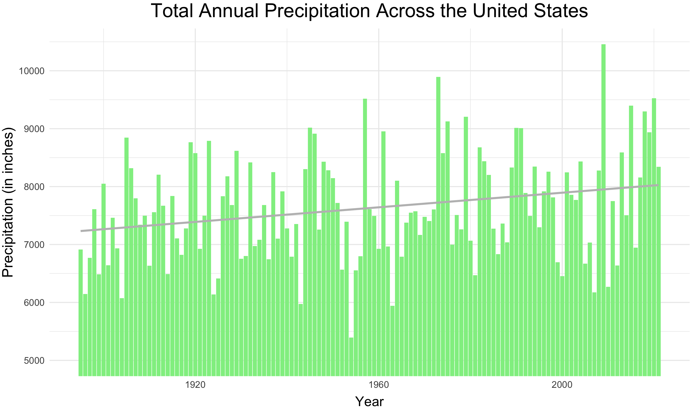

Plot 2: Line plot of the annual precipitation in Alabama (particularly
rainy state) from 1990 to 2021

``` r
#BY YEAR
cumulative_prec_mo <- climate %>% group_by(state, year) %>% summarize(January_sum = sum(January), February_sum = sum(February), March_sum = sum(March), April_sum = sum(April), May_sum = sum(May), June_sum = sum(June), July_sum = sum(July), August_sum = sum(August), September_sum = sum(September), October_sum = sum(October), November_sum = sum(November), December_sum = sum(December))
```

    ## `summarise()` has grouped output by 'state'. You can override using the
    ## `.groups` argument.

``` r
cumulative_prec_mo2 <- cumulative_prec_mo %>%
  rowwise() %>%
  mutate(Annual_sum = sum(January_sum:December_sum))

cumulative_prec_year = cumulative_prec_mo2 %>%
  select(state, year, Annual_sum) %>%
  filter(state %in% c(1, 2), year != 2022)
cumulative_prec_year
```

    ## # A tibble: 254 × 3
    ## # Rowwise:  state
    ##    state  year Annual_sum
    ##    <dbl> <dbl>      <dbl>
    ##  1     1  1895     88118.
    ##  2     1  1896     35662.
    ##  3     1  1897     36470.
    ##  4     1  1898      3399.
    ##  5     1  1899     20622.
    ##  6     1  1900     33858.
    ##  7     1  1901     71097.
    ##  8     1  1902     37263.
    ##  9     1  1903      6796.
    ## 10     1  1904      6454.
    ## # ℹ 244 more rows

``` r
# Assuming 'total_precip_year' is your data frame

# Filter data for Alabama (State 1) from 2005 to 2021
state_1_data <- cumulative_prec_year %>%
  filter(state == 1, year >= 1990 & year <= 2021)

# Create a line plot
plot2 <- ggplot(state_1_data, aes(x = year, y = Annual_sum, group = 1)) +
  geom_line(color = "blue", size = 1.4) +
  labs(title = "Annual Precipitation in Alabama (1990-2021) ",
       x = "Year",
       y = "Precipitation (in inches)") +
  theme_classic() +
  theme(
    plot.title = element_text(size = 20, vjust = 1.5, hjust = 0.5),  # Center the title horizontally
    axis.title.y = element_text(size = 15, vjust = 2.2, margin = margin(t = 32)),
    axis.title.x = element_text(size = 14, vjust = 1.9),  # Adjust the y-axis text size 
    axis.text.y = element_text(size = rel(1.1)),
    axis.text.x = element_text(size = rel(1.1))
  ) +  # Adjust the y-axis text size 
  scale_y_continuous(labels = scales::comma) 


# Save the plot using png
png("plot2.png", width = 10, height = 6, units = "in", res = 300)
dev.off()
```

    ## quartz_off_screen 
    ##                 2

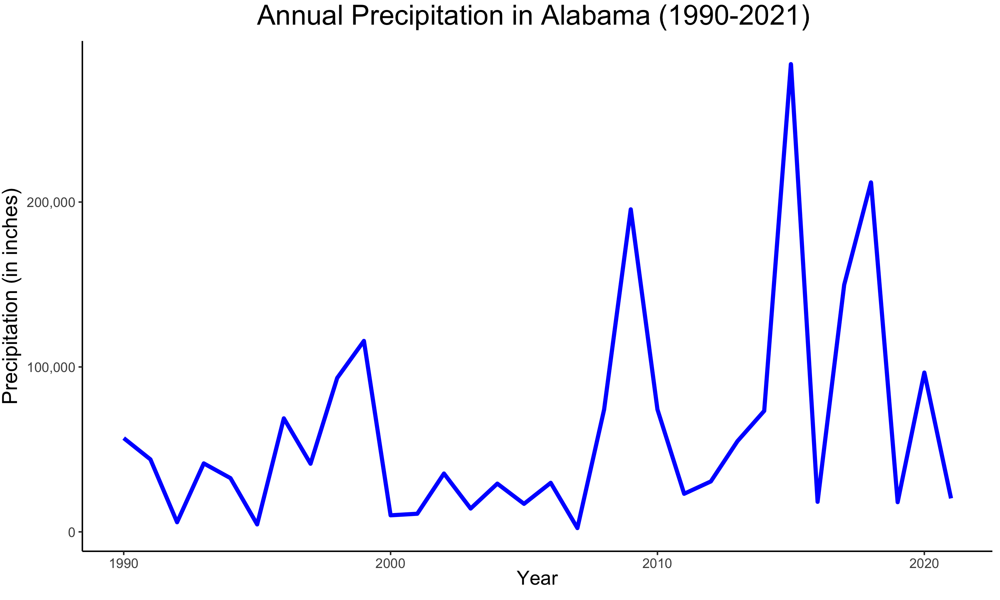

Plot 3: Overlaid Line plots Comparing Annual Precipitation in Georgia
and Kansas (1990-2021)

``` r
cumulative_prec_mo2
```

    ## # A tibble: 6,242 × 15
    ## # Rowwise:  state
    ##    state  year January_sum February_sum March_sum April_sum May_sum June_sum
    ##    <dbl> <dbl>       <dbl>        <dbl>     <dbl>     <dbl>   <dbl>    <dbl>
    ##  1     1  1895        506.         176.      514.      238.   254.     365. 
    ##  2     1  1896        289.         414.      362.      236.   217.     349. 
    ##  3     1  1897        244.         424.      729.      277.   108.     131. 
    ##  4     1  1898        267.         133.      214.      304.    64.9    246. 
    ##  5     1  1899        415.         435.      435.      173.   136.     184. 
    ##  6     1  1900        220.         582.      398.      578.   172.     672. 
    ##  7     1  1901        337.         297.      432.      342.   365.     220. 
    ##  8     1  1902        248.         467.      639.      157.   164.      95.6
    ##  9     1  1903        241.         712.      377.      190.   425.     318. 
    ## 10     1  1904        283.         274.      255.      157.   201.     215. 
    ## # ℹ 6,232 more rows
    ## # ℹ 7 more variables: July_sum <dbl>, August_sum <dbl>, September_sum <dbl>,
    ## #   October_sum <dbl>, November_sum <dbl>, December_sum <dbl>, Annual_sum <dbl>

``` r
cumulative_prec_year2 = cumulative_prec_mo2 %>%
  select(state, year, Annual_sum) %>%
  filter(state %in% c(9, 14), year != 2022)
cumulative_prec_year2
```

    ## # A tibble: 254 × 3
    ## # Rowwise:  state
    ##    state  year Annual_sum
    ##    <dbl> <dbl>      <dbl>
    ##  1     9  1895    730198.
    ##  2     9  1896     74383.
    ##  3     9  1897     68730.
    ##  4     9  1898    103215.
    ##  5     9  1899    312469.
    ##  6     9  1900    287863.
    ##  7     9  1901    133290.
    ##  8     9  1902    213595.
    ##  9     9  1903     69166.
    ## 10     9  1904     27233.
    ## # ℹ 244 more rows

``` r
# Filter data for Georgia (State 9) and Indiana (State 12) from 1990 to 2021
state_data <- cumulative_prec_year2 %>%
  filter(state %in% c(9, 14), year >= 1990 & year <= 2021)

# Create a line plot
plot3 <- ggplot(state_data, aes(x = year, y = Annual_sum, group = state, color = factor(state))) +
  geom_line(size = 1.3) +
  labs(title = "Annual Precipitation in Georgia and Kansas (1990-2021)",
       x = "Year",
       y = "Total Precipitation (in inches)",
       color = "State") +
  theme_minimal() +  
  theme(
    plot.title = element_text(size = 20, vjust = 1.5, hjust = 0.5),  # Center the title horizontally
    axis.title.y = element_text(size = 14, vjust = 2, margin = margin(t = 102)),
    axis.title.x = element_text(size = 14, vjust = 1.9),  # Adjust the y-axis text size 
    axis.text.y = element_text(size = rel(1.1)),
    axis.text.x = element_text(size = rel(1.1))
  ) +
  scale_color_manual(values = c("9" = "#40E0D0", "14" = "orange"),
                     labels = c("9" = "Georgia", "14" = "Kansas")) +  # Adjust the y-axis text size 
  scale_y_continuous(labels = scales::comma) 

#plot3 <- plot3 + theme(text = element_text(family = "Times New Roman"))


png("plot3.png", width = 10, height = 6, units = "in", res = 300)
dev.off()
```

    ## quartz_off_screen 
    ##                 2

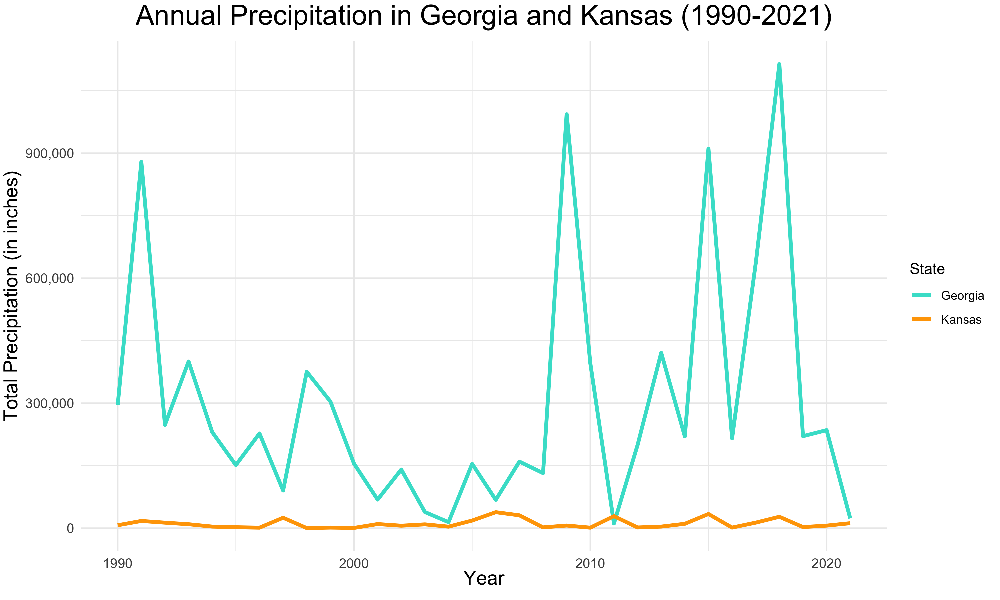

Plot 4: Bar Plot Comparing Annual Precipitation in Alabama and Indiana
(2017-2021)

``` r
cumulative_prec_year3 = cumulative_prec_mo2 %>%
  select(state, year, Annual_sum) %>%
  filter(state %in% c(1, 12), year != 2022)

# Filter data for Alabama (State 1) and Indiana (State 2) from 1990 to 2021
state_data <- cumulative_prec_year3 %>%
  filter(state %in% c(1, 12), year >= 2017 & year <= 2021)

# Create a bar plot
plot4 <- ggplot(state_data, aes(x = as.factor(year), y = Annual_sum, fill = factor(state))) +
  geom_bar(stat = "identity", position = "dodge") +
  labs(title = "Annual Precipitation in Alabama and Indiana (2017-2021)",
       x = "Year",
       y = "Total Precipitation (in inches)",
       fill = "State") +
  scale_fill_manual(values = c("lavender", "pink")) +  # Specify your custom colors here
  theme_minimal() +
  theme(
    plot.title = element_text(size = 20, vjust = 1.5, hjust = 0.5),  # Center the title horizontally
    axis.title.y = element_text(size = 13, vjust = 2, margin = margin(t = 102)),
    axis.title.x = element_text(size = 13, vjust = 2.2, margin = margin(t = 6)),  # Adjust the y-axis text size 
    axis.text.y = element_text(size = rel(1.1)),
    axis.text.x = element_text(size = rel(1.1))
  ) +
  scale_fill_manual(values = c("lavender", "pink"), labels = c("1" = "Alabama", "12" = "Indiana"))
```

    ## Scale for fill is already present.
    ## Adding another scale for fill, which will replace the existing scale.

``` r
png("plot4.png", width = 9.5, height = 5.7, units = "in", res = 300)
dev.off()
```

    ## quartz_off_screen 
    ##                 2

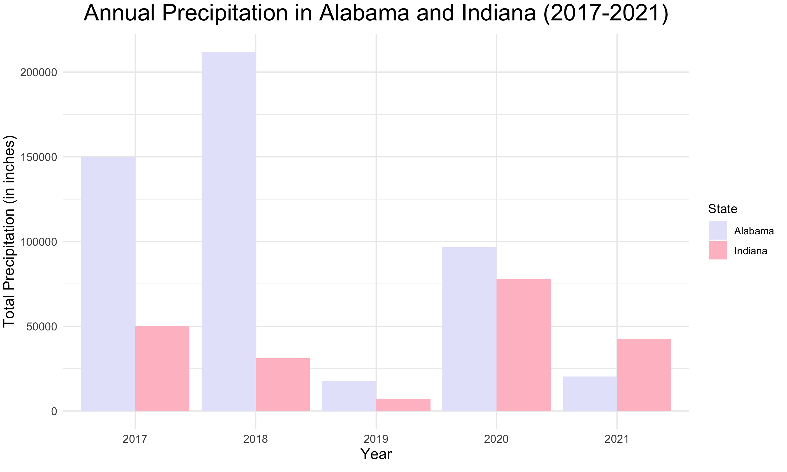 Plot 5: Area Chart Comparing Annual Precipitation in
Alabama and Indiana from 2017 to 2021

``` r
plot5 <- ggplot(state_data, aes(x = year, y = Annual_sum, fill = factor(state))) +
  geom_area(position = "stack") +
  labs(title = "Annual Precipitation in Alabama and Indiana (2017-2021)",
       x = "Year",
       y = "Total Precipitation (in inches)",
       fill = "State") +
  scale_fill_manual(values = c("lavender", "pink")) +  # Customize colors here
  theme_minimal() +
  theme(
    plot.title = element_text(size = 18, vjust = 1.5, hjust = 0.5),  # Center the title horizontally
    axis.title.y = element_text(size = 13, vjust = 2, margin = margin(t = 102)),
    axis.title.x = element_text(size = 13, vjust = 2.2, margin = margin(t = 6)),  # Adjust the y-axis text size 
    axis.text.y = element_text(size = rel(1.1)),
    axis.text.x = element_text(size = rel(1.1))
  ) +
  scale_fill_manual(values = c("lavender", "pink"), labels = c("1" = "Alabama", "12" = "Indiana"))
```

    ## Scale for fill is already present.
    ## Adding another scale for fill, which will replace the existing scale.

``` r
png("plot5.png", width = 9.4, height = 5.64, units = "in", res = 300)
dev.off()
```

    ## quartz_off_screen 
    ##                 2

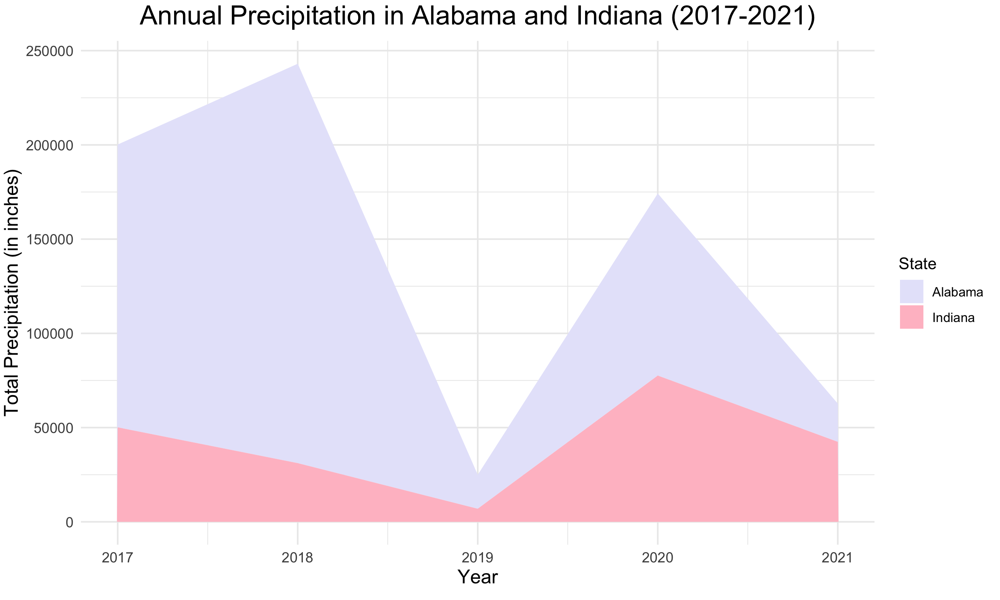

Table 1: From 2017 to 2021, a table of the highest precipitation monnths
with a column stating the precipitation amount and the associated state.

``` r
#Subset the dataset to include only the data from 2017-2021
climate_recent <- climate %>%
                  filter(year == '2017' | year == '2018' | year == '2019' | year == '2020' | year == '2021')
cumulative_prec_mo2 <- climate_recent %>% group_by(state, year) %>% summarize(January = sum(January), February = sum(February), March = sum(March), April = sum(April), May = sum(May), June = sum(June), July = sum(July), August = sum(August), September = sum(September), October = sum(October), November = sum(November), December = sum(December))
```

    ## `summarise()` has grouped output by 'state'. You can override using the
    ## `.groups` argument.

``` r
# Create a table with the top N states for each month
top_states_table <- cumulative_prec_mo2 %>%
  pivot_longer(cols = -c(state, year), names_to = "month", values_to = "precipitation") %>%
  group_by(month) %>%
  top_n(5, wt = precipitation) %>%
  arrange(month, desc(precipitation)) %>%
  ungroup()

colnames(top_states_table) <- c("State", "Year", "Month", "Precipitation")

library(dplyr)
library(gt)

# Mapping between state codes and names
state_mapping <- c("9" = "Georgia", "23" = "Missouri", "41" = "Texas", "44" = "Virginia")

# Replace numeric state codes with names
top_states_table <- top_states_table %>%
  mutate(State = state_mapping[as.character(State)])

# Remove grouping
top_states_table <- top_states_table %>% ungroup()

# Create a summary table
table1 <- top_states_table %>%
  gt() %>%
  cols_label(State = "State", Year = "Year", Month = "Month", Precipitation = "Precipitation") %>%
  cols_move_to_end(Year) %>%
  cols_move_to_end(Precipitation) %>%
  tab_header(
    title = "Highest Precipitation Months Across all States from 2017 to 2021",
    subtitle = "Total Precipitation, in inches"
  ) %>%
  fmt_number(
    columns = vars(Precipitation),  # Replace with actual column names
    decimals = 2
  )
```

    ## Warning: Since gt v0.3.0, `columns = vars(...)` has been deprecated.
    ## • Please use `columns = c(...)` instead.
    ## Since gt v0.3.0, `columns = vars(...)` has been deprecated.
    ## • Please use `columns = c(...)` instead.

``` r
# Display the table
table1
```

<div id="rsiffyjxqm" style="padding-left:0px;padding-right:0px;padding-top:10px;padding-bottom:10px;overflow-x:auto;overflow-y:auto;width:auto;height:auto;">
<style>#rsiffyjxqm table {
  font-family: system-ui, 'Segoe UI', Roboto, Helvetica, Arial, sans-serif, 'Apple Color Emoji', 'Segoe UI Emoji', 'Segoe UI Symbol', 'Noto Color Emoji';
  -webkit-font-smoothing: antialiased;
  -moz-osx-font-smoothing: grayscale;
}
&#10;#rsiffyjxqm thead, #rsiffyjxqm tbody, #rsiffyjxqm tfoot, #rsiffyjxqm tr, #rsiffyjxqm td, #rsiffyjxqm th {
  border-style: none;
}
&#10;#rsiffyjxqm p {
  margin: 0;
  padding: 0;
}
&#10;#rsiffyjxqm .gt_table {
  display: table;
  border-collapse: collapse;
  line-height: normal;
  margin-left: auto;
  margin-right: auto;
  color: #333333;
  font-size: 16px;
  font-weight: normal;
  font-style: normal;
  background-color: #FFFFFF;
  width: auto;
  border-top-style: solid;
  border-top-width: 2px;
  border-top-color: #A8A8A8;
  border-right-style: none;
  border-right-width: 2px;
  border-right-color: #D3D3D3;
  border-bottom-style: solid;
  border-bottom-width: 2px;
  border-bottom-color: #A8A8A8;
  border-left-style: none;
  border-left-width: 2px;
  border-left-color: #D3D3D3;
}
&#10;#rsiffyjxqm .gt_caption {
  padding-top: 4px;
  padding-bottom: 4px;
}
&#10;#rsiffyjxqm .gt_title {
  color: #333333;
  font-size: 125%;
  font-weight: initial;
  padding-top: 4px;
  padding-bottom: 4px;
  padding-left: 5px;
  padding-right: 5px;
  border-bottom-color: #FFFFFF;
  border-bottom-width: 0;
}
&#10;#rsiffyjxqm .gt_subtitle {
  color: #333333;
  font-size: 85%;
  font-weight: initial;
  padding-top: 3px;
  padding-bottom: 5px;
  padding-left: 5px;
  padding-right: 5px;
  border-top-color: #FFFFFF;
  border-top-width: 0;
}
&#10;#rsiffyjxqm .gt_heading {
  background-color: #FFFFFF;
  text-align: center;
  border-bottom-color: #FFFFFF;
  border-left-style: none;
  border-left-width: 1px;
  border-left-color: #D3D3D3;
  border-right-style: none;
  border-right-width: 1px;
  border-right-color: #D3D3D3;
}
&#10;#rsiffyjxqm .gt_bottom_border {
  border-bottom-style: solid;
  border-bottom-width: 2px;
  border-bottom-color: #D3D3D3;
}
&#10;#rsiffyjxqm .gt_col_headings {
  border-top-style: solid;
  border-top-width: 2px;
  border-top-color: #D3D3D3;
  border-bottom-style: solid;
  border-bottom-width: 2px;
  border-bottom-color: #D3D3D3;
  border-left-style: none;
  border-left-width: 1px;
  border-left-color: #D3D3D3;
  border-right-style: none;
  border-right-width: 1px;
  border-right-color: #D3D3D3;
}
&#10;#rsiffyjxqm .gt_col_heading {
  color: #333333;
  background-color: #FFFFFF;
  font-size: 100%;
  font-weight: normal;
  text-transform: inherit;
  border-left-style: none;
  border-left-width: 1px;
  border-left-color: #D3D3D3;
  border-right-style: none;
  border-right-width: 1px;
  border-right-color: #D3D3D3;
  vertical-align: bottom;
  padding-top: 5px;
  padding-bottom: 6px;
  padding-left: 5px;
  padding-right: 5px;
  overflow-x: hidden;
}
&#10;#rsiffyjxqm .gt_column_spanner_outer {
  color: #333333;
  background-color: #FFFFFF;
  font-size: 100%;
  font-weight: normal;
  text-transform: inherit;
  padding-top: 0;
  padding-bottom: 0;
  padding-left: 4px;
  padding-right: 4px;
}
&#10;#rsiffyjxqm .gt_column_spanner_outer:first-child {
  padding-left: 0;
}
&#10;#rsiffyjxqm .gt_column_spanner_outer:last-child {
  padding-right: 0;
}
&#10;#rsiffyjxqm .gt_column_spanner {
  border-bottom-style: solid;
  border-bottom-width: 2px;
  border-bottom-color: #D3D3D3;
  vertical-align: bottom;
  padding-top: 5px;
  padding-bottom: 5px;
  overflow-x: hidden;
  display: inline-block;
  width: 100%;
}
&#10;#rsiffyjxqm .gt_spanner_row {
  border-bottom-style: hidden;
}
&#10;#rsiffyjxqm .gt_group_heading {
  padding-top: 8px;
  padding-bottom: 8px;
  padding-left: 5px;
  padding-right: 5px;
  color: #333333;
  background-color: #FFFFFF;
  font-size: 100%;
  font-weight: initial;
  text-transform: inherit;
  border-top-style: solid;
  border-top-width: 2px;
  border-top-color: #D3D3D3;
  border-bottom-style: solid;
  border-bottom-width: 2px;
  border-bottom-color: #D3D3D3;
  border-left-style: none;
  border-left-width: 1px;
  border-left-color: #D3D3D3;
  border-right-style: none;
  border-right-width: 1px;
  border-right-color: #D3D3D3;
  vertical-align: middle;
  text-align: left;
}
&#10;#rsiffyjxqm .gt_empty_group_heading {
  padding: 0.5px;
  color: #333333;
  background-color: #FFFFFF;
  font-size: 100%;
  font-weight: initial;
  border-top-style: solid;
  border-top-width: 2px;
  border-top-color: #D3D3D3;
  border-bottom-style: solid;
  border-bottom-width: 2px;
  border-bottom-color: #D3D3D3;
  vertical-align: middle;
}
&#10;#rsiffyjxqm .gt_from_md > :first-child {
  margin-top: 0;
}
&#10;#rsiffyjxqm .gt_from_md > :last-child {
  margin-bottom: 0;
}
&#10;#rsiffyjxqm .gt_row {
  padding-top: 8px;
  padding-bottom: 8px;
  padding-left: 5px;
  padding-right: 5px;
  margin: 10px;
  border-top-style: solid;
  border-top-width: 1px;
  border-top-color: #D3D3D3;
  border-left-style: none;
  border-left-width: 1px;
  border-left-color: #D3D3D3;
  border-right-style: none;
  border-right-width: 1px;
  border-right-color: #D3D3D3;
  vertical-align: middle;
  overflow-x: hidden;
}
&#10;#rsiffyjxqm .gt_stub {
  color: #333333;
  background-color: #FFFFFF;
  font-size: 100%;
  font-weight: initial;
  text-transform: inherit;
  border-right-style: solid;
  border-right-width: 2px;
  border-right-color: #D3D3D3;
  padding-left: 5px;
  padding-right: 5px;
}
&#10;#rsiffyjxqm .gt_stub_row_group {
  color: #333333;
  background-color: #FFFFFF;
  font-size: 100%;
  font-weight: initial;
  text-transform: inherit;
  border-right-style: solid;
  border-right-width: 2px;
  border-right-color: #D3D3D3;
  padding-left: 5px;
  padding-right: 5px;
  vertical-align: top;
}
&#10;#rsiffyjxqm .gt_row_group_first td {
  border-top-width: 2px;
}
&#10;#rsiffyjxqm .gt_row_group_first th {
  border-top-width: 2px;
}
&#10;#rsiffyjxqm .gt_summary_row {
  color: #333333;
  background-color: #FFFFFF;
  text-transform: inherit;
  padding-top: 8px;
  padding-bottom: 8px;
  padding-left: 5px;
  padding-right: 5px;
}
&#10;#rsiffyjxqm .gt_first_summary_row {
  border-top-style: solid;
  border-top-color: #D3D3D3;
}
&#10;#rsiffyjxqm .gt_first_summary_row.thick {
  border-top-width: 2px;
}
&#10;#rsiffyjxqm .gt_last_summary_row {
  padding-top: 8px;
  padding-bottom: 8px;
  padding-left: 5px;
  padding-right: 5px;
  border-bottom-style: solid;
  border-bottom-width: 2px;
  border-bottom-color: #D3D3D3;
}
&#10;#rsiffyjxqm .gt_grand_summary_row {
  color: #333333;
  background-color: #FFFFFF;
  text-transform: inherit;
  padding-top: 8px;
  padding-bottom: 8px;
  padding-left: 5px;
  padding-right: 5px;
}
&#10;#rsiffyjxqm .gt_first_grand_summary_row {
  padding-top: 8px;
  padding-bottom: 8px;
  padding-left: 5px;
  padding-right: 5px;
  border-top-style: double;
  border-top-width: 6px;
  border-top-color: #D3D3D3;
}
&#10;#rsiffyjxqm .gt_last_grand_summary_row_top {
  padding-top: 8px;
  padding-bottom: 8px;
  padding-left: 5px;
  padding-right: 5px;
  border-bottom-style: double;
  border-bottom-width: 6px;
  border-bottom-color: #D3D3D3;
}
&#10;#rsiffyjxqm .gt_striped {
  background-color: rgba(128, 128, 128, 0.05);
}
&#10;#rsiffyjxqm .gt_table_body {
  border-top-style: solid;
  border-top-width: 2px;
  border-top-color: #D3D3D3;
  border-bottom-style: solid;
  border-bottom-width: 2px;
  border-bottom-color: #D3D3D3;
}
&#10;#rsiffyjxqm .gt_footnotes {
  color: #333333;
  background-color: #FFFFFF;
  border-bottom-style: none;
  border-bottom-width: 2px;
  border-bottom-color: #D3D3D3;
  border-left-style: none;
  border-left-width: 2px;
  border-left-color: #D3D3D3;
  border-right-style: none;
  border-right-width: 2px;
  border-right-color: #D3D3D3;
}
&#10;#rsiffyjxqm .gt_footnote {
  margin: 0px;
  font-size: 90%;
  padding-top: 4px;
  padding-bottom: 4px;
  padding-left: 5px;
  padding-right: 5px;
}
&#10;#rsiffyjxqm .gt_sourcenotes {
  color: #333333;
  background-color: #FFFFFF;
  border-bottom-style: none;
  border-bottom-width: 2px;
  border-bottom-color: #D3D3D3;
  border-left-style: none;
  border-left-width: 2px;
  border-left-color: #D3D3D3;
  border-right-style: none;
  border-right-width: 2px;
  border-right-color: #D3D3D3;
}
&#10;#rsiffyjxqm .gt_sourcenote {
  font-size: 90%;
  padding-top: 4px;
  padding-bottom: 4px;
  padding-left: 5px;
  padding-right: 5px;
}
&#10;#rsiffyjxqm .gt_left {
  text-align: left;
}
&#10;#rsiffyjxqm .gt_center {
  text-align: center;
}
&#10;#rsiffyjxqm .gt_right {
  text-align: right;
  font-variant-numeric: tabular-nums;
}
&#10;#rsiffyjxqm .gt_font_normal {
  font-weight: normal;
}
&#10;#rsiffyjxqm .gt_font_bold {
  font-weight: bold;
}
&#10;#rsiffyjxqm .gt_font_italic {
  font-style: italic;
}
&#10;#rsiffyjxqm .gt_super {
  font-size: 65%;
}
&#10;#rsiffyjxqm .gt_footnote_marks {
  font-size: 75%;
  vertical-align: 0.4em;
  position: initial;
}
&#10;#rsiffyjxqm .gt_asterisk {
  font-size: 100%;
  vertical-align: 0;
}
&#10;#rsiffyjxqm .gt_indent_1 {
  text-indent: 5px;
}
&#10;#rsiffyjxqm .gt_indent_2 {
  text-indent: 10px;
}
&#10;#rsiffyjxqm .gt_indent_3 {
  text-indent: 15px;
}
&#10;#rsiffyjxqm .gt_indent_4 {
  text-indent: 20px;
}
&#10;#rsiffyjxqm .gt_indent_5 {
  text-indent: 25px;
}
</style>
<table class="gt_table" data-quarto-disable-processing="false" data-quarto-bootstrap="false">
  <thead>
    <tr class="gt_heading">
      <td colspan="4" class="gt_heading gt_title gt_font_normal" style>Highest Precipitation Months Across all States from 2017 to 2021</td>
    </tr>
    <tr class="gt_heading">
      <td colspan="4" class="gt_heading gt_subtitle gt_font_normal gt_bottom_border" style>Total Precipitation, in inches</td>
    </tr>
    <tr class="gt_col_headings">
      <th class="gt_col_heading gt_columns_bottom_border gt_left" rowspan="1" colspan="1" scope="col" id="State">State</th>
      <th class="gt_col_heading gt_columns_bottom_border gt_left" rowspan="1" colspan="1" scope="col" id="Month">Month</th>
      <th class="gt_col_heading gt_columns_bottom_border gt_right" rowspan="1" colspan="1" scope="col" id="Year">Year</th>
      <th class="gt_col_heading gt_columns_bottom_border gt_right" rowspan="1" colspan="1" scope="col" id="Precipitation">Precipitation</th>
    </tr>
  </thead>
  <tbody class="gt_table_body">
    <tr><td headers="State" class="gt_row gt_left">Georgia</td>
<td headers="Month" class="gt_row gt_left">April</td>
<td headers="Year" class="gt_row gt_right">2020</td>
<td headers="Precipitation" class="gt_row gt_right">1,203.38</td></tr>
    <tr><td headers="State" class="gt_row gt_left">Missouri</td>
<td headers="Month" class="gt_row gt_left">April</td>
<td headers="Year" class="gt_row gt_right">2017</td>
<td headers="Precipitation" class="gt_row gt_right">1,064.48</td></tr>
    <tr><td headers="State" class="gt_row gt_left">Texas</td>
<td headers="Month" class="gt_row gt_left">April</td>
<td headers="Year" class="gt_row gt_right">2019</td>
<td headers="Precipitation" class="gt_row gt_right">1,041.52</td></tr>
    <tr><td headers="State" class="gt_row gt_left">Texas</td>
<td headers="Month" class="gt_row gt_left">April</td>
<td headers="Year" class="gt_row gt_right">2017</td>
<td headers="Precipitation" class="gt_row gt_right">781.66</td></tr>
    <tr><td headers="State" class="gt_row gt_left">Virginia</td>
<td headers="Month" class="gt_row gt_left">April</td>
<td headers="Year" class="gt_row gt_right">2020</td>
<td headers="Precipitation" class="gt_row gt_right">765.87</td></tr>
    <tr><td headers="State" class="gt_row gt_left">Texas</td>
<td headers="Month" class="gt_row gt_left">August</td>
<td headers="Year" class="gt_row gt_right">2017</td>
<td headers="Precipitation" class="gt_row gt_right">2,021.36</td></tr>
    <tr><td headers="State" class="gt_row gt_left">Virginia</td>
<td headers="Month" class="gt_row gt_left">August</td>
<td headers="Year" class="gt_row gt_right">2020</td>
<td headers="Precipitation" class="gt_row gt_right">1,131.17</td></tr>
    <tr><td headers="State" class="gt_row gt_left">Georgia</td>
<td headers="Month" class="gt_row gt_left">August</td>
<td headers="Year" class="gt_row gt_right">2020</td>
<td headers="Precipitation" class="gt_row gt_right">1,093.32</td></tr>
    <tr><td headers="State" class="gt_row gt_left">Georgia</td>
<td headers="Month" class="gt_row gt_left">August</td>
<td headers="Year" class="gt_row gt_right">2021</td>
<td headers="Precipitation" class="gt_row gt_right">1,073.99</td></tr>
    <tr><td headers="State" class="gt_row gt_left">Georgia</td>
<td headers="Month" class="gt_row gt_left">August</td>
<td headers="Year" class="gt_row gt_right">2018</td>
<td headers="Precipitation" class="gt_row gt_right">888.37</td></tr>
    <tr><td headers="State" class="gt_row gt_left">Georgia</td>
<td headers="Month" class="gt_row gt_left">December</td>
<td headers="Year" class="gt_row gt_right">2018</td>
<td headers="Precipitation" class="gt_row gt_right">1,560.62</td></tr>
    <tr><td headers="State" class="gt_row gt_left">Georgia</td>
<td headers="Month" class="gt_row gt_left">December</td>
<td headers="Year" class="gt_row gt_right">2019</td>
<td headers="Precipitation" class="gt_row gt_right">1,053.34</td></tr>
    <tr><td headers="State" class="gt_row gt_left">Texas</td>
<td headers="Month" class="gt_row gt_left">December</td>
<td headers="Year" class="gt_row gt_right">2018</td>
<td headers="Precipitation" class="gt_row gt_right">991.77</td></tr>
    <tr><td headers="State" class="gt_row gt_left">NA</td>
<td headers="Month" class="gt_row gt_left">December</td>
<td headers="Year" class="gt_row gt_right">2019</td>
<td headers="Precipitation" class="gt_row gt_right">725.63</td></tr>
    <tr><td headers="State" class="gt_row gt_left">NA</td>
<td headers="Month" class="gt_row gt_left">December</td>
<td headers="Year" class="gt_row gt_right">2018</td>
<td headers="Precipitation" class="gt_row gt_right">710.90</td></tr>
    <tr><td headers="State" class="gt_row gt_left">Georgia</td>
<td headers="Month" class="gt_row gt_left">February</td>
<td headers="Year" class="gt_row gt_right">2020</td>
<td headers="Precipitation" class="gt_row gt_right">1,464.27</td></tr>
    <tr><td headers="State" class="gt_row gt_left">NA</td>
<td headers="Month" class="gt_row gt_left">February</td>
<td headers="Year" class="gt_row gt_right">2019</td>
<td headers="Precipitation" class="gt_row gt_right">1,147.77</td></tr>
    <tr><td headers="State" class="gt_row gt_left">NA</td>
<td headers="Month" class="gt_row gt_left">February</td>
<td headers="Year" class="gt_row gt_right">2019</td>
<td headers="Precipitation" class="gt_row gt_right">1,096.22</td></tr>
    <tr><td headers="State" class="gt_row gt_left">NA</td>
<td headers="Month" class="gt_row gt_left">February</td>
<td headers="Year" class="gt_row gt_right">2018</td>
<td headers="Precipitation" class="gt_row gt_right">1,073.79</td></tr>
    <tr><td headers="State" class="gt_row gt_left">NA</td>
<td headers="Month" class="gt_row gt_left">February</td>
<td headers="Year" class="gt_row gt_right">2018</td>
<td headers="Precipitation" class="gt_row gt_right">997.11</td></tr>
    <tr><td headers="State" class="gt_row gt_left">Georgia</td>
<td headers="Month" class="gt_row gt_left">January</td>
<td headers="Year" class="gt_row gt_right">2017</td>
<td headers="Precipitation" class="gt_row gt_right">1,236.57</td></tr>
    <tr><td headers="State" class="gt_row gt_left">Georgia</td>
<td headers="Month" class="gt_row gt_left">January</td>
<td headers="Year" class="gt_row gt_right">2020</td>
<td headers="Precipitation" class="gt_row gt_right">849.73</td></tr>
    <tr><td headers="State" class="gt_row gt_left">Georgia</td>
<td headers="Month" class="gt_row gt_left">January</td>
<td headers="Year" class="gt_row gt_right">2019</td>
<td headers="Precipitation" class="gt_row gt_right">817.89</td></tr>
    <tr><td headers="State" class="gt_row gt_left">NA</td>
<td headers="Month" class="gt_row gt_left">January</td>
<td headers="Year" class="gt_row gt_right">2017</td>
<td headers="Precipitation" class="gt_row gt_right">756.68</td></tr>
    <tr><td headers="State" class="gt_row gt_left">Georgia</td>
<td headers="Month" class="gt_row gt_left">January</td>
<td headers="Year" class="gt_row gt_right">2021</td>
<td headers="Precipitation" class="gt_row gt_right">726.27</td></tr>
    <tr><td headers="State" class="gt_row gt_left">Georgia</td>
<td headers="Month" class="gt_row gt_left">July</td>
<td headers="Year" class="gt_row gt_right">2021</td>
<td headers="Precipitation" class="gt_row gt_right">1,128.18</td></tr>
    <tr><td headers="State" class="gt_row gt_left">Texas</td>
<td headers="Month" class="gt_row gt_left">July</td>
<td headers="Year" class="gt_row gt_right">2021</td>
<td headers="Precipitation" class="gt_row gt_right">1,092.45</td></tr>
    <tr><td headers="State" class="gt_row gt_left">Georgia</td>
<td headers="Month" class="gt_row gt_left">July</td>
<td headers="Year" class="gt_row gt_right">2018</td>
<td headers="Precipitation" class="gt_row gt_right">966.79</td></tr>
    <tr><td headers="State" class="gt_row gt_left">Virginia</td>
<td headers="Month" class="gt_row gt_left">July</td>
<td headers="Year" class="gt_row gt_right">2018</td>
<td headers="Precipitation" class="gt_row gt_right">770.55</td></tr>
    <tr><td headers="State" class="gt_row gt_left">NA</td>
<td headers="Month" class="gt_row gt_left">July</td>
<td headers="Year" class="gt_row gt_right">2021</td>
<td headers="Precipitation" class="gt_row gt_right">758.83</td></tr>
    <tr><td headers="State" class="gt_row gt_left">Texas</td>
<td headers="Month" class="gt_row gt_left">June</td>
<td headers="Year" class="gt_row gt_right">2019</td>
<td headers="Precipitation" class="gt_row gt_right">1,178.77</td></tr>
    <tr><td headers="State" class="gt_row gt_left">Texas</td>
<td headers="Month" class="gt_row gt_left">June</td>
<td headers="Year" class="gt_row gt_right">2021</td>
<td headers="Precipitation" class="gt_row gt_right">1,095.78</td></tr>
    <tr><td headers="State" class="gt_row gt_left">Georgia</td>
<td headers="Month" class="gt_row gt_left">June</td>
<td headers="Year" class="gt_row gt_right">2017</td>
<td headers="Precipitation" class="gt_row gt_right">1,002.98</td></tr>
    <tr><td headers="State" class="gt_row gt_left">Georgia</td>
<td headers="Month" class="gt_row gt_left">June</td>
<td headers="Year" class="gt_row gt_right">2021</td>
<td headers="Precipitation" class="gt_row gt_right">969.33</td></tr>
    <tr><td headers="State" class="gt_row gt_left">NA</td>
<td headers="Month" class="gt_row gt_left">June</td>
<td headers="Year" class="gt_row gt_right">2019</td>
<td headers="Precipitation" class="gt_row gt_right">966.30</td></tr>
    <tr><td headers="State" class="gt_row gt_left">NA</td>
<td headers="Month" class="gt_row gt_left">March</td>
<td headers="Year" class="gt_row gt_right">2021</td>
<td headers="Precipitation" class="gt_row gt_right">955.73</td></tr>
    <tr><td headers="State" class="gt_row gt_left">Texas</td>
<td headers="Month" class="gt_row gt_left">March</td>
<td headers="Year" class="gt_row gt_right">2020</td>
<td headers="Precipitation" class="gt_row gt_right">907.27</td></tr>
    <tr><td headers="State" class="gt_row gt_left">Georgia</td>
<td headers="Month" class="gt_row gt_left">March</td>
<td headers="Year" class="gt_row gt_right">2020</td>
<td headers="Precipitation" class="gt_row gt_right">881.28</td></tr>
    <tr><td headers="State" class="gt_row gt_left">Georgia</td>
<td headers="Month" class="gt_row gt_left">March</td>
<td headers="Year" class="gt_row gt_right">2021</td>
<td headers="Precipitation" class="gt_row gt_right">795.34</td></tr>
    <tr><td headers="State" class="gt_row gt_left">NA</td>
<td headers="Month" class="gt_row gt_left">March</td>
<td headers="Year" class="gt_row gt_right">2020</td>
<td headers="Precipitation" class="gt_row gt_right">794.79</td></tr>
    <tr><td headers="State" class="gt_row gt_left">Texas</td>
<td headers="Month" class="gt_row gt_left">May</td>
<td headers="Year" class="gt_row gt_right">2021</td>
<td headers="Precipitation" class="gt_row gt_right">1,813.44</td></tr>
    <tr><td headers="State" class="gt_row gt_left">Texas</td>
<td headers="Month" class="gt_row gt_left">May</td>
<td headers="Year" class="gt_row gt_right">2019</td>
<td headers="Precipitation" class="gt_row gt_right">1,523.56</td></tr>
    <tr><td headers="State" class="gt_row gt_left">Missouri</td>
<td headers="Month" class="gt_row gt_left">May</td>
<td headers="Year" class="gt_row gt_right">2019</td>
<td headers="Precipitation" class="gt_row gt_right">1,189.25</td></tr>
    <tr><td headers="State" class="gt_row gt_left">NA</td>
<td headers="Month" class="gt_row gt_left">May</td>
<td headers="Year" class="gt_row gt_right">2019</td>
<td headers="Precipitation" class="gt_row gt_right">1,126.41</td></tr>
    <tr><td headers="State" class="gt_row gt_left">Georgia</td>
<td headers="Month" class="gt_row gt_left">May</td>
<td headers="Year" class="gt_row gt_right">2018</td>
<td headers="Precipitation" class="gt_row gt_right">1,062.55</td></tr>
    <tr><td headers="State" class="gt_row gt_left">Georgia</td>
<td headers="Month" class="gt_row gt_left">November</td>
<td headers="Year" class="gt_row gt_right">2018</td>
<td headers="Precipitation" class="gt_row gt_right">1,025.34</td></tr>
    <tr><td headers="State" class="gt_row gt_left">Virginia</td>
<td headers="Month" class="gt_row gt_left">November</td>
<td headers="Year" class="gt_row gt_right">2018</td>
<td headers="Precipitation" class="gt_row gt_right">791.80</td></tr>
    <tr><td headers="State" class="gt_row gt_left">NA</td>
<td headers="Month" class="gt_row gt_left">November</td>
<td headers="Year" class="gt_row gt_right">2018</td>
<td headers="Precipitation" class="gt_row gt_right">692.08</td></tr>
    <tr><td headers="State" class="gt_row gt_left">Virginia</td>
<td headers="Month" class="gt_row gt_left">November</td>
<td headers="Year" class="gt_row gt_right">2020</td>
<td headers="Precipitation" class="gt_row gt_right">676.34</td></tr>
    <tr><td headers="State" class="gt_row gt_left">NA</td>
<td headers="Month" class="gt_row gt_left">November</td>
<td headers="Year" class="gt_row gt_right">2018</td>
<td headers="Precipitation" class="gt_row gt_right">640.54</td></tr>
    <tr><td headers="State" class="gt_row gt_left">Texas</td>
<td headers="Month" class="gt_row gt_left">October</td>
<td headers="Year" class="gt_row gt_right">2018</td>
<td headers="Precipitation" class="gt_row gt_right">1,880.99</td></tr>
    <tr><td headers="State" class="gt_row gt_left">Georgia</td>
<td headers="Month" class="gt_row gt_left">October</td>
<td headers="Year" class="gt_row gt_right">2019</td>
<td headers="Precipitation" class="gt_row gt_right">873.26</td></tr>
    <tr><td headers="State" class="gt_row gt_left">NA</td>
<td headers="Month" class="gt_row gt_left">October</td>
<td headers="Year" class="gt_row gt_right">2019</td>
<td headers="Precipitation" class="gt_row gt_right">828.21</td></tr>
    <tr><td headers="State" class="gt_row gt_left">Texas</td>
<td headers="Month" class="gt_row gt_left">October</td>
<td headers="Year" class="gt_row gt_right">2019</td>
<td headers="Precipitation" class="gt_row gt_right">786.16</td></tr>
    <tr><td headers="State" class="gt_row gt_left">NA</td>
<td headers="Month" class="gt_row gt_left">October</td>
<td headers="Year" class="gt_row gt_right">2019</td>
<td headers="Precipitation" class="gt_row gt_right">755.84</td></tr>
    <tr><td headers="State" class="gt_row gt_left">Texas</td>
<td headers="Month" class="gt_row gt_left">September</td>
<td headers="Year" class="gt_row gt_right">2018</td>
<td headers="Precipitation" class="gt_row gt_right">1,830.13</td></tr>
    <tr><td headers="State" class="gt_row gt_left">Texas</td>
<td headers="Month" class="gt_row gt_left">September</td>
<td headers="Year" class="gt_row gt_right">2020</td>
<td headers="Precipitation" class="gt_row gt_right">1,171.90</td></tr>
    <tr><td headers="State" class="gt_row gt_left">Georgia</td>
<td headers="Month" class="gt_row gt_left">September</td>
<td headers="Year" class="gt_row gt_right">2020</td>
<td headers="Precipitation" class="gt_row gt_right">1,048.34</td></tr>
    <tr><td headers="State" class="gt_row gt_left">NA</td>
<td headers="Month" class="gt_row gt_left">September</td>
<td headers="Year" class="gt_row gt_right">2018</td>
<td headers="Precipitation" class="gt_row gt_right">1,005.99</td></tr>
    <tr><td headers="State" class="gt_row gt_left">Virginia</td>
<td headers="Month" class="gt_row gt_left">September</td>
<td headers="Year" class="gt_row gt_right">2018</td>
<td headers="Precipitation" class="gt_row gt_right">1,005.22</td></tr>
  </tbody>
  &#10;  
</table>
</div>

``` r
table1_subset <- head(top_states_table, n = 8)
  
  # Get the first 8 rows
table1_subset <- head(top_states_table, n = 8)

# Create a summary table
table1 <- table1_subset %>%
  gt() %>%
  cols_label(State = "State", Year = "Year", Month = "Month", Precipitation = "Precipitation") %>%
  cols_move_to_end(Year) %>%
  cols_move_to_end(Precipitation) %>%
  tab_header(
    title = "Highest Precipitation Months Across all States from 2017 to 2021",
    subtitle = "Total Precipitation, in inches"
  ) %>%
  fmt_number(
    columns = vars(Precipitation),  # Replace with actual column names
    decimals = 2
  )
```

    ## Warning: Since gt v0.3.0, `columns = vars(...)` has been deprecated.
    ## • Please use `columns = c(...)` instead.
    ## Since gt v0.3.0, `columns = vars(...)` has been deprecated.
    ## • Please use `columns = c(...)` instead.

Plot 6: Line plot of five states in the same region from 2017 to 2021
with a line graph (a particularly rainy subset)

``` r
cumulative_prec_mo2 <- cumulative_prec_mo %>%
  rowwise() %>%
  mutate(Annual_sum = sum(January_sum:December_sum))

cumulative_prec_year2 = cumulative_prec_mo2 %>%
  select(state, year, Annual_sum) %>%
  filter(state %in% c(8, 1, 16, 38, 9, 40, 26, 42, 2, 5), year != 2022)
cumulative_prec_year2
```

    ## # A tibble: 1,270 × 3
    ## # Rowwise:  state
    ##    state  year Annual_sum
    ##    <dbl> <dbl>      <dbl>
    ##  1     1  1895     88118.
    ##  2     1  1896     35662.
    ##  3     1  1897     36470.
    ##  4     1  1898      3399.
    ##  5     1  1899     20622.
    ##  6     1  1900     33858.
    ##  7     1  1901     71097.
    ##  8     1  1902     37263.
    ##  9     1  1903      6796.
    ## 10     1  1904      6454.
    ## # ℹ 1,260 more rows

``` r
# Filter data for Georgia (State 9) and Indiana (State 12) from 1990 to 2021
state_data <- cumulative_prec_year2 %>%
  filter(state %in% c(8, 1, 16, 38, 9, 40, 26, 42, 2, 5), year >= 1990 & year <= 2021)

# Create a line plot
plot6 <- ggplot(state_data, aes(x = year, y = Annual_sum, group = state, color = factor(state))) +
  geom_line() +
  labs(title = "Precipitation in Southeastern (Blue) and Southwestern (Red) States (1990-2021)",
       x = "Year",
       y = "Total Precipitation (in inches)",
       color = "State") +
  theme_minimal() +  
  theme(
    plot.title = element_text(size = 14, vjust = -3, hjust = 0.5),  # Center the title horizontally
    axis.title.y = element_text(size = 13, vjust = 1.1, margin = margin(r = 10)),
    axis.title.x = element_text(size = 12, vjust = 2.2, margin = margin(t = 3)),  # Adjust the y-axis text size 
    axis.text.y = element_text(size = rel(1.1)),
    axis.text.x = element_text(size = rel(1.1))
  ) +
  scale_color_manual(values = c("9" = "blue", "8" = "blue", "1" = "blue", "16" = "blue", "38" = "blue", "40" = "blue", "26" = "red", "42" = "red", "2" = "red", "5" = "red"),
                     labels = c("9" = "Georgia", "8" = "Florida", "1" = "Alabama", "16" = "Louisiana", "38" = "South Carolina", "40" = "Tennessee", "26" = "Nevada", "42" = "Utah", "2" = "Arizona", "5" = "Colorado")) +   
  scale_y_continuous(labels = scales::comma) 

png("plot6.png", width = 9.3, height = 5.58, units = "in", res = 300)
dev.off()
```

    ## quartz_off_screen 
    ##                 2

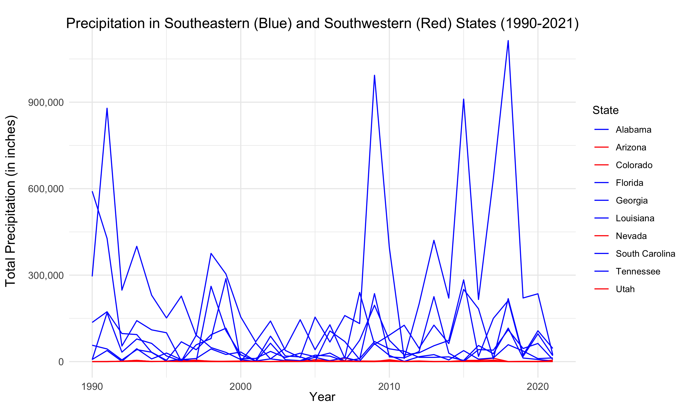

Plot 7: Boxplot comparison of Southeast and Southwest regions of the US
from 2017 to 2021

``` r
library(ggridges)
library(dplyr)

# Assuming you have a data frame named `precipitation_data` with columns like "State" and "Precipitation"
# Assuming you have a mapping of states to regions in a data frame named `state_region_mapping`

cumulative_prec_mo2
```

    ## # A tibble: 6,242 × 15
    ## # Rowwise:  state
    ##    state  year January_sum February_sum March_sum April_sum May_sum June_sum
    ##    <dbl> <dbl>       <dbl>        <dbl>     <dbl>     <dbl>   <dbl>    <dbl>
    ##  1     1  1895        506.         176.      514.      238.   254.     365. 
    ##  2     1  1896        289.         414.      362.      236.   217.     349. 
    ##  3     1  1897        244.         424.      729.      277.   108.     131. 
    ##  4     1  1898        267.         133.      214.      304.    64.9    246. 
    ##  5     1  1899        415.         435.      435.      173.   136.     184. 
    ##  6     1  1900        220.         582.      398.      578.   172.     672. 
    ##  7     1  1901        337.         297.      432.      342.   365.     220. 
    ##  8     1  1902        248.         467.      639.      157.   164.      95.6
    ##  9     1  1903        241.         712.      377.      190.   425.     318. 
    ## 10     1  1904        283.         274.      255.      157.   201.     215. 
    ## # ℹ 6,232 more rows
    ## # ℹ 7 more variables: July_sum <dbl>, August_sum <dbl>, September_sum <dbl>,
    ## #   October_sum <dbl>, November_sum <dbl>, December_sum <dbl>, Annual_sum <dbl>

``` r
cumulative_prec_mo22 <- cumulative_prec_mo2 %>%
                  filter(year == '2017' | year == '2018' | year == '2019' | year == '2020' | year == '2021')


# Example state to region mapping
state_region_mapping <- data.frame(
  state = c(8, 1, 16, 38, 9, 40, 26, 42, 2, 5),
  Region = c("Southeast", "Southeast", "Southeast", "Southeast", "Southeast", "Southeast", "Southwest", "Southwest", "Southwest", "Southwest")
)

#8 florida, 1 alabama, 16 louisiana, 38 south carolina , 9 georgia, 40 tennessee 
#driest Nevada 26, Utah 42, arizona 2, colorado 5

# Merge precipitation_data with state_region_mapping
precipitation_data <- cumulative_prec_mo22 %>%
  left_join(state_region_mapping, by = "state")

subset_data <- precipitation_data %>%
  filter(Region %in% c("Southwest", "Southeast"), year != 2022)


subset_data_west <- subset_data[subset_data$Region == "Southwest", ]
subset_data_east <- subset_data[subset_data$Region == "Southeast", ]

# Create a box plot
plot7 <- boxplot(Annual_sum ~ Region, data = subset_data, 
        ylim = c(0, 150000),
        col = c("lightcoral", "blue"),  # Set colors for West and East, respectively
        main = "Total Annual Precipitation Across US Southwest and Southeast Regions, 2017-2021",
        xlab = "Region",
        ylab = "Precipitation (inches)")
```

<!-- -->

``` r
png("plot7.png", width = 9.3, height = 5.58, units = "in", res = 300)
print(plot7)
```

    ## $stats
    ##           [,1]     [,2]
    ## [1,]   2173.45    9.670
    ## [2,]  12863.78   60.450
    ## [3,]  42603.54  350.015
    ## [4,] 116240.60 1722.230
    ## [5,] 235328.04 2951.640
    ## 
    ## $n
    ## [1] 30 20
    ## 
    ## $conf
    ##          [,1]      [,2]
    ## [1,] 12782.72 -237.0898
    ## [2,] 72424.36  937.1198
    ## 
    ## $out
    ## [1]  635085.39 1113685.30   11884.80    4977.36    5337.16
    ## 
    ## $group
    ## [1] 1 1 2 2 2
    ## 
    ## $names
    ## [1] "Southeast" "Southwest"

``` r
dev.off()
```

    ## quartz_off_screen 
    ##                 2

``` r
plot7 <- ggplot(subset_data, aes(x = Region, y = Annual_sum, fill = Region)) +
  geom_boxplot() +
  ylim(0, 150000) +
  labs(
    title = "Total Annual Precipitation Across US Southwest and Southeast Regions, 2017-2021",
    x = "Region",
    y = "Precipitation (inches)"
  ) +
  coord_cartesian(ylim = c(0, 120000)) +  # Limit the y-axis range
  theme_minimal()

# Save the ggplot as a PNG file
png("plot7.png", width = 9.3, height = 5.58, units = "in", res = 300)
dev.off()
```

    ## quartz_off_screen 
    ##                 2

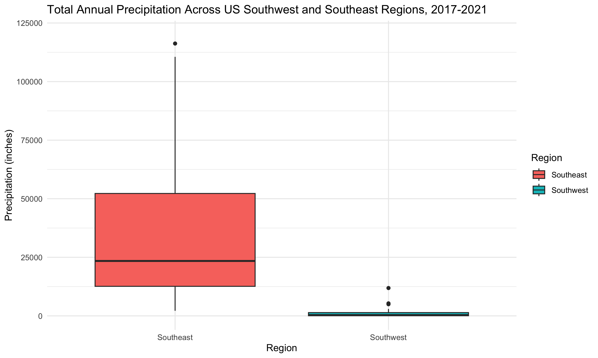

Plot 8:

``` r
library(leaflet)
library(rnaturalearth)
```

    ## The legacy packages maptools, rgdal, and rgeos, underpinning the sp package,
    ## which was just loaded, were retired in October 2023.
    ## Please refer to R-spatial evolution reports for details, especially
    ## https://r-spatial.org/r/2023/05/15/evolution4.html.
    ## It may be desirable to make the sf package available;
    ## package maintainers should consider adding sf to Suggests:.

    ## Support for Spatial objects (`sp`) will be deprecated in {rnaturalearth} and will be removed in a future release of the package. Please use `sf` objects with {rnaturalearth}. For example: `ne_download(returnclass = 'sf')`

``` r
library(sf)
```

    ## Linking to GEOS 3.11.0, GDAL 3.5.3, PROJ 9.1.0; sf_use_s2() is TRUE

``` r
cumulative_prec_mo <- climate_recent %>% group_by(year, state)  %>% summarize(January_sum = sum(January), February_sum = sum(February), March_sum = sum(March), April_sum = sum(April), May_sum = sum(May), June_sum = sum(June), July_sum = sum(July), August_sum = sum(August), September_sum = sum(September), October_sum = sum(October), November_sum = sum(November), December_sum = sum(December))
```

    ## `summarise()` has grouped output by 'year'. You can override using the
    ## `.groups` argument.

``` r
cumulative_prec_mo2 <- cumulative_prec_mo %>%
  rowwise() %>%
  mutate(Annual_sum = sum(January_sum:December_sum))

cumulative_prec_mo2 = cumulative_prec_mo2 %>% filter(year == 2017)

#Figure out values for breaks
quantiles <- quantile(cumulative_prec_mo2$Annual_sum, probs = seq(0, 1, 1/3))

# Print the quantile values
print(quantiles)
```

    ##        0% 33.33333% 66.66667%      100% 
    ##     36.54   3785.50  17825.72 635085.39

``` r
# Load U.S. states data
us_states <- ne_states(country = "united states of america", returnclass = "sf")

# Assuming your precipitation data is in a column named "precipitation"
# You can adjust the breaks and labels based on your data distribution
breaks <- c(0, 3785.50, 17825.72, Inf)
labels <- c("Low", "Moderate", "High")

# Create a new column "Category" based on precipitation levels
cumulative_prec_mo2$Category <- cut(cumulative_prec_mo2$Annual_sum, breaks = breaks, labels = labels, include.lowest = TRUE)

#Add name column
cumulative_prec_mo2$name <- c("Alabama", "Arizona", "Arkansas", "California", "Colorado", "Connecticut", "Delaware", "Florida", "Georgia", "Idaho", "Illinois", "Indiana", "Iowa", "Kansas", "Kentucky", "Louisiana", "Maine", "Maryland", "Massachusetts", "Michigan", "Minnesota", "Mississippi", "Missouri", "Montana", "Nebraska", "Nevada", "New Hampshire", "New Jersey", "New Mexico", "New York", "North Carolina", "North Dakota", "Ohio", "Oklahoma", "Oregon", "Pennsylvania", "Rhode Island", "South Carolina", "South Dakota", "Tennessee", "Texas", "Utah", "Vermont", "Virginia", "Washington", "West Virginia", "Wisconsin", "Wyoming", "Alaska")

# Merge the cumulative_prec_mo2 data with U.S. states data
#us_states <- merge(us_states, my_data, by.x = "name", by.y = "State", all.x = TRUE)

#us_states %>% select(name, Category)
cumulative_prec_mo2 %>% select(name, Category)
```

    ## Adding missing grouping variables: `year`

    ## # A tibble: 49 × 3
    ## # Rowwise:  year
    ##     year name        Category
    ##    <dbl> <chr>       <fct>   
    ##  1  2017 Alabama     High    
    ##  2  2017 Arizona     Low     
    ##  3  2017 Arkansas    High    
    ##  4  2017 California  High    
    ##  5  2017 Colorado    Moderate
    ##  6  2017 Connecticut Low     
    ##  7  2017 Delaware    Low     
    ##  8  2017 Florida     High    
    ##  9  2017 Georgia     High    
    ## 10  2017 Idaho       Moderate
    ## # ℹ 39 more rows

``` r
us_states <- merge(us_states, cumulative_prec_mo2, by.x = "name", by.y = "name", all.x = TRUE)


# Define colors for each category
categories <- labels
colors <- c("yellow", "orange", "red")

map <- leaflet(data = us_states) %>%
  setView(lng = -98.583333, lat = 39.833333, zoom = 3) %>%
  addTiles() %>%
  addPolygons(
    fillColor = ~ifelse(is.na(cumulative_prec_mo2$Category), "gray", colors[match(us_states$Category, categories)]),
    fillOpacity = 0.7,
    color = "black",
    stroke = TRUE,
    weight = 1,
    popup = ~name
  )

# Add a legend to the map
map <- addLegend(
  map,
  position = "bottomright",
  colors = colors,
  labels = categories,
  title = "Legend Title"
)

# View the map with the legend
map
```

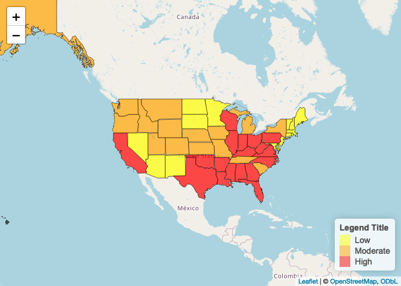<!-- -->

``` r
library(htmlwidgets)


# Save the leaflet map as an HTML file
saveWidget(map, file = "my_leaflet_map.html")


library(webshot)
# Save the leaflet map as an HTML file
saveWidget(map, file = "my_leaflet_map.html")

# Capture a screenshot of the HTML file and save it as a PNG
webshot("my_leaflet_map.html", file = "my_leaflet_map.png")
```

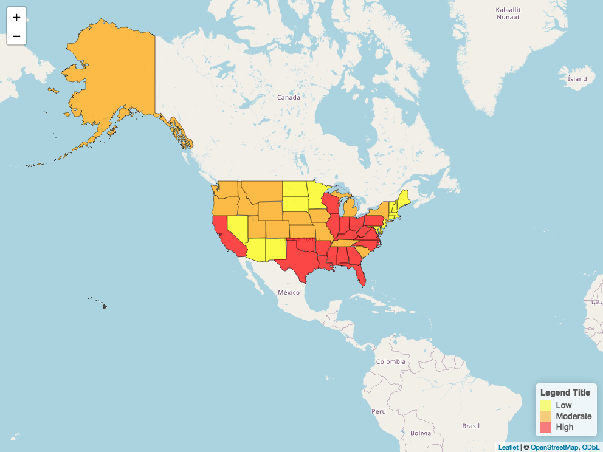<!-- -->

MODEL: In the following section, I work on building the model referenced
in the report.

``` r
#Marine Thunderstorm Wind only by region (not states)

#Predictors 
#I get data from here https://www.ncei.noaa.gov/pub/data/swdi/stormevents/csvfiles/

#This function helps automate the process of isolating data regarding event type for each state in each year 
create_df <- function(og_csv, event_type_list){
  new_df <- og_csv %>%
  filter(EVENT_TYPE %in% event_type_list) %>%
  count(STATE)
  return(new_df)
}

################
#All for 2018

storm_details_2018 <- read.csv("storm_details_2018.csv")

#Rain
rainy_2018 <- create_df(storm_details_2018, "Heavy Rain")

#Winter Weather
#note: includes DC
winter_2018 <- create_df(storm_details_2018, c("Winter Storm", "Winter Weather", "Ice Storm", "Heavy Snow"))

#Hail
hail_2018 <- create_df(storm_details_2018, "Hail")

#Tornadoes
tornado_2018 <- create_df(storm_details_2018, "Tornado")

#Windy weather
windy_2018 <- create_df(storm_details_2018, c("Strong Wind", "High Wind", "Thunderstorm Wind"))

#Floods
flood_2018 <- create_df(storm_details_2018, c("Flood", "Flash Flood", "Coastal Flood"))

#Wildfires Likely (droughts and smo)
wildfire_2018 <- create_df(storm_details_2018, c("Drought", "Dense Smoke"))

#Dust storms
duststorm_2018 <- create_df(storm_details_2018, "Dust Storm")

################
#All for 2019

storm_details_2019 <- read.csv("storm_details_2019.csv")

#Rain
rainy_2019 <- create_df(storm_details_2019, "Heavy Rain")

#Winter Weather
#note: includes DC
winter_2019 <- create_df(storm_details_2019, c("Winter Storm", "Winter Weather", "Ice Storm", "Heavy Snow"))

#Hail
hail_2019 <- create_df(storm_details_2019, "Hail")

#Tornadoes
tornado_2019 <- create_df(storm_details_2019, "Tornado")

#Windy weather
windy_2019 <- create_df(storm_details_2019, c("Strong Wind", "High Wind", "Thunderstorm Wind"))

#Floods
flood_2019 <- create_df(storm_details_2019, c("Flood", "Flash Flood", "Coastal Flood"))

#Wildfires Likely (droughts and smo)
wildfire_2019 <- create_df(storm_details_2019, c("Drought", "Dense Smoke"))

#Dust storms
duststorm_2019 <- create_df(storm_details_2019, "Dust Storm")


################
#All for 2020

storm_details_2020 <- read.csv("storm_details_2020.csv")

#Rain
rainy_2020 <- create_df(storm_details_2020, "Heavy Rain")

#Winter Weather
#note: includes DC
winter_2020 <- create_df(storm_details_2020,c("Winter Storm", "Winter Weather", "Ice Storm", "Heavy Snow"))

#Hail
hail_2020 <- create_df(storm_details_2020, "Hail")

#Tornadoes
tornado_2020 <- create_df(storm_details_2020, "Tornado")

#Windy weather
windy_2020 <- create_df(storm_details_2020, c("Strong Wind", "High Wind", "Thunderstorm Wind"))

#Floods
flood_2020 <- create_df(storm_details_2020, c("Flood", "Flash Flood", "Coastal Flood"))

#Wildfires Likely (droughts and smo)
wildfire_2020 <- create_df(storm_details_2020, c("Drought", "Dense Smoke"))

#Dust storms
duststorm_2020 <- create_df(storm_details_2020, "Dust Storm")


##################
#All for 2021
storm_details_2021 <- read.csv("storm_details_2021.csv")
#Example
YA <- storm_details_2021 %>% group_by(STATE, EVENT_TYPE) %>% summarize(Count_ColdWindChill = sum(EVENT_TYPE == "Cold/Wind Chill"))
```

    ## `summarise()` has grouped output by 'STATE'. You can override using the
    ## `.groups` argument.

``` r
#Rain
rainy_2021 <- create_df(storm_details_2021, "Heavy Rain")

#Winter Weather
#note: includes DC
winter_2021 <- create_df(storm_details_2021, c("Winter Storm", "Winter Weather", "Ice Storm", "Heavy Snow"))

#Hail
hail_2021 <- create_df(storm_details_2021, "Hail")

#Tornadoes
tornado_2021 <- create_df(storm_details_2021, "Tornado")

#Windy weather
windy_2021 <- create_df(storm_details_2021, c("Strong Wind", "High Wind", "Thunderstorm Wind"))

#Floods
flood_2021 <- create_df(storm_details_2021, c("Flood", "Flash Flood", "Coastal Flood"))

#Wildfires Likely (droughts and smo)
wildfire_2021 <- create_df(storm_details_2021, c("Drought", "Dense Smoke"))

#Dust storms
duststorm_2021 <- create_df(storm_details_2021, "Dust Storm")


#Now edit the dataframes so that there are 50 states in each and such that for the states in which there were no incidences of a particular event, the count is 0
#The function edit_lists performs this desired function

edit_lists <- function (og_list){
      # Create a vector of states I want to retain (all 50 states)
      state_list = c("ALABAMA", "ALASKA", "ARIZONA", "ARKANSAS", "CALIFORNIA", "COLORADO", "CONNECTICUT", "DELAWARE", "FLORIDA", "GEORGIA", "HAWAII", "IDAHO", "ILLINOIS", "INDIANA", "IOWA", "KANSAS", "KENTUCKY", "LOUISIANA", "MAINE", "MARYLAND", "MASSACHUSETTS", "MICHIGAN", "MINNESOTA", "MISSISSIPPI", "MISSOURI", "MONTANA", "NEBRASKA", "NEVADA", "NEW HAMPSHIRE", "NEW JERSEY", "NEW MEXICO", "NEW YORK", "NORTH CAROLINA", "NORTH DAKOTA", "OHIO", "OKLAHOMA", "OREGON", "PENNSYLVANIA", "RHODE ISLAND", "SOUTH CAROLINA", "SOUTH DAKOTA", "TENNESSEE", "TEXAS", "UTAH", "VERMONT", "VIRGINIA", "WASHINGTON", "WEST VIRGINIA", "WISCONSIN", "WYOMING")
      
      # Create a new data frame with all states I want to include
      all_states <- data.frame(STATE = state_list)
      
      # Left join to add missing states
      new_list <- merge(all_states, og_list, all.x = TRUE, by = "STATE")
      
      # Replace missing values (NAs) with 0
      new_list[is.na(new_list)] <- 0
      
      return(new_list)
}

#Apply the function such that each of the dataframes now contains all 50 states 

#2018
winter_2018_50 = edit_lists(winter_2018)
hail_2018_50 = edit_lists(hail_2018)
tornado_2018_50 = edit_lists(tornado_2018)
windy_2018_50 = edit_lists(windy_2018)
flood_2018_50 = edit_lists(flood_2018)
wildfire_2018_50 = edit_lists(wildfire_2018)
duststorm_2018_50 = edit_lists(duststorm_2018)

#2019
winter_2019_50 = edit_lists(winter_2019)
hail_2019_50 = edit_lists(hail_2019)
tornado_2019_50 = edit_lists(tornado_2019)
windy_2019_50 = edit_lists(windy_2019)
flood_2019_50 = edit_lists(flood_2019)
wildfire_2019_50 = edit_lists(wildfire_2019)
duststorm_2019_50 = edit_lists(duststorm_2019)

#Double check that there are 50 states in each and 0's in all the states with no events:
nrow(duststorm_2019_50)
```

    ## [1] 50

``` r
#duststorm_2019_50

#2020
winter_2020_50 = edit_lists(winter_2020)
hail_2020_50 = edit_lists(hail_2020)
tornado_2020_50 = edit_lists(tornado_2020)
windy_2020_50 = edit_lists(windy_2020)
flood_2020_50 = edit_lists(flood_2020)
wildfire_2020_50 = edit_lists(wildfire_2020)
duststorm_2020_50 = edit_lists(duststorm_2020)

#2021
winter_2021_50 = edit_lists(winter_2021)
hail_2021_50 = edit_lists(hail_2021)
tornado_2021_50 = edit_lists(tornado_2021)
windy_2021_50 = edit_lists(windy_2021)
flood_2021_50 = edit_lists(flood_2021)
wildfire_2021_50 = edit_lists(wildfire_2021)
duststorm_2021_50 = edit_lists(duststorm_2021)


#Now we want the average of the event count for each event type for each state for each year. So if there was 1 dust storm in Alabama in 2018, 2 in 2019, and 3 in 2020, we want the final count to be 2.

#This function performs the task of creating a new dataframe containing all the data from 2018, 2019, and 2020 for each state as well as a column for the average for each state. This function will be used for each event type.
merge_function <- function(df_2018, df_2019, df_2020){
  new_df <- merge(df_2018, df_2019, by = "STATE")
  new_df <- merge(new_df, df_2020, by = "STATE")
  colnames(new_df) <- c("STATE", "2018", "2019", "2020")
  new_df <- new_df %>%
  mutate(Average = rowMeans(select(., "2018", "2019", "2020")))
}

#Create a new dataframe for each event type containing the data from 2019, 2020, and 2021 as well as the average for each state by using the merge_function
winter_df <- merge_function(winter_2018_50, winter_2019_50, winter_2020_50)
hail_df <- merge_function(hail_2018_50, hail_2019_50, hail_2020_50)
tornado_df <- merge_function(tornado_2018_50, tornado_2019_50, tornado_2020_50)
windy_df <- merge_function(windy_2018_50, windy_2019_50, windy_2020_50)
flood_df <- merge_function(flood_2018_50, flood_2019_50, flood_2020_50)
wildfire_df <- merge_function(wildfire_2018_50, wildfire_2019_50, wildfire_2020_50)
duststorm_df <- merge_function(duststorm_2018_50, duststorm_2019_50, duststorm_2020_50)

weather_df = data.frame(State = winter_df$STATE, Winter = winter_df$Average, Hail = hail_df$Average, Tornado = tornado_df$Average, Wind = windy_df$Average, Flood = flood_df$Average, Wildfire = wildfire_df$Average, DustStorm = duststorm_df$Average)
weather_df
```

    ##             State      Winter         Hail     Tornado       Wind     Flood
    ## 1         ALABAMA  27.3333333   80.6666667  77.3333333  680.33333 123.66667
    ## 2          ALASKA  61.0000000    0.6666667   0.0000000   56.66667  14.33333
    ## 3         ARIZONA  46.6666667   36.0000000   6.3333333  146.33333 166.33333
    ## 4        ARKANSAS 138.6666667  161.3333333  41.0000000  397.66667 298.66667
    ## 5      CALIFORNIA 352.0000000   56.3333333   9.6666667  533.00000 347.00000
    ## 6        COLORADO 485.0000000  501.0000000  45.3333333  377.33333  56.00000
    ## 7     CONNECTICUT  58.0000000   13.0000000   5.6666667  123.66667  41.66667
    ## 8        DELAWARE   8.6666667    7.3333333   2.6666667   79.66667  23.66667
    ## 9         FLORIDA  11.6666667   86.0000000  46.3333333  485.00000 147.66667
    ## 10        GEORGIA  78.6666667   95.6666667  52.6666667  736.00000 159.00000
    ## 11         HAWAII   0.3333333    0.0000000   0.0000000   32.00000  22.00000
    ## 12          IDAHO 271.6666667   18.3333333   3.0000000   95.66667  18.66667
    ## 13       ILLINOIS 212.0000000  218.0000000  61.6666667  734.66667 294.66667
    ## 14        INDIANA 194.6666667  119.6666667  21.6666667  517.66667 175.66667
    ## 15           IOWA 317.6666667  298.3333333  55.3333333  462.33333 380.33333
    ## 16         KANSAS 173.3333333  749.0000000  55.6666667  870.00000 230.33333
    ## 17       KENTUCKY 222.6666667   87.6666667  31.6666667  600.00000 377.33333
    ## 18      LOUISIANA  27.0000000   88.6666667  84.6666667  277.66667 105.33333
    ## 19          MAINE 172.6666667   22.0000000   1.0000000  104.00000  33.00000
    ## 20       MARYLAND 140.3333333   37.0000000  10.0000000  417.33333 319.33333
    ## 21  MASSACHUSETTS  90.6666667   28.3333333   4.3333333  505.66667 121.33333
    ## 22       MICHIGAN 319.3333333   68.0000000   9.0000000  319.66667  49.33333
    ## 23      MINNESOTA 474.0000000  354.3333333  59.0000000  397.33333 144.00000
    ## 24    MISSISSIPPI  33.3333333   85.0000000 108.6666667  555.66667 191.33333
    ## 25       MISSOURI 155.3333333  313.0000000  50.6666667  621.66667 383.33333
    ## 26        MONTANA 276.0000000  248.0000000   5.6666667  517.00000  57.33333
    ## 27       NEBRASKA 323.0000000  521.0000000  30.6666667  607.00000 127.66667
    ## 28         NEVADA  92.0000000    4.3333333   1.6666667  133.66667  18.66667
    ## 29  NEW HAMPSHIRE  72.6666667   13.6666667   2.3333333   78.00000  26.66667
    ## 30     NEW JERSEY 126.6666667   41.0000000   4.6666667  450.66667 170.00000
    ## 31     NEW MEXICO 114.6666667  126.3333333  12.0000000  284.33333  31.00000
    ## 32       NEW YORK 415.6666667   76.3333333   9.6666667 1088.00000 221.66667
    ## 33 NORTH CAROLINA 231.6666667  114.6666667  46.3333333  747.00000 295.00000
    ## 34   NORTH DAKOTA 150.3333333  304.6666667  22.3333333  298.00000  13.00000
    ## 35           OHIO 321.3333333  178.3333333  33.6666667  841.33333 358.33333
    ## 36       OKLAHOMA  52.6666667  462.0000000  89.0000000  592.00000 208.66667
    ## 37         OREGON  60.0000000   17.0000000   3.0000000   90.00000  24.00000
    ## 38   PENNSYLVANIA 239.3333333  161.3333333  26.6666667 1110.00000 364.33333
    ## 39   RHODE ISLAND  16.6666667    2.0000000   0.6666667   52.33333   9.00000
    ## 40 SOUTH CAROLINA  29.6666667   91.6666667  39.6666667  558.66667  84.66667
    ## 41   SOUTH DAKOTA 479.0000000  496.6666667  22.6666667  562.66667 405.00000
    ## 42      TENNESSEE 162.3333333   90.0000000  32.3333333  634.66667 164.66667
    ## 43          TEXAS 180.0000000 1107.6666667 111.3333333 1130.66667 363.00000
    ## 44           UTAH  98.6666667   10.3333333   0.6666667  110.33333  27.33333
    ## 45        VERMONT 134.6666667    2.6666667   0.3333333  104.00000  17.66667
    ## 46       VIRGINIA 323.0000000   90.6666667  24.6666667  888.00000 652.00000
    ## 47     WASHINGTON 284.3333333    5.0000000   1.6666667   69.00000  21.66667
    ## 48  WEST VIRGINIA 247.6666667   78.3333333   1.0000000  313.33333 191.33333
    ## 49      WISCONSIN 464.0000000  151.0000000  29.3333333  332.66667 181.33333
    ## 50        WYOMING 262.6666667  252.6666667  16.6666667  522.00000  28.66667
    ##       Wildfire  DustStorm
    ## 1   29.3333333  0.0000000
    ## 2    0.0000000  0.0000000
    ## 3   44.0000000 33.6666667
    ## 4   14.3333333  0.0000000
    ## 5   16.6666667  3.6666667
    ## 6  120.0000000  4.6666667
    ## 7    2.0000000  0.0000000
    ## 8    0.0000000  0.0000000
    ## 9   29.0000000  0.0000000
    ## 10  85.0000000  0.0000000
    ## 11  48.6666667  0.0000000
    ## 12   2.3333333  2.3333333
    ## 13   1.3333333  0.0000000
    ## 14   0.0000000  0.0000000
    ## 15  74.0000000  0.0000000
    ## 16  63.3333333 13.6666667
    ## 17  13.0000000  0.0000000
    ## 18  24.6666667  0.0000000
    ## 19  30.0000000  0.0000000
    ## 20   0.0000000  0.0000000
    ## 21   0.0000000  0.0000000
    ## 22   0.0000000  0.0000000
    ## 23   4.0000000  0.0000000
    ## 24   0.0000000  0.0000000
    ## 25  65.3333333  0.0000000
    ## 26  16.6666667  0.3333333
    ## 27  47.3333333  1.6666667
    ## 28   0.0000000  4.3333333
    ## 29  13.6666667  0.0000000
    ## 30   0.0000000  0.0000000
    ## 31 338.3333333  1.3333333
    ## 32   2.3333333  0.0000000
    ## 33   1.3333333  0.0000000
    ## 34   0.0000000  0.0000000
    ## 35   0.0000000  0.0000000
    ## 36 162.0000000  0.0000000
    ## 37   0.0000000  1.0000000
    ## 38  12.0000000  0.0000000
    ## 39   0.0000000  0.0000000
    ## 40   0.6666667  0.0000000
    ## 41  26.3333333  2.0000000
    ## 42  11.6666667  0.0000000
    ## 43 554.0000000  2.0000000
    ## 44  34.0000000  0.0000000
    ## 45   0.0000000  0.0000000
    ## 46   4.0000000  0.0000000
    ## 47   6.0000000  8.6666667
    ## 48   1.3333333  0.0000000
    ## 49   0.3333333  0.3333333
    ## 50   0.0000000  0.0000000

``` r
#dataframe with one column of STATES (alphabetized, 1 in each row), and then for 9 predictors, there is 1 column for the count and one for the categorized variable (low, medium, or high). Later I will add the response variable (the total loss/premium, aka loss ratio, for 2022 for each state). Then it will be ready for GLM
```

Now I need to get the response variable, which is the 2021 loss ratios.
That requires getting the 2021 total premiums, the total claims, and
then calculating the loss ratio as the total claims over the total
premiums for each state. I take this from
<https://www.iii.org/publications/a-firm-foundation-how-insurance-supports-the-economy/a-50-state-commitment/incurred-losses-by-state>
, which represents data from a large body of insurance companies in the
United States. Specifically, I import the table containing Incurred
Losses By State and Property/Casualty Insurance, 2021 (1).

First I will import premiums data from 2021.

``` r
premiums_2021_df <- read.csv("premiums_2021.csv")
premiums_2021_df$State <- toupper(premiums_2021_df$State) 
```

Now, I will import the Incurred Losses by State for 2021 (from the
archive on the website).

``` r
losses_2021_df <- read.csv("losses_2021.csv")
losses_2021_df$State <- toupper(losses_2021_df$State)
```

Now I will merge the two. The last variable, loss ratios, will be the
response variable.

``` r
#First remove D.C. from both
premiums_2021_df <- subset(premiums_2021_df, State != 'D.C.')
#premiums_losses_2021_df <- subset(premiums_losses_2021_df, State != 'D.C.')

premiums_losses_2021_df <- merge(premiums_2021_df, losses_2021_df, by = "State")
premiums_losses_2021_df
```

    ##             State  Value.x  Value.y
    ## 1         ALABAMA 10841361  6476321
    ## 2          ALASKA  1711194   798066
    ## 3         ARIZONA 14088672  8328669
    ## 4        ARKANSAS  6419527  4020610
    ## 5      CALIFORNIA 96311492 51888135
    ## 6        COLORADO 16368169  9875928
    ## 7     CONNECTICUT 10016170  5907927
    ## 8        DELAWARE  3261830  1641477
    ## 9         FLORIDA 66410689 37929284
    ## 10        GEORGIA 26514329 16129828
    ## 11         HAWAII  2891484  1310210
    ## 12          IDAHO  3849228  2281504
    ## 13       ILLINOIS 30484708 16743499
    ## 14        INDIANA 13579419  7361432
    ## 15           IOWA  8054991  4814712
    ## 16         KANSAS  7896343  4235115
    ## 17       KENTUCKY  8620388  5756880
    ## 18      LOUISIANA 13331567 21823158
    ## 19          MAINE  2771319  1284909
    ## 20       MARYLAND 13781070  7216979
    ## 21  MASSACHUSETTS 18330652  8559552
    ## 22       MICHIGAN 21294398 13343510
    ## 23      MINNESOTA 14037235  8028411
    ## 24    MISSISSIPPI  6342974  3668721
    ## 25       MISSOURI 14262648  8026747
    ## 26        MONTANA  3072567  1886860
    ## 27       NEBRASKA  6073036  3262966
    ## 28         NEVADA  7049820  3955395
    ## 29  NEW HAMPSHIRE  2834333  1245146
    ## 30     NEW JERSEY 24784880 15770620
    ## 31     NEW MEXICO  4040716  2328307
    ## 32       NEW YORK 55034274 32545318
    ## 33 NORTH CAROLINA 19676819 11080165
    ## 34   NORTH DAKOTA  2990943  2688317
    ## 35           OHIO 19735292 10211117
    ## 36       OKLAHOMA  9354444  5645003
    ## 37         OREGON  8531568  4948936
    ## 38   PENNSYLVANIA 28340342 15997227
    ## 39   RHODE ISLAND  2868112  1541067
    ## 40 SOUTH CAROLINA 12103012  6517620
    ## 41   SOUTH DAKOTA  3049310  1931153
    ## 42      TENNESSEE 14199791  8133208
    ## 43          TEXAS 70749457 53345307
    ## 44           UTAH  6344458  3373781
    ## 45        VERMONT  1417381   625199
    ## 46       VIRGINIA 16597204  8651199
    ## 47     WASHINGTON 15262847  9121073
    ## 48  WEST VIRGINIA  3140938  1668944
    ## 49      WISCONSIN 12160368  6426197
    ## 50        WYOMING  1456738   643351

``` r
colnames(premiums_losses_2021_df) <- c("State", "TotalPremiumAmounts", "TotalLossAmounts")
premiums_losses_2021_df
```

    ##             State TotalPremiumAmounts TotalLossAmounts
    ## 1         ALABAMA            10841361          6476321
    ## 2          ALASKA             1711194           798066
    ## 3         ARIZONA            14088672          8328669
    ## 4        ARKANSAS             6419527          4020610
    ## 5      CALIFORNIA            96311492         51888135
    ## 6        COLORADO            16368169          9875928
    ## 7     CONNECTICUT            10016170          5907927
    ## 8        DELAWARE             3261830          1641477
    ## 9         FLORIDA            66410689         37929284
    ## 10        GEORGIA            26514329         16129828
    ## 11         HAWAII             2891484          1310210
    ## 12          IDAHO             3849228          2281504
    ## 13       ILLINOIS            30484708         16743499
    ## 14        INDIANA            13579419          7361432
    ## 15           IOWA             8054991          4814712
    ## 16         KANSAS             7896343          4235115
    ## 17       KENTUCKY             8620388          5756880
    ## 18      LOUISIANA            13331567         21823158
    ## 19          MAINE             2771319          1284909
    ## 20       MARYLAND            13781070          7216979
    ## 21  MASSACHUSETTS            18330652          8559552
    ## 22       MICHIGAN            21294398         13343510
    ## 23      MINNESOTA            14037235          8028411
    ## 24    MISSISSIPPI             6342974          3668721
    ## 25       MISSOURI            14262648          8026747
    ## 26        MONTANA             3072567          1886860
    ## 27       NEBRASKA             6073036          3262966
    ## 28         NEVADA             7049820          3955395
    ## 29  NEW HAMPSHIRE             2834333          1245146
    ## 30     NEW JERSEY            24784880         15770620
    ## 31     NEW MEXICO             4040716          2328307
    ## 32       NEW YORK            55034274         32545318
    ## 33 NORTH CAROLINA            19676819         11080165
    ## 34   NORTH DAKOTA             2990943          2688317
    ## 35           OHIO            19735292         10211117
    ## 36       OKLAHOMA             9354444          5645003
    ## 37         OREGON             8531568          4948936
    ## 38   PENNSYLVANIA            28340342         15997227
    ## 39   RHODE ISLAND             2868112          1541067
    ## 40 SOUTH CAROLINA            12103012          6517620
    ## 41   SOUTH DAKOTA             3049310          1931153
    ## 42      TENNESSEE            14199791          8133208
    ## 43          TEXAS            70749457         53345307
    ## 44           UTAH             6344458          3373781
    ## 45        VERMONT             1417381           625199
    ## 46       VIRGINIA            16597204          8651199
    ## 47     WASHINGTON            15262847          9121073
    ## 48  WEST VIRGINIA             3140938          1668944
    ## 49      WISCONSIN            12160368          6426197
    ## 50        WYOMING             1456738           643351

``` r
loss_ratio_2021 <- premiums_losses_2021_df$"TotalLossAmounts"/premiums_losses_2021_df$"TotalPremiumAmounts"
premiums_losses_2021_df$"LossRatios" <- loss_ratio_2021
```

Check for linearity between dependent and independent variables.

``` r
Y = premiums_losses_2021_df$"TotalLossAmounts"
winter_X1 = weather_df$Winter
hail_X2 = weather_df$Hail
tornado_X3 = weather_df$Tornado
wind_X4 = weather_df$Wind
flood_X5 = weather_df$Flood
wildfire_X6 = weather_df$Wildfire
duststorm_X7 = weather_df$DustStorm

#Winter
plot(winter_X1, Y, main = "Scatter Plot of Winter Weather Events vs. Loss Ratio", xlab = "Number of Winter Weather Events", ylab = "Loss Ratio")
```

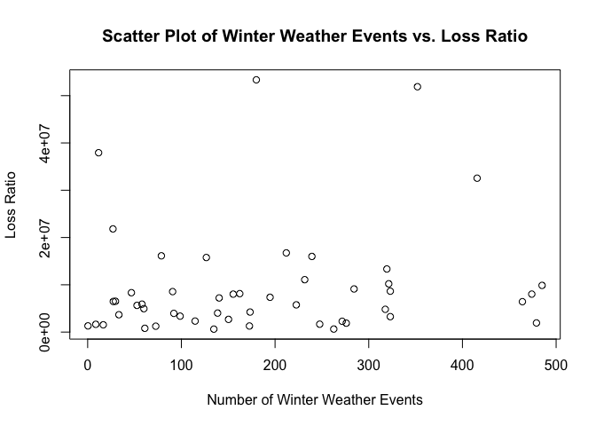<!-- -->

``` r
#Try again without outlier 
#Louisiana has an EXTREMELY high loss ratio, at 1.64. I will take it out for now.
max(Y)
```

    ## [1] 53345307

``` r
#premiums_losses_2021_df

Y2 <- Y[-c(18, 34)]
winter_X1_2 <- winter_X1[-c(18, 34)]
max(Y2)
```

    ## [1] 53345307

``` r
#Plot x versus y 
#some evidence of linear relationship, but not huge
#roughly, as winter storms increase, loss ratio increases 
#No particular curvature
plot(winter_X1_2, Y2, main = "Scatter Plot of Winter vs. Loss", xlab = "Winter", ylab = "Loss Ratio")
abline(lm(Y2 ~ winter_X1_2), col = "red")
```

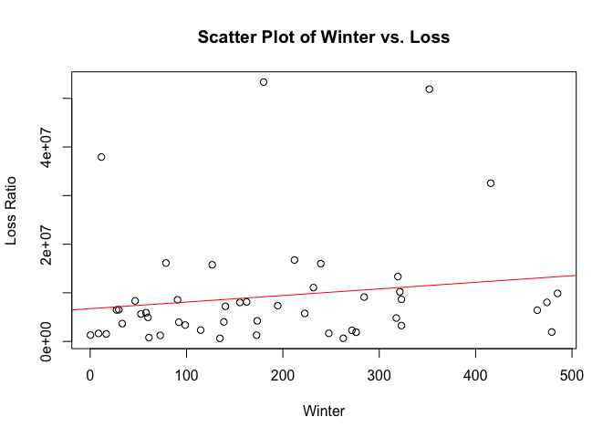<!-- -->

``` r
#Plot Residuals for winter (with outliers taken out)
#roughly around the horizontal line
lm_model_winter <- lm(Y2 ~ winter_X1_2)
plot(lm_model_winter$fitted.values, lm_model_winter$residuals, main = "Residuals vs. Fitted Values", xlab = "Fitted Values", ylab = "Residuals")
abline(h = 0, col = "red", lty = 2)
```

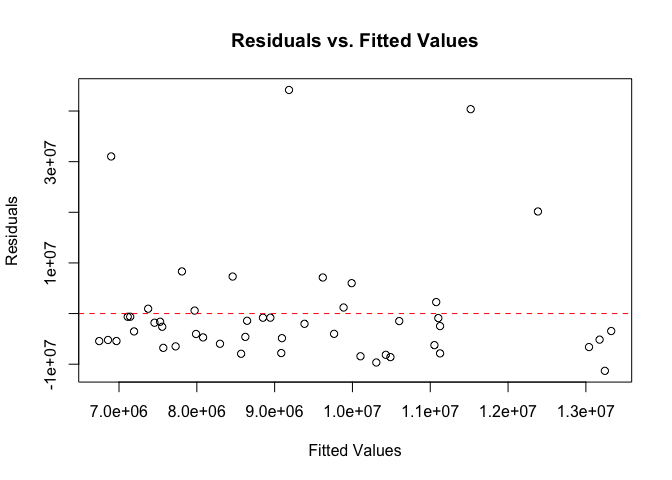<!-- -->

``` r
#Hail
hail_X2_2 <- hail_X2[-c(18, 34, 43)]
Y3 <- Y2[-43]

#Plot x versus y (with 3 outliers taken out)
#some evidence of linear relationship
#roughly, as hail storms increase, loss ratio increases 
#No particular curvature
plot(hail_X2_2, Y3, main = "Scatter Plot of Hail vs. Loss Ratio", xlab = "Hail", ylab = "Loss Ratio")
abline(lm(Y3 ~ hail_X2_2), col = "blue")
```

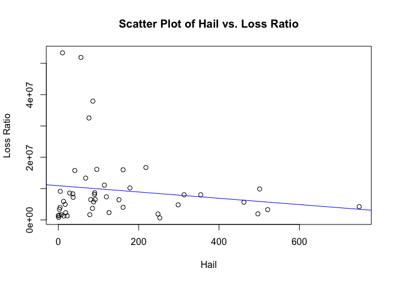<!-- -->

``` r
#Plot Residuals for winter 
#roughly random around the horizontal line
lm_model_winter <- lm(Y3 ~ hail_X2_2)
plot(lm_model_winter$fitted.values, lm_model_winter$residuals, main = "Residuals vs. Fitted Values", xlab = "Fitted Values", ylab = "Residuals")
abline(h = 0, col = "red", lty = 2)
```

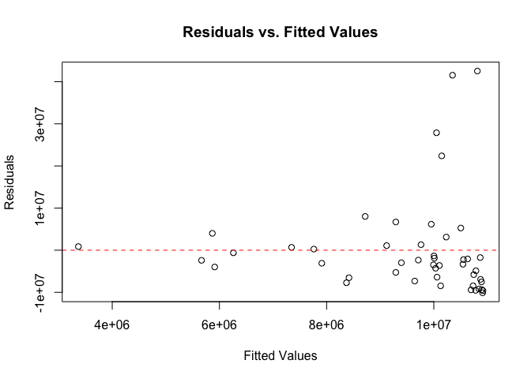<!-- -->

``` r
Y2
```

    ##  [1]  6476321   798066  8328669  4020610 51888135  9875928  5907927  1641477
    ##  [9] 37929284 16129828  1310210  2281504 16743499  7361432  4814712  4235115
    ## [17]  5756880  1284909  7216979  8559552 13343510  8028411  3668721  8026747
    ## [25]  1886860  3262966  3955395  1245146 15770620  2328307 32545318 11080165
    ## [33] 10211117  5645003  4948936 15997227  1541067  6517620  1931153  8133208
    ## [41] 53345307  3373781   625199  8651199  9121073  1668944  6426197   643351

``` r
#to print the plot above:
# Create the plot using ggplot
lm_model_winter_loss <- lm(Y2 ~ winter_X1_2)
plot <- ggplot(data.frame(Winter = winter_X1_2, Loss = Y2), aes(x = Winter, y = Loss)) +
  geom_point() +
  geom_abline(slope = coef(lm_model_winter_loss)[2], intercept = coef(lm_model_winter_loss)[1], col = "red", linetype = "dashed") +
  labs(title = "Number of Winter Weather Events vs. Incurred Property/Casualty Loss, By State, in 2021", x = "Number of Winter Weather Events", y = "Incurred Property and Casualty Loss, in Dollars")

# Save the plot as a PNG file
ggsave("winter_loss_scatter_plot.png", plot, width = 8, height = 6)

# Display the plot
print(plot)
```

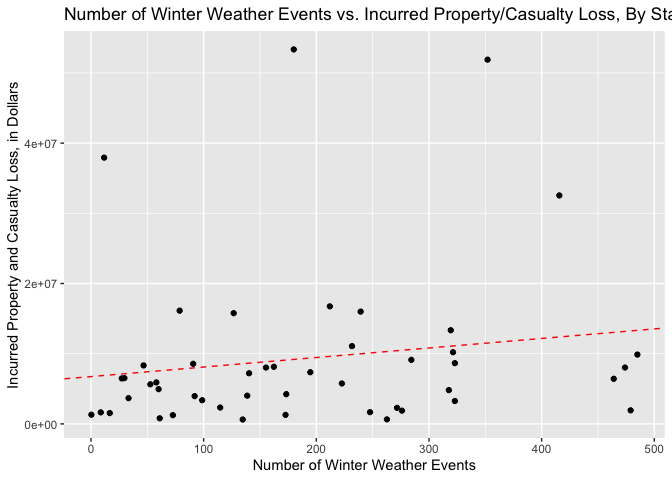<!-- -->

``` r
#Tornado
tornado_X3_2 <- tornado_X3[-c(18, 34, 43)]
Y4 <- Y2[-43]
#Plot x versus y (with 3 outliers taken out)
#some evidence of linear relationship
#roughly, as tornadoes increase, loss ratio increases 
#No particular curvature
plot(tornado_X3_2, Y4, main = "Scatter Plot of Tornado vs. Loss Ratio", xlab = "Tornado", ylab = "Loss Ratio")
abline(lm(Y4 ~ tornado_X3_2), col = "green")
```

<!-- -->

``` r
#Plot Residuals for tornadoes 
#hard to tell
lm_model_tornadoes <- lm(Y4 ~ tornado_X3_2)
plot(lm_model_tornadoes$fitted.values, lm_model_tornadoes$residuals, main = "Residuals vs. Fitted Values", xlab = "Fitted Values", ylab = "Residuals")
abline(h = 0, col = "red", lty = 2)
```

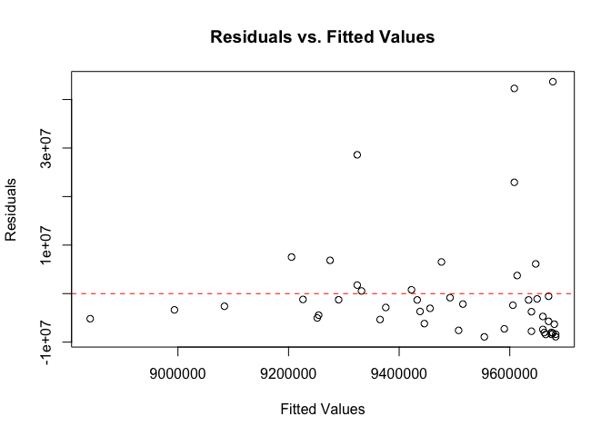<!-- -->

``` r
#Wind

wind_X4_2 = wind_X4[-c(18, 34)]

#Plot x versus y 
#some evidence of linear relationship; pretty evenly distributed around line
#roughly, as wind increase, loss ratio increases 
#No particular curvature
plot(wind_X4_2, Y2, main = "Scatter Plot of Tornado vs. Loss Ratio", xlab = "Tornado", ylab = "Loss Ratio")
abline(lm(Y2 ~ wind_X4_2), col = "purple")
```

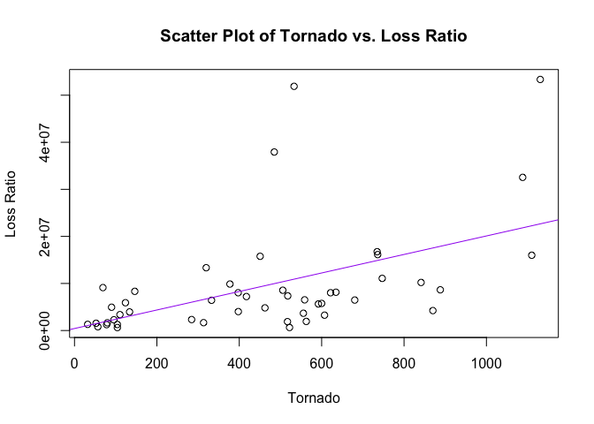<!-- -->

``` r
#Plot Residuals for wind 
#pretty evenly distributed
lm_model_wind <- lm(Y2 ~ wind_X4_2)
plot(lm_model_wind$fitted.values, lm_model_wind$residuals, main = "Residuals vs. Fitted Values", xlab = "Fitted Values", ylab = "Residuals")
abline(h = 0, col = "red", lty = 2)
```

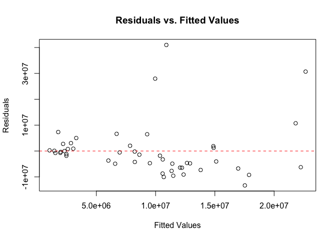<!-- -->

``` r
#Flood
flood_X5_2 = flood_X5[-c(18, 34, 46)]
Y6 <- Y2[-46]
#Plot x versus y 
#some evidence of linear relationship; pretty evenly distributed around line
#roughly, as floods increase, loss ratio increases 
#No particular curvature
plot(flood_X5_2, Y6, main = "Scatter Plot of Flood vs. Loss Ratio", xlab = "Flood", ylab = "Loss Ratio")
abline(lm(Y6 ~ flood_X5_2), col = "pink")
```

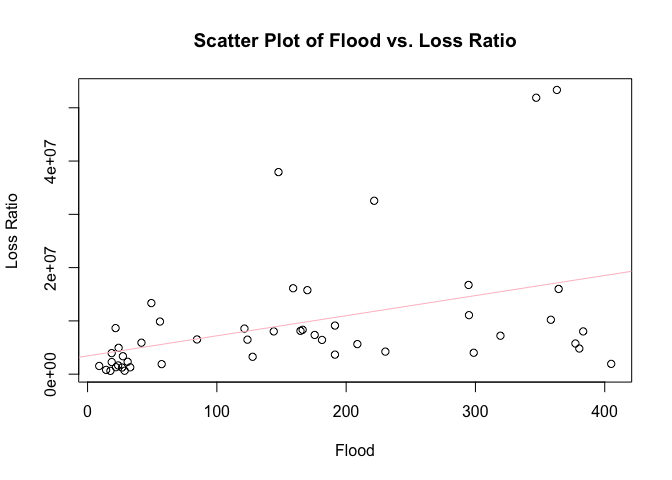<!-- -->

``` r
#Plot Residuals for flood 
#pretty evenly distributed
lm_model_flood <- lm(Y6 ~ flood_X5_2)
plot(lm_model_flood$fitted.values, lm_model_flood$residuals, main = "Residuals vs. Fitted Values", xlab = "Fitted Values", ylab = "Residuals")
abline(h = 0, col = "red", lty = 2)
```

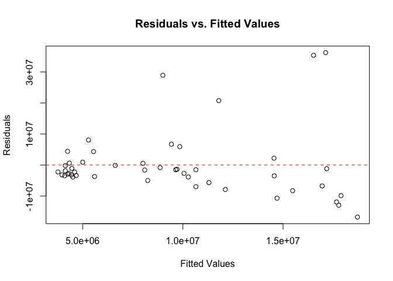<!-- -->

``` r
#Wildfire
wildfire_X6_2 = wildfire_X6[-c(18, 34, 43, 31)]
Y7 <- Y2[-c(43, 31)]

#Plot x versus y 
#difficult to see because most states had a low number of wildfires
#roughly, as wildfires increase, it does seem clear that loss ratio increases 
#omits 4 outliers including 2 huge outlier
plot(wildfire_X6_2, Y7, main = "Scatter Plot of Wildfire vs. Loss Ratio", xlab = "Wildfire", ylab = "Loss Ratio")
abline(lm(Y7 ~ wildfire_X6_2), col = "yellow")
```

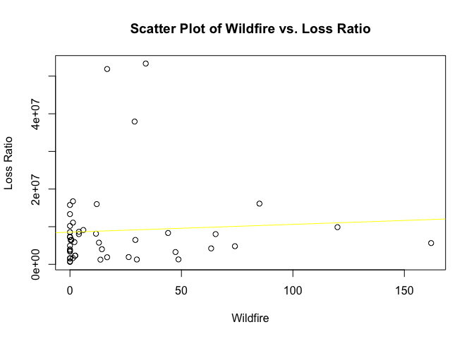<!-- -->

``` r
#Plot Residuals for wildfires 
lm_model_wildfire <- lm(Y7 ~ wildfire_X6_2)
plot(lm_model_wildfire$fitted.values, lm_model_wildfire$residuals, main = "Residuals vs. Fitted Values", xlab = "Fitted Values", ylab = "Residuals")
abline(h = 0, col = "red", lty = 2)
```

<!-- -->

``` r
#Duststorm
duststorm_X7_2 = duststorm_X7[-c(18, 34)]
max(duststorm_X7_2)
```

    ## [1] 33.66667

``` r
#Plot x versus y 
#not very many states with any dust storms at all so it's hard to tell 
plot(duststorm_X7_2, Y2, main = "Scatter Plot of Dust storm vs. Loss Ratio", xlab = "DustStorm", ylab = "Loss Ratio")
abline(lm(Y2 ~ duststorm_X7_2), col = "orange")
```

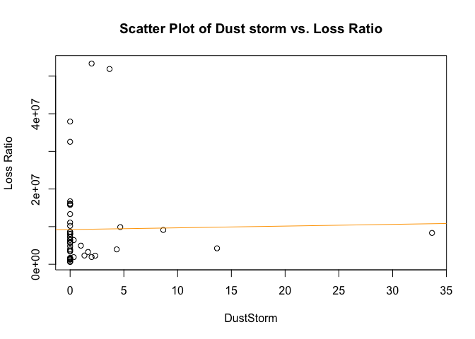<!-- -->

Now merge the table with the loss ratios to the other table.

``` r
model_2021_df_og <- merge(weather_df, premiums_losses_2021_df)

#remove premium and loss columns
model_2021_df <- model_2021_df_og[, -which(names(model_2021_df_og) == "TotalPremiumAmounts")]
model_2021_df <- model_2021_df[, -which(names(model_2021_df) == "TotalLossAmounts")]
```

Build model. Split into training and test and then validate on the
testing set.

``` r
# Split the data into training and testing sets
set.seed(123)  # for reproducibility
train_indices <- sample(1:nrow(model_2021_df), 0.7 * nrow(model_2021_df))
train_data <- model_2021_df[train_indices, ]
test_data <- model_2021_df[-train_indices, ]

# Build a linear regression model
model_2021 <- lm(LossRatios ~ Winter + Hail + Tornado + Wind + Flood + Wildfire + DustStorm, data = train_data)
summary(model_2021)
```

    ## 
    ## Call:
    ## lm(formula = LossRatios ~ Winter + Hail + Tornado + Wind + Flood + 
    ##     Wildfire + DustStorm, data = train_data)
    ## 
    ## Residuals:
    ##       Min        1Q    Median        3Q       Max 
    ## -0.080635 -0.033954 -0.004331  0.027515  0.087155 
    ## 
    ## Coefficients:
    ##               Estimate Std. Error t value Pr(>|t|)    
    ## (Intercept)  4.995e-01  2.166e-02  23.061   <2e-16 ***
    ## Winter      -2.229e-05  1.111e-04  -0.201   0.8425    
    ## Hail         1.379e-06  8.961e-05   0.015   0.9878    
    ## Tornado      1.026e-04  5.716e-04   0.179   0.8589    
    ## Wind         3.972e-05  5.461e-05   0.727   0.4732    
    ## Flood        2.039e-04  1.161e-04   1.756   0.0904 .  
    ## Wildfire     1.951e-04  1.423e-04   1.371   0.1815    
    ## DustStorm    1.601e-03  1.765e-03   0.907   0.3726    
    ## ---
    ## Signif. codes:  0 '***' 0.001 '**' 0.01 '*' 0.05 '.' 0.1 ' ' 1
    ## 
    ## Residual standard error: 0.05487 on 27 degrees of freedom
    ## Multiple R-squared:  0.4841, Adjusted R-squared:  0.3503 
    ## F-statistic: 3.619 on 7 and 27 DF,  p-value: 0.00705

``` r
model_2021_claims <- lm(TotalLossAmounts ~ Winter + Hail + Tornado + Wind + Flood + Wildfire + DustStorm, data = model_2021_df_og)

model_2021_premiums <- lm(TotalPremiumAmounts ~ Winter + Hail + Tornado + Wind + Flood + Wildfire + DustStorm, data = model_2021_df_og)

# Evaluate the model
predictions <- predict(model_2021, newdata = test_data)
mse <- mean((test_data$LossRatios - predictions)^2)
mse #0.0938!
```

    ## [1] 0.09384227

It seems that according to the model, hail, tornado, wind, flood,
wildfire, and dust storms (all but winter, which has a small positive
effect for reasons which can be explored later) are associated with
increases in the loss ratio (fewer claim dollars spent per premium
dollar).

Now build a model without training/test sets.

``` r
model_2021 <- lm(LossRatios ~ Winter + Hail + Tornado + Wind + Flood + Wildfire + DustStorm, data = model_2021_df)
```

``` r
weather_df #Louisiana #18 and North Dakota #34, which have very high loss ratios
```

    ##             State      Winter         Hail     Tornado       Wind     Flood
    ## 1         ALABAMA  27.3333333   80.6666667  77.3333333  680.33333 123.66667
    ## 2          ALASKA  61.0000000    0.6666667   0.0000000   56.66667  14.33333
    ## 3         ARIZONA  46.6666667   36.0000000   6.3333333  146.33333 166.33333
    ## 4        ARKANSAS 138.6666667  161.3333333  41.0000000  397.66667 298.66667
    ## 5      CALIFORNIA 352.0000000   56.3333333   9.6666667  533.00000 347.00000
    ## 6        COLORADO 485.0000000  501.0000000  45.3333333  377.33333  56.00000
    ## 7     CONNECTICUT  58.0000000   13.0000000   5.6666667  123.66667  41.66667
    ## 8        DELAWARE   8.6666667    7.3333333   2.6666667   79.66667  23.66667
    ## 9         FLORIDA  11.6666667   86.0000000  46.3333333  485.00000 147.66667
    ## 10        GEORGIA  78.6666667   95.6666667  52.6666667  736.00000 159.00000
    ## 11         HAWAII   0.3333333    0.0000000   0.0000000   32.00000  22.00000
    ## 12          IDAHO 271.6666667   18.3333333   3.0000000   95.66667  18.66667
    ## 13       ILLINOIS 212.0000000  218.0000000  61.6666667  734.66667 294.66667
    ## 14        INDIANA 194.6666667  119.6666667  21.6666667  517.66667 175.66667
    ## 15           IOWA 317.6666667  298.3333333  55.3333333  462.33333 380.33333
    ## 16         KANSAS 173.3333333  749.0000000  55.6666667  870.00000 230.33333
    ## 17       KENTUCKY 222.6666667   87.6666667  31.6666667  600.00000 377.33333
    ## 18      LOUISIANA  27.0000000   88.6666667  84.6666667  277.66667 105.33333
    ## 19          MAINE 172.6666667   22.0000000   1.0000000  104.00000  33.00000
    ## 20       MARYLAND 140.3333333   37.0000000  10.0000000  417.33333 319.33333
    ## 21  MASSACHUSETTS  90.6666667   28.3333333   4.3333333  505.66667 121.33333
    ## 22       MICHIGAN 319.3333333   68.0000000   9.0000000  319.66667  49.33333
    ## 23      MINNESOTA 474.0000000  354.3333333  59.0000000  397.33333 144.00000
    ## 24    MISSISSIPPI  33.3333333   85.0000000 108.6666667  555.66667 191.33333
    ## 25       MISSOURI 155.3333333  313.0000000  50.6666667  621.66667 383.33333
    ## 26        MONTANA 276.0000000  248.0000000   5.6666667  517.00000  57.33333
    ## 27       NEBRASKA 323.0000000  521.0000000  30.6666667  607.00000 127.66667
    ## 28         NEVADA  92.0000000    4.3333333   1.6666667  133.66667  18.66667
    ## 29  NEW HAMPSHIRE  72.6666667   13.6666667   2.3333333   78.00000  26.66667
    ## 30     NEW JERSEY 126.6666667   41.0000000   4.6666667  450.66667 170.00000
    ## 31     NEW MEXICO 114.6666667  126.3333333  12.0000000  284.33333  31.00000
    ## 32       NEW YORK 415.6666667   76.3333333   9.6666667 1088.00000 221.66667
    ## 33 NORTH CAROLINA 231.6666667  114.6666667  46.3333333  747.00000 295.00000
    ## 34   NORTH DAKOTA 150.3333333  304.6666667  22.3333333  298.00000  13.00000
    ## 35           OHIO 321.3333333  178.3333333  33.6666667  841.33333 358.33333
    ## 36       OKLAHOMA  52.6666667  462.0000000  89.0000000  592.00000 208.66667
    ## 37         OREGON  60.0000000   17.0000000   3.0000000   90.00000  24.00000
    ## 38   PENNSYLVANIA 239.3333333  161.3333333  26.6666667 1110.00000 364.33333
    ## 39   RHODE ISLAND  16.6666667    2.0000000   0.6666667   52.33333   9.00000
    ## 40 SOUTH CAROLINA  29.6666667   91.6666667  39.6666667  558.66667  84.66667
    ## 41   SOUTH DAKOTA 479.0000000  496.6666667  22.6666667  562.66667 405.00000
    ## 42      TENNESSEE 162.3333333   90.0000000  32.3333333  634.66667 164.66667
    ## 43          TEXAS 180.0000000 1107.6666667 111.3333333 1130.66667 363.00000
    ## 44           UTAH  98.6666667   10.3333333   0.6666667  110.33333  27.33333
    ## 45        VERMONT 134.6666667    2.6666667   0.3333333  104.00000  17.66667
    ## 46       VIRGINIA 323.0000000   90.6666667  24.6666667  888.00000 652.00000
    ## 47     WASHINGTON 284.3333333    5.0000000   1.6666667   69.00000  21.66667
    ## 48  WEST VIRGINIA 247.6666667   78.3333333   1.0000000  313.33333 191.33333
    ## 49      WISCONSIN 464.0000000  151.0000000  29.3333333  332.66667 181.33333
    ## 50        WYOMING 262.6666667  252.6666667  16.6666667  522.00000  28.66667
    ##       Wildfire  DustStorm
    ## 1   29.3333333  0.0000000
    ## 2    0.0000000  0.0000000
    ## 3   44.0000000 33.6666667
    ## 4   14.3333333  0.0000000
    ## 5   16.6666667  3.6666667
    ## 6  120.0000000  4.6666667
    ## 7    2.0000000  0.0000000
    ## 8    0.0000000  0.0000000
    ## 9   29.0000000  0.0000000
    ## 10  85.0000000  0.0000000
    ## 11  48.6666667  0.0000000
    ## 12   2.3333333  2.3333333
    ## 13   1.3333333  0.0000000
    ## 14   0.0000000  0.0000000
    ## 15  74.0000000  0.0000000
    ## 16  63.3333333 13.6666667
    ## 17  13.0000000  0.0000000
    ## 18  24.6666667  0.0000000
    ## 19  30.0000000  0.0000000
    ## 20   0.0000000  0.0000000
    ## 21   0.0000000  0.0000000
    ## 22   0.0000000  0.0000000
    ## 23   4.0000000  0.0000000
    ## 24   0.0000000  0.0000000
    ## 25  65.3333333  0.0000000
    ## 26  16.6666667  0.3333333
    ## 27  47.3333333  1.6666667
    ## 28   0.0000000  4.3333333
    ## 29  13.6666667  0.0000000
    ## 30   0.0000000  0.0000000
    ## 31 338.3333333  1.3333333
    ## 32   2.3333333  0.0000000
    ## 33   1.3333333  0.0000000
    ## 34   0.0000000  0.0000000
    ## 35   0.0000000  0.0000000
    ## 36 162.0000000  0.0000000
    ## 37   0.0000000  1.0000000
    ## 38  12.0000000  0.0000000
    ## 39   0.0000000  0.0000000
    ## 40   0.6666667  0.0000000
    ## 41  26.3333333  2.0000000
    ## 42  11.6666667  0.0000000
    ## 43 554.0000000  2.0000000
    ## 44  34.0000000  0.0000000
    ## 45   0.0000000  0.0000000
    ## 46   4.0000000  0.0000000
    ## 47   6.0000000  8.6666667
    ## 48   1.3333333  0.0000000
    ## 49   0.3333333  0.3333333
    ## 50   0.0000000  0.0000000

``` r
model_2021_df_ou <- subset(model_2021_df_og, State != 'LOUISIANA')
model_2021_df_ou <- subset(model_2021_df_ou, State != 'NORTH DAKOTA')
model_2021_df_ou
```

    ##             State      Winter         Hail     Tornado       Wind     Flood
    ## 1         ALABAMA  27.3333333   80.6666667  77.3333333  680.33333 123.66667
    ## 2          ALASKA  61.0000000    0.6666667   0.0000000   56.66667  14.33333
    ## 3         ARIZONA  46.6666667   36.0000000   6.3333333  146.33333 166.33333
    ## 4        ARKANSAS 138.6666667  161.3333333  41.0000000  397.66667 298.66667
    ## 5      CALIFORNIA 352.0000000   56.3333333   9.6666667  533.00000 347.00000
    ## 6        COLORADO 485.0000000  501.0000000  45.3333333  377.33333  56.00000
    ## 7     CONNECTICUT  58.0000000   13.0000000   5.6666667  123.66667  41.66667
    ## 8        DELAWARE   8.6666667    7.3333333   2.6666667   79.66667  23.66667
    ## 9         FLORIDA  11.6666667   86.0000000  46.3333333  485.00000 147.66667
    ## 10        GEORGIA  78.6666667   95.6666667  52.6666667  736.00000 159.00000
    ## 11         HAWAII   0.3333333    0.0000000   0.0000000   32.00000  22.00000
    ## 12          IDAHO 271.6666667   18.3333333   3.0000000   95.66667  18.66667
    ## 13       ILLINOIS 212.0000000  218.0000000  61.6666667  734.66667 294.66667
    ## 14        INDIANA 194.6666667  119.6666667  21.6666667  517.66667 175.66667
    ## 15           IOWA 317.6666667  298.3333333  55.3333333  462.33333 380.33333
    ## 16         KANSAS 173.3333333  749.0000000  55.6666667  870.00000 230.33333
    ## 17       KENTUCKY 222.6666667   87.6666667  31.6666667  600.00000 377.33333
    ## 19          MAINE 172.6666667   22.0000000   1.0000000  104.00000  33.00000
    ## 20       MARYLAND 140.3333333   37.0000000  10.0000000  417.33333 319.33333
    ## 21  MASSACHUSETTS  90.6666667   28.3333333   4.3333333  505.66667 121.33333
    ## 22       MICHIGAN 319.3333333   68.0000000   9.0000000  319.66667  49.33333
    ## 23      MINNESOTA 474.0000000  354.3333333  59.0000000  397.33333 144.00000
    ## 24    MISSISSIPPI  33.3333333   85.0000000 108.6666667  555.66667 191.33333
    ## 25       MISSOURI 155.3333333  313.0000000  50.6666667  621.66667 383.33333
    ## 26        MONTANA 276.0000000  248.0000000   5.6666667  517.00000  57.33333
    ## 27       NEBRASKA 323.0000000  521.0000000  30.6666667  607.00000 127.66667
    ## 28         NEVADA  92.0000000    4.3333333   1.6666667  133.66667  18.66667
    ## 29  NEW HAMPSHIRE  72.6666667   13.6666667   2.3333333   78.00000  26.66667
    ## 30     NEW JERSEY 126.6666667   41.0000000   4.6666667  450.66667 170.00000
    ## 31     NEW MEXICO 114.6666667  126.3333333  12.0000000  284.33333  31.00000
    ## 32       NEW YORK 415.6666667   76.3333333   9.6666667 1088.00000 221.66667
    ## 33 NORTH CAROLINA 231.6666667  114.6666667  46.3333333  747.00000 295.00000
    ## 35           OHIO 321.3333333  178.3333333  33.6666667  841.33333 358.33333
    ## 36       OKLAHOMA  52.6666667  462.0000000  89.0000000  592.00000 208.66667
    ## 37         OREGON  60.0000000   17.0000000   3.0000000   90.00000  24.00000
    ## 38   PENNSYLVANIA 239.3333333  161.3333333  26.6666667 1110.00000 364.33333
    ## 39   RHODE ISLAND  16.6666667    2.0000000   0.6666667   52.33333   9.00000
    ## 40 SOUTH CAROLINA  29.6666667   91.6666667  39.6666667  558.66667  84.66667
    ## 41   SOUTH DAKOTA 479.0000000  496.6666667  22.6666667  562.66667 405.00000
    ## 42      TENNESSEE 162.3333333   90.0000000  32.3333333  634.66667 164.66667
    ## 43          TEXAS 180.0000000 1107.6666667 111.3333333 1130.66667 363.00000
    ## 44           UTAH  98.6666667   10.3333333   0.6666667  110.33333  27.33333
    ## 45        VERMONT 134.6666667    2.6666667   0.3333333  104.00000  17.66667
    ## 46       VIRGINIA 323.0000000   90.6666667  24.6666667  888.00000 652.00000
    ## 47     WASHINGTON 284.3333333    5.0000000   1.6666667   69.00000  21.66667
    ## 48  WEST VIRGINIA 247.6666667   78.3333333   1.0000000  313.33333 191.33333
    ## 49      WISCONSIN 464.0000000  151.0000000  29.3333333  332.66667 181.33333
    ## 50        WYOMING 262.6666667  252.6666667  16.6666667  522.00000  28.66667
    ##       Wildfire  DustStorm TotalPremiumAmounts TotalLossAmounts LossRatios
    ## 1   29.3333333  0.0000000            10841361          6476321  0.5973716
    ## 2    0.0000000  0.0000000             1711194           798066  0.4663796
    ## 3   44.0000000 33.6666667            14088672          8328669  0.5911607
    ## 4   14.3333333  0.0000000             6419527          4020610  0.6263094
    ## 5   16.6666667  3.6666667            96311492         51888135  0.5387533
    ## 6  120.0000000  4.6666667            16368169          9875928  0.6033618
    ## 7    2.0000000  0.0000000            10016170          5907927  0.5898389
    ## 8    0.0000000  0.0000000             3261830          1641477  0.5032381
    ## 9   29.0000000  0.0000000            66410689         37929284  0.5711322
    ## 10  85.0000000  0.0000000            26514329         16129828  0.6083438
    ## 11  48.6666667  0.0000000             2891484          1310210  0.4531272
    ## 12   2.3333333  2.3333333             3849228          2281504  0.5927173
    ## 13   1.3333333  0.0000000            30484708         16743499  0.5492426
    ## 14   0.0000000  0.0000000            13579419          7361432  0.5421021
    ## 15  74.0000000  0.0000000             8054991          4814712  0.5977303
    ## 16  63.3333333 13.6666667             7896343          4235115  0.5363388
    ## 17  13.0000000  0.0000000             8620388          5756880  0.6678214
    ## 19  30.0000000  0.0000000             2771319          1284909  0.4636453
    ## 20   0.0000000  0.0000000            13781070          7216979  0.5236879
    ## 21   0.0000000  0.0000000            18330652          8559552  0.4669529
    ## 22   0.0000000  0.0000000            21294398         13343510  0.6266207
    ## 23   4.0000000  0.0000000            14037235          8028411  0.5719368
    ## 24   0.0000000  0.0000000             6342974          3668721  0.5783913
    ## 25  65.3333333  0.0000000            14262648          8026747  0.5627810
    ## 26  16.6666667  0.3333333             3072567          1886860  0.6140989
    ## 27  47.3333333  1.6666667             6073036          3262966  0.5372874
    ## 28   0.0000000  4.3333333             7049820          3955395  0.5610633
    ## 29  13.6666667  0.0000000             2834333          1245146  0.4393083
    ## 30   0.0000000  0.0000000            24784880         15770620  0.6363000
    ## 31 338.3333333  1.3333333             4040716          2328307  0.5762115
    ## 32   2.3333333  0.0000000            55034274         32545318  0.5913645
    ## 33   1.3333333  0.0000000            19676819         11080165  0.5631075
    ## 35   0.0000000  0.0000000            19735292         10211117  0.5174039
    ## 36 162.0000000  0.0000000             9354444          5645003  0.6034568
    ## 37   0.0000000  1.0000000             8531568          4948936  0.5800734
    ## 38  12.0000000  0.0000000            28340342         15997227  0.5644684
    ## 39   0.0000000  0.0000000             2868112          1541067  0.5373106
    ## 40   0.6666667  0.0000000            12103012          6517620  0.5385122
    ## 41  26.3333333  2.0000000             3049310          1931153  0.6333082
    ## 42  11.6666667  0.0000000            14199791          8133208  0.5727696
    ## 43 554.0000000  2.0000000            70749457         53345307  0.7540031
    ## 44  34.0000000  0.0000000             6344458          3373781  0.5317682
    ## 45   0.0000000  0.0000000             1417381           625199  0.4410945
    ## 46   4.0000000  0.0000000            16597204          8651199  0.5212444
    ## 47   6.0000000  8.6666667            15262847          9121073  0.5975997
    ## 48   1.3333333  0.0000000             3140938          1668944  0.5313521
    ## 49   0.3333333  0.3333333            12160368          6426197  0.5284542
    ## 50   0.0000000  0.0000000             1456738           643351  0.4416381

``` r
model_2021_2 <- lm(TotalLossAmounts ~ Winter + Hail + Tornado + Wind + Flood + Wildfire + DustStorm, data = model_2021_df_ou)

# there is no significant evidence of heteroscedasticity because p value is 0.43, not enough to reject null
library("lmtest")
```

    ## Loading required package: zoo

    ## 
    ## Attaching package: 'zoo'

    ## The following objects are masked from 'package:base':
    ## 
    ##     as.Date, as.Date.numeric

``` r
bp_test <- bptest(model_2021_2)

#taking out outliers actually makes hail not significant, so that's probably not really a good thing
summary(model_2021_2)
```

    ## 
    ## Call:
    ## lm(formula = TotalLossAmounts ~ Winter + Hail + Tornado + Wind + 
    ##     Flood + Wildfire + DustStorm, data = model_2021_df_ou)
    ## 
    ## Residuals:
    ##       Min        1Q    Median        3Q       Max 
    ## -22552340  -4720483  -1466888   2085517  37527352 
    ## 
    ## Coefficients:
    ##               Estimate Std. Error t value Pr(>|t|)   
    ## (Intercept) -2.003e+06  3.280e+06  -0.611  0.54480   
    ## Winter       1.296e+04  1.348e+04   0.961  0.34210   
    ## Hail        -2.113e+04  1.269e+04  -1.666  0.10356   
    ## Tornado     -1.520e+03  7.727e+04  -0.020  0.98440   
    ## Wind         2.097e+04  8.120e+03   2.582  0.01358 * 
    ## Flood       -6.424e+01  1.453e+04  -0.004  0.99649   
    ## Wildfire     6.456e+04  2.219e+04   2.910  0.00588 **
    ## DustStorm    2.121e+05  2.841e+05   0.746  0.45984   
    ## ---
    ## Signif. codes:  0 '***' 0.001 '**' 0.01 '*' 0.05 '.' 0.1 ' ' 1
    ## 
    ## Residual standard error: 9892000 on 40 degrees of freedom
    ## Multiple R-squared:  0.3907, Adjusted R-squared:  0.284 
    ## F-statistic: 3.664 on 7 and 40 DF,  p-value: 0.003799

``` r
#with only significant results 
model_2021_3 <- lm(TotalLossAmounts ~ Hail + Wind + Wildfire, data = model_2021_df_ou)
summary(model_2021_3)
```

    ## 
    ## Call:
    ## lm(formula = TotalLossAmounts ~ Hail + Wind + Wildfire, data = model_2021_df_ou)
    ## 
    ## Residuals:
    ##       Min        1Q    Median        3Q       Max 
    ## -20576835  -4559478  -1766355   2849580  40530744 
    ## 
    ## Coefficients:
    ##             Estimate Std. Error t value Pr(>|t|)    
    ## (Intercept)   220000    2531112   0.087 0.931131    
    ## Hail          -15107       9900  -1.526 0.134188    
    ## Wind           20765       5594   3.712 0.000575 ***
    ## Wildfire       55240      19976   2.765 0.008281 ** 
    ## ---
    ## Signif. codes:  0 '***' 0.001 '**' 0.01 '*' 0.05 '.' 0.1 ' ' 1
    ## 
    ## Residual standard error: 9621000 on 44 degrees of freedom
    ## Multiple R-squared:  0.366,  Adjusted R-squared:  0.3228 
    ## F-statistic: 8.467 on 3 and 44 DF,  p-value: 0.0001494

``` r
model_2021_df_ou
```

    ##             State      Winter         Hail     Tornado       Wind     Flood
    ## 1         ALABAMA  27.3333333   80.6666667  77.3333333  680.33333 123.66667
    ## 2          ALASKA  61.0000000    0.6666667   0.0000000   56.66667  14.33333
    ## 3         ARIZONA  46.6666667   36.0000000   6.3333333  146.33333 166.33333
    ## 4        ARKANSAS 138.6666667  161.3333333  41.0000000  397.66667 298.66667
    ## 5      CALIFORNIA 352.0000000   56.3333333   9.6666667  533.00000 347.00000
    ## 6        COLORADO 485.0000000  501.0000000  45.3333333  377.33333  56.00000
    ## 7     CONNECTICUT  58.0000000   13.0000000   5.6666667  123.66667  41.66667
    ## 8        DELAWARE   8.6666667    7.3333333   2.6666667   79.66667  23.66667
    ## 9         FLORIDA  11.6666667   86.0000000  46.3333333  485.00000 147.66667
    ## 10        GEORGIA  78.6666667   95.6666667  52.6666667  736.00000 159.00000
    ## 11         HAWAII   0.3333333    0.0000000   0.0000000   32.00000  22.00000
    ## 12          IDAHO 271.6666667   18.3333333   3.0000000   95.66667  18.66667
    ## 13       ILLINOIS 212.0000000  218.0000000  61.6666667  734.66667 294.66667
    ## 14        INDIANA 194.6666667  119.6666667  21.6666667  517.66667 175.66667
    ## 15           IOWA 317.6666667  298.3333333  55.3333333  462.33333 380.33333
    ## 16         KANSAS 173.3333333  749.0000000  55.6666667  870.00000 230.33333
    ## 17       KENTUCKY 222.6666667   87.6666667  31.6666667  600.00000 377.33333
    ## 19          MAINE 172.6666667   22.0000000   1.0000000  104.00000  33.00000
    ## 20       MARYLAND 140.3333333   37.0000000  10.0000000  417.33333 319.33333
    ## 21  MASSACHUSETTS  90.6666667   28.3333333   4.3333333  505.66667 121.33333
    ## 22       MICHIGAN 319.3333333   68.0000000   9.0000000  319.66667  49.33333
    ## 23      MINNESOTA 474.0000000  354.3333333  59.0000000  397.33333 144.00000
    ## 24    MISSISSIPPI  33.3333333   85.0000000 108.6666667  555.66667 191.33333
    ## 25       MISSOURI 155.3333333  313.0000000  50.6666667  621.66667 383.33333
    ## 26        MONTANA 276.0000000  248.0000000   5.6666667  517.00000  57.33333
    ## 27       NEBRASKA 323.0000000  521.0000000  30.6666667  607.00000 127.66667
    ## 28         NEVADA  92.0000000    4.3333333   1.6666667  133.66667  18.66667
    ## 29  NEW HAMPSHIRE  72.6666667   13.6666667   2.3333333   78.00000  26.66667
    ## 30     NEW JERSEY 126.6666667   41.0000000   4.6666667  450.66667 170.00000
    ## 31     NEW MEXICO 114.6666667  126.3333333  12.0000000  284.33333  31.00000
    ## 32       NEW YORK 415.6666667   76.3333333   9.6666667 1088.00000 221.66667
    ## 33 NORTH CAROLINA 231.6666667  114.6666667  46.3333333  747.00000 295.00000
    ## 35           OHIO 321.3333333  178.3333333  33.6666667  841.33333 358.33333
    ## 36       OKLAHOMA  52.6666667  462.0000000  89.0000000  592.00000 208.66667
    ## 37         OREGON  60.0000000   17.0000000   3.0000000   90.00000  24.00000
    ## 38   PENNSYLVANIA 239.3333333  161.3333333  26.6666667 1110.00000 364.33333
    ## 39   RHODE ISLAND  16.6666667    2.0000000   0.6666667   52.33333   9.00000
    ## 40 SOUTH CAROLINA  29.6666667   91.6666667  39.6666667  558.66667  84.66667
    ## 41   SOUTH DAKOTA 479.0000000  496.6666667  22.6666667  562.66667 405.00000
    ## 42      TENNESSEE 162.3333333   90.0000000  32.3333333  634.66667 164.66667
    ## 43          TEXAS 180.0000000 1107.6666667 111.3333333 1130.66667 363.00000
    ## 44           UTAH  98.6666667   10.3333333   0.6666667  110.33333  27.33333
    ## 45        VERMONT 134.6666667    2.6666667   0.3333333  104.00000  17.66667
    ## 46       VIRGINIA 323.0000000   90.6666667  24.6666667  888.00000 652.00000
    ## 47     WASHINGTON 284.3333333    5.0000000   1.6666667   69.00000  21.66667
    ## 48  WEST VIRGINIA 247.6666667   78.3333333   1.0000000  313.33333 191.33333
    ## 49      WISCONSIN 464.0000000  151.0000000  29.3333333  332.66667 181.33333
    ## 50        WYOMING 262.6666667  252.6666667  16.6666667  522.00000  28.66667
    ##       Wildfire  DustStorm TotalPremiumAmounts TotalLossAmounts LossRatios
    ## 1   29.3333333  0.0000000            10841361          6476321  0.5973716
    ## 2    0.0000000  0.0000000             1711194           798066  0.4663796
    ## 3   44.0000000 33.6666667            14088672          8328669  0.5911607
    ## 4   14.3333333  0.0000000             6419527          4020610  0.6263094
    ## 5   16.6666667  3.6666667            96311492         51888135  0.5387533
    ## 6  120.0000000  4.6666667            16368169          9875928  0.6033618
    ## 7    2.0000000  0.0000000            10016170          5907927  0.5898389
    ## 8    0.0000000  0.0000000             3261830          1641477  0.5032381
    ## 9   29.0000000  0.0000000            66410689         37929284  0.5711322
    ## 10  85.0000000  0.0000000            26514329         16129828  0.6083438
    ## 11  48.6666667  0.0000000             2891484          1310210  0.4531272
    ## 12   2.3333333  2.3333333             3849228          2281504  0.5927173
    ## 13   1.3333333  0.0000000            30484708         16743499  0.5492426
    ## 14   0.0000000  0.0000000            13579419          7361432  0.5421021
    ## 15  74.0000000  0.0000000             8054991          4814712  0.5977303
    ## 16  63.3333333 13.6666667             7896343          4235115  0.5363388
    ## 17  13.0000000  0.0000000             8620388          5756880  0.6678214
    ## 19  30.0000000  0.0000000             2771319          1284909  0.4636453
    ## 20   0.0000000  0.0000000            13781070          7216979  0.5236879
    ## 21   0.0000000  0.0000000            18330652          8559552  0.4669529
    ## 22   0.0000000  0.0000000            21294398         13343510  0.6266207
    ## 23   4.0000000  0.0000000            14037235          8028411  0.5719368
    ## 24   0.0000000  0.0000000             6342974          3668721  0.5783913
    ## 25  65.3333333  0.0000000            14262648          8026747  0.5627810
    ## 26  16.6666667  0.3333333             3072567          1886860  0.6140989
    ## 27  47.3333333  1.6666667             6073036          3262966  0.5372874
    ## 28   0.0000000  4.3333333             7049820          3955395  0.5610633
    ## 29  13.6666667  0.0000000             2834333          1245146  0.4393083
    ## 30   0.0000000  0.0000000            24784880         15770620  0.6363000
    ## 31 338.3333333  1.3333333             4040716          2328307  0.5762115
    ## 32   2.3333333  0.0000000            55034274         32545318  0.5913645
    ## 33   1.3333333  0.0000000            19676819         11080165  0.5631075
    ## 35   0.0000000  0.0000000            19735292         10211117  0.5174039
    ## 36 162.0000000  0.0000000             9354444          5645003  0.6034568
    ## 37   0.0000000  1.0000000             8531568          4948936  0.5800734
    ## 38  12.0000000  0.0000000            28340342         15997227  0.5644684
    ## 39   0.0000000  0.0000000             2868112          1541067  0.5373106
    ## 40   0.6666667  0.0000000            12103012          6517620  0.5385122
    ## 41  26.3333333  2.0000000             3049310          1931153  0.6333082
    ## 42  11.6666667  0.0000000            14199791          8133208  0.5727696
    ## 43 554.0000000  2.0000000            70749457         53345307  0.7540031
    ## 44  34.0000000  0.0000000             6344458          3373781  0.5317682
    ## 45   0.0000000  0.0000000             1417381           625199  0.4410945
    ## 46   4.0000000  0.0000000            16597204          8651199  0.5212444
    ## 47   6.0000000  8.6666667            15262847          9121073  0.5975997
    ## 48   1.3333333  0.0000000             3140938          1668944  0.5313521
    ## 49   0.3333333  0.3333333            12160368          6426197  0.5284542
    ## 50   0.0000000  0.0000000             1456738           643351  0.4416381

``` r
#GLM so data cant be negative ; AIC is 1620
#significant hail, flood, wildfire
glm_model_2021_4 <- glm(TotalLossAmounts ~ Winter + Hail + Tornado + Wind + Flood + Wildfire + DustStorm, family = Gamma(link = "log"), data = model_2021_df_ou)
summary(glm_model_2021_4)
```

    ## 
    ## Call:
    ## glm(formula = TotalLossAmounts ~ Winter + Hail + Tornado + Wind + 
    ##     Flood + Wildfire + DustStorm, family = Gamma(link = "log"), 
    ##     data = model_2021_df_ou)
    ## 
    ## Coefficients:
    ##               Estimate Std. Error t value Pr(>|t|)    
    ## (Intercept)  1.445e+01  3.169e-01  45.596  < 2e-16 ***
    ## Winter       1.967e-03  1.302e-03   1.510  0.13881    
    ## Hail        -3.832e-03  1.226e-03  -3.126  0.00330 ** 
    ## Tornado      1.097e-02  7.465e-03   1.469  0.14956    
    ## Wind         2.203e-03  7.846e-04   2.808  0.00767 ** 
    ## Flood        9.446e-05  1.404e-03   0.067  0.94668    
    ## Wildfire     5.306e-03  2.144e-03   2.475  0.01765 *  
    ## DustStorm    4.286e-02  2.745e-02   1.561  0.12633    
    ## ---
    ## Signif. codes:  0 '***' 0.001 '**' 0.01 '*' 0.05 '.' 0.1 ' ' 1
    ## 
    ## (Dispersion parameter for Gamma family taken to be 0.9134507)
    ## 
    ##     Null deviance: 52.900  on 47  degrees of freedom
    ## Residual deviance: 27.931  on 40  degrees of freedom
    ## AIC: 1620.3
    ## 
    ## Number of Fisher Scoring iterations: 11

``` r
lm_model_log_5 <- lm(log(TotalLossAmounts + 1) ~ Winter + Hail + Tornado + Wind + Flood + Wildfire + DustStorm, data = model_2021_df_ou)

lm_model_6 <- lm(TotalLossAmounts ~ Winter + Hail + Tornado + Wind + Flood + Wildfire + DustStorm, data = model_2021_df_ou)

stepwise_model_log <- step(lm_model_log_5, direction = "forward", trace = 1) #forward is all 7 with aic of 11.4, backwards is all but flood with 13.36
```

    ## Start:  AIC=-11.4
    ## log(TotalLossAmounts + 1) ~ Winter + Hail + Tornado + Wind + 
    ##     Flood + Wildfire + DustStorm

``` r
#adjusted R squared is .2 better! at 0.4087. f stat p value is far below 0.05
summary(lm_model_log_5)
```

    ## 
    ## Call:
    ## lm(formula = log(TotalLossAmounts + 1) ~ Winter + Hail + Tornado + 
    ##     Wind + Flood + Wildfire + DustStorm, data = model_2021_df_ou)
    ## 
    ## Residuals:
    ##      Min       1Q   Median       3Q      Max 
    ## -1.78050 -0.43403 -0.04878  0.45549  1.91626 
    ## 
    ## Coefficients:
    ##               Estimate Std. Error t value Pr(>|t|)    
    ## (Intercept) 14.1239263  0.2730044  51.735  < 2e-16 ***
    ## Winter       0.0018213  0.0011220   1.623  0.11240    
    ## Hail        -0.0029463  0.0010561  -2.790  0.00804 ** 
    ## Tornado      0.0097607  0.0064316   1.518  0.13698    
    ## Wind         0.0021607  0.0006759   3.197  0.00272 ** 
    ## Flood        0.0002270  0.0012093   0.188  0.85208    
    ## Wildfire     0.0037758  0.0018468   2.045  0.04752 *  
    ## DustStorm    0.0469755  0.0236528   1.986  0.05391 .  
    ## ---
    ## Signif. codes:  0 '***' 0.001 '**' 0.01 '*' 0.05 '.' 0.1 ' ' 1
    ## 
    ## Residual standard error: 0.8234 on 40 degrees of freedom
    ## Multiple R-squared:  0.4968, Adjusted R-squared:  0.4087 
    ## F-statistic: 5.641 on 7 and 40 DF,  p-value: 0.0001412

``` r
summary(lm_model_6)
```

    ## 
    ## Call:
    ## lm(formula = TotalLossAmounts ~ Winter + Hail + Tornado + Wind + 
    ##     Flood + Wildfire + DustStorm, data = model_2021_df_ou)
    ## 
    ## Residuals:
    ##       Min        1Q    Median        3Q       Max 
    ## -22552340  -4720483  -1466888   2085517  37527352 
    ## 
    ## Coefficients:
    ##               Estimate Std. Error t value Pr(>|t|)   
    ## (Intercept) -2.003e+06  3.280e+06  -0.611  0.54480   
    ## Winter       1.296e+04  1.348e+04   0.961  0.34210   
    ## Hail        -2.113e+04  1.269e+04  -1.666  0.10356   
    ## Tornado     -1.520e+03  7.727e+04  -0.020  0.98440   
    ## Wind         2.097e+04  8.120e+03   2.582  0.01358 * 
    ## Flood       -6.424e+01  1.453e+04  -0.004  0.99649   
    ## Wildfire     6.456e+04  2.219e+04   2.910  0.00588 **
    ## DustStorm    2.121e+05  2.841e+05   0.746  0.45984   
    ## ---
    ## Signif. codes:  0 '***' 0.001 '**' 0.01 '*' 0.05 '.' 0.1 ' ' 1
    ## 
    ## Residual standard error: 9892000 on 40 degrees of freedom
    ## Multiple R-squared:  0.3907, Adjusted R-squared:  0.284 
    ## F-statistic: 3.664 on 7 and 40 DF,  p-value: 0.003799

``` r
#AIC is a measure that balances goodness of fit with model complexity. It penalizes models with more parameters to avoid overfitting. 
#Including only significant variables might lead to a more interpretable and parsimonious model. It can be easier to explain and understand the relationship between predictors and the response variable.
#weigh the benefits of a simpler, more interpretable model against the potential improvement in fit provided by additional variables. If the difference in AIC is small and the additional variables are not practically significant or theoretically justified, you might prefer the more parsimonious model with only significant variables

# Perform forward stepwise regression
stepwise_model <- step(lm_model_log_5, direction = "backward", trace = 1) #backward is hail + wind + wildfire (AIC 1612); forward is all of the variables (1618). so forward is a bit better, with all variables
```

    ## Start:  AIC=-11.4
    ## log(TotalLossAmounts + 1) ~ Winter + Hail + Tornado + Wind + 
    ##     Flood + Wildfire + DustStorm
    ## 
    ##             Df Sum of Sq    RSS      AIC
    ## - Flood      1    0.0239 27.144 -13.3625
    ## <none>                   27.120 -11.4047
    ## - Tornado    1    1.5615 28.681 -10.7176
    ## - Winter     1    1.7865 28.906 -10.3426
    ## - DustStorm  1    2.6743 29.794  -8.8906
    ## - Wildfire   1    2.8341 29.954  -8.6337
    ## - Hail       1    5.2772 32.397  -4.8703
    ## - Wind       1    6.9277 34.048  -2.4852
    ## 
    ## Step:  AIC=-13.36
    ## log(TotalLossAmounts + 1) ~ Winter + Hail + Tornado + Wind + 
    ##     Wildfire + DustStorm
    ## 
    ##             Df Sum of Sq    RSS      AIC
    ## <none>                   27.144 -13.3625
    ## - Tornado    1    1.6460 28.790 -12.5366
    ## - Winter     1    2.0080 29.152 -11.9368
    ## - DustStorm  1    2.7823 29.926 -10.6785
    ## - Wildfire   1    2.8283 29.972 -10.6048
    ## - Hail       1    5.4675 32.611  -6.5540
    ## - Wind       1   11.1758 38.320   1.1885

``` r
stepwise_model <- step(model_2021_2, direction = "backward") #forward is all (1553.54), backward is hail + wind + wildfire with 1547
```

    ## Start:  AIC=1553.54
    ## TotalLossAmounts ~ Winter + Hail + Tornado + Wind + Flood + Wildfire + 
    ##     DustStorm
    ## 
    ##             Df  Sum of Sq        RSS    AIC
    ## - Flood      1 1.9132e+09 3.9139e+15 1551.5
    ## - Tornado    1 3.7863e+10 3.9140e+15 1551.5
    ## - DustStorm  1 5.4501e+13 3.9684e+15 1552.2
    ## - Winter     1 9.0449e+13 4.0044e+15 1552.6
    ## <none>                    3.9139e+15 1553.5
    ## - Hail       1 2.7153e+14 4.1855e+15 1554.8
    ## - Wind       1 6.5244e+14 4.5664e+15 1558.9
    ## - Wildfire   1 8.2861e+14 4.7426e+15 1560.8
    ## 
    ## Step:  AIC=1551.54
    ## TotalLossAmounts ~ Winter + Hail + Tornado + Wind + Wildfire + 
    ##     DustStorm
    ## 
    ##             Df  Sum of Sq        RSS    AIC
    ## - Tornado    1 4.1009e+10 3.9140e+15 1549.5
    ## - DustStorm  1 5.5296e+13 3.9692e+15 1550.2
    ## - Winter     1 9.5952e+13 4.0099e+15 1550.7
    ## <none>                    3.9139e+15 1551.5
    ## - Hail       1 2.7618e+14 4.1901e+15 1552.8
    ## - Wildfire   1 8.2876e+14 4.7427e+15 1558.8
    ## - Wind       1 9.8231e+14 4.8963e+15 1560.3
    ## 
    ## Step:  AIC=1549.54
    ## TotalLossAmounts ~ Winter + Hail + Wind + Wildfire + DustStorm
    ## 
    ##             Df  Sum of Sq        RSS    AIC
    ## - DustStorm  1 5.6965e+13 3.9710e+15 1548.2
    ## - Winter     1 1.1229e+14 4.0263e+15 1548.9
    ## <none>                    3.9140e+15 1549.5
    ## - Hail       1 3.4528e+14 4.2593e+15 1551.6
    ## - Wildfire   1 8.2948e+14 4.7435e+15 1556.8
    ## - Wind       1 1.2188e+15 5.1328e+15 1560.5
    ## 
    ## Step:  AIC=1548.24
    ## TotalLossAmounts ~ Winter + Hail + Wind + Wildfire
    ## 
    ##            Df  Sum of Sq        RSS    AIC
    ## - Winter    1 1.0146e+14 4.0724e+15 1547.5
    ## <none>                   3.9710e+15 1548.2
    ## - Hail      1 3.0578e+14 4.2767e+15 1549.8
    ## - Wildfire  1 8.0882e+14 4.7798e+15 1555.1
    ## - Wind      1 1.1622e+15 5.1332e+15 1558.6
    ## 
    ## Step:  AIC=1547.45
    ## TotalLossAmounts ~ Hail + Wind + Wildfire
    ## 
    ##            Df  Sum of Sq        RSS    AIC
    ## <none>                   4.0724e+15 1547.5
    ## - Hail      1 2.1551e+14 4.2879e+15 1547.9
    ## - Wildfire  1 7.0772e+14 4.7801e+15 1553.1
    ## - Wind      1 1.2753e+15 5.3477e+15 1558.5

Now I will use the previous model to predict on 2022, this time by using
the data from 2019, 2020, and 2021.

``` r
#Create a new dataframe for each event type containing the data from 2019, 2020, and 2021 as well as the average for each state by using the merge_function
winter_df_2 <- merge_function(winter_2019_50, winter_2020_50, winter_2021_50)
hail_df_2 <- merge_function(hail_2019_50, hail_2020_50, hail_2021_50)
tornado_df_2 <- merge_function(tornado_2019_50, tornado_2020_50, tornado_2021_50)
windy_df_2 <- merge_function(windy_2019_50, windy_2020_50, windy_2021_50)
flood_df_2 <- merge_function(flood_2019_50, flood_2020_50, flood_2021_50)
wildfire_df_2 <- merge_function(wildfire_2019_50, wildfire_2020_50, wildfire_2021_50)
duststorm_df_2 <- merge_function(duststorm_2019_50, duststorm_2020_50, duststorm_2021_50)

weather_df_2 = data.frame(State = winter_df_2$STATE, Winter = winter_df_2$Average, Hail = hail_df_2$Average, Tornado = tornado_df_2$Average, Wind = windy_df_2$Average, Flood = flood_df_2$Average, Wildfire = wildfire_df_2$Average, DustStorm = duststorm_df_2$Average)
#Now the weather_df_2 dataframe contains data from all 50 states, giving the average number of incidents of each event type over the years from 2019 to 2021


#2022 data - this will serve later for validation 
#Import premiums from 2022
premiums_2022_df <- read.csv("premiums_2022.csv")

#Import losses from 2022
losses_2022_df <- read.csv("losses_2022.csv")
colnames(losses_2022_df) <- c("State", "Losses")

#Merge tables and make loss ratio column for 2022
premiums_losses_2022_df <- merge(premiums_2022_df, losses_2022_df, by = "State")
colnames(premiums_losses_2022_df) <- c("State", "Total Premium Amounts", "Total Loss Amounts")
loss_ratio_2022 <- premiums_losses_2022_df$"Total Loss Amounts"/premiums_losses_2022_df$"Total Premium Amounts"
premiums_losses_2022_df$"LossRatios" <- loss_ratio_2022
```

Make the prediction using the existing model but this time with the new
data.

``` r
predictions_2022 <- predict(model_2021, newdata = weather_df_2)
predictions_2022_model2 <- predict(model_2021_2, newdata = model_2021_df_ou)
predictions_model3 <- predict(model_2021_3, newdata=weather_df_2)
predictions_glm_model4 <- predict(glm_model_2021_4, newdata = model_2021_df_ou)
predictions_log_model5_og <- predict(lm_model_log_5, newdata = model_2021_df_ou)
#undo log transform
predictions_log_model5 <- exp(predictions_log_model5_og) - 1
```

Test results.

``` r
mse <- mean((loss_ratio_2022*100 - predictions_2022*100)^2)
sqrt(mse)
```

    ## [1] 14.77819

``` r
loss_ratio_2022*100
```

    ##  [1] 57.73181 47.47411 64.69407 84.82908 60.21355 56.33338 59.74295 65.05012
    ##  [9] 88.38801 70.66989 44.11602 57.19079 58.93838 57.55322 56.94899 69.24300
    ## [17] 64.01192 56.55166 50.16660 63.83109 53.00551 68.58812 84.69085 58.59164
    ## [25] 61.28240 72.18027 94.31401 67.22182 51.05832 59.68333 66.00327 62.03670
    ## [33] 57.85210 71.89154 63.37045 62.18518 59.28294 60.82466 52.50407 62.75287
    ## [41] 97.35881 61.42271 64.51518 56.47484 53.32442 57.40889 66.10144 55.92223
    ## [49] 64.94968 42.75882

``` r
predictions_2022*100
```

    ##        1        2        3        4        5        6        7        8 
    ## 80.56786 55.22863 59.12063 64.44000 51.95535 64.18049 55.18011 55.16053 
    ##        9       10       11       12       13       14       15       16 
    ## 66.63223 66.45431 55.22008 56.32306 62.84199 55.53175 65.46421 63.47495 
    ##       17       18       19       20       21       22       23       24 
    ## 56.82984 75.51583 55.24738 52.80307 49.73495 54.49567 69.87623 98.18084 
    ##       25       26       27       28       29       30       31       32 
    ## 59.69582 47.74324 53.78310 53.78227 54.94982 51.45632 55.40721 45.03747 
    ##       33       34       35       36       37       38       39       40 
    ## 58.35411 55.39763 56.06259 76.88569 55.69044 46.73289 54.84888 61.59514 
    ##       41       42       43       44       45       46       47       48 
    ## 51.54640 55.88364 80.97258 53.86590 55.05771 49.09616 57.79635 51.21450 
    ##       49       50 
    ## 61.32581 52.61877

``` r
rmse <- sqrt(mse)
rmse
```

    ## [1] 14.77819

``` r
total_losses_2022 <- premiums_losses_2022_df$"Total Loss Amounts"

#test model with all variables and losses as response variable. model 2
#if predictions are <0, set to 0
summary(model_2021_2)
```

    ## 
    ## Call:
    ## lm(formula = TotalLossAmounts ~ Winter + Hail + Tornado + Wind + 
    ##     Flood + Wildfire + DustStorm, data = model_2021_df_ou)
    ## 
    ## Residuals:
    ##       Min        1Q    Median        3Q       Max 
    ## -22552340  -4720483  -1466888   2085517  37527352 
    ## 
    ## Coefficients:
    ##               Estimate Std. Error t value Pr(>|t|)   
    ## (Intercept) -2.003e+06  3.280e+06  -0.611  0.54480   
    ## Winter       1.296e+04  1.348e+04   0.961  0.34210   
    ## Hail        -2.113e+04  1.269e+04  -1.666  0.10356   
    ## Tornado     -1.520e+03  7.727e+04  -0.020  0.98440   
    ## Wind         2.097e+04  8.120e+03   2.582  0.01358 * 
    ## Flood       -6.424e+01  1.453e+04  -0.004  0.99649   
    ## Wildfire     6.456e+04  2.219e+04   2.910  0.00588 **
    ## DustStorm    2.121e+05  2.841e+05   0.746  0.45984   
    ## ---
    ## Signif. codes:  0 '***' 0.001 '**' 0.01 '*' 0.05 '.' 0.1 ' ' 1
    ## 
    ## Residual standard error: 9892000 on 40 degrees of freedom
    ## Multiple R-squared:  0.3907, Adjusted R-squared:  0.284 
    ## F-statistic: 3.664 on 7 and 40 DF,  p-value: 0.003799

``` r
predictions_2022_model2_2 <- pmax(predictions_2022_model2, 0)
mse <- mean((total_losses_2022 - predictions_2022_model2_2)^2)
```

    ## Warning in total_losses_2022 - predictions_2022_model2_2: longer object length
    ## is not a multiple of shorter object length

``` r
total_losses_2022
```

    ##  [1]  6763983   879607 10111295  5950598 63163766 10284422  6363838  2286930
    ##  [9] 66957499 20501918  1404129  2514527 19630854  8589569  5210475  6155852
    ## [17]  5934585  8376674  1506216  9485501 10414993 15481190 13154942  4012016
    ## [25]  9531422  2500243  6512129  5157930  1554827 15927262  2910372 36600351
    ## [33] 12564571  2608834 13431956  6408628  5551997 18332710  1604713  8335029
    ## [41]  3574405  9559403 51918862  4055619   795979 10383638 10959865  1868737
    ## [49]  8681442   681473

``` r
predictions_2022_model2_2
```

    ##          1          2          3          4          5          6          7 
    ## 12679928.8        0.0 10869097.4  5566521.4 14360783.0 10270672.7  1184643.8 
    ##          8          9         10         11         12         13         14 
    ##        0.0  8292440.9 17824547.4  1812686.1  3775765.9 11515149.3  8800946.8 
    ##         15         16         17         19         20         21         22 
    ## 10172029.8  9543873.7 12377633.6  3883481.9  7748568.6  9161585.5  7384184.6 
    ##         23         24         25         26         27         28         29 
    ##  5141960.2  8106303.2 10546564.7  8307462.1  7254245.2  2815510.9  1162327.2 
    ##         30         31         32         33         35         36         37 
    ##  8203555.4 24880647.3 24705662.7 14235763.9 15959395.5 11638880.9   508229.9 
    ##         38         39         40         41         42         43         44 
    ## 21674420.2        0.0  8135560.7  7569886.9 12199879.3 36626725.6  3562935.8 
    ##         45         46         47         48         49         50 
    ##  1864762.3 19065318.2  5244205.9  6193335.4  7830322.2  6979294.0

``` r
rmse = sqrt(mse) #15,536,049
range(total_losses_2022) #681,473 66,957,499
```

    ## [1]   681473 66957499

``` r
range(predictions_2022_model2_2) #0 36,626,726
```

    ## [1]        0 36626726

``` r
#test other model with just hail wildfire wind and with losses as response variable

mse <- mean((total_losses_2022*100 - predictions_model3*100)^2)
sqrt(mse)
```

    ## [1] 1192623739

``` r
loss_ratio_2022*100
```

    ##  [1] 57.73181 47.47411 64.69407 84.82908 60.21355 56.33338 59.74295 65.05012
    ##  [9] 88.38801 70.66989 44.11602 57.19079 58.93838 57.55322 56.94899 69.24300
    ## [17] 64.01192 56.55166 50.16660 63.83109 53.00551 68.58812 84.69085 58.59164
    ## [25] 61.28240 72.18027 94.31401 67.22182 51.05832 59.68333 66.00327 62.03670
    ## [33] 57.85210 71.89154 63.37045 62.18518 59.28294 60.82466 52.50407 62.75287
    ## [41] 97.35881 61.42271 64.51518 56.47484 53.32442 57.40889 66.10144 55.92223
    ## [49] 64.94968 42.75882

``` r
predictions_2022*100
```

    ##        1        2        3        4        5        6        7        8 
    ## 80.56786 55.22863 59.12063 64.44000 51.95535 64.18049 55.18011 55.16053 
    ##        9       10       11       12       13       14       15       16 
    ## 66.63223 66.45431 55.22008 56.32306 62.84199 55.53175 65.46421 63.47495 
    ##       17       18       19       20       21       22       23       24 
    ## 56.82984 75.51583 55.24738 52.80307 49.73495 54.49567 69.87623 98.18084 
    ##       25       26       27       28       29       30       31       32 
    ## 59.69582 47.74324 53.78310 53.78227 54.94982 51.45632 55.40721 45.03747 
    ##       33       34       35       36       37       38       39       40 
    ## 58.35411 55.39763 56.06259 76.88569 55.69044 46.73289 54.84888 61.59514 
    ##       41       42       43       44       45       46       47       48 
    ## 51.54640 55.88364 80.97258 53.86590 55.05771 49.09616 57.79635 51.21450 
    ##       49       50 
    ## 61.32581 52.61877

``` r
rmse <- sqrt(mse)
rmse
```

    ## [1] 1192623739

``` r
#predictions for glm model 4
mse <- mean((total_losses_2022 - predictions_glm_model4)^2)
```

    ## Warning in total_losses_2022 - predictions_glm_model4: longer object length is
    ## not a multiple of shorter object length

``` r
rmse <- sqrt(mse)
rmse #180,008,784
```

    ## [1] 18008784

``` r
total_losses_2022
```

    ##  [1]  6763983   879607 10111295  5950598 63163766 10284422  6363838  2286930
    ##  [9] 66957499 20501918  1404129  2514527 19630854  8589569  5210475  6155852
    ## [17]  5934585  8376674  1506216  9485501 10414993 15481190 13154942  4012016
    ## [25]  9531422  2500243  6512129  5157930  1554827 15927262  2910372 36600351
    ## [33] 12564571  2608834 13431956  6408628  5551997 18332710  1604713  8335029
    ## [41]  3574405  9559403 51918862  4055619   795979 10383638 10959865  1868737
    ## [49]  8681442   681473

``` r
predictions_glm_model4
```

    ##        1        2        3        4        5        6        7        8 
    ## 16.70757 14.69217 16.48651 15.53318 16.48369 15.65348 14.86197 14.64449 
    ##        9       10       11       12       13       14       15       16 
    ## 15.88646 16.90183 14.78000 15.27051 16.36004 15.76760 15.98434 15.39040 
    ##       17       19       20       21       22       23       24       25 
    ## 16.32439 15.10627 15.64204 15.69128 15.62374 15.58058 16.62259 15.86293 
    ##       26       27       28       29       30       31       32       33 
    ## 15.35043 15.09585 15.11317 14.81158 15.60065 16.80330 17.50987 16.65367 
    ##       35       36       37       38       39       40       41       42 
    ## 16.65388 15.94161 14.77774 17.13702 14.59712 15.83303 15.23960 16.25328 
    ##       43       44       45       46       47       48       49       50 
    ## 17.32998 15.03640 14.93766 17.04611 15.56436 15.36196 15.87049 15.33257

``` r
#predictions for log model
mse <- mean((total_losses_2022 - predictions_log_model5)^2)
```

    ## Warning in total_losses_2022 - predictions_log_model5: longer object length is
    ## not a multiple of shorter object length

``` r
rsme = sqrt(mse) #15,594,978
summary(lm_model_log_5)
```

    ## 
    ## Call:
    ## lm(formula = log(TotalLossAmounts + 1) ~ Winter + Hail + Tornado + 
    ##     Wind + Flood + Wildfire + DustStorm, data = model_2021_df_ou)
    ## 
    ## Residuals:
    ##      Min       1Q   Median       3Q      Max 
    ## -1.78050 -0.43403 -0.04878  0.45549  1.91626 
    ## 
    ## Coefficients:
    ##               Estimate Std. Error t value Pr(>|t|)    
    ## (Intercept) 14.1239263  0.2730044  51.735  < 2e-16 ***
    ## Winter       0.0018213  0.0011220   1.623  0.11240    
    ## Hail        -0.0029463  0.0010561  -2.790  0.00804 ** 
    ## Tornado      0.0097607  0.0064316   1.518  0.13698    
    ## Wind         0.0021607  0.0006759   3.197  0.00272 ** 
    ## Flood        0.0002270  0.0012093   0.188  0.85208    
    ## Wildfire     0.0037758  0.0018468   2.045  0.04752 *  
    ## DustStorm    0.0469755  0.0236528   1.986  0.05391 .  
    ## ---
    ## Signif. codes:  0 '***' 0.001 '**' 0.01 '*' 0.05 '.' 0.1 ' ' 1
    ## 
    ## Residual standard error: 0.8234 on 40 degrees of freedom
    ## Multiple R-squared:  0.4968, Adjusted R-squared:  0.4087 
    ## F-statistic: 5.641 on 7 and 40 DF,  p-value: 0.0001412

``` r
#hail, wind, wilddfire, duststorm . so it added another significant relationship. and lowered the others. only flood isn't associated oddly . hard to interpret tho when we made log response variable
#convert coefficients to normal form 
coeff_unlog_hail = exp(coef(lm_model_log_5)['Hail']) - 1 
coeff_unlog_hail
```

    ##         Hail 
    ## -0.002941942

``` r
coeff_unlog_wind = exp(coef(lm_model_log_5)['Wind']) - 1   
coeff_unlog_wind
```

    ##        Wind 
    ## 0.002162992

``` r
coeff_unlog_wildfire = exp(coef(lm_model_log_5)['Wildfire']) - 1   
coeff_unlog_wildfire
```

    ##    Wildfire 
    ## 0.003782914

``` r
mse <- mean((total_losses_2022 - predictions_glm_model4)^2)
```

    ## Warning in total_losses_2022 - predictions_glm_model4: longer object length is
    ## not a multiple of shorter object length

SECTION 3: Trends in Precipitation / Highest and Lowest

In this section, I use various metrics to assess the varying levels of
precipitation in different states.

Metric 1: Finding highest and lowest cumulative precipitation from
2017 - 2021.

There are different metrics for calculating highest precipitation.

Highest:

The first metric I will use is a calculation of the total cumulative
precipitation from 2017 to 2021 for each state. The order of states with
the highest precipitation measurements for the first metric are 9, 41,
15, 44, 40, 31, 22.

``` r
library(tidyverse)

#Subset the dataset to include only the data from 2017-2021
climate_recent <- climate %>%
                  filter(year == '2017' | year == '2018' | year == '2019' | year == '2020' | year == '2021')

#Create new columns in the dataset such that January_sum, February_sum, etc. all contain the total precipitation which occurred over all regions in the state. For instance, January_sum represents the sum of the precipitation which fell in January 2017, January 2018, and so on.
cumulative_prec_mo <- climate_recent %>% group_by(state) %>% summarize(January_sum = sum(January), February_sum = sum(February), March_sum = sum(March), April_sum = sum(April), May_sum = sum(May), June_sum = sum(June), July_sum = sum(July), August_sum = sum(August), September_sum = sum(September), October_sum = sum(October), November_sum = sum(November), December_sum = sum(December))

#Now we add all the months together for each state and put the calculation into the Total Precipitation column. Each value of the total precipitation column represents the total cumulative precipitation which occurred for a particular state in the period from 2017 to 2021. 
cumulative_prec_1 <- cumulative_prec_mo %>%
  mutate(Total_Precip = rowSums(select(cumulative_prec_mo, -state), na.rm = TRUE))

cumulative_prec <- cumulative_prec_1
head(cumulative_prec, 15)
```

    ## # A tibble: 15 × 14
    ##    state January_sum February_sum March_sum April_sum May_sum June_sum July_sum
    ##    <dbl>       <dbl>        <dbl>     <dbl>     <dbl>   <dbl>    <dbl>    <dbl>
    ##  1     1      1930.        2166.     1774.     1925.   1637.    2198.    1732. 
    ##  2     2        88           98.8      72.3      13.2    18.6     12.5    181. 
    ##  3     3      1537.        2355.     2070.     2533.   2474.    1708.    1587. 
    ##  4     4      1821.        1419.     1223.      619.    340.      46.9     23.2
    ##  5     5       399.         404.      572.      462.    749.     374.     714. 
    ##  6     6       141.         134.      130.      207.    168.     122.     210. 
    ##  7     7        43.6         55.5      60.9      47.8    67.8     52.6     86.2
    ##  8     8       984.         979.      543.     1254.   1500.    2810.    2705. 
    ##  9     9      4086.        3977.     3108.     3759.   3337.    4307.    4072. 
    ## 10    10       617.         684.      466.      447.    445.     307.      82.4
    ## 11    11      1434.        1355.     2055.     2212.   2720.    2395.    2253. 
    ## 12    12      1511.        1568.     1919.     1859.   2317.    2450.    2137. 
    ## 13    13       654.         604.     1269.     1153.   2607.    2310.    1655. 
    ## 14    14       627.         368.     1302.     1206.   3108.    1839.    1934. 
    ## 15    15      2381.        3690.     3206.     2625.   2976.    3521.    3108. 
    ## # ℹ 6 more variables: August_sum <dbl>, September_sum <dbl>, October_sum <dbl>,
    ## #   November_sum <dbl>, December_sum <dbl>, Total_Precip <dbl>

``` r
cumulative_prec %>% arrange(desc(Total_Precip))
```

    ## # A tibble: 49 × 14
    ##    state January_sum February_sum March_sum April_sum May_sum June_sum July_sum
    ##    <dbl>       <dbl>        <dbl>     <dbl>     <dbl>   <dbl>    <dbl>    <dbl>
    ##  1     9       4086.        3977.     3108.     3759.   3337.    4307.    4072.
    ##  2    41       2409.        2419.     2795.     3328.   5613.    4451.    3275.
    ##  3    15       2381.        3690.     3206.     2625.   2976.    3521.    3108.
    ##  4    44       2203.        2599.     2125.     2806.   3320.    3218.    3105.
    ##  5    40       2134.        3737.     3202.     2638.   2235.    2379.    2335.
    ##  6    31       2090.        2345.     1889.     2460.   2568.    2575.    2541.
    ##  7    22       2358.        2928.     2236.     2885.   2054.    2847.    2427.
    ##  8    23       1605.        1422.     2553.     2637.   3596.    2655.    2426.
    ##  9    11       1434.        1355.     2055.     2212.   2720.    2395.    2253.
    ## 10     3       1537.        2355.     2070.     2533.   2474.    1708.    1587.
    ## # ℹ 39 more rows
    ## # ℹ 6 more variables: August_sum <dbl>, September_sum <dbl>, October_sum <dbl>,
    ## #   November_sum <dbl>, December_sum <dbl>, Total_Precip <dbl>

``` r
#Highest states: 9, 41, 15, 44, 40, 31, 22
```

Lowest: As stated before, I calculated the total cumulative
precipitation from 2017 to 2021 for each state. The order of states with
the lowest precipitation measurements for this metric were 7, 2, 26, 37,
48, 6, 29.

I also calculated the average precipitation for per year over the period
from 2017 to 2021 for each state. \_\_\_\_

``` r
cumulative_prec %>% arrange(Total_Precip)
```

    ## # A tibble: 49 × 14
    ##    state January_sum February_sum March_sum April_sum May_sum June_sum July_sum
    ##    <dbl>       <dbl>        <dbl>     <dbl>     <dbl>   <dbl>    <dbl>    <dbl>
    ##  1     7        43.6         55.5      60.9      47.8    67.8     52.6     86.2
    ##  2     2        88           98.8      72.3      13.2    18.6     12.5    181. 
    ##  3    26       141.         114.      126.       71.7    92.6     25.7     38.4
    ##  4    37       104.          93.9     101.      139.    104.      80.3     93.7
    ##  5    48       108.         153.      156.      202.    285.     178.     143. 
    ##  6     6       141.         134.      130.      207.    168.     122.     210. 
    ##  7    29       113.         100.      119.       89.9   129.     165.     407. 
    ##  8    42       258.         244.      291.      198.    186.      74.5    143. 
    ##  9    27       167.         157.      124.      238.    179.     184.     282. 
    ## 10    43       222.         194.      181.      307.    260.     296.     318. 
    ## # ℹ 39 more rows
    ## # ℹ 6 more variables: August_sum <dbl>, September_sum <dbl>, October_sum <dbl>,
    ## #   November_sum <dbl>, December_sum <dbl>, Total_Precip <dbl>

``` r
#Lowest states: 7, 2, 26, 37, 48, 6, 29

#cumulative_prec %>% arrange(Average_Yrly_Precip)
#Lowest states: also 7, 2, 26, 37, 48, 6, 29
```

Metric 2: Find the states with the highest average for max precipitation
months in a year and the states with the lowest average for low
precipitation months.

``` r
library(tidyverse)
climate_recent <- climate %>%
                  filter(year == '2017' | year == '2018' | year == '2019' | year == '2020' | year == '2021')
#climate_recent
head(climate_recent, 10)
```

    ##    January February March April   May  June July August September October
    ## 1    10.64     3.96  4.45  3.48  9.58 10.76 4.44   5.03      2.78    5.36
    ## 2     3.94     6.18  4.47  4.79 11.07  3.01 4.27   6.37      6.48    1.45
    ## 3     6.78     3.75  3.88  5.17  3.65  4.57 2.69   3.38      0.07    4.44
    ## 4     7.54    10.85  6.55  8.32  3.06  4.94 5.36   4.53      5.12    5.67
    ## 5     3.19     3.04  9.03  4.49  3.87  7.26 6.51   5.33      4.63    5.03
    ## 6    12.29     3.04  3.07  3.56  9.62 15.80 5.25  12.90      1.57   12.72
    ## 7     2.88     7.34  2.76  4.11  3.95  5.66 6.20   7.24     14.46    2.46
    ## 8     3.60     2.84  2.53  6.45  3.75  7.17 6.75   7.14      0.68    7.57
    ## 9     5.09     5.04  0.89  3.64  2.57  7.28 9.73   6.95     11.71    4.29
    ## 10    2.86     4.43  4.99  9.82  5.20  9.94 8.81  10.02      7.87    5.28
    ##    November December state division year
    ## 1      1.26     3.24     1        1 2017
    ## 2      6.16     9.95     1        1 2018
    ## 3      2.95     6.30     1        1 2019
    ## 4      3.66     3.09     1        1 2020
    ## 5      1.24     5.78     1        1 2021
    ## 6      0.32     3.35     1        3 2017
    ## 7      7.22    10.80     1        3 2018
    ## 8      1.83     5.30     1        3 2019
    ## 9      2.23     3.85     1        3 2020
    ## 10     0.61     3.78     1        3 2021

``` r
summarized_data <- climate_recent %>%
  group_by(year, state) %>%
  summarize(Total_Precipitation = sum(January, na.rm = TRUE))
```

    ## `summarise()` has grouped output by 'year'. You can override using the
    ## `.groups` argument.

``` r
summarized_data
```

    ## # A tibble: 245 × 3
    ## # Groups:   year [5]
    ##     year state Total_Precipitation
    ##    <dbl> <dbl>               <dbl>
    ##  1  2017     1              607.  
    ##  2  2017     2               30.1 
    ##  3  2017     3              225.  
    ##  4  2017     4              757.  
    ##  5  2017     5              156.  
    ##  6  2017     6               28.6 
    ##  7  2017     7                8.59
    ##  8  2017     8              264.  
    ##  9  2017     9             1237.  
    ## 10  2017    10              149.  
    ## # ℹ 235 more rows

``` r
# create a column for each month of every year to show the sum over all the divisions in the state for that month in that year 
cumulative_prec_mo <- climate_recent %>% group_by(year)  %>% summarize(January_sum = sum(January), February_sum = sum(February), March_sum = sum(March), April_sum = sum(April), May_sum = sum(May), June_sum = sum(June), July_sum = sum(July), August_sum = sum(August), September_sum = sum(September), October_sum = sum(October), November_sum = sum(November), December_sum = sum(December))
cumulative_prec_mo
```

    ## # A tibble: 5 × 13
    ##    year January_sum February_sum March_sum April_sum May_sum June_sum July_sum
    ##   <dbl>       <dbl>        <dbl>     <dbl>     <dbl>   <dbl>    <dbl>    <dbl>
    ## 1  2017      11423.        6361.     9815.    13928.  14972.   13050.   11991.
    ## 2  2018       6802.       12989.     9725.    10222.  12875.   13477.   11925.
    ## 3  2019      10098.       12263.     8666.    12841.  16798.   14835.   11835.
    ## 4  2020      11108.       11408.    11774.    11575.  12968.   11256.   12558.
    ## 5  2021       8140.        8512.    11370.     8902.  11971.   13293.   14405.
    ## # ℹ 5 more variables: August_sum <dbl>, September_sum <dbl>, October_sum <dbl>,
    ## #   November_sum <dbl>, December_sum <dbl>

``` r
#Equivalent approach to the above. It is just more concise. we will use this one.
library(tidyr)
result <- climate %>%
  group_by(state, year) %>%
  summarize(
    across(starts_with("January"):ends_with("December"), sum, na.rm = TRUE))
```

    ## Warning: There was 1 warning in `summarize()`.
    ## ℹ In argument: `across(starts_with("January"):ends_with("December"), sum, na.rm
    ##   = TRUE)`.
    ## ℹ In group 1: `state = 1`, `year = 1895`.
    ## Caused by warning:
    ## ! The `...` argument of `across()` is deprecated as of dplyr 1.1.0.
    ## Supply arguments directly to `.fns` through an anonymous function instead.
    ## 
    ##   # Previously
    ##   across(a:b, mean, na.rm = TRUE)
    ## 
    ##   # Now
    ##   across(a:b, \(x) mean(x, na.rm = TRUE))

    ## `summarise()` has grouped output by 'state'. You can override using the
    ## `.groups` argument.

``` r
head(result, 200)
```

    ## # A tibble: 200 × 14
    ## # Groups:   state [2]
    ##    state  year January February March April   May  June  July August September
    ##    <dbl> <dbl>   <dbl>    <dbl> <dbl> <dbl> <dbl> <dbl> <dbl>  <dbl>     <dbl>
    ##  1     1  1895    506.     176.  514.  238. 254.  365.   293.   340.     105. 
    ##  2     1  1896    289.     414.  362.  236. 217.  349.   343.   181.     121. 
    ##  3     1  1897    244.     424.  729.  277. 108.  131.   311.   379.      47.7
    ##  4     1  1898    267.     133.  214.  304.  64.9 246.   405.   477.     211. 
    ##  5     1  1899    415.     435.  435.  173. 136.  184.   447.   254.      37.2
    ##  6     1  1900    220.     582.  398.  578. 172.  672.   320.   198.     266. 
    ##  7     1  1901    337.     297.  432.  342. 365.  220.   228.   597.     309. 
    ##  8     1  1902    248.     467.  639.  157. 164.   95.6  188.   245.     279. 
    ##  9     1  1903    241.     712.  377.  190. 425.  318.   289.   296.     109. 
    ## 10     1  1904    283.     274.  255.  157. 201.  215.   329.   388.      79.1
    ## # ℹ 190 more rows
    ## # ℹ 3 more variables: October <dbl>, November <dbl>, December <dbl>

``` r
cumulative_prec_mo
```

    ## # A tibble: 5 × 13
    ##    year January_sum February_sum March_sum April_sum May_sum June_sum July_sum
    ##   <dbl>       <dbl>        <dbl>     <dbl>     <dbl>   <dbl>    <dbl>    <dbl>
    ## 1  2017      11423.        6361.     9815.    13928.  14972.   13050.   11991.
    ## 2  2018       6802.       12989.     9725.    10222.  12875.   13477.   11925.
    ## 3  2019      10098.       12263.     8666.    12841.  16798.   14835.   11835.
    ## 4  2020      11108.       11408.    11774.    11575.  12968.   11256.   12558.
    ## 5  2021       8140.        8512.    11370.     8902.  11971.   13293.   14405.
    ## # ℹ 5 more variables: August_sum <dbl>, September_sum <dbl>, October_sum <dbl>,
    ## #   November_sum <dbl>, December_sum <dbl>

Filter for 2017 to 2021

``` r
result3 <- climate_recent %>% group_by(state) %>% summarize(January_mean = mean(January), February_mean = mean(February), March_mean = mean(March), April_mean = mean(April), May_mean = mean(May), June_mean = mean(June), July_mean = mean(July), August_mean = mean(August), September_mean = mean(September), October_mean = mean(October), November_mean = mean(November), December_mean = mean(December))
result3
```

    ## # A tibble: 49 × 13
    ##    state January_mean February_mean March_mean April_mean May_mean June_mean
    ##    <dbl>        <dbl>         <dbl>      <dbl>      <dbl>    <dbl>     <dbl>
    ##  1     1         5.76          6.47      5.29       5.75     4.89      6.56 
    ##  2     2         1.17          1.32      0.964      0.176    0.248     0.167
    ##  3     3         4.10          6.28      5.52       6.76     6.60      4.55 
    ##  4     4         6.28          4.89      4.22       2.13     1.17      0.162
    ##  5     5         1.25          1.26      1.79       1.44     2.34      1.17 
    ##  6     6         3.52          3.34      3.24       5.18     4.21      3.06 
    ##  7     7         2.91          3.70      4.06       3.18     4.52      3.51 
    ##  8     8         2.94          2.92      1.62       3.74     4.48      8.39 
    ##  9     9         5.14          5.00      3.91       4.73     4.20      5.42 
    ## 10    10         2.80          3.11      2.12       2.03     2.02      1.40 
    ## # ℹ 39 more rows
    ## # ℹ 6 more variables: July_mean <dbl>, August_mean <dbl>, September_mean <dbl>,
    ## #   October_mean <dbl>, November_mean <dbl>, December_mean <dbl>

``` r
#now find the max for each state 
result4 <- result3%>%
  group_by(state) %>%
  summarize(Max_Precipitation = max(c_across(matches("Jan|Feb|Mar|Apr|May|Jun|Jul|Aug|Sep|Oct|Nov|Dec")), na.rm = TRUE))
result4
```

    ## # A tibble: 49 × 2
    ##    state Max_Precipitation
    ##    <dbl>             <dbl>
    ##  1     1              6.56
    ##  2     2              2.41
    ##  3     3              6.76
    ##  4     4              6.28
    ##  5     5              2.34
    ##  6     6              6.36
    ##  7     7              5.89
    ##  8     8              8.39
    ##  9     9              5.65
    ## 10    10              3.11
    ## # ℹ 39 more rows

``` r
#Arrange in descending order (highest to lowest)
result4 %>% arrange(desc(Max_Precipitation))
```

    ## # A tibble: 49 × 2
    ##    state Max_Precipitation
    ##    <dbl>             <dbl>
    ##  1    50              9.20
    ##  2     8              8.39
    ##  3    40              7.87
    ##  4    16              7.33
    ##  5    45              7.22
    ##  6    22              7.14
    ##  7    35              6.80
    ##  8     3              6.76
    ##  9     1              6.56
    ## 10    28              6.53
    ## # ℹ 39 more rows

``` r
#Arrange in ascending order (lowest to highest)
result4 %>% arrange(Max_Precipitation)
```

    ## # A tibble: 49 × 2
    ##    state Max_Precipitation
    ##    <dbl>             <dbl>
    ##  1    26              1.66
    ##  2    42              2.01
    ##  3     5              2.34
    ##  4     2              2.41
    ##  5    29              2.47
    ##  6    24              2.47
    ##  7    48              2.48
    ##  8    32              2.98
    ##  9    10              3.11
    ## 10    39              3.53
    ## # ℹ 39 more rows

metric 1 highest: 9, 41, 15, 44, 40, 31, 22. metric 2 highest: 41, 9,
44, 40, 15, 23 –\> in common in highest 7: 9, 41, 15, 44 (though not in
same order)

metric 1 lowest: 7, 2, 26, 37, 48, 6, 29 metric 2 lowest: 7, 26, 37, 2,
6, 48 –\> in common in lowest 7: 7, 26, 2, 37, 6 (though not in same
order)
